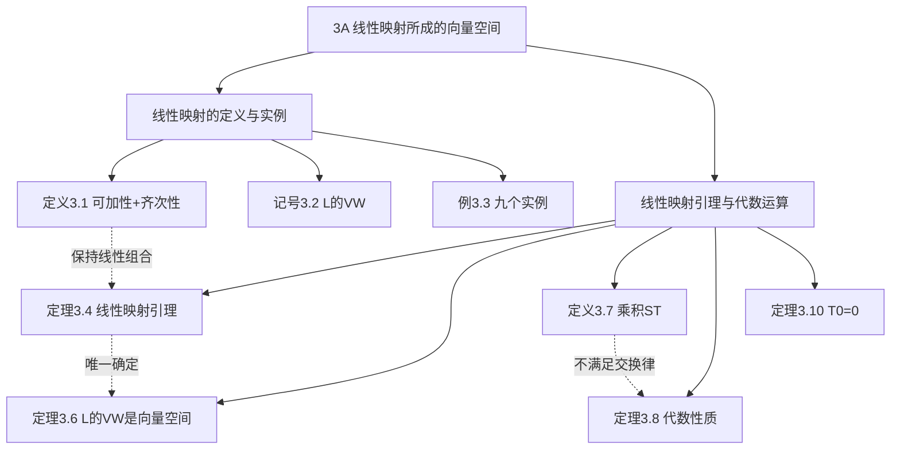

# 3A 线性映射所成的向量空间

> [!abstract] 本节概览
> 本节是第 3 章的起点，引入线性代数的核心研究对象——==线性映射==（linear map）。线性映射是保持向量空间结构的函数，它将一个向量空间中的线性关系"忠实"地传递到另一个向量空间。本节还证明了一个重要事实：==所有线性映射的集合本身也构成向量空间==。
>
> **逻辑链条**：线性映射定义（可加性+齐次性）→ 实例 → 线性映射引理（由基上的值唯一确定）→ $\mathcal{L}(V,W)$ 是向量空间 → 乘积运算（不可交换）
>
> **前置依赖**：[[1B 向量空间的定义]]（向量空间八条公理）、[[2B 基]]（定义 2.26、定理 2.28 唯一表示）
>
> **核心主线**：线性映射是向量空间之间的"结构保持映射"——它保持加法和标量乘法

---

## 一、线性映射的定义与实例

> [!def] 定义 3.1 线性映射
> 从 $V$ 到 $W$ 的==线性映射==是满足下列性质的函数 $T : V \to W$：
>
> **可加性**：对于所有 $u, v \in V$，$T(u + v) = Tu + Tv$
>
> **齐次性**：对于所有 $\lambda \in \mathbb{F}$ 和所有 $v \in V$，$T(\lambda v) = \lambda(Tv)$

> [!note] 记号 3.2 $\mathcal{L}(V,W)$、$\mathcal{L}(V)$
> - $\mathcal{L}(V,W)$ = 从 $V$ 到 $W$ 的全体线性映射构成的集合
> - $\mathcal{L}(V) = \mathcal{L}(V,V)$ = 从 $V$ 到自身的全体线性映射

> [!example] 例 3.3 线性映射的实例
> **零映射**：$0 \in \mathcal{L}(V,W)$，$0v = \mathbf{0}$（左侧是映射，右侧是零向量）
>
> **恒等算子**：$I \in \mathcal{L}(V)$，$Iv = v$
>
> **微分映射**：$D \in \mathcal{L}(\mathcal{P}(\mathbb{R}))$，$Dp = p'$（微积分基本规则 $(f+g)' = f'+g'$ 和 $(\lambda f)' = \lambda f'$ 的另一种表述）
>
> **积分映射**：$T \in \mathcal{L}(\mathcal{P}(\mathbb{R}), \mathbb{R})$，$Tp = \int_0^1 p$
>
> **与 $x^2$ 相乘**：$T \in \mathcal{L}(\mathcal{P}(\mathbb{R}))$，$(Tp)(x) = x^2 p(x)$
>
> **后向移位**：$T \in \mathcal{L}(\mathbb{F}^\infty)$，$T(x_1, x_2, x_3, \ldots) = (x_2, x_3, \ldots)$
>
> **$\mathbb{R}^3 \to \mathbb{R}^2$**：$T(x,y,z) = (2x - y + 3z, 7x + 5y - 6z)$
>
> **$\mathbb{F}^n \to \mathbb{F}^m$**：$T(x_1, \ldots, x_n) = (A_{1,1}x_1 + \cdots + A_{1,n}x_n, \ldots, A_{m,1}x_1 + \cdots + A_{m,n}x_n)$
>
> **多项式复合**：取定 $q \in \mathcal{P}(\mathbb{R})$，$(Tp)(x) = p(q(x))$

> [!important] 线性映射的本质
> 线性映射==保持线性结构==：它将线性组合映射为线性组合（Clemson MATH 8530 讲义、UW-Madison 讲义）：
> $$T(a_1 v_1 + \cdots + a_k v_k) = a_1 Tv_1 + \cdots + a_k Tv_k$$
> 这意味着：线性映射完全由它对基的作用决定（定理 3.4）。

---

## 二、线性映射引理与代数运算

### 2.1 线性映射引理

> [!thm] 定理 3.4 线性映射引理
> 假定 $v_1, \ldots, v_n$ 是 $V$ 的基且 $w_1, \ldots, w_n \in W$。那么存在唯一的线性映射 $T : V \to W$ 使得对每个 $k = 1, \ldots, n$ 都有 $Tv_k = w_k$。

> [!abstract] 证明思路
> **[存在性：用基定义映射]**：
>
> 定义 $T(c_1 v_1 + \cdots + c_n v_n) = c_1 w_1 + \cdots + c_n w_n$。因为 $v_1, \ldots, v_n$ 是基，每个 $v \in V$ 有唯一的表示，所以 $T$ 是良定义的函数。
>
> **[验证可加性]**：设 $u = a_1 v_1 + \cdots + a_n v_n$，$v = c_1 v_1 + \cdots + c_n v_n$：
> $$T(u+v) = T((a_1+c_1)v_1 + \cdots) = (a_1+c_1)w_1 + \cdots = Tu + Tv$$
>
> **[验证齐次性]**：$T(\lambda v) = T(\lambda c_1 v_1 + \cdots) = \lambda c_1 w_1 + \cdots = \lambda Tv$
>
> **[唯一性]**：设 $T' \in \mathcal{L}(V,W)$ 也满足 $T'v_k = w_k$。由齐次性 $T'(c_k v_k) = c_k w_k$，由可加性：
> $$T'(c_1 v_1 + \cdots + c_n v_n) = c_1 w_1 + \cdots + c_n w_n = T(c_1 v_1 + \cdots + c_n v_n)$$
> 所以 $T' = T$。$\blacksquare$

> [!success] 定理 3.4 的重要性
> 这是线性代数中最重要的定理之一：
> - **自由度**：你可以任意指定基向量的像，然后线性映射被唯一确定
> - **计算基础**：要定义一个线性映射，只需指定它在一组基上的作用
> - **矩阵表示的前奏**：取 $V = \mathbb{F}^n$、$W = \mathbb{F}^m$ 的标准基，指定基向量的像就是指定矩阵的列

### 2.2 $\mathcal{L}(V,W)$ 是向量空间

> [!def] 定义 3.5 $\mathcal{L}(V,W)$ 上的加法和标量乘法
> 设 $S, T \in \mathcal{L}(V,W)$ 且 $\lambda \in \mathbb{F}$：
> - $(S + T)v = Sv + Tv$
> - $(\lambda T)v = \lambda(Tv)$

> [!thm] 定理 3.6 $\mathcal{L}(V,W)$ 是向量空间
> 有了上面定义的加法和标量乘法，$\mathcal{L}(V,W)$ 就是向量空间。
>
> 加法恒等元是零映射 $0$（$0v = \mathbf{0}$）。

### 2.3 线性映射的乘积

> [!def] 定义 3.7 线性映射的乘积
> 如果 $T \in \mathcal{L}(U,V)$ 且 $S \in \mathcal{L}(V,W)$，那么乘积 $ST \in \mathcal{L}(U,W)$ 定义为：
> $$(ST)(u) = S(Tu)$$
>
> 注意：$ST$ 就是函数复合 $S \circ T$，但线性映射中通常用 $ST$ 而非 $S \circ T$。

> [!thm] 定理 3.8 线性映射乘积的代数性质
> **可结合性**：$(T_1 T_2)T_3 = T_1(T_2 T_3)$（当乘积有意义时）
>
> **恒等元**：$TI = IT = T$（$I$ 分别是定义域和到达域上的恒等算子）
>
> **分配律**：$(S_1 + S_2)T = S_1 T + S_2 T$ 且 $S(T_1 + T_2) = ST_1 + ST_2$

> [!example] 例 3.9 不可交换的线性映射
> 设 $D$ 是微分映射，$T$ 是"乘 $x^2$"映射，都 $\in \mathcal{L}(\mathcal{P}(\mathbb{R}))$：
> - $(DT)p(x) = x^2 p'(x)$（先微分再乘 $x^2$）
> - $(TD)p(x) = x^2 p'(x) + 2x p(x)$（先乘 $x^2$ 再微分，乘积法则）
>
> 所以 $DT \neq TD$。==线性映射的乘法不满足交换律==。

### 2.4 线性映射将零映射为零

> [!thm] 定理 3.10 $T(\mathbf{0}) = \mathbf{0}$
> 假设 $T$ 是由 $V$ 到 $W$ 的线性映射。那么 $T(\mathbf{0}) = \mathbf{0}$。

> [!note] 证明
> $T(\mathbf{0}) = T(\mathbf{0} + \mathbf{0}) = T(\mathbf{0}) + T(\mathbf{0})$。两边加上 $T(\mathbf{0})$ 的逆元，得 $T(\mathbf{0}) = \mathbf{0}$。$\blacksquare$

> [!important] 高中"线性函数"≠ 线性映射
> $f(x) = mx + b$ 只有当 $b = 0$ 时才是线性映射（由定理 3.10，$f(0) = b$ 必须等于 $0$）。高中代数中的"线性函数"实际上是"仿射函数"。

---

## 三、知识结构总览

---

## 四、核心思想与证明技巧

> [!success] 核心思想
> 1. **线性映射 = 结构保持映射**：它保持加法和标量乘法，从而保持所有线性关系。这是线性代数与其他数学分支的关键区别。
> 2. **由基上的值唯一确定**（定理 3.4）：线性映射的"自由度"等于 $\dim V \times \dim W$——你可以任意指定每个基向量的像。
> 3. **$\mathcal{L}(V,W)$ 本身是向量空间**：线性映射不仅可以研究单个映射，还可以研究映射之间的线性关系——这是后续构造对偶空间（第 3 章）和算子理论的基础。
> 4. **乘积不交换**：线性映射的乘积（复合）满足结合律和分配律，但==不满足交换律==。这与矩阵乘法的性质完全对应。

> [!tip] 证明技巧清单
> 1. **验证线性映射**：分别验证可加性和齐次性，缺一不可（习题 8/9 表明仅有其中一个不够）
> 2. **利用定理 3.4 定义映射**：指定基向量的像，自动得到线性映射
> 3. **利用 $T(\mathbf{0}) = \mathbf{0}$**：快速排除非线性函数（如 $f(x) = mx + b$，$b \neq 0$）
> 4. **验证 $\mathcal{L}(V,W)$ 是向量空间**：逐一验证八条公理，每条都归结为 $W$ 中的对应性质

---

## 五、补充理解与易混淆点

### 5.1 线性映射的直觉

线性映射是"保持直线和平面"的映射（UCL Ch4 讲义、Clemson MATH 8530 讲义）：

- **直线映射为直线**（或退化为一个点）
- **原点映射为原点**（定理 3.10）
- **等间距的点映射为等间距的点**

==直觉：线性映射是向量空间之间"最简单、最整齐"的映射——它不弯曲、不旋转、不平移，只做拉伸和剪切==。

**来源**：UCL Chapter 4 Linear Maps 讲义、Clemson MATH 8530 Slides。

### 5.2 为什么需要可加性和齐次性两个条件？

初学者常问：为什么不能只用一个条件？习题 8 和 9 给出了回答：

- 仅有齐次性 $\varphi(av) = a\varphi(v)$ **不足以**保证线性（习题 8）
- 仅有可加性 $\varphi(w+z) = \varphi(w) + \varphi(z)$ **也不足以**保证线性（习题 9）
- 两个条件==缺一不可==（UW-Madison Linear Transformations 讲义）

对于 $\mathbb{R}$ 上的映射，可加性可以推出有理数齐次性，但不能推出实数齐次性——需要额外的连续性假设才能从可加性推出完全的线性（这涉及更高深的数学工具）。

**来源**：UW-Madison Linear Transformations 讲义、MathOnline Linear Maps Examples。

### 5.3 常见误区

> [!danger] 误区1："高中线性函数就是线性映射"
> ❌ 错误认知：$f(x) = mx + b$ 是线性映射
> ✅ 正确理解：只有 $f(x) = mx$（即 $b = 0$）才是线性映射。$f(x) = mx + b$ 是==仿射函数==，不是线性映射。由定理 3.10，$f(0) = b$ 必须等于 $\mathbf{0}$

> [!danger] 误区2："线性映射保持所有性质"
> ❌ 错误认知：线性映射保持长度、角度、正交性等
> ✅ 正确理解：线性映射==只保证==保持加法和标量乘法。长度、角度、正交性等几何性质的保持需要额外的条件（第 7 章的==正交算子==、==自伴算子==等）

> [!danger] 误区3："cos 是线性映射"
> ❌ 错误认知：$\cos(x+y) = \cos x + \cos y$ 成立（从而 $\cos$ 是线性的）
> ✅ 正确理解：$\cos(x+y) = \cos x \cos y - \sin x \sin y \neq \cos x + \cos y$。$\cos$ 既不满足可加性也不满足齐次性（$\cos(2x) \neq 2\cos x$），所以不是线性映射。教材中特别指出：==线性映射在数学中并不如有些人想象的那般无处不在==

**来源**：UCL Chapter 4 Linear Maps 讲义、Clemson MATH 8530 Slides、UW-Madison Linear Transformations 讲义、OSU Ximera Linear Mappings and Bases。

---

## 六、习题精选

> [!todo] 本节习题
>
> | 编号 | 标题 | 核心考点 | 难度 |
> |:---:|---|---|:---:|
> | 1 | 判断线性映射 | 可加性+齐次性验证 | ⭐ |
> | 4 | 线性无关组的像 | 线性无关的保持 | ⭐⭐ |
> | 7 | 一维空间上的映射 | 乘以标量 | ⭐ |
> | 8 | 仅有齐次性不够 | 反例构造 | ⭐⭐ |
> | 11 | 与所有映射可交换 | 恒等算子的标量倍 | ⭐⭐⭐ |
> | 13 | 子空间上映射的扩充 | 定理 3.4 的应用 | ⭐⭐ |

### 习题 1：判断线性映射

> [!problem] 习题 1
> 设 $b, c \in \mathbb{R}$，定义 $T : \mathbb{R}^3 \to \mathbb{R}^2$ 为 $T(x, y, z) = (2x - 4y + 3z + b, 6x + cxyz)$。证明：$T$ 是线性的，当且仅当 $b = c = 0$。

> [!faq]- 查看解答
> **($\Leftarrow$)**：$b = c = 0$ 时，$T(x,y,z) = (2x-4y+3z, 6x)$。两个分量都是线性函数，所以 $T$ 是线性的。
>
> **($\Rightarrow$)**：若 $T$ 线性，则 $T(\mathbf{0}) = \mathbf{0}$（定理 3.10）。$T(0,0,0) = (b, 0)$，所以 $b = 0$。
>
> 再验证齐次性：$T(2,0,0) = (4, 12)$，但 $2T(1,0,0) = 2(2,6) = (4,12)$。看起来没问题。但检查 $T(1,1,1) = (1, 6+c)$，$T(0,1,0) + T(1,0,1) = (-4,0) + (5,6) = (1,6)$。由可加性 $T(1,1,1) = T(0,1,0) + T(1,0,1)$，得 $6+c = 6$，所以 $c = 0$。$\blacksquare$

### 习题 4：线性无关组的像

> [!problem] 习题 4
> 设 $T \in \mathcal{L}(V,W)$ 且 $v_1, \ldots, v_m$ 是 $V$ 中一组向量，使得 $Tv_1, \ldots, Tv_m$ 是 $W$ 中线性无关组。证明 $v_1, \ldots, v_m$ 线性无关。

> [!faq]- 查看解答
> **证明**：设 $a_1 v_1 + \cdots + a_m v_m = \mathbf{0}$。两边施加 $T$：
> $$a_1 Tv_1 + \cdots + a_m Tv_m = T(\mathbf{0}) = \mathbf{0}$$
>
> 因为 $Tv_1, \ldots, Tv_m$ 线性无关，所以 $a_1 = \cdots = a_m = 0$。$\blacksquare$
>
> **推论**：线性映射保持线性无关性（但未必保持张成性——像可能"缩小"）。

### 习题 7：一维空间上的映射

> [!problem] 习题 7
> 证明：如果 $\dim V = 1$ 且 $T \in \mathcal{L}(V)$，那么存在 $\lambda \in \mathbb{F}$ 使得对所有 $v \in V$ 有 $Tv = \lambda v$。

> [!faq]- 查看解答
> **证明**：设 $v \neq \mathbf{0}$ 是 $V$ 的基（因为 $\dim V = 1$）。令 $\lambda \in \mathbb{F}$ 使得 $Tv = \lambda v$（这样的 $\lambda$ 存在且唯一，因为 $\{v\}$ 是基，$Tv$ 必须是 $v$ 的标量倍）。
>
> 对任意 $u \in V$，$u = cv$（某个 $c \in \mathbb{F}$），则 $Tu = T(cv) = cTv = c(\lambda v) = \lambda(cv) = \lambda u$。$\blacksquare$

### 习题 8：仅有齐次性不够

> [!problem] 习题 8
> 给出一例：函数 $\varphi : \mathbb{R}^2 \to \mathbb{R}$，使得 $\varphi(av) = a\varphi(v)$ 对所有 $a \in \mathbb{R}$ 和所有 $v \in \mathbb{R}^2$ 成立，但 $\varphi$ 不是线性的。

> [!faq]- 查看解答
> 定义 $\varphi(x, y) = \frac{x^3}{x^2 + y^2}$（当 $(x,y) \neq (0,0)$），$\varphi(0,0) = 0$。
>
> **齐次性**：$\varphi(a(x,y)) = \varphi(ax, ay) = \frac{a^3 x^3}{a^2 x^2 + a^2 y^2} = a \cdot \frac{x^3}{x^2+y^2} = a\varphi(x,y)$。✓
>
> **不满足可加性**：$\varphi(1,0) = 1$，$\varphi(0,1) = 0$，$\varphi(1,1) = \frac{1}{2}$。但 $\varphi(1,0) + \varphi(0,1) = 1 \neq \frac{1}{2} = \varphi((1,0)+(0,1))$。✗
>
> 所以 $\varphi$ 满足齐次性但不满足可加性，不是线性映射。$\blacksquare$

### 习题 11：与所有映射可交换

> [!problem] 习题 11
> 设 $V$ 是有限维的，$T \in \mathcal{L}(V)$。证明：$T$ 是恒等算子的标量倍，当且仅当 $ST = TS$ 对任意 $S \in \mathcal{L}(V)$ 都成立。

> [!faq]- 查看解答
> **($\Leftarrow$)**：若 $T = \lambda I$，则 $ST = S(\lambda I) = \lambda S = (\lambda I)S = TS$。✓
>
> **($\Rightarrow$)**：设 $ST = TS$ 对所有 $S \in \mathcal{L}(V)$ 成立。取 $V$ 的基 $v_1, \ldots, v_n$。
>
> 对任意 $i \neq j$，定义 $S_{ij} \in \mathcal{L}(V)$ 为 $S_{ij}v_i = v_j$，$S_{ij}v_k = \mathbf{0}$（$k \neq i$）。由定理 3.4，这样的 $S_{ij}$ 存在。
>
> $TS_{ij}v_i = Tv_j$，$S_{ij}Tv_i = S_{ij}(Tv_i)$。由 $TS_{ij} = S_{ij}T$ 得 $Tv_j = S_{ij}(Tv_i)$。
>
> 设 $Tv_i = \sum_k a_k v_k$，则 $S_{ij}(Tv_i) = a_i v_j$。所以 $Tv_j = a_i v_j$。
>
> 这说明 $T$ 将每个基向量映射为自身的标量倍。令 $Tv_1 = \lambda_1 v_1$，$Tv_2 = \lambda_2 v_2$。
>
> 再取 $S = S_{12}$（将 $v_1$ 映到 $v_2$）：$TS_{12}v_1 = Tv_2 = \lambda_2 v_2$，$S_{12}Tv_1 = S_{12}(\lambda_1 v_1) = \lambda_1 v_2$。所以 $\lambda_1 = \lambda_2$。
>
> 类似地所有 $\lambda_k$ 相等，设为 $\lambda$。所以 $T = \lambda I$。$\blacksquare$

### 习题 13：子空间上映射的扩充

> [!problem] 习题 13
> 设 $V$ 是有限维的。证明：$V$ 的子空间上的任一线性映射都可以扩充为 $V$ 上的线性映射。

> [!faq]- 查看解答
> **证明**：设 $U$ 是 $V$ 的子空间，$S \in \mathcal{L}(U,W)$。
>
> 取 $U$ 的基 $u_1, \ldots, u_m$，扩充为 $V$ 的基 $u_1, \ldots, u_m, v_1, \ldots, v_k$（[[2B 基|定理 2.32]]）。
>
> 定义 $T \in \mathcal{L}(V,W)$ 为：$Tu_j = Su_j$（$j = 1, \ldots, m$），$Tv_j = \mathbf{0}$（$j = 1, \ldots, k$）。
>
> 由 [[#2-1-线性映射引理|定理 3.4]]，这样的 $T$ 存在且唯一。对 $u \in U$，$u = c_1 u_1 + \cdots + c_m u_m$，所以 $Tu = c_1 Su_1 + \cdots + c_m Su_m = Su$。$\blacksquare$

---

## 七、视频学习指南

> [!info] 视频资源
>
> | 视频主题 | 对应笔记模块 | 平台 |
> |---|---|---|
> | 线性映射的定义 | 一、线性映射的定义与实例 | B站 |
> | 线性映射引理 | 二、线性映射引理与代数运算 | B站 |
> | L(V,W) 是向量空间 | 二、L(V,W) 是向量空间 | B站 |

> [!info] 视频精要
> 暂无对应视频的详细精要。建议在学习时关注以下要点：
> - 线性映射的两个条件（可加性+齐次性）缺一不可
> - 定理 3.4 是后续矩阵表示（3B）的理论基础
> - $\mathcal{L}(V,W)$ 是向量空间这一事实在后续章节中反复使用
> - 线性映射的乘积不交换——这与矩阵乘法一致

---

## 八、教材原文
#学习/线性代数/线性映射/线性映射的定义
