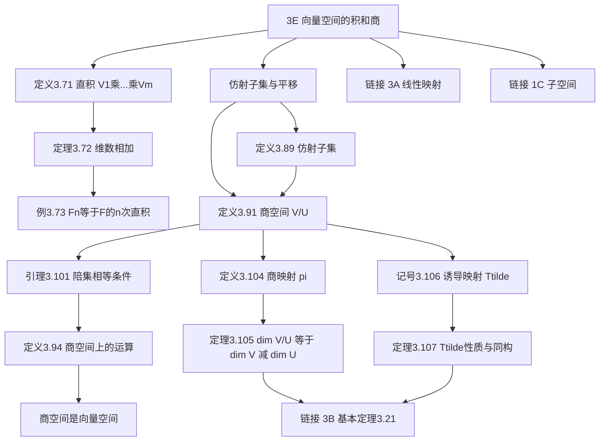

# 3E 向量空间的积和商

> [!abstract] 本节概览
> 本节讨论向量空间的两种重要构造——==直积==（product）与==商空间==（quotient space）。直积将多个向量空间"打包"为一个更大的空间，维数相加；商空间则将向量空间按子空间"折叠"为更小的空间，维数相减。商空间理论还导出了==诱导映射== $\tilde{T}$，它将任意线性映射分解为商映射（满射）与单射的复合，从而得到 $V/(\text{null}\,T) \cong \text{range}\,T$——这是[[3B 零空间和值域|基本定理 3.21]]的几何版本。
>
> **逻辑链条**：直积定义与维数公式 → 仿射子集与平移 → 商空间 $V/U$ 定义 → 商空间上的运算与良定义性 → 商映射 $\pi$ → 维数公式 $\dim V/U = \dim V - \dim U$ → 诱导映射 $\tilde{T}$ → $T = \tilde{T} \circ \pi$ 分解
>
> **前置依赖**：[[3A 线性映射所成的向量空间]]（线性映射定义）、[[3B 零空间和值域]]（零空间、值域、基本定理 3.21）、[[1C 子空间]]（子空间定义与判定）、[[2C 维数]]（维数的基本性质）
>
> **核心主线**：直积是"拼接"（维数相加），商空间是"折叠"（维数相减）；诱导映射 $\tilde{T}$ 通过商掉零空间，将任意线性映射变为单射，实现线性映射的标准分解

---

## 一、向量空间的积

### 1.1 直积的定义

> [!def] 定义 3.71：向量空间的积（product of vector spaces）
> 设 $V_1, \ldots, V_m$ 都是 $\mathbb{F}$ 上的向量空间。$V_1 \times \cdots \times V_m$ 定义为所有有序 $m$ 元组 $(v_1, \ldots, v_m)$（其中 $v_k \in V_k$）构成的集合，配备以下运算：
> - **加法**：$(v_1, \ldots, v_m) + (w_1, \ldots, w_m) = (v_1 + w_1, \ldots, v_m + w_m)$
> - **标量乘法**：$\lambda(v_1, \ldots, v_m) = (\lambda v_1, \ldots, \lambda v_m)$
>
> 其中 $\lambda \in \mathbb{F}$，加法和标量乘法都是逐分量进行的。

> [!note] 学习注解
> - 直积的零向量为 $(0, \ldots, 0)$（每个分量取对应空间的零向量）。
> - $(v_1, \ldots, v_m)$ 的加法逆元为 $(-v_1, \ldots, -v_m)$。
> - 直积的概念在 [[1C 子空间]] 中已有初步介绍，这里做系统化处理。

### 1.2 积的维数

> [!thm] 定理 3.72：积的维数等于各空间维数之和
> 设 $V_1, \ldots, V_m$ 都是有限维向量空间，则 $V_1 \times \cdots \times V_m$ 是有限维的，且
> $$\dim(V_1 \times \cdots \times V_m) = \dim V_1 + \cdots + \dim V_m$$

> [!abstract] 证明思路
> 为每个 $V_k$ 选取一组基 $\mathcal{B}_k = \{e_{k,1}, \ldots, e_{k,d_k}\}$，其中 $d_k = \dim V_k$。
>
> **[构造标准基元组]：** 对每个 $k$ 和每个 $j = 1, \ldots, d_k$，构造 $V_1 \times \cdots \times V_m$ 中的元素 $\mathbf{e}_{k,j}$：第 $k$ 个分量为 $e_{k,j}$，其余分量全为 $0$。
>
> **[线性无关性]：** 设 $\sum_{k,j} \alpha_{k,j} \mathbf{e}_{k,j} = 0$。逐分量观察第 $k$ 个分量得 $\sum_j \alpha_{k,j} e_{k,j} = 0$，由 $\mathcal{B}_k$ 的线性无关性得所有 $\alpha_{k,j} = 0$。
>
> **[张成性]：** 任取 $(v_1, \ldots, v_m) \in V_1 \times \cdots \times V_m$，将每个 $v_k$ 用 $\mathcal{B}_k$ 展开，即可表示为 $\mathbf{e}_{k,j}$ 的线性组合。
>
> 因此 $\{\mathbf{e}_{k,j}\}$ 构成 $V_1 \times \cdots \times V_m$ 的基，基的长度为 $\sum_{k=1}^m d_k = \sum_{k=1}^m \dim V_k$。
>
> $\blacksquare$

### 1.3 典型例子

> [!example] 例 3.73：$\mathbb{F}^n$ 作为直积
> $\mathbb{F}^n = \underbrace{\mathbb{F} \times \cdots \times \mathbb{F}}_{n \text{ 个}}$，因此 $\dim \mathbb{F}^n = n$。
>
> 这与 [[2C 维数]] 中的结果一致——$\mathbb{F}^n$ 的标准基 $\{(1,0,\ldots,0), (0,1,0,\ldots,0), \ldots, (0,\ldots,0,1)\}$ 恰好是直积构造中的标准基元组。

> [!note] 学习注解
> 以下两个同构关系留作习题（习题 3、4），它们揭示了直积与线性映射空间之间的深刻联系：
> - $\mathcal{L}(V_1 \times \cdots \times V_m, W) \cong \mathcal{L}(V_1, W) \times \cdots \times \mathcal{L}(V_m, W)$
> - $\mathcal{L}(V, W_1 \times \cdots \times W_m) \cong \mathcal{L}(V, W_1) \times \cdots \times \mathcal{L}(V, W_m)$
>
> 直觉：一个从积空间出发的线性映射，等价于分别从每个分量空间出发的线性映射的"组合"。

---

## 二、商空间

### 2.1 仿射子集与平移

> [!def] 定义 3.89：仿射子集（affine subset）
> 设 $V$ 是向量空间，$U \subseteq V$ 是子空间。$V$ 的一个子集如果可以写成 $v + U$ 的形式（其中 $v \in V$），则称之为 $V$ 的一个**仿射子集**。

> [!def] 定义 3.90：平移（translate）
> 对于 $v \in V$ 和 $V$ 的子空间 $U$，集合 $v + U$ 称为 $U$ 的一个**平移**（也称为 $U$ 过 $v$ 的==陪集==，coset）。

> [!example] 例：$\mathbb{R}^2$ 和 $\mathbb{R}^3$ 中的平移
> - 在 $\mathbb{R}^2$ 中，设 $U$ 是过原点的直线，则 $v + U$ 是过点 $v$ 且与 $U$ 平行的直线。
> - 在 $\mathbb{R}^3$ 中，设 $U$ 是过原点的平面，则 $v + U$ 是过点 $v$ 且与 $U$ 平行的平面。
> - 所有平移彼此平行，且"铺满"整个空间——每个向量恰好属于一个平移。

> [!def] 定义 3.91：商空间（quotient space）
> 设 $U$ 是 $V$ 的子空间。**商空间** $V/U$ 定义为 $U$ 的所有平移构成的集合：
> $$V/U = \{v + U : v \in V\}$$

> [!thm] 引理 3.101：陪集相等的条件
> 设 $U$ 是 $V$ 的子空间，$v_1, v_2 \in V$，则
> $$v_1 + U = v_2 + U \iff v_1 - v_2 \in U$$

> [!abstract] 证明思路
> **($\Rightarrow$)**：若 $v_1 + U = v_2 + U$，则 $v_1 = v_1 + 0 \in v_1 + U = v_2 + U$，故 $v_1 = v_2 + u$（某个 $u \in U$），即 $v_1 - v_2 = u \in U$。
>
> **($\Leftarrow$)**：若 $v_1 - v_2 \in U$，设 $u \in U$，则 $v_1 + u = v_2 + (v_1 - v_2) + u \in v_2 + U$（因为 $v_1 - v_2 \in U$ 且 $U$ 对加法封闭），故 $v_1 + U \subseteq v_2 + U$。类似地 $v_2 + U \subseteq v_1 + U$。
>
> $\blacksquare$

> [!note] 学习注解
> ==引理 3.101 是商空间理论的基石==。由此可得两个重要推论：
> 1. 两个陪集要么相等，要么不相交（若 $(v_1+U) \cap (v_2+U) \neq \emptyset$，则存在 $u_1, u_2 \in U$ 使 $v_1+u_1 = v_2+u_2$，故 $v_1-v_2 = u_2-u_1 \in U$，由引理得 $v_1+U = v_2+U$）。
> 2. $V/U$ 中的陪集构成 $V$ 的一个划分——每个向量恰好属于唯一一个陪集。

### 2.2 商空间的向量空间结构

> [!def] 定义 3.94：商空间上的加法与标量乘法
> 设 $U$ 是 $V$ 的子空间。在 $V/U$ 上定义：
> - **加法**：$(v_1 + U) + (w_1 + U) = (v_1 + w_1) + U$
> - **标量乘法**：$\lambda(v_1 + U) = (\lambda v_1) + U$
>
> 其中 $v_1, w_1 \in V$，$\lambda \in \mathbb{F}$。

> [!thm] 定理：商空间是向量空间
> 带有上述加法和标量乘法的 $V/U$ 构成 $\mathbb{F}$ 上的向量空间。

> [!abstract] 证明思路
> **[良定义性验证——加法]：** 设 $v_1 + U = v_2 + U$ 且 $w_1 + U = w_2 + U$，需证 $(v_1 + w_1) + U = (v_2 + w_2) + U$。
>
> 由引理 3.101：$v_1 - v_2 \in U$ 且 $w_1 - w_2 \in U$。因为 $U$ 对加法封闭：
> $$(v_1 + w_1) - (v_2 + w_2) = (v_1 - v_2) + (w_1 - w_2) \in U$$
> 再次利用引理 3.101 即得 $(v_1 + w_1) + U = (v_2 + w_2) + U$。
>
> **[良定义性验证——标量乘法]：** 设 $v_1 + U = v_2 + U$，即 $v_1 - v_2 \in U$。则 $\lambda(v_1 - v_2) \in U$（$U$ 对标量乘法封闭），即 $\lambda v_1 - \lambda v_2 \in U$，故 $(\lambda v_1) + U = (\lambda v_2) + U$。
>
> **[验证向量空间公理]：** $V/U$ 的零向量为 $0 + U = U$（即子空间 $U$ 本身）。$v + U$ 的加法逆元为 $(-v) + U$。其余公理由 $V$ 的公理自然继承。
>
> $\blacksquare$

> [!danger] 关键提醒
> ==良定义性验证不可省略==！同一个陪集有多种代表元（$v + U = v' + U$ 当 $v - v' \in U$），必须证明运算结果不依赖于代表元的选取。这是商结构理论中最基本也最容易出错的技巧。

### 2.3 商映射与维数公式

> [!def] 定义 3.104：商映射（quotient map）
> 设 $U$ 是 $V$ 的子空间。**商映射** $\pi: V \to V/U$ 定义为
> $$\pi(v) = v + U$$

> [!note] 学习注解
> $\pi$ 是线性映射：$\pi(v+w) = (v+w)+U = (v+U)+(w+U) = \pi(v)+\pi(w)$，$\pi(\lambda v) = (\lambda v)+U = \lambda(v+U) = \lambda\pi(v)$。$\pi$ 是满射（每个陪集 $v+U$ 都是某个向量的像）。

> [!thm] 定理 3.105：商空间的维数
> 设 $V$ 是有限维的，$U$ 是 $V$ 的子空间，则
> $$\dim V/U = \dim V - \dim U$$

> [!abstract] 证明思路
> 令 $\pi: V \to V/U$ 为商映射。
>
> **[确定零空间]：** $\text{null}\,\pi = \{v \in V : v + U = 0 + U\} = \{v \in V : v \in U\} = U$（由引理 3.101）。
>
> **[确定值域]：** $\text{range}\,\pi = V/U$（$\pi$ 是满射）。
>
> **[应用基本定理]：** 由 [[3B 零空间和值域|基本定理 3.21]]：
> $$\dim V = \dim(\text{null}\,\pi) + \dim(\text{range}\,\pi) = \dim U + \dim V/U$$
> 移项即得 $\dim V/U = \dim V - \dim U$。
>
> $\blacksquare$

> [!note] 学习注解
> ==这个证明极其简洁优美==：商映射的零空间恰好是 $U$，值域恰好是 $V/U$，基本定理直接给出维数公式。
>
> **直觉**：商空间就是把 $U$ "折叠掉"，所以维数 = 原空间维数 $-$ 被折叠的维数。

### 2.4 诱导映射 $\tilde{T}$

> [!def] 记号 3.106：诱导映射 $\tilde{T}$
> 设 $T \in \mathcal{L}(V, W)$。定义 $\tilde{T}: V/(\text{null}\,T) \to W$ 为
> $$\tilde{T}(v + \text{null}\,T) = Tv$$

> [!abstract] 证明思路（良定义性）
> **[验证 $\tilde{T}$ 良定义]：** 设 $u + \text{null}\,T = v + \text{null}\,T$，由引理 3.101 得 $u - v \in \text{null}\,T$，故 $T(u - v) = 0$，即 $Tu = Tv$。因此 $\tilde{T}$ 的值不依赖于陪集代表元的选取。
>
> $\blacksquare$

> [!thm] 定理 3.107：$\tilde{T}$ 的性质
> 设 $T \in \mathcal{L}(V, W)$，$\pi: V \to V/(\text{null}\,T)$ 为商映射，则：
> - **(a)** $\tilde{T} \circ \pi = T$
> - **(b)** $\tilde{T}$ 是==单射==
> - **(c)** $\text{range}\,\tilde{T} = \text{range}\,T$
> - **(d)** $V/(\text{null}\,T) \cong \text{range}\,T$（将 $\tilde{T}$ 视为映射到 $\text{range}\,T$ 的映射时，它是同构）

> [!abstract] 证明思路
> **[(a) 分解等式]：** 对任意 $v \in V$，$(\tilde{T} \circ \pi)(v) = \tilde{T}(v + \text{null}\,T) = Tv$。故 $\tilde{T} \circ \pi = T$。
>
> **[(b) 单射性]：** 设 $\tilde{T}(v + \text{null}\,T) = 0$，则 $Tv = 0$，故 $v \in \text{null}\,T$，从而 $v + \text{null}\,T = 0 + \text{null}\,T$。即 $\text{null}\,\tilde{T} = \{0 + \text{null}\,T\}$，由 [[3B 零空间和值域|命题 3.16]] 得 $\tilde{T}$ 是单射。
>
> **[(c) 值域相等]：** $\text{range}\,\tilde{T} = \{Tv : v \in V\} = \text{range}\,T$，由定义直接可得。
>
> **[(d) 同构]：** 由 (b)，$\tilde{T}: V/(\text{null}\,T) \to \text{range}\,T$ 是单射；由 (c)，它是满射。因此 $\tilde{T}$ 是双射线性映射，即同构。
>
> $\blacksquare$

> [!note] 学习注解
> ==$\tilde{T}$ 是 $T$ 的"改良版"==——通过把零空间商掉（换成商空间作为定义域），$\tilde{T}$ 变成了单射，但值域不变。任何线性映射都可以分解为：
> $$T = \tilde{T} \circ \pi$$
> 其中 $\pi$ 是商映射（满射），$\tilde{T}$ 是单射。这就是线性映射的==标准分解==。
>
> 特别地，$V/(\text{null}\,T) \cong \text{range}\,T$ 是 [[3B 零空间和值域|基本定理 3.21]]（$\dim V = \dim(\text{null}\,T) + \dim(\text{range}\,T)$）的几何版本——不仅维数相等，空间本身也同构。

---

## 三、知识结构总览

---

## 四、核心思想与证明技巧

> [!success] 核心思想
> 1. **直积将多个向量空间"打包"为一个**——维数相加。每个分量独立运作，互不干扰。
> 2. **商空间将向量空间"折叠"**——把子空间 $U$ 坍塌为零，维数相减。商空间的元素是陪集（平移），不是单个向量。
> 3. **诱导映射 $\tilde{T}$ 是"消除零空间"的标准技术**——将任意线性映射变为单射，实现 $T = \tilde{T} \circ \pi$ 的标准分解。
> 4. **$V/(\text{null}\,T) \cong \text{range}\,T$ 是基本定理的几何版本**——不仅维数相等，空间本身也同构，揭示了线性映射的内在结构。

> [!tip] 证明技巧清单
> 1. **Well-definedness 验证**（商空间运算、$\tilde{T}$ 的定义）：必须检查代表元选取的无关性——设两套代表元给出同一陪集，证明运算结果也在同一陪集。
> 2. **基本定理应用**：$\dim V = \dim(\text{null}\,\pi) + \dim(\text{range}\,\pi) \Rightarrow \dim V/U = \dim V - \dim U$——商映射的零空间恰好是 $U$。
> 3. **仿射子集的等价刻画**：$v + U = w + U \iff v - w \in U$——这是陪集运算的基础。
> 4. **诱导映射分解**：$T = \tilde{T} \circ \pi$，将任意线性映射分解为商映射（满射）+ 单射——这是线性映射的标准分解模式。

---

## 五、补充理解与易混淆点

### 5.1 商空间的几何直觉

商空间 $V/U$ 的几何含义可以通过低维例子直观理解：

- 在 $\mathbb{R}^2$ 中，若 $U$ 是过原点的直线，则 $V/U$ 是所有与 $U$ 平行的直线的集合。每条平行线是一个陪集，商空间本身是一维的（参数化为"到 $U$ 的有符号距离"）。
- 在 $\mathbb{R}^3$ 中，若 $U$ 是过原点的平面，则 $V/U$ 是所有与 $U$ 平行的平面的集合。商空间本身是一维的。
- 在 $\mathbb{R}^3$ 中，若 $U$ 是过原点的直线，则 $V/U$ 是所有与 $U$ 平行的直线的集合。商空间本身是二维的。

商操作的本质是"遗忘"沿 $U$ 方向的信息，只保留"垂直于 $U$ 的分量"。正如 Cornell 大学 Kassabov 的讲义中所指出，商空间的等价关系 $v_1 \equiv v_2 \pmod{U}$ 就是将相差 $U$ 中元素的向量视为同一类。Stanford 大学 Conrad 的 Math 396 讲义进一步强调，陪集 $v + U$ 就是等价关系下的等价类。

**Sources**：Cornell Kassabov *Quotient Spaces* 讲义；Stanford Conrad Math 396 *Quotient Spaces*；University of Bath MA20216 *Algebra 2A* notes

### 5.2 商空间的代数意义：模掉子空间

商空间 $V/U$ 的代数含义是"将 $U$ 模掉"（modulo $U$）——把相差 $U$ 中元素的向量等同起来。这与模运算 $\mathbb{Z}/n\mathbb{Z}$ 完全类似：$\mathbb{Z}/n\mathbb{Z}$ 将相差 $n$ 的倍数的整数视为同一类，$V/U$ 将相差 $U$ 中元素的向量视为同一类。

商空间还满足一个重要的==泛性质==（universal property）：若 $T \in \mathcal{L}(V, W)$ 且 $U \subseteq \text{null}\,T$，则 $T$ 可以唯一地通过 $V/U$ 分解——即存在唯一的 $S \in \mathcal{L}(V/U, W)$ 使得 $T = S \circ \pi$。这正是诱导映射 $\tilde{T}$ 的本质。

**Sources**：Grokipedia *Quotient space (linear algebra)*；CSDN 丘维声高等代数课程笔记；Alquds Wiki *Quotient Space*

### 5.3 直积与直和的关系

对于有限个向量空间 $V_1, \ldots, V_m$，直积 $V_1 \times \cdots \times V_m$ 与直和 $V_1 \oplus \cdots \oplus V_m$ 作为向量空间是==同一个对象==——元素都是有序 $m$ 元组，运算都是逐分量进行。

然而，对于**无限个**向量空间，两者产生本质区别：
- **直积** $\prod_{i \in I} V_i$：允许所有选取函数 $(v_i)_{i \in I}$，每个分量任意。
- **直和** $\bigoplus_{i \in I} V_i$：只允许**有限支撑**的选取函数，即只有有限个分量非零。

在有限维线性代数中，这个区别不会出现，但在泛函分析和同调代数中至关重要。

**Sources**：Grokipedia *Direct product*；Clemson Macauley *Lecture 1.3: Direct products and sums*；CSDN 直和直积笛卡尔积区别

### 5.4 常见误区

> [!danger] 误区 1：商空间的元素是向量
> ❌ 认为 $V/U$ 的元素仍然是 $V$ 中的单个向量。
> ✅ $V/U$ 的元素是==陪集==（子空间的平移），即形如 $v + U$ 的**集合**。陪集本身是一个集合，包含无穷多个向量，不是单个向量。
>
> Source：Cornell Kassabov *Quotient Spaces* 讲义；Stanford Conrad Math 396

> [!danger] 误区 2：$V/U$ 的维数等于 $\dim U$
> ❌ 混淆商空间维数与子空间维数。
> ✅ $\dim V/U = \dim V - \dim U$，是维数之差而非子空间维数。商空间"折叠掉"了 $U$ 的维度，维数应该变小而非等于 $U$ 的维数。
>
> Source：LADR Thm 3.105；CSDN 丘维声高等代数课程笔记

> [!danger] 误区 3：商空间的加法可以直接对集合做，不需要验证良定义性
> ❌ 认为 $(v + U) + (w + U) = (v + w) + U$ 天然成立。
> ✅ 必须验证：如果选取不同的代表元 $v' + U = v + U$ 和 $w' + U = w + U$，结果 $(v' + w') + U$ 是否等于 $(v + w) + U$。这依赖于 $U$ 是子空间的封闭性（对加法和标量乘法封闭）。良定义性验证是商空间理论中最容易遗漏的步骤。
>
> Source：Georgia Tech functional analysis notes；University of Bath MA22020 *Quotients*

> [!danger] 误区 4：$\tilde{T}$ 和 $T$ 是同一个映射
> ❌ 混淆 $\tilde{T}: V/(\text{null}\,T) \to W$ 与 $T: V \to W$。
> ✅ $\tilde{T}$ 的定义域是商空间 $V/(\text{null}\,T)$，不是 $V$。$\tilde{T}$ 通过 $T = \tilde{T} \circ \pi$ 与 $T$ 联系。$\tilde{T}$ 是单射（零空间已被商掉），而 $T$ 可能不是单射。两者的定义域完全不同。
>
> Source：LADR Thm 3.107；CSDN 商空间应用笔记

---

## 六、习题精选

> [!todo] 推荐习题一览
> | 习题 | 核心考点 | 难度 |
> |:---:|---|:---:|
> | 习题 1 | 线性映射的图是子空间 | ★★☆ |
> | 习题 6 | 平移的唯一性 | ★★☆ |
> | 习题 8 | 线性方程组解集的结构 | ★★★ |
> | 习题 9 | 仿射子集的等价刻画 | ★★★ |
> | 习题 13 | 商空间有限维时 $V \cong U \times V/U$ | ★★★ |
> | 习题 19 | 通过商映射分解的条件 | ★★☆ |

---

> [!problem] 习题 1：线性映射的图
> 设 $V$ 和 $W$ 是 $\mathbb{F}$ 上的向量空间。$T: V \to W$ 的**图**（graph）定义为 $\{(v, Tv) \in V \times W : v \in V\}$。证明：$T$ 是线性映射当且仅当 $T$ 的图是 $V \times W$ 的子空间。

> [!faq]- 查看解答
> **($\Rightarrow$)**：设 $T$ 是线性映射。令 $G = \{(v, Tv) : v \in V\}$。
> - $(0, T0) = (0, 0) \in G$。
> - 若 $(v, Tv), (w, Tw) \in G$，则 $(v, Tv) + (w, Tw) = (v + w, Tv + Tw) = (v + w, T(v + w)) \in G$（由可加性）。
> - 若 $(v, Tv) \in G$，$\lambda \in \mathbb{F}$，则 $\lambda(v, Tv) = (\lambda v, \lambda Tv) = (\lambda v, T(\lambda v)) \in G$（由齐次性）。
> 故 $G$ 是 $V \times W$ 的子空间。
>
> **($\Leftarrow$)**：设 $G$ 是 $V \times W$ 的子空间。
> - 可加性：$(v, Tv), (w, Tw) \in G \Rightarrow (v+w, Tv+Tw) \in G$（$G$ 对加法封闭）。但 $(v+w, T(v+w)) \in G$，由图的定义得 $Tv + Tw = T(v+w)$。
> - 齐次性：$(v, Tv) \in G \Rightarrow (\lambda v, \lambda Tv) \in G$（$G$ 对标量乘法封闭）。但 $(\lambda v, T(\lambda v)) \in G$，故 $\lambda Tv = T(\lambda v)$。
>
> 因此 $T$ 是线性映射。

---

> [!problem] 习题 6：平移的唯一性
> 设 $U$ 和 $W$ 都是 $V$ 的子空间，$v, x \in V$。证明：若 $v + U = x + W$，则 $U = W$。

> [!faq]- 查看解答
> 设 $v + U = x + W$。
>
> 由引理 3.101：$v - x \in U$ 且 $v - x \in W$。
>
> **证明 $U \subseteq W$**：任取 $u \in U$，则 $v + u \in v + U = x + W$，故存在 $w \in W$ 使 $v + u = x + w$，即 $u = (x - v) + w$。因为 $x - v = -(v - x) \in W$（$v - x \in W$ 且 $W$ 是子空间），且 $w \in W$，所以 $u \in W$。
>
> **证明 $W \subseteq U$**：同理，任取 $w \in W$，$x + w \in x + W = v + U$，故存在 $u \in U$ 使 $x + w = v + u$，即 $w = (v - x) + u$。因为 $v - x \in U$，所以 $w \in U$。
>
> 因此 $U = W$。

---

> [!problem] 习题 8：线性方程组解集的结构
> 设 $T \in \mathcal{L}(V, W)$，$c \in W$。
> (a) 证明：$\{x \in V : Tx = c\}$ 或为空集，或为 $\text{null}\,T$ 的一个平移。
> (b) 用 (a) 的结论解释线性方程组 $Ax = c$ 的解集结构。

> [!faq]- 查看解答
> **(a)** 若 $\{x : Tx = c\} = \emptyset$，结论已成立。
>
> 设 $\{x : Tx = c\} \neq \emptyset$，取 $x_0 \in V$ 使 $Tx_0 = c$。
>
> 对任意 $x \in V$：
> $$Tx = c \iff Tx = Tx_0 \iff T(x - x_0) = 0 \iff x - x_0 \in \text{null}\,T \iff x \in x_0 + \text{null}\,T$$
>
> 因此 $\{x : Tx = c\} = x_0 + \text{null}\,T$，即 $\text{null}\,T$ 的平移。
>
> **(b)** 线性方程组 $Ax = c$ 中，令 $T(x) = Ax$，则 $T \in \mathcal{L}(\mathbb{F}^n, \mathbb{F}^m)$。
> - 若方程组不相容（无解），则解集为空集。
> - 若方程组相容，$x_0$ 是一个特解，则解集 $= x_0 + \text{null}\,A$（特解 $+$ 齐次方程的通解）。这正是线性代数中"解的结构定理"的标准表述。

---

> [!problem] 习题 9：仿射子集的等价刻画
> 设 $V$ 是 $\mathbb{F}$ 上的向量空间，$A \subseteq V$ 非空。证明：$A$ 是仿射子集当且仅当对所有 $v, w \in A$ 和所有 $\lambda \in \mathbb{F}$，有 $\lambda v + (1 - \lambda)w \in A$。

> [!faq]- 查看解答
> **($\Rightarrow$)**：设 $A = v_0 + U$（$U$ 是子空间）。对任意 $v, w \in A$，存在 $u_1, u_2 \in U$ 使 $v = v_0 + u_1$，$w = v_0 + u_2$。则
> $$\lambda v + (1 - \lambda)w = \lambda(v_0 + u_1) + (1 - \lambda)(v_0 + u_2) = v_0 + (\lambda u_1 + (1 - \lambda)u_2)$$
> 因为 $U$ 是子空间，$\lambda u_1 + (1 - \lambda)u_2 \in U$，故 $\lambda v + (1 - \lambda)w \in v_0 + U = A$。
>
> **($\Leftarrow$)**：设 $A$ 非空且满足条件。取 $v_0 \in A$，令 $U = \{a - v_0 : a \in A\}$。
>
> **$U$ 非空**：$0 = v_0 - v_0 \in U$。
>
> **$U$ 对加法封闭**：设 $u_1, u_2 \in U$，即 $v_0 + u_1, v_0 + u_2 \in A$。取 $\lambda = \frac{1}{2}$：
> $$\frac{1}{2}(v_0 + u_1) + \frac{1}{2}(v_0 + u_2) = v_0 + \frac{u_1 + u_2}{2} \in A$$
> 故 $\frac{u_1 + u_2}{2} \in U$。再取 $v = v_0 + \frac{u_1 + u_2}{2} \in A$，$w = v_0 \in A$，$\lambda = 2$：
> $$2\left(v_0 + \frac{u_1 + u_2}{2}\right) + (1 - 2)v_0 = v_0 + (u_1 + u_2) \in A$$
> 故 $u_1 + u_2 \in U$。
>
> **$U$ 对标量乘法封闭**：设 $u \in U$，即 $v_0 + u \in A$。取 $v = v_0 + u \in A$，$w = v_0 \in A$，$\lambda \in \mathbb{F}$：
> $$\lambda(v_0 + u) + (1 - \lambda)v_0 = v_0 + \lambda u \in A$$
> 故 $\lambda u \in U$。
>
> 因此 $U$ 是子空间，且 $A = v_0 + U$ 是仿射子集。

---

> [!problem] 习题 13：商空间有限维时的分解
> 设 $U$ 是 $V$ 的子空间，$V/U$ 是有限维的。证明：$V \cong U \times (V/U)$。

> [!faq]- 查看解答
> 设 $\dim(V/U) = m$，取 $v_1 + U, \ldots, v_m + U$ 为 $V/U$ 的一组基。
>
> 令 $\pi: V \to V/U$ 为商映射。由习题 18(b)（或直接构造），存在 $V$ 的子空间 $W$ 使得 $V = U \oplus W$ 且 $\dim W = m$。
>
> 构造思路：从每个陪集 $v_k + U$ 中选取代表元 $v_k$，令 $W = \text{span}(v_1, \ldots, v_m)$。可以验证 $U \cap W = \{0\}$（若 $w \in U \cap W$，则 $w = \sum \alpha_k v_k$，$\pi(w) = \sum \alpha_k (v_k + U) = 0$，由基的线性无关性得所有 $\alpha_k = 0$），且 $V = U + W$（对任意 $v \in V$，$\pi(v) = \sum \alpha_k (v_k + U)$，故 $v - \sum \alpha_k v_k \in U$）。
>
> 因此 $V = U \oplus W$，且 $\dim W = m = \dim(V/U)$。
>
> 由于 $W$ 和 $V/U$ 维数相同，由 [[3D 可逆性和同构|同构的维数判别]]，$W \cong V/U$。故
> $$V = U \oplus W \cong U \times W \cong U \times (V/U)$$

---

> [!problem] 习题 19：通过商映射分解的条件
> 设 $U$ 是 $V$ 的子空间，$\pi: V \to V/U$ 为商映射，$T \in \mathcal{L}(V, W)$。证明：存在 $S \in \mathcal{L}(V/U, W)$ 使得 $T = S \circ \pi$，当且仅当 $U \subseteq \text{null}\,T$。

> [!faq]- 查看解答
> **($\Rightarrow$)**：设 $T = S \circ \pi$。对任意 $u \in U$：
> $$Tu = S(\pi(u)) = S(u + U) = S(0 + U) = S(0) = 0$$
> （因为 $u \in U$，所以 $u + U = 0 + U$。）故 $u \in \text{null}\,T$，即 $U \subseteq \text{null}\,T$。
>
> **($\Leftarrow$)**：设 $U \subseteq \text{null}\,T$。定义 $S: V/U \to W$ 为 $S(v + U) = Tv$。
>
> **良定义性**：若 $v_1 + U = v_2 + U$，则 $v_1 - v_2 \in U \subseteq \text{null}\,T$，故 $T(v_1 - v_2) = 0$，即 $Tv_1 = Tv_2$。
>
> **线性**：$S((v_1 + U) + (v_2 + U)) = S((v_1 + v_2) + U) = T(v_1 + v_2) = Tv_1 + Tv_2 = S(v_1 + U) + S(v_2 + U)$。标量乘法类似。
>
> **满足 $T = S \circ \pi$**：$(S \circ \pi)(v) = S(v + U) = Tv$。
>
> 注意：这个 $S$ 就是==诱导映射== $\tilde{T}$（当 $U = \text{null}\,T$ 时的特例）。

---

## 七、视频学习指南

> [!info] 视频资源
> | 视频主题 | 对应笔记模块 | 平台 |
> |---|---|---|
> | 3Blue1Brown 线性代数的本质 第 7 章 | 模块二（商空间） | YouTube / B 站 |
> | Benedict Gross 哈佛抽象代数 S20E1 | 模块一、二（直积与商空间） | YouTube |

> [!info] 视频精要
> - **3Blue1Brown 第 7 章**：核与列空间——商空间将零空间"折叠掉"的几何直觉。商映射 $\pi$ 将每个向量投影到其所在的陪集，$\tilde{T}$ 则先商掉零空间（消除冗余信息），再映射到值域。
> - **Benedict Gross 哈佛抽象代数**：从群论的视角介绍商结构，有助于理解商空间的代数本质——"模掉"一个子结构，得到更粗粒度的空间。

---

## 八、教材原文
#学习/线性代数/线性映射/积和商
