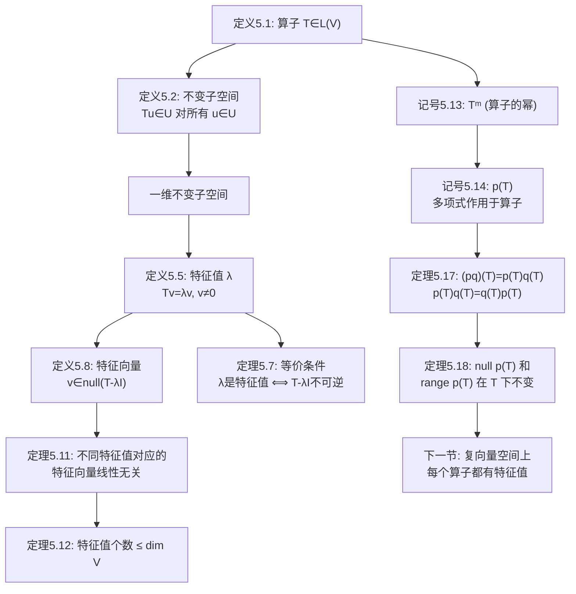

# 5.A 不变子空间、特征值和特征向量

> [!abstract] 本节概览
> 本节是第 5 章的起点，引入了算子理论中最核心的概念——**不变子空间**、**特征值**和**特征向量**，并建立了多项式作用于算子的理论框架。整个逻辑链条为：
>
> 算子定义 $\to$ 不变子空间 $\to$ 一维不变子空间 $\implies$ 特征值/特征向量 $\to$ 等价条件 $\to$ 线性无关性 $\to$ 特征值个数上界 $\to$ 算子的幂 $T^m$ $\to$ 多项式作用于算子 $p(T)$ $\to$ 乘积性质 $\to$ $p(T)$ 的不变性

---

## 一、不变子空间

### 1.1 算子

> [!def] 定义 5.1：算子（operator）
> 从一个向量空间到其本身的线性映射称为**算子**。即 $T \in \mathcal{L}(V)$。

> [!note] 学习注解
> 算子就是 $T \in \mathcal{L}(V) = \mathcal{L}(V, V)$。算子理论比一般线性映射理论更丰富，因为算子可以"自乘为幂"——这是特征值理论的基础。
>
> **研究动机**：若 $V = V_1 \oplus \cdots \oplus V_m$（各 $V_k$ 非零），则理解 $T$ 的作用只需理解各 $T|_{V_k}$ 的作用——而 $V_k$ 比 $V$ 更小，所以更简单。

### 1.2 不变子空间的定义

> [!def] 定义 5.2：不变子空间（invariant subspace）
> 设 $T \in \mathcal{L}(V)$。$V$ 的子空间 $U$ 称为**在 $T$ 下是不变的**，若对每个 $u \in U$ 均有 $Tu \in U$。

> [!note] 学习注解
> 等价表述：$U$ 在 $T$ 下不变 $\iff$ $T|_U$ 是 $U$ 上的算子（即 $T$ 将 $U$ 映射到 $U$ 自身）。
>
> 研究不变子空间的动机：如果 $V = V_1 \oplus \cdots \oplus V_m$ 且每个 $V_k$ 都在 $T$ 下不变，那么要理解 $T$ 的作用，只需理解每个 $T|_{V_k}$ 的作用——而 $V_k$ 比 $V$ 更小，所以更简单。

### 1.3 不变子空间的实例

> [!example] 例 5.3-5.4：不变子空间
>
> **微分算子**：$Dp = p'$。$\mathcal{P}_4(\mathbb{R})$ 在 $D$ 下不变，因为求导不升高次数。
>
> **四个平凡不变子空间**（对任意 $T \in \mathcal{L}(V)$）：
> - $\{0\}$：$Tu = 0 \in \{0\}$
> - $V$：$Tu \in V$
> - $\text{null}\,T$：$Tu = 0 \in \text{null}\,T$
> - $\text{range}\,T$：$Tu \in \text{range}\,T$

> [!warning] 学习注解
> $\text{null}\,T$ 和 $\text{range}\,T$ 不一定提供"非平凡"的不变子空间——当 $T$ 可逆时，$\text{null}\,T = \{0\}$ 且 $\text{range}\,T = V$。稍后将证明：如果 $\dim V > 1$（$\mathbb{F} = \mathbb{C}$）或 $\dim V > 2$（$\mathbb{F} = \mathbb{R}$），则 $T$ 一定有非平凡不变子空间。

---

## 二、特征值和特征向量

### 2.1 特征值的定义

> [!def] 定义 5.5：特征值（eigenvalue）
> 设 $T \in \mathcal{L}(V)$。称数 $\lambda \in \mathbb{F}$ 为 $T$ 的**特征值**，若存在 $v \in V$ 使得 $v \neq 0$ 且 $Tv = \lambda v$。

> [!note] 学习注解
> - 要求 $v \neq 0$ 是必要的，因为 $T0 = \lambda 0$ 对所有 $\lambda$ 成立。
> - "eigenvalue" 一半德文一半英文，德文前缀 "eigen" 意为"自身的"——特征值刻画了算子"固有的"标量倍行为。
> - $V$ 有在 $T$ 下不变的一维子空间 $\iff$ $T$ 有特征值。

### 2.2 成为特征值的等价条件

> [!thm] 定理 5.7：成为特征值的等价条件
> 设 $V$ 是有限维的，$T \in \mathcal{L}(V)$ 且 $\lambda \in \mathbb{F}$。那么以下等价：
> - (a) $\lambda$ 是 $T$ 的特征值
> - (b) $T - \lambda I$ 不是单射
> - (c) $T - \lambda I$ 不是满射
> - (d) $T - \lambda I$ 不可逆

> [!note] 学习注解
> > [!abstract] 证明思路
> > 分两步建立等价链：(a) 与 (b) 通过特征值定义直接变形；(b)、(c)、(d) 则利用有限维空间中单射、满射、可逆的三者等价。
>
> **[(a) ⟺ (b) 特征值定义变形]：** $Tv = \lambda v \iff (T - \lambda I)v = 0$，有非零解 $\iff$ $T - \lambda I$ 不是单射。
>
> **[(b) ⟺ (c) ⟺ (d) 有限维三者等价]：** 由 [[3D 可逆性和同构#2.3 有限维下的三者等价|3.65]]（有限维等维数下，单射 $\iff$ 满射 $\iff$ 可逆）。$\blacksquare$
>
> ==关键洞察==：条件 (d) 是最实用的——判断 $\lambda$ 是否为特征值，只需计算 $\det(T - \lambda I)$ 是否为零（下一节将展开）。

### 2.3 特征向量的定义

> [!def] 定义 5.8：特征向量（eigenvector）
> 设 $T \in \mathcal{L}(V)$ 且 $\lambda \in \mathbb{F}$ 是 $T$ 的特征值。满足 $v \neq 0$ 且 $Tv = \lambda v$ 的向量 $v \in V$ 称为 $T$ **对应于 $\lambda$ 的特征向量**。

> [!note] 学习注解
> 等价表述：$v \neq 0$ 是 $T$ 对应于 $\lambda$ 的特征向量 $\iff$ $v \in \text{null}(T - \lambda I)$。
>
> ==特征向量的几何意义==：$Tv = \lambda v$ 意味着 $T$ 将 $v$ 映射到 $v$ 所在的直线上（可能拉伸或反向）。所以特征向量确定了算子的"不变方向"。

> [!example] 例 5.9：旋转算子的特征值
> $T(w, z) = (-z, w)$（逆时针旋转 $90°$）。
>
> - **$\mathbb{F} = \mathbb{R}$**：没有特征值！旋转 $90°$ 不会将任何非零向量映射到自身的标量倍。
> - **$\mathbb{F} = \mathbb{C}$**：特征值为 $\lambda = i$ 和 $\lambda = -i$。对应特征向量分别为 $(w, -wi)$ 和 $(w, wi)$。
>
> ==这个例子深刻说明了==：同一个算子在不同数域上可能有完全不同的特征值结构。复数域"更大"，所以能提供更多的特征值。

---

## 三、特征向量的线性无关性

### 3.1 不同特征值对应的特征向量线性无关

> [!thm] 定理 5.11：线性无关的特征向量
> 设 $T \in \mathcal{L}(V)$。那么分别对应于 $T$ 的**不同特征值**的特征向量构成的每个组都线性无关。

> [!note] 学习注解
> > [!abstract] 证明思路
> > 反证法 + 最小反例。假设存在最小正整数 $m$ 使 $m$ 个对应互异特征值的特征向量线性相关，用 $T - \lambda_m I$ 作用消去第 $m$ 个向量，得到 $m-1$ 个向量线性相关，与 $m$ 的最小性矛盾。
>
> **[假设最小反例]：** 假设结论不成立，取最小的正整数 $m$ 使得对应于互异特征值 $\lambda_1, \ldots, \lambda_m$ 的特征向量 $v_1, \ldots, v_m$ 线性相关（$m \geq 2$）。
>
> 存在非零 $a_1, \ldots, a_m$ 使得 $a_1 v_1 + \cdots + a_m v_m = 0$。
>
> **[用 $T - \lambda_m I$ 消去第 $m$ 个向量]：** 将 $T - \lambda_m I$ 作用于上式：
> $$a_1(\lambda_1 - \lambda_m)v_1 + \cdots + a_{m-1}(\lambda_{m-1} - \lambda_m)v_{m-1} = 0$$
>
> **[导出矛盾]：** 因为特征值互异，各系数非零，所以 $v_1, \ldots, v_{m-1}$ 线性相关——与 $m$ 的最小性矛盾。$\blacksquare$
>
> ==证明的核心技巧==：用 $T - \lambda_m I$ 作用可以"消去"第 $m$ 个向量，将 $m$ 个向量的线性相关"降维"为 $m-1$ 个向量的线性相关。

### 3.2 特征值个数的上界

> [!thm] 定理 5.12：特征值个数不超过维数
> 设 $V$ 是有限维的。那么 $V$ 上的每个算子最多有 $\dim V$ 个互异特征值。

> [!note] 学习注解
> > [!abstract] 证明思路
> > 不同特征值对应的特征向量线性无关（5.11），而 $n$ 维空间中线性无关组的大小不超过 $\dim V$（2.22），两者结合即得上界。
>
> **[由 5.11 得线性无关]：** 设 $\lambda_1, \ldots, \lambda_m$ 是 $T$ 的互异特征值，$v_1, \ldots, v_m$ 是对应的特征向量。由 5.11，$v_1, \ldots, v_m$ 线性无关。
>
> **[由 2.22 得维数上界]：** 由 2.22，$m \leq \dim V$。$\blacksquare$
>
> ==直觉==：$n$ 维空间中最多有 $n$ 个线性无关的向量，而不同特征值对应的特征向量线性无关，所以最多有 $n$ 个不同特征值。

---

## 四、多项式作用于算子

### 4.1 算子的幂

> [!def] 记号 5.13：$T^m$
> 设 $T \in \mathcal{L}(V)$，$m$ 是正整数。
> - $T^m = \underbrace{T \cdots T}_{m \text{个}}$
> - $T^0 = I$（恒等算子）
> - 若 $T$ 可逆，$T^{-m} = (T^{-1})^m$

> [!note] 学习注解
> 你应验证：$T^m T^n = T^{m+n}$ 且 $(T^m)^n = T^{mn}$。算子可以取幂，这是算子区别于一般线性映射的关键。

### 4.2 多项式作用于算子

> [!def] 记号 5.14：$p(T)$
> 设 $T \in \mathcal{L}(V)$ 且 $p(z) = a_0 + a_1 z + \cdots + a_m z^m$。那么
> $$p(T) = a_0 I + a_1 T + a_2 T^2 + \cdots + a_m T^m$$

> [!example] 例 5.15：多项式作用于微分算子
> $Dq = q'$，$p(x) = 7 - 3x + 5x^2$。则 $p(D) = 7I - 3D + 5D^2$，于是
> $$p(D)q = 7q - 3q' + 5q''$$

> [!note] 学习注解
> 核心思想：将多项式 $p$ 中的变量 $z$ 替换为算子 $T$。常数项 $a_0$ 变成 $a_0 I$（因为 $a_0 = a_0 z^0$，所以 $z^0$ 变成 $T^0 = I$）。
>
> 映射 $p \mapsto p(T)$ 是从 $\mathcal{P}(\mathbb{F})$ 到 $\mathcal{L}(V)$ 的**线性映射**。

### 4.3 乘积性质

> [!thm] 定理 5.17：乘积性质
> 设 $p, q \in \mathcal{P}(\mathbb{F})$ 且 $T \in \mathcal{L}(V)$。那么
> - (a) $(pq)(T) = p(T)q(T)$
> - (b) $p(T)q(T) = q(T)p(T)$

> [!note] 学习注解
> > [!abstract] 证明思路
> > (a) 将多项式乘积展开后直接逐项验证；(b) 利用标量乘法可交换性 $pq = qp$，由 (a) 直接推出。
>
> **[(a) 展开验证]：** 设 $p(z) = \sum a_j z^j$，$q(z) = \sum b_k z^k$。则
> $$(pq)(T) = \sum_{j,k} a_j b_k T^{j+k} = \sum_{j,k} (a_j T^j)(b_k T^k) = p(T)q(T)$$
>
> **[(b) 标量乘法可交换]：** $p(T)q(T) = (pq)(T) = (qp)(T) = q(T)p(T)$。$\blacksquare$
>
> ==关键洞察==：性质 (b) 表明，对**单个算子**的多项式取乘积时，顺序无关紧要——因为标量的乘法是可交换的。但 $ST \neq TS$（一般情况），所以对不同算子的多项式不能交换。

### 4.4 $p(T)$ 的零空间和值域在 $T$ 下不变

> [!thm] 定理 5.18：$p(T)$ 的零空间和值域在 $T$ 下不变
> 设 $T \in \mathcal{L}(V)$ 且 $p \in \mathcal{P}(\mathbb{F})$。那么 $\text{null}\,p(T)$ 和 $\text{range}\,p(T)$ 在 $T$ 下不变。

> [!note] 学习注解
> > [!abstract] 证明思路
> > 利用 $p(T)$ 与 $T$ 的可交换性 $p(T)T = Tp(T)$（定理 5.17），分别验证零空间和值域中元素经 $T$ 作用后仍在原集合内。
>
> **[零空间的不变性]：** 设 $u \in \text{null}\,p(T)$，则 $p(T)u = 0$。于是
> $$p(T)(Tu) = p(T)T(u) = Tp(T)(u) = T(0) = 0$$
> 其中关键步骤是 $p(T)T = Tp(T)$（因为 $z$ 和 $T$ 在乘积中可交换位置）。故 $Tu \in \text{null}\,p(T)$。$\blacksquare$
>
> **[值域的不变性]：** 设 $u = p(T)v \in \text{range}\,p(T)$。则 $Tu = Tp(T)v = p(T)(Tv) \in \text{range}\,p(T)$。$\blacksquare$
>
> ==这个定理极其重要==：它说明了算子的多项式的零空间和值域都是不变子空间。下一节将利用这个结论证明"复向量空间上的每个算子都有特征值"。

---

## 五、知识结构总览

---

## 六、核心思想与证明技巧

> [!success] 核心思想
> 1. **不变子空间是简化算子的工具**：如果 $V = V_1 \oplus \cdots \oplus V_m$ 且每个 $V_k$ 在 $T$ 下不变，那么理解 $T$ 归结为理解每个 $T|_{V_k}$——"分而治之"。
> 2. **特征值 = 一维不变子空间的"拉伸因子"**：$Tv = \lambda v$ 意味着 $T$ 在 $\text{span}(v)$ 上的作用就是乘以 $\lambda$。特征值揭示了算子的"固有标量行为"。
> 3. **不同特征值对应的特征向量线性无关**：这是特征值理论中最基本的线性代数结论之一，直接推出特征值个数不超过维数。
> 4. **多项式作用于算子**：$p(T)$ 将多项式理论与算子理论连接起来。关键性质 $(pq)(T) = p(T)q(T)$ 依赖于标量乘法的可交换性。

> [!tip] 证明技巧清单
> - **消去法**（5.11）：用 $T - \lambda_m I$ 作用消去第 $m$ 个向量，将 $m$ 个向量的问题降为 $m-1$ 个
> - **等价条件链**（5.7）：特征值 $\iff$ 非单射 $\iff$ 非满射 $\iff$ 不可逆（利用 [[3D 可逆性和同构#2.3 有限维下的三者等价|3.65]]）
> - **交换性论证**（5.18）：$p(T)T = Tp(T)$，因为 $z$ 和 $T$ 在乘积中可交换
> - **反例构造**：旋转 $90°$ 在 $\mathbb{R}$ 上无特征值，在 $\mathbb{C}$ 上有——说明数域的选择至关重要

---

## 七、补充理解与易混淆点

### 7.1 不变子空间的直觉理解

> [!note]
> 不变子空间是"在算子作用下封闭"的子空间——算子将子空间中的向量仍然映射到该子空间内。这意味着我们可以将算子"限制"在这个子空间上，得到一个维数更低的算子。这是简化复杂算子的基本策略。

### 7.2 特征值与特征向量的几何意义

> [!note]
> 特征向量是"只被拉伸/压缩、不被旋转"的向量——算子作用在特征向量上，只改变其长度（可能反向），不改变其方向。特征值就是拉伸/压缩的倍数。如果存在一组特征向量构成基，算子在该基下的矩阵就是对角矩阵。

### 7.3 常见误区

> [!danger] 误区1：每个算子都有特征值
> ❌ 错误认知：所有线性算子都有特征值
> ✅ 正确理解：在实数域上，不是所有算子都有特征值（例如 $\mathbb{R}^2$ 上的旋转 $90°$ 没有实特征值）。在复数域上，由代数基本定理，每个算子都有特征值

> [!danger] 误区2：特征向量只有一个方向
> ❌ 错误认知：每个特征值只对应一个特征向量
> ✅ 正确理解：每个特征值对应一个特征空间（所有满足 $Tv = \lambda v$ 的向量），特征空间的维数（几何重数）可以大于1

> [!danger] 误区3：不变子空间必须由特征向量张成
> ❌ 错误认知：不变子空间一定是某些特征空间的直和
> ✅ 正确理解：不变子空间不一定要由特征向量张成。例如幂零算子的不变子空间链中，许多不变子空间不包含特征向量（除了零空间）

---

## 八、习题精选

> [!todo] 推荐习题
> - **习题 1**：$U \subseteq \text{null}\,T \Rightarrow$ $U$ 不变；$\text{range}\,T \subseteq U \Rightarrow$ $U$ 不变（不变子空间的两个充分条件）
> - **习题 5**：$T(x,y) = (-3y, x)$ 在 $\mathbb{R}^2$ 上求特征值（==类似旋转，但角度不同==）
> - **习题 8**：投影 $P^2 = P$ 的特征值只有 $0$ 和 $1$（==投影算子的特征值刻画==）
> - **习题 9**：微分算子 $D$ 的特征值和特征向量（==$e^{\lambda x}$ 是特征函数==）
> - **习题 13**：$T$ 和 $S^{-1}TS$ 特征值相同（==相似变换不改变特征值==）
> - **习题 21**：可逆算子的特征值 $\lambda \neq 0$，且 $\lambda^{-1}$ 是 $T^{-1}$ 的特征值
> - **习题 23**：$ST$ 和 $TS$ 特征值相同（即使 $ST \neq TS$）
> - **习题 26**：每个非零向量都是特征向量 $\Rightarrow$ $T$ 是恒等算子的标量倍（==对角化的极端情况==）
> - **习题 34**：$v_1, \ldots, v_m$ 线性无关 $\iff$ 存在 $T$ 使它们是对应不同特征值的特征向量（5.11 的逆命题）
> - **习题 39**：$T$ 有特征值 $\iff$ 存在 $\dim V - 1$ 维不变子空间（==一维不变子空间 = 特征向量==）

---

## 九、视频学习指南

暂无对应视频，建议通过阅读教材原文和本笔记学习。

---

## 十、教材原文

#学习/线性代数
