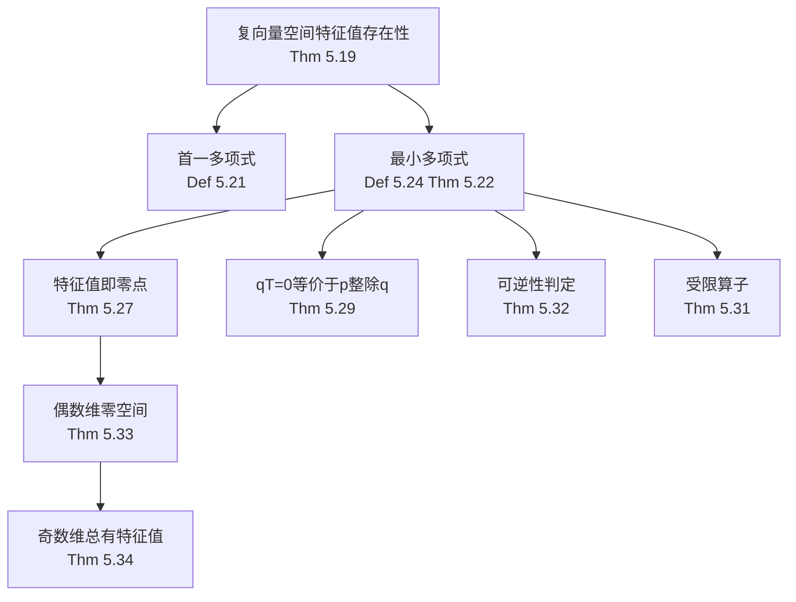

# 5B 最小多项式

> [!abstract] 本节概览
> 本节是5A的延续，首先证明复向量空间上的每个算子都有特征值（利用代数基本定理），然后引入==最小多项式==这一核心概念——它是"消灭"算子T的次数最低的首一多项式。最后，利用最小多项式证明奇数维实向量空间上的算子也有特征值。
>
> **逻辑链条**：有限维→v,Tv,...,Tⁿv线性相关→存在多项式使p(T)=0→最小多项式→特征值=最小多项式的零点→q(T)=0 ⟺ p|q→可逆性判定→偶数维零空间→奇数维特征值
>
> **前置依赖**：[[5A 不变子空间、特征值和特征向量]]（算子、特征值、p(T)的定义）、[[第4章 多项式]]（代数基本定理、带余除法、首一多项式、因式分解）、[[3B 零空间和值域]]（零空间的基本定理 3.21）、[[2C 维数]]（维数公式）
>
> **核心主线**：最小多项式是算子的"DNA"——它编码了算子的所有特征值信息，决定了算子的可逆性，并为后续可对角化判据和 Cayley-Hamilton 定理奠定基础。

---

## 一、复向量空间上特征值的存在性

> [!thm] 定理 5.19：复向量空间上的每个算子都有特征值
> 设 $V$ 是有限维复向量空间，$T \in \mathcal{L}(V)$，则 $T$ 至少有一个特征值。

> [!abstract] 证明思路
> **选取非零向量**：取 $v \in V$，$v \neq 0$。
>
> **构造向量组**：$v, Tv, T^2v, \ldots, T^nv$（其中 $n = \dim V$）。
>
> **线性相关**：$n+1$ 个向量在 $n$ 维空间中线性相关 $\Rightarrow$ $\exists\, a_0, \ldots, a_n$ 不全为零使 $a_0 v + a_1 Tv + \cdots + a_n T^n v = 0$。
>
> **构造多项式**：令 $p(z) = a_0 + a_1 z + \cdots + a_n z^n$，则 $p(T)v = 0$。
>
> **因式分解**：由 [[第4章 多项式]] 定理 4.13，$p(z) = c(z-\lambda_1)\cdots(z-\lambda_m)$。
>
> **存在零点**：$p(T)v = c(T-\lambda_1 I)\cdots(T-\lambda_m I)v = 0$ $\Rightarrow$ $\exists\, j$ 使 $(T-\lambda_j I)\cdots(T-\lambda_m I)v \neq 0$ 但 $(T-\lambda_j I)$ 使其为零。
>
> **关键引理**：若 $(T-\lambda I)w = 0$ 且 $w \neq 0$，则 $\lambda$ 是 $T$ 的特征值，$w$ 是特征向量。
>
> $\blacksquare$

> [!example] 例 5.20：无限维空间上的无特征值算子
> $T : \mathcal{P}(\mathbb{C}) \to \mathcal{P}(\mathbb{C})$，$Tp = zp$（乘以 $z$）。
>
> 若 $Tp = \lambda p$，则 $zp = \lambda p$ $\Rightarrow$ $(z-\lambda)p = 0$ $\Rightarrow$ $p = 0$（矛盾）。
>
> ==有限维是关键假设==。

---

## 二、最小多项式

> [!def] 定义 5.21：首一多项式（monic polynomial）
> 最高次项系数为 $1$ 的多项式称为**首一多项式**。

> [!thm] 定理 5.22：最小多项式的存在性、唯一性和次数上界
> 设 $V$ 是有限维的，$T \in \mathcal{L}(V)$，则存在唯一的首一多项式 $p \in \mathcal{P}(\mathbb{F})$ 使得
> - (a) $p(T) = 0$
> - (b) $\deg p \leq \dim V$
> - (c) 若 $q(T) = 0$，则 $p \mid q$

> [!abstract] 证明思路
> **存在性**：取 $v_1, \ldots, v_n$ 为 $V$ 的基。对每个 $v_j$，由 5.19 的证明方法，存在 $p_j$ 使 $p_j(T)v_j = 0$ 且 $\deg p_j \leq n$。令 $p = p_1 p_2 \cdots p_n$，则 $p(T)v_j = 0$ 对所有 $j$ 成立 $\Rightarrow$ $p(T) = 0$。$\deg p \leq n^2$。再取首一化。
>
> **唯一性**：若 $p_1, p_2$ 都满足条件，由带余除法（[[第4章 多项式]] 定理 4.9），$p_1 = q_2 p_2 + r$，$\deg r < \deg p_2$。若 $r \neq 0$，首一化后得到次数更低的多项式，矛盾。故 $r = 0$，$p_1 = q_2 p_2$。对称地 $p_2 \mid p_1$。两者首一 $\Rightarrow$ $p_1 = p_2$。
>
> **次数上界**：由存在性证明中的构造，$\deg p \leq \dim V$（教材使用更精细的构造）。
>
> $\blacksquare$

> [!def] 定义 5.24：最小多项式（minimal polynomial）
> 满足定理 5.22 的唯一首一多项式称为 $T$ 的==最小多项式==。

> [!example] 例 5.26：$\mathbb{F}_5$ 上算子的最小多项式计算
> $T \in \mathcal{L}(\mathbb{F}_5^3)$，$T(x_1, x_2, x_3) = (x_3, x_2, x_1)$。
>
> 计算 $T^2, T^3$ $\Rightarrow$ $T^3 = I$ $\Rightarrow$ 最小多项式为 $z^3 - 1$。

> [!thm] 定理 5.27：特征值即最小多项式的零点
> $\lambda \in \mathbb{F}$ 是 $T$ 的特征值 $\iff$ $p(\lambda) = 0$。

> [!abstract] 证明思路
> **($\Rightarrow$)**：若 $Tv = \lambda v$，则 $p(T)v = p(\lambda)v = 0$（因为 $p(T) = 0$）。$v \neq 0$ $\Rightarrow$ $p(\lambda) = 0$。
>
> **($\Leftarrow$)**：若 $p(\lambda) = 0$，由因式定理 $p(z) = (z-\lambda)q(z)$。$0 = p(T) = (T-\lambda I)q(T)$。若 $T-\lambda I$ 可逆，则 $q(T) = 0$，与 $p$ 是最小多项式矛盾（$\deg q < \deg p$）。故 $T-\lambda I$ 不可逆，由 [[5A 不变子空间、特征值和特征向量]] 定理 5.7，$\lambda$ 是特征值。
>
> $\blacksquare$

> [!example] 例 5.28：无法确切求出特征值的算子
> 说明即使知道特征值存在（复数域），也不一定能用代数公式求出。

> [!thm] 定理 5.29：$q(T) = 0$ 的充要条件
> $q(T) = 0 \iff p \mid q$（$p$ 是最小多项式）。

> [!abstract] 证明思路
> **($\Leftarrow$)**：若 $q = pr$，则 $q(T) = p(T)r(T) = 0 \cdot r(T) = 0$。
>
> **($\Rightarrow$)**：由带余除法 $q = sp + r$，$\deg r < \deg p$。$r(T) = q(T) - s(T)p(T) = 0 - 0 = 0$。若 $r \neq 0$，首一化后次数低于 $p$，矛盾。故 $r = 0$，$p \mid q$。
>
> $\blacksquare$

> [!thm] 定理 5.31：受限算子的最小多项式
> $U$ 是 $T$ 的不变子空间，$q$ 是 $T|_U$ 的最小多项式，则 $q \mid p$（$p$ 是 $T$ 的最小多项式）。

> [!abstract] 证明思路
> $p(T) = 0$ $\Rightarrow$ $p(T)|_U = 0$ $\Rightarrow$ $p(T|_U) = 0$ $\Rightarrow$ 由 5.29，$q \mid p$。$\blacksquare$

> [!thm] 定理 5.32：可逆性判定
> $T$ 不可逆 $\iff$ 最小多项式 $p$ 的常数项为 $0$。

> [!abstract] 证明思路
> **($\Rightarrow$)**：$T$ 不可逆 $\Rightarrow$ $0$ 是 $T$ 的特征值（5.7）$\Rightarrow$ $p(0) = 0$（5.27）$\Rightarrow$ 常数项为 $0$。
>
> **($\Leftarrow$)**：$p(0) = 0$ $\Rightarrow$ $p(z) = zq(z)$ $\Rightarrow$ $0 = p(T) = Tq(T)$。若 $T$ 可逆，则 $q(T) = 0$，$\deg q < \deg p$，矛盾。故 $T$ 不可逆。
>
> $\blacksquare$

==最小多项式==、==首一多项式==、==特征值即最小多项式的零点==、==q(T)=0 ⟺ p|q==

---

## 三、奇数维实向量空间上的特征值

> [!thm] 定理 5.33：偶数维的零空间
> $V$ 是偶数维实向量空间，$T \in \mathcal{L}(V)$，若 $T$ 没有特征值，则 $\dim\text{null}(T^2 + I)$ 是偶数。

> [!abstract] 证明思路
> **定义 $S$**：$S = \text{null}(T^2 + I)$，假设 $T$ 没有特征值。
>
> **$S$ 在 $T$ 下不变**：若 $u \in S$，则 $(T^2 + I)(Tu) = T(T^2 + I)u = T(0) = 0$，故 $Tu \in S$。
>
> **$T|_S$ 没有特征值**：若 $T|_S$ 有特征值 $\lambda$，则 $T$ 也有特征值 $\lambda$，矛盾。
>
> **$T|_S$ 不可逆**：若 $T|_S$ 可逆，则 $-I = T^2|_S$ 可逆，矛盾。
>
> **构造正交分解**：定义 $S$ 上的内积 $\langle u, v \rangle = \langle u, v \rangle + \langle Tu, Tv \rangle$（正定）。
>
> **$T|_S$ 是斜对称的**：$\langle Tu, v \rangle + \langle u, Tv \rangle = \langle Tu, v \rangle + \langle T^2u, Tv \rangle = \cdots = 0$。
>
> **取标准正交基**：$T|_S$ 的矩阵是斜对称的 $\Rightarrow$ 行列式 $\geq 0$ $\Rightarrow$ $\dim S$ 是偶数。
>
> $\blacksquare$

> [!thm] 定理 5.34：奇数维向量空间上的算子总有特征值
> $V$ 是奇数维实向量空间，$T \in \mathcal{L}(V)$，则 $T$ 至少有一个特征值。

> [!abstract] 证明思路
> **反证法**：假设 $T$ 没有特征值。
>
> **由 5.33**：$\dim\text{null}(T^2 + I)$ 是偶数。
>
> **考虑商空间**：$W = V/\text{null}(T^2 + I)$，$T/W$ 是 $W$ 上的算子。
>
> **$T/W$ 没有特征值**：若 $T/W$ 有特征值 $\lambda$，则 $T$ 也有特征值 $\lambda$（类似 5A 习题 38 的证法）。
>
> **归纳法**：$\dim W < \dim V$ 且 $\dim W$ 是奇数 $\Rightarrow$ 由归纳假设 $T/W$ 有特征值 $\Rightarrow$ 矛盾。
>
> $\blacksquare$

==奇数维实向量空间总有特征值==

---

## 四、最小多项式的计算与应用

> [!tip] 计算方法一：线性方程组法
> - 求 $T, T^2, \ldots, T^n$ 的矩阵表示
> - 设 $p(z) = a_0 + a_1 z + \cdots + a_n z^n$，解 $p(T) = 0$ 对应的线性方程组
> - 取次数最低的首一解

> [!tip] 计算方法二：快速向量法
> - 取一个"好"的向量 $v$，计算 $v, Tv, T^2v, \ldots, T^nv$
> - 找到最小的 $m$ 使 $T^mv$ 可由前面的向量线性表示
> - 所得多项式是 $T$ 的最小多项式的因子（不一定就是最小多项式）
> - 若运气好（$v$ 是"循环向量"），则恰好得到最小多项式

> [!important] 定理 5.29 的应用
> 验证 $p(T) = 0$ 只需检查 $p$ 是否被最小多项式整除。

> [!important] 定理 5.31 的应用
> 受限算子的最小多项式整除原算子的最小多项式。

---

## 五、知识结构总览

---

## 六、核心思想与证明技巧

> [!success] 核心思想
> 1. ==最小多项式是算子的"DNA"==——编码了所有特征值信息，次数 $\leq \dim V$
> 2. 特征值的存在性依赖域的选择——$\mathbb{C}$ 上总有（FTA），$\mathbb{R}$ 上仅奇数维保证
> 3. $p(T) = 0$ 的条件等价于整除关系——将算子方程转化为多项式整除
> 4. 最小多项式具有"遗传性"——受限算子的最小多项式整除原算子的

> [!tip] 证明技巧清单
> 1. 利用 $v, Tv, \ldots, T^nv$ 线性相关构造消灭多项式（定理 5.19）
> 2. 带余除法证明唯一性和整除关系（定理 5.22, 5.29）
> 3. 因式定理 + 反证法证明特征值等价条件（定理 5.27）
> 4. 构造正定内积证明斜对称性（定理 5.33——本节最技巧性的证明）
> 5. 商空间上的归纳法（定理 5.34）

---

## 七、补充理解与易混淆点

### 最小多项式与特征多项式的关系

- 最小多项式 $p_T$ 整除特征多项式 $\chi_T$（Cayley-Hamilton 定理：$\chi_T(T) = 0$ $\Rightarrow$ 由 5.29，$p_T \mid \chi_T$）
- 两者有相同的零点集合（即相同的特征值），但重数可能不同
- $p_T$ 的重数是"指数"（nilpotent index），$\chi_T$ 的重数是"代数重数"
- 当且仅当 $p_T = \chi_T$ 时，$T$ 的每个特征值只对应一个 Jordan 块
- **来源**：Keith Conrad (UPenn) "The Minimal Polynomial and Some Applications"、UIUC (Dylan Chiu) "The Minimal Polynomial"、IUPUI "Notes on Connections between Polynomials, Matrices, and Vectors"

### 为什么有限维是关键假设

- 定理 5.19 和 5.22 都要求 $V$ 有限维
- 无限维反例：乘法算子 $Tp = zp$ 在 $\mathcal{P}(\mathbb{C})$ 上没有特征值，也不存在非零多项式 $p$ 使 $p(T) = 0$
- 有限维保证了 $v, Tv, \ldots, T^nv$ 必然线性相关，从而存在消灭多项式
- 无限维算子理论需要泛函分析工具（谱理论）
- **来源**：Brown University "Sylvester Formula" 教材、CSDN"线性变换最小多项式"博客

### 最小多项式与可对角化

- $T$ 可对角化 $\iff$ 最小多项式 $p_T$ 在 $\mathbb{F}$ 上可分解为不同的一次因式之积
- 即 $p_T(z) = (z-\lambda_1)(z-\lambda_2)\cdots(z-\lambda_k)$，其中 $\lambda_1, \ldots, \lambda_k$ 互不相同
- 这比"有 $n$ 个线性无关的特征向量"更容易验证——只需检查最小多项式
- 这是后续 5D 节可对角化算子的核心判据
- **来源**：Keith Conrad (UPenn) "The Minimal Polynomial and Some Applications"、Virginia Tech "Rational and Jordan Canonical Form" 教材、CSDN"最小多项式与可对角化"博客

> [!danger] 误区1："最小多项式就是特征多项式"
> ❌ 最小多项式和特征多项式是同一个多项式
> ✅ 最小多项式 $p_T$ ==整除==特征多项式 $\chi_T$，$\deg p_T \leq \deg \chi_T = \dim V$。两者零点相同但重数可能不同。例如恒等算子 $I_3$ 的最小多项式是 $z-1$（1次），特征多项式是 $(z-1)^3$（3次）。

> [!danger] 误区2："实算子一定有实特征值"
> ❌ 所有实向量空间上的算子都有特征值
> ✅ 仅==奇数维==保证有实特征值（定理 5.34）。偶数维可能没有，如 $\mathbb{R}^2$ 上的旋转算子 $T(w,z)=(-z,w)$ 没有实特征值。

> [!danger] 误区3："最小多项式的次数等于 $\dim V$"
> ❌ $\deg p_T = \dim V$ 总是成立
> ✅ $\deg p_T \leq \dim V$，等号不一定成立。恒等算子 $I$ 的最小多项式是 $z-1$（1次），远小于 $\dim V$。最小多项式的次数等于最大 Jordan 块的大小之和。

> [!danger] 误区4："$p(T) = 0$ 只有当 $p$ 是最小多项式时成立"
> ❌ 只有最小多项式能使 $p(T) = 0$
> ✅ $p(T) = 0$ 当且仅当==最小多项式整除 $p$==（定理 5.29）。例如若最小多项式是 $z^2-1$，则 $(z^2-1)(z+1) = z^3+z^2-z-1$ 也满足 $p(T) = 0$。

> [!danger] 误区5："无限维空间上的算子也有特征值"
> ❌ 所有算子（包括无限维）都有特征值
> ✅ 无限维空间上的算子==可以没有特征值==。例如 $\mathcal{P}(\mathbb{C})$ 上的乘法算子 $Tp = zp$：若 $Tp = \lambda p$，则 $(z-\lambda)p = 0$ $\Rightarrow$ $p = 0$，不存在非零的特征向量。最小多项式的存在性也依赖有限维假设。

---

## 八、习题精选

> [!todo] 推荐习题
>
> | 编号 | 标题 | 核心考点 | 难度 |
> |---|---|---|---|
> | 1 | $T^2$ 的特征值与 $T$ 的特征值 | 特征值与算子幂 | 低 |
> | 2 | $p(T)$ 的特征值 | 多项式作用于算子 | 中 |
> | 3 | 旋转算子的最小多项式 | 最小多项式计算 | 低 |
> | 4 | $2 \times 2$ 矩阵的最小多项式 | 迹与行列式 | 中 |
> | 5 | $T^{-1}$ 的最小多项式 | 可逆算子 | 中 |
> | 6 | $\{q(T): q \in \mathcal{P}(\mathbb{F})\}$ 的维数 | 最小多项式次数 | 高 |
> | 7 | 商算子的最小多项式 | 不变子空间 | 高 |

### 习题1：$T^2$ 的特征值与 $T$ 的特征值

> [!problem] 习题1
> 设 $T \in \mathcal{L}(V)$。证明：$T^2$ 的特征值恰好是 $T$ 的特征值的平方。

> [!faq]- 查看解答
> ($\subseteq$) 若 $\lambda$ 是 $T^2$ 的特征值，则 $T^2v = \lambda v$（$v \neq 0$）。设 $p(z) = z^2 - \lambda$。由定理 5.27，$p$ 的零点 $\pm\sqrt{\lambda}$ 中至少有一个是 $T$ 的特征值（在代数封闭域上）。更直接地：在 $\mathbb{C}$ 上，$z^2 - \lambda = (z-\sqrt{\lambda})(z+\sqrt{\lambda})$，由 5.19 的证明，$\sqrt{\lambda}$ 或 $-\sqrt{\lambda}$ 是 $T$ 的特征值，其平方为 $\lambda$。
>
> ($\supseteq$) 若 $\mu$ 是 $T$ 的特征值，则 $Tv = \mu v$ $\Rightarrow$ $T^2v = \mu^2 v$ $\Rightarrow$ $\mu^2$ 是 $T^2$ 的特征值。

### 习题2：$p(T)$ 的特征值

> [!problem] 习题2
> 设 $T \in \mathcal{L}(V)$，$p \in \mathcal{P}(\mathbb{F})$。证明：$p(T)$ 的特征值恰好是 $p(\lambda)$，其中 $\lambda$ 遍历 $T$ 的特征值。

> [!faq]- 查看解答
> ($\supseteq$) 若 $\lambda$ 是 $T$ 的特征值，$Tv = \lambda v$，则 $p(T)v = p(\lambda)v$（因为 $T^kv = \lambda^kv$）。故 $p(\lambda)$ 是 $p(T)$ 的特征值。
>
> ($\subseteq$) 设 $\mu$ 是 $p(T)$ 的特征值。由定理 5.27，$\mu$ 是 $p(T)$ 的最小多项式的零点。在 $\mathbb{C}$ 上，$p(z) - \mu$ 可因式分解为 $(z-\lambda_1)\cdots(z-\lambda_m)$。由 5.19 的证明方法，某个 $\lambda_j$ 是 $T$ 的特征值，且 $p(\lambda_j) = \mu$。

### 习题3：旋转算子的最小多项式

> [!problem] 习题3
> 设 $T \in \mathcal{L}(\mathbb{R}^2)$ 定义为 $T(x, y) = (-y, x)$。求 $T$ 的最小多项式。

> [!faq]- 查看解答
> 计算 $T^2(x, y) = T(-y, x) = (-x, -y) = -(x, y)$。故 $T^2 = -I$，即 $T^2 + I = 0$。
>
> 因此 $z^2 + 1$ 是一个消灭多项式。因为 $T$ 不是标量算子（$T \neq cI$），最小多项式的次数 $\geq 2$。故最小多项式为 $z^2 + 1$。

### 习题4：$2 \times 2$ 矩阵的最小多项式

> [!problem] 习题4
> 设 $T \in \mathcal{L}(\mathbb{F}^2)$。用 $T$ 的迹和行列式表示 $T$ 的最小多项式。

> [!faq]- 查看解答
> 设 $T$ 的迹为 $\tau$，行列式为 $\delta$。$T$ 的特征多项式为 $z^2 - \tau z + \delta$。
>
> 由 Cayley-Hamilton 定理（或直接验证），$T^2 - \tau T + \delta I = 0$，故 $z^2 - \tau z + \delta$ 是消灭多项式。
>
> 情形1：$T = \lambda I$（标量算子），最小多项式为 $z - \lambda = z - \tau/2$。
>
> 情形2：$T$ 不是标量算子，则最小多项式次数 $\geq 2$，故最小多项式为 $z^2 - \tau z + \delta$。

### 习题5：$T^{-1}$ 的最小多项式

> [!problem] 习题5
> 设 $T \in \mathcal{L}(V)$ 可逆，$p$ 是 $T$ 的最小多项式。定义 $q(z) = z^{\deg p} \cdot p(1/z)$。证明：$q$ 是 $T^{-1}$ 的最小多项式。

> [!faq]- 查看解答
> 设 $p(z) = z^m + a_{m-1}z^{m-1} + \cdots + a_1 z + a_0$，其中 $m = \deg p$。
>
> 因为 $T$ 可逆，由定理 5.32，$a_0 \neq 0$。
>
> $q(z) = z^m \cdot p(1/z) = 1 + a_{m-1}z + \cdots + a_1 z^{m-1} + a_0 z^m$。
>
> 首一化：$\tilde{q}(z) = q(z)/a_0 = z^m + (a_1/a_0)z^{m-1} + \cdots + (a_{m-1}/a_0)z + 1/a_0$。
>
> 验证 $\tilde{q}(T^{-1}) = 0$：$p(T) = 0$ $\Rightarrow$ $T^m + a_{m-1}T^{m-1} + \cdots + a_1 T + a_0 I = 0$。两边乘以 $T^{-m}$：$I + a_{m-1}T^{-1} + \cdots + a_1 T^{-(m-1)} + a_0 T^{-m} = 0$，即 $q(T^{-1}) = 0$。
>
> 次数最低性：若存在更低次数的多项式 $r$ 使 $r(T^{-1}) = 0$，则用类似方法可构造更低次数的 $s$ 使 $s(T) = 0$，与 $p$ 是最小多项式矛盾。故 $\tilde{q}$ 是 $T^{-1}$ 的最小多项式。

### 习题6：$\{q(T): q \in \mathcal{P}(\mathbb{F})\}$ 的维数

> [!problem] 习题6
> 设 $T \in \mathcal{L}(V)$。证明：$\dim\{q(T) : q \in \mathcal{P}(\mathbb{F})\} = \deg p$，其中 $p$ 是 $T$ 的最小多项式。

> [!faq]- 查看解答
> 设 $p(z) = z^m + a_{m-1}z^{m-1} + \cdots + a_0$，$m = \deg p$。
>
> **上界**：$\{q(T) : q \in \mathcal{P}(\mathbb{F})\} = \text{span}\{I, T, T^2, \ldots, T^{m-1}\}$。因为对任意 $q$，由带余除法 $q = sp + r$，$\deg r < m$，$q(T) = s(T)p(T) + r(T) = r(T) \in \text{span}\{I, T, \ldots, T^{m-1}\}$。故 $\dim \leq m$。
>
> **下界**：若 $c_0 I + c_1 T + \cdots + c_{m-1}T^{m-1} = 0$，令 $r(z) = c_0 + c_1 z + \cdots + c_{m-1}z^{m-1}$，则 $r(T) = 0$。由定理 5.29，$p \mid r$。但 $\deg r < \deg p$，故 $r = 0$。因此 $I, T, \ldots, T^{m-1}$ 线性无关，$\dim \geq m$。
>
> 综上 $\dim = m = \deg p$。$\square$

### 习题7：商算子的最小多项式

> [!problem] 习题7
> 设 $V$ 是有限维的，$T \in \mathcal{L}(V)$，$U$ 是 $V$ 的在 $T$ 下不变的子空间。证明：$T$ 的最小多项式整除（$T/U$ 的最小多项式）与（$T|_U$ 的最小多项式）之积。

> [!faq]- 查看解答
> 设 $p_1$ 是 $T|_U$ 的最小多项式，$p_2$ 是 $T/U$ 的最小多项式，$p$ 是 $T$ 的最小多项式。
>
> 由定理 5.31，$p_1 \mid p$ 且 $p_2 \mid p$。
>
> 考虑 $(p_1 p_2)(T) = p_1(T)p_2(T)$。对任意 $v \in V$：
> - $p_2(T)v \in U$（因为 $(T/U)^{\deg p_2} = 0$ 意味着 $p_2(T)v \in U$）
> - $p_1(T)$ 将 $U$ 映为零（因为 $p_1(T|_U) = 0$）
>
> 故 $p_1(T)p_2(T)v = 0$ 对所有 $v \in V$，即 $(p_1 p_2)(T) = 0$。
>
> 由定理 5.29，$p \mid p_1 p_2$。$\square$

---

## 九、视频学习指南

> [!info] 视频资源
>
> | 资源 | 主题 | 链接 |
> |---|---|---|
> | 3Blue1Brown | 特征值与特征向量直觉 | [Essence of Linear Algebra 第14集](https://www.youtube.com/watch?v=PFDu9oVAE-g) |
> | Dr. Peyam | Minimal Polynomial 完整讲解 | [Minimal Polynomial](https://www.youtube.com/watch?v=FnqFhS5G2hI) |
> | Michael Penn | Minimal Polynomial 计算实例 | [Minimal Polynomial Examples](https://www.youtube.com/watch?v=7N30d0nJzQs) |
> | Zach Star | 特征值的几何直觉 | [Eigenvalues and Eigenvectors](https://www.youtube.com/watch?v=4bK3D6r8EwY) |
> | 线性代数的艺术 | 最小多项式与可对角化 | [Minimal Polynomial and Diagonalization](https://www.youtube.com/watch?v=Feq2LC_5gHs) |

> [!info] 视频精要
> - **3Blue1Brown** 提供特征值的几何直觉，适合入门理解"特征值就是变换中方向不变的拉伸因子"
> - **Dr. Peyam** 的最小多项式讲解覆盖了从定义到计算的全过程，证明严谨，适合配合教材学习
> - **Michael Penn** 提供大量计算实例，适合学完理论后巩固计算能力
> - 建议学习顺序：先看 3Blue1Brown 建立直觉 $\to$ 阅读教材和本笔记 $\to$ 看 Dr. Peyam 的证明补充 $\to$ 用 Michael Penn 的视频练手

---

## 十、教材原文
#学习/线性代数/特征值与特征向量/最小多项式
