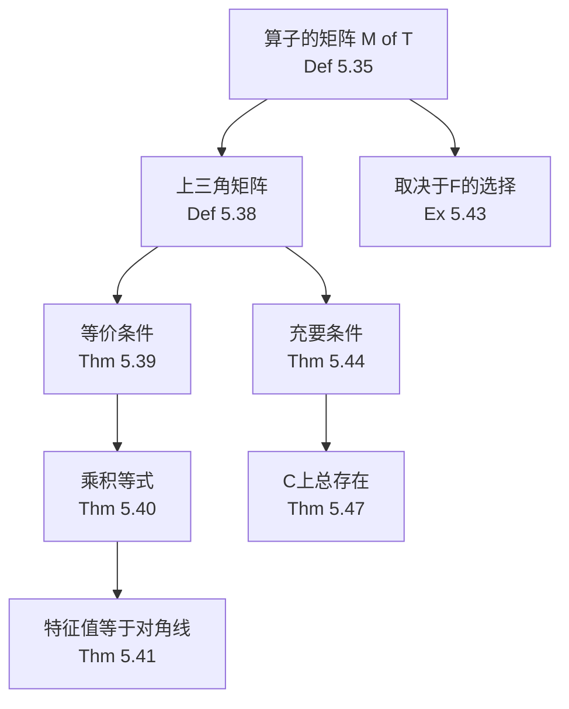

# 5C 上三角矩阵

> [!abstract] 本节概览
> 本节引入==算子的矩阵== M(T) 的正式定义，建立==上三角矩阵==与==不变子空间==之间的深刻联系，证明复向量空间上每个算子都有上三角矩阵（Schur 分解的抽象形式），并给出由上三角矩阵直接读出特征值的简便方法。
>
> **逻辑链条**：算子的矩阵 M(T) → 上三角矩阵定义 → 等价条件（不变子空间链）→ (T-λ₁I)...(T-λₙI)=0 → 特征值=对角线元素 → 充要条件（最小多项式可分解）→ F=C 时总存在
>
> **前置依赖**：[[5A 不变子空间、特征值和特征向量]]（算子、不变子空间、特征值、p(T) 的不变性）、[[5B 最小多项式]]（最小多项式、q(T)=0 条件）、[[第4章 多项式]]（代数基本定理、因式分解）、[[3C 矩阵]]（矩阵的定义）、[[2B 基]]（基与线性无关）
>
> **核心主线**：上三角矩阵是线性代数中"最简矩阵表示"的第一步——通过选取合适的基，使算子的矩阵尽可能多的位置为 0。在复数域上，每个算子都可以上三角化（5.47），对角线元素恰好给出全部特征值。

---

## 一、算子的矩阵与上三角矩阵

### 算子的矩阵定义

> [!def] 定义 5.35：算子的矩阵 M(T)
> 设 $T \in \mathcal{L}(V)$，$v_1, \ldots, v_n$ 是 $V$ 的基。$T$ 关于该基的==算子的矩阵== $M(T)$ 是 $n \times n$ 矩阵，其第 $k$ 列由 $Tv_k$ 在基 $v_1, \ldots, v_n$ 下的坐标构成：
> $$Tv_k = A_{1,k}v_1 + A_{2,k}v_2 + \cdots + A_{n,k}v_n$$
> 其中 $A_{j,k}$ 是 $M(T)$ 第 $k$ 列第 $j$ 行的元素。

> [!note] 与[[3C 矩阵]]的联系
> 算子的矩阵一定是**方阵**（行数 = 列数 = $\dim V$），这与一般线性映射的长方形矩阵不同。当 $T$ 是 $\mathbb{F}^n$ 上的算子且未明确基的选取时，默认使用标准基。

> [!example] 例 5.36：算子关于标准基的矩阵
> $T(x, y, z) = (2x+y,\; 5y+3z,\; 8z)$ 关于标准基的矩阵为：
> ```
> M(T) = ⎡2 1 0⎤
>        ⎢0 5 3⎥
>        ⎣0 0 8⎦
> ```
> 这是一个==上三角矩阵==——对角线以下所有元素为零。

### 对角线与上三角矩阵

> [!def] 定义 5.37：矩阵的对角线
> 方阵的**对角线**由从左上角到右下角的直线上的元素所构成。对于 $n \times n$ 矩阵 $A$，对角线元素为 $A_{1,1}, A_{2,2}, \ldots, A_{n,n}$。

> [!def] 定义 5.38：上三角矩阵
> 称一个方阵为==上三角矩阵==，若其中所有在对角线之下的元素都是 $0$。即对一切 $j > k$，$A_{j,k} = 0$。

> [!note] 上三角矩阵的一般形式
> $$\begin{pmatrix} \lambda_1 & * & \cdots & * \\ 0 & \lambda_2 & \cdots & * \\ \vdots & & \ddots & \vdots \\ 0 & 0 & \cdots & \lambda_n \end{pmatrix}$$
> 其中 $*$ 表示任意元素。$n \times n$ 上三角矩阵中至少有 $\frac{n(n-1)}{2}$ 个零。

### 上三角矩阵的等价条件

> [!thm] 定理 5.39：上三角矩阵的等价条件
> 设 $T \in \mathcal{L}(V)$ 且 $v_1, \ldots, v_n$ 是 $V$ 的基。以下三条等价：
> - (a) $T$ 关于 $v_1, \ldots, v_n$ 的矩阵是上三角矩阵。
> - (b) 对每个 $k = 1, \ldots, n$，$\text{span}(v_1, \ldots, v_k)$ 在 $T$ 下不变。
> - (c) 对每个 $k = 1, \ldots, n$，$Tv_k \in \text{span}(v_1, \ldots, v_k)$。

> [!abstract] 证明思路
> **(a) ⇒ (b)**：$M(T)$ 上三角意味着 $Tv_j \in \text{span}(v_1, \ldots, v_j)$。当 $j \leq k$ 时，$\text{span}(v_1, \ldots, v_j) \subseteq \text{span}(v_1, \ldots, v_k)$，故 $Tv_j \in \text{span}(v_1, \ldots, v_k)$，即 $\text{span}(v_1, \ldots, v_k)$ 在 $T$ 下不变。
>
> **(b) ⇒ (c)**：取 $j = k$ 即可。
>
> **(c) ⇒ (a)**：$Tv_k$ 只用到 $v_1, \ldots, v_k$，故 $M(T)$ 第 $k$ 列中第 $k$ 行以下的元素全为零，即对角线以下全为零。$\blacksquare$

> [!important] 核心洞察
> 上三角矩阵对应着一组==不变子空间链==：
> $$\{0\} \subseteq \text{span}(v_1) \subseteq \text{span}(v_1, v_2) \subseteq \cdots \subseteq \text{span}(v_1, \ldots, v_n) = V$$
> 每一层都在 $T$ 下不变。这就是[[5A 不变子空间、特征值和特征向量]]中不变子空间概念的"嵌套版本"。

---

## 二、上三角矩阵的性质

### 上三角算子满足的等式

> [!thm] 定理 5.40：上三角算子满足的等式
> 设 $T \in \mathcal{L}(V)$ 关于 $V$ 的某个基有上三角矩阵，对角线元素为 $\lambda_1, \ldots, \lambda_n$。则
> $$(T - \lambda_1 I)(T - \lambda_2 I) \cdots (T - \lambda_n I) = 0$$

> [!abstract] 证明思路
> 设基为 $v_1, \ldots, v_n$，利用上三角矩阵的嵌套不变子空间结构，逐个验证乘积将每个基向量映为零。
>
> **基向量 $v_1$**：$Tv_1 = \lambda_1 v_1$，故 $(T - \lambda_1 I)v_1 = 0$，从而整个乘积作用 $v_1 = 0$。
>
> **基向量 $v_2$**：$(T - \lambda_2 I)v_2 \in \text{span}(v_1)$（上三角性），故 $(T - \lambda_1 I)(T - \lambda_2 I)v_2 = 0$，从而乘积作用 $v_2 = 0$。
>
> **归纳推广到 $v_k$**：$(T - \lambda_k I)v_k \in \text{span}(v_1, \ldots, v_{k-1})$，由前 $k-1$ 步的归纳结果，$(T - \lambda_1 I) \cdots (T - \lambda_k I)v_k = 0$，从而整个乘积作用 $v_k = 0$。
>
> **结论**：乘积把基中所有向量映为零，故为零算子。$\blacksquare$

> [!tip] 证明的关键
> 利用 $(T - \lambda_j I)$ 和 $(T - \lambda_k I)$ 的**可交换性**（[[5A 不变子空间、特征值和特征向量]] 5.17(b)），保证消去顺序无关紧要。

### 由上三角矩阵确定特征值

> [!thm] 定理 5.41：由上三角矩阵确定特征值
> $T$ 关于 $V$ 的某个基有上三角矩阵 ⟹ $T$ 的特征值恰为对角线上各元素。

> [!abstract] 证明思路
> **对角线元素是特征值**：$Tv_1 = \lambda_1 v_1$ ⇒ $\lambda_1$ 是特征值。对 $k \geq 2$，$(T - \lambda_k I)$ 将 $\text{span}(v_1, \ldots, v_k)$ 映入 $\text{span}(v_1, \ldots, v_{k-1})$。由维数公式（从 $k$ 维映到至多 $k-1$ 维），$T - \lambda_k I$ 不是单射 ⇒ 存在非零 $v$ 使 $(T - \lambda_k I)v = 0$ ⇒ $\lambda_k$ 是特征值。
>
> **无其他特征值**：令 $q(z) = (z - \lambda_1)\cdots(z - \lambda_n)$，由 5.40 得 $q(T) = 0$。由[[5B 最小多项式]] 5.29，$q$ 是最小多项式的倍数。由 5.27，$T$ 的特征值都是 $q$ 的零点 ⊆ $\{\lambda_1, \ldots, \lambda_n\}$。$\blacksquare$

> [!example] 例 5.42：由上三角矩阵直接读特征值
> $M(T)$ 的对角线为 $2, 5, 8$ ⇒ $T$ 的特征值为 $2, 5, 8$。无需计算特征多项式，直接"读"对角线即可。

> [!important] 核心结论
> ==(T-λ₁I)...(T-λₙI) = 0== 是连接上三角矩阵与特征值的关键桥梁。一旦找到上三角矩阵，==特征值=对角线元素==，这是上三角矩阵最大的实用价值。

---

## 三、上三角矩阵的存在性

### 存在性取决于域的选择

> [!example] 例 5.43：上三角矩阵的存在性可能取决于 $\mathbb{F}$
> $T \in \mathcal{L}(\mathbb{F}^4)$，最小多项式 $p(z) = 9 - 6z + 10z^2 - 6z^3 + z^4$。
>
> - **$\mathbb{F} = \mathbb{R}$**：$p(z) = (z^2+1)(z-3)^2$，$z^2+1$ 在 $\mathbb{R}$ 上不可分解为一次因式之积 ⇒ ==无上三角矩阵==。
> - **$\mathbb{F} = \mathbb{C}$**：$p(z) = (z-i)(z+i)(z-3)^2$，全为一次因式 ⇒ ==有上三角矩阵==。

### 存在上三角矩阵的充要条件

> [!thm] 定理 5.44：存在上三角矩阵的充要条件
> $T$ 关于 $V$ 的某个基有上三角矩阵 ⟺ 最小多项式 $= (z - \lambda_1)\cdots(z - \lambda_m)$，其中 $\lambda_j \in \mathbb{F}$。

> [!abstract] 证明思路
> **必要性（⇒）**：由 5.40，$q(T) = 0$，其中 $q(z) = (z - \alpha_1)\cdots(z - \alpha_n)$。由[[5B 最小多项式]] 5.29，最小多项式整除 $q$，故最小多项式为一次因式之积。
>
> **充分性（⇐），对 $m$ 归纳**：
>
> **$m = 1$**：$T = \lambda_1 I$，关于任何基的矩阵都是上三角的。
>
> **$m > 1$**：令 $U = \text{range}(T - \lambda_m I)$。由[[5A 不变子空间、特征值和特征向量]] 5.18，$U$ 在 $T$ 下不变。$T|_U$ 的最小多项式是至多 $m-1$ 个一次因式之积。由归纳假设，$T|_U$ 关于 $U$ 的某个基 $u_1, \ldots, u_M$ 有上三角矩阵。将 $u_1, \ldots, u_M$ 扩充为 $V$ 的基 $u_1, \ldots, u_M, v_1, \ldots, v_N$。验证 $Tv_k \in \text{span}(u_1, \ldots, u_M, v_1, \ldots, v_k)$（利用 $(T - \lambda_m I)v_k \in U$）。由 5.39 得证。$\blacksquare$

> [!important] 定理 5.44 的意义
> 最小多项式能否分解为一次因式之积，完全取决于域 $\mathbb{F}$。这解释了为什么例 5.43 中 $\mathbb{R}$ 和 $\mathbb{C}$ 的结果不同。

### 复向量空间上的上三角化

> [!thm] 定理 5.47：$\mathbb{F} = \mathbb{C}$ 时每个算子都有上三角矩阵
> $V$ 是有限维复向量空间，$T \in \mathcal{L}(V)$ ⇒ $T$ 关于 $V$ 的某个基有上三角矩阵。

> [!abstract] 证明思路
> 由 5.44 和[[第4章 多项式]]代数基本定理版本二（4.13：$\mathbb{C}$ 上多项式可分解为一次因式之积）直接得出。$\blacksquare$

> [!important] 核心结论
> ==F=C 时每个算子都可上三角化==。这是本章最重要的结论之一，本质上是==Schur 分解==的抽象形式。它保证了复向量空间上每个算子都可以上三角化，从而特征值可以直接从对角线读出。

> [!note] 注意
> 上三角矩阵中，$v_1$ 一定是 $T$ 的特征向量（$Tv_1 = \lambda_1 v_1$），但 $v_2, \ldots, v_n$ 不一定是。$v_k$ 是特征向量 ⟺ 第 $k$ 列除第 $k$ 个元素外全为零（即矩阵为对角矩阵时）。

---

## 四、知识结构总览



---

## 五、核心思想与证明技巧

> [!success] 核心思想
> 1. 上三角矩阵是"最简矩阵表示"的第一步——通过换基使矩阵尽可能多的位置为 0
> 2. 上三角矩阵与不变子空间链等价——$\text{span}(v_1, \ldots, v_k)$ 在 $T$ 下不变 ⟺ $M(T)$ 上三角
> 3. 上三角矩阵直接给出特征值——对角线元素就是全部特征值（含重数）
> 4. 上三角化的存在性取决于域——$\mathbb{C}$ 上总成立（FTA），$\mathbb{R}$ 上不一定

> [!tip] 证明技巧清单
> 1. **利用不变子空间链证明等价条件**（定理 5.39）：上三角 ⟺ 嵌套不变子空间 ⟺ $Tv_k \in \text{span}(v_1, \ldots, v_k)$，三轮循环论证
> 2. **逐个基向量验证乘积为零**（定理 5.40——核心归纳技巧）：从 $v_1$ 开始，利用 $(T-\lambda_k I)v_k \in \text{span}(v_1, \ldots, v_{k-1})$ 逐层消去
> 3. **维数公式证明"不是单射"**（定理 5.41）：$T - \lambda_k I$ 将 $k$ 维空间映入 $k-1$ 维空间 ⇒ 有非零核 ⇒ $\lambda_k$ 是特征值
> 4. **利用 $\text{range}(T - \lambda_m I)$ 归纳构造基**（定理 5.44——最深刻的证明）：在不变子空间上应用归纳假设，再扩充为全空间基

---

## 六、补充理解与易混淆点

### 上三角矩阵与行阶梯形的区别

> [!note]
> 行阶梯形通过**行变换**得到，不保持特征值信息，与基无关。算子的上三角矩阵通过**换基**得到，对角线就是特征值。行阶梯形是计算工具（高斯消元），上三角矩阵是理论工具（算子表示）。两者之间没有本质联系。
>
> **来源**：UC Berkeley EE16B "Note 15: Upper Triangulation, Schur Decomposition"、MIT 18.700 "Upper Triangular Matrices and Diagonalization"

### Schur 分解与定理 5.47 的关系

> [!note]
> 定理 5.47 本质上是 Schur 分解的抽象形式。
>
> - **Schur 分解（矩阵版本）**：对任意 $A \in \mathbb{C}^{n \times n}$，存在幺正矩阵 $U$ 和上三角矩阵 $T$ 使得 $A = UTU^*$
> - **抽象版本（5.47）**：对任意 $T \in \mathcal{L}(V)$（$V$ 为复向量空间），存在基使 $M(T)$ 上三角
>
> Schur 分解在数值线性代数中有重要应用（如 QR 算法），是计算特征值的核心工具。
>
> **来源**：UCLA "The Schur Decomposition"、UC Berkeley EE16B "Note 15"、UCSB "Lecture 5: The Schur Decomposition"

### 为什么上三角矩阵如此重要

> [!note]
> - 上三角矩阵是 Jordan 标准形（第8章）和谱定理（第7章）的"前奏"——从上三角出发，添加不同条件可得到更精细的矩阵表示
> - 从上三角到对角化只需一个额外条件：最小多项式无重根（[[5B 最小多项式]]）
> - 上三角矩阵使算子的幂、多项式计算变得简单——上三角矩阵的幂仍为上三角，对角线元素取幂即可
>
> **来源**：UPenn Math 314 "Triangular and Diagonal Forms"、UC Davis "Eigenvalues and Eigenvectors"

### 常见误区

> [!danger] 误区1："上三角矩阵就是行阶梯形"
> ❌ 行阶梯形和算子的上三角矩阵是一回事
> ✅ 行阶梯形通过==行变换==得到，不保持特征值；算子的上三角矩阵通过==换基==得到，对角线就是特征值。两者之间没有联系。

> [!danger] 误区2："每个算子都有上三角矩阵"
> ❌ 无论在什么域上，算子都有上三角矩阵
> ✅ 仅当==最小多项式可分解为一次因式之积==时成立（定理 5.44）。$\mathbb{F}=\mathbb{C}$ 总成立（代数基本定理），$\mathbb{F}=\mathbb{R}$ 不一定。例如 $\mathbb{R}^2$ 上的旋转算子可能没有实上三角矩阵。

> [!danger] 误区3："对角线上每个元素都是不同的特征值"
> ❌ 对角线元素就是不同的特征值
> ✅ 对角线元素恰好是==全部特征值==（可能有重复）。重复次数是代数重数，不一定等于几何重数（特征空间的维数）。

> [!danger] 误区4："上三角矩阵的每个基向量都是特征向量"
> ❌ 上三角矩阵的每个基向量都是特征向量
> ✅ 只有 $v_1$ 一定是特征向量（$Tv_1 = \lambda_1 v_1$）。$v_2, \ldots, v_n$ 不一定是——只有当矩阵是对角矩阵时，所有基向量才是特征向量。

---

## 七、习题精选

> [!todo] 推荐习题
>
> | 编号 | 标题 | 核心考点 | 难度 |
> |---|---|---|---|
> | 1 | T² 有上三角矩阵 ⟹ T 有？ | 上三角矩阵的充分条件 | 低 |
> | 2 | 上三角矩阵的和与积 | 对角线元素运算 | 低 |
> | 3 | 可逆算子的上三角逆矩阵 | T⁻¹ 的对角线 | 中 |
> | 4 | C 上任意 k 维不变子空间 | 5.47 的推论 | 中 |
> | 5 | T²v+2Tv=-2v 的上三角矩阵 | 最小多项式与上三角 | 中 |
> | 6 | 不变子空间的受限与商算子 | 受限/商算子的上三角 | 高 |
> | 7 | 对偶算子的上三角矩阵 | T' 与 T 的关系 | 高 |

### 习题1：T² 有上三角矩阵 ⟹ T 有？

> [!problem] 习题1
> 证明或给出一反例：如果 $T \in \mathcal{L}(V)$ 且 $T^2$ 关于 $V$ 的某个基有上三角矩阵，那么 $T$ 关于 $V$ 的某个基有上三角矩阵。

> [!faq]- 查看解答
> **反例**。设 $\mathbb{F} = \mathbb{R}$，$T \in \mathcal{L}(\mathbb{R}^2)$ 定义为 $T(x,y) = (-y, x)$（旋转 90°）。
>
> $T^2 = -I$，关于任何基的矩阵都是 $-I$（对角矩阵，上三角）。但 $T$ 没有实特征值，故 $T$ 关于 $\mathbb{R}^2$ 的任何基都没有上三角矩阵（由 5.41，上三角矩阵的对角线元素是特征值，但 $T$ 没有实特征值）。

### 习题2：上三角矩阵的和与积

> [!problem] 习题2
> 设 $A$ 和 $B$ 是大小相同的上三角矩阵，$A$ 的对角线上是 $\alpha_1, \ldots, \alpha_n$，$B$ 的对角线上是 $\beta_1, \ldots, \beta_n$。
> (a) 证明 $A + B$ 是上三角矩阵，对角线上是 $\alpha_1 + \beta_1, \ldots, \alpha_n + \beta_n$。
> (b) 证明 $AB$ 是上三角矩阵，对角线上是 $\alpha_1 \beta_1, \ldots, \alpha_n \beta_n$。

> [!faq]- 查看解答
> **(a)** $(A+B)_{j,k} = A_{j,k} + B_{j,k}$。若 $j > k$，则 $A_{j,k} = 0$ 且 $B_{j,k} = 0$，故 $(A+B)_{j,k} = 0$。对角线：$(A+B)_{k,k} = A_{k,k} + B_{k,k} = \alpha_k + \beta_k$。
>
> **(b)** $(AB)_{j,k} = \sum_i A_{j,i} B_{i,k}$。若 $j > k$，则对每个 $i$：当 $j \leq i$ 时 $B_{i,k} = 0$（因为 $i \geq j > k$）；当 $j > i$ 时 $A_{j,i} = 0$。故每项为 0。对角线：$(AB)_{k,k} = \sum_i A_{k,i} B_{i,k}$，仅 $i = k$ 时 $A_{k,i}$ 和 $B_{i,k}$ 可能都非零，故 $= A_{k,k} B_{k,k} = \alpha_k \beta_k$。

### 习题3：可逆算子的上三角逆矩阵

> [!problem] 习题3
> 设 $T \in \mathcal{L}(V)$ 可逆，且 $V$ 的基 $v_1, \ldots, v_n$ 使得 $T$ 关于这个基的矩阵是上三角的，对角线上是 $\lambda_1, \ldots, \lambda_n$。证明 $T^{-1}$ 关于这个基的矩阵也是上三角的，对角线上是 $1/\lambda_1, \ldots, 1/\lambda_n$。

> [!faq]- 查看解答
> $T$ 可逆 ⇒ 每个 $\lambda_k \neq 0$（否则由 5.41，$\lambda_k$ 是特征值，$T$ 可逆 ⇒ $0$ 不是特征值）。
>
> 设 $M(T) = A$（上三角），则 $M(T^{-1}) = A^{-1}$。因为 $A$ 是上三角且可逆，$A^{-1}$ 也是上三角（可用前代法验证），且对角线元素为 $1/\lambda_1, \ldots, 1/\lambda_n$。

### 习题6：C 上任意 k 维不变子空间

> [!problem] 习题6
> 设 $\mathbb{F} = \mathbb{C}$，$V$ 是有限维的，且 $T \in \mathcal{L}(V)$。证明：如果 $k \in \{1, \ldots, \dim V\}$，那么 $V$ 有在 $T$ 下不变的 $k$ 维子空间。

> [!faq]- 查看解答
> 由定理 5.47，存在 $V$ 的基 $v_1, \ldots, v_n$ 使得 $M(T)$ 是上三角矩阵。由定理 5.39，对每个 $k$，$\text{span}(v_1, \ldots, v_k)$ 在 $T$ 下不变。取 $U = \text{span}(v_1, \ldots, v_k)$，则 $\dim U = k$ 且 $U$ 在 $T$ 下不变。

### 习题8：T²v+2Tv=-2v 的上三角矩阵

> [!problem] 习题8
> 设 $V$ 是有限维的，$T \in \mathcal{L}(V)$，且存在非零向量 $v \in V$ 使得 $T^2 v + 2Tv = -2v$。
> (a) 证明如果 $\mathbb{F} = \mathbb{R}$，那么 $V$ 中不存在能使 $T$ 有上三角矩阵的基。
> (b) 证明如果 $\mathbb{F} = \mathbb{C}$ 且 $A$ 是 $T$ 关于 $V$ 的某个基得到的上三角矩阵，那么 $A$ 的对角线上会出现 $-1+i$ 或 $-1-i$。

> [!faq]- 查看解答
> **(a)** $T^2 v + 2Tv + 2v = 0$，即 $(T^2 + 2T + 2I)v = 0$。$v \neq 0$ 说明 $T^2 + 2T + 2I$ 不是单射。若 $T$ 关于某基有上三角矩阵，则由 5.40，$(T - \lambda_1 I)\cdots(T - \lambda_n I) = 0$，最小多项式为一次因式之积。但 $z^2 + 2z + 2 = (z+1)^2 + 1$ 在 $\mathbb{R}$ 上不可分解为一次因式之积（判别式 $4 - 8 = -4 < 0$），矛盾于 5.44。
>
> **(b)** $z^2 + 2z + 2 = (z - (-1+i))(z - (-1-i))$。由 5.27，$T$ 的特征值包含 $-1+i$ 或 $-1-i$（因为 $z^2 + 2z + 2$ 整除最小多项式，最小多项式的零点包含 $z^2 + 2z + 2$ 的零点）。由 5.41，上三角矩阵的对角线包含所有特征值。

### 习题12：不变子空间的受限与商算子

> [!problem] 习题12
> 设 $V$ 是有限维的，$T \in \mathcal{L}(V)$ 关于 $V$ 的某个基有上三角矩阵，且 $U$ 是 $V$ 的在 $T$ 下不变的子空间。
> (a) 证明 $T|_U$ 关于 $U$ 的某个基有上三角矩阵。
> (b) 证明商算子 $T/U$ 关于 $V/U$ 的某个基有上三角矩阵。

> [!faq]- 查看解答
> **(a)** 由 5.44，$T$ 的最小多项式可分解为一次因式之积。由[[5B 最小多项式]] 5.31，$T|_U$ 的最小多项式整除 $T$ 的最小多项式，故也可分解为一次因式之积。由 5.44，$T|_U$ 关于 $U$ 的某个基有上三角矩阵。
>
> **(b)** 类似地，$T/U$ 的最小多项式也整除 $T$ 的最小多项式（习题 5B.25(a)），故可分解为一次因式之积。由 5.44，$T/U$ 关于 $V/U$ 的某个基有上三角矩阵。

### 习题14：对偶算子的上三角矩阵

> [!problem] 习题14
> 设 $V$ 是有限维的，且 $T \in \mathcal{L}(V)$。证明：$T$ 关于 $V$ 的某个基有上三角矩阵，当且仅当对偶算子 $T'$ 关于对偶空间 $V'$ 的某个基有上三角矩阵。

> [!faq]- 查看解答
> **(⇒)** 设 $v_1, \ldots, v_n$ 是 $V$ 的基使 $M(T)$ 上三角。令 $\varphi_1, \ldots, \varphi_n$ 是 $V'$ 的对偶基（$\varphi_j(v_k) = \delta_{j,k}$）。计算 $(T'\varphi_k)(v_j) = \varphi_k(Tv_j)$。当 $j < k$ 时，$Tv_j \in \text{span}(v_1, \ldots, v_j)$，$\varphi_k$ 在 $\text{span}(v_1, \ldots, v_j)$ 上为零（因为 $k > j$），故 $(T'\varphi_k)(v_j) = 0$。因此 $T'\varphi_k \in \text{span}(\varphi_k, \ldots, \varphi_n)$，由 5.39(c) 的对偶版本，$T'$ 关于 $\varphi_1, \ldots, \varphi_n$ 有上三角矩阵。
>
> **(⇐)** 由对称性（$(T')'$ 与 $T$ 自然同构）。

---

## 八、视频学习指南

> [!info] 视频资源
>
> | 资源 | 主题 | 链接 |
> |---|---|---|
> | 3Blue1Brown | 特征值与特征向量（直觉理解） | [Essence of Linear Algebra](https://www.3blue1brown.com/lessons/eigenvalues) |
> | Dr. Peyam | Upper Triangular Matrices | [YouTube](https://www.youtube.com/@DrPeyam) |
> | Michael Penn | Triangularization Theorem | [YouTube](https://www.youtube.com/@MichaelPennMath) |
> | Zach Star | 线性代数核心概念 | [YouTube](https://www.youtube.com/@ZachStar) |
> | 李沐 | 动手学深度学习 - 线性代数 | [Bilibili](https://www.bilibili.com/video/BV1Wv411h7kN) |

> [!info] 视频精要
> - 3Blue1Brown 的特征值视频提供了极佳的几何直觉，适合作为本节的入门
> - Dr. Peyam 和 Michael Penn 的视频更贴近教材风格，适合深入学习证明细节
> - 建议先看 3Blue1Brown 建立直觉，再结合教材和本笔记学习严格证明

---

## 九、教材原文

```
```

#学习/线性代数/特征值与特征向量/上三角矩阵
