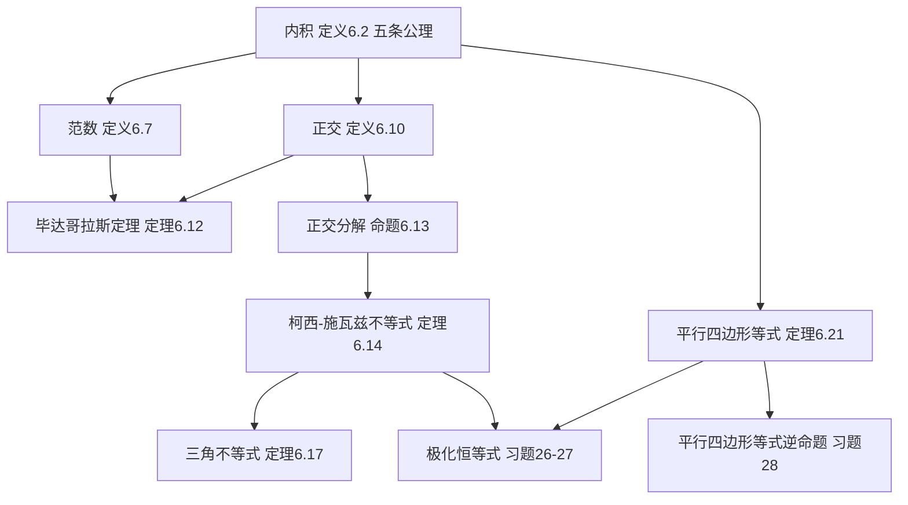

# 6A 内积和范数

> [!abstract] 本节概览
> 本节是第6章"内积空间"的开篇，从 $\mathbb{R}^2$ 和 $\mathbb{R}^3$ 中向量长度与角度的直观概念出发，抽象出**内积**的一般定义，进而导出**范数**、**正交**、**柯西-施瓦兹不等式**、**三角不等式**和**平行四边形等式**等核心工具。整个理论环环相扣：内积定义范数，内积定义正交，正交分解推出柯西-施瓦兹不等式，柯西-施瓦兹推出三角不等式。
>
> **逻辑链条**：内积（定义 6.2）$\to$ 范数（定义 6.7）$\to$ 正交（定义 6.10）$\to$ 正交分解（命题 6.13）$\to$ 柯西-施瓦兹不等式（定理 6.14）$\to$ 三角不等式（定理 6.17）$\to$ 平行四边形等式（定理 6.21）。
>
> **前置依赖**：[[第4章 多项式]]（复数、复共轭 $\bar{\lambda}$、绝对值 $|\lambda|$）、[[1B 向量空间的定义]]（向量空间、线性映射）、[[3F 对偶]]（对偶空间，习题 5 参考）。
>
> **核心主线**：从欧几里得几何中的长度和角度出发，通过公理化方法建立适用于任意（实或复）向量空间的内积理论，最终得到数学中最重要的不等式之一——柯西-施瓦兹不等式。

---

## 一、内积的定义与基本性质

### 动机：从 $\mathbb{R}^2$、$\mathbb{R}^3$ 的几何出发

在前五章中，我们研究了向量空间的**代数结构**——加法和标量乘法。但向量空间本身没有"长度"、"角度"、"垂直"这些几何概念。**内积**的引入正是为了在线性空间上赋予这些几何结构。

将 $\mathbb{R}^2$ 和 $\mathbb{R}^3$ 中的向量看成始于原点的箭头。向量 $v$ 的**长度**（范数）记作 $\|v\|$。对 $v = (a, b) \in \mathbb{R}^2$，有 $\|v\| = \sqrt{a^2 + b^2}$。推广到 $\mathbb{R}^n$，定义 $x = (x_1, \ldots, x_n) \in \mathbb{R}^n$ 的范数为 $\|x\| = \sqrt{x_1^2 + \cdots + x_n^2}$。

范数本身不是线性的。为了把线性引入讨论，我们引入点积。

> [!def] 定义 6.1：点积（dot product）
> 对 $x, y \in \mathbb{R}^n$，$x$ 和 $y$ 的**点积**记作 $x \cdot y$，定义为
> $$x \cdot y = x_1 y_1 + \cdots + x_n y_n$$
> 其中 $x = (x_1, \ldots, x_n)$，$y = (y_1, \ldots, y_n)$。

点积满足以下性质：
- 对所有 $x \in \mathbb{R}^n$，$x \cdot x \geq 0$
- $x \cdot x = 0$ 当且仅当 $x = 0$
- 对固定的 $y \in \mathbb{R}^n$，映射 $x \mapsto x \cdot y$ 是线性的
- 对所有 $x, y \in \mathbb{R}^n$，$x \cdot y = y \cdot x$

### 复数情况的考虑

为了将定义同时适用于实向量空间和复向量空间，需要考虑复数的情况。回忆 [[第4章 多项式]] 中的概念：

- $\lambda = a + bi$（$a, b \in \mathbb{R}$）的**绝对值**为 $|\lambda| = \sqrt{a^2 + b^2}$
- $\lambda$ 的**复共轭**为 $\bar{\lambda} = a - bi$
- $|\lambda|^2 = \lambda\bar{\lambda}$

对于 $z = (z_1, \ldots, z_n) \in \mathbb{C}^n$，定义范数为 $\|z\| = \sqrt{|z_1|^2 + \cdots + |z_n|^2}$（需要绝对值以保证非负实数）。注意到

$$\|z\|^2 = z_1\bar{z}_1 + \cdots + z_n\bar{z}_n$$

我们想将 $\|z\|^2$ 视为 $z$ 与自身的内积。于是 $w = (w_1, \ldots, w_n) \in \mathbb{C}^n$ 和 $z$ 的内积应等于 $w_1\bar{z}_1 + \cdots + w_n\bar{z}_n$。互换 $w$ 和 $z$ 的角色，上述表达式会被其**复共轭**替代。因此我们期望内积满足：$w$ 和 $z$ 的内积等于 $z$ 和 $w$ 的内积的复共轭。

> [!def] 定义 6.2：内积（inner product）
> $V$ 上的**内积**是一个函数，它将 $V$ 中元素构成的每个有序对 $(u, v)$ 对应至一个数 $\langle u, v \rangle \in \mathbb{F}$，并满足如下五条公理：
>
> | 公理 | 名称 | 内容 |
> |:---:|:---|:---|
> | 1 | **正性**（positivity） | 对所有 $v \in V$，$\langle v, v \rangle \geq 0$ |
> | 2 | **定性**（definiteness） | $\langle v, v \rangle = 0$ 当且仅当 $v = 0$ |
> | 3 | **第一个位置上的可加性**（additivity in first slot） | 对所有 $u, v, w \in V$，$\langle u + v, w \rangle = \langle u, w \rangle + \langle v, w \rangle$ |
> | 4 | **第一个位置上的齐次性**（homogeneity in first slot） | 对所有 $\lambda \in \mathbb{F}$ 和 $u, v \in V$，$\langle \lambda u, v \rangle = \lambda\langle u, v \rangle$ |
> | 5 | **共轭对称性**（conjugate symmetry） | 对所有 $u, v \in V$，$\langle u, v \rangle = \overline{\langle v, u \rangle}$ |

**为什么需要共轭对称性？** 考虑 $\mathbb{C}^2$ 中的向量 $v = (1, i)$。如果去掉共轭，直接要求对称性 $\langle u, v \rangle = \langle v, u \rangle$，用普通点积计算：

$$\langle v, v \rangle = 1 \cdot 1 + i \cdot i = 1 + i^2 = 1 - 1 = 0$$

但 $v \neq 0$！这**违反了定性公理**。加上共轭后：

$$\langle v, v \rangle = 1 \cdot \bar{1} + i \cdot \bar{i} = 1 + i(-i) = 1 + 1 = 2 > 0$$

==共轭对称性是复数域上保证正性的关键设计==。

> [!note] 物理学家的约定
> 大部分数学家把内积定义如上（线性在第一个位置）。许多物理学家使用的定义中，要求齐次性在第二个位置上成立，而不是第一个位置。

> [!example] 例 6.3：内积实例
> **(a) 欧几里得内积**：对 $(w_1, \ldots, w_n), (z_1, \ldots, z_n) \in \mathbb{F}^n$，
> $$\langle (w_1, \ldots, w_n), (z_1, \ldots, z_n) \rangle = w_1\bar{z}_1 + \cdots + w_n\bar{z}_n$$
>
> **(b) 加权内积**：若 $c_1, \ldots, c_n$ 是正数，定义
> $$\langle (w_1, \ldots, w_n), (z_1, \ldots, z_n) \rangle = c_1 w_1\bar{z}_1 + \cdots + c_n w_n\bar{z}_n$$
>
> **(c) 连续函数积分内积**：在 $[-1, 1]$ 上的全体连续实值函数构成的向量空间上，
> $$\langle f, g \rangle = \int_{-1}^{1} fg$$
>
> **(d) 多项式积分内积**：在 $\mathcal{P}(\mathbb{R})$ 上，
> $$\langle p, q \rangle = p(0)q(0) + \int_{-1}^{1} p'q'$$
>
> **(e) 多项式加权积分内积**：在 $\mathcal{P}(\mathbb{R})$ 上，
> $$\langle p, q \rangle = \int_0^{\infty} p(x)q(x)e^{-x}\, dx$$

> [!def] 定义 6.4：内积空间（inner product space）
> 带有内积的向量空间称为**内积空间**。
>
> 当称 $\mathbb{F}^n$ 是内积空间时，除非另有说明，均假设其上定义的内积是欧几里得内积。

> [!note] 记号 6.5
> 在本章剩余部分和下章中，$V$ 和 $W$ 都指代 $\mathbb{F}$ 上的内积空间。

> [!thm] 命题 6.6：内积的基本性质
> 设 $V$ 是内积空间，则：
> - **(a)** 对每个固定的 $v \in V$，将 $u \in V$ 对应到 $\langle u, v \rangle$ 的函数是 $V$ 到 $\mathbb{F}$ 的线性映射。
> - **(b)** 对每个 $v \in V$，$\langle 0, v \rangle = 0$。
> - **(c)** 对每个 $v \in V$，$\langle v, 0 \rangle = 0$。
> - **(d)** 对所有 $u, v, w \in V$，$\langle u, v + w \rangle = \langle u, v \rangle + \langle u, w \rangle$。
> - **(e)** 对所有 $\lambda \in \mathbb{F}$ 和 $u, v \in V$，$\langle u, \lambda v \rangle = \bar{\lambda}\langle u, v \rangle$。

> [!abstract] 证明思路
> **(a)** 由内积定义中第一个位置上的可加性和齐次性直接可得。
> **(b)** 每个线性映射都将 $0$ 对应到 $0$，由 (a) 即得。
> **(c)** 由共轭对称性和 (b)：$\langle v, 0 \rangle = \overline{\langle 0, v \rangle} = \bar{0} = 0$。
> **(d)** 利用共轭对称性将第二位置的加法转到第一位置：$\langle u, v+w \rangle = \overline{\langle v+w, u \rangle} = \overline{\langle v, u \rangle + \langle w, u \rangle} = \overline{\langle v, u \rangle} + \overline{\langle w, u \rangle} = \langle u, v \rangle + \langle u, w \rangle$。
> **(e)** 类似地：$\langle u, \lambda v \rangle = \overline{\langle \lambda v, u \rangle} = \overline{\lambda\langle v, u \rangle} = \bar{\lambda}\,\overline{\langle v, u \rangle} = \bar{\lambda}\langle u, v \rangle$。 $\blacksquare$

> [!important] 内积的 sesquilinear 结构
> 性质 (a) 和 (d)(e) 合在一起说明：内积对**第一个变元是线性的**，对**第二个变元是共轭线性的**（conjugate-linear）。这种结构称为 **sesquilinear**（一元半线性）。这是复内积空间最本质的结构特征。

---

## 二、范数与正交

### 范数

> [!def] 定义 6.7：范数（norm）
> 对 $v \in V$，$v$ 的**范数**记作 $\|v\|$，定义为
> $$\|v\| = \sqrt{\langle v, v \rangle}$$

> [!example] 例 6.8：范数实例
> **(a)** 若 $(z_1, \ldots, z_n) \in \mathbb{F}^n$（欧几里得内积），则
> $$\|(z_1, \ldots, z_n)\| = \sqrt{|z_1|^2 + \cdots + |z_n|^2}$$
>
> **(b)** 在 $[-1, 1]$ 上的连续实值函数空间（内积如例 6.3(c)）中，
> $$\|f\| = \sqrt{\int_{-1}^{1} f^2}$$

> [!thm] 命题 6.9：范数的基本性质
> 设 $v \in V$：
> - **(a)** $\|v\| = 0$ 当且仅当 $v = 0$。
> - **(b)** 对所有 $\lambda \in \mathbb{F}$，$\|\lambda v\| = |\lambda|\|v\|$。

> [!abstract] 证明思路
> **(a)** 由定性公理直接可得：$\langle v, v \rangle = 0 \iff v = 0$。
> **(b)** 先处理范数的平方：$\|\lambda v\|^2 = \langle \lambda v, \lambda v \rangle = \lambda\langle v, \lambda v \rangle = \lambda\bar{\lambda}\langle v, v \rangle = |\lambda|^2\|v\|^2$，两边开平方根即得。 $\blacksquare$

> [!tip] 核心技巧："处理范数的平方"
> 命题 6.9(b) 的证明展示了一个普遍适用的道理：==处理范数的平方通常比直接处理范数来得容易==。因为 $\|v\|^2 = \langle v, v \rangle$ 是一个内积，可以利用内积的所有性质（线性、共轭对称性等）来操作，最后再开方。

### 正交

> [!def] 定义 6.10：正交（orthogonal）
> 称两个向量 $u, v \in V$ 是**正交的**，若 $\langle u, v \rangle = 0$。

"orthogonal"一词来自希腊语"orthogonios"，意为"直角的"。在 $\mathbb{R}^2$ 中两个非零向量（在欧几里得内积下）正交，当且仅当它们之间夹角的余弦值为 0，即通常所说的两向量垂直。

> [!thm] 命题 6.11：正交性和 0
> **(a)** $0$ 与 $V$ 中每个向量都正交。
> **(b)** $0$ 是 $V$ 中唯一与自身正交的向量。

> [!abstract] 证明思路
> **(a)** 由命题 6.6(b)，对每个 $v \in V$ 有 $\langle 0, v \rangle = 0$。
> **(b)** 若 $v \in V$ 且 $\langle v, v \rangle = 0$，则由定性公理得 $v = 0$。 $\blacksquare$

> [!thm] 定理 6.12：毕达哥拉斯定理（Pythagorean theorem）
> 设 $u, v \in V$。若 $u$ 和 $v$ 是正交的，那么
> $$\|u + v\|^2 = \|u\|^2 + \|v\|^2$$

> [!abstract] 证明思路
> **[展开范数的平方]**：$\|u + v\|^2 = \langle u + v, u + v \rangle$
> **[利用内积的可加性完全展开]**：$= \langle u, u \rangle + \langle u, v \rangle + \langle v, u \rangle + \langle v, v \rangle$
> **[正交性消去交叉项]**：因为 $\langle u, v \rangle = 0$（且 $\langle v, u \rangle = \overline{0} = 0$）：
> $= \|u\|^2 + \|v\|^2$。 $\blacksquare$

> [!note] 毕达哥拉斯定理的推广
> 若 $v_1, \ldots, v_m$ 两两正交，则 $\|v_1 + \cdots + v_m\|^2 = \|v_1\|^2 + \cdots + \|v_m\|^2$。证明方法完全类似——展开内积后，所有交叉项都因正交性而消失。

### 正交分解

设 $u, v \in V$ 且 $v \neq 0$。我们想将 $u$ 写成 $v$ 的标量倍加上正交于 $v$ 的向量 $w$ 的形式。令 $c \in \mathbb{F}$ 为一标量，则 $u = cv + (u - cv)$。我们需要选取 $c$ 使得 $v$ 与 $u - cv$ 正交：

$$0 = \langle u - cv, v \rangle = \langle u, v \rangle - c\|v\|^2$$

因此应取 $c = \dfrac{\langle u, v \rangle}{\|v\|^2}$。

> [!thm] 命题 6.13：一种正交分解
> 设 $u, v \in V$，且 $v \neq 0$。取 $c = \dfrac{\langle u, v \rangle}{\|v\|^2}$ 及 $w = u - \dfrac{\langle u, v \rangle}{\|v\|^2}\,v$。那么
> $$u = cv + w \quad \text{且} \quad \langle w, v \rangle = 0$$

> [!abstract] 证明思路
> **[验证正交性]**：$\langle w, v \rangle = \left\langle u - \frac{\langle u, v \rangle}{\|v\|^2}\,v,\; v\right\rangle = \langle u, v \rangle - \frac{\langle u, v \rangle}{\|v\|^2}\,\langle v, v \rangle = \langle u, v \rangle - \langle u, v \rangle = 0$。
> **[分解式]**：$u = cv + w$ 由 $w$ 的定义直接可得。 $\blacksquare$

> [!important] 正交分解的几何意义
> 正交分解将 $u$ 分成两部分：
> - $cv = \dfrac{\langle u, v \rangle}{\|v\|^2}\,v$：$u$ 在 $v$ 方向上的**投影分量**（平行于 $v$）
> - $w = u - cv$：$u$ 的**正交分量**（垂直于 $v$）
>
> ==正交分解是整个内积空间理论的枢纽==。它直接导出柯西-施瓦兹不等式，而柯西-施瓦兹不等式又导出三角不等式。

---

## 三、柯西-施瓦兹不等式

> [!thm] 定理 6.14：柯西-施瓦兹不等式（Cauchy-Schwarz inequality）
> 设 $u, v \in V$。那么
> $$|\langle u, v \rangle| \leq \|u\|\|v\|$$
> 当且仅当 $u, v$ 成标量倍数关系时，上述不等式取得等号。

> [!abstract] 证明思路
> **[情况 1：$v = 0$]**：不等式两端都等于 $0$，成立。此时 $v = 0$ 与 $u$ 成标量倍数关系。
>
> **[情况 2：$v \neq 0$]**：利用正交分解 6.13，令 $c = \dfrac{\langle u, v \rangle}{\|v\|^2}$，$w = u - cv$，则 $w \perp v$。
>
> **[毕达哥拉斯定理]**：因为 $cv \perp w$（$w \perp v$ 推出 $w \perp cv$），由定理 6.12：
> $$\|u\|^2 = \|cv + w\|^2 = \|cv\|^2 + \|w\|^2 = \frac{|\langle u, v \rangle|^2}{\|v\|^2} + \|w\|^2$$
>
> **[丢弃非负项]**：因为 $\|w\|^2 \geq 0$：
> $$\|u\|^2 \geq \frac{|\langle u, v \rangle|^2}{\|v\|^2}$$
>
> **[整理并开方]**：两边乘以 $\|v\|^2$（正数），再开平方根：
> $$\|u\|\|v\| \geq |\langle u, v \rangle|$$
>
> **[等号条件]**：等号成立 $\iff \|w\|^2 = 0 \iff w = 0 \iff u = cv$，即 $u$ 是 $v$ 的标量倍。 $\blacksquare$

> [!quote] 历史注记
> 1821 年，柯西（Cauchy, 1789-1857）证明了 $\mathbb{R}^n$ 中的版本。1859 年，布尼亚科夫斯基（Bunyakovsky, 1804-1889）证明了积分不等式版本。几十年后，施瓦兹（Schwarz, 1843-1921）发现了更一般的结论。柯西-施瓦兹不等式由此得名。

> [!example] 例 6.16：柯西-施瓦兹不等式实例
> **(a)** 若 $x_1, \ldots, x_n, y_1, \ldots, y_n \in \mathbb{R}$，则
> $$(x_1 y_1 + \cdots + x_n y_n)^2 \leq (x_1^2 + \cdots + x_n^2)(y_1^2 + \cdots + y_n^2)$$
> 这是将柯西-施瓦兹不等式应用于 $\mathbb{R}^n$ 中向量 $(x_1, \ldots, x_n)$ 和 $(y_1, \ldots, y_n)$ 的结果。
>
> **(b)** 若 $f, g$ 是定义在 $[-1, 1]$ 上的连续实值函数，则
> $$\left(\int_{-1}^{1} fg\right)^2 \leq \left(\int_{-1}^{1} f^2\right)\left(\int_{-1}^{1} g^2\right)$$
> 这是将柯西-施瓦兹不等式应用于例 6.3(c) 的积分内积的结果。

---

## 四、三角不等式与平行四边形等式

### 三角不等式

> [!thm] 定理 6.17：三角不等式（triangle inequality）
> 设 $u, v \in V$。那么
> $$\|u + v\| \leq \|u\| + \|v\|$$
> 该不等式取得等号，当且仅当 $u, v$ 中任意一者是另一者的**非负实数倍**。

> [!abstract] 证明思路
> **[展开范数的平方]**：
> $$\|u + v\|^2 = \langle u + v, u + v \rangle = \langle u, u \rangle + \langle v, v \rangle + \langle u, v \rangle + \langle v, u \rangle$$
>
> **[转化为实部]**：利用 $\langle v, u \rangle = \overline{\langle u, v \rangle}$ 和 $z + \bar{z} = 2\operatorname{Re}(z)$：
> $$= \|u\|^2 + \|v\|^2 + 2\operatorname{Re}\langle u, v \rangle$$
>
> **[实部放缩]**：$\operatorname{Re}\langle u, v \rangle \leq |\langle u, v \rangle|$，所以
> $$\|u + v\|^2 \leq \|u\|^2 + \|v\|^2 + 2|\langle u, v \rangle|$$
>
> **[柯西-施瓦兹放缩]**：$|\langle u, v \rangle| \leq \|u\|\|v\|$，所以
> $$\|u + v\|^2 \leq \|u\|^2 + \|v\|^2 + 2\|u\|\|v\| = (\|u\| + \|v\|)^2$$
>
> **[开方得证]**：两边开平方根，$\|u + v\| \leq \|u\| + \|v\|$。
>
> **[等号条件]**：等号成立 $\iff$ 式 (6.18) 和 (6.19) 同时取等 $\iff$ $\langle u, v \rangle = \|u\|\|v\|$。由柯西-施瓦兹等号条件，$u, v$ 成标量倍数关系；由 $\langle u, v \rangle \geq 0$，该标量必须是非负实数。 $\blacksquare$

> [!warning] 三角不等式 vs 柯西-施瓦兹的等号条件
> 柯西-施瓦兹不等式等号成立 $\iff$ $u, v$ 成**标量倍数**关系（标量可以是任意复数）。
> 三角不等式等号成立 $\iff$ $u, v$ 成**非负实数倍**关系（更严格）。
> 差别的原因：三角不等式的证明中多了一步 $\operatorname{Re}\langle u, v \rangle \leq |\langle u, v \rangle|$，等号要求 $\langle u, v \rangle$ 是非负实数。

### 平行四边形等式

> [!thm] 定理 6.21：平行四边形等式（parallelogram equality）
> 设 $u, v \in V$。那么
> $$\|u + v\|^2 + \|u - v\|^2 = 2(\|u\|^2 + \|v\|^2)$$

> [!abstract] 证明思路
> **[分别展开]**：
> $$\|u + v\|^2 = \|u\|^2 + \|v\|^2 + \langle u, v \rangle + \langle v, u \rangle$$
> $$\|u - v\|^2 = \|u\|^2 + \|v\|^2 - \langle u, v \rangle - \langle v, u \rangle$$
>
> **[两式相加，交叉项抵消]**：
> $$\|u + v\|^2 + \|u - v\|^2 = 2\|u\|^2 + 2\|v\|^2 = 2(\|u\|^2 + \|v\|^2)$$ $\blacksquare$

> [!important] 平行四边形等式的深刻意义
> 几何解释：在平行四边形中，对角线的长度平方之和等于四条边的长度平方之和。
>
> 代数意义：平行四边形等式是**内积空间的"指纹"**。如果一个赋范空间满足平行四边形等式，那么它的范数一定来自某个内积（见习题 28）。反之亦然。因此，**平行四边形等式是判断"范数是否来自内积"的充要条件**。

---

## 五、知识结构总览

---

## 六、核心思想与证明技巧

> [!success] 核心思想
> 1. **内积是几何的代数编码**：五条公理精确地编码了"长度"和"角度"的基本性质，使得我们可以在任意（实或复）向量空间上进行欧几里得几何推理。
> 2. **正交分解是枢纽**：从正交分解出发推出柯西-施瓦兹不等式，从柯西-施瓦兹推出三角不等式。核心链条：**内积 $\to$ 正交 $\to$ 正交分解 $\to$ 柯西-施瓦兹 $\to$ 三角不等式**。
> 3. **柯西-施瓦兹不等式是基石**：它是数学中最重要的不等式之一，连接了代数（内积）和几何（长度、角度），在几乎所有数学分支中都有应用。
> 4. **平行四边形等式是内积空间的特征**：它不仅是一个优美的等式，更是判断一个范数是否来自内积的充要条件。

> [!tip] 证明技巧清单
> 1. **"处理范数的平方"技巧**：涉及范数的证明中，先转化为 $\|v\|^2 = \langle v, v \rangle$，利用内积性质操作，最后再开方。这是本节最核心的技巧。
> 2. **正交分解法**：将向量分解为"投影分量 + 正交分量"，利用毕达哥拉斯定理消去交叉项。这是证明柯西-施瓦兹不等式的标准方法。
> 3. **实部放缩法**：在三角不等式的证明中，将 $\langle u, v \rangle + \overline{\langle u, v \rangle} = 2\operatorname{Re}\langle u, v \rangle$，然后利用 $\operatorname{Re}(z) \leq |z|$ 放缩。
> 4. **展开消去法**：在平行四边形等式的证明中，展开两个范数的平方后交叉项恰好正负抵消。这种"展开后交叉项消去"的模式在内积空间中非常常见。
> 5. **共轭对称性转换变元位置**：当需要处理第二变元的性质时，先通过共轭对称性翻转到第一变元，利用已知的线性性质，再取共轭还原。

---

## 七、补充理解与易混淆点

### 内积的物理与几何直觉

在 $\mathbb{R}^2$ 和 $\mathbb{R}^3$ 中，内积有非常直观的几何意义：$\langle u, v \rangle = \|u\|\|v\|\cos\theta$，其中 $\theta$ 是 $u$ 和 $v$ 之间的夹角。这个公式告诉我们：
- 当 $\theta = 90°$ 时，$\cos\theta = 0$，内积为零——两个向量**正交**（垂直）
- 当 $\theta = 0°$ 时，$\cos\theta = 1$，内积最大——两个向量**同向**
- 当 $\theta = 180°$ 时，$\cos\theta = -1$，内积最小——两个向量**反向**

从物理角度看，内积对应于**功**的概念：力 $\vec{F}$ 沿位移 $\vec{d}$ 做的功为 $W = \vec{F} \cdot \vec{d} = \|\vec{F}\|\|\vec{d}\|\cos\theta$。只有力在位移方向上的分量才做功，这与内积只"测量"一个向量在另一个向量方向上的投影是一致的。

在更一般的内积空间中（如函数空间），内积可以理解为"两个对象之间的相似度度量"。例如在积分内积 $\langle f, g \rangle = \int_{-1}^{1} fg$ 中，如果两条函数曲线在相同位置都大或都小，内积就大（正相似）；如果一条大一条小，内积就小甚至为负（负相似）；如果正负交替抵消，内积为零（正交/不相关）。

**来源**：Costin (Ohio State Math 5101) Inner Product Spaces and Orthogonality 讲义、Angenent (UW-Madison Math 341) Inner Product Spaces 讲义、Millson (UMD Math 405) Lecture 10: Inner Product Spaces 讲义。

### 柯西-施瓦兹不等式的广泛应用

柯西-施瓦兹不等式被誉为"数学中最重要的不等式之一"，其应用远超线性代数本身：

- **概率论与统计学**：在概率空间中，取内积为 $\langle X, Y \rangle = \mathbb{E}[XY]$，柯西-施瓦兹不等式变为 $|\mathbb{E}[XY]| \leq \sqrt{\mathbb{E}[X^2]\,\mathbb{E}[Y^2]}$。取 $X - \mathbb{E}[X]$ 和 $Y - \mathbb{E}[Y]$，即得 $|\text{Cov}(X, Y)| \leq \sigma_X \sigma_Y$，这就是**相关系数的绝对值不超过 1** 的原因。

- **信号处理**：在 $L^2$ 空间中，柯西-施瓦兹不等式给出积分形式的界，是**能量不等式**的基础。它保证了傅里叶级数的收敛性和各种正交展开的稳定性。

- **机器学习**：余弦相似度 $\cos\theta = \dfrac{\langle u, v \rangle}{\|u\|\|v\|}$ 直接来自柯西-施瓦兹不等式（保证了分母不为零时分式的绝对值不超过 1）。在自然语言处理和推荐系统中，余弦相似度是衡量向量相似性的标准工具。

- **优化理论**：柯西-施瓦兹不等式是证明各种极值结果的基础工具，例如在约束优化中确定目标函数的上界。

**来源**：Wikipedia "Cauchy-Schwarz inequality"、Roch (UW-Madison Math 535) Orthogonality in Data Science 讲义、UC Berkeley EE 16A Discussion 12 材料。

### 内积空间与希尔伯特空间

内积空间理论的一个自然推广是从**有限维**到**无限维**。有限维内积空间（如 $\mathbb{F}^n$）具有良好的性质——每个柯西序列都收敛（完备性）。但在无限维空间中，这个性质不一定成立。

**希尔伯特空间**（Hilbert space）就是**完备的**内积空间——其中的每个柯西序列都收敛到空间内的一个元素。希尔伯特空间的概念由 David Hilbert 在其关于无穷多变量的二次型工作中提出，是欧几里得空间到无限维的最自然推广。

希尔伯特空间在现代物理学中占据核心地位。在量子力学中，系统的状态由希尔伯特空间中的向量（波函数）表示，可观测量由自伴算子表示，测量结果由内积的概率幅给出。具体来说，量子态 $|\psi\rangle$ 处于状态 $|\phi\rangle$ 的概率幅为 $\langle \phi | \psi \rangle$，而概率为 $|\langle \phi | \psi \rangle|^2$——这正是柯西-施瓦兹不等式保证其不超过 1 的原因。

常见的希尔伯特空间例子包括：
- $L^2([a, b])$：区间 $[a, b]$ 上平方可积函数构成的空间，内积为 $\langle f, g \rangle = \int_a^b f\bar{g}$
- $\ell^2$：平方可和数列构成的空间，内积为 $\langle x, y \rangle = \sum_{n=1}^{\infty} x_n\bar{y}_n$

**来源**：Vadim (UT Austin Physics) Hilbert Spaces 讲义、Xiao (UChicago REU) Introduction to Hilbert Spaces and the Heisenberg Uncertainty Principle、Washington (Cornell Math 6210) A Brief Introduction to Hilbert Space、Stanford Encyclopedia of Philosophy "Quantum Theory and Mathematical Rigor"。

### 常见误区

> [!danger] 误区 1："内积一定是对称的"
> ❌ 错误认知：$\langle u, v \rangle = \langle v, u \rangle$ 总成立。
> ✅ 正确理解：在实向量空间上确实如此（因为实数的共轭就是自身）。但在**复向量空间**上，内积满足的是**共轭对称性**：$\langle u, v \rangle = \overline{\langle v, u \rangle}$。例如在 $\mathbb{C}^n$ 上，$\langle (1, i), (1, 0) \rangle = 1$，但 $\langle (1, 0), (1, i) \rangle = 1$，两者相等只是巧合；一般地 $\langle (a, b), (c, d) \rangle = a\bar{c} + b\bar{d}$ 而 $\langle (c, d), (a, b) \rangle = c\bar{a} + d\bar{b} = \overline{a\bar{c} + b\bar{d}}$。
>
> **来源**：Dummit (Northeastern University) Linear Algebra Part 3: Inner Product Spaces 讲义、Donaldson (UC Irvine Math 121B) Inner Product Spaces 讲义。

> [!danger] 误区 2："内积在第二个位置是线性的"
> ❌ 错误认知：$\langle u, \lambda v \rangle = \lambda\langle u, v \rangle$。
> ✅ 正确理解：内积在第二个位置是**共轭线性的**：$\langle u, \lambda v \rangle = \bar{\lambda}\langle u, v \rangle$（命题 6.6(e)）。标量从第二个位置提出时需要取共轭。这是由共轭对称性和第一位置的线性共同推出的。物理学家的约定（线性在第二个位置）与数学家的约定恰好相反，阅读物理文献时需特别注意。
>
> **来源**：Donaldson (UC Irvine Math 121B) Inner Product Spaces 讲义、Ximera (Ohio State) The Complex Scalar Product in $\mathbb{C}^n$ 教程。

> [!danger] 误区 3："柯西-施瓦兹不等式中等号总是成立的"
> ❌ 错误认知：$|\langle u, v \rangle| = \|u\|\|v\|$ 对任意 $u, v$ 都成立。
> ✅ 正确理解：等号成立**当且仅当** $u$ 和 $v$ 成标量倍数关系（即 $u = cv$ 或 $v = cu$，包含 $u = 0$ 或 $v = 0$ 的情形）。对于一般的两个向量，严格不等式成立。例如在 $\mathbb{R}^2$ 中取 $u = (1, 0)$, $v = (0, 1)$，则 $|\langle u, v \rangle| = 0 < 1 = \|u\|\|v\|$。
>
> **来源**：Wikipedia "Cauchy-Schwarz inequality"、Costin (Ohio State Math 5101) Inner Product Spaces 讲义。

> [!danger] 误区 4："所有范数都来自内积"
> ❌ 错误认知：任何满足非负性、齐次性和三角不等式的函数都是某个内积导出的范数。
> ✅ 正确理解：只有满足**平行四边形等式**的范数才来自内积（习题 28）。例如 $\ell^1$ 范数 $\|x\|_1 = |x_1| + |x_2|$ 和 $\ell^\infty$ 范数 $\|x\|_\infty = \max(|x_1|, |x_2|)$ 都不满足平行四边形等式，因此它们不来自任何内积。只有欧几里得范数 $\|x\|_2 = \sqrt{x_1^2 + x_2^2}$ 来自内积。
>
> **来源**：Angenent (UW-Madison Math 341) Inner Product Spaces 讲义、Roch (UW-Madison Math 535) Orthogonality in Data Science 讲义。

> [!danger] 误区 5："正交分解只适用于二维空间"
> ❌ 错误认知：正交分解的几何图示只在 $\mathbb{R}^2$ 中有意义。
> ✅ 正确理解：正交分解（命题 6.13）是**任意内积空间**中的代数工具，不依赖于空间的维数或几何直观。它同样适用于 $\mathbb{R}^{100}$、$\mathbb{C}^n$、函数空间等。正交分解的代数证明完全不依赖几何图示，只使用了内积的基本性质。
>
> **来源**：Costin (Ohio State Math 5101) Inner Product Spaces 讲义、Blomgren (SDSU Math 524) Inner Product Spaces 讲义。

> [!danger] 误区 6："三角不等式中等号条件与柯西-施瓦兹相同"
> ❌ 错误认知：三角不等式等号 $\iff$ $u, v$ 成标量倍数关系。
> ✅ 正确理解：三角不等式等号成立的条件**更严格**——要求 $u, v$ 成**非负实数倍**关系。柯西-施瓦兹等号只要求成标量倍（标量可以是任意复数）。差别的原因在于三角不等式的证明中多了一步 $\operatorname{Re}\langle u, v \rangle \leq |\langle u, v \rangle|$，等号要求 $\langle u, v \rangle$ 是非负实数。例如在 $\mathbb{C}$ 中取 $u = 1$, $v = -1$：柯西-施瓦兹等号成立（$|1 \cdot (-1)| = 1 = |1| \cdot |-1|$），但三角不等式等号不成立（$|1 + (-1)| = 0 < 2 = |1| + |-1|$）。
>
> **来源**：Costin (Ohio State Math 5101) Inner Product Spaces 讲义、Angenent (UW-Madison Math 341) Inner Product Spaces 讲义。

---

## 八、习题精选

> [!todo] 本节习题
> 以下习题选自 LADR 第四版 6A 节，涵盖内积验证、正交性、柯西-施瓦兹不等式应用、极化恒等式和平行四边形等式等核心考点。

| 习题号 | 标题 | 核心考点 | 难度 |
|:---:|:---|:---|:---:|
| 2 | 单射算子诱导内积 | 内积定义验证、单射与定性 | 中 |
| 6 | 正交的范数刻画 | 正交 $\iff$ 范数最小 | 中 |
| 8 | 柯西-施瓦兹的应用 | 不等式证明技巧 | 中 |
| 13 | 均值不等式 | 柯西-施瓦兹经典应用 | 低 |
| 15 | $\mathbb{R}^2$ 中内积与夹角 | 几何直觉、余弦定理 | 中 |
| 26/27 | 极化恒等式 | 内积的范数表示 | 高 |
| 28 | 平行四边形等式 $\implies$ 内积 | 范数来自内积的充要条件 | 高 |

### 习题 2：单射算子诱导内积

> [!problem] 习题 2
> 设 $S \in \mathcal{L}(V)$。定义 $\langle \cdot, \cdot \rangle_1$ 为
> $$\langle u, v \rangle_1 = \langle Su, Sv \rangle$$
> 对所有 $u, v \in V$ 成立。证明：$\langle \cdot, \cdot \rangle_1$ 是 $V$ 上的内积，当且仅当 $S$ 是单射。

> [!faq]- 查看解答
> **($\implies$)** 假设 $\langle \cdot, \cdot \rangle_1$ 是内积。由定性公理，$\langle v, v \rangle_1 = 0 \iff v = 0$。但 $\langle v, v \rangle_1 = \langle Sv, Sv \rangle = \|Sv\|^2$。所以 $\|Sv\|^2 = 0 \iff v = 0$，即 $Sv = 0 \iff v = 0$，这正是 $S$ 为单射的定义。
>
> **($\Longleftarrow$)** 假设 $S$ 是单射。逐一验证五条公理：
> - **正性**：$\langle v, v \rangle_1 = \|Sv\|^2 \geq 0$。
> - **定性**：$\langle v, v \rangle_1 = 0 \iff \|Sv\|^2 = 0 \iff Sv = 0 \iff v = 0$（$S$ 单射）。
> - **第一位置可加性**：$\langle u + v, w \rangle_1 = \langle S(u+v), Sw \rangle = \langle Su + Sv, Sw \rangle = \langle Su, Sw \rangle + \langle Sv, Sw \rangle = \langle u, w \rangle_1 + \langle v, w \rangle_1$。
> - **第一位置齐次性**：$\langle \lambda u, v \rangle_1 = \langle S(\lambda u), Sv \rangle = \langle \lambda Su, Sv \rangle = \lambda\langle Su, Sv \rangle = \lambda\langle u, v \rangle_1$。
> - **共轭对称性**：$\langle u, v \rangle_1 = \langle Su, Sv \rangle = \overline{\langle Sv, Su \rangle} = \overline{\langle v, u \rangle_1}$。
>
> 五条公理全部满足。$\blacksquare$

### 习题 6：正交的范数刻画

> [!problem] 习题 6
> 设 $u, v \in V$。证明：$\langle u, v \rangle = 0 \iff$ 对所有 $a \in \mathbb{F}$ 都有 $\|u\| \leq \|u + av\|$。

> [!faq]- 查看解答
> **($\implies$)** 假设 $\langle u, v \rangle = 0$。对任意 $a \in \mathbb{F}$：
> $$\|u + av\|^2 = \langle u + av, u + av \rangle = \|u\|^2 + \langle u, av \rangle + \langle av, u \rangle + |a|^2\|v\|^2$$
> 因为 $\langle u, v \rangle = 0$，所以 $\langle u, av \rangle = a\langle u, v \rangle = 0$ 且 $\langle av, u \rangle = \bar{a}\langle v, u \rangle = 0$。因此
> $$\|u + av\|^2 = \|u\|^2 + |a|^2\|v\|^2 \geq \|u\|^2$$
> 即 $\|u\| \leq \|u + av\|$。
>
> **($\Longleftarrow$)** 反证法。假设 $\langle u, v \rangle \neq 0$。取 $a = -\dfrac{\langle u, v \rangle}{\|v\|^2}$（$v \neq 0$ 时；若 $v = 0$ 则 $\langle u, v \rangle = 0$，矛盾）。则
> $$\|u + av\|^2 = \|u\|^2 - \frac{|\langle u, v \rangle|^2}{\|v\|^2} < \|u\|^2$$
> 这与假设 $\|u\| \leq \|u + av\|$ 矛盾。$\blacksquare$

### 习题 8：柯西-施瓦兹的应用

> [!problem] 习题 8
> 设 $a, b, c, x, y \in \mathbb{R}$ 且 $a^2 + b^2 + c^2 + x^2 + y^2 \leq 1$。证明：$a + b + c + 4x + 9y \leq 10$。

> [!faq]- 查看解答
> 在 $\mathbb{R}^5$ 中应用柯西-施瓦兹不等式。取 $u = (a, b, c, x, y)$, $v = (1, 1, 1, 4, 9)$。则
> $$\langle u, v \rangle = a + b + c + 4x + 9y$$
> $$\|u\| = \sqrt{a^2 + b^2 + c^2 + x^2 + y^2} \leq 1$$
> $$\|v\| = \sqrt{1 + 1 + 1 + 16 + 81} = \sqrt{100} = 10$$
>
> 由柯西-施瓦兹不等式：
> $$a + b + c + 4x + 9y = \langle u, v \rangle \leq \|u\|\|v\| \leq 1 \cdot 10 = 10$$
>
> 等号成立当 $u$ 和 $v$ 成非负实数倍关系，即 $(a, b, c, x, y) = t(1, 1, 1, 4, 9)$ 且 $t \geq 0$，$t^2(1+1+1+16+81) = 1$，即 $t = 1/10$。$\blacksquare$

### 习题 13：均值不等式

> [!problem] 习题 13
> 证明：均值的平方小于或等于平方的均值。更准确地说，如果 $a_1, \ldots, a_n \in \mathbb{R}$，那么 $a_1, \ldots, a_n$ 的均值的平方小于或等于 $a_1^2, \ldots, a_n^2$ 的均值。

> [!faq]- 查看解答
> 即证 $\left(\dfrac{a_1 + \cdots + a_n}{n}\right)^2 \leq \dfrac{a_1^2 + \cdots + a_n^2}{n}$。
>
> 在 $\mathbb{R}^n$ 中取 $u = (a_1, \ldots, a_n)$, $v = (1, \ldots, 1)$。由柯西-施瓦兹不等式：
> $$|\langle u, v \rangle|^2 \leq \|u\|^2 \|v\|^2$$
> $$(a_1 + \cdots + a_n)^2 \leq (a_1^2 + \cdots + a_n^2) \cdot n$$
>
> 两边除以 $n^2$：
> $$\left(\frac{a_1 + \cdots + a_n}{n}\right)^2 \leq \frac{a_1^2 + \cdots + a_n^2}{n}$$
>
> 等号成立当且仅当 $(a_1, \ldots, a_n)$ 与 $(1, \ldots, 1)$ 成标量倍，即 $a_1 = a_2 = \cdots = a_n$。$\blacksquare$

### 习题 15：$\mathbb{R}^2$ 中内积与夹角

> [!problem] 习题 15
> 设 $u, v$ 是 $\mathbb{R}^2$ 中的非零向量。证明：
> $$\langle u, v \rangle = \|u\|\|v\|\cos\theta$$
> 其中 $\theta$ 是 $u$ 和 $v$ 的夹角（将 $u$ 和 $v$ 视为从原点出发的箭头）。

> [!faq]- 查看解答
> 考虑由 $u, v$ 和 $u - v$ 构成的三角形。由余弦定理：
> $$\|u - v\|^2 = \|u\|^2 + \|v\|^2 - 2\|u\|\|v\|\cos\theta$$
>
> 另一方面，展开内积：
> $$\|u - v\|^2 = \langle u - v, u - v \rangle = \|u\|^2 - \langle u, v \rangle - \langle v, u \rangle + \|v\|^2 = \|u\|^2 + \|v\|^2 - 2\langle u, v \rangle$$
>
> （在实数域上 $\langle v, u \rangle = \langle u, v \rangle$。）
>
> 比较两式：
> $$\|u\|^2 + \|v\|^2 - 2\langle u, v \rangle = \|u\|^2 + \|v\|^2 - 2\|u\|\|v\|\cos\theta$$
>
> 因此 $\langle u, v \rangle = \|u\|\|v\|\cos\theta$。$\blacksquare$
>
> **注**：这个结果说明，柯西-施瓦兹不等式 $|\langle u, v \rangle| \leq \|u\|\|v\|$ 等价于 $|\cos\theta| \leq 1$，这是三角学中最基本的不等式。

### 习题 26/27：极化恒等式

> [!problem] 习题 26（实数域）
> 设 $V$ 是实内积空间。证明：
> $$\langle u, v \rangle = \frac{\|u + v\|^2 - \|u - v\|^2}{4}$$
> 对所有 $u, v \in V$ 成立。

> [!faq]- 查看解答
> 展开分子：
> $$\|u + v\|^2 = \langle u + v, u + v \rangle = \|u\|^2 + 2\langle u, v \rangle + \|v\|^2$$
> $$\|u - v\|^2 = \langle u - v, u - v \rangle = \|u\|^2 - 2\langle u, v \rangle + \|v\|^2$$
>
> （在实数域上，$\langle u, v \rangle = \langle v, u \rangle$，所以 $\langle u, v \rangle + \langle v, u \rangle = 2\langle u, v \rangle$。）
>
> 两式相减：
> $$\|u + v\|^2 - \|u - v\|^2 = 4\langle u, v \rangle$$
>
> 因此 $\langle u, v \rangle = \dfrac{\|u + v\|^2 - \|u - v\|^2}{4}$。$\blacksquare$

> [!problem] 习题 27（复数域）
> 设 $V$ 是复内积空间。证明：
> $$\langle u, v \rangle = \frac{\|u + v\|^2 - \|u - v\|^2 + i\|u + iv\|^2 - i\|u - iv\|^2}{4}$$
> 对所有 $u, v \in V$ 成立。

> [!faq]- 查看解答
> 分别展开四个范数的平方：
> $$\|u + v\|^2 = \|u\|^2 + \langle u, v \rangle + \langle v, u \rangle + \|v\|^2$$
> $$\|u - v\|^2 = \|u\|^2 - \langle u, v \rangle - \langle v, u \rangle + \|v\|^2$$
> $$\|u + iv\|^2 = \|u\|^2 + \langle u, iv \rangle + \langle iv, u \rangle + \|iv\|^2 = \|u\|^2 - i\langle u, v \rangle + i\langle v, u \rangle + \|v\|^2$$
> $$\|u - iv\|^2 = \|u\|^2 - \langle u, iv \rangle - \langle iv, u \rangle + \|iv\|^2 = \|u\|^2 + i\langle u, v \rangle - i\langle v, u \rangle + \|v\|^2$$
>
> 计算各项贡献：
> $$\|u + v\|^2 - \|u - v\|^2 = 2\langle u, v \rangle + 2\langle v, u \rangle = 2\langle u, v \rangle + 2\overline{\langle u, v \rangle} = 4\operatorname{Re}\langle u, v \rangle$$
>
> $$i\|u + iv\|^2 - i\|u - iv\|^2 = i \cdot (-2i\langle u, v \rangle + 2i\langle v, u \rangle) = 2\langle u, v \rangle - 2\langle v, u \rangle = 2\langle u, v \rangle - 2\overline{\langle u, v \rangle} = 4i\operatorname{Im}\langle u, v \rangle$$
>
> 两式相加：
> $$4\operatorname{Re}\langle u, v \rangle + 4i\operatorname{Im}\langle u, v \rangle = 4\langle u, v \rangle$$
>
> 因此 $\langle u, v \rangle = \dfrac{\|u + v\|^2 - \|u - v\|^2 + i\|u + iv\|^2 - i\|u - iv\|^2}{4}$。$\blacksquare$

### 习题 28：平行四边形等式 $\implies$ 内积

> [!problem] 习题 28
> 设 $\|\cdot\|$ 是向量空间 $U$ 上的范数（满足非负定性、齐次性 $\|\alpha u\| = |\alpha|\|u\|$ 和三角不等式）。证明：若 $\|\cdot\|$ 满足平行四边形等式
> $$\|u + v\|^2 + \|u - v\|^2 = 2(\|u\|^2 + \|v\|^2)$$
> 对所有 $u, v \in U$ 成立，则 $U$ 上存在内积 $\langle \cdot, \cdot \rangle$ 使得 $\|u\| = \sqrt{\langle u, u \rangle}$ 对所有 $u \in U$ 成立。

> [!faq]- 查看解答
> **构造内积**：利用极化恒等式的逆过程定义
> $$\langle u, v \rangle = \frac{\|u + v\|^2 - \|u - v\|^2}{4}$$
> （先处理实数域 $\mathbb{F} = \mathbb{R}$ 的情况。）
>
> **验证内积公理**：
>
> **对称性**：$\langle v, u \rangle = \dfrac{\|v + u\|^2 - \|v - u\|^2}{4} = \dfrac{\|u + v\|^2 - \|u - v\|^2}{4} = \langle u, v \rangle$（因为 $\|v - u\| = \|-(u - v)\| = \|u - v\|$）。
>
> **正性**：$\langle v, v \rangle = \dfrac{\|2v\|^2 - 0^2}{4} = \dfrac{4\|v\|^2}{4} = \|v\|^2 \geq 0$，且等于零当且仅当 $v = 0$。
>
> **第一位置可加性**（关键步骤）：需要证明 $\langle u_1 + u_2, v \rangle = \langle u_1, v \rangle + \langle u_2, v \rangle$。利用平行四边形等式，设 $a = u_1 + v$, $b = u_2 + v$，则
> $$\|u_1 + u_2 + 2v\|^2 + \|u_1 - u_2\|^2 = 2(\|u_1 + v\|^2 + \|u_2 + v\|^2)$$
> 类似地，设 $a' = u_1 - v$, $b' = u_2 - v$：
> $$\|u_1 + u_2 - 2v\|^2 + \|u_1 - u_2\|^2 = 2(\|u_1 - v\|^2 + \|u_2 - v\|^2)$$
> 两式相减并除以 4，利用范数齐次性 $\|2v\| = 2\|v\|$，整理可得
> $$\langle u_1 + u_2, v \rangle = \langle u_1, v \rangle + \langle u_2, v \rangle$$
>
> **第一位置齐次性**：先由可加性用数学归纳法证明 $\langle nu, v \rangle = n\langle u, v \rangle$（$n \in \mathbb{Z}^+$）。再证 $\langle (-u), v \rangle = -\langle u, v \rangle$（由 $\langle u + (-u), v \rangle = \langle 0, v \rangle = 0$）。对有理数 $p/q$，$\langle \frac{p}{q}u, v \rangle = \frac{p}{q}\langle u, v \rangle$。对实数 $\lambda$，取有理数列 $\lambda_n \to \lambda$，利用范数的连续性取极限即得 $\langle \lambda u, v \rangle = \lambda\langle u, v \rangle$。
>
> **复数域的处理**：对 $\mathbb{F} = \mathbb{C}$，使用复极化恒等式（习题 27）定义内积，验证方法类似。$\blacksquare$

---

## 九、视频学习指南

> [!info] 视频资源
> 暂无对应视频。

---

## 十、教材原文
#学习/线性代数/内积空间/内积与范数
