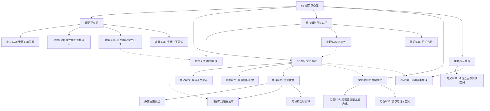

# 6B 规范正交基

> [!abstract] 本节概览
> 本节是内积空间理论的**核心应用篇**，从规范正交组的定义出发，建立规范正交基的三大计算优势，再通过格拉姆-施密特过程保证规范正交基的普遍存在性，最后导出舒尔定理与里斯表示定理两个重要应用。
>
> **逻辑链条**：规范正交组（定义 6.22）$\to$ 范数公式（6.24）$\to$ 线性无关（6.25）$\to$ 贝塞尔不等式（6.26）$\to$ 规范正交基（6.27）$\to$ 帕塞瓦尔恒等式（6.30）$\to$ 格拉姆-施密特过程（6.32）$\to$ 存在性（6.35）$\to$ 舒尔定理（6.38）$\to$ 里斯表示定理（6.42）。
>
> **前置依赖**：[[6A 内积和范数]]（内积、范数、正交、柯西-施瓦兹不等式、毕达哥拉斯定理）、[[5C 上三角矩阵]]（上三角矩阵、定理 5.39/5.44）、[[5B 最小多项式]]（代数基本定理 4.13）、[[3F 对偶]]（对偶空间）、[[5E 可交换算子]]（习题 20 参考）。
>
> **核心主线**：规范正交组 $\to$ 规范正交基（及其三大优势）$\to$ 格拉姆-施密特（保证存在性）$\to$ 舒尔定理（复空间上三角化）$\to$ 里斯表示定理（对偶空间的完美刻画）。

---

## 一、规范正交组与规范正交基

### 规范正交的定义

> [!def] 定义 6.22：规范正交（orthonormal）
> 如果一个向量组中所有向量的范数都是 $1$，且每个向量与其他向量都正交，则称该向量组是**规范正交的**。
>
> 换言之，$V$ 中向量组 $e_1, \ldots, e_m$ 是规范正交的，若对所有 $j, k \in \{1, \ldots, m\}$，
> $$\langle e_j, e_k \rangle = \begin{cases} 1, & j = k \\ 0, & j \neq k \end{cases}$$
> 用 Kronecker delta 符号可简洁地写为 $\langle e_j, e_k \rangle = \delta_{jk}$。

**生活化类比**：规范正交组就像三维空间中的标准基 $(1,0,0), (0,1,0), (0,0,1)$ —— 每个轴方向上的单位向量，彼此完全"垂直"，互不干扰。推广到任意内积空间，规范正交组就是一组"完美正交的坐标轴"。

> [!example] 例 6.23：规范正交组
>
> **(a)** $\mathbb{F}^n$ 的标准基是规范正交组。
>
> **(b)** $\left(\dfrac{1}{\sqrt{3}}, \dfrac{1}{\sqrt{3}}, \dfrac{1}{\sqrt{3}}\right),\; \left(-\dfrac{1}{\sqrt{2}}, \dfrac{1}{\sqrt{2}}, 0\right)$ 是 $\mathbb{F}^3$ 中的规范正交组。
>
> **(c)** $\left(\dfrac{1}{\sqrt{3}}, \dfrac{1}{\sqrt{3}}, \dfrac{1}{\sqrt{3}}\right),\; \left(-\dfrac{1}{\sqrt{2}}, \dfrac{1}{\sqrt{2}}, 0\right),\; \left(\dfrac{1}{\sqrt{6}}, \dfrac{1}{\sqrt{6}}, -\sqrt{\dfrac{2}{3}}\right)$ 是 $\mathbb{F}^3$ 中的规范正交组。
>
> **(d)** 设 $n$ 是正整数。那么
> $$\frac{1}{\sqrt{2\pi}},\; \frac{\cos x}{\sqrt{\pi}},\; \frac{\cos 2x}{\sqrt{\pi}},\; \ldots,\; \frac{\cos nx}{\sqrt{\pi}},\; \frac{\sin x}{\sqrt{\pi}},\; \frac{\sin 2x}{\sqrt{\pi}},\; \ldots,\; \frac{\sin nx}{\sqrt{\pi}}$$
> 是 $C[-\pi, \pi]$ 中的规范正交向量组，其中内积定义为 $\langle f, g \rangle = \int_{-\pi}^{\pi} fg$。上述规范正交组经常用于建立潮汐等周期现象的数学模型。
>
> **(e)** 在 $\mathcal{P}_2(\mathbb{R})$ 上定义内积 $\langle p, q \rangle = \int_{-1}^{1} pq$。标准基 $1, x, x^2$ 不是规范正交组（范数不为 1）。将每个向量除以各自的范数得到 $\frac{1}{\sqrt{2}},\; \sqrt{\frac{3}{2}}x,\; \sqrt{\frac{5}{2}}x^2$，其中第二个向量与第一个、第三个正交，但第一个和第三个不正交，因此该组不是规范正交组。很快我们就会知道如何由标准基构造规范正交组（见例 6.34）。

### 规范正交组线性组合的范数

> [!thm] 命题 6.24：规范正交组线性组合的范数
> 设 $e_1, \ldots, e_m$ 是 $V$ 中的规范正交向量组。那么对所有 $a_1, \ldots, a_m \in \mathbb{F}$，有
> $$\|a_1 e_1 + \cdots + a_m e_m\|^2 = |a_1|^2 + \cdots + |a_m|^2$$

> [!abstract] 证明思路
> 反复利用[[6A 内积和范数|毕达哥拉斯定理]]（6.12）即可得欲证等式。

**证明**：因为各 $e_k$ 的范数都是 $1$，所以只要反复利用毕达哥拉斯定理（6.12）即可得欲证等式。具体来说，设 $v = a_1 e_1 + \cdots + a_m e_m$，由于 $e_1, \ldots, e_m$ 两两正交，$a_1 e_1 \perp a_2 e_2 \perp \cdots \perp a_m e_m$，由毕达哥拉斯定理的推广形式：

**[逐步应用毕达哥拉斯定理]**：$\|v\|^2 = \|a_1 e_1 + \cdots + a_m e_m\|^2 = \|a_1 e_1\|^2 + \|a_2 e_2 + \cdots + a_m e_m\|^2 = |a_1|^2 + \|a_2 e_2\|^2 + \cdots + \|a_m e_m\|^2 = |a_1|^2 + \cdots + |a_m|^2$。$\blacksquare$

> [!note] 与勾股定理的关系
> 当 $n = 2$ 时，$\|a_1 e_1 + a_2 e_2\|^2 = |a_1|^2 + |a_2|^2$，这正是勾股定理。命题 6.24 是勾股定理在规范正交组上的直接推广。

### 规范正交组线性无关

> [!thm] 命题 6.25：规范正交组是线性无关的
> 每个规范正交向量组都是线性无关的。

> [!abstract] 证明思路
> 从零线性组合出发，对等式两边取范数，利用命题 6.24 将范数转化为系数模方之和，再由非负性推出所有系数为零。

**证明**：设 $e_1, \ldots, e_m$ 是 $V$ 中的规范正交向量组，且 $a_1, \ldots, a_m \in \mathbb{F}$ 满足

$$a_1 e_1 + \cdots + a_m e_m = 0$$

**[两边取范数]**：$\|a_1 e_1 + \cdots + a_m e_m\| = \|0\| = 0$

**[应用命题 6.24]**：$|a_1|^2 + \cdots + |a_m|^2 = 0$

**[非负性推出零系数]**：每个 $|a_k|^2 \geq 0$，它们的和为 0 意味着每一项都必须为 0，即 $a_k = 0$ 对所有 $k$。于是 $e_1, \ldots, e_m$ 是线性无关的。$\blacksquare$

### 贝塞尔不等式

> [!thm] 定理 6.26：贝塞尔不等式（Bessel's inequality）
> 设 $e_1, \ldots, e_m$ 是 $V$ 中的规范正交向量组。若 $v \in V$，那么
> $$|\langle v, e_1 \rangle|^2 + \cdots + |\langle v, e_m \rangle|^2 \leq \|v\|^2$$

> [!abstract] 证明思路
> 将 $v$ 正交分解为 $u + w$，其中 $u$ 是 $v$ 在规范正交组张成子空间上的投影分量，$w$ 是正交补分量。由毕达哥拉斯定理得 $\|v\|^2 = \|u\|^2 + \|w\|^2 \geq \|u\|^2$，再对 $u$ 应用命题 6.24 即得。

**证明**：设 $v \in V$。将 $v$ 分解为

$$v = \underbrace{\langle v, e_1 \rangle e_1 + \cdots + \langle v, e_m \rangle e_m}_{u} + \underbrace{\left(v - \langle v, e_1 \rangle e_1 - \cdots - \langle v, e_m \rangle e_m\right)}_{w}$$

**[验证 $w \perp e_k$]**：若 $k \in \{1, \ldots, m\}$，那么

$$\langle w, e_k \rangle = \langle v, e_k \rangle - \langle v, e_k \rangle \langle e_k, e_k \rangle = \langle v, e_k \rangle - \langle v, e_k \rangle \cdot 1 = 0$$

这意味着 $\langle w, u \rangle = 0$。

**[毕达哥拉斯定理]**：现由毕达哥拉斯定理可得

$$\|v\|^2 = \|u\|^2 + \|w\|^2 \geq \|u\|^2$$

**[应用命题 6.24]**：$\|u\|^2 = |\langle v, e_1 \rangle|^2 + \cdots + |\langle v, e_m \rangle|^2$，其中最后一行来自命题 6.24。$\blacksquare$

> [!important] 贝塞尔不等式的几何意义
> 向量 $v$ 在各个规范正交方向上的"投影长度平方之和"，不超过 $v$ 自身的"总长度平方"。投影只能"损失"信息，不能"创造"信息。等号成立当且仅当 $v \in \operatorname{span}(e_1, \ldots, e_m)$（此时 $w = 0$）。

### 规范正交基的定义

> [!def] 定义 6.27：规范正交基（orthonormal basis）
> $V$ 的**规范正交基**，就是 $V$ 中既是规范正交组又是基的向量组。

例如，标准基是 $\mathbb{F}^n$ 的一个规范正交基。

> [!thm] 命题 6.28：长度恰好的规范正交组是规范正交基
> 设 $V$ 是有限维的。那么 $V$ 中每个长度为 $\dim V$ 的规范正交向量组都是 $V$ 的规范正交基。

> [!abstract] 证明思路
> 由命题 6.25，规范正交组线性无关；再由 2.38（$n$ 个线性无关向量在 $n$ 维空间中构成基），长度恰好等于维数的规范正交组自动成为基。

**证明**：由命题 6.25，$V$ 中每个规范正交向量组都是线性无关的。于是每个这样的组，只要长度恰好等于 $\dim V$，就是一个基——见 2.38。$\blacksquare$

> [!example] 例 6.29：$\mathbb{F}^4$ 的一个规范正交基
> 标准基是 $\mathbb{F}^4$ 的规范正交基。下面说明以下四个向量同样是 $\mathbb{F}^4$ 的规范正交基：
> $$\left(\frac{1}{2}, \frac{1}{2}, \frac{1}{2}, \frac{1}{2}\right),\; \left(\frac{1}{2}, \frac{1}{2}, -\frac{1}{2}, -\frac{1}{2}\right),\; \left(\frac{1}{2}, -\frac{1}{2}, \frac{1}{2}, -\frac{1}{2}\right),\; \left(\frac{1}{2}, -\frac{1}{2}, -\frac{1}{2}, \frac{1}{2}\right)$$
>
> 验证：每个向量的范数为 $\sqrt{\frac{1}{4} + \frac{1}{4} + \frac{1}{4} + \frac{1}{4}} = 1$。任意两个不同向量的内积为 $0$（因为恰好有两个分量符号相同、两个分量符号相反）。由命题 6.28，该组是 $\mathbb{F}^4$ 的规范正交基。

### 规范正交基的三大优势

> [!thm] 定理 6.30：将向量写成规范正交基的线性组合
> 设 $e_1, \ldots, e_n$ 是 $V$ 的规范正交基且 $u, v \in V$。那么
>
> **(a)** $v = \langle v, e_1 \rangle e_1 + \cdots + \langle v, e_n \rangle e_n$
>
> **(b)** $\|v\|^2 = |\langle v, e_1 \rangle|^2 + \cdots + |\langle v, e_n \rangle|^2$（帕塞瓦尔恒等式，Parseval's identity）
>
> **(c)** $\langle u, v \rangle = \langle u, e_1 \rangle \overline{\langle v, e_1 \rangle} + \cdots + \langle u, e_n \rangle \overline{\langle v, e_n \rangle}$

> [!abstract] 证明思路
> **(a)** 因为 $e_1, \ldots, e_n$ 是基，$v = a_1 e_1 + \cdots + a_n e_n$。两端与 $e_k$ 做内积，由规范正交性得 $\langle v, e_k \rangle = a_k$。**(b)** 由 (a) 和命题 6.24 立刻可得。**(c)** 将 $u$ 与 (a) 两侧做内积，利用内积的共轭线性即得。

**证明**：

因为 $e_1, \ldots, e_n$ 是 $V$ 的基，所以存在标量 $a_1, \ldots, a_n$ 满足

$$v = a_1 e_1 + \cdots + a_n e_n$$

**[证明 (a)]**：因为 $e_1, \ldots, e_n$ 是规范正交的，将上式两端同时与 $e_k$ 作内积，可得 $\langle v, e_k \rangle = a_k$。于是 (a) 成立。

**[证明 (b)]**：由 (a) 和命题 6.24 立刻可知 (b) 成立。

**[证明 (c)]**：将 $u$ 同时与式 (a) 两侧作内积，并利用内积在第二个位置上的共轭线性【6.6 (d) 和 6.6 (e)】即可得 (c)。$\blacksquare$

> [!success] 规范正交基的三大优势
> 1. **系数直接读出**：$a_k = \langle v, e_k \rangle$，只需做一个内积，无需解线性方程组。
> 2. **帕塞瓦尔恒等式**：$\|v\|^2 = \sum |\langle v, e_k \rangle|^2$，向量总能量等于各分量能量之和。
> 3. **内积按坐标计算**：$\langle u, v \rangle = \sum \langle u, e_k \rangle \overline{\langle v, e_k \rangle}$，所有内积空间在规范正交基下都"看起来像" $\mathbb{F}^n$。

> [!example] 例 6.31：求出一个线性组合的系数
> 将向量 $(1, 2, 4, 7) \in \mathbb{F}^4$ 写成例 6.29 中规范正交基的线性组合。如果用的是非规范正交基，一般需要解含有四个方程、四个未知数的线性方程组。而此处只需求四个内积并利用定理 6.30 (a)，可得 $(1, 2, 4, 7)$ 等于
> $$7 \left(\frac{1}{2}, \frac{1}{2}, \frac{1}{2}, \frac{1}{2}\right) - 4 \left(\frac{1}{2}, \frac{1}{2}, -\frac{1}{2}, -\frac{1}{2}\right) + 2 \left(\frac{1}{2}, -\frac{1}{2}, \frac{1}{2}, -\frac{1}{2}\right) - \left(\frac{1}{2}, -\frac{1}{2}, -\frac{1}{2}, \frac{1}{2}\right)$$
>
> 各系数分别为 $\langle (1,2,4,7), e_1 \rangle = \frac{1+2+4+7}{2} = 7$，$\langle (1,2,4,7), e_2 \rangle = \frac{1+2-4-7}{2} = -4$，$\langle (1,2,4,7), e_3 \rangle = \frac{1-2+4-7}{2} = -2$，$\langle (1,2,4,7), e_4 \rangle = \frac{1-2-4+7}{2} = 1$。

---

## 二、格拉姆-施密特过程

### 定理陈述与公式

既然规范正交基如此强大，我们如何求出它们？下面这个结论给出了将线性无关组转化为规范正交组的系统性方法。

> [!thm] 定理 6.32：格拉姆-施密特过程（Gram-Schmidt procedure）
> 设 $v_1, \ldots, v_m$ 是 $V$ 中的线性无关向量组。令 $f_1 = v_1$。对 $k = 2, \ldots, m$，依次定义 $f_k$ 为
> $$f_k = v_k - \frac{\langle v_k, f_1 \rangle}{\|f_1\|^2}\, f_1 - \cdots - \frac{\langle v_k, f_{k-1}\rangle}{\|f_{k-1}\|^2}\, f_{k-1}$$
> 对每个 $k = 1, \ldots, m$，令 $e_k = \dfrac{f_k}{\|f_k\|}$。那么 $e_1, \ldots, e_m$ 是 $V$ 中的规范正交向量组，且对每个 $k = 1, \ldots, m$ 满足
> $$\operatorname{span}(v_1, \ldots, v_k) = \operatorname{span}(e_1, \ldots, e_k)$$

> [!abstract] 证明思路
> 对 $k$ 用数学归纳法。归纳基础 $k=1$：$e_1 = f_1/\|f_1\|$，规范性显然，张成空间相等因为 $e_1$ 是 $v_1$ 的非零倍。归纳步：由线性无关性保证 $f_k \neq 0$；验证 $\langle e_k, e_j \rangle = 0$（交叉项消去）；由 $v_k$ 的表达式得张成空间的双向包含，结合维数相等完成证明。

**证明**：

我们对 $k$ 用归纳法来证明欲证结论成立。

**[归纳基础]**（$k = 1$）：注意因为 $e_1 = f_1 / \|f_1\|$，所以我们有 $\|e_1\| = 1$；另外，$\operatorname{span}(v_1) = \operatorname{span}(e_1)$ 因为 $e_1$ 是 $v_1$ 的非零倍。

**[归纳假设]**：设 $1 < k \leq m$，并设由定理 6.32 构造出的组 $e_1, \ldots, e_{k-1}$ 是规范正交组且满足下式：
$$\operatorname{span}(v_1, \ldots, v_{k-1}) = \operatorname{span}(e_1, \ldots, e_{k-1}) \tag{6.33}$$

**[验证 $f_k \neq 0$]**：因为 $v_1, \ldots, v_m$ 是线性无关的，所以我们有 $v_k \notin \operatorname{span}(v_1, \ldots, v_{k-1})$。于是 $v_k \notin \operatorname{span}(e_1, \ldots, e_{k-1}) = \operatorname{span}(f_1, \ldots, f_{k-1})$，这意味着 $f_k \neq 0$。于是定理 6.32 中定义 $e_k$ 时就不会出现除以零的问题。将一个向量除以其范数会得到范数为 $1$ 的向量，因而 $\|e_k\| = 1$。

**[验证正交性]**：令 $j \in \{1, \ldots, k-1\}$。那么

$$\langle e_k, e_j \rangle = \frac{1}{\|f_k\|\|f_j\|} \langle f_k, f_j \rangle$$

$$= \frac{1}{\|f_k\|\|f_j\|} \left\langle v_k - \frac{\langle v_k, f_1 \rangle}{\|f_1\|^2} f_1 - \cdots - \frac{\langle v_k, f_{k-1}\rangle}{\|f_{k-1}\|^2} f_{k-1},\; f_j \right\rangle$$

$$= \frac{1}{\|f_k\|\|f_j\|} \left( \langle v_k, f_j \rangle - \langle v_k, f_j \rangle \right) = 0$$

于是 $e_1, \ldots, e_k$ 是规范正交组。

**[验证张成空间相等]**：由定理 6.32 给出的 $e_k$ 定义，可见 $v_k \in \operatorname{span}(e_1, \ldots, e_k)$。将其与式 (6.33) 相结合可得

$$\operatorname{span}(v_1, \ldots, v_k) \subseteq \operatorname{span}(e_1, \ldots, e_k)$$

上式中的两个组都是线性无关的（各 $v$ 线性无关是由于前提条件，各 $e$ 线性无关是由于它们规范正交和命题 6.25）。于是这两个子空间的维数都为 $k$，因此它们相等，这就完成了归纳步骤的证明，由此完成了整个证明。$\blacksquare$

### 计算示例

> [!example] 例 6.34：$\mathcal{P}_2(\mathbb{R})$ 的一个规范正交基
> 在 $\mathcal{P}_2(\mathbb{R})$ 上定义内积 $\langle p, q \rangle = \int_{-1}^{1} pq$。对基 $v_1 = 1,\; v_2 = x,\; v_3 = x^2$ 执行格拉姆-施密特过程。
>
> **第一步**：$f_1 = v_1 = 1$。$\|f_1\|^2 = \int_{-1}^{1} 1 \, dx = 2$。$e_1 = \dfrac{1}{\sqrt{2}}$。
>
> **第二步**：
> $$f_2 = v_2 - \frac{\langle v_2, f_1 \rangle}{\|f_1\|^2} f_1 = x - \frac{\langle x, 1 \rangle}{2} \cdot 1 = x$$
> 其中 $\langle x, 1 \rangle = \int_{-1}^{1} t \, dt = 0$（奇函数在对称区间上积分为 0）。
>
> $\|f_2\|^2 = \int_{-1}^{1} t^2 \, dt = \dfrac{2}{3}$。$e_2 = \sqrt{\dfrac{3}{2}}\, x$。
>
> **第三步**：
> $$f_3 = v_3 - \frac{\langle v_3, f_1 \rangle}{\|f_1\|^2} f_1 - \frac{\langle v_3, f_2 \rangle}{\|f_2\|^2} f_2 = x^2 - \langle x^2, 1 \rangle \cdot \frac{1}{2} - \langle x^2, x \rangle \cdot \frac{3}{2} x = x^2 - \frac{1}{3}$$
> 其中 $\langle x^2, 1 \rangle = \int_{-1}^{1} t^2 \, dt = \frac{2}{3}$，$\langle x^2, x \rangle = \int_{-1}^{1} t^3 \, dt = 0$。
>
> $\|f_3\|^2 = \int_{-1}^{1} \left(t^2 - \frac{1}{3}\right)^2 dt = \int_{-1}^{1} \left(t^4 - \frac{2}{3}t^2 + \frac{1}{9}\right) dt = \frac{2}{5} - \frac{4}{9} + \frac{2}{9} = \frac{8}{45}$。
>
> $e_3 = \dfrac{x^2 - 1/3}{\sqrt{8/45}} = \sqrt{\dfrac{45}{8}} \left(x^2 - \dfrac{1}{3}\right) = \sqrt{\dfrac{5}{8}} \left(3x^2 - 1\right)$。
>
> **最终结果**：
> $$e_1 = \frac{1}{\sqrt{2}},\quad e_2 = \sqrt{\frac{3}{2}}\, x,\quad e_3 = \sqrt{\frac{5}{8}} \left(3x^2 - 1\right)$$
> 这个规范正交组的长度是 3，恰等于 $\dim \mathcal{P}_2(\mathbb{R})$。因此该规范正交组就是 $\mathcal{P}_2(\mathbb{R})$ 的规范正交基（由命题 6.28）。

### 存在性与可扩充性

> [!thm] 定理 6.35：规范正交基的存在性
> 每个有限维内积空间都有规范正交基。

> [!abstract] 证明思路
> 取 $V$ 的任意一个基，对其应用格拉姆-施密特过程（定理 6.32），可得长为 $\dim V$ 的规范正交组。由命题 6.28，这个规范正交组就是 $V$ 的一个规范正交基。

**证明**：设 $V$ 是有限维的。选取 $V$ 的一个基，对其应用格拉姆-施密特过程（6.32），可得长为 $\dim V$ 的规范正交组。由 6.28，这个规范正交组就是 $V$ 的一个规范正交基。$\blacksquare$

> [!thm] 推论 6.36：每个规范正交组都可被扩充为规范正交基
> 设 $V$ 是有限维的。那么 $V$ 中每个规范正交向量组都能被扩充为 $V$ 的一个规范正交基。

> [!abstract] 证明思路
> 规范正交组线性无关（命题 6.25），可扩充为一般基（2.32）。对整组基执行格拉姆-施密特过程，前 $m$ 个向量已经是规范正交的，过程保持它们不变，只处理后续向量。

**证明**：设 $e_1, \ldots, e_m$ 是 $V$ 中的一个规范正交向量组。那么 $e_1, \ldots, e_m$ 是线性无关的（由命题 6.25）。因此该组可被扩充为 $V$ 的一个基 $e_1, \ldots, e_m, v_1, \ldots, v_n$（见 2.32）。现在对 $e_1, \ldots, e_m, v_1, \ldots, v_n$ 应用格拉姆-施密特过程（6.32），可得规范正交组 $e_1, \ldots, e_m, f_1, \ldots, f_n$。

格拉姆-施密特过程所用的公式保持组中前 $m$ 个向量不变，因为这些向量已经是规范正交的了。由命题 6.28 可知上述组是 $V$ 的规范正交基。$\blacksquare$

---

## 三、舒尔定理与上三角化

### 规范正交基下的上三角矩阵

回忆一下，称一个矩阵为上三角矩阵，如果对角线之下的所有元素均为 0。在[[5C 上三角矩阵]]中，我们给出了一个算子关于某个基具有上三角矩阵的充要条件（见 5.44）。既然我们现在研究内积空间，我们就想知道是否存在一个规范正交基，使得算子关于它存在上三角矩阵。

> [!thm] 定理 6.37：关于某个规范正交基有上三角矩阵
> 设 $V$ 是有限维的，$T \in \mathcal{L}(V)$。那么 $T$ 关于 $V$ 的某个规范正交基有上三角矩阵，当且仅当 $T$ 的最小多项式等于 $(z - \lambda_1) \cdots (z - \lambda_m)$，其中 $\lambda_1, \ldots, \lambda_m \in \mathbb{F}$。

> [!abstract] 证明思路
> 必要性由定理 5.44 直接给出。充分性：设 $T$ 关于基 $v_1, \ldots, v_n$ 有上三角矩阵，则各 $\operatorname{span}(v_1, \ldots, v_k)$ 在 $T$ 下不变（定理 5.39）。对 $v_1, \ldots, v_n$ 应用格拉姆-施密特过程得规范正交基 $e_1, \ldots, e_n$。因为 $\operatorname{span}(e_1, \ldots, e_k) = \operatorname{span}(v_1, \ldots, v_k)$ 对每个 $k$ 成立（定理 6.32），所以各 $\operatorname{span}(e_1, \ldots, e_k)$ 在 $T$ 下也不变。由定理 5.39，$T$ 关于规范正交基 $e_1, \ldots, e_n$ 具有上三角矩阵。

**证明**：设 $T$ 关于 $V$ 的某个基 $v_1, \ldots, v_n$ 具有上三角矩阵。于是对各 $k = 1, \ldots, n$，$\operatorname{span}(v_1, \ldots, v_k)$ 在 $T$ 下是不变的（见 5.39）。

**[应用格拉姆-施密特过程]**：对 $v_1, \ldots, v_n$ 应用格拉姆-施密特过程，可得 $V$ 的一个规范正交基 $e_1, \ldots, e_n$。因为

$$\operatorname{span}(e_1, \ldots, e_k) = \operatorname{span}(v_1, \ldots, v_k)$$

对每个 $k$ 都成立（见定理 6.32），所以我们可推断出，对各 $k = 1, \ldots, n$，$\operatorname{span}(e_1, \ldots, e_k)$ 在 $T$ 下是不变的。

**[应用定理 5.39]**：从而由 5.39，$T$ 关于规范正交基 $e_1, \ldots, e_n$ 具有上三角矩阵。现在利用 5.44 即可完成证明。$\blacksquare$

> [!important] 定理 6.37 的关键洞察
> 格拉姆-施密特过程不仅保持张成空间不变，还保持**不变子空间链**不变。这意味着：如果算子关于某个基有上三角矩阵，那么关于对应的规范正交基也有上三角矩阵。规范正交基是"免费的升级"。

### 舒尔定理

> [!thm] 定理 6.38：舒尔定理（Schur's theorem）
> 有限维复内积空间上的每个算子都关于某个规范正交基有上三角矩阵。

> [!abstract] 证明思路
> 由[[5B 最小多项式|代数基本定理]]的版本二（4.13）和定理 6.37 即可证明。

**证明**：由代数基本定理的版本二（4.13），有限维复向量空间上每个算子的最小多项式都能分解为一次因式的乘积 $(z - \lambda_1) \cdots (z - \lambda_m)$。再由定理 6.37 即可得出结论。$\blacksquare$

> [!warning] 舒尔定理的域限制
> ==舒尔定理要求 $\mathbb{F} = \mathbb{C}$（复数域）==。在实数域上，并非所有算子的最小多项式都能分解为一次因式的乘积（例如旋转矩阵的最小多项式 $z^2 + 1$ 在 $\mathbb{R}$ 上不可约），因此舒尔定理在实数域上不一定成立。

> [!note] 舒尔定理 vs 定理 5.44 的对比
> | | 定理 5.44 | 定理 6.38（舒尔定理） |
> |:---:|:---:|:---:|
> | **空间类型** | 一般有限维复向量空间 | 有限维复**内积**空间 |
> | **基的类型** | 任意基 | **规范正交**基 |
> | **证明方法** | 一般基的扩充 | 代数基本定理 + 定理 6.37 |
> | **矩阵** | 上三角 | 上三角（但基更好） |
>
> 舒尔定理的改进看似微小（把"某个基"换成"规范正交基"），但影响深远。有了规范正交基，矩阵的转置和共轭转置有了清晰的几何意义，这为后续讨论正规算子、谱定理等核心内容奠定了基础。

---

## 四、里斯表示定理

### 线性泛函与对偶空间

> [!def] 定义 6.39：线性泛函（linear functional）、对偶空间（dual space）
> $V$ 上的一个**线性泛函**是一个从 $V$ 到 $\mathbb{F}$ 的线性映射。
> $V$ 的**对偶空间**记作 $V'$，是 $V$ 上全体线性泛函所构成的向量空间。换言之，$V' = \mathcal{L}(V, \mathbb{F})$。

**生活化类比**：线性泛函就像一个"评分机器"——你输入一个向量，它输出一个分数。线性性意味着：如果你把两个向量"合起来"输入，得分等于分别输入的得分之和；如果你把向量"放大"两倍输入，得分也翻倍。

> [!example] 例 6.40：$\mathbb{F}^3$ 上的线性泛函
> 定义为 $\varphi(z_1, z_2, z_3) = 2z_1 - 5z_2 + z_3$ 的函数 $\varphi: \mathbb{F}^3 \to \mathbb{F}$ 是 $\mathbb{F}^3$ 上的线性泛函。我们可将该泛函写成如下形式：对每个 $z \in \mathbb{F}^3$，
> $$\varphi(z) = \langle z, w \rangle$$
> 其中 $w = (2, -5, 1)$。

> [!example] 例 6.41：$\mathcal{P}_5(\mathbb{R})$ 上的线性泛函
> 定义为 $\varphi(p) = \int_{-1}^{1} p(t) \cos(\pi t)\, dt$ 的函数 $\varphi: \mathcal{P}_5(\mathbb{R}) \to \mathbb{R}$ 是 $\mathcal{P}_5(\mathbb{R})$ 上的线性泛函。

### 里斯表示定理

如果 $v \in V$，那么将 $u$ 对应至 $\langle u, v \rangle$ 的映射是 $V$ 上的线性泛函。下面结论说明，$V$ 上每个线性泛函都可写成该形式。

> [!thm] 定理 6.42：里斯表示定理（Riesz representation theorem）
> 设 $V$ 是有限维的，$\varphi$ 是 $V$ 上的线性泛函。那么存在唯一的向量 $v \in V$，使得对每个 $u \in V$ 都有
> $$\varphi(u) = \langle u, v \rangle$$

> [!abstract] 证明思路
> **存在性**：取规范正交基 $e_1, \ldots, e_n$，构造 $v = \varphi(e_1)e_1 + \cdots + \varphi(e_n)e_n$，利用定理 6.30 (a) 将任意 $u$ 展开，再利用 $\varphi$ 的线性性验证 $\varphi(u) = \langle u, v \rangle$。**唯一性**：设 $v_1, v_2$ 都满足条件，则 $\langle u, v_1 - v_2 \rangle = 0$ 对所有 $u$ 成立，取 $u = v_1 - v_2$ 得 $\|v_1 - v_2\|^2 = 0$，从而 $v_1 = v_2$。

**证明**：

首先我们证明存在向量 $v \in V$ 使得对每个 $u \in V$ 有 $\varphi(u) = \langle u, v \rangle$。

**[存在性]**：设 $e_1, \ldots, e_n$ 是 $V$ 的规范正交基。那么对每个 $u \in V$ 有

$$\varphi(u) = \varphi\!\left(\langle u, e_1 \rangle e_1 + \cdots + \langle u, e_n \rangle e_n\right)$$

$$= \langle u, e_1 \rangle \varphi(e_1) + \cdots + \langle u, e_n \rangle \varphi(e_n)$$

$$= \left\langle u,\; \varphi(e_1) e_1 + \cdots + \varphi(e_n) e_n \right\rangle$$

其中第一个等号源于定理 6.30 (a)。从而，设

$$v = \varphi(e_1) e_1 + \cdots + \varphi(e_n) e_n \tag{6.43}$$

我们就可得对每个 $u \in V$，都有 $\varphi(u) = \langle u, v \rangle$，存在性得证。

**[唯一性]**：设 $v_1, v_2 \in V$ 使得对于每个 $u \in V$，有

$$\varphi(u) = \langle u, v_1 \rangle = \langle u, v_2 \rangle$$

那么对每个 $u \in V$，有

$$0 = \langle u, v_1 \rangle - \langle u, v_2 \rangle = \langle u, v_1 - v_2 \rangle$$

取 $u = v_1 - v_2$ 就可得 $\|v_1 - v_2\|^2 = 0$。于是 $v_1 = v_2$，这就完成了原命题唯一性部分的证明。$\blacksquare$

> [!note] 里斯表示定理的深刻含义
> ==在内积空间中，对偶空间 $V'$ 与原空间 $V$ 是"同构"的==——每个线性泛函都唯一对应 $V$ 中的一个向量。这个同构是通过内积实现的，称为**里斯同构**（Riesz isomorphism）。在一般向量空间中（没有内积），$V'$ 和 $V$ 是"不同"的空间（见 [[3F 对偶]]），但内积赋予了它们自然的等同关系。

> [!example] 例 6.44：里斯表示定理的计算演示
> 假设我们想求出多项式 $q \in \mathcal{P}_2(\mathbb{R})$ 使得
> $$\int_{-1}^{1} p(t) \cos(\pi t)\, dt = \int_{-1}^{1} p(t) q(t)\, dt$$
> 对所有多项式 $p \in \mathcal{P}_2(\mathbb{R})$ 都成立。定义 $\mathcal{P}_2(\mathbb{R})$ 上的线性泛函 $\varphi(p) = \int_{-1}^{1} p(t) \cos(\pi t)\, dt$。
>
> 选用例 6.34 中的规范正交基 $e_1 = \frac{1}{\sqrt{2}},\; e_2 = \sqrt{\frac{3}{2}}\, x,\; e_3 = \sqrt{\frac{5}{8}}(3x^2 - 1)$，运用式 (6.43)：
> $$q(x) = \varphi(e_1) e_1 + \varphi(e_2) e_2 + \varphi(e_3) e_3$$
> $$= \int_{-1}^{1} \frac{1}{\sqrt{2}} \cos(\pi t)\, dt \cdot \frac{1}{\sqrt{2}} + \int_{-1}^{1} \sqrt{\frac{3}{2}}\, t \cos(\pi t)\, dt \cdot \sqrt{\frac{3}{2}}\, x + \int_{-1}^{1} \sqrt{\frac{5}{8}}(3t^2 - 1) \cos(\pi t)\, dt \cdot \sqrt{\frac{5}{8}}(3x^2 - 1)$$
>
> 运用微积分知识计算各积分，最终解出
> $$q(x) = \frac{15}{2\pi^2}(1 - 3x^2)$$

---

## 五、知识结构总览

---

## 六、核心思想与证明技巧

> [!success] 核心思想
>
> 1. **规范正交基是最优基**：它让系数、范数、内积的计算全部"退化"为简单的坐标运算。三大优势（系数公式、帕塞瓦尔恒等式、内积按坐标计算）是规范正交基成为"首选基"的根本原因。
>
> 2. **格拉姆-施密特是万能构造器**：从任意线性无关组出发，系统性地构造规范正交组，同时保持张成空间不变。它保证了规范正交基的普遍存在性。
>
> 3. **内积空间中，对偶空间等同于原空间**：里斯表示定理建立了 $V' \cong V$ 的自然同构，这是内积空间区别于一般向量空间的本质特征。
>
> 4. **正交性蕴含线性无关**：规范正交性是比线性无关更强的条件，自动保证线性无关（命题 6.25）。

> [!tip] 证明技巧清单
>
> 1. **规范正交性消去交叉项**：在涉及规范正交组的证明中，展开内积后 $\langle e_j, e_k \rangle = \delta_{jk}$ 会自动消去所有 $j \neq k$ 的交叉项。这是最常用的技巧，在命题 6.24、定理 6.26、定理 6.30、定理 6.32 的证明中都出现了。
>
> 2. **归纳法 + 格拉姆-施密特**：证明"存在规范正交基"类问题时，归纳法几乎是必选。格拉姆-施密特证明的归纳步核心：(1) $f_k \neq 0$ 由线性无关性保证；(2) $\langle e_k, e_j \rangle = 0$ 由交叉项消去保证；(3) 张成空间相等由双向包含 + 维数相等保证。
>
> 3. **里斯表示定理的构造**：取规范正交基，令 $v = \sum \varphi(e_k) e_k$（注意：这里不需要取复共轭，因为教材中内积关于第一变元线性）。
>
> 4. **唯一性证明的通用套路**：假设两个对象效果相同，取差，证明差为零（利用正性 $\|x\|^2 = 0 \Rightarrow x = 0$）。这个套路在里斯表示定理唯一性中出现了。
>
> 5. **舒尔定理的证明模式**：代数基本定理（保证最小多项式可分解）+ 定理 6.37（格拉姆-施密特保持不变子空间链）。这个模式体现了"代数条件 + 几何工具"的结合。

---

## 七、补充理解与易混淆点

### 格拉姆-施密特过程的几何直觉与 QR 分解

格拉姆-施密特过程的几何本质是**逐步投影与减法**。每处理一个新向量 $v_k$ 时，计算它在所有已处理方向 $e_1, \ldots, e_{k-1}$ 上的投影，然后从 $v_k$ 中减去这些投影，只保留"全新方向"的成分 $f_k$。最后将 $f_k$ 归一化为 $e_k$。

从矩阵的角度看，格拉姆-施密特过程等价于 **QR 分解**。设 $A$ 是一个 $n \times m$ 矩阵（列满秩），其列向量为 $v_1, \ldots, v_m$。格拉姆-施密特过程将 $A$ 分解为 $A = QR$，其中 $Q$ 的列是规范正交向量 $e_1, \ldots, e_m$，$R$ 是上三角矩阵，其对角线元素为 $\|f_k\|$。QR 分解在数值线性代数中极为重要，是最小二乘问题、特征值计算等算法的基础。

然而，经典的格拉姆-施密特过程在数值计算中存在**不稳定性**问题。当列向量接近线性相关时，$r_{jj} \ll \|a_j\|_2$，减法过程中的舍入误差会导致计算出的 $q_j$ 不再正交于前面的 $q_i$。实际应用中通常使用 **Householder 变换**或 **Givens 旋转**来计算 QR 分解，它们具有更好的数值稳定性。

**来源**：Sebastien Roch (UW-Madison) Math 535 QR 分解与 Householder 变换讲义、Xiangmin Jiao (Stony Brook) AMS526 数值线性代数讲义、UCLA Math 270B QR 分解讲义、Stanford EE263 QR 分解讲义、Cornell CS4220/6210 数值分析讲义。

### 傅里叶级数与规范正交基

例 6.23 (d) 中的三角函数组

$$\frac{1}{\sqrt{2\pi}},\; \frac{\cos x}{\sqrt{\pi}},\; \frac{\sin x}{\sqrt{\pi}},\; \frac{\cos 2x}{\sqrt{\pi}},\; \frac{\sin 2x}{\sqrt{\pi}},\; \ldots$$

是 $C[-\pi, \pi]$ 中的规范正交组。这并非偶然——它正是**傅里叶级数**理论的代数基础。在傅里叶级数理论中，我们将一个周期函数 $f$ 展开为

$$f(x) \approx \frac{a_0}{2} + \sum_{k=1}^{n} \left(a_k \cos kx + b_k \sin kx\right)$$

其中系数 $a_k = \langle f, \cos kx / \sqrt{\pi} \rangle / \sqrt{\pi}$，$b_k = \langle f, \sin kx / \sqrt{\pi} \rangle / \sqrt{\pi}$。这正是定理 6.30 (a) 的系数公式！

贝塞尔不等式（定理 6.26）在傅里叶分析中表述为：部分傅里叶系数捕获的能量不超过信号总能量。当三角函数组扩充为完备的规范正交基时（在 $L^2[-\pi, \pi]$ 意义下），贝塞尔不等式变为等式——这就是**帕塞瓦尔恒等式**（定理 6.30 (b)），它表明信号的时域能量等于频域能量。

**来源**：MIT 18.102 泛函分析讲义（规范正交基与傅里叶级数）、Ken Richardson (TCU) 傅里叶级数引论讲义、U of Toronto APM346 傅里叶级数讲义（帕塞瓦尔恒等式）、Oliver Knill (Harvard) 傅里叶基定理讲义、John Hunter (UC Davis) 傅里叶级数教材第 7 章。

### 里斯表示定理的意义

里斯表示定理是内积空间理论中最深刻的结果之一，它建立了对偶空间与原空间之间的**自然同构**。

在有限维内积空间中，里斯表示定理告诉我们：$V$ 上的每个线性泛函 $\varphi$ 都可以唯一地表示为 $\varphi(u) = \langle u, v \rangle$。这意味着 $V' \cong V$，且这个同构是"自然的"——不依赖于基的选取（尽管证明中使用了规范正交基，但唯一性保证了结果与基无关）。

在量子力学中，里斯表示定理是**狄拉克符号**（bra-ket notation）的数学基础。量子态用右矢 $|\psi\rangle$ 表示（对应 $V$ 中的向量），而左矢 $\langle \phi|$ 表示线性泛函（对应 $V'$ 中的元素）。里斯表示定理保证了每个左矢 $\langle \phi|$ 都唯一对应一个右矢 $|\phi\rangle$，使得 $\langle \phi | \psi \rangle = \langle |\psi\rangle, |\phi\rangle$。内积 $\langle \phi | \psi \rangle$ 既可以理解为线性泛函 $\langle \phi|$ 作用于 $|\psi\rangle$，也可以理解为两个向量的内积。

在无限维空间中，里斯表示定理需要额外条件：线性泛函必须是**有界的**（连续的），且空间必须是**完备的**（希尔伯特空间）。习题 22 给出了一个反例：$C[-1, 1]$ 上的求值泛函 $\varphi(f) = f(0)$ 无法表示为与某个连续函数的内积。

**来源**：Vadim Turaev (UT Austin) 希尔伯特空间与量子力学讲义、Purdue IQC 量子计算讲义（bra-ket 符号）、Mark Poremba (BU) 量子信息中的 bra-ket 符号讲义、Ethan Adler (UChicago) 希尔伯特空间与里斯表示定理论文、Wikipedia 里斯表示定理。

### 常见误区

> [!danger] 误区 1："规范正交组一定构成基"
> ❌ 错误认知：有限维空间中，任何规范正交组都是规范正交基。
> ✅ 正确理解：规范正交组必须长度恰好等于 $\dim V$ 才是基（命题 6.28）。例如 $\mathbb{R}^3$ 中两个正交单位向量构成规范正交组，但不是基。规范正交组线性无关（命题 6.25），但线性无关组不一定是基。

> [!danger] 误区 2："格拉姆-施密特过程要求输入是基"
> ❌ 错误认知：格拉姆-施密特过程只能应用于基，输入必须是完整的基。
> ✅ 正确理解：格拉姆-施密特过程可以应用于**任何线性无关组**（定理 6.32），输出的规范正交组与输入组张成相同的子空间。如果输入是基（$m = \dim V$），则输出是规范正交基。如果输入不是基，则输出只是规范正交组。

> [!danger] 误区 3："贝塞尔不等式总是取等号"
> ❌ 错误认知：$\|v\|^2 = |\langle v, e_1 \rangle|^2 + \cdots + |\langle v, e_m \rangle|^2$ 总成立。
> ✅ 正确理解：等号成立当且仅当 $v \in \operatorname{span}(e_1, \ldots, e_m)$（习题 3）。当 $v$ 有垂直于规范正交组张成子空间的分量时，严格不等式成立。只有当规范正交组扩充为规范正交基时，帕塞瓦尔恒等式才对所有 $v$ 成立。

> [!danger] 误区 4："舒尔定理在实数域上也成立"
> ❌ 错误认知：任何有限维内积空间上的算子都有上三角矩阵。
> ✅ 正确理解：舒尔定理（定理 6.38）要求 $\mathbb{F} = \mathbb{C}$（复数域）。在实数域上，算子的最小多项式不一定能分解为一次因式的乘积（例如 $z^2 + 1$ 在 $\mathbb{R}$ 上不可约），因此不一定存在上三角矩阵。实数域上的对应结果是**实舒尔分解**：矩阵可以分块上三角化，对角块为 $1 \times 1$ 或 $2 \times 2$。

> [!danger] 误区 5："里斯表示定理在无限维也成立"
> ❌ 错误认知：任何无限维内积空间上的线性泛函都可表示为内积。
> ✅ 正确理解：里斯表示定理在无限维空间中需要两个额外条件：(1) 线性泛函必须是**有界的**（连续的）；(2) 空间必须是**完备的**（即希尔伯特空间）。习题 22 给出了反例：$C[-1, 1]$ 上的求值泛函 $\varphi(f) = f(0)$ 无法表示为与某个连续函数的内积。

> [!danger] 误区 6："格拉姆-施密特过程是唯一的"
> ❌ 错误认知：给定输入向量组，格拉姆-施密特过程只产生唯一的规范正交组。
> ✅ 正确理解：在实数域上，给定线性无关组 $v_1, \ldots, v_m$，存在恰好 $2^m$ 个规范正交组满足 $\operatorname{span}(v_1, \ldots, v_k) = \operatorname{span}(e_1, \ldots, e_k)$（习题 14）。这是因为每一步归一化时，$e_k = \pm f_k / \|f_k\|$ 都有两种符号选择。在复数域上选择更多（每个 $e_k$ 可以乘以任意模为 1 的复数）。

---

## 八、习题精选

> [!todo] 本节习题
>
> 以下习题选自 LADR 4e 第 6B 节，共 7 题，覆盖本节核心知识点。
>
> | 习题号 | 标题 | 核心考点 | 难度 |
> |:---:|:---:|:---:|:---:|
> | 1 | 6.24 的逆命题 | 范数公式蕴含规范正交性 | 中 |
> | 3 | 贝塞尔不等式等号条件 | 等号成立当且仅当 $v$ 在 span 中 | 中 |
> | 8 | 格拉姆-施密特与上三角矩阵 | GS 过程 + 定理 6.37 应用 | 高 |
> | 9 | GS 过程中内积正性 | $\langle v_k, e_k \rangle > 0$ | 中 |
> | 13 | GS 过程与线性相关性 | $f_k = 0$ 当且仅当线性相关 | 中 |
> | 20 | 可交换算子的规范正交上三角化 | 定理 6.38 的推广 | 高 |
> | 22 | 里斯表示定理在无限维不成立 | $C[-1,1]$ 上的反例 | 高 |

### 习题 1：6.24 的逆命题

> [!problem] 习题 1
> 设 $e_1, \ldots, e_m$ 是 $V$ 中的一向量组，使得
> $$\|a_1 e_1 + \cdots + a_m e_m\|^2 = |a_1|^2 + \cdots + |a_m|^2$$
> 对所有 $a_1, \ldots, a_m \in \mathbb{F}$ 成立。证明 $e_1, \ldots, e_m$ 是规范正交组。

> [!faq]- 查看解答
> **证明**：我们需要证明 $\langle e_j, e_k \rangle = \delta_{jk}$。
>
> **[规范性]**：取 $a_j = 1$，其余 $a_k = 0$（$k \neq j$）。则 $\|e_j\|^2 = 1$，即 $\|e_j\| = 1$。
>
> **[正交性]**：取 $a_j = 1$，$a_k = 1$（$j \neq k$），其余为 0。则
> $$\|e_j + e_k\|^2 = 1^2 + 1^2 = 2$$
> 另一方面，$\|e_j + e_k\|^2 = \|e_j\|^2 + \langle e_j, e_k \rangle + \langle e_k, e_j \rangle + \|e_k\|^2 = 1 + \langle e_j, e_k \rangle + \overline{\langle e_j, e_k \rangle} + 1 = 2 + 2\operatorname{Re}\langle e_j, e_k \rangle$。
>
> 所以 $2 + 2\operatorname{Re}\langle e_j, e_k \rangle = 2$，即 $\operatorname{Re}\langle e_j, e_k \rangle = 0$。
>
> 再取 $a_j = 1$，$a_k = i$（$j \neq k$），其余为 0。则
> $$\|e_j + ie_k\|^2 = 1^2 + |i|^2 = 2$$
> 另一方面，$\|e_j + ie_k\|^2 = \|e_j\|^2 + \langle e_j, ie_k \rangle + \langle ie_k, e_j \rangle + \|ie_k\|^2 = 1 + \bar{i}\langle e_j, e_k \rangle + i\overline{\langle e_j, e_k \rangle} + 1 = 2 + 2\operatorname{Im}\langle e_j, e_k \rangle$。
>
> 所以 $\operatorname{Im}\langle e_j, e_k \rangle = 0$。
>
> 综上，$\langle e_j, e_k \rangle = 0$（$j \neq k$），且 $\|e_j\| = 1$。因此 $e_1, \ldots, e_m$ 是规范正交组。

### 习题 3：贝塞尔不等式等号条件

> [!problem] 习题 3
> 设 $e_1, \ldots, e_m$ 是 $V$ 中的一规范正交组，且 $v \in V$。证明：
> $$\|v\|^2 = |\langle v, e_1 \rangle|^2 + \cdots + |\langle v, e_m \rangle|^2 \iff v \in \operatorname{span}(e_1, \ldots, e_m)$$

> [!faq]- 查看解答
> **证明**：回顾定理 6.26 的证明，我们将 $v$ 分解为 $v = u + w$，其中 $u = \sum_{k=1}^{m} \langle v, e_k \rangle e_k$，$w = v - u$，且 $\langle w, e_k \rangle = 0$ 对所有 $k$。
>
> 由毕达哥拉斯定理，$\|v\|^2 = \|u\|^2 + \|w\|^2$，其中 $\|u\|^2 = \sum_{k=1}^{m} |\langle v, e_k \rangle|^2$。
>
> **($\Rightarrow$)**：若 $\|v\|^2 = \sum_{k=1}^{m} |\langle v, e_k \rangle|^2 = \|u\|^2$，则 $\|w\|^2 = \|v\|^2 - \|u\|^2 = 0$，所以 $w = 0$。于是 $v = u = \sum_{k=1}^{m} \langle v, e_k \rangle e_k \in \operatorname{span}(e_1, \ldots, e_m)$。
>
> **($\Leftarrow$)**：若 $v \in \operatorname{span}(e_1, \ldots, e_m)$，则 $v = \sum_{k=1}^{m} a_k e_k$。由定理 6.30 (a)，$a_k = \langle v, e_k \rangle$。由命题 6.24，$\|v\|^2 = \sum_{k=1}^{m} |a_k|^2 = \sum_{k=1}^{m} |\langle v, e_k \rangle|^2$。

### 习题 8：格拉姆-施密特与上三角矩阵

> [!problem] 习题 8
> 定义内积 $\langle p, q \rangle = \int_0^2 pq$ 使 $\mathcal{P}_2(\mathbb{R})$ 成为内积空间。
> (a) 对基 $1, x, x^2$ 应用格拉姆-施密特过程，得到 $\mathcal{P}_2(\mathbb{R})$ 的一规范正交基。
> (b) $\mathcal{P}_2(\mathbb{R})$ 上的微分算子（该算子由 $p$ 得 $p'$）关于基 $1, x, x^2$（不是规范正交基）有上三角矩阵。求微分算子关于 (a) 中所求规范正交基的矩阵，并验证其为上三角矩阵。

> [!faq]- 查看解答
> **(a)** 对 $v_1 = 1,\; v_2 = x,\; v_3 = x^2$ 执行格拉姆-施密特过程。
>
> $f_1 = 1$，$\|f_1\|^2 = \int_0^2 1\, dx = 2$，$e_1 = \dfrac{1}{\sqrt{2}}$。
>
> $\langle v_2, f_1 \rangle = \int_0^2 t\, dt = 2$。$f_2 = x - \dfrac{2}{2} \cdot 1 = x - 1$。$\|f_2\|^2 = \int_0^2 (t-1)^2 dt = \int_0^2 (t^2 - 2t + 1)\, dt = \frac{8}{3} - 4 + 2 = \frac{2}{3}$。$e_2 = \sqrt{\dfrac{3}{2}}(x - 1)$。
>
> $\langle v_3, f_1 \rangle = \int_0^2 t^2\, dt = \frac{8}{3}$。$\langle v_3, f_2 \rangle = \int_0^2 t^2(t-1)\, dt = \int_0^2 (t^3 - t^2)\, dt = 4 - \frac{8}{3} = \frac{4}{3}$。
>
> $f_3 = x^2 - \frac{8/3}{2} \cdot 1 - \frac{4/3}{2/3} \cdot (x-1) = x^2 - \frac{4}{3} - 2(x-1) = x^2 - 2x + \frac{2}{3}$。
>
> $\|f_3\|^2 = \int_0^2 \left(t^2 - 2t + \frac{2}{3}\right)^2 dt$。展开后计算得 $\|f_3\|^2 = \frac{4}{45}$。
>
> $e_3 = \sqrt{\dfrac{45}{4}}\left(x^2 - 2x + \dfrac{2}{3}\right) = \dfrac{3\sqrt{5}}{2}\left(x^2 - 2x + \dfrac{2}{3}\right)$。
>
> **(b)** 微分算子 $D$ 满足 $D(1) = 0$，$D(x) = 1$，$D(x^2) = 2x$。关于基 $1, x, x^2$ 的矩阵为
> $$\begin{pmatrix} 0 & 1 & 0 \\ 0 & 0 & 2 \\ 0 & 0 & 0 \end{pmatrix}$$
> 是上三角矩阵。
>
> 关于规范正交基 $e_1, e_2, e_3$：
> $D(e_1) = D(1/\sqrt{2}) = 0 = 0 \cdot e_1 + 0 \cdot e_2 + 0 \cdot e_3$
> $D(e_2) = \sqrt{3/2} \cdot 1 = \sqrt{3} \cdot e_1$
> $D(e_3) = \frac{3\sqrt{5}}{2}(2x - 2) = 3\sqrt{5}(x - 1) = 3\sqrt{5} \cdot \sqrt{\frac{2}{3}} \cdot e_2 = \sqrt{30} \cdot e_2$
>
> 矩阵为 $\begin{pmatrix} 0 & \sqrt{3} & 0 \\ 0 & 0 & \sqrt{30} \\ 0 & 0 & 0 \end{pmatrix}$，确实是上三角矩阵，与定理 6.37 的证明一致。

### 习题 9：GS 过程中内积正性

> [!problem] 习题 9
> 设 $e_1, \ldots, e_m$ 是对 $V$ 中的线性无关组 $v_1, \ldots, v_m$ 应用格拉姆-施密特过程得到的结果。证明：$\langle v_k, e_k \rangle > 0$ 对任一 $k = 1, \ldots, m$ 成立。

> [!faq]- 查看解答
> **证明**：由格拉姆-施密特过程的公式，$f_k = v_k - \sum_{j=1}^{k-1} \frac{\langle v_k, f_j \rangle}{\|f_j\|^2} f_j$，$e_k = f_k / \|f_k\|$。
>
> 注意到 $f_j$ 与 $e_j$ 只差一个正的常数因子，所以 $\sum_{j=1}^{k-1} \frac{\langle v_k, f_j \rangle}{\|f_j\|^2} f_j \in \operatorname{span}(e_1, \ldots, e_{k-1})$。
>
> 因此 $f_k = v_k - u$，其中 $u \in \operatorname{span}(e_1, \ldots, e_{k-1})$。于是
> $$\langle v_k, e_k \rangle = \langle f_k + u, e_k \rangle = \langle f_k, e_k \rangle + \langle u, e_k \rangle$$
>
> 因为 $u \in \operatorname{span}(e_1, \ldots, e_{k-1})$ 且 $e_k \perp e_j$（$j < k$），所以 $\langle u, e_k \rangle = 0$。
>
> 又 $\langle f_k, e_k \rangle = \langle f_k, f_k / \|f_k\| \rangle = \|f_k\|^2 / \|f_k\| = \|f_k\| > 0$（因为 $v_1, \ldots, v_m$ 线性无关，所以 $f_k \neq 0$）。
>
> 因此 $\langle v_k, e_k \rangle = \|f_k\| > 0$。

### 习题 13：GS 过程与线性相关性

> [!problem] 习题 13
> 证明：$V$ 中一组向量 $v_1, \ldots, v_m$ 线性相关，当且仅当定理 6.32 中的格拉姆-施密特公式对某个 $k \in \{1, \ldots, m\}$ 得到 $f_k = 0$。

> [!faq]- 查看解答
> **证明**：
>
> **($\Rightarrow$)**：设 $v_1, \ldots, v_m$ 线性相关。令 $k$ 为使得 $v_k \in \operatorname{span}(v_1, \ldots, v_{k-1})$ 的最小下标（这样的 $k$ 存在，因为线性相关组中必有某个向量可由前面的向量线性表示）。
>
> 由格拉姆-施密特过程的性质，$\operatorname{span}(f_1, \ldots, f_{k-1}) = \operatorname{span}(v_1, \ldots, v_{k-1})$。因此 $v_k \in \operatorname{span}(f_1, \ldots, f_{k-1})$。
>
> 由 $f_k$ 的定义，$f_k = v_k - \sum_{j=1}^{k-1} \frac{\langle v_k, f_j \rangle}{\|f_j\|^2} f_j$。右端是 $v_k$ 在 $\operatorname{span}(f_1, \ldots, f_{k-1})$ 上的正交投影的补分量。既然 $v_k \in \operatorname{span}(f_1, \ldots, f_{k-1})$，这个补分量为 0，即 $f_k = 0$。
>
> **($\Leftarrow$)**：设格拉姆-施密特过程在某步 $k$ 得到 $f_k = 0$。则
> $$v_k = \sum_{j=1}^{k-1} \frac{\langle v_k, f_j \rangle}{\|f_j\|^2} f_j \in \operatorname{span}(f_1, \ldots, f_{k-1}) = \operatorname{span}(v_1, \ldots, v_{k-1})$$
>
> 这说明 $v_k$ 可由 $v_1, \ldots, v_{k-1}$ 线性表示，因此 $v_1, \ldots, v_m$ 线性相关。

### 习题 20：可交换算子的规范正交上三角化

> [!problem] 习题 20
> 设 $\mathbb{F} = \mathbb{C}$，$V$ 是有限维的，且 $E \subseteq \mathcal{L}(V)$ 使得 $ST = TS$ 对所有 $S, T \in E$ 成立。证明：存在 $V$ 的一规范正交基使得 $E$ 的每个元素关于它都有上三角矩阵。
>
> 注：本题证明了 [[5E 可交换算子]] 中习题 9 (b) 的基可以选定为规范正交基。

> [!faq]- 查看解答
> **证明**：对 $\dim V = n$ 用数学归纳法。
>
> **[归纳基础]**（$n = 1$）：任何 $1 \times 1$ 矩阵都是上三角的，且单个非零向量归一化后就是规范正交基。
>
> **[归纳步]**：设结论对所有维数小于 $n$ 的复内积空间成立。
>
> **[找公共特征向量]**：因为 $E$ 中算子两两可交换，由 [[5E 可交换算子]] 中习题 9 (a)（或其推广），$E$ 中所有算子有公共特征向量。设 $u \neq 0$ 是 $E$ 中所有算子的公共特征向量。令 $e_1 = u / \|u\|$。
>
> **[验证不变子空间]**：对每个 $T \in E$，$Te_1 = \lambda_T e_1$（$\lambda_T$ 是对应特征值），所以 $\operatorname{span}(e_1)$ 在每个 $T \in E$ 下不变。
>
> **[扩充并考虑商空间]**：由推论 6.36，将 $e_1$ 扩充为 $V$ 的规范正交基 $e_1, \ldots, e_n$。令 $W = \operatorname{span}(e_2, \ldots, e_n) = \{e_1\}^\perp$。
>
> 对每个 $T \in E$，因为 $\operatorname{span}(e_1)$ 在 $T$ 下不变，所以 $T$ 关于基 $e_1, \ldots, e_n$ 的矩阵形如
> $$\begin{pmatrix} \lambda_T & * \\ 0 & A_T \end{pmatrix}$$
> 其中 $A_T$ 是 $(n-1) \times (n-1)$ 矩阵。这意味着 $W$ 在 $T$ 下不变。
>
> **[对商空间用归纳假设]**：考虑 $E$ 在 $W$ 上的限制 $\{T|_W : T \in E\}$。这些限制算子仍然两两可交换。由归纳假设，存在 $W$ 的规范正交基 $e_2', \ldots, e_n'$ 使得每个 $T|_W$ 关于该基有上三角矩阵。
>
> 将 $e_1$ 与 $e_2', \ldots, e_n'$ 合并，得到 $V$ 的规范正交基。每个 $T \in E$ 关于该基的矩阵都是上三角矩阵（第一列只有对角元非零，右下角块是上三角的）。$\blacksquare$

### 习题 22：里斯表示定理在无限维不成立

> [!problem] 习题 22
> 设 $C[-1, 1]$ 是区间 $[-1, 1]$ 上的连续实值函数构成的向量空间，具有内积 $\langle f, g \rangle = \int_{-1}^{1} fg$。令 $\varphi$ 为 $C[-1, 1]$ 上的线性泛函，定义为 $\varphi(f) = f(0)$。证明：不存在 $g \in C[-1, 1]$ 使得 $\varphi(f) = \langle f, g \rangle$ 对任一 $f \in C[-1, 1]$ 成立。

> [!faq]- 查看解答
> **证明**：反证法。假设存在 $g \in C[-1, 1]$ 使得对所有 $f \in C[-1, 1]$，
> $$f(0) = \int_{-1}^{1} f(t) g(t)\, dt$$
>
> **[构造特殊的 $f$]**：对 $\epsilon > 0$，定义 $f_\epsilon \in C[-1, 1]$ 为
> $$f_\epsilon(t) = \begin{cases} 1 - |t|/\epsilon, & |t| \leq \epsilon \\ 0, & |t| > \epsilon \end{cases}$$
>
> 则 $f_\epsilon(0) = 1$，$f_\epsilon(t) \geq 0$ 对所有 $t$，且 $f_\epsilon(t) = 0$ 当 $|t| \geq \epsilon$。
>
> **[计算积分]**：
> $$1 = f_\epsilon(0) = \int_{-1}^{1} f_\epsilon(t) g(t)\, dt = \int_{-\epsilon}^{\epsilon} f_\epsilon(t) g(t)\, dt$$
>
> 因为 $g$ 在 $[-1, 1]$ 上连续，所以 $g$ 在 $[-\epsilon, \epsilon]$ 上有界。设 $M_\epsilon = \max_{t \in [-\epsilon, \epsilon]} |g(t)|$。则
> $$1 \leq \int_{-\epsilon}^{\epsilon} f_\epsilon(t) |g(t)|\, dt \leq M_\epsilon \int_{-\epsilon}^{\epsilon} f_\epsilon(t)\, dt = M_\epsilon \cdot \epsilon$$
>
> （因为 $\int_{-\epsilon}^{\epsilon} f_\epsilon(t)\, dt$ 是底为 $2\epsilon$、高为 1 的三角形面积，等于 $\epsilon$。）
>
> **[令 $\epsilon \to 0$]**：当 $\epsilon \to 0$ 时，$M_\epsilon \to |g(0)|$（$g$ 连续），所以 $M_\epsilon \cdot \epsilon \to 0$。但 $1 \leq M_\epsilon \cdot \epsilon$ 对所有 $\epsilon > 0$ 成立，矛盾！
>
> 因此不存在这样的 $g \in C[-1, 1]$。$\blacksquare$
>
> 注：本题表明里斯表示定理（6.42）在对 $V$ 和 $\varphi$ 没有额外假设的无限维向量空间上不成立。关键区别在于：(1) $C[-1, 1]$ 不是完备的（不是希尔伯特空间）；(2) 求值泛函 $\varphi(f) = f(0)$ 不是有界的。

---

## 九、视频学习指南

> [!info] 视频资源
>
> 暂无对应视频。

---

## 十、教材原文
#学习/线性代数/内积空间/规范正交基
