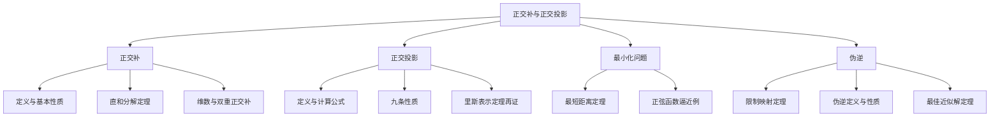

# 6C 正交补和正交投影

> [!abstract] 本节概览
> 本节是内积空间理论的**高潮应用篇**，围绕"正交补"这一核心概念，逐步构建出正交投影、最小化问题和伪逆的完整理论体系。
>
> **逻辑链条**：
> 1. **正交补**（定义）$\to$ 所有与子空间 $U$ 中每个向量都正交的向量全体 $U^\perp$
> 2. **直和分解**（定理）$\to$ $V = U \oplus U^\perp$，每个向量可唯一分解为 $U$ 分量和 $U^\perp$ 分量
> 3. **正交投影**（定义+9条性质）$\to$ 利用直和分解将任意向量"垂直投影"到子空间上
> 4. **最小化问题**（定理）$\to$ 到子空间的最短距离由正交投影给出
> 5. **伪逆**（定义+性质）$\to$ 不可逆线性映射的"最佳替代"，给出最小误差近似解
>
> **前置依赖**：[[6A 内积和范数]]（内积、范数、正交、柯西-施瓦兹不等式、毕达哥拉斯定理）、[[6B 规范正交基]]（规范正交基、格拉姆-施密特过程、里斯表示定理）、[[1C 子空间]]（直和、维数公式）、[[3F 对偶]]（对偶空间、线性泛函）。
>
> **核心主线**：正交补 $\to$ 直和分解 $V = U \oplus U^\perp$ $\to$ 正交投影 $P_U$ $\to$ 最小化问题 $\to$ 伪逆 $T^\dagger$。

---

## 一、正交补

### 正交补的定义

正交补是本节最基础的概念，它刻画了"与一个集合中所有向量都正交的向量全体"。

> [!def] 定义 6.46：正交补（orthogonal complement）
>
> 若 $U$ 是 $V$ 的子集，那么 $U$ 的**正交补**，记作 $U^\perp$，是与 $U$ 中的每个向量都正交的所有 $V$ 中向量所构成的集合：
>
> $$U^\perp = \{v \in V : \text{对于每个 } u \in U,\ \langle u, v \rangle = 0\}$$

> [!important] 注意
> 正交补 $U^\perp$ 同时依赖于 $V$ 和 $U$。然而，我们总会由上下文明确得知内积空间 $V$ 的选取，于是可从记号中省去它。注意 $U$ 在定义中只是 $V$ 的**子集**，不要求是子空间。

**直观理解**：如果 $U$ 是 $\mathbb{R}^3$ 中过原点的一个平面，那么 $U^\perp$ 就是垂直于该平面的直线（法向量所在的直线）。反过来，如果 $U$ 是一条直线，那么 $U^\perp$ 就是垂直于该直线的平面。

> [!example] 例 6.47：正交补
>
> **(a)** 若 $V = \mathbb{R}^3$，$U$ 是仅包含点 $(2,3,5)$ 的 $V$ 的子集，那么 $U^\perp$ 就是平面 $\{(x, y, z) \in \mathbb{R}^3 : 2x + 3y + 5z = 0\}$。
>
> **(b)** 若 $V = \mathbb{R}^3$，$U$ 是平面 $\{(x, y, z) \in \mathbb{R}^3 : 2x + 3y + 5z = 0\}$，那么 $U^\perp$ 就是直线 $\{(2t, 3t, 5t) : t \in \mathbb{R}\}$。
>
> 更一般地说，若 $U$ 是 $\mathbb{R}^3$ 中过原点的平面，那么 $U^\perp$ 是过原点且垂直于 $U$ 的直线。若 $U$ 是 $\mathbb{R}^3$ 中过原点的直线，那么 $U^\perp$ 是过原点且垂直于 $U$ 的平面。
>
> **(c)** 若 $V = \mathbb{F}^5$ 且 $U = \{(a, b, 0, 0, 0) \in \mathbb{F}^5 : a, b \in \mathbb{F}\}$，那么 $U^\perp = \{(0, 0, x, y, z) \in \mathbb{F}^5 : x, y, z \in \mathbb{F}\}$。
>
> **(d)** 若 $e_1, \ldots, e_m, f_1, \ldots, f_n$ 是 $V$ 的规范正交基，那么 $\operatorname{span}(e_1, \ldots, e_m)^\perp = \operatorname{span}(f_1, \ldots, f_n)$。

### 正交补的基本性质

> [!thm] 命题 6.48：正交补的性质
>
> (a) 若 $U$ 是 $V$ 的子集，那么 $U^\perp$ 是 $V$ 的子空间。
>
> (b) $\{0\}^\perp = V$。
>
> (c) $V^\perp = \{0\}$。
>
> (d) 若 $U$ 是 $V$ 的子集，那么 $U \cap U^\perp \subseteq \{0\}$。
>
> (e) 若 $G$ 和 $H$ 是 $V$ 的子集且 $G \subseteq H$，那么 $H^\perp \subseteq G^\perp$。

> [!abstract] 证明思路
> 逐条验证。对 (a) 验证子空间的加法与标量乘法封闭性；对 (b)(c) 直接代入定义；对 (d) 利用 $v \in U \cap U^\perp$ 时 $\langle v, v \rangle = 0$；对 (e) 利用子集关系的传递性。

**(a)** 设 $U$ 是 $V$ 的子集。那么对每个 $u \in U$ 有 $\langle u, 0 \rangle = 0$，从而 $0 \in U^\perp$。设 $v, w \in U^\perp$。若 $u \in U$，那么

$$\langle u, v + w \rangle = \langle u, v \rangle + \langle u, w \rangle = 0 + 0 = 0$$

于是 $v + w \in U^\perp$，表明 $U^\perp$ 对于加法封闭。

类似地，设 $\lambda \in \mathbb{F}$ 且 $v \in U^\perp$。若 $u \in U$，那么

$$\langle u, \lambda v \rangle = \lambda \langle u, v \rangle = \lambda \cdot 0 = 0$$

于是 $\lambda v \in U^\perp$，表明 $U^\perp$ 对于标量乘法封闭。于是 $U^\perp$ 是 $V$ 的子空间。$\blacksquare$

**(b)** 设 $v \in V$。那么 $\langle 0, v \rangle = 0$，这表明 $v \in \{0\}^\perp$。于是 $\{0\}^\perp = V$。$\blacksquare$

**(c)** 设 $v \in V^\perp$。那么 $\langle v, v \rangle = 0$，这表明 $v = 0$。于是 $V^\perp = \{0\}$。$\blacksquare$

**(d)** 设 $U$ 是 $V$ 的子集，且 $u \in U \cap U^\perp$。那么 $\langle u, u \rangle = 0$，这表明 $u = 0$。于是 $U \cap U^\perp \subseteq \{0\}$。$\blacksquare$

**(e)** 设 $G$ 和 $H$ 是 $V$ 的子集且 $G \subseteq H$。设 $v \in H^\perp$。那么对每个 $u \in H$ 有 $\langle u, v \rangle = 0$，这表明对每个 $u \in G$ 也有 $\langle u, v \rangle = 0$。因而 $v \in G^\perp$。于是 $H^\perp \subseteq G^\perp$。$\blacksquare$

> [!tip] 性质 (d) 的重要性
> 性质 (d) 告诉我们 $U \cap U^\perp = \{0\}$（因为 $0 \in U \cap U^\perp$ 恒成立）。这个性质是后续直和分解 $V = U \oplus U^\perp$ 的关键前提之一——它保证了直和的"交集为零"条件（参见 [[1C 子空间]]）。
>
> 性质 (e) 体现了正交补运算的"反序"特征：子空间越大，其正交补越小。这与直觉一致——约束条件越多（更大的子空间），满足正交条件的向量越少。

### 直和分解

正交补最重要的性质是它给出了整个空间的直和分解。

> [!thm] 定理 6.49：子空间及其正交补的直和
>
> 设 $U$ 是 $V$ 的有限维子空间。那么
>
> $$V = U \oplus U^\perp$$
>
> 即 $V$ 中每个元素都能被唯一地写成 $U$ 中的一个向量加上 $U^\perp$ 中的一个向量的形式。

> [!warning] 有限维前提
> 习题 16 举例说明了如果没有"子空间 $U$ 是有限维"这个前提条件，下面的结论可能没法成立。

> [!abstract] 证明思路
> 直和分解需要验证两点：$V = U + U^\perp$（和覆盖全空间）与 $U \cap U^\perp = \{0\}$（交集为零）。第二点已由命题 6.48(d) 保证。第一点通过取 $U$ 的规范正交基，利用基展开自然地将任意向量拆分为 $U$ 分量和 $U^\perp$ 分量。

**[确认目标]：** 首先证明 $V = U + U^\perp$。

**[构造规范正交基]：** 为此，设 $v \in V$。令 $e_1, \ldots, e_m$ 是 $U$ 的规范正交基（由 [[6B 规范正交基]] 的格拉姆-施密特过程保证存在）。我们想将 $v$ 写成 $U$ 中的向量与正交于 $U$ 的向量之和。

**[利用基展开分解向量]：** 我们有

$$v = \underbrace{\langle v, e_1 \rangle e_1 + \cdots + \langle v, e_m \rangle e_m}_{u} + \underbrace{v - \langle v, e_1 \rangle e_1 - \cdots - \langle v, e_m \rangle e_m}_{w} \tag{6.50}$$

**[验证 $u \in U$]：** 因为各 $e_k \in U$，所以可知 $u \in U$。

**[验证 $w \in U^\perp$]：** 因为 $e_1, \ldots, e_m$ 是规范正交组，所以对各 $k = 1, \ldots, m$ 我们有

$$\langle w, e_k \rangle = \langle v, e_k \rangle - \langle v, e_k \rangle = 0$$

从而 $w$ 与 $\operatorname{span}(e_1, \ldots, e_m)$ 中的每个向量都正交，这表明 $w \in U^\perp$。因此我们可写出 $v = u + w$，其中 $u \in U$ 且 $w \in U^\perp$，这就完成了 $V = U + U^\perp$ 的证明。

**[完成直和]：** 由 6.48(d)，我们可知 $U \cap U^\perp = \{0\}$，则由 $V = U + U^\perp$ 便可得 $V = U \oplus U^\perp$（参见 [[1C 子空间]] 中直和的等价刻画）。$\blacksquare$

> [!success] 直和分解的核心地位
> 直和分解 $V = U \oplus U^\perp$ 是整个 6C 节的基石。正交投影、最小化问题、伪逆等所有后续内容都建立在这个分解之上。证明的关键技巧是：==利用规范正交基的展开，自然地将 $v$ 分成了"属于 $U$ 的部分"和"属于 $U^\perp$ 的部分"==。

### 正交补的维数

> [!thm] 定理 6.51：正交补的维数
>
> 设 $V$ 是有限维的，$U$ 是 $V$ 的子空间。那么
>
> $$\dim U^\perp = \dim V - \dim U$$

> [!abstract] 证明思路
> 直接利用直和的维数公式（参见 [[1C 子空间]]）结合定理 6.49 的直和分解。

**[应用直和维数公式]：** 由 6.49 和直和的维数公式立刻可得 $\dim U^\perp$ 的公式。$\blacksquare$

> [!tip] 与秩-零化度定理的类比
> 这个维数公式 $\dim U^\perp = \dim V - \dim U$ 与线性映射的秩-零化度定理 $\dim \text{null } T + \dim \text{range } T = \dim V$（参见 [[3B 零空间和值域]]）在形式上非常相似。事实上，正交补的维数公式可以看作是秩-零化度定理在内积空间中的"几何版本"。

### 双重正交补

> [!thm] 定理 6.52：正交补的正交补
>
> 设 $U$ 是 $V$ 的一个有限维子空间。那么
>
> $$U = (U^\perp)^\perp$$

> [!abstract] 证明思路
> 分两步证明集合相等。第一步直接由定义证 $U \subseteq (U^\perp)^\perp$；第二步利用直和分解——取 $v \in (U^\perp)^\perp$，将其分解为 $U$ 分量和 $U^\perp$ 分量，再利用交集为零的性质证明 $U^\perp$ 分量为零。

**[第一步：$U \subseteq (U^\perp)^\perp$]：** 为此，设 $u \in U$。那么对每个 $w \in U^\perp$ 都有 $\langle u, w \rangle = 0$（由 $U^\perp$ 的定义即得）。因为 $u$ 与 $U^\perp$ 中的每个向量都正交，所以我们有 $u \in (U^\perp)^\perp$，这就证明了 $U \subseteq (U^\perp)^\perp$。

**[第二步：$(U^\perp)^\perp \subseteq U$]：** 为了证明这个包含关系反过来也成立，设 $v \in (U^\perp)^\perp$。由 6.49，我们可写出 $v = u + w$，其中 $u \in U$ 且 $w \in U^\perp$，则有 $v - u = w \in U^\perp$。因为 $v \in (U^\perp)^\perp$ 且 $u \in (U^\perp)^\perp$（由第一步），故可得 $v - u \in (U^\perp)^\perp$。于是 $v - u \in U^\perp \cap (U^\perp)^\perp$，这表明 $v - u = 0$（由 6.48(d)），进而表明 $v = u$，因此 $v \in U$。

因此 $(U^\perp)^\perp \subseteq U$，结合第一步即完成了整个证明。$\blacksquare$

> [!note] 对合性
> 双重正交补定理 $(U^\perp)^\perp = U$ 体现了正交补运算的"对合性"（做两次等于没做），与集合论中的双重补集 $\overline{\overline{A}} = A$ 完全类似。注意：这个结论依赖于 $U$ 是有限维的。

> [!thm] 命题 6.54：$U^\perp = \{0\} \iff U = V$
>
> 设 $U$ 是 $V$ 的有限维子空间。那么
>
> $$U^\perp = \{0\} \iff U = V$$

> [!abstract] 证明思路
> 利用双重正交补定理 6.52 将 $U^\perp = \{0\}$ 转化为 $U = \{0\}^\perp = V$。

**[$\Rightarrow$ 方向]：** 先设 $U^\perp = \{0\}$。那么由 6.52，$U = (U^\perp)^\perp = \{0\}^\perp = V$，得证。

**[$\Leftarrow$ 方向]：** 反之，若 $U = V$，则由 6.48(c) 知 $U^\perp = V^\perp = \{0\}$。$\blacksquare$

> [!tip] 直观理解
> $U^\perp = \{0\}$ 的意思是"没有非零向量与 $U$ 中所有向量都正交"。这只可能在 $U$ 已经"占满"整个空间时才成立。这个结论在习题 4 中很有用处——要证明 $U = V$，只需证 $U^\perp = \{0\}$。

---

## 二、正交投影

### 正交投影的定义

有了直和分解 $V = U \oplus U^\perp$，我们可以定义正交投影算子。

> [!def] 定义 6.55：正交投影（orthogonal projection）、$P_U$
>
> 设 $U$ 是 $V$ 的一个有限维子空间。将 $V$ 映成 $U$ 的**正交投影**是定义如下的算子 $P_U \in \mathcal{L}(V)$：
>
> 对每个 $v \in V$，将其写成 $v = u + w$，其中 $u \in U$ 且 $w \in U^\perp$，然后令 $P_U v = u$。

6.49 给出的直和分解式 $V = U \oplus U^\perp$ 表明，$v \in V$ 可以被唯一表示为 $v = u + w$（其中 $u \in U$ 且 $w \in U^\perp$）的形式。由此可见 $P_U v$ 的定义是完善的。

**生活化类比**：想象你站在一片倾斜的屋顶上（$V$），你想知道自己正下方水平地面上的位置（$U$）。正交投影就是"垂直向下看"——你找到的地面位置就是你在水平面上的正交投影。关键在于"垂直"（正交），而不是沿某个斜面滑下去。

### 一维子空间的正交投影

> [!example] 例 6.56：映成一维子空间的正交投影
>
> 设 $u \in V$ 且 $u \neq 0$，$U$ 是 $V$ 的一维子空间，定义为 $U = \operatorname{span}(u)$。若 $v \in V$，那么
>
> $$v = \frac{\langle v, u \rangle}{\|u\|^2} u + \left(v - \frac{\langle v, u \rangle}{\|u\|^2} u\right)$$
>
> 式中右侧第一项属于 $\operatorname{span}(u)$（从而属于 $U$），第二项正交于 $u$（从而属于 $U^\perp$）。于是 $P_U v$ 等于上式右侧第一项。换言之，对每个 $v \in V$，有
>
> $$P_U v = \frac{\langle v, u \rangle}{\|u\|^2} \cdot u$$

> [!note] 特殊情形验证
> 取 $v = u$，上式变为 $P_U u = u$；取 $v \in \{u\}^\perp$，上式则变为 $P_U v = 0$。这分别是下面命题 6.57 中 (b) 与 (c) 的具体例子。

### 正交投影的性质

> [!thm] 命题 6.57：正交投影 $P_U$ 的性质
>
> 设 $U$ 是 $V$ 的有限维子空间。那么
>
> (a) $P_U \in \mathcal{L}(V)$。
>
> (b) 对每个 $u \in U$，都有 $P_U u = u$。
>
> (c) 对每个 $w \in U^\perp$，都有 $P_U w = 0$。
>
> (d) $\operatorname{range} P_U = U$。
>
> (e) $\operatorname{null} P_U = U^\perp$。
>
> (f) 对每个 $v \in V$，都有 $v - P_U v \in U^\perp$。
>
> (g) $P_U^2 = P_U$。
>
> (h) 对每个 $v \in V$，都有 $\|P_U v\| \leq \|v\|$。
>
> (i) 若 $e_1, \ldots, e_m$ 是 $U$ 的一个规范正交基且 $v \in V$，那么
> $$P_U v = \langle v, e_1 \rangle e_1 + \cdots + \langle v, e_m \rangle e_m$$

> [!abstract] 证明思路
> 9 条性质逐条利用直和分解 $V = U \oplus U^\perp$ 和正交投影的定义进行验证。(a) 验证线性性；(b)(c) 利用分解的唯一性；(d)(e) 由定义直接得值域和零空间；(f) 是定义的直接推论；(g) 结合 (b) 和 (d)；(h) 利用 [[6A 内积和范数]] 中的毕达哥拉斯定理；(i) 利用 6.49 证明中的规范正交基展开公式。

**(a)** **[验证加法保持]：** 为证明 $P_U$ 是 $V$ 上的线性映射，设 $v_1, v_2 \in V$。将 $v_1, v_2$ 写成

$$v_1 = u_1 + w_1 \quad \text{与} \quad v_2 = u_2 + w_2$$

其中 $u_1, u_2 \in U$ 且 $w_1, w_2 \in U^\perp$。从而 $P_U v_1 = u_1$ 且 $P_U v_2 = u_2$。则有

$$v_1 + v_2 = (u_1 + u_2) + (w_1 + w_2)$$

其中 $u_1 + u_2 \in U$ 且 $w_1 + w_2 \in U^\perp$。于是

$$P_U(v_1 + v_2) = u_1 + u_2 = P_U v_1 + P_U v_2$$

**[验证标量乘法保持]：** 类似地，设 $\lambda \in \mathbb{F}$ 且 $v \in V$。将 $v$ 写成 $v = u + w$，其中 $u \in U$ 且 $w \in U^\perp$。那么 $\lambda v = \lambda u + \lambda w$，其中 $\lambda u \in U$，$\lambda w \in U^\perp$。因此 $P_U(\lambda v) = \lambda u = \lambda P_U v$。

因此 $P_U$ 是从 $V$ 到 $V$ 的线性映射。$\blacksquare$

**(b)** 设 $u \in U$。我们可将 $u$ 写为 $u = u + 0$，其中 $u \in U$ 且 $0 \in U^\perp$。于是 $P_U u = u$。$\blacksquare$

**(c)** 设 $w \in U^\perp$。我们可将 $w$ 写为 $w = 0 + w$，其中 $0 \in U$ 且 $w \in U^\perp$。于是 $P_U w = 0$。$\blacksquare$

**(d)** 由 $P_U$ 的定义得 $\operatorname{range} P_U \subseteq U$。又由 (b) 可知 $U \subseteq \operatorname{range} P_U$。于是 $\operatorname{range} P_U = U$。$\blacksquare$

**(e)** 由 (c) 可知 $U^\perp \subseteq \operatorname{null} P_U$。为证明这个包含关系反过来也成立，注意到若 $v \in \operatorname{null} P_U$，那么 6.49 给出的分解式必为 $v = 0 + v$，其中 $0 \in U$ 且 $v \in U^\perp$。于是 $\operatorname{null} P_U \subseteq U^\perp$。$\blacksquare$

**(f)** 若 $v \in V$，且有 $v = u + w$（其中 $u \in U$ 且 $w \in U^\perp$），那么

$$v - P_U v = v - u = w \in U^\perp \quad \blacksquare$$

**(g)** 若 $v \in V$，且有 $v = u + w$（其中 $u \in U$ 且 $w \in U^\perp$），那么

$$(P_U^2)v = P_U(P_U v) = P_U u = u = P_U v \quad \blacksquare$$

**(h)** 若 $v \in V$，且有 $v = u + w$（其中 $u \in U$ 且 $w \in U^\perp$），那么

$$\|P_U v\|^2 = \|u\|^2 \leq \|u\|^2 + \|w\|^2 = \|v\|^2$$

式中最后一个等号源于 [[6A 内积和范数]] 中的毕达哥拉斯定理。$\blacksquare$

**(i)** 由 6.49 证明中的式 (6.50) 即可得 $P_U v$ 的表达式。$\blacksquare$

> [!success] 性质 (i) 的计算价值
> 性质 (i) 极其重要——它给出了正交投影的==显式计算公式==。只要知道 $U$ 的规范正交基，就可以直接计算任意向量 $v$ 的正交投影，无需解方程组。
>
> 性质 (g) 的幂等性 $P_U^2 = P_U$ 是投影算子的标志性特征。直观理解：已经投影到 $U$ 上的向量，再投影一次还是自己——就像影子投在地面上，影子的影子还是影子。
>
> 性质 (h) 告诉我们==正交投影只会缩短向量，不会伸长==，且只有当向量本身就在 $U$ 中时才保持长度不变。

### 里斯表示定理再讨论

在上节中我们证明了里斯表示定理（6.42），它的关键内容是，有限维内积空间上的每个线性泛函，都可由与某个固定向量的内积式来表示。了解不同的证明往往能带给我们新的理解。于是，我们现在改用正交补（而非之前所用的规范正交基）来重新证明里斯表示定理。

> [!thm] 定理 6.58：里斯表示定理再讨论
>
> 设 $V$ 是有限维的。对每个 $v \in V$，定义 $\varphi_v \in V'$ 为：对每个 $u \in V$，
>
> $$\varphi_v(u) = \langle u, v \rangle$$
>
> 那么 $v \mapsto \varphi_v$ 是将 $V$ 映成 $V'$ 的一对一函数。

> [!note] 实数域与复数域的区别
> 若 $\mathbb{F} = \mathbb{R}$，则函数 $v \mapsto \varphi_v$ 是从 $V$ 到 $V'$ 的线性映射。然而，若 $\mathbb{F} = \mathbb{C}$，则该函数不是线性的，因为若 $\lambda \in \mathbb{C}$，则 $\varphi_{\lambda v} = \bar{\lambda}\varphi_v$。我们只证明下述结论的"映成"部分，因为"一对一"部分的证明很常规——按 6.42 的证法即可。

> [!abstract] 证明思路
> 这个新证法背后的直观想法是：若 $\varphi \in V'$，$v \in V$ 且 $\varphi(u) = \langle u, v \rangle$ 对所有 $u \in V$ 都成立，那么 $v \in (\operatorname{null} \varphi)^\perp$。而由 6.51 和 3.21，$(\operatorname{null} \varphi)^\perp$ 是 $V$ 的一维子空间（除 $\varphi = 0$ 的平凡情形外）。于是我们可通过取 $(\operatorname{null} \varphi)^\perp$ 中的任一非零元素并将其与一适当的标量相乘而得到 $v$。

**[证明满射]：** 为证明 $v \mapsto \varphi_v$ 是满射，设 $\varphi \in V'$。

**[处理零泛函]：** 若 $\varphi = 0$，那么 $\varphi = \varphi_0$。从而假设 $\varphi \neq 0$。因此 $\operatorname{null} \varphi \neq V$，这表明 $(\operatorname{null} \varphi)^\perp \neq \{0\}$（由 6.49，其中取 $U = \operatorname{null} \varphi$）。

**[在一维正交补中构造 $v$]：** 令 $w \in (\operatorname{null} \varphi)^\perp$ 且 $w \neq 0$。令

$$v = \frac{\varphi(w)}{\|w\|^2} \cdot w \tag{6.59}$$

那么 $v \in (\operatorname{null} \varphi)^\perp$，并且 $v \neq 0$（因为 $w \notin \operatorname{null} \varphi$）。

**[计算 $\|v\|$ 和 $\varphi(v)$]：** 在式 (6.59) 两侧同取范数可得

$$\|v\| = \frac{|\varphi(w)|}{\|w\|} \tag{6.60}$$

将 $\varphi$ 同时作用于式 (6.59) 两端并利用式 (6.60)，可得

$$\varphi(v) = \frac{|\varphi(w)|^2}{\|w\|^2} = \|v\|^2$$

**[验证 $\varphi = \varphi_v$]：** 现在设 $u \in V$。利用上式可得

$$u = \left(u - \frac{\varphi(u)}{\varphi(v)} \cdot v\right) + \frac{\varphi(u)}{\|v\|^2} \cdot v$$

式中带括号的一项属于 $\operatorname{null} \varphi$（因为 $\varphi$ 作用其上得 $\varphi(u) - \varphi(u) = 0$），因此与 $v$ 正交。于是将此式两边都与 $v$ 作内积可得

$$\langle u, v \rangle = \frac{\varphi(u)}{\|v\|^2} \cdot \langle v, v \rangle = \varphi(u)$$

因此 $\varphi = \varphi_v$，表明 $v \mapsto \varphi_v$ 是满射，则原命题得证。$\blacksquare$

> [!tip] 与规范正交基证明的比较
> 与 [[6B 规范正交基]] 中利用规范正交基的证明相比，这个证明更"结构性"——它不依赖于基的选取，而是直接利用了正交补的几何结构。核心思想是：$\operatorname{null} \varphi$ 的正交补是一维的，在这个一维空间中找到一个合适的向量 $v$，使得 $\langle u, v \rangle$ 恰好等于 $\varphi(u)$。

---

## 三、最小化问题

### 到子空间的最短距离

我们常会遇到下面问题：给定 $V$ 的子空间 $U$ 与一点 $v \in V$，求出一点 $u \in U$ 使得 $\|v - u\|$ 尽可能小。下面结论表明，$u = P_U v$ 是该最小化问题的唯一解。

> [!thm] 定理 6.61：到子空间的最短距离
>
> 设 $U$ 是 $V$ 的有限维子空间，$v \in V$ 且 $u \in U$。那么
>
> $$\|v - P_U v\| \leq \|v - u\|$$
>
> 进一步，上述不等式取得等号当且仅当 $u = P_U v$。

> [!abstract] 证明思路
> 将误差 $v - u$ 改写为 $(v - P_U v) + (P_U v - u)$，其中两部分正交（因为 $v - P_U v \in U^\perp$ 而 $P_U v - u \in U$）。由毕达哥拉斯定理，距离的平方等于正交的两部分平方之和，从而正交投影给出最小值。

**[建立正交分解]：** 我们有

$$\|v - P_U v\|^2 \leq \|v - P_U v\|^2 + \|P_U v - u\|^2 \tag{6.62}$$

$$= \|(v - P_U v) + (P_U v - u)\|^2$$

$$= \|v - u\|^2$$

其中第一行成立是因为 $0 \leq \|P_U v - u\|^2$，第二行源于 [[6A 内积和范数]] 中的毕达哥拉斯定理（可以运用它是因为由 6.57(f) 知 $v - P_U v \in U^\perp$，又有 $P_U v - u \in U$），简单计算即知第三行成立。

**[得出结论]：** 两边开平方根就得到了我们欲证的不等式。

**[等号条件]：** 上面证明的不等式取得等号当且仅当式 (6.62) 取得等号，这等价于 $\|P_U v - u\| = 0$，又等价于 $u = P_U v$。$\blacksquare$

> [!success] 最小化问题的核心
> $P_U v$ 是 $U$ 中距离 $v$ 最近的点，且最小距离为 $\|v - P_U v\|$。这个定理的证明极其简洁优美——核心就是毕达哥拉斯定理。几何直观也很清楚：从 $v$ 到 $U$ 中任意点 $u$ 的距离，可以分解为"垂直距离"和"水平距离"的直角三角形，由勾股定理，只有当水平距离为零时总距离才最小。
>
> 这个定理是==最小二乘法==的理论基础，在数据拟合、机器学习等领域有广泛应用。

### 利用线性代数逼近正弦函数

> [!example] 例 6.63：利用线性代数来逼近正弦函数
>
> 假如我们想要求出次数不高于 5 的实系数多项式 $u$，使其在区间 $[-\pi, \pi]$ 上尽可能逼近正弦函数，这里的"逼近"指的是使
>
> $$\int_{-\pi}^{\pi} |\sin x - u(x)|^2 \, dx$$
>
> 尽可能小。
>
> 令 $\mathcal{C}[-\pi, \pi]$ 表示定义在 $[-\pi, \pi]$ 上的全体连续实值函数所构成的实内积空间，其上内积定义为
>
> $$\langle f, g \rangle = \int_{-\pi}^{\pi} fg \tag{6.64}$$
>
> 令 $v \in \mathcal{C}[-\pi, \pi]$ 是定义为 $v(x) = \sin x$ 的函数。令 $U$ 表示由次数不高于 5 的所有实系数多项式所构成的 $\mathcal{C}[-\pi, \pi]$ 的子空间。现在可将问题重新表述为：求出 $u \in U$ 使得 $\|v - u\|$ 尽可能小。
>
> 为了计算出这个逼近问题的解，首先对 $U$ 的基 $1, x, x^2, x^3, x^4, x^5$ 用格拉姆-施密特过程（所用内积定义如式 (6.64)），得到 $U$ 的一个规范正交基 $e_1, e_2, e_3, e_4, e_5, e_6$。接着，再采用式 (6.64) 给出的内积并利用 6.57(i) 来计算 $P_U v$。计算得 $P_U v$ 就是定义如下的函数 $u$：
>
> $$u(x) = 0.987862x - 0.155271x^3 + 0.00564312x^5 \tag{6.65}$$
>
> 由 6.61，上述多项式 $u$ 是利用不超过 5 次的多项式在区间 $[-\pi, \pi]$ 上对正弦函数的==最佳逼近==。
>
> **与泰勒多项式的比较**：用五次多项式来逼近正弦函数的另一种著名方法，就是利用泰勒多项式
>
> $$p(x) = x - \frac{x^3}{3!} + \frac{x^5}{5!} = x - 0.166667x^3 + 0.008333x^5 \tag{6.66}$$
>
> 在 $x$ 接近 0 时，泰勒多项式能很好地逼近 $\sin x$。然而对于 $|x| > 2$，泰勒多项式就不那么准确了，特别是与式 (6.65) 相比。例如，取 $x = 3$，逼近式 (6.65) 对于 $\sin 3$ 的估计的误差约为 0.001，而泰勒多项式 (6.66) 对于 $\sin 3$ 的估计的误差约是 0.4。于是在 $x = 3$ 处，泰勒多项式的误差比式 (6.65) 误差大数百倍。==线性代数帮助我们找到了正弦函数的新的逼近方法，这个方法改进了我们在微积分中学过的方法！==

> [!tip] 局部逼近 vs 全局逼近
> 泰勒多项式在 $x = 0$ 附近最优（局部逼近），而正交投影多项式在整个区间 $[-\pi, \pi]$ 上"全局最优"（最小化积分误差）。两者各有适用场景：
> - 泰勒展开：适合在某个点附近做局部近似
> - 正交投影（最小二乘逼近）：适合在整个区域上做全局近似
>
> 在信号处理中，傅里叶级数就是函数在三角函数系上的正交投影——这正是正交投影理论的最重要应用之一。

---

## 四、伪逆

### 限制线性映射以获得既单又满的映射

设 $T \in \mathcal{L}(V, W)$ 且 $w \in W$。考虑这个问题：求出 $v \in V$ 使得 $Tv = w$。

若 $T$ 可逆，那么上述方程的唯一解就是 $v = T^{-1}w$。然而，若 $T$ 不可逆，那么对于某些 $w \in W$，上述方程可能无解；对于另外一些 $w \in W$，上述方程可能有无穷多解。

当 $T$ 不可逆时，我们仍可尝试尽可能好地处理上述方程。例如，若上述方程无解，那么我们就不求解方程 $Tv - w = 0$，而是尝试解出使 $\|Tv - w\|$ 尽可能小的 $v \in V$。又例如，如果有无穷多个 $v \in V$ 满足上述方程，那么我们可以选出这些解中使得 $\|v\|$ 最小的那个。

伪逆就为我们尽可能好地求解上述方程提供了有力工具，即便 $T$ 并不可逆。为定义伪逆，我们需要下面的结论。

> [!thm] 定理 6.67：限制线性映射以获得既单又满的映射
>
> 设 $V$ 是有限维的，且 $T \in \mathcal{L}(V, W)$。那么 $T|_{(\operatorname{null} T)^\perp}$ 是将 $(\operatorname{null} T)^\perp$ 映成 $\operatorname{range} T$ 的单射。

> [!abstract] 证明思路
> 需证限制映射既单又满。单射利用 $\operatorname{null} T \cap (\operatorname{null} T)^\perp = \{0\}$（命题 6.48(d)）；满射利用直和分解 $V = (\operatorname{null} T)^\perp \oplus \operatorname{null} T$，将任意 $v \in V$ 的 $\operatorname{null} T$ 分量消除后映射不变。

**[证明单射]：** 设 $v \in (\operatorname{null} T)^\perp$ 且 $T|_{(\operatorname{null} T)^\perp} v = 0$。因此 $Tv = 0$，进而 $v \in (\operatorname{null} T) \cap (\operatorname{null} T)^\perp$，从而 $v = 0$（由 6.48(d)）。因此 $\operatorname{null} T|_{(\operatorname{null} T)^\perp} = \{0\}$，这表明 $T|_{(\operatorname{null} T)^\perp}$ 是单射。

**[证明满射]：** 显然，$\operatorname{range} T|_{(\operatorname{null} T)^\perp} \subseteq \operatorname{range} T$。为证明这个包含关系反过来也成立，设 $w \in \operatorname{range} T$。因此存在 $v \in V$ 满足 $w = Tv$。由 6.49，存在 $u \in \operatorname{null} T$ 和 $x \in (\operatorname{null} T)^\perp$ 使得 $v = u + x$。则

$$T|_{(\operatorname{null} T)^\perp} x = Tx = Tv - Tu = w - 0 = w$$

这表明 $w \in \operatorname{range} T|_{(\operatorname{null} T)^\perp}$。因此 $\operatorname{range} T \subseteq \operatorname{range} T|_{(\operatorname{null} T)^\perp}$，这就证明了 $\operatorname{range} T|_{(\operatorname{null} T)^\perp} = \operatorname{range} T$。$\blacksquare$

### 伪逆的定义

> [!def] 定义 6.68：伪逆（pseudoinverse）、$T^\dagger$
>
> 设 $V$ 是有限维的，$T \in \mathcal{L}(V, W)$。$T$ 的**伪逆** $T^\dagger \in \mathcal{L}(W, V)$ 是定义如下的从 $W$ 到 $V$ 的线性映射：对每个 $w \in W$，
>
> $$T^\dagger w = \left(T|_{(\operatorname{null} T)^\perp}\right)^{-1} P_{\operatorname{range} T} w$$

> [!important] 伪逆的含义
> 回忆一下，若 $w \in (\operatorname{range} T)^\perp$，则 $P_{\operatorname{range} T} w = 0$；若 $w \in \operatorname{range} T$，则 $P_{\operatorname{range} T} w = w$。于是：
> - 如果 $w \in (\operatorname{range} T)^\perp$，则 $T^\dagger w = 0$；
> - 如果 $w \in \operatorname{range} T$，则 $T^\dagger w$ 是 $(\operatorname{null} T)^\perp$ 中唯一满足 $T(T^\dagger w) = w$ 的元素。
>
> 伪逆也被称作**摩尔-彭罗斯逆**（Moore-Penrose inverse）。

> [!tip] 伪逆的构造思路
> 伪逆的构造极其清晰：
> 1. 将 $T$ 的定义域缩小到 $(\operatorname{null} T)^\perp$（去掉零空间部分），使映射变为单射
> 2. 将 $T$ 的值域缩小到 $\operatorname{range} T$（只关注能达到的部分），使映射变为满射
> 3. 在这个"缩小版"的映射上取逆（由定理 6.67 保证可逆）
> 4. 将逆映射扩展到整个 $W$（通过正交投影 $P_{\operatorname{range} T}$）
>
> 当 $T$ 可逆时，$\operatorname{null} T = \{0\}$，$(\operatorname{null} T)^\perp = V$，$\operatorname{range} T = W$，所以 $T^\dagger = T^{-1}$。伪逆确实是逆的推广。

### 伪逆的代数性质

> [!thm] 命题 6.69：伪逆的代数性质
>
> 设 $V$ 是有限维的且 $T \in \mathcal{L}(V, W)$。
>
> (a) 若 $T$ 可逆，则 $T^\dagger = T^{-1}$。
>
> (b) $TT^\dagger = P_{\operatorname{range} T}$（将 $W$ 映成 $\operatorname{range} T$ 的正交投影）。
>
> (c) $T^\dagger T = P_{(\operatorname{null} T)^\perp}$（将 $V$ 映成 $(\operatorname{null} T)^\perp$ 的正交投影）。

> [!abstract] 证明思路
> (a) 当 $T$ 可逆时，限制映射就是 $T$ 本身，伪逆即逆。(b) 分别在 $\operatorname{range} T$ 和 $(\operatorname{range} T)^\perp$ 上验证 $TT^\dagger$ 与 $P_{\operatorname{range} T}$ 相等，再由直和分解得出整体相等。(c) 类似地，分别在 $(\operatorname{null} T)^\perp$ 和 $\operatorname{null} T$ 上验证。

**(a)** 设 $T$ 可逆。那么 $(\operatorname{null} T)^\perp = V$，且 $\operatorname{range} T = W$。从而 $T|_{(\operatorname{null} T)^\perp} = T$ 且 $P_{\operatorname{range} T}$ 是 $W$ 上的恒等算子。因此 $T^\dagger = T^{-1}$。$\blacksquare$

**(b)** **[在 $\operatorname{range} T$ 上验证]：** 设 $w \in \operatorname{range} T$。于是

$$TT^\dagger w = T\left(T|_{(\operatorname{null} T)^\perp}\right)^{-1} w = w = P_{\operatorname{range} T} w$$

**[在 $(\operatorname{range} T)^\perp$ 上验证]：** 若 $w \in (\operatorname{range} T)^\perp$，那么 $T^\dagger w = 0$。因此 $TT^\dagger w = 0 = P_{\operatorname{range} T} w$。

**[得出结论]：** 于是，在 $\operatorname{range} T$ 和 $(\operatorname{range} T)^\perp$ 上，$TT^\dagger$ 和 $P_{\operatorname{range} T}$ 都相同。因此这两个线性映射相等（由 6.49，$W = \operatorname{range} T \oplus (\operatorname{range} T)^\perp$）。$\blacksquare$

**(c)** **[在 $(\operatorname{null} T)^\perp$ 上验证]：** 设 $v \in (\operatorname{null} T)^\perp$。因为 $Tv \in \operatorname{range} T$，所以由 $T^\dagger$ 定义可知

$$T^\dagger(Tv) = \left(T|_{(\operatorname{null} T)^\perp}\right)^{-1}(Tv) = v = P_{(\operatorname{null} T)^\perp} v$$

**[在 $\operatorname{null} T$ 上验证]：** 若 $v \in \operatorname{null} T$，那么 $T^\dagger Tv = 0 = P_{(\operatorname{null} T)^\perp} v$。

**[得出结论]：** 于是，在 $(\operatorname{null} T)^\perp$ 和 $\operatorname{null} T$ 上，$T^\dagger T$ 和 $P_{(\operatorname{null} T)^\perp}$ 都相同。因此这两个线性映射相等（由 6.49）。$\blacksquare$

> [!success] 伪逆与正交投影的深刻联系
> 性质 (b) 和 (c) 揭示了伪逆与正交投影的深刻联系：
> - $TT^\dagger = P_{\operatorname{range} T}$：先取伪逆再映射回来，相当于投影到值域上
> - $T^\dagger T = P_{(\operatorname{null} T)^\perp}$：先映射再取伪逆，相当于投影到零空间的正交补上
>
> 这两个公式是伪逆理论的==核心等式==。如果 $T$ 是满射，那么由 (b) 可得 $TT^\dagger$ 是 $W$ 上的恒等算子。如果 $T$ 是单射，那么由 (c) 可得 $T^\dagger T$ 是 $V$ 上的恒等算子。

### 伪逆可给出最佳近似解或最优解

> [!thm] 定理 6.70：伪逆可给出最佳近似解或最优解
>
> 设 $V$ 是有限维的，$T \in \mathcal{L}(V, W)$，$w \in W$。
>
> (a) 若 $v \in V$，则
> $$\|T(T^\dagger w) - w\| \leq \|Tv - w\|$$
> 当且仅当 $v \in T^\dagger w + \operatorname{null} T$ 时，上式取得等号。
>
> (b) 若 $v \in T^\dagger w + \operatorname{null} T$，则
> $$\|T^\dagger w\| \leq \|v\|$$
> 当且仅当 $v = T^\dagger w$ 时，上式取得等号。

> [!abstract] 证明思路
> (a) 将 $Tv - w$ 改写为 $(Tv - TT^\dagger w) + (TT^\dagger w - w)$，其中第一项属于 $\operatorname{range} T$，第二项属于 $(\operatorname{range} T)^\perp$（由 6.69(b) 和 6.57(f)）。由毕达哥拉斯定理，第二项的范数小于或等于 $\|Tv - w\|$，等号条件给出最优解集。(b) 当方程有解时，所有最优解形如 $T^\dagger w + v'$（$v' \in \operatorname{null} T$），由毕达哥拉斯定理，$(\operatorname{null} T)^\perp$ 中的解范数最小。

**(a)** 设 $v \in V$。那么

$$Tv - w = (Tv - TT^\dagger w) + (TT^\dagger w - w)$$

上式第一个括号中的项属于 $\operatorname{range} T$。因为算子 $TT^\dagger$ 是将 $W$ 映成 $\operatorname{range} T$ 的正交投影（由 6.69(b)），所以上式第二个括号中的项属于 $(\operatorname{range} T)^\perp$（见 6.57(f)）。

于是，由毕达哥拉斯定理可知，上式第二个括号中的项的范数小于或等于 $\|Tv - w\|$，并且当且仅当上式第一个括号中的项等于 0 时方可取得等号。因此上述不等式取得等号，当且仅当 $v - T^\dagger w \in \operatorname{null} T$，这等价于 $v \in T^\dagger w + \operatorname{null} T$。这就完成了 (a) 的证明。$\blacksquare$

**(b)** 设 $v \in T^\dagger w + \operatorname{null} T$。因此 $v - T^\dagger w \in \operatorname{null} T$。我们有

$$v = (v - T^\dagger w) + T^\dagger w$$

$T^\dagger$ 的定义表明，$T^\dagger w \in (\operatorname{null} T)^\perp$。于是由毕达哥拉斯定理得 $\|T^\dagger w\| \leq \|v\|$，并且当且仅当 $v = T^\dagger w$ 时取得等号。$\blacksquare$

> [!success] 伪逆完美地解决了两个问题
> - **无解时**：$T^\dagger w$ 给出最小误差近似解（使 $\|Tv - w\|$ 最小）
> - **有无穷多解时**：$T^\dagger w$ 给出范数最小的解
> - **有唯一解时**：$T^\dagger w = T^{-1}w$ 就是那个唯一解

### 伪逆的计算实例

> [!example] 例 6.71：$\mathbb{F}^4$ 到 $\mathbb{F}^3$ 的线性映射的伪逆
>
> 设 $T \in \mathcal{L}(\mathbb{F}^4, \mathbb{F}^3)$ 定义为
>
> $$T(a, b, c, d) = (a + b + c,\ 2c + d,\ 0)$$
>
> 该线性映射既不是单射也不是满射，但我们仍可计算其伪逆。
>
> **第一步：确定 $\operatorname{range} T$。**
>
> $T(a,b,c,d)$ 的第三个分量恒为 0，且前两个分量可以独立取值。故
> $$\operatorname{range} T = \{(x, y, 0) : x, y \in \mathbb{F}\}$$
>
> 从而对每个 $(x, y, z) \in \mathbb{F}^3$，
> $$P_{\operatorname{range} T}(x, y, z) = (x, y, 0)$$
>
> **第二步：确定 $\operatorname{null} T$。**
>
> $$\operatorname{null} T = \{(a, b, c, d) \in \mathbb{F}^4 : a + b + c = 0 \text{ 且 } 2c + d = 0\}$$
>
> 由 $\operatorname{null} T$ 中的两个向量构成的组 $(-1,1,0,0),\ (-1,0,1,-2)$ 张成 $\operatorname{null} T$（因为若 $(a,b,c,d) \in \operatorname{null} T$，那么 $(a,b,c,d) = b(-1,1,0,0) + c(-1,0,1,-2)$）。又由于该组线性无关，所以它是 $\operatorname{null} T$ 的一个基。
>
> **第三步：确定 $(\operatorname{null} T)^\perp$。**
>
> $(\operatorname{null} T)^\perp$ 由与 $(-1,1,0,0)$ 和 $(-1,0,1,-2)$ 都正交的向量组成。设 $(a,b,c,d) \in (\operatorname{null} T)^\perp$，则
> $$-a + b = 0, \quad -a + c - 2d = 0$$
> 即 $b = a$，$c = a + 2d$。
>
> **第四步：计算 $T^\dagger$。**
>
> 现设 $(x, y, z) \in \mathbb{F}^3$。那么
>
> $$T^\dagger(x, y, z) = \left(T|_{(\operatorname{null} T)^\perp}\right)^{-1} P_{\operatorname{range} T}(x, y, z) = \left(T|_{(\operatorname{null} T)^\perp}\right)^{-1}(x, y, 0) \tag{6.72}$$
>
> 上式右侧就是满足 $T(a,b,c,d) = (x,y,0)$ 和 $(a,b,c,d) \in (\operatorname{null} T)^\perp$ 的向量 $(a,b,c,d) \in \mathbb{F}^4$。换言之，$a, b, c, d$ 必满足下列方程：
>
> $$a + b + c = x, \quad 2c + d = y, \quad -a + b = 0, \quad -a + c - 2d = 0$$
>
> 其中前两个方程等价于方程 $T(a,b,c,d) = (x,y,0)$，后两个方程则是由于 $(a,b,c,d)$ 正交于 $\operatorname{null} T$ 的基向量。将 $x, y$ 视为常数，并将 $a, b, c, d$ 视为未知量，上述方程组便含有四个方程、四个未知数，解之得
>
> $$a = \frac{1}{11}(5x - 2y),\quad b = \frac{1}{11}(5x - 2y),\quad c = \frac{1}{11}(x + 4y),\quad d = \frac{1}{11}(-2x + 3y)$$
>
> 因此由式 (6.72)，
>
> $$T^\dagger(x, y, z) = \frac{1}{11}(5x - 2y,\ 5x - 2y,\ x + 4y,\ -2x + 3y)$$
>
> **验证**：由上述 $T^\dagger$ 的计算公式可得，对所有 $(x, y, z) \in \mathbb{F}^3$，有 $TT^\dagger(x, y, z) = (x, y, 0)$，这形象阐释了 6.69(b) 中的 $TT^\dagger = P_{\operatorname{range} T}$ 这个式子。注意 $z$ 不出现在结果中——这是因为 $z$ 方向与 $\operatorname{range} T$ 正交，被 $P_{\operatorname{range} T}$ 投影掉了。

---

## 五、知识结构总览

---

## 六、核心思想与证明技巧

> [!success] 正交分解——分而治之
> 正交分解定理 $V = U \oplus U^\perp$ 是本节的核心工具。它允许我们将任何向量唯一地分解为 $U$ 中的分量和 $U^\perp$ 中的分量，从而将复杂问题简化为两个更简单的子问题。这个思想贯穿了正交投影、最小化问题和伪逆的全部理论。
>
> 毕达哥拉斯定理是本节证明的"秘密武器"——在最小化问题（定理 6.61）和伪逆最优性（定理 6.70）的证明中，核心步骤都是将误差分解为正交的两部分，然后利用毕达哥拉斯定理。

> [!tip] 证明技巧清单
> 1. **规范正交基展开实现正交分解**：在定理 6.49 的证明中，利用 $U$ 的规范正交基将任意向量 $v$ 自然地拆分为 $U$ 分量 $u$ 和 $U^\perp$ 分量 $w$。这是最基本也最重要的技巧。
> 2. **毕达哥拉斯定理证明最小化**：将 $\|v - u\|$ 改写为 $\|(v - P_U v) + (P_U v - u)\|$，其中两部分正交，然后利用毕达哥拉斯定理。这个技巧在定理 6.61 和 6.70 中反复出现。
> 3. **限制映射+正交补构造伪逆**：将 $T$ 限制在 $(\operatorname{null} T)^\perp$ 上使其变为双射（定理 6.67），然后取逆并扩展到整个 $W$。这是伪逆定义的核心构造。
> 4. **双重正交补利用分解论证**：在定理 6.52 的证明中，不使用维数计算，而是利用直和分解将 $(U^\perp)^\perp$ 中的向量分解为 $U$ 分量和 $U^\perp$ 分量，再利用交集为零得出结论。
> 5. **在两个子空间上分别验证线性映射相等**：在命题 6.69 的证明中，分别在 $\operatorname{range} T$ 和 $(\operatorname{range} T)^\perp$ 上验证 $TT^\dagger = P_{\operatorname{range} T}$，然后利用直和分解得出整体相等。这个技巧非常通用。

---

## 七、补充理解与易混淆点

### 正交投影的几何直觉

正交投影的最基本几何直觉是"影子类比"：想象一盏灯在物体正上方照射，物体在地面上的影子就是正交投影。关键在于光线是**垂直于**地面的——这正是"正交"的含义。

更精确地说，给定子空间 $U$ 和向量 $v$，正交投影 $P_U v$ 是 $U$ 中离 $v$ 最近的点。从 $v$ 到 $P_U v$ 的连线垂直于 $U$——就像你从 $v$ 出发"垂直落下"到 $U$ 上。误差向量 $v - P_U v$ 正是这条"垂直线"，它属于 $U^\perp$。

正交投影与斜投影（oblique projection）的区别在于：斜投影的"投射方向"不垂直于目标子空间。只有正交投影才能保证"投影后的点最近"，这也是为什么正交投影在最小化问题中如此重要。正交投影矩阵满足 $P^2 = P$ 且 $P^* = P$（自伴），而斜投影只满足 $P^2 = P$ 但不满足自伴性。在计算机图形学中，正交投影和斜投影都是常用的投影方式，但只有正交投影具有最小距离性质。

**来源**：Dan Margalit & Joseph Rabinoff (Duke Math 1553) Interactive Linear Algebra 正交投影讲义、Tim Ng (UChicago) CAPP 30271 Lecture 16 正交投影笔记。

### 伪逆与最小二乘法

伪逆与最小二乘法有着深刻的内在联系。当线性方程组 $Ax = b$ 无解时（即 $b$ 不在 $A$ 的列空间中），最小二乘法寻找使 $\|Ax - b\|$ 最小的 $x$。这个最小二乘解恰好就是 $x^* = A^\dagger b$。

从奇异值分解（SVD）的角度看，若 $A = U\Sigma V^T$ 是 $A$ 的 SVD，则伪逆可以显式地写为 $A^\dagger = V\Sigma^+ U^T$，其中 $\Sigma^+$ 是将 $\Sigma$ 的非零奇异值取倒数得到的矩阵。这个公式不仅给出了伪逆的计算方法，还揭示了伪逆的数值稳定性——当 $A$ 的某些奇异值非常小时，$A^\dagger$ 的对应元素会非常大，这对应于病态（ill-conditioned）问题。

在数据科学中，伪逆广泛用于线性回归（最小二乘拟合）、图像压缩（利用 SVD 的低秩近似）和推荐系统等领域。值得注意的是，正规方程 $A^TAx = A^Tb$ 的条件数是 $A$ 的条件数的平方，因此直接求解正规方程在数值上不如 QR 分解或 SVD 方法稳定。

**来源**：Sebastien Roch (UW-Madison MMiDS Math 535) SVD 与伪逆讲义、UIUC CS 357 Least Squares Data Fitting 讲义、UPenn CIS 515 SVD 与伪逆应用讲义。

### 正交补在函数空间中的应用

正交补的概念在函数空间中有极其重要的应用。在 $L^2[-\pi, \pi]$ 空间中，三角函数系 $\{1, \cos nx, \sin nx : n = 1, 2, \ldots\}$ 构成一个规范正交基（在适当归一化后）。傅里叶级数正是函数在这个规范正交基上的正交投影——傅里叶系数就是内积 $\langle f, e_n \rangle$。

从正交补的角度看，傅里叶级数的收敛性问题可以重新表述为：$L^2[-\pi, \pi]$ 中的函数是否可以分解为三角多项式子空间中的分量与其正交补中的分量之和？答案是肯定的——这正是 $L^2$ 空间中的直和分解定理。

最佳逼近定理（定理 6.61）在函数空间中的表现就是：在所有 $n$ 次三角多项式中，傅里叶级数的部分和是对原函数的最佳 $L^2$ 逼近。这与例 6.63 中用多项式逼近正弦函数的思想完全一致——只是将多项式基换成了三角函数基。在偏微分方程的求解中，分离变量法的理论基础也是函数空间中的正交分解。

**来源**：Blake Hunter (UC Davis) Fourier Series 讲义、Jonathan Wong (Duke Math 353) Fourier Series 讲义、Ariel Barton (UChicago) Fourier Series and the Fourier Transform 讲义。

### 常见误区

> [!danger] 误区 1："正交补只对子空间定义"
> ❌ 错误认知：$U^\perp$ 要求 $U$ 必须是子空间。
> ✅ 正确理解：定义 6.46 中 $U$ 只是 $V$ 的**子集**，不要求是子空间。$U^\perp$ 对任意子集都有定义，且结果总是子空间（命题 6.48(a)）。事实上，$\{v_1, \ldots, v_m\}^\perp = (\operatorname{span}(v_1, \ldots, v_m))^\perp$（习题 1），所以正交补只取决于子集的张成空间。

> [!danger] 误区 2："$U^\perp$ 的维数等于 $\dim U$"
> ❌ 错误认知：$\dim U^\perp = \dim U$，即正交补和原子空间维数相同。
> ✅ 正确理解：由定理 6.51，$\dim U^\perp = \dim V - \dim U$。只有当 $U$ 的维数恰好是 $\dim V / 2$ 时，$\dim U^\perp$ 才等于 $\dim U$。例如在 $\mathbb{R}^3$ 中，平面的正交补是直线（$\dim 2 \to \dim 1$），直线的正交补是平面（$\dim 1 \to \dim 2$）。

> [!danger] 误区 3："正交投影保持所有向量长度不变"
> ❌ 错误认知：$\|P_U v\| = \|v\|$ 对所有 $v \in V$ 成立。
> ✅ 正确理解：由命题 6.57(h)，$\|P_U v\| \leq \|v\|$，等号成立**当且仅当** $v \in U$。正交投影是"收缩"映射，只有当向量本身就在子空间中时才保持长度不变。几何上，投影只会使向量变短或不变，绝不会变长。

> [!danger] 误区 4："伪逆就是广义的逆矩阵"
> ❌ 错误认知：$T^\dagger$ 满足 $TT^\dagger = I$（恒等算子），行为类似普通逆矩阵。
> ✅ 正确理解：由命题 6.69(b)，$TT^\dagger = P_{\operatorname{range} T}$，这只是到值域的正交投影，**不是**恒等算子（除非 $T$ 满射）。同理 $T^\dagger T = P_{(\operatorname{null} T)^\perp}$，也不是恒等算子（除非 $T$ 单射）。伪逆确实推广了逆矩阵的概念（$T$ 可逆时 $T^\dagger = T^{-1}$），但一般情况下 $TT^\dagger \neq I$ 且 $T^\dagger T \neq I$。

> [!danger] 误区 5："最小化问题的解总是唯一的"
> ❌ 错误认知：使 $\|Tv - w\|$ 最小的 $v$ 总是唯一的。
> ✅ 正确理解：由定理 6.70(a)，使 $\|Tv - w\|$ 最小的 $v$ 的集合是 $T^\dagger w + \operatorname{null} T$。如果 $\operatorname{null} T \neq \{0\}$（即 $T$ 不是单射），则有无穷多个最优解。在这些最优解中，$T^\dagger w$ 是范数最小的那个（定理 6.70(b)），但最优解本身不唯一。只有在 $T$ 单射时，最优解才是唯一的。

> [!danger] 误区 6："正交补和零空间是同一个概念"
> ❌ 错误认知：$U^\perp$ 就是某个线性映射的零空间，两者没有本质区别。
> ✅ 正确理解：$U^\perp$ 是与 $U$ 中每个向量都正交的向量集合，依赖于内积结构。零空间 $\operatorname{null} T$ 是被 $T$ 映为零的向量集合，不依赖内积。两者是不同的概念。不过它们有联系：由习题 20，$\operatorname{null} T^\dagger = (\operatorname{range} T)^\perp$ 且 $\operatorname{range} T^\dagger = (\operatorname{null} T)^\perp$。

---

## 八、习题精选

> [!todo] 本节习题
>
> | 习题号 | 标题 | 核心考点 | 难度 |
> |---|---|---|---|
> | 2 | GS过程与正交补基 | GS过程保持正交补结构 | 中 |
> | 4 | 6.30(b)的逆命题 | 帕塞瓦尔恒等式逆命题等价于规范正交基 | 中 |
> | 9 | 正交投影的刻画 | $P^2 = P$ + 正交 ⟹ 正交投影 | 高 |
> | 11 | 不变子空间与正交投影 | $U$ 不变 ⟺ $P_U T P_U = T P_U$ | 高 |
> | 15 | 到子空间的最短距离计算 | 6.61 的数值应用 | 中 |
> | 19 | 正交投影的伪逆 | $P^\dagger = P$ | 中 |
> | 22 | 伪逆的代数恒等式 | $TT^\dagger T = T$，$T^\dagger T T^\dagger = T^\dagger$ | 高 |

### 习题 2：GS过程与正交补基

> [!problem] 习题 2
> 设 $U$ 是 $V$ 的子空间，且有一个基 $u_1, \ldots, u_m$，且 $u_1, \ldots, u_m, v_1, \ldots, v_n$ 是 $V$ 的基。证明：如果对以上 $V$ 的基应用格拉姆-施密特过程，得到组 $e_1, \ldots, e_m, f_1, \ldots, f_n$；那么 $e_1, \ldots, e_m$ 是 $U$ 的规范正交基，而 $f_1, \ldots, f_n$ 是 $U^\perp$ 的规范正交基。

> [!faq]- 查看解答
> **证明**：
>
> 由格拉姆-施密特过程的性质（参见 [[6B 规范正交基]]），$e_1, \ldots, e_m$ 是 $\operatorname{span}(u_1, \ldots, u_m) = U$ 的规范正交基，$e_1, \ldots, e_m, f_1, \ldots, f_n$ 是 $V$ 的规范正交基。
>
> 由于 $e_1, \ldots, e_m, f_1, \ldots, f_n$ 是 $V$ 的规范正交基，由例 6.47(d) 可知
> $$\operatorname{span}(e_1, \ldots, e_m)^\perp = \operatorname{span}(f_1, \ldots, f_n)$$
>
> 即 $U^\perp = \operatorname{span}(f_1, \ldots, f_n)$。因此 $f_1, \ldots, f_n$ 是 $U^\perp$ 的规范正交基。$\blacksquare$
>
> **意义**：这个习题表明格拉姆-施密特过程不仅产生子空间的规范正交基，还自动产生其正交补的规范正交基。这是一个非常实用的计算技巧。

### 习题 4：6.30(b)的逆命题

> [!problem] 习题 4
> 设 $e_1, \ldots, e_n$ 是 $V$ 中一组向量，其满足：$\|e_k\| = 1$ 对任一 $k = 1, \ldots, n$ 都成立以及
>
> $$\|v\|^2 = |\langle v, e_1 \rangle|^2 + \cdots + |\langle v, e_n \rangle|^2$$
>
> 对所有 $v \in V$ 成立。证明：$e_1, \ldots, e_n$ 是 $V$ 的规范正交基。
>
> 注：本题提出了 6.30(b)（帕塞瓦尔恒等式）的逆命题。

> [!faq]- 查看解答
> **证明**：
>
> 我们需要证明：(1) $e_1, \ldots, e_n$ 是规范正交组；(2) $e_1, \ldots, e_n$ 张成 $V$。
>
> **[证明正交性]：** 取 $v = e_j$，则
> $$\|e_j\|^2 = |\langle e_j, e_1 \rangle|^2 + \cdots + |\langle e_j, e_j \rangle|^2 + \cdots + |\langle e_j, e_n \rangle|^2$$
>
> 因为 $\|e_j\| = 1$，所以
> $$1 = |\langle e_j, e_1 \rangle|^2 + \cdots + 1 + \cdots + |\langle e_j, e_n \rangle|^2$$
>
> 这要求 $|\langle e_j, e_k \rangle|^2 = 0$ 对所有 $k \neq j$ 成立，即 $\langle e_j, e_k \rangle = 0$ 对 $k \neq j$。因此 $e_1, \ldots, e_n$ 是规范正交组。
>
> **[证明张成 $V$]：** 令 $U = \operatorname{span}(e_1, \ldots, e_n)$。对任意 $v \in V$，令 $w = v - \sum_{k=1}^n \langle v, e_k \rangle e_k$。由于 $e_1, \ldots, e_n$ 是规范正交组，$w$ 与每个 $e_k$ 都正交，故 $w \in U^\perp$。
>
> 由假设条件，
> $$\|v\|^2 = \sum_{k=1}^n |\langle v, e_k \rangle|^2 = \left\|\sum_{k=1}^n \langle v, e_k \rangle e_k\right\|^2$$
>
> 由毕达哥拉斯定理，$\|v\|^2 = \|P_U v\|^2 + \|v - P_U v\|^2$。由于 $\|v\|^2 = \|P_U v\|^2$，得 $\|v - P_U v\| = 0$，即 $v = P_U v \in U$。
>
> 因此 $V \subseteq U$，即 $U = V$。所以 $e_1, \ldots, e_n$ 是 $V$ 的规范正交基。$\blacksquare$

### 习题 9：正交投影的刻画

> [!problem] 习题 9
> 设 $V$ 是有限维的。设 $P \in \mathcal{L}(V)$ 使得 $P^2 = P$ 且 $\operatorname{null} P$ 中任一向量都正交于 $\operatorname{range} P$ 中任一向量。证明：存在 $V$ 的子空间 $U$ 使得 $P = P_U$。

> [!faq]- 查看解答
> **证明**：
>
> 令 $U = \operatorname{range} P$。由 $P^2 = P$ 知 $P$ 是投影算子。我们需要证明 $P$ 是**正交**投影到 $U$ 上，即 $\operatorname{null} P = U^\perp$。
>
> 由题设条件，$\operatorname{null} P$ 中任一向量都正交于 $\operatorname{range} P = U$ 中任一向量，故 $\operatorname{null} P \subseteq U^\perp$。
>
> 反之，设 $w \in U^\perp$。因为 $w \in V$，由投影分解 $w = Pw + (w - Pw)$，其中 $Pw \in U = \operatorname{range} P$，$w - Pw \in \operatorname{null} P$。
>
> 由于 $w \in U^\perp$，$\langle w, Pw \rangle = 0$。又 $\langle w - Pw, Pw \rangle = 0$（因为 $w - Pw \in \operatorname{null} P$ 且 $Pw \in \operatorname{range} P$，由题设条件正交）。
>
> 因此 $\langle w, Pw \rangle = \langle Pw + (w - Pw), Pw \rangle = \|Pw\|^2 = 0$，故 $Pw = 0$，即 $w \in \operatorname{null} P$。
>
> 因此 $U^\perp \subseteq \operatorname{null} P$，结合前面的包含关系得 $\operatorname{null} P = U^\perp$。由正交投影的唯一性（命题 6.57(e)），$P = P_U$。$\blacksquare$

### 习题 11：不变子空间与正交投影

> [!problem] 习题 11
> 设 $T \in \mathcal{L}(V)$ 且 $U$ 是 $V$ 的有限维子空间。证明：
>
> $$U \text{ 在 } T \text{ 下不变} \iff P_U T P_U = T P_U$$

> [!faq]- 查看解答
> **证明**：
>
> **[$\Rightarrow$ 方向]：** 设 $U$ 在 $T$ 下不变。对任意 $v \in V$，$P_U v \in U$，由不变性 $T(P_U v) \in U$。因此 $P_U(T(P_U v)) = T(P_U v)$（因为 $P_U$ 在 $U$ 上是恒等映射）。故 $P_U T P_U = T P_U$。
>
> **[$\Leftarrow$ 方向]：** 设 $P_U T P_U = T P_U$。对任意 $u \in U$，$P_U u = u$。因此
> $$P_U(Tu) = P_U(T(P_U u)) = (T P_U)u = Tu$$
>
> 这表明 $Tu \in \operatorname{range} P_U = U$（由命题 6.57(d)）。因此 $U$ 在 $T$ 下不变。$\blacksquare$
>
> **意义**：这个习题给出了不变子空间的正交投影刻画。类似地，可以证明 $U$ 和 $U^\perp$ 都在 $T$ 下不变当且仅当 $P_U T = T P_U$（习题 12）。

### 习题 15：到子空间的最短距离计算

> [!problem] 习题 15
> 在 $\mathbb{R}^4$ 中，令 $U = \operatorname{span}\{(1,1,0,0),\ (1,1,1,2)\}$。求 $u \in U$ 使得 $\|u - (1,2,3,4)\|$ 尽可能小。

> [!faq]- 查看解答
> **解**：
>
> 由定理 6.61，使 $\|u - (1,2,3,4)\|$ 最小的 $u$ 就是正交投影 $P_U(1,2,3,4)$。
>
> **第一步：用格拉姆-施密特过程求 $U$ 的规范正交基。**
>
> 令 $v_1 = (1, 0, 1, 0)$，$v_2 = (1, 1, 1, 1)$。
>
> $$e_1 = \frac{v_1}{\|v_1\|} = \frac{(1, 0, 1, 0)}{\sqrt{2}}$$
>
> $$\langle v_2, e_1 \rangle = \frac{1}{\sqrt{2}}(1 \cdot 1 + 1 \cdot 0 + 1 \cdot 1 + 1 \cdot 0) = \frac{2}{\sqrt{2}} = \sqrt{2}$$
>
> $$v_2' = v_2 - \langle v_2, e_1 \rangle e_1 = (1,1,1,1) - \sqrt{2} \cdot \frac{(1,0,1,0)}{\sqrt{2}} = (1,1,1,1) - (1,0,1,0) = (0,1,0,1)$$
>
> $$e_2 = \frac{v_2'}{\|v_2'\|} = \frac{(0, 1, 0, 1)}{\sqrt{2}}$$
>
> **第二步：计算正交投影。**
>
> $$P_U(1,2,3,4) = \langle (1,2,3,4), e_1 \rangle e_1 + \langle (1,2,3,4), e_2 \rangle e_2$$
>
> $$\langle (1,2,3,4), e_1 \rangle = \frac{1}{\sqrt{2}}(1 + 0 + 3 + 0) = \frac{4}{\sqrt{2}} = 2\sqrt{2}$$
>
> $$\langle (1,2,3,4), e_2 \rangle = \frac{1}{\sqrt{2}}(0 + 2 + 0 + 4) = \frac{6}{\sqrt{2}} = 3\sqrt{2}$$
>
> $$P_U(1,2,3,4) = 2\sqrt{2} \cdot \frac{(1,0,1,0)}{\sqrt{2}} + 3\sqrt{2} \cdot \frac{(0,1,0,1)}{\sqrt{2}} = 2(1,0,1,0) + 3(0,1,0,1) = (2, 3, 2, 3)$$
>
> 因此，$u = (2, 3, 2, 3)$ 是 $U$ 中离 $(1, 2, 3, 4)$ 最近的向量。
>
> **验证**：误差向量 $(1,2,3,4) - (2,3,2,3) = (-1,-1,1,1)$ 应与 $U$ 中每个向量正交。
>
> $\langle (-1,-1,1,1), (1,0,1,0) \rangle = -1 + 0 + 1 + 0 = 0$ ✓
>
> $\langle (-1,-1,1,1), (1,1,1,1) \rangle = -1 - 1 + 1 + 1 = 0$ ✓ $\blacksquare$

### 习题 19：正交投影的伪逆

> [!problem] 习题 19
> 设 $V$ 是有限维的，且 $P \in \mathcal{L}(V)$ 是将 $V$ 映成其某个子空间的正交投影。证明：$P^\dagger = P$。

> [!faq]- 查看解答
> **证明**：
>
> 设 $P = P_U$，其中 $U$ 是 $V$ 的有限维子空间。我们需要验证 $P^\dagger = P$。
>
> 由定义 6.68，$P^\dagger = \left(P|_{(\operatorname{null} P)^\perp}\right)^{-1} P_{\operatorname{range} P}$。
>
> 由命题 6.57：$\operatorname{null} P = U^\perp$，$(\operatorname{null} P)^\perp = U$，$\operatorname{range} P = U$。
>
> 因此 $P|_{(\operatorname{null} P)^\perp} = P|_U$，而 $P|_U$ 是 $U$ 上的恒等映射（命题 6.57(b)），故 $(P|_U)^{-1}$ 也是 $U$ 上的恒等映射。
>
> 又 $P_{\operatorname{range} P} = P_U = P$。
>
> 因此 $P^\dagger = (P|_U)^{-1} \circ P = I_U \circ P = P$。$\blacksquare$
>
> **直观理解**：正交投影的伪逆就是自身，因为正交投影已经是一个"自逆"的操作——投影到 $U$ 上再投影回来还是投影到 $U$ 上。

### 习题 22：伪逆的代数恒等式

> [!problem] 习题 22
> 设 $V$ 是有限维的，且 $T \in \mathcal{L}(V, W)$。证明：
>
> $$TT^\dagger T = T \quad \text{且} \quad T^\dagger T T^\dagger = T^\dagger$$
>
> 注：以上公式在 $T$ 可逆时显然都成立，因为在那种情形下我们可以将 $T^\dagger$ 替换成 $T^{-1}$。

> [!faq]- 查看解答
> **证明**：
>
> **[证明 $TT^\dagger T = T$]：**
>
> 由命题 6.69(c)，$T^\dagger T = P_{(\operatorname{null} T)^\perp}$。因此
> $$TT^\dagger T = T \cdot P_{(\operatorname{null} T)^\perp}$$
>
> 对任意 $v \in V$，将 $v$ 分解为 $v = v_1 + v_2$，其中 $v_1 \in (\operatorname{null} T)^\perp$，$v_2 \in \operatorname{null} T$。则
> $$T(P_{(\operatorname{null} T)^\perp} v) = Tv_1 = T(v_1 + v_2) - Tv_2 = Tv - 0 = Tv$$
>
> 因此 $TT^\dagger T = T$。$\blacksquare$
>
> **[证明 $T^\dagger T T^\dagger = T^\dagger$]：**
>
> 由命题 6.69(b)，$TT^\dagger = P_{\operatorname{range} T}$。因此
> $$T^\dagger T T^\dagger = T^\dagger \cdot P_{\operatorname{range} T}$$
>
> 对任意 $w \in W$，$P_{\operatorname{range} T} w \in \operatorname{range} T$。由伪逆的定义，$T^\dagger(P_{\operatorname{range} T} w) = T^\dagger w$（因为 $T^\dagger$ 先将 $w$ 投影到 $\operatorname{range} T$ 上）。
>
> 因此 $T^\dagger T T^\dagger = T^\dagger$。$\blacksquare$
>
> **意义**：这两个恒等式是摩尔-彭罗斯伪逆的四条公理中的两条（另外两条是 $(TT^\dagger)^* = TT^\dagger$ 和 $(T^\dagger T)^* = T^\dagger T$，在实数域上自动满足）。它们表明伪逆在某种意义上"尽可能接近"真正的逆矩阵。

---

## 九、视频学习指南

> [!info] 视频资源
>
> | 视频 | 讲者 | 时长 | 覆盖内容 |
> |---|---|---|---|
> | P72 正交补的定义 | 阿潘Eris | 1:04:34 | 定义 6.46、例 6.47、命题 6.48、定理 6.49 |
> | P73 正交投影 | 阿潘Eris | 54:23 | 定义 6.55、命题 6.57、定理 6.58 |
> | P74 极小化问题 | 阿潘Eris | 28:18 | 定理 6.61、例 6.63、伪逆 |

> [!info] 视频精要
>
> **P72 正交补的定义**：强调正交补的核心思想是"所有与 $U$ 中每个向量都垂直的向量集合"。直观理解：$\mathbb{R}^3$ 中平面的正交补是垂直于它的直线，直线的正交补是垂直于它的平面。强调有限维前提条件的重要性——在无限维空间中，$V = U \oplus U^\perp$ 不一定成立（习题 16 的反例）。证明技巧：利用规范正交基展开来构造直和分解。
>
> **P73 正交投影**：正交投影的几何直观——"垂直投影"是最短距离的关键。$P_U$ 的 9 条性质逐条讲解，强调幂等性 $P_U^2 = P_U$（投两次等于投一次）。利用正交补重新证明里斯表示定理的思路。强调正交投影与普通投影的区别：正交投影的零空间恰好是 $U^\perp$，而普通投影的零空间可以是任意补空间。
>
> **P74 极小化问题**：最小化问题的核心——正交投影给出最优解。毕达哥拉斯定理在证明中的关键作用：将误差分解为正交的两部分。伪逆作为"不可逆矩阵的最佳替代"。伪逆的最佳拟合性质：使误差最小，且在所有最优解中范数最小。

---

## 十、教材原文

#学习/线性代数/内积空间/正交补与正交投影