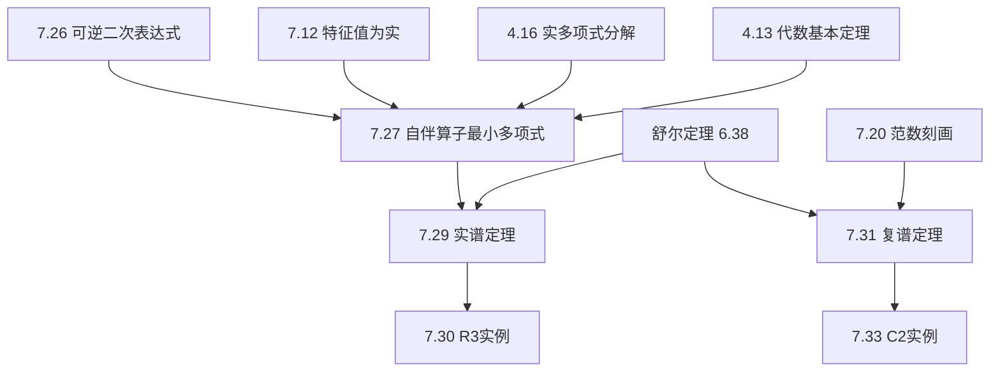

# 7B 谱定理

> [!abstract] 本节概览
> 谱定理（Spectral Theorem）是线性代数中最重要的定理之一，它回答了一个根本问题：哪些算子可以"完美对角化"？所谓"完美"，是指存在一组==规范正交基==使算子的矩阵为对角矩阵。本节分别证明实谱定理（自伴算子）和复谱定理（正规算子），并给出完整的证明链。
>
> **逻辑链条**：引理7.26（可逆二次表达式）$\to$ 引理7.27（自伴算子最小多项式仅含实线性因子）$\to$ 定理7.29（实谱定理）$\to$ 定理7.31（复谱定理）。
>
> **前置依赖**：[[7A 自伴算子和正规算子]]（7.12 特征值为实、7.20 $\|Tv\|=\|T^*v\|$、7.21 正规算子性质）、[[6B 规范正交基]]（舒尔定理 6.37/6.38、规范正交基上三角化）、[[5D 可对角化算子]]（5.55 可对角化）、[[5B 最小多项式]]（5.27、代数基本定理 4.13、4.16 实多项式分解）、[[6A 内积和范数]]（柯西-施瓦兹不等式 6.14）。
>
> **核心主线**：引理（最小多项式分析）$\to$ 实谱定理（自伴算子的规范正交对角化）$\to$ 复谱定理（正规算子的规范正交对角化）$\to$ 统一视角。

---

## 一、实谱定理

实谱定理告诉我们：在实内积空间中，==自伴算子恰好就是那些可以关于规范正交基对角化的算子==。本节先建立两个关键引理，再给出实谱定理的完整证明。

### 引入动机

为什么需要谱定理？回顾 [[5D 可对角化算子]]，一个算子可对角化意味着存在一组基使其矩阵为对角矩阵。但一般的基未必是规范正交的——基向量之间可以有任意角度。谱定理的核心价值在于：它告诉我们，对于满足特定条件的算子（实数域上的自伴算子），不仅存在基使矩阵对角化，而且这组基还可以取为==规范正交==的。

**为什么实空间需要自伴条件**：在复内积空间中，每个算子都有特征值（[[第4章 多项式]] 代数基本定理 4.13），所以复谱定理只需要"正规"条件。但在实内积空间中，算子可能没有实特征值。最典型的反例是 $\mathbb{R}^2$ 上的 $90°$ 旋转 $T(x,y) = (-y, x)$，它是正规的（$T^*T = TT^* = I$），但没有实特征值。然而，[[7A 自伴算子和正规算子]] 中的定理 7.12 告诉我们：==自伴算子的特征值都是实数==。因此，自伴性弥补了实数域不是代数闭域的不足，使得谱定理得以成立。

### 引理：可逆二次表达式（7.26）

> [!thm] 定理 7.26：可逆二次表达式
> 设 $T \in \mathcal{L}(V)$ 是自伴算子，$b, c \in \mathbb{R}$，且 $b^2 < 4c$。则 $T^2 + bT + cI$ 是可逆算子。

**理解条件**：$b^2 < 4c$ 意味着二次多项式 $z^2 + bz + c$ 没有实根（判别式为负）。这个条件在后续引理 7.27 的证明中至关重要——我们需要排除最小多项式中出现不可约二次因子的可能性。

> [!abstract] 证明思路
> 通过计算 $\langle (T^2 + bT + cI)v, v \rangle$，利用自伴性将其转化为范数的二次表达式，再配方证明该表达式严格大于零，从而算子单射、可逆。

**证明**：

**[建立单射目标]：** 证明 $T^2 + bT + cI$ 是单射（有限维空间中单射等价于可逆，见 3.65）。

**[展开内积]：** 对任意非零 $v \in V$，展开 $\langle (T^2 + bT + cI)v, v \rangle$：

$$\langle (T^2 + bT + cI)v, v \rangle = \langle T^2 v, v \rangle + b\langle Tv, v \rangle + c\langle v, v \rangle$$

**[利用自伴性简化]：** 由于 $T$ 自伴（$T = T^*$），$\langle T^2 v, v \rangle = \langle Tv, Tv \rangle = \|Tv\|^2$：

$$\langle (T^2 + bT + cI)v, v \rangle = \|Tv\|^2 + b\langle Tv, v \rangle + c\|v\|^2$$

**[应用柯西-施瓦兹不等式]：** 由 [[6A 内积和范数]] 的柯西-施瓦兹不等式（6.14），$|\langle Tv, v \rangle| \leq \|Tv\| \cdot \|v\|$，因此：

$$\langle (T^2 + bT + cI)v, v \rangle \geq \|Tv\|^2 - |b| \cdot \|Tv\| \cdot \|v\| + c\|v\|^2$$

**[配方]：** 将上式关于 $\|Tv\|$ 配方：

$$= \left(\|Tv\| - \frac{|b| \cdot \|v\|}{2}\right)^2 + \left(c - \frac{b^2}{4}\right)\|v\|^2 > 0$$

最后一个不等号成立是因为 $b^2 < 4c$（即 $c - b^2/4 > 0$），且 $\|v\| > 0$。

**[得出结论]：** 因此 $(T^2 + bT + cI)v \neq 0$ 对所有非零 $v$ 成立，即 $T^2 + bT + cI$ 是单射，因而是可逆的。$\blacksquare$

### 引理：自伴算子的最小多项式（7.27）

> [!thm] 定理 7.27：自伴算子的最小多项式
> 设 $T \in \mathcal{L}(V)$ 是自伴算子。则 $T$ 的最小多项式等于 $(z - \lambda_1)(z - \lambda_2) \cdots (z - \lambda_m)$，其中 $\lambda_1, \ldots, \lambda_m \in \mathbb{R}$。

这个引理的核心含义是：==自伴算子的最小多项式只有实线性因子，没有不可约二次因子==。这正是实谱定理成立的关键——它保证了特征多项式在 $\mathbb{R}$ 上完全分裂。

> [!abstract] 证明思路
> 分复数域和实数域两种情形讨论。复情形直接由代数基本定理 + 特征值为实得到。实情形利用 4.16 的多项式分解，再用 7.26 的可逆性通过反证法消去所有二次因子。

**证明**：

**[复数域情形]：** 设 $\mathbb{F} = \mathbb{C}$。$T$ 的最小多项式的零点即 $T$ 的特征值（根据 [[5B 最小多项式]] 的 5.27(a)）。而 $T$ 的所有特征值都是实数（根据 [[7A 自伴算子和正规算子]] 的 7.12）。因此代数基本定理的版本二（[[第4章 多项式]] 的 4.13）告诉我们 $T$ 的最小多项式具有待证的形式 $(z - \lambda_1) \cdots (z - \lambda_m)$，其中 $\lambda_j \in \mathbb{R}$。

**[实数域情形——分解最小多项式]：** 设 $\mathbb{F} = \mathbb{R}$。由 $\mathbb{R}$ 上的多项式分解（[[第4章 多项式]] 的 4.16），存在 $\lambda_1, \ldots, \lambda_m \in \mathbb{R}$ 和 $b_1, \ldots, b_N, c_1, \ldots, c_N \in \mathbb{R}$（对每个 $k$ 都有 $b_k^2 < 4c_k$）使得 $T$ 的最小多项式等于

$$(z - \lambda_1) \cdots (z - \lambda_m)(z^2 + b_1 z + c_1) \cdots (z^2 + b_N z + c_N) \tag{7.28}$$

其中 $m$ 或 $N$ 中可能会有一个等于 0。

**[反证法消去二次因子]：** 假设 $N > 0$。将 $z$ 替换为 $T$，得到：

$$(T - \lambda_1 I) \cdots (T - \lambda_m I)(T^2 + b_1 T + c_1 I) \cdots (T^2 + b_N T + c_N I) = 0$$

由于 $T$ 自伴，$T^2 + b_N T + c_N I$ 也是自伴的（自伴算子的多项式仍为自伴），且 $b_N^2 < 4c_N$。由定理 7.26，$T^2 + b_N T + c_N I$ 是可逆算子。

**[得出矛盾]：** 对上式两边同时乘以 $(T^2 + b_N T + c_N I)^{-1}$，得到的 $T$ 的多项式仍等于 0，但其次数比式 (7.28) 低 2。这与最小多项式"次数最小"的性质矛盾。

因此必然有 $N = 0$，即式 (7.28) 中的最小多项式具有形式 $(z - \lambda_1) \cdots (z - \lambda_m)$，其中所有 $\lambda_j \in \mathbb{R}$。$\blacksquare$

### 实谱定理（7.29）

> [!thm] 定理 7.29：实谱定理（Real Spectral Theorem）
> 设 $\mathbb{F} = \mathbb{R}$ 且 $T \in \mathcal{L}(V)$。则下列等价：
> - **(a)** $T$ 是自伴的。
> - **(b)** $T$ 关于 $V$ 的某个规范正交基有对角矩阵。
> - **(c)** $V$ 有由 $T$ 的特征向量构成的规范正交基。

实谱定理是线性代数的主要定理之一，它全面地描述了实内积空间上的自伴算子。三个条件的等价性意味着：自伴性、规范正交对角化、存在规范正交的特征向量基，这三件事说的是同一回事。

> [!abstract] 证明思路
> (a) $\Rightarrow$ (b)：利用 7.27（最小多项式仅含实线性因子）$\to$ 6.37（特征多项式分裂时关于规范正交基上三角化）$\to$ 自伴性使上三角矩阵等于其转置 $\to$ 对角矩阵。(b) $\Rightarrow$ (a)：对角矩阵的转置等于自身 $\to$ $T^* = T$。(b) $\Leftrightarrow$ (c) 由定义可得。

**证明**：

**[(a) $\Rightarrow$ (b)：自伴 $\Rightarrow$ 规范正交对角化]：**

设 $T$ 是自伴的。由引理 7.27，$T$ 的最小多项式等于 $(z - \lambda_1) \cdots (z - \lambda_m)$，其中 $\lambda_j \in \mathbb{R}$。这意味着 $T$ 的特征多项式在 $\mathbb{R}$ 上完全分裂。

由 [[6B 规范正交基]] 的定理 6.37（特征多项式分裂时关于规范正交基上三角化），$T$ 关于 $V$ 的某个规范正交基有上三角矩阵。

关于这一规范正交基，$T^*$ 的矩阵是 $T$ 的矩阵的转置（见 6.30）。然而 $T^* = T$（$T$ 自伴），因此 $T$ 的矩阵的转置等于 $T$ 的矩阵自身。

又因为 $T$ 的矩阵是上三角的，所以该矩阵对角线上方和下方的元素都为 0。于是，$T$ 关于这一规范正交基的矩阵是==对角矩阵==。

**[(b) $\Rightarrow$ (a)：规范正交对角化 $\Rightarrow$ 自伴]：**

设 $T$ 关于 $V$ 的某个规范正交基有对角矩阵。这个对角矩阵和它的转置相等（对角矩阵关于主对角线对称）。所以关于那个基，$T^*$ 的矩阵（$T$ 的矩阵的转置）等于 $T$ 的矩阵。于是 $T^* = T$，即 $T$ 是自伴的。

**[(b) $\Leftrightarrow$ (c)]：** 由定义可得（或参见 [[5D 可对角化算子]] 的 5.55(a) 和 (b) 等价的证明）。$\blacksquare$

### 例：$\mathbb{R}^3$ 上自伴算子的规范正交特征向量基（7.30）

> [!example] 例 7.30：一算子的特征向量所成的规范正交基
> 考虑 $\mathbb{R}^3$ 上的算子 $T$，其矩阵（关于标准基）为
> $$\begin{pmatrix} 14 & -13 & 8 \\ -13 & 14 & 8 \\ 8 & 8 & -7 \end{pmatrix}$$

**验证自伴性**：该矩阵等于自身的转置且元素都为实数，所以 $T$ 是自伴的。由实谱定理，$T$ 关于某个规范正交基有对角矩阵。

**求特征值**：计算特征多项式 $\det(T - \lambda I)$：

$$\det\begin{pmatrix} 14-\lambda & -13 & 8 \\ -13 & 14-\lambda & 8 \\ 8 & 8 & -7-\lambda \end{pmatrix} = (27-\lambda)(9-\lambda)(-15-\lambda)$$

因此特征值为 $\lambda_1 = 27$，$\lambda_2 = 9$，$\lambda_3 = -15$。

**求规范正交特征向量**：可以验证

$$\frac{1}{\sqrt{2}}(1, -1, 0), \quad \frac{1}{\sqrt{3}}(1, 1, 1), \quad \frac{1}{\sqrt{6}}(1, 1, -2)$$

是 $\mathbb{R}^3$ 的规范正交基，且由 $T$ 的特征向量组成。

**对角矩阵**：关于这个基，$T$ 的矩阵是对角矩阵

$$\begin{pmatrix} 27 & 0 & 0 \\ 0 & 9 & 0 \\ 0 & 0 & -15 \end{pmatrix}$$

> [!note] 观察要点
> - 三个特征值互不相同（$27 \neq 9 \neq -15$），由 [[7A 自伴算子和正规算子]] 的 7.21(b)，对应不同特征值的特征向量自动正交
> - 只需将特征向量单位化，就得到规范正交基
> - 对角矩阵的对角元素恰好是特征值

---

## 二、复谱定理

复谱定理是实谱定理在复数域上的推广。在复数域上，由于代数基本定理保证特征多项式一定分裂，谱定理的条件从"自伴"放宽为"正规"——这是一个更宽泛、更自然的条件。

### 与实谱定理的对比

两个谱定理的核心结构完全相同（都是"特定条件 $\Leftrightarrow$ 规范正交对角化"），但有两个关键差异：

| 比较维度 | 实谱定理（7.29） | 复谱定理（7.31） |
|---|---|---|
| **数域** | $\mathbb{F} = \mathbb{R}$ | $\mathbb{F} = \mathbb{C}$ |
| **算子条件** | 自伴（$T^* = T$） | 正规（$TT^* = T^*T$） |
| **证明方法** | 最小多项式分析 + 上三角矩阵转置 | 舒尔定理 + 逐行消去非对角元素 |
| **自伴是正规的特殊情形** | 是（实数域上正规不一定能对角化） | 是（复数域上自伴 $\Rightarrow$ 正规） |

### 复谱定理（7.31）

> [!thm] 定理 7.31：复谱定理（Complex Spectral Theorem）
> 设 $\mathbb{F} = \mathbb{C}$ 且 $T \in \mathcal{L}(V)$。则下列等价：
> - **(a)** $T$ 是正规的。
> - **(b)** $T$ 关于 $V$ 的某个规范正交基有对角矩阵。
> - **(c)** $V$ 有由 $T$ 的特征向量构成的规范正交基。

复谱定理全面地描述了复内积空间上的正规算子。它的主要结论是：有限维复内积空间上的每个正规算子，都可由规范正交基对角化。

> [!abstract] 证明思路
> (a) $\Rightarrow$ (b)：舒尔定理 $\to$ 上三角矩阵 $\to$ 逐行用 $\|Te_j\| = \|T^*e_j\|$（7.20）消去非对角元素 $\to$ 对角矩阵。(b) $\Rightarrow$ (a)：对角矩阵的共轭转置仍为对角矩阵 $\to$ 两个对角矩阵可交换 $\to$ $TT^* = T^*T$。

**证明**：

**[(a) $\Rightarrow$ (b)：正规 $\Rightarrow$ 规范正交对角化]：**

设 $T$ 是正规的。由 [[6B 规范正交基]] 的舒尔定理（6.38），存在 $V$ 的规范正交基 $e_1, \ldots, e_n$，使得 $T$ 关于它有上三角矩阵。于是我们可以写出

$$\mathcal{M}(T, (e_1, \ldots, e_n)) = \begin{pmatrix} a_{1,1} & \cdots & a_{1,n} \\ & \ddots & \vdots \\ 0 & & a_{n,n} \end{pmatrix} \tag{7.32}$$

**[消去第一行非对角元素]：** 从以上矩阵可得

$$\|Te_1\|^2 = |a_{1,1}|^2$$
$$\|T^*e_1\|^2 = |a_{1,1}|^2 + |a_{1,2}|^2 + \cdots + |a_{1,n}|^2$$

因为 $T$ 是正规的，所以 $\|Te_1\| = \|T^*e_1\|$（见 [[7A 自伴算子和正规算子]] 的 7.20）。因此由以上两个等式可得，式 (7.32) 中的矩阵第一行除了第一个元素 $a_{1,1}$ 可能不为 0 外都为 0。

**[消去第二行非对角元素]：** 由于 $a_{1,2} = 0$，式 (7.32) 蕴涵了

$$\|Te_2\|^2 = |a_{2,2}|^2$$
$$\|T^*e_2\|^2 = |a_{2,2}|^2 + |a_{2,3}|^2 + \cdots + |a_{2,n}|^2$$

因为 $T$ 是正规的，$\|Te_2\| = \|T^*e_2\|$。因此矩阵第二行除了对角线元素 $a_{2,2}$ 外都为 0。

**[归纳完成]：** 按这种方式继续下去，矩阵 (7.32) 的所有非对角线元素都等于 0。因此 $T$ 关于这一规范正交基的矩阵是对角矩阵，(b) 成立。

**[(b) $\Rightarrow$ (a)：规范正交对角化 $\Rightarrow$ 正规]：**

设 $T$ 关于 $V$ 的某个规范正交基有对角矩阵。取 $T$ 的矩阵的共轭转置，可以得到 $T^*$（关于同一个基）的矩阵；于是 $T^*$ 也有对角矩阵。任意两个对角矩阵都可交换，从而 $T$ 和 $T^*$ 可交换，即 $T$ 是正规的。

**[(b) $\Leftrightarrow$ (c)]：** 由定义可得（也见 [[5D 可对角化算子]] 的 5.55）。$\blacksquare$

### 例：$\mathbb{C}^2$ 上正规算子的规范正交特征向量基（7.33）

> [!example] 例 7.33：一算子的特征向量所成的规范正交基
> 考虑算子 $T \in \mathcal{L}(\mathbb{C}^2)$，其定义为 $T(w, z) = (2w - 3z, 3w + 2z)$。$T$（关于标准基）的矩阵为
> $$\begin{pmatrix} 2 & -3 \\ 3 & 2 \end{pmatrix}$$

**验证正规性**：正如我们在例 7.19 中所见，$T$ 是正规算子（$TT^* = T^*T$），但 $T$ 不是自伴的（$T \neq T^*$）。

**求特征值**：$\det(T - \lambda I) = (2-\lambda)^2 + 9 = \lambda^2 - 4\lambda + 13 = 0$，解得 $\lambda = 2 \pm 3i$。

**求规范正交特征向量**：可以验证

$$\frac{1}{\sqrt{2}}(i, 1), \quad \frac{1}{\sqrt{2}}(-i, 1)$$

是 $\mathbb{C}^2$ 的规范正交基，且由 $T$ 的特征向量组成。

**对角矩阵**：关于这个基，$T$ 的矩阵是对角矩阵

$$\begin{pmatrix} 2+3i & 0 \\ 0 & 2-3i \end{pmatrix}$$

> [!important] 关键观察
> - $T$ 是正规的但不是自伴的——这体现了复谱定理比实谱定理更宽泛
> - 特征值 $2+3i$ 和 $2-3i$ 互为共轭——这是实矩阵的普遍性质
> - 这个例子说明：在复数域上，正规算子（不必自伴）也能被规范正交对角化

### 两个谱定理的统一视角

从泛函分析的角度看，两个谱定理可以统一表述为：

> **统一谱定理**：有限维内积空间上的算子 $T$ 关于某个规范正交基有对角矩阵，当且仅当 $T$ 是正规的，且 $T$ 的特征多项式在 $\mathbb{F}$ 上完全分裂。

- 在 $\mathbb{C}$ 上：代数基本定理保证特征多项式总是分裂的，所以条件简化为"$T$ 正规"
- 在 $\mathbb{R}$ 上：特征多项式不一定分裂，但自伴性保证了分裂（通过 7.27），所以条件等价于"$T$ 自伴"

---

## 三、知识结构总览

---

## 四、核心思想与证明技巧

> [!success] 谱定理的核心思想
> 谱定理的本质是：==将算子分解为互相正交的一维不变子空间的直和==。在每个一维子空间上，算子只做简单的缩放（乘以特征值）。规范正交基的存在意味着这些"缩放方向"互相正交，从而算子的作用完全由其特征值和对应的正交方向决定。
>
> 这一分解的价值在于：
> - **几何清晰**：算子的行为被完全揭示——它在哪些方向上拉伸、哪些方向上压缩
> - **计算简化**：对角矩阵的运算（幂、多项式、逆）极其简单
> - **理论基石**：为正算子、等距映射、奇异值分解等后续理论提供基础

> [!tip] 证明技巧清单
> 1. **配方法 + 柯西-施瓦兹**（7.26 证明）：将算子表达式 $\langle (T^2+bT+cI)v, v \rangle$ 转化为范数的完全平方，利用 $b^2 < 4c$ 保证严格正性。这是将实数配方技巧推广到算子层面的典范。
> 2. **反证法消去因子**（7.27 证明）：假设最小多项式含不可约二次因子，用 7.26 证明该因子对应的算子可逆，乘以逆后得到更低次的零化多项式，与最小性矛盾。
> 3. **上三角 + 对称 = 对角**（7.29 证明）：上三角矩阵如果等于其转置，则对角线上方和下方的元素同时为零，只剩对角线。
> 4. **逐行消去法**（7.31 证明）：利用 $\|Te_j\| = \|T^*e_j\|$ 逐行比较范数，迫使上三角矩阵的非对角元素为零。这是舒尔定理与正规性结合的精妙应用。
> 5. **对角矩阵的共轭转置技巧**（7.29 和 7.31 的反向证明）：对角矩阵的转置/共轭转置仍为对角矩阵，且对角矩阵之间可交换，直接推出自伴性/正规性。

---

## 五、补充理解与易混淆点

### 谱定理的历史与意义

"谱"（spectrum）这一术语由德国数学家 David Hilbert 在 1905 年左右引入。Hilbert 在研究无穷维二次型理论时，将有限维椭球主轴定理推广到无穷维空间，并称特征值的集合为"谱"（spectrum）。这一术语的灵感来自物理学中的光谱——Hilbert 本人并未预料到，他发展的谱理论后来恰好成为量子力学的数学基础，能够解释原子光谱的离散结构。Hilbert 曾感叹："我发展了我的无穷维理论，称之为谱分析，当时完全没有想到它会在现代物理学中得到如此奇妙的应用。"

在有限维线性代数中，谱定理的雏形可以追溯到 Cauchy（1829 年）关于实对称矩阵主轴变换的工作，以及 Weierstrass（1868 年）关于二次型标准化的研究。20 世纪初，Hilbert、Hellinger、Hahn 等人将谱理论推广到无穷维算子，最终形成了泛函分析的核心框架。

**来源**：UC Berkeley EE127 Lecture Notes（Spectral Theorem）、Handwiki Spectral Theory 词条。

### 谱定理的应用总览

谱定理是现代科学和工程中应用最广泛的数学定理之一。以下列举四个主要应用领域：

**主成分分析（PCA）**：PCA 的数学基础就是谱定理。给定数据集的协方差矩阵 $\Sigma$ 是实对称矩阵，由实谱定理，$\Sigma$ 可以被正交对角化：$\Sigma = Q \Lambda Q^T$，其中 $Q$ 的列是特征向量（主成分方向），$\Lambda$ 的对角元素是特征值（各方向上的方差）。按特征值从大到小排列，前 $k$ 个主成分保留了最多的数据方差信息。

**量子力学**：在量子力学中，每个可观测物理量（位置、动量、能量等）对应一个自伴算子。谱定理保证了自伴算子有实特征值和规范正交的特征向量基——特征值对应物理量的可能测量值，特征向量对应测量后的状态。例如，Hamilton 算子 $H$ 的特征值就是系统的能级，谱定理确保了能级的实数性和完备性。

**振动模式与微分方程**：在耦合振子系统和波动方程中，运动方程可以写成矩阵形式 $M\ddot{x} = -Kx$，其中 $M$ 和 $K$ 是实对称矩阵。谱定理将系统解耦为独立的简谐振子——每个特征值对应一个固有频率，对应的特征向量就是该频率下的振动模式（normal mode）。这一方法在结构力学、声学、电路分析中广泛应用。

**图论与谱图理论**：图的邻接矩阵 $A$ 和 Laplacian 矩阵 $L = D - A$ 都是实对称矩阵。谱定理保证它们可以被正交对角化，其特征值和特征向量揭示了图的结构性质——例如，第二大特征值控制了图的扩展性（Cheeger 不等式），特征向量用于图的聚类和分割。

**来源**：UC Berkeley EE127 Lecture Notes（PCA 与谱定理）、UCSB Math 108B Notes on Spectral Theorem、Princeton COS 324 PCA 讲义、University of Chicago REU 2016（谱定理与图论应用）、Caltech Ph106a（Normal Modes 讲义）。

### 实谱定理 vs 复谱定理

两个谱定理的结构完全平行，但在适用范围和证明方法上有本质差异：

**适用范围**：实谱定理刻画的是自伴算子（$T^* = T$），复谱定理刻画的是正规算子（$TT^* = T^*T$）。由于自伴蕴含正规，复谱定理的适用范围更广。在实数域上，存在正规但非自伴的算子（如 $90°$ 旋转），它们不能被实谱定理刻画——因为它们的特征多项式在 $\mathbb{R}$ 上不分裂。

**证明方法的差异**：实谱定理的证明需要先建立两个引理（7.26 和 7.27），核心困难在于处理实多项式的不可约二次因子。复谱定理的证明更加直接——舒尔定理给出上三角矩阵后，利用正规性逐行消去非对角元素即可。这种差异的根源在于：复数域是代数闭域，特征多项式总是分裂的；而实数域不是代数闭域，需要额外的工具来保证分裂性。

**为什么复情形更自然**：在复数域上，正规性是规范正交对角化的充要条件，这是一个非常"干净"的刻画。自伴算子、反自伴算子、酉算子都是正规算子的特殊情形，它们的特征值分别满足不同的约束（实数、纯虚数、模为 1）。复谱定理提供了一个统一的框架来理解所有这些算子类。

**来源**：UCSB Math 108B Notes on Spectral Theorem、UPenn CIS 515 Lecture 13（Spectral Theorems）。

### 常见误区

> [!danger] 误区1："谱定理适用于所有可对角化算子"
> ❌ 错误认知：如果一个算子可对角化，那么它一定满足谱定理的条件，存在规范正交的特征向量基。
> ✅ 正确理解：可对角化只保证存在一组（任意）基使矩阵为对角矩阵，不保证这组基是规范正交的。谱定理的额外力量在于保证基的规范正交性，这要求算子满足更强的条件——自伴（实数域）或正规（复数域）。例如，矩阵 $\begin{pmatrix} 1 & 1 \\ 0 & 2 \end{pmatrix}$ 可对角化但不对称，其特征向量 $(1,0)$ 和 $(1,1)$ 不正交。

> [!danger] 误区2："实谱定理和复谱定理的证明方法相同"
> ❌ 错误认知：两个谱定理的证明思路一样，只是把"自伴"换成"正规"。
> ✅ 正确理解：两个证明有本质差异。实谱定理的证明需要先建立两个引理——7.26（配方法+柯西-施瓦兹）和 7.27（反证法消去二次因子），核心困难是处理实多项式的不可约二次因子。复谱定理的证明直接利用舒尔定理得到上三角矩阵，再用 $\|Te_j\| = \|T^*e_j\|$ 逐行消去非对角元素，不需要最小多项式分析。

> [!danger] 误区3："正规算子在实数域上也能被谱定理刻画"
> ❌ 错误认知：实数域上的正规算子也能被规范正交对角化。
> ✅ 正确理解：实谱定理仅适用于自伴算子，正规算子的谱定理仅在复数域成立。在实数域上，存在正规但非自伴的算子（如 $\mathbb{R}^2$ 上的旋转 $T(x,y) = (-y,x)$），它们没有实特征值，因此不可能被任何实基对角化，更不用说规范正交基了。

> [!danger] 误区4："谱定理只是对角化的另一种说法"
> ❌ 错误认知：谱定理和一般的对角化定理没有本质区别。
> ✅ 正确理解：谱定理的关键贡献在于==规范正交==基下的对角化。一般的对角化（[[5D 可对角化算子]]）只要求存在一组基，基向量之间可以有任意角度。谱定理保证基向量互相正交且单位化，这具有深刻的几何意义——算子的作用被分解为互相独立的、正交方向上的缩放，且这种分解在正交变换下是唯一的。

---

## 六、习题精选

> [!todo] 本节习题
>
> 以下习题选自 LADR 第4版第7章B节（习题1-25），覆盖谱定理的核心概念和应用。建议按顺序完成。

| 习题号 | 标题 | 核心考点 | 难度 |
|---|---|---|---|
| 1 | 正规算子自伴 ⟺ 特征值为实 | 谱定理 + 7.12 应用 | 中 |
| 3 | 正规算子与正交投影 | 特征值 ∈ {0,1} ⟺ $P_U$ | 高 |
| 6 | $T^9=T^8$ ⟹ 自伴且 $T^2=T$ | 谱定理 + 特征值分析 | 高 |
| 9 | $T^* = p(T)$ | 正规算子的多项式表示 | 高 |
| 14 | 实谱定理的等价刻画 | 特征空间正交直和 | 高 |
| 19 | 自伴算子的不变子空间 | $U$ 不变 ⟺ $U^\perp$ 不变 | 中 |
| 23 | 自伴算子的特征值连续性 | 接近特征值 ⟹ 接近特征向量 | 高 |

### 习题1：正规算子自伴 ⟺ 特征值为实

> [!problem] 习题1
> 设 $V$ 是有限维复内积空间，$T \in \mathcal{L}(V)$ 是正规算子。证明：$T$ 是自伴的当且仅当 $T$ 的所有特征值都是实数。

> [!faq]- 查看解答
> **解题思路提示**：利用复谱定理，将 $T$ 对角化。自伴性等价于 $T = T^*$，在对角矩阵的语言下等价于对角元素等于其共轭。
>
> **完整解答**：
>
> ($\Rightarrow$) 设 $T$ 自伴。由 [[7A 自伴算子和正规算子]] 中的定理 7.12，$T$ 的所有特征值都是实数。
>
> ($\Leftarrow$) 设 $T$ 的所有特征值都是实数。由复谱定理（定理 7.31），存在 $V$ 的规范正交基 $e_1, \ldots, e_n$ 使得 $\mathcal{M}(T) = \operatorname{diag}(\lambda_1, \ldots, \lambda_n)$，其中 $\lambda_j$ 是 $T$ 的特征值。
>
> 由于 $\lambda_j \in \mathbb{R}$，$\bar{\lambda}_j = \lambda_j$。因此：
>
> $$\mathcal{M}(T^*) = \mathcal{M}(T)^* = \operatorname{diag}(\bar{\lambda}_1, \ldots, \bar{\lambda}_n) = \operatorname{diag}(\lambda_1, \ldots, \lambda_n) = \mathcal{M}(T)$$
>
> 因此 $T^* = T$，即 $T$ 是自伴的。$\blacksquare$

### 习题3：正规算子与正交投影

> [!problem] 习题3
> 设 $\mathbb{F} = \mathbb{C}$ 且 $T \in \mathcal{L}(V)$ 是正规算子。证明：$T$ 的特征值所构成的集合包含于 $\{0, 1\}$，当且仅当存在 $V$ 的子空间 $U$ 使得 $T = P_U$。

> [!faq]- 查看解答
> **解题思路提示**：一个方向利用谱分解公式 $T = P_{E(\lambda_1, T)} + \cdots + P_{E(\lambda_m, T)}$，另一个方向利用正交投影的性质 $P_U^2 = P_U$。
>
> **完整解答**：
>
> ($\Rightarrow$) 设 $T$ 的特征值都在 $\{0, 1\}$ 中。由复谱定理（定理 7.31），$V = E(0, T) \oplus E(1, T)$（正交直和）。
>
> 对任意 $v \in V$，唯一分解为 $v = v_0 + v_1$，其中 $v_0 \in E(0, T)$，$v_1 \in E(1, T)$。则：
>
> $$Tv = T(v_0 + v_1) = Tv_0 + Tv_1 = 0 \cdot v_0 + 1 \cdot v_1 = v_1 = P_{E(1, T)}v$$
>
> 因此 $T = P_{E(1, T)}$，即 $T$ 是到 $E(1, T)$ 上的正交投影。
>
> ($\Leftarrow$) 设 $T = P_U$ 是到子空间 $U$ 上的正交投影。由 [[6C 正交补和正交投影]]，$P_U^2 = P_U$ 且 $P_U = P_U^*$，所以 $T$ 是自伴的（从而正规的）。
>
> 如果 $\lambda$ 是 $T$ 的特征值，$v$ 是对应的特征向量，则 $Tv = \lambda v$。但 $T^2 v = T(\lambda v) = \lambda^2 v$。由于 $T^2 = T$，$\lambda^2 v = \lambda v$，即 $(\lambda^2 - \lambda)v = 0$。由于 $v \neq 0$，$\lambda^2 - \lambda = 0$，即 $\lambda = 0$ 或 $\lambda = 1$。$\blacksquare$

### 习题6：$T^9=T^8$ ⟹ 自伴且 $T^2=T$

> [!problem] 习题6
> 设 $V$ 是复内积空间，$T \in \mathcal{L}(V)$ 是使得 $T^9 = T^8$ 的正规算子。证明：$T$ 是自伴的且 $T^2 = T$。

> [!faq]- 查看解答
> **解题思路提示**：$T^9 = T^8$ 蕴含 $T^8(T - I) = 0$，所以 $T$ 的特征值满足 $\lambda^8(\lambda - 1) = 0$。结合正规性分析特征值的性质。
>
> **完整解答**：
>
> 由 $T^9 = T^8$，$T^8(T - I) = 0$。设 $\lambda$ 是 $T$ 的特征值，则 $\lambda^8(\lambda - 1) = 0$，所以 $\lambda = 0$ 或 $\lambda = 1$。
>
> 由于 $T$ 正规，由复谱定理（定理 7.31），$T$ 关于某个规范正交基有对角矩阵 $\operatorname{diag}(\lambda_1, \ldots, \lambda_n)$，其中每个 $\lambda_j \in \{0, 1\}$。
>
> 由于 $0, 1 \in \mathbb{R}$，由习题 1，$T$ 是自伴的。
>
> 又由于 $\lambda_j^2 = \lambda_j$（因为 $0^2 = 0$，$1^2 = 1$），$\mathcal{M}(T^2) = \mathcal{M}(T)^2 = \operatorname{diag}(\lambda_1^2, \ldots, \lambda_n^2) = \operatorname{diag}(\lambda_1, \ldots, \lambda_n) = \mathcal{M}(T)$。因此 $T^2 = T$。$\blacksquare$
>
> > [!note] 学习注解
> > 这个习题说明：对于正规算子，$T^9 = T^8$ 蕴含 $T^2 = T$。但对于一般的（非正规）算子，$T^9 = T^8$ 不蕴含 $T^2 = T$（见习题 7 的反例）。正规性条件在这里起到了关键作用。

### 习题9：$T^* = p(T)$

> [!problem] 习题9
> 设 $\mathbb{F} = \mathbb{C}$ 且 $T \in \mathcal{L}(V)$。证明：$T$ 是正规的，当且仅当存在一多项式 $p \in \mathcal{P}(\mathbb{C})$ 使得 $T^* = p(T)$。

> [!faq]- 查看解答
> **解题思路提示**：($\Leftarrow$) 方向：如果 $T^* = p(T)$，则 $T$ 与 $T^*$ 可交换（因为 $T$ 与 $p(T)$ 可交换），所以 $T$ 正规。($\Rightarrow$) 方向：利用复谱定理对角化，构造拉格朗日插值多项式。
>
> **完整解答**：
>
> ($\Leftarrow$) 设存在多项式 $p$ 使得 $T^* = p(T)$。则 $TT^* = Tp(T) = p(T)T = T^*T$，所以 $T$ 是正规的。
>
> ($\Rightarrow$) 设 $T$ 是正规的。由复谱定理（定理 7.31），存在 $V$ 的规范正交基 $e_1, \ldots, e_n$ 使得 $\mathcal{M}(T) = \operatorname{diag}(\lambda_1, \ldots, \lambda_n)$。设 $\lambda_1, \ldots, \lambda_m$ 是 $T$ 的互异特征值。
>
> 则 $\mathcal{M}(T^*) = \operatorname{diag}(\bar{\lambda}_1, \ldots, \bar{\lambda}_n)$。我们需要找到一个多项式 $p$ 使得 $p(\lambda_j) = \bar{\lambda}_j$ 对每个 $j = 1, \ldots, m$ 成立。
>
> 由拉格朗日插值公式，存在多项式 $p \in \mathcal{P}(\mathbb{C})$ 满足 $p(\lambda_j) = \bar{\lambda}_j$（$j = 1, \ldots, m$）。则：
>
> $$\mathcal{M}(p(T)) = p(\mathcal{M}(T)) = p(\operatorname{diag}(\lambda_1, \ldots, \lambda_n)) = \operatorname{diag}(p(\lambda_1), \ldots, p(\lambda_n)) = \operatorname{diag}(\bar{\lambda}_1, \ldots, \bar{\lambda}_n) = \mathcal{M}(T^*)$$
>
> 因此 $p(T) = T^*$。$\blacksquare$
>
> > [!note] 学习注解
> > 这个结果有一个重要推论（富格里德定理，Fuglede's theorem，习题 12）：如果 $T$ 正规且 $S$ 与 $T$ 可交换，则 $S$ 与 $T^*$ 也可交换。证明的关键是 $T^* = p(T)$，所以 $ST^* = Sp(T) = p(T)S = T^*S$。

### 习题14：实谱定理的等价刻画

> [!problem] 习题14
> 设 $\mathbb{F} = \mathbb{R}$ 且 $T \in \mathcal{L}(V)$。证明：$T$ 是自伴的，当且仅当 $T$ 的对应于不同特征值的特征向量两两正交，且 $V = E(\lambda_1, T) \oplus \cdots \oplus E(\lambda_m, T)$，其中 $\lambda_1, \ldots, \lambda_m$ 表示 $T$ 的所有互异特征值。

> [!faq]- 查看解答
> **解题思路提示**：($\Rightarrow$) 方向：自伴算子的不同特征值的特征向量正交（7.21(b)），且由实谱定理 $V$ 可分解为特征空间的正交直和。($\Leftarrow$) 方向：利用特征空间直和分解构造规范正交基，证明 $T$ 关于该基有对角矩阵。
>
> **完整解答**：
>
> ($\Rightarrow$) 设 $T$ 是自伴的。由 [[7A 自伴算子和正规算子]] 的 7.21(b)，$T$ 的对应于不同特征值的特征向量两两正交。由实谱定理（定理 7.29），$T$ 关于某个规范正交基有对角矩阵，这意味着 $V$ 是 $T$ 的特征空间的直和。由于不同特征值的特征向量正交，这个直和实际上是正交直和：$V = E(\lambda_1, T) \oplus \cdots \oplus E(\lambda_m, T)$。
>
> ($\Leftarrow$) 设 $T$ 的对应于不同特征值的特征向量两两正交，且 $V = E(\lambda_1, T) \oplus \cdots \oplus E(\lambda_m, T)$。在每个特征空间 $E(\lambda_j, T)$ 中取一组规范正交基，由于不同特征空间的向量互相正交，将所有这些基合并就得到 $V$ 的一组规范正交基，且由 $T$ 的特征向量组成。因此 $T$ 关于这组规范正交基有对角矩阵，由实谱定理（定理 7.29），$T$ 是自伴的。$\blacksquare$

### 习题19：自伴算子的不变子空间

> [!problem] 习题19
> 设 $T \in \mathcal{L}(V)$ 是自伴的，$U$ 是 $V$ 的在 $T$ 下不变的子空间。
> (a) 证明：$U^\perp$ 在 $T$ 下不变。
> (b) 证明：$T|_U \in \mathcal{L}(U)$ 是自伴的。
> (c) 证明：$T|_{U^\perp} \in \mathcal{L}(U^\perp)$ 是自伴的。

> [!faq]- 查看解答
> **解题思路提示**：(a) 对 $u \in U$ 和 $w \in U^\perp$，利用 $\langle Tw, u \rangle = \langle w, Tu \rangle$ 证明 $Tw \in U^\perp$。(b) 直接验证 $(T|_U)^* = T|_U$。(c) 类似 (b)。
>
> **完整解答**：
>
> **(a)** 设 $w \in U^\perp$，要证 $Tw \in U^\perp$。对任意 $u \in U$：
>
> $$\langle Tw, u \rangle = \langle w, T^*u \rangle = \langle w, Tu \rangle$$
>
> 由于 $U$ 在 $T$ 下不变，$Tu \in U$。又由于 $w \in U^\perp$，$\langle w, Tu \rangle = 0$。因此 $\langle Tw, u \rangle = 0$ 对所有 $u \in U$ 成立，即 $Tw \in U^\perp$。
>
> **(b)** 对任意 $u_1, u_2 \in U$：
>
> $$\langle T|_U u_1, u_2 \rangle = \langle Tu_1, u_2 \rangle = \langle u_1, T^*u_2 \rangle = \langle u_1, Tu_2 \rangle = \langle u_1, T|_U u_2 \rangle$$
>
> 因此 $(T|_U)^* = T|_U$，即 $T|_U$ 是自伴的。
>
> **(c)** 由 (a)，$U^\perp$ 在 $T$ 下不变。与 (b) 完全类似的论证可得 $T|_{U^\perp}$ 是自伴的。$\blacksquare$
>
> > [!note] 学习注解
> > 这个结果说明：自伴算子在每个不变子空间及其正交补上的限制仍然是自伴的。这是实谱定理可以用数学归纳法证明的基础（习题 20 将此推广到正规算子）。

### 习题23：自伴算子的特征值连续性

> [!problem] 习题23
> 设 $T \in \mathcal{L}(V)$ 是自伴的，$\lambda \in \mathbb{F}$ 且 $\epsilon > 0$。设存在 $v \in V$，使得 $\|v\| = 1$ 且 $\|Tv - \lambda v\| < \epsilon$。证明：$T$ 有特征值 $\lambda'$ 使得 $|\lambda - \lambda'| < \epsilon$。

> [!faq]- 查看解答
> **解题思路提示**：利用谱定理将 $T$ 对角化，将 $v$ 表示为特征向量的线性组合，分析 $\|Tv - \lambda v\|$ 与各特征值的关系。
>
> **完整解答**：
>
> 由实谱定理（定理 7.29）或复谱定理（定理 7.31），存在 $V$ 的规范正交基 $e_1, \ldots, e_n$，其中 $e_j$ 是 $T$ 的特征向量，对应特征值 $\lambda_j$。将 $v$ 表示为 $v = \alpha_1 e_1 + \cdots + \alpha_n e_n$，其中 $\sum_j |\alpha_j|^2 = \|v\|^2 = 1$。
>
> 则 $Tv = \alpha_1 \lambda_1 e_1 + \cdots + \alpha_n \lambda_n e_n$，且
>
> $$Tv - \lambda v = \alpha_1(\lambda_1 - \lambda)e_1 + \cdots + \alpha_n(\lambda_n - \lambda)e_n$$
>
> $$\|Tv - \lambda v\|^2 = \sum_{j=1}^n |\alpha_j|^2 |\lambda_j - \lambda|^2 < \epsilon^2$$
>
> 反证法：假设对所有 $j$ 都有 $|\lambda_j - \lambda| \geq \epsilon$。则
>
> $$\|Tv - \lambda v\|^2 = \sum_{j=1}^n |\alpha_j|^2 |\lambda_j - \lambda|^2 \geq \epsilon^2 \sum_{j=1}^n |\alpha_j|^2 = \epsilon^2$$
>
> 这与 $\|Tv - \lambda v\| < \epsilon$ 矛盾。因此存在某个 $j$ 使得 $|\lambda_j - \lambda| < \epsilon$，即 $T$ 有特征值 $\lambda' = \lambda_j$ 满足 $|\lambda - \lambda'| < \epsilon$。$\blacksquare$
>
> > [!note] 学习注解
> > 这个结果揭示了自伴算子的一个深刻性质：如果某个数 $\lambda$ "几乎"是特征值（即存在近似特征向量），则 $\lambda$ 附近确实有真正的特征值。这体现了自伴算子特征值的"连续性"或"稳定性"。

---

## 七、视频学习指南

> [!info] 视频资源
>
> 7B节对应的视频分为三集，分别覆盖复谱定理、实谱定理和习题讲解。

| 视频 | 标题 | 时长 | 核心内容 | 建议观看时机 |
|---|---|---|---|---|
| P81 | 7B(1)：复谱定理 | 33:43 | 复谱定理的陈述、证明（舒尔+逐行清零）、几何意义 | 学习"二、复谱定理"之前或同时 |
| P82 | 7B(2)：实谱定理 | 1:00:07 | 引理 7.26/7.27、实谱定理的证明、与复谱定理的对比 | 学习"一、实谱定理"之前或同时 |
| P83 | 7B习题：4,7,12,14 | 36:46 | 习题 4（斜算子）、习题 7（反例）、习题 12（富格里德定理）、习题 14（等价刻画） | 完成习题精选后对照观看 |

> [!info] 视频精要
> **P81（复谱定理）**：重点关注"舒尔+逐行清零"证明中每一步的动机和直觉，$\|Te_j\| = \|T^*e_j\|$ 如何迫使非对角线元素为零，以及正规算子的几何意义——在"完美坐标轴"上做独立缩放。
>
> **P82（实谱定理）**：重点关注引理 7.26 的配方技巧、引理 7.27 的"消去可逆因子"论证、实谱定理证明中"上三角+对称=对角"的核心观察，以及复/实谱定理证明方法的对比。
>
> **P83（习题讲解）**：重点关注习题 7（$T^9 = T^8$ 但 $T^2 \neq T$ 的反例说明正规性条件不可去掉）、习题 12（富格里德定理利用谱定理的多项式表示）、习题 14（实谱定理等价刻画的证明细节）。
>
> **观看顺序建议**：第4版教材先讲实谱定理、后讲复谱定理。但视频的顺序是先 P81（复谱定理）、后 P82（实谱定理）。建议==先看 P81 建立对谱定理的整体直觉，然后按教材顺序学习实谱定理和复谱定理==，最后看 P83 巩固理解。

---

## 八、教材原文
#学习/线性代数/内积空间上的算子/谱定理
