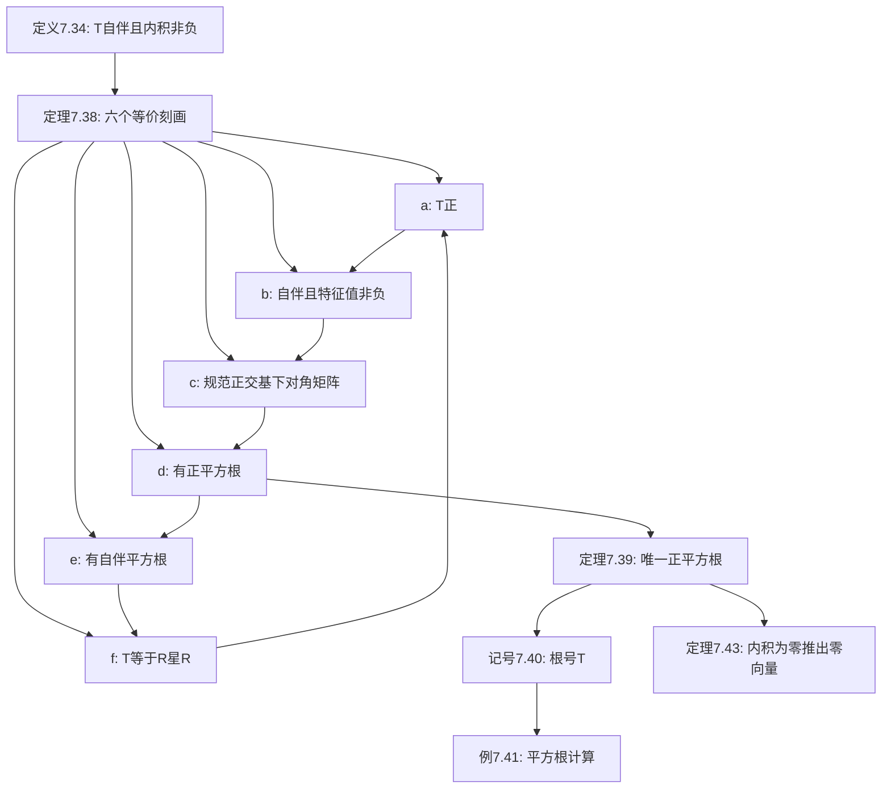

# 7C 正算子

> [!abstract] 本节概览
> 本节是[[7B 谱定理]]的直接应用，将谱定理的威力聚焦于自伴算子中一个特别重要的子类——正算子。正算子类比于非负实数，拥有平方根、函数演算等丰富的结构。
>
> **逻辑链条**：正算子定义（Def 7.34）$\to$ 平方根定义（Def 7.36）$\to$ 六个等价刻画（Thm 7.38）$\to$ 唯一正平方根（Thm 7.39）$\to$ $\sqrt{T}$ 记号（Notation 7.40）$\to$ 平方根计算实例（Ex 7.41）$\to$ $\langle Tv,v\rangle=0 \Rightarrow Tv=0$（Thm 7.43）。
>
> **前置依赖**：[[7A 自伴算子和正规算子]]（自伴定义、Thm 7.12 特征值为实、Thm 7.14 复空间自伴判定）、[[7B 谱定理]]（Thm 7.29 实谱定理、Thm 7.31 复谱定理）、[[6A 内积和范数]]（内积、范数）、[[3D 可逆性和同构]]（线性映射引理 3.4）。
>
> **核心主线**：正算子是非负实数在算子世界中的类比——六个等价刻画从不同角度描述同一概念，唯一正平方根定理是本节最重要的结果，为后续极分解和奇异值分解奠定基础。

---

## 一、正算子的定义与刻画

### 正算子的定义

> [!def] 定义 7.34：正算子（positive operator）
> 算子 $T \in \mathcal{L}(V)$ 称为**正算子**，如果 $T$ 是自伴的且对所有 $v \in V$ 有
> $$\langle Tv, v \rangle \geq 0$$
> 如果 $V$ 是复向量空间，那么"自伴"这一条件可以去掉（根据 [[7A 自伴算子和正规算子]] 的 Thm 7.14）。

定义包含两个条件：
1. **自伴性**（$T = T^*$）：保证 $\langle Tv, v \rangle$ 是实数，使"$\geq 0$"有意义。回忆 Thm 7.14：在复向量空间上，$\langle Tv, v \rangle \in \mathbb{R}$（$\forall v$）已经蕴含 $T$ 自伴，所以复空间可以省略自伴条件。
2. **非负性**（$\langle Tv, v \rangle \geq 0$）：限制特征值范围，稍后将看到它等价于所有特征值非负。

> [!note] 术语说明
> 正算子对应于非负数，更好的术语应该是"非负算子"。然而算子理论家们一贯称之为"正算子"，所以我们也遵循习惯。一些数学家用"正半定算子"（positive semidefinite operator），意思相同。

### 正算子的实例

> [!example] 例 7.35：正算子
> **(a)** 令 $T \in \mathcal{L}(\mathbb{F}^2)$ 关于标准基的矩阵为 $\begin{pmatrix} 2 & -1 \\ -1 & 1 \end{pmatrix}$。$T$ 是自伴的（矩阵对称），且
> $$\langle T(w,z), (w,z) \rangle = 2|w|^2 - 2\operatorname{Re}(w\bar{z}) + |z|^2 = |w - z|^2 + |w|^2 \geq 0$$
> 因此 $T$ 是正算子。
>
> **(b)** 如果 $U$ 是 $V$ 的子空间，那么正交投影 $P_U$ 是正算子。因为 $P_U$ 自伴（[[6C 正交补和正交投影]]），且 $\langle P_U v, v \rangle = \|P_U v\|^2 \geq 0$。
>
> **(c)** 如果 $T \in \mathcal{L}(V)$ 是自伴的，且 $b, c \in \mathbb{R}$ 使得 $b^2 < 4c$，那么 $T^2 + bT + cI$ 是正算子（如 7.26 的证明所示）。

### 平方根的定义

> [!def] 定义 7.36：平方根（square root）
> 算子 $R$ 称为算子 $T$ 的**平方根**，如果 $R^2 = T$。

> [!example] 例 7.37：算子的平方根
> 定义 $T \in \mathcal{L}(\mathbb{F}^3)$ 为 $T(z_1, z_2, z_3) = (z_3, 0, 0)$。那么 $R(z_1, z_2, z_3) = (z_2, z_3, 0)$ 是 $T$ 的一个平方根，因为 $R^2(z_1, z_2, z_3) = R(z_2, z_3, 0) = (z_3, 0, 0) = T(z_1, z_2, z_3)$。
>
> 注意：一个算子可以有无穷多个平方根。正算子的特殊之处在于它有==唯一的正平方根==（Thm 7.39）。

### 正算子的六个等价刻画

> [!thm] 定理 7.38：正算子的刻画
> 令 $T \in \mathcal{L}(V)$。那么下列等价：
> - (a) $T$ 是正算子
> - (b) $T$ 自伴且所有特征值非负
> - (c) 关于 $V$ 的某个规范正交基，$T$ 的矩阵是对角矩阵且对角线上仅有非负数
> - (d) $T$ 有正平方根
> - (e) $T$ 有自伴平方根
> - (f) 存在某个 $R \in \mathcal{L}(V)$ 使得 $T = R^*R$

> [!abstract] 证明思路
> 证明循环 $(a) \Rightarrow (b) \Rightarrow (c) \Rightarrow (d) \Rightarrow (e) \Rightarrow (f) \Rightarrow (a)$。核心策略：$(a)\Rightarrow(b)$ 用特征值与二次型的关系；$(b)\Rightarrow(c)$ 直接用谱定理；$(c)\Rightarrow(d)$ 用线性映射引理在每个基向量上定义平方根；$(d)\Rightarrow(e)$ 平凡；$(e)\Rightarrow(f)$ 用 $R^* = R$；$(f)\Rightarrow(a)$ 用 $\langle R^*Rv, v \rangle = \|Rv\|^2$。

**$(a) \Rightarrow (b)$**：$T$ 正 $\Rightarrow$ $T$ 自伴（定义）。设 $\lambda$ 是 $T$ 的特征值，$v$ 是对应的特征向量（$v \neq 0$）。

**[特征值与二次型的关系]：**
$$0 \leq \langle Tv, v \rangle = \langle \lambda v, v \rangle = \lambda \langle v, v \rangle$$

因为 $\langle v, v \rangle = \|v\|^2 > 0$，所以 $\lambda \geq 0$。于是 (b) 成立。

**$(b) \Rightarrow (c)$**：$T$ 自伴且所有特征值非负。由[[7B 谱定理]]（Thm 7.29 和 7.31），$V$ 有规范正交基 $e_1, \ldots, e_n$ 由 $T$ 的特征向量组成。令 $\lambda_1, \ldots, \lambda_n$ 是对应的特征值，每个 $\lambda_k \geq 0$。$T$ 关于 $e_1, \ldots, e_n$ 的矩阵是以 $\lambda_1, \ldots, \lambda_n$ 为对角线元素的对角矩阵。

**$(c) \Rightarrow (d)$**：设 $e_1, \ldots, e_n$ 是规范正交基，使得 $T$ 关于这个基的矩阵是对角矩阵，对角线上是非负数 $\lambda_1, \ldots, \lambda_n$。

**[利用线性映射引理构造平方根]：** 由[[3D 可逆性和同构]]的线性映射引理（3.4），存在 $R \in \mathcal{L}(V)$ 使得
$$Re_k = \sqrt{\lambda_k}\, e_k$$
对任一 $k = 1, \ldots, n$ 成立。

**[验证 $R$ 是正算子且 $R^2 = T$]：** $R$ 关于 $e_1, \ldots, e_n$ 的矩阵是以 $\sqrt{\lambda_1}, \ldots, \sqrt{\lambda_n}$ 为对角线元素的对角矩阵，所以 $R$ 自伴且特征值非负，即 $R$ 是正算子。此外 $R^2 e_k = \lambda_k e_k = Te_k$，所以 $R^2 = T$。

**$(d) \Rightarrow (e)$**：每个正算子都是自伴的（定义），所以 $T$ 的正平方根 $R$ 也是自伴的。

**$(e) \Rightarrow (f)$**：设 $R$ 是自伴算子且 $T = R^2$。那么 $T = R^*R$（因为 $R^* = R$）。

**$(f) \Rightarrow (a)$**：设 $T = R^*R$。

**[验证自伴性]：** $T^* = (R^*R)^* = R^*(R^*)^* = R^*R = T$。

**[验证非负性]：** 对任意 $v \in V$，
$$\langle Tv, v \rangle = \langle R^*Rv, v \rangle = \langle Rv, Rv \rangle = \|Rv\|^2 \geq 0$$

因此 $T$ 是正算子。$\blacksquare$

> [!tip] 证明技巧
> $(f) \Rightarrow (a)$ 的关键一步是 $\langle R^*Rv, v \rangle = \|Rv\|^2$。自伴性在这里起到了"把 $R$ 从右边移到左边"的作用，将二次型转化为范数平方。这个技巧在 Thm 7.43 中会再次出现。

### 唯一正平方根

> [!thm] 定理 7.39：每个正算子都有唯一正平方根
> $V$ 上的每个正算子都有唯一正平方根。

> [!abstract] 证明思路
> 设 $T$ 是正算子，$v$ 是 $T$ 的特征向量（$Tv = \lambda v$，$\lambda \geq 0$）。令 $R$ 是 $T$ 的正平方根，证明 $Rv = \sqrt{\lambda}\, v$，即 $R$ 在 $T$ 的特征向量上的作用唯一确定。由于谱定理保证 $V$ 中存在由 $T$ 的特征向量组成的基，所以 $R$ 唯一确定。

**[设定]：** 设 $T \in \mathcal{L}(V)$ 是正算子，$v \in V$ 是 $T$ 的特征向量，$Tv = \lambda v$，$\lambda \geq 0$。令 $R$ 是 $T$ 的正平方根。

**[展开 $v$ 为 $R$ 的特征向量]：** 由谱定理，$V$ 中存在由 $R$ 的特征向量组成的规范正交基 $e_1, \ldots, e_n$。因为 $R$ 是正算子，所有特征值非负，所以存在非负数 $\lambda_1, \ldots, \lambda_n$ 使得 $Re_k = \sqrt{\lambda_k}\, e_k$。

将 $v$ 在此基下展开：$v = a_1 e_1 + \cdots + a_n e_n$，于是
$$Rv = a_1 \sqrt{\lambda_1}\, e_1 + \cdots + a_n \sqrt{\lambda_n}\, e_n$$

**[利用 $R^2 = T$ 建立方程]：**
$$\lambda v = Tv = R^2 v = a_1 \lambda_1\, e_1 + \cdots + a_n \lambda_n\, e_n$$

同时 $\lambda v = a_1 \lambda\, e_1 + \cdots + a_n \lambda\, e_n$，比较系数得
$$a_k(\lambda - \lambda_k) = 0 \quad \text{对任一 } k = 1, \ldots, n$$

因此 $a_k = 0$（当 $\lambda_k \neq \lambda$ 时），即
$$v = \sum_{k:\, \lambda_k = \lambda} a_k e_k$$

**[得出 $Rv$ 的值]：**
$$Rv = \sum_{k:\, \lambda_k = \lambda} a_k \sqrt{\lambda}\, e_k = \sqrt{\lambda}\, v$$

**[唯一性结论]：** $R$ 在 $T$ 的每个特征向量上的作用唯一确定为 $Rv = \sqrt{\lambda}\, v$。由于谱定理保证 $V$ 中存在由 $T$ 的特征向量组成的基，所以 $R$ 在整个 $V$ 上唯一确定。$\blacksquare$

> [!note] 注意
> 一个正算子可以有无穷多个平方根（但其中只能有一个是正的）。例如，当 $\dim V > 1$ 时，$V$ 上的恒等算子就有无穷多个平方根（习题19）。

### $\sqrt{T}$ 记号

> [!def] 记号 7.40：$\sqrt{T}$
> 对于正算子 $T$，$\sqrt{T}$ 表示 $T$ 的唯一正平方根。

---

## 二、正算子的性质与应用

### 平方根的计算实例

> [!example] 例 7.41：正算子的平方根
> 在 $\mathbb{R}^2$ 上定义算子 $S, T$ 为
> $$S(x, y) = (x, 2y), \quad T(x, y) = (x+y, x+y)$$
> 关于标准基的矩阵为
> $$\mathcal{M}(S) = \begin{pmatrix} 1 & 0 \\ 0 & 2 \end{pmatrix}, \quad \mathcal{M}(T) = \begin{pmatrix} 1 & 1 \\ 1 & 1 \end{pmatrix}$$
> 两个矩阵都等于自身的转置，因此 $S$ 和 $T$ 都是自伴的。
>
> 验证正性：
> $$\langle S(x,y), (x,y) \rangle = x^2 + 2y^2 \geq 0$$
> $$\langle T(x,y), (x,y) \rangle = x^2 + 2xy + y^2 = (x+y)^2 \geq 0$$
> 因此 $S$ 和 $T$ 都是正算子。

**计算 $\sqrt{S}$**：$\mathbb{R}^2$ 的标准基 $(1,0), (0,1)$ 已经是 $S$ 的特征向量组成的规范正交基，对应特征值为 $1$ 和 $2$。因此 $\sqrt{S}$ 的特征值为 $\sqrt{1} = 1$ 和 $\sqrt{2}$，关于同一基的矩阵为
$$\mathcal{M}(\sqrt{S}) = \begin{pmatrix} 1 & 0 \\ 0 & \sqrt{2} \end{pmatrix}$$

**计算 $\sqrt{T}$**：$T$ 的特征多项式为 $\det(T - \lambda I) = (1-\lambda)^2 - 1 = \lambda^2 - 2\lambda = \lambda(\lambda - 2)$，特征值为 $2$ 和 $0$。

对应 $\lambda = 2$ 的特征向量：$(T - 2I)(x,y) = (-x+y, -x+y) = (0,0)$，解得 $(x,y) = (1,1)$，规范化为 $\frac{1}{\sqrt{2}}(1,1)$。

对应 $\lambda = 0$ 的特征向量：$T(x,y) = (x+y, x+y) = (0,0)$，解得 $(x,y) = (1,-1)$，规范化为 $\frac{1}{\sqrt{2}}(1,-1)$。

$\sqrt{T}$ 的特征值为 $\sqrt{2}$ 和 $0$，关于此规范正交基的矩阵为 $\begin{pmatrix} \sqrt{2} & 0 \\ 0 & 0 \end{pmatrix}$。换回标准基：
$$\mathcal{M}(\sqrt{T}) = \begin{pmatrix} \frac{1}{\sqrt{2}} & \frac{1}{\sqrt{2}} \\ \frac{1}{\sqrt{2}} & -\frac{1}{\sqrt{2}} \end{pmatrix} \begin{pmatrix} \sqrt{2} & 0 \\ 0 & 0 \end{pmatrix} \begin{pmatrix} \frac{1}{\sqrt{2}} & \frac{1}{\sqrt{2}} \\ \frac{1}{\sqrt{2}} & -\frac{1}{\sqrt{2}} \end{pmatrix} = \begin{pmatrix} \frac{1}{\sqrt{2}} & \frac{1}{\sqrt{2}} \\ \frac{1}{\sqrt{2}} & \frac{1}{\sqrt{2}} \end{pmatrix}$$

可以验证 $(\sqrt{T})^2 = T$，且 $\sqrt{T}$ 是正算子（自伴且特征值非负）。

### $\langle Tv, v \rangle = 0 \Rightarrow Tv = 0$

> [!thm] 定理 7.43：正算子的确定性条件
> 设 $T$ 是 $V$ 上的正算子且 $v \in V$ 使得 $\langle Tv, v \rangle = 0$，那么 $Tv = 0$。

> [!abstract] 证明思路
> 利用 $\sqrt{T}$ 的自伴性，将 $\langle Tv, v \rangle$ 转化为 $\|\sqrt{T}v\|^2$，由范数正定性得出 $\sqrt{T}v = 0$，进而 $Tv = 0$。

**[引入平方根改写内积]：**
$$0 = \langle Tv, v \rangle = \langle \sqrt{T}\sqrt{T}\, v, v \rangle = \langle \sqrt{T}v, (\sqrt{T})^*v \rangle = \langle \sqrt{T}v, \sqrt{T}v \rangle = \|\sqrt{T}v\|^2$$

**[由范数正定性推出]：** $\|\sqrt{T}v\|^2 = 0$ 意味着 $\sqrt{T}v = 0$。

**[得出最终结论]：** $Tv = \sqrt{T}(\sqrt{T}v) = \sqrt{T} \cdot 0 = 0$。$\blacksquare$

> [!tip] 证明技巧
> 这个证明是==平方根理论最漂亮的应用之一==。关键恒等式 $\langle Tv, v \rangle = \|\sqrt{T}v\|^2$ 将"二次型为零"转化为"某个向量为零"。这个技巧在证明正算子单调性、矩阵不等式等方面有广泛应用。

---

## 三、知识结构总览

---

## 四、核心思想与证明技巧

> [!success] 本节核心思想
>
> 1. **正算子 = 非负实数的算子类比**：正算子在算子世界中扮演的角色完全类比于非负实数在实数世界中的角色——非负数有平方根，正算子也有；非负数可以表示为 $w\bar{w}$，正算子可以表示为 $R^*R$。
>
> 2. **六个等价刻画提供多角度理解**：Thm 7.38 从定义、特征值、矩阵表示、平方根存在性、分解形式等六个角度刻画正算子，不同场景下使用不同条件最为方便。
>
> 3. **唯一正平方根是本节最重要的结果**：存在性依赖谱定理（在每个特征空间上取平方根再拼回来），唯一性依赖特征值的非负性（排除了"负平方根"的可能性）。
>
> 4. **$\sqrt{T}$ 记号使算子运算更丰富**：有了唯一正平方根，我们可以像对待非负数一样对正算子取平方根，这为极分解 $T = S\sqrt{T^*T}$ 奠定了基础。

> [!tip] 核心证明技巧
>
> 1. **特征值与二次型的关系**：$\lambda = \langle Tv, v \rangle / \|v\|^2$（当 $v$ 是特征向量时）。将特征值条件转化为二次型条件（或反过来），是正算子理论中最基本的技巧。
>
> 2. **谱定理的"分而治之"模式**：将算子限制到各个特征空间上，在每个特征空间上做简单操作（取平方根），然后通过直和拼回来。$(b)\Rightarrow(c)\Rightarrow(d)$ 的证明就是这一模式的典型应用。
>
> 3. **$\langle R^*Rv, v \rangle = \|Rv\|^2$**：当 $R$ 自伴时，这个恒等式将二次型转化为范数平方。$(f)\Rightarrow(a)$ 和 Thm 7.43 的证明都依赖于此。
>
> 4. **线性映射引理（3.4）的灵活运用**：$(c)\Rightarrow(d)$ 中，在已知基向量的像之后，用线性映射引理"延拓"为整个空间上的算子，这是构造性证明的标准手法。

---

## 五、补充理解与易混淆点

### 正算子与非负数的类比

正算子在算子理论中的地位完全类比于非负实数在实数中的地位。下表总结了这一类比的各个层面：

| 非负实数 $z \geq 0$ | 正算子 $T \geq 0$ | 对应定理 |
|---|---|---|
| $z \geq 0$ | $T$ 自伴且 $\langle Tv, v \rangle \geq 0$ | Def 7.34 |
| $z \geq 0 \Leftrightarrow z$ 有非负平方根 $\sqrt{z}$ | $T$ 正 $\Leftrightarrow T$ 有正平方根 $\sqrt{T}$ | Thm 7.38 (a)$\Leftrightarrow$(d) |
| $z \geq 0 \Leftrightarrow z$ 有实平方根 | $T$ 正 $\Leftrightarrow T$ 有自伴平方根 | Thm 7.38 (a)$\Leftrightarrow$(e) |
| $z \geq 0 \Leftrightarrow \exists\, w \in \mathbb{C}$ 使得 $z = w\bar{w}$ | $T$ 正 $\Leftrightarrow \exists\, R$ 使得 $T = R^*R$ | Thm 7.38 (a)$\Leftrightarrow$(f) |
| $\sqrt{z}$ 唯一 | $\sqrt{T}$ 唯一 | Thm 7.39 |

这一类比不仅是直觉上的，而且是数学上精确的。UC Berkeley EE 127 的讲义明确指出："Positive semi-definite matrices are kind of the matrix analogue to nonnegative numbers"，并引入 Loewner 偏序 $A \succeq 0$ 来强化这一类比。MIT 18.700 的讲义也强调："These should really be called nonnegative operators. Blame the French!"

**来源**：UC Berkeley EE 127 讲义（Laurent El Ghaoui）、MIT 18.700 线性代数讲义。

### 正定矩阵与协方差矩阵

在有限维空间中，正算子关于规范正交基的矩阵就是正半定矩阵（positive semidefinite matrix）。正算子理论与统计学中的协方差矩阵有深刻的联系。

**协方差矩阵的正半定性**：设 $X_1, \ldots, X_n$ 是随机变量，协方差矩阵 $\Sigma$ 的第 $(j,k)$ 元素为 $\operatorname{Cov}(X_j, X_k)$。对任意向量 $w = (w_1, \ldots, w_n)^T$，
$$w^T \Sigma\, w = \operatorname{Var}\!\left(\sum_{i} w_i X_i\right) \geq 0$$
因为方差总是非负的。因此 $\Sigma$ 是正半定矩阵，对应的算子是正算子。

**正定 vs 正半定**：$\Sigma$ 是正定的（所有特征值严格为正）当且仅当不存在非零向量 $w$ 使得 $\sum_i w_i X_i$ 几乎必然为常数——即随机变量之间没有线性冗余关系。当某些 $X_i$ 可以被其他 $X_j$ 的线性组合完美表示时，$\Sigma$ 是奇异的（有零特征值），但仍为正半定。

**Cholesky 分解**：当 $\Sigma$ 正定时，存在唯一的下三角矩阵 $L$ 使得 $\Sigma = LL^T$，这就是 Cholesky 分解。它对应于 Thm 7.38 中条件 (f) 的一个特殊构造——取 $R = L^T$，则 $\Sigma = R^T R = R^*R$（实数情形下 $R^* = R^T$）。UCLA ECE 133A 的讲义详细讨论了 Cholesky 分解与正定矩阵的关系。

**来源**：UC Berkeley EE 127 讲义（Laurent El Ghaoui）、UCLA ECE 133A 讲义（L. Vandenberghe）、UBC CPSC 440 讲义（Danica Sutherland）。

### 正算子与内积的关系

正算子与内积之间有一个优美而深刻的双向联系。

**正算子生成新内积**：设 $T$ 是 $V$ 上的可逆正算子，定义
$$\langle u, v \rangle_T = \langle Tu, v \rangle$$
则 $\langle \cdot, \cdot \rangle_T$ 是 $V$ 上的一个内积（习题 23(a)）。正定性由 $\langle Tv, v \rangle \geq 0$ 保证，严格正定性由 $T$ 可逆保证（Thm 7.43）。

**所有内积都可由正算子生成**：反过来，$V$ 上的任一内积都具有 $\langle u, v \rangle_T = \langle Tu, v \rangle$ 的形式，其中 $T$ 是某个可逆正算子（习题 23(b)）。这意味着==改变内积等价于乘以一个可逆正算子==。

**应用**：这一联系在多个领域有重要应用。在黎曼几何中，度量张量就是一个正定矩阵场；在机器学习中，核方法通过正定核函数定义新的内积空间（再生核希尔伯特空间）；在广义相对论中，时空度规由一个非正定的对称双线性形式给出。

**来源**：UC Berkeley EE 127 讲义（Laurent El Ghaoui）、UBC CPSC 440 讲义（Danica Sutherland）。

### 常见误区

> [!danger] 误区1："正算子就是正定矩阵"
> ❌ 错误认知：正算子等同于正定矩阵，即特征值必须严格大于零。
> ✅ 正确理解：正算子允许特征值为零（半正定），只要所有特征值 $\geq 0$ 即可。正定（特征值 $> 0$）是正算子的真子类——正定算子恰好是可逆的正算子。例如，正交投影 $P_U$ 是正算子，但当 $U \neq V$ 时 $P_U$ 不可逆（有零特征值）。

> [!danger] 误区2："正算子的平方根是唯一的"
> ❌ 错误认知：正算子只有一个平方根。
> ✅ 正确理解：Thm 7.39 保证的是==唯一的正平方根==。正算子可以有无穷多个非正平方根。例如恒等算子 $I$ 的正平方根只有 $I$ 本身，但它有无穷多个自伴平方根（习题19），还有更多非自伴的平方根。

> [!danger] 误区3："$\langle Tv, v \rangle \geq 0 \Rightarrow T$ 正"
> ❌ 错误认知：只要二次型非负，$T$ 就是正算子。
> ✅ 正确理解：在实数域上，$\langle Tv, v \rangle \geq 0$（$\forall v$）不能推出 $T$ 自伴，因此不能推出 $T$ 正。反例：$T = \begin{pmatrix} 1 & 1 \\ -1 & 1 \end{pmatrix}$ 满足 $\langle Tv, v \rangle = x^2 + y^2 \geq 0$，但 $T^T \neq T$。在复数域上，Thm 7.14 保证 $\langle Tv, v \rangle \in \mathbb{R}$（$\forall v$）蕴含 $T$ 自伴，所以复空间中 $\langle Tv, v \rangle \geq 0$ 确实蕴含 $T$ 正。

> [!danger] 误区4："正算子的乘积还是正算子"
> ❌ 错误认知：如果 $S$ 和 $T$ 都是正算子，那么 $ST$ 也是正算子。
> ✅ 正确理解：$ST$ 正 $\Leftrightarrow$ $S$ 和 $T$ 可交换（习题18）。问题在于 $ST$ 未必自伴：$(ST)^* = T^*S^* = TS \neq ST$（一般情况）。只有当 $ST = TS$ 时，$(ST)^* = ST$ 才成立，此时还需要验证特征值非负。

---

## 六、习题精选

> [!todo] 本节习题
>
> | 习题号 | 标题 | 核心考点 | 难度 |
> |---|---|---|---|
> | 1 | $T$ 和 $-T$ 都正 $\Rightarrow$ $T=0$ | 正算子定义 | 低 |
> | 2 | 三对角矩阵正性验证 | 正算子判定与可逆性 | 中 |
> | 5 | 规范正交基下对角线非负 | Thm 7.38(c) 的等价形式 | 中 |
> | 9 | $S^*TS$ 正性 | Thm 7.38(f) 的应用 | 中 |
> | 13 | $T - \alpha I$ 正性 $\Leftrightarrow$ 特征值条件 | 特征值与正算子的关系 | 高 |
> | 18 | $ST$ 正 $\Leftrightarrow$ $S$ 和 $T$ 可交换 | 正算子乘积 | 高 |
> | 21 | 希尔伯特矩阵正性 | 格拉姆矩阵方法 | 高 |

### 习题1：$T$ 和 $-T$ 都正则 $T=0$

> [!problem] 习题1
> 设 $T \in \mathcal{L}(V)$。证明：如果 $T$ 和 $-T$ 都是正算子，那么 $T = 0$。

> [!faq]- 查看解答
> **解题思路**：$T$ 正 $\Rightarrow$ $\langle Tv, v \rangle \geq 0$；$-T$ 正 $\Rightarrow$ $\langle -Tv, v \rangle \geq 0$，即 $\langle Tv, v \rangle \leq 0$。两者结合得 $\langle Tv, v \rangle = 0$ 对所有 $v$ 成立，由 Thm 7.43 得 $Tv = 0$。
>
> **完整解答**：
>
> $T$ 正 $\Rightarrow$ 对所有 $v \in V$，$\langle Tv, v \rangle \geq 0$。
>
> $-T$ 正 $\Rightarrow$ 对所有 $v \in V$，$\langle (-T)v, v \rangle \geq 0$，即 $-\langle Tv, v \rangle \geq 0$，亦即 $\langle Tv, v \rangle \leq 0$。
>
> 因此 $\langle Tv, v \rangle = 0$ 对所有 $v \in V$ 成立。由 Thm 7.43，$Tv = 0$ 对所有 $v$ 成立，即 $T = 0$。

### 习题2：三对角矩阵正性验证

> [!problem] 习题2
> 设算子 $T \in \mathcal{L}(\mathbb{F}^4)$（关于标准基）的矩阵为
> $$\begin{pmatrix} 2 & -1 & 0 & 0 \\ -1 & 2 & -1 & 0 \\ 0 & -1 & 2 & -1 \\ 0 & 0 & -1 & 2 \end{pmatrix}$$
> 证明：$T$ 是可逆正算子。

> [!faq]- 查看解答
> **解题思路**：(1) 验证自伴性（矩阵对称）；(2) 验证正性（展开 $\langle Tv, v \rangle$ 为完全平方和）；(3) 验证可逆性（$\langle Tv, v \rangle = 0 \Rightarrow v = 0$）。
>
> **完整解答**：
>
> **自伴性**：矩阵是实对称的，所以 $T$ 自伴。
>
> **正性**：对 $v = (a_1, a_2, a_3, a_4) \in \mathbb{F}^4$，
> $$\langle Tv, v \rangle = 2|a_1|^2 - \bar{a}_1 a_2 - a_1 \bar{a}_2 + 2|a_2|^2 - \bar{a}_2 a_3 - a_2 \bar{a}_3 + 2|a_3|^2 - \bar{a}_3 a_4 - a_3 \bar{a}_4 + 2|a_4|^2$$
> $$= |a_1|^2 + |a_1 - a_2|^2 + |a_2 - a_3|^2 + |a_3 - a_4|^2 + |a_4|^2 \geq 0$$
>
> **可逆性**：$\langle Tv, v \rangle = 0$ 当且仅当 $a_1 = 0$，$a_1 = a_2$，$a_2 = a_3$，$a_3 = a_4$，$a_4 = 0$，即 $a_1 = a_2 = a_3 = a_4 = 0$。由 Thm 7.43，$T$ 的零空间为 $\{0\}$，$T$ 可逆。

### 习题5：规范正交基下对角线非负

> [!problem] 习题5
> 设 $T \in \mathcal{L}(V)$ 是自伴的。证明：$T$ 是正算子，当且仅当对于 $V$ 的任一规范正交基 $e_1, \ldots, e_n$，都有 $\mathcal{M}(T, (e_1, \ldots, e_n))$ 的对角线元素全为非负数。

> [!faq]- 查看解答
> **解题思路**：必要性：$T$ 正 $\Rightarrow$ $\langle Te_j, e_j \rangle \geq 0$，而对角线元素恰好是 $\langle Te_j, e_j \rangle$。充分性：对任意 $v = \sum a_j e_j$ 展开 $\langle Tv, v \rangle$，利用自伴性。
>
> **完整解答**：
>
> **必要性**（$T$ 正 $\Rightarrow$ 对角线非负）：$T$ 正 $\Rightarrow$ $\langle Te_j, e_j \rangle \geq 0$ 对每个 $j$。而 $\mathcal{M}(T)$ 的第 $j$ 个对角线元素为 $\langle Te_j, e_j \rangle$，所以对角线元素全非负。
>
> **充分性**（对角线非负 $\Rightarrow$ $T$ 正）：设对 $V$ 的任一规范正交基，$T$ 的矩阵对角线元素非负。对任意 $v \in V$，$v \neq 0$，将 $v$ 扩充为规范正交基 $e_1 = v/\|v\|, e_2, \ldots, e_n$。则
> $$\langle Tv, v \rangle = \|v\|^2 \langle T(v/\|v\|), v/\|v\| \rangle = \|v\|^2 \langle Te_1, e_1 \rangle \geq 0$$
> 因为 $\langle Te_1, e_1 \rangle$ 是 $T$ 关于基 $e_1, \ldots, e_n$ 的第一个对角线元素，由假设非负。因此 $T$ 是正算子。

### 习题9：$S^*TS$ 的正性

> [!problem] 习题9
> 设 $T \in \mathcal{L}(V)$ 是正算子，$S \in \mathcal{L}(W, V)$。证明：$S^*TS$ 是 $W$ 上的正算子。

> [!faq]- 查看解答
> **解题思路**：利用 Thm 7.38(f) 的形式。$T$ 正 $\Rightarrow$ $T = R^*R$（取 $R = \sqrt{T}$），则 $S^*TS = S^*R^*RS = (RS)^*(RS)$，由 (f)$\Rightarrow$(a) 得 $S^*TS$ 正。
>
> **完整解答**：
>
> $T$ 是正算子，由 Thm 7.38(f)，存在 $R \in \mathcal{L}(V)$ 使得 $T = R^*R$（可取 $R = \sqrt{T}$）。
>
> 令 $RS \in \mathcal{L}(W, V)$，则
> $$S^*TS = S^*R^*RS = (RS)^*(RS)$$
>
> 由 Thm 7.38(f)$\Rightarrow$(a)，$(RS)^*(RS)$ 是 $W$ 上的正算子。因此 $S^*TS$ 是正算子。

### 习题13：$T - \alpha I$ 的正性条件

> [!problem] 习题13
> 设 $T \in \mathcal{L}(V)$ 是自伴的，$\alpha \in \mathbb{R}$。
> (a) 证明：$T - \alpha I$ 是正算子，当且仅当 $\alpha$ 小于或等于 $T$ 的每个特征值。
> (b) 证明：$\alpha I - T$ 是正算子，当且仅当 $\alpha$ 大于或等于 $T$ 的每个特征值。

> [!faq]- 查看解答
> **解题思路**：$T - \alpha I$ 的特征值是 $\lambda_j - \alpha$，其中 $\lambda_j$ 是 $T$ 的特征值。$T - \alpha I$ 正 $\Leftrightarrow$ 所有 $\lambda_j - \alpha \geq 0$ $\Leftrightarrow$ $\alpha \leq \min_j \lambda_j$。
>
> **完整解答**：
>
> **(a)** $T - \alpha I$ 自伴（因为 $(T - \alpha I)^* = T^* - \alpha I = T - \alpha I$）。
>
> 由 Thm 7.38(b)，$T - \alpha I$ 正 $\Leftrightarrow$ $T - \alpha I$ 的所有特征值非负。
>
> $T - \alpha I$ 的特征值为 $\lambda_j - \alpha$（$j = 1, \ldots, m$），其中 $\lambda_1, \ldots, \lambda_m$ 是 $T$ 的不同特征值。
>
> $\lambda_j - \alpha \geq 0$ 对所有 $j$ $\Leftrightarrow$ $\alpha \leq \lambda_j$ 对所有 $j$ $\Leftrightarrow$ $\alpha \leq \min\{\lambda_1, \ldots, \lambda_m\}$。
>
> **(b)** $\alpha I - T = -(T - \alpha I)$。$\alpha I - T$ 正 $\Leftrightarrow$ 所有特征值 $\alpha - \lambda_j \geq 0$ $\Leftrightarrow$ $\alpha \geq \max\{\lambda_1, \ldots, \lambda_m\}$。

### 习题18：$ST$ 正当且仅当 $S$ 和 $T$ 可交换

> [!problem] 习题18
> 设 $S$ 和 $T$ 是 $V$ 上的正算子。证明：$ST$ 是正算子，当且仅当 $S$ 和 $T$ 可交换。

> [!faq]- 查看解答
> **解题思路**：必要性：$ST$ 正 $\Rightarrow$ $ST$ 自伴 $\Rightarrow$ $(ST)^* = ST$ $\Rightarrow$ $TS = ST$。充分性：$ST = TS$ $\Rightarrow$ $ST$ 自伴，且可交换自伴算子可同时对角化。
>
> **完整解答**：
>
> **必要性**（$ST$ 正 $\Rightarrow$ $ST = TS$）：
>
> $ST$ 是正算子 $\Rightarrow$ $ST$ 自伴 $\Rightarrow$ $(ST)^* = ST$。
>
> 但 $(ST)^* = T^*S^* = TS$（因为 $S, T$ 自伴）。所以 $TS = ST$。
>
> **充分性**（$ST = TS$ $\Rightarrow$ $ST$ 正）：
>
> 1. **自伴性**：$(ST)^* = T^*S^* = TS = ST$（因为 $S, T$ 自伴且可交换）。
>
> 2. **特征值非负**：由于 $S$ 和 $T$ 是可交换的自伴算子，由[[7B 谱定理]]的推论，存在 $V$ 的规范正交基使得 $S$ 和 $T$ 关于该基的矩阵都是对角矩阵。设 $S$ 的对角元素为 $s_1, \ldots, s_n \geq 0$，$T$ 的对角元素为 $t_1, \ldots, t_n \geq 0$。则 $ST$ 的对角元素为 $s_1 t_1, \ldots, s_n t_n \geq 0$。
>
> 由 Thm 7.38(b)，$ST$ 是正算子。

### 习题21：希尔伯特矩阵的正性

> [!problem] 习题21
> 设 $n$ 是正整数。$n \times n$ 的希尔伯特矩阵（Hilbert matrix）第 $j$ 行第 $k$ 列元素为 $\frac{1}{j+k-1}$。设算子 $T \in \mathcal{L}(V)$ 关于 $V$ 的某个规范正交基的矩阵是 $n \times n$ 希尔伯特矩阵。证明：$T$ 是可逆正算子。

> [!faq]- 查看解答
> **解题思路**：(1) 验证自伴性（矩阵对称）；(2) 将希尔伯特矩阵表示为格拉姆矩阵 $H_{jk} = \langle f_j, f_k \rangle$，其中 $f_j(x) = x^{j-1}$，内积为 $L^2[0,1]$ 上的积分内积；(3) 利用多项式性质证明可逆性。
>
> **完整解答**：
>
> **自伴性**：$H_{jk} = \frac{1}{j+k-1} = \frac{1}{k+j-1} = H_{kj}$，矩阵实对称，$T$ 自伴。
>
> **正性**：定义 $L^2[0,1]$ 上的内积 $\langle f, g \rangle = \int_0^1 f(x)\overline{g(x)}\,dx$。令 $f_j(x) = x^{j-1}$（$j = 1, \ldots, n$）。则
> $$\langle f_j, f_k \rangle = \int_0^1 x^{j+k-2}\,dx = \frac{1}{j+k-1} = H_{jk}$$
> 所以 $H$ 是函数组 $\{f_1, \ldots, f_n\}$ 的格拉姆矩阵。由 Thm 7.38(f)，$H = R^*R$（其中 $R$ 的列是 $f_j$ 在某组基下的坐标），因此 $T$ 是正算子。
>
> **可逆性**：设 $v = (v_1, \ldots, v_n)^T \in \mathbb{F}^n$，令 $p(x) = \sum_{j=1}^n v_j x^{j-1}$。则
> $$\langle Hv, v \rangle = \sum_{j,k} v_j H_{jk} \bar{v}_k = \left\langle \sum_j v_j f_j, \sum_k v_k f_k \right\rangle = \|p\|^2 = \int_0^1 |p(x)|^2\,dx$$
>
> 若 $\langle Hv, v \rangle = 0$，则 $\int_0^1 |p(x)|^2\,dx = 0$，蕴含 $p(x) = 0$ 在 $[0,1]$ 上几乎处处成立。由于 $p$ 是多项式，$p$ 恒为零，即 $v_1 = \cdots = v_n = 0$。由 Thm 7.43，$T$ 可逆。

---

## 七、视频学习指南

> [!info] 视频资源
> 暂无对应视频

> [!info] 视频精要
> 暂无对应视频

---

## 八、教材原文
#学习/线性代数/内积空间上的算子/正算子
