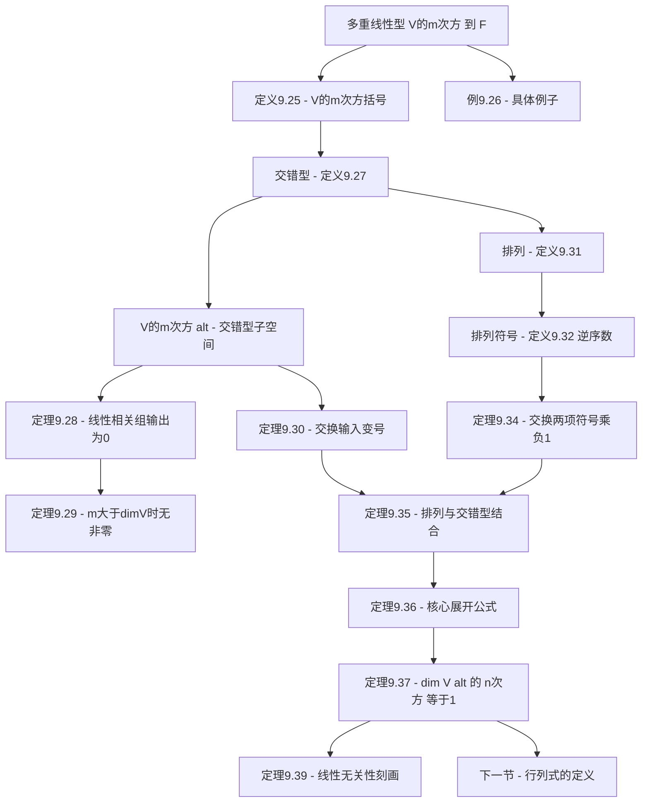

# 9B 交错多重线性型

> [!abstract] 本节概览
> 本节是第9章"多重线性代数和行列式"的第二小节，将[[9A 双线性和二次型|双线性型]]推广到==多重线性型==，然后聚焦==交错多重线性型==，为下一节行列式的定义奠定理论基础。逻辑链条如下：
>
> 1. **定义9.24/9.25：多重线性型** $\to$ $V^{(m)}$：$V^m \to \mathbb{F}$ 上每个位置都线性的函数
> 2. **定义9.27：交错型** $\to$ $V^{(m)}_{\text{alt}}$：任意两个输入相等时输出为零
> 3. **定理9.28/9.29：基本性质** $\to$ 线性相关组 $\to$ 输出0；$m > \dim V$ 时无非零交错型
> 4. **定义9.31/9.32：排列与符号** $\to$ 逆序数定义排列的符号 $\operatorname{sign}(j_1, \ldots, j_m)$
> 5. **定理9.35/9.36：核心公式** $\to$ $\alpha(v_{j_1}, \ldots) = \operatorname{sign} \cdot \alpha(v_1, \ldots)$；展开公式
> 6. **定理9.37：一维性** $\to$ $\dim V^{(n)}_{\text{alt}} = 1$（$n = \dim V$）← ==本节核心==
> 7. **定理9.39：线性无关性刻画** $\to$ 非零交错 $n$ 重线性型检测线性无关性
>
> **核心主线**：多重线性型 $\to$ 交错型 $\to$ 排列符号 $\to$ 展开公式 $\to$ 一维性 $\to$ 行列式定义的理论基础。
>
> **前置依赖**：[[9A 双线性和二次型]]（双线性型、交错双线性型）、[[3F 对偶]]（对偶空间 $V'$、线性泛函）、[[8D 联系矩阵与算子的桥梁——迹]]（迹的多线性性）、[[2A 张成空间和线性无关性]]（线性相关性引理2.19）。

---

## 一、多重线性型的定义与基本性质

### 1.1 笛卡尔积 $V^m$

> [!def] 定义9.24：$V^m$
> 对于正整数 $m$，定义 $V^m$ 为
> $$V^m = \underbrace{V \times \cdots \times V}_{m \text{ 个 } V}$$

### 1.2 多重线性型的定义

> [!def] 定义9.25：$m$ 重线性型（$m$-linear form）、$V^{(m)}$、多重线性型（multilinear form）
> 对于正整数 $m$，$V$ 上的==$m$ 重线性型==是一个函数 $\beta : V^m \to \mathbb{F}$，它在每个位置都是线性的（当其他位置的值固定时）。这意味着，对每个 $k \in \{1, \ldots, m\}$ 和所有 $u_1, \ldots, u_m \in V$，函数
> $$v \mapsto \beta(u_1, \ldots, u_{k-1}, v, u_{k+1}, \ldots, u_m)$$
> 是 $V$ 到 $\mathbb{F}$ 的线性映射。
>
> $V$ 上 $m$ 重线性型所构成的集合记作 $V^{(m)}$。若函数 $\beta$ 是 $V$ 上的 $m$ 重线性型（$m$ 为正整数），则称该函数为一个==多重线性型==。

**与已学概念的关系**：
- $V$ 上的 $1$ 重线性型 = $V$ 上的[[3F 对偶|线性泛函]]（即 $V^{(1)} = V'$）
- $V$ 上的 $2$ 重线性型 = $V$ 上的[[9A 双线性和二次型|双线性型]]（即 $V^{(2)}$）
- 带有通常的函数加法和标量乘法运算的 $V^{(m)}$ 是向量空间

### 1.3 多重线性型的例子

> [!example] 例9.26：$m$ 重线性型
>
> **例1**：设 $\alpha, \rho \in V^{(2)}$。定义函数 $\beta : V^4 \to \mathbb{F}$ 为
> $$\beta(v_1, v_2, v_3, v_4) = \alpha(v_1, v_2)\,\rho(v_3, v_4)$$
> 那么 $\beta \in V^{(4)}$。这是因为固定 $v_2, v_3, v_4$ 后，$\beta$ 关于 $v_1$ 是线性的（因为 $\alpha$ 在第一个位置上线性），其他位置类似。
>
> **例2**：定义函数 $\beta : \mathcal{L}(V)^m \to \mathbb{F}$ 为
> $$\beta(T_1, \ldots, T_m) = \operatorname{tr}(T_1 \cdots T_m)$$
> 那么 $\beta$ 是 $\mathcal{L}(V)$ 上的 $m$ 重线性型。这是因为[[8D 联系矩阵与算子的桥梁——迹|迹]]是线性的，且矩阵乘法在每个因子上是线性的。

---

## 二、交错多重线性型

### 2.1 交错型的定义

> [!def] 定义9.27：交错型（alternating forms）、$V^{(m)}_{\text{alt}}$
> 设 $m$ 是正整数。对于 $V$ 上的 $m$ 重线性型 $\alpha$，如果只要 $V$ 中向量组 $v_1, \ldots, v_m$ 满足对于某两个不同的 $j, k \in \{1, \ldots, m\}$ 有 $v_j = v_k$，就有 $\alpha(v_1, \ldots, v_m) = 0$，则称 $\alpha$ 是==交错的==。
>
> $$V^{(m)}_{\text{alt}} = \{\alpha \in V^{(m)} : \alpha \text{ 是 } V \text{ 上的交错 } m \text{ 重线性型}\}$$

**与[[9A 双线性和二次型|9A节]]的联系**：[[9A 双线性和二次型|交错双线性型]]（定义9.14）就是 $m = 2$ 时的特殊情况。$V^{(2)}_{\text{alt}}$ 在 9A 中已经研究过。

> [!note] 子空间验证
> $V^{(m)}_{\text{alt}}$ 是 $V^{(m)}$ 的子空间——交错型的和与标量倍仍是交错的（因为零函数显然满足交错条件，且线性运算保持"两个相等输入时为零"的性质）。

### 2.2 交错型与线性相关性

> [!thm] 定理9.28：交错多重线性型和线性相关性
> 设 $m$ 是正整数，$\alpha$ 是 $V$ 上的交错 $m$ 重线性型。若 $v_1, \ldots, v_m$ 是 $V$ 中的线性相关组，那么
> $$\alpha(v_1, \ldots, v_m) = 0$$

> [!abstract] 证明思路
> **[利用线性相关性引理]**：
> 1. 由[[2A 张成空间和线性无关性|线性相关性引理（2.19）]]，某个 $v_k$ 是 $v_1, \ldots, v_{k-1}$ 的线性组合。
> 2. 存在 $b_1, \ldots, b_{k-1}$ 使得 $v_k = b_1 v_1 + \cdots + b_{k-1} v_{k-1}$。
> 3. 将 $v_k$ 代入 $\alpha(v_1, \ldots, v_m)$，利用 $\alpha$ 在第 $k$ 个位置上的线性性展开：
>    $$\alpha(v_1, \ldots, v_m) = \sum_{j=1}^{k-1} b_j\, \alpha(v_1, \ldots, v_{k-1}, v_j, v_{k+1}, \ldots, v_m)$$
> 4. 每一项中 $v_j$ 出现了两次（一次在第 $j$ 个位置，一次在第 $k$ 个位置），由交错性，每项都等于 $0$。$\blacksquare$

> [!tip] 定理9.28的直觉
> 这个定理的几何意义是：如果 $m$ 个向量线性相关，它们张成的"平行多面体"退化了，"体积"为零。这正是有向体积函数（交错多重线性型）的自然性质。

### 2.3 $m > \dim V$ 时无非零交错型

> [!thm] 定理9.29：对 $m > \dim V$，不存在非零交错 $m$ 重线性型
> 设 $m > \dim V$。那么 $0$ 是 $V$ 上唯一的交错 $m$ 重线性型。

> [!abstract] 证明思路
> **[反证与定理9.28的直接应用]**：
> 1. 设 $\alpha$ 是 $V$ 上的交错 $m$ 重线性型，且 $v_1, \ldots, v_m \in V$。
> 2. 因为 $m > \dim V$，由[[2A 张成空间和线性无关性|2.22]]，该组不是线性无关的。
> 3. 由定理9.28，$\alpha(v_1, \ldots, v_m) = 0$。
> 4. 因此 $\alpha$ 是从 $V^m$ 到 $\mathbb{F}$ 的零函数。$\blacksquare$

> [!note] 推论
> 定理9.29意味着：在 $n$ 维空间上，只有当输入向量的个数 $\leq n$ 时，才可能存在有意义的交错多重线性型。特别地，$V^{(m)}_{\text{alt}} = \{0\}$ 当 $m > n$。

### 2.4 交换输入向量变号

> [!thm] 定理9.30：交换交错多重线性型的输入向量
> 设 $m$ 是正整数，$\alpha$ 是 $V$ 上的交错 $m$ 重线性型，且 $v_1, \ldots, v_m$ 是 $V$ 中的向量组。那么交换 $\alpha(v_1, \ldots, v_m)$ 中任意两个位置上的向量会使 $\alpha$ 的值变为原来的 $-1$ 倍。

> [!abstract] 证明思路
> **[利用交错性推导反对称性]**：
> 1. 在前两个位置上都取 $v_1 + v_2$ 可得
>    $$0 = \alpha(v_1 + v_2, v_1 + v_2, v_3, \ldots, v_m)$$
> 2. 利用 $\alpha$ 的多重线性性展开（与[[9A 双线性和二次型|定理9.16的证明]]完全类似）：
>    $$0 = \alpha(v_1, v_1, v_3, \ldots) + \alpha(v_1, v_2, v_3, \ldots) + \alpha(v_2, v_1, v_3, \ldots) + \alpha(v_2, v_2, v_3, \ldots)$$
> 3. 第一项和第四项为零（交错性），所以 $\alpha(v_1, v_2, v_3, \ldots) + \alpha(v_2, v_1, v_3, \ldots) = 0$。
> 4. 因此 $\alpha(v_2, v_1, v_3, \ldots) = -\alpha(v_1, v_2, v_3, \ldots)$。类似地，交换任意两个位置都变号。$\blacksquare$

> [!warning] 注意
> 定理9.30说的是交换==任意==两个位置（不限于相邻位置）。这与[[9A 双线性和二次型|定理9.16]]（$m = 2$ 的特殊情况）的证明方法完全一致。

---

## 三、排列与排列的符号

### 3.1 排列的定义

> [!def] 定义9.31：排列（permutation）、$\text{perm}_m$
> 设 $m$ 是正整数。$(1, \ldots, m)$ 的一个==排列==是不重不漏地包含 $1, \ldots, m$ 的组 $(j_1, \ldots, j_m)$。
>
> $(1, \ldots, m)$ 的所有排列所构成的集合记为 $\text{perm}_m$。

**直觉**：$\text{perm}_m$ 的一个元素就是对头 $m$ 个正整数的一个重排。例如 $(2, 3, 4, 5, 1) \in \text{perm}_5$。

### 3.2 排列的符号（逆序数）

> [!def] 定义9.32：排列的符号（sign of a permutation）
> 排列 $(j_1, \ldots, j_m)$ 的==符号==定义为
> $$\operatorname{sign}(j_1, \ldots, j_m) = (-1)^N$$
> 其中 $N$ 是所有整数对 $(k, \ell)$（$1 \leq k < \ell \leq m$）中，满足 $k$ 在组 $(j_1, \ldots, j_m)$ 中排在 $\ell$ ==之后==的数目。

$N$ 也称为排列的==逆序数==（inversion number）。若 $N$ 为偶数则符号为 $1$（偶排列），若 $N$ 为奇数则符号为 $-1$（奇排列）。

### 3.3 符号的计算例子

> [!example] 例9.33：符号
>
> **例1**：$(1, \ldots, m)$（保持自然顺序不变）的符号是 $1$（逆序数为 $0$）。
>
> **例2**：在 $(2, 1, 3, 4)$ 这个组中，唯一满足 $k$ 排在 $\ell$ 之后的整数对 $(k, \ell)$（$k < \ell$）是 $(1, 2)$。因此排列 $(2, 1, 3, 4)$ 的符号是 $-1$。
>
> **例3**：在排列 $(2, 3, \ldots, m, 1)$ 中，满足 $k$ 排在 $\ell$ 之后的整数对 $(k, \ell)$（$k < \ell$）仅有 $(1, 2), (1, 3), \ldots, (1, m)$。因为这些整数对共有 $m - 1$ 个，所以该排列的符号等于 $(-1)^{m-1}$。

### 3.4 交换排列中的两项

> [!thm] 定理9.34：交换排列中的两项
> 交换排列中的两项会将排列的符号乘以 $-1$。

> [!abstract] 证明思路
> **[分析逆序数变化]**：
> 1. 假设第二个排列通过交换第一个排列中的两项得到。
> 2. 被交换的两项本身：如果原来按自然顺序排列，交换后不按自然顺序排列（反之亦然），净变化量为 $\pm 1$（奇数）。
> 3. 两个被交换项之间的中间项：若某个中间项最初与两个被交换的项都符合自然顺序，交换后与两个都不符合（净变化 $+2$）；若最初都不符合，交换后都符合（净变化 $-2$）；若恰与之一符合，则不变（净变化 $0$）。所有中间项的贡献都是偶数。
> 4. 其他数对不受影响。因此逆序数总变化量是奇数，符号乘以 $-1$。$\blacksquare$

> [!important] 逆序数奇偶性的良定义性
> 定理9.34保证了一个关键事实：==无论用什么方式将排列分解为对换（交换），对换个数的奇偶性是唯一确定的==。这是因为每次对换都改变符号，而符号本身是良定义的（由逆序数定义）。

---

## 四、交错型与排列的结合

### 4.1 排列与交错型的关系

> [!thm] 定理9.35：排列和交错多重线性型
> 设 $m$ 是正整数，且 $\alpha \in V^{(m)}_{\text{alt}}$。那么
> $$\alpha(v_{j_1}, \ldots, v_{j_m}) = \operatorname{sign}(j_1, \ldots, j_m)\, \alpha(v_1, \ldots, v_m)$$
> 对 $V$ 中每个向量组 $v_1, \ldots, v_m$ 以及所有 $(j_1, \ldots, j_m) \in \text{perm}_m$ 成立。

> [!abstract] 证明思路
> **[利用交换操作逐步还原]**：
> 1. 设 $(j_1, \ldots, j_m) \in \text{perm}_m$。通过对 $\alpha$ 不同位置上的向量进行一系列交换操作，使下标排列由 $(j_1, \ldots, j_m)$ 变为 $(1, \ldots, m)$。
> 2. 每次交换将 $\alpha$ 的值乘以 $-1$（由定理9.30），同时将排列的符号乘以 $-1$（由定理9.34）。
> 3. 最终得到排列 $(1, \ldots, m)$，其符号为 $1$。
> 4. 若 $\operatorname{sign}(j_1, \ldots, j_m) = 1$，则 $\alpha$ 的值改变符号偶数次（不变）；若为 $-1$，则改变奇数次（变号）。$\blacksquare$

> [!tip] 定理9.35的意义
> 这个定理将排列的符号与交错多重线性型的行为完美对应——排列的符号精确地编码了"将输入向量重排后，交错型的值如何变化"。这是连接排列理论与线性代数的桥梁。

### 4.2 核心展开公式

> [!thm] 定理9.36：$V$ 上交错 $(\dim V)$ 重线性型的公式
> 令 $n = \dim V$。设 $e_1, \ldots, e_n$ 是 $V$ 的一个基且 $v_1, \ldots, v_n \in V$。对每个 $k \in \{1, \ldots, n\}$，令 $b_{1,k}, \ldots, b_{n,k} \in \mathbb{F}$ 满足
> $$v_k = \sum_{j=1}^{n} b_{j,k}\, e_j$$
> 那么
> $$\alpha(v_1, \ldots, v_n) = \alpha(e_1, \ldots, e_n) \sum_{(j_1, \ldots, j_n) \in \text{perm}_n} \operatorname{sign}(j_1, \ldots, j_n)\, b_{j_1, 1} \cdots b_{j_n, n}$$
> 对于 $V$ 上每个交错 $n$ 重线性型都成立。

> [!abstract] 证明思路
> **[展开+交错性消项]**：
> 1. 将每个 $v_k$ 用基向量展开：
>    $$\alpha(v_1, \ldots, v_n) = \alpha\Bigl(\sum_{j_1} b_{j_1,1} e_{j_1}, \ldots, \sum_{j_n} b_{j_n,n} e_{j_n}\Bigr)$$
> 2. 利用多重线性性逐个展开，得到 $n^n$ 项的求和。
> 3. ==关键简化==：如果 $j_1, \ldots, j_n$ 不是互异的整数，则 $\alpha(e_{j_1}, \ldots, e_{j_n}) = 0$（因为某个基向量出现至少两次，由交错性）。
> 4. 因此只剩下 $j_1, \ldots, j_n$ 互不相同的项，即 $(j_1, \ldots, j_n) \in \text{perm}_n$ 的项。
> 5. 由定理9.35，$\alpha(e_{j_1}, \ldots, e_{j_n}) = \operatorname{sign}(j_1, \ldots, j_n)\, \alpha(e_1, \ldots, e_n)$。$\blacksquare$

> [!note] 公式的结构
> 这个公式将 $\alpha(v_1, \ldots, v_n)$ 表示为 $\alpha(e_1, \ldots, e_n)$ 乘以一个由坐标和排列符号构成的表达式。注意求和遍历所有 $n!$ 个排列，而非 $n^n$ 项——交错性将绝大多数项消去了。

### 4.3 一维性——本节核心定理

> [!thm] 定理9.37：$\dim V^{(\dim V)}_{\text{alt}} = 1$
> 向量空间 $V^{(n)}_{\text{alt}}$（其中 $n = \dim V$）的维数是 $1$。

> [!abstract] 证明思路
> **[证明维数不超过1]**：
> 1. 设 $\alpha$ 和 $\alpha'$ 是 $V$ 上的交错 $n$ 重线性型且 $\alpha \neq 0$。
> 2. 令 $e_1, \ldots, e_n$ 满足 $\alpha(e_1, \ldots, e_n) \neq 0$。由定理9.28，$e_1, \ldots, e_n$ 线性无关，因而是 $V$ 的基。
> 3. 存在 $c \in \mathbb{F}$ 使得 $\alpha'(e_1, \ldots, e_n) = c\, \alpha(e_1, \ldots, e_n)$。
> 4. 对任意 $v_1, \ldots, v_n \in V$，由定理9.36 展开，$\alpha'(v_1, \ldots, v_n) = c\, \alpha(v_1, \ldots, v_n)$。
> 5. 因此 $\alpha' = c\alpha$，任何两个交错 $n$ 重线性型都线性相关，$\dim V^{(n)}_{\text{alt}} \leq 1$。
>
> **[构造非零元素排除维数为0]**：
> 1. 令 $e_1, \ldots, e_n$ 是 $V$ 的任意基，$\varphi_1, \ldots, \varphi_n \in V'$ 是对偶基（$v = \sum_j \varphi_j(v)\, e_j$）。
> 2. 定义
>    $$\alpha(v_1, \ldots, v_n) = \sum_{(j_1, \ldots, j_n) \in \text{perm}_n} \operatorname{sign}(j_1, \ldots, j_n)\, \varphi_{j_1}(v_1) \cdots \varphi_{j_n}(v_n) \quad (9.38)$$
> 3. 验证 $\alpha$ 是 $n$ 重线性型（每个 $\varphi_{j_k}$ 在 $v_k$ 上线性）。
> 4. 验证 $\alpha$ 是交错的：若 $v_1 = v_2$，则排列 $(j_2, j_1, j_3, \ldots, j_n)$ 与 $(j_1, j_2, j_3, \ldots, j_n)$ 符号相反，对应项成对抵消。
> 5. 取 $v_k = e_k$，则 $\varphi_j(e_k) = \delta_{j,k}$，只有排列 $(1, \ldots, n)$ 的项非零，得 $\alpha(e_1, \ldots, e_n) = 1 \neq 0$。$\blacksquare$

> [!success] 一维性的核心意义
> ==在 $n$ 维空间上，所有非零的交错 $n$ 重线性型都只差一个标量倍数==。这意味着：
> - "有向体积"这个概念在给定维度的空间中本质上是唯一的
> - 你只能选择"单位"（归一化方式），但测量的对象是同一个
> - 这正是下一节定义行列式的理论基础——行列式就是"线性算子对有向体积的缩放因子"

### 4.4 交错型与线性无关性

> [!thm] 定理9.39：交错 $(\dim V)$ 重线性型与线性无关性
> 令 $n = \dim V$。设 $\alpha$ 是 $V$ 上的非零交错 $n$ 重线性型，且 $e_1, \ldots, e_n$ 是 $V$ 中的向量组。那么
> $$\alpha(e_1, \ldots, e_n) \neq 0$$
> 当且仅当 $e_1, \ldots, e_n$ 是线性无关的。

> [!abstract] 证明思路
> **[双向蕴涵]**：
>
> **$\Rightarrow$**：若 $\alpha(e_1, \ldots, e_n) \neq 0$，则由定理9.28（线性相关组 $\to$ 输出0的逆否命题），$e_1, \ldots, e_n$ 不是线性相关的，即线性无关。
>
> **$\Leftarrow$**：设 $e_1, \ldots, e_n$ 线性无关。因为 $n = \dim V$，所以 $e_1, \ldots, e_n$ 是 $V$ 的基（由[[2A 张成空间和线性无关性|2.38]]）。因为 $\alpha$ 非零，存在 $v_1, \ldots, v_n$ 使 $\alpha(v_1, \ldots, v_n) \neq 0$。由定理9.36，$\alpha(e_1, \ldots, e_n) \neq 0$（因为展开公式中 $\alpha(e_1, \ldots, e_n)$ 是公因子，且至少有一组 $v$ 使整个表达式非零）。$\blacksquare$

> [!warning] 定理9.39的条件不可省略
> 习题7表明：如果 $m \neq \dim V$，则 $\alpha(e_1, \ldots, e_m) \neq 0$ 不一定蕴含 $e_1, \ldots, e_m$ 线性无关。定理9.39中 $n = \dim V$ 的假设是必要的。

---

## 五、知识结构总览



---

## 六、核心思想与证明技巧

### 6.1 从双线性型到多重线性型的推广

本节将[[9A 双线性和二次型|9A节]]的双线性型理论从 $m = 2$ 推广到任意正整数 $m$。核心定义结构完全平行：
- $V^{(m)}$ 是 $m$ 重线性型的向量空间（类比 $V^{(2)}$）
- $V^{(m)}_{\text{alt}}$ 是交错 $m$ 重线性型的子空间（类比 $V^{(2)}_{\text{alt}}$）
- 交错性的定义和基本性质（变号、线性相关→0）完全类似

### 6.2 排列符号的引入动机

排列符号不是凭空引入的，而是由交错型的性质自然催生的：
1. 定理9.30告诉我们：交换两个输入→值变号
2. 多次交换后，值的符号变化取决于交换次数的奇偶性
3. 为了统一处理任意排列，需要一个一致的符号赋值方案
4. 逆序数（定义9.32）恰好提供了这个方案，且定理9.34保证了它的良定义性

### 6.3 展开公式中的消项技巧

定理9.36的证明展示了一个强大的技巧：
- 从 $n^n$ 项的一般展开出发
- 利用交错性（两个相同基向量→0）消去绝大多数项
- 只剩下 $n!$ 个排列对应的项
- 再利用定理9.35将所有排列项统一表达

### 6.4 一维性的证明策略

定理9.37的证明分为两步：
1. **上界**：证明任意两个交错 $n$ 重线性型都只差标量倍（利用定理9.36的展开公式，$\alpha(e_1, \ldots, e_n)$ 作为公因子提取）
2. **下界**：构造一个具体的非零交错 $n$ 重线性型（利用对偶基和排列符号的公式9.38）

这种"上界+构造"的证明模式在维数计算中非常常见。

### 6.5 公式9.38的重要性

公式9.38不仅是证明定理9.37的工具，它还有独立的价值：
- 给出了交错 $n$ 重线性型的"标准形式"
- 在下一节中，将此公式应用于线性算子的矩阵，就自然得到行列式的经典定义
- 公式中的排列和结构已经预示了行列式的莱布尼茨公式

---

## 七、补充理解与易混淆点

### 7.1 交错多重线性型的几何直觉——有向体积

==交错多重线性型本质上就是在测量"有向体积"（oriented volume）==。

**从有向长度到有向体积的推广链条**：

| 维度 | 几何对象 | 测量函数 | 性质 |
|---|---|---|---|
| $1$ 维 | 线段 | 有向长度 $l(v)$ | 线性（$l: V \to \mathbb{F}$） |
| $2$ 维 | 平行四边形 | 有向面积 $A(v_1, v_2)$ | 双线性 + 交错 |
| $3$ 维 | 平行六面体 | 有向体积 $V(v_1, v_2, v_3)$ | 三线性 + 交错 |
| $n$ 维 | $n$ 维平行多面体 | 有向 $n$ 维体积 | $n$ 重线性 + 交错 |

**二维有向面积的详细分析**：设 $V$ 是二维向量空间，给定基 $(e_1, e_2)$，定义 $A(v_1, v_2)$ 为由 $v_1, v_2$ 张成的平行四边形的**有向面积**。经典几何告诉我们，平行四边形的（无符号）面积为 $\|v_1\|\|v_2\|\sin\theta$，其中 $\theta$ 是两向量的夹角。这个面积函数天然满足：
1. **多线性性**：固定一个边，面积关于另一个边是线性的（底乘高，高是线性的）
2. **交错性**：$A(v, v) = 0$（退化平行四边形面积为零），因此交换两边变号

但注意：无符号面积中的绝对值和 $\pm$ 号==阻止==了它成为双线性函数。修复方法是引入==符号==——有向面积 $A(v_1, v_2)$ 可正可负，从而恢复双线性性。

**具体计算**：若 $v = ae_1 + be_2$，$w = ce_1 + de_2$，则
$$A(v, w) = ad - bc = \det\begin{pmatrix} a & b \\ c & d \end{pmatrix}$$
==行列式本质上就是有向体积函数在标准基下的坐标表示==。

**三维情况**：类似地，$V(\vec{a}, \vec{b}, \vec{c})$ 测量由三个向量张成的平行六面体的**有向体积**。正号对应右手系，负号对应左手系，零对应退化（三向量共面）。

**来源**：Sheel Ganatra (UC Berkeley) wedge products 讲义、Deane Yang (NYU Courant) Linear Algebra II 讲义。

### 7.2 排列符号与逆序数的直觉

排列的符号 $\operatorname{sign}(j_1, \ldots, j_m) = (-1)^N$ 中，$N$ 是"不合自然顺序"的整数对数目（逆序数，inversion number）。这个量也称为==Levi-Civita 符号==，记作 $\epsilon_{j_1 j_2 \cdots j_m}$。

**直觉**：想象 $m$ 个人按身高排队。自然顺序 $(1, 2, \ldots, m)$ 是从矮到高。如果交换两个人的位置，"不合自然顺序"的对数变化总是奇数（定理9.34）。因此：
- 偶数次交换 = 回到正序（符号 $+1$，偶排列）
- 奇数次交换 = 与正序相反（符号 $-1$，奇排列）

**为什么逆序数的奇偶性是良定义的？** 因为无论用什么交换序列将排列还原为 $(1, \ldots, m)$，交换次数的奇偶性都相同——这是定理9.34的直接推论。一个更优雅的理解方式是通过==Vandermonde 多项式==：

$$P = \prod_{1 \leq i < j \leq n}(x_i - x_j)$$

交换任意两个变量 $x_k$ 和 $x_\ell$（$k < \ell$），因子 $(x_k - x_\ell)$ 变号，其他因子两两配对不变，所以整个多项式变号。排列 $\sigma$ 作用于 $P$ 得到 $\sigma P = \epsilon(\sigma)\, P$，因此 $\epsilon(\sigma) = \pm 1$ 由排列唯一确定。

**$\mathbb{R}^3$ 中的 Levi-Civita 张量**：定义 $\epsilon(u, v, w) = (u \times v) \cdot w$（混合积），则
$$\epsilon_{ijk} = \epsilon(e_i, e_j, e_k) = \begin{cases} +1 & \text{若 } (i,j,k) \text{ 是 } (1,2,3) \text{ 的循环排列} \\ -1 & \text{若 } (i,j,k) \text{ 是反循环排列} \\ 0 & \text{其他情况} \end{cases}$$
这就是==有向体积==在标准基下的值：$\epsilon(u, v, w)$ 测量三个向量张成的平行六面体的有向体积。

**来源**：UW-Madison Math 341 讲义、Dmitry Givental (UC Berkeley) 行列式讲义、Aaron Trowbridge 物理博客。

### 7.3 为什么 $\dim V^{(n)}_{\text{alt}} = 1$？

更一般地，$\dim V^{(k)}_{\text{alt}} = \binom{n}{k}$（$n = \dim V$），当 $k = n$ 时 $\binom{n}{n} = 1$。

**直觉理解**：
- 一个交错 $k$ 重线性型由它在基向量组合上的值完全确定
- 交错性施加了强烈约束：有重复基向量的组合值为0，互异基向量的 $k!$ 种排列只差符号
- 自由参数的数量 = 从 $n$ 个基向量中选 $k$ 个的方式数 = $\binom{n}{k}$
- 当 $k = n$ 时，只有一种选择（全部 $n$ 个基向量），所以只有 $1$ 个自由度

**外积基的构造**：设 $v_1, \ldots, v_n$ 是 $V$ 的基，则集合
$$\mathcal{B}_k = \{v_{i_1} \wedge \cdots \wedge v_{i_k} \mid 1 \leq i_1 < i_2 < \cdots < i_k \leq n\}$$
构成 $\Lambda^k V$（即 $V^{(k)}_{\text{alt}}$ 的外积表示）的基。元素个数恰好是 $\binom{n}{k}$。

**具体例子**（$n = 3$）：
| $k$ | 基元素 | 维度 |
|---|---|---|
| $k = 1$ | $\beta_1,\ \beta_2,\ \beta_3$ | $\binom{3}{1} = 3$ |
| $k = 2$ | $\beta_1 \wedge \beta_2,\ \beta_1 \wedge \beta_3,\ \beta_2 \wedge \beta_3$ | $\binom{3}{2} = 3$ |
| $k = 3$ | $\beta_1 \wedge \beta_2 \wedge \beta_3$ | $\binom{3}{3} = 1$ |

**与张量积的对比**：$k$ 重张量积空间 $V \otimes \cdots \otimes V$ 的维度是 $n^k$（所有有序 $k$ 元组），而交错型空间 $\Lambda^k V$ 的维度是 $\binom{n}{k}$（无序 $k$ 元组，且排除重复）。交错性将 $n^k$ 个自由参数压缩到 $\binom{n}{k}$ 个——这是一个巨大的简化。

**Wedge dependence lemma**：$v_1 \wedge \cdots \wedge v_k = 0$ 当且仅当 $v_1, \ldots, v_k$ 线性相关。这与定理9.28和9.39完全对应——交错型在线性相关输入上为零。

**来源**：Sheel Ganatra (UC Berkeley) wedge products 讲义、Fergus Baker 数学参考、Michigan大学讲义。

### 7.4 从交错型到行列式的逻辑链

Axler 的行列式定义路径与传统教材完全不同，其逻辑链为：

```
有向体积（几何直觉）
    ↓ 抽象化
交错多重线性型（代数定义）
    ↓ 维度分析
dim V_alt^n = 1（一维性——本节核心）
    ↓ 唯一性（差标量倍）
行列式 = "体积缩放因子"（下一节定义）
    ↓ 选基展开
经典行列式公式（排列和形式）
```

**外积视角下的行列式**：给定线性映射 $T: V \to V$，$T$ 自然诱导映射 $\Lambda^n T: \Lambda^n V \to \Lambda^n V$。因为 $\Lambda^n V$ 是一维的，一维空间上的线性映射只能是"乘以一个标量"。这个标量就是 $\det(T)$——==完全不需要选取基，不需要矩阵==。

**外积的系数就是行列式**：在二维中，设 $v = ae_1 + be_2$，$w = ce_1 + de_2$，则
$$v \wedge w = (ae_1 + be_2) \wedge (ce_1 + de_2) = (ad - bc)\, e_1 \wedge e_2$$
系数 $ad - bc$ 正是 $\det\begin{pmatrix} a & b \\ c & d \end{pmatrix}$。外积提供了==无基的面积/体积表述==——$e_1 \wedge e_2$ 充当"单位面积"，$v \wedge w$ 的系数就是相对于这个单位的面积值。

**这种方法的优势**：行列式的核心性质几乎是"免费的"：
- **乘法性** $\det(ST) = (\det S)(\det T)$：$\Lambda^n(ST) = \Lambda^n S \circ \Lambda^n T$，两次应用定义即可
- **可逆性判据**：$\det T = 0 \Leftrightarrow T$ 不可逆（体积缩放为零意味着不满秩）

**叉积 vs 外积**：叉积 $\times$ 仅存在于 $\mathbb{R}^3$，结果仍为向量（赝向量）；外积 $\wedge$ 存在于任意维度，结果是一个新的代数对象（$k$-blade），生活在不同的向量空间 $\Lambda^k V$ 中。在 $\mathbb{R}^3$ 中，$u \times v$ 与 $u \wedge v$ 通过 Hodge 对偶相关联。

**来源**：Sheel Ganatra (UC Berkeley) wedge products 讲义、Deane Yang (NYU Courant) 讲义、Wikipedia 外代数条目、Aaron Trowbridge 物理博客。

### 7.5 常见误区

> [!danger] 误区1：交错就是反对称
> ❌ "交错多重线性型就是反对称多重线性型"
> ✅ 在 $\mathbb{R}$ 或 $\mathbb{C}$ 上两者等价（因为 $2 \neq 0$）。但在特征为 $2$ 的域上，"反对称"（$\alpha(\ldots, v_i, \ldots, v_j, \ldots) = -\alpha(\ldots, v_j, \ldots, v_i, \ldots)$）不蕴含"交错"（因为 $-1 = 1$）。Axler 用"两个相等输入时为零"作为原始定义，这比反对称更强也更基本。

> [!danger] 误区2：$\dim = 1$ 意味着只有一个交错型
> ❌ "$\dim V^{(n)}_{\text{alt}} = 1$ 意味着只有一个交错 $n$ 重线性型"
> ✅ 意味着所有非零交错 $n$ 重线性型都是彼此的==标量倍数==。有无限多个，但都"共线"。类比：一维向量空间有无限多个向量，但都只差一个标量因子。

> [!danger] 误区3：定理9.39不需要 $n = \dim V$ 的条件
> ❌ "非零交错型在某个向量组上非零，就能推出线性无关"
> ✅ 习题7给出反例：$\mathbb{R}^3$ 上的非零交错 $2$ 重线性型 $\alpha$ 与线性无关组 $v_1, v_2$，可以满足 $\alpha(v_1, v_2) = 0$。$n = \dim V$ 的条件是必要的。

> [!danger] 误区4：排列符号是人为规定
> ❌ "排列的符号是人为规定的，没有内在必然性"
> ✅ 排列符号是由交错性的性质==唯一确定==的。定理9.35表明：如果你要求"交换两个输入变号"，那么排列的符号就被逆序数唯一决定了。这不是任意选择，而是交错性的必然推论。Vandermonde 多项式 $\prod_{i<j}(x_i - x_j)$ 提供了另一个独立视角：交换变量必然变号，因此排列作用于多项式的结果只能是 $\pm 1$。

> [!danger] 误区5：外积就是叉积
> ❌ "外积（wedge product）就是叉积（cross product）"
> ✅ 叉积 $\times$ 仅存在于 $\mathbb{R}^3$（和 $\mathbb{R}^7$），结果仍为向量（严格来说是赝向量/轴向量）；外积 $\wedge$ 存在于==任意维度==，结果是一个新的代数对象（$k$-blade），生活在不同的向量空间 $\Lambda^k V$ 中。在 $\mathbb{R}^3$ 中，$u \times v$ 与 $u \wedge v$ 通过 Hodge 对偶 $\star$ 相关联：$\star(u \wedge v) = u \times v$。外积是更基本的概念。

> [!danger] 误区6：排列分解为对换的表示唯一
> ❌ "一个排列可以唯一地分解为对换的乘积"
> ✅ 排列分解为对换的方式==不唯一==，但分解中对换个数的==奇偶性==是唯一的。例如 $(2, 1, 3)$ 可以分解为一次对换 $(1\ 2)$，也可以分解为三次对换 $(1\ 2)(1\ 3)(1\ 3)$——但 $1$ 和 $3$ 都是奇数。这个"奇偶性唯一"的事实正是定理9.34所保证的。

> [!danger] 误区7：行列式必须通过矩阵来定义
> ❌ "行列式是方阵的一个函数，必须先有矩阵才能定义行列式"
> ✅ Axler 的方法表明：行列式本质上是==线性算子==的性质，而非矩阵的性质。$\Lambda^n V$ 是一维的，$T: V \to V$ 诱导的 $\Lambda^n T$ 在一维空间上只能是乘以标量，该标量就是 $\det(T)$。矩阵的行列式只是算子行列式在特定基下的坐标表示。这种无基定义更本质、更优雅。

---

## 八、习题精选

### 习题1：$V^{(m)}$ 的维数

> [!problem] 习题1
> 设 $m$ 是正整数。证明：$\dim V^{(m)} = (\dim V)^m$。

> [!faq]- 查看解答
> 设 $n = \dim V$，$e_1, \ldots, e_n$ 是 $V$ 的基。定义映射 $\Phi : V^{(m)} \to \mathbb{F}^{n^m}$ 为
> $$\Phi(\beta) = \bigl(\beta(e_{j_1}, \ldots, e_{j_m})\bigr)_{(j_1, \ldots, j_m) \in \{1, \ldots, n\}^m}$$
>
> **$\Phi$ 是线性的**：显然（函数加法和标量乘法）。
>
> **$\Phi$ 是单射**：若 $\Phi(\beta) = 0$，则 $\beta$ 在所有基向量组合上为零。对任意 $v_k = \sum_j b_{j,k} e_j$，由多重线性性，$\beta(v_1, \ldots, v_m) = \sum b_{j_1, 1} \cdots b_{j_m, m}\, \beta(e_{j_1}, \ldots, e_{j_m}) = 0$，所以 $\beta = 0$。
>
> **$\Phi$ 是满射**：对任意 $(c_{j_1, \ldots, j_m}) \in \mathbb{F}^{n^m}$，定义
> $$\beta(v_1, \ldots, v_m) = \sum_{j_1, \ldots, j_m} c_{j_1, \ldots, j_m}\, \varphi_{j_1}(v_1) \cdots \varphi_{j_m}(v_m)$$
> 其中 $\varphi_j$ 是对偶基。则 $\Phi(\beta) = (c_{j_1, \ldots, j_m})$。
>
> 因此 $\Phi$ 是同构，$\dim V^{(m)} = n^m = (\dim V)^m$。

### 习题2：交错3重线性型

> [!problem] 习题2
> 设 $n \geq 3$ 且 $\alpha : \mathbb{F}^n \times \mathbb{F}^n \times \mathbb{F}^n \to \mathbb{F}$ 定义为
> $$\alpha\bigl((x_1, \ldots, x_n), (y_1, \ldots, y_n), (z_1, \ldots, z_n)\bigr) = x_1 y_2 z_3 - x_2 y_1 z_3 - x_3 y_2 z_1 - x_1 y_3 z_2 + x_3 y_1 z_2 + x_2 y_3 z_1$$
> 证明：$\alpha$ 是 $\mathbb{F}^n$ 上的交错 $3$ 重线性型。

> [!faq]- 查看解答
> **多线性性**：以第一个位置为例，固定 $(y_1, \ldots, y_n)$ 和 $(z_1, \ldots, z_n)$，则
> $$\alpha\bigl((x_1, \ldots), (y_1, \ldots), (z_1, \ldots)\bigr) = (y_2 z_3 - y_3 z_2)\, x_1 + (y_3 z_1 - y_1 z_3)\, x_2 + (y_1 z_2 - y_2 z_1)\, x_3$$
> 这是关于 $(x_1, x_2, x_3)$ 的线性函数。类似可证其他位置。
>
> **交错性**：令三组输入相同，即 $x_i = y_i = z_i$，则
> $$\alpha = x_1 x_2 x_3 - x_2 x_1 x_3 - x_3 x_2 x_1 - x_1 x_3 x_2 + x_3 x_1 x_2 + x_2 x_3 x_1 = 0$$
> （六项两两抵消）。类似可验证任意两个位置输入相等时输出为零。

### 习题5：反对称化构造

> [!problem] 习题5
> 设 $m$ 是正整数，$\beta$ 是 $V$ 上的 $m$ 重线性型。定义 $V$ 上的 $m$ 重线性型 $\alpha$ 为
> $$\alpha(v_1, \ldots, v_m) = \sum_{(j_1, \ldots, j_m) \in \text{perm}_m} \operatorname{sign}(j_1, \ldots, j_m)\, \beta(v_{j_1}, \ldots, v_{j_m})$$
> 其中，$v_1, \ldots, v_m \in V$。解释为什么 $\alpha \in V^{(m)}_{\text{alt}}$。

> [!faq]- 查看解答
> **多线性性**：$\alpha$ 是若干个 $m$ 重线性型（每个都是 $\beta$ 的输入重排）的线性组合，所以 $\alpha$ 仍是 $m$ 重线性型。
>
> **交错性**：设 $v_1 = v_2$。对每个排列 $(j_1, \ldots, j_m) \in \text{perm}_m$，排列 $(j_2, j_1, j_3, \ldots, j_m)$ 也有与之相反的符号（由定理9.34）。因为 $v_1 = v_2$，这两项的 $\beta$ 值相同但符号相反，成对抵消。因此 $\alpha(v_1, v_1, v_3, \ldots, v_m) = 0$。
>
> 这与定理9.37证明中构造非零交错型的公式9.38完全类似——本质上就是"对 $\beta$ 做反对称化"。

### 习题7：$n \neq \dim V$ 时的反例

> [!problem] 习题7
> 给出一例：$\mathbb{R}^3$ 上的非零交错 $2$ 重线性型 $\alpha$ 与 $\mathbb{R}^3$ 中一线性无关组 $v_1, v_2$，使得 $\alpha(v_1, v_2) = 0$。

> [!faq]- 查看解答
> 定义 $\alpha : \mathbb{R}^3 \times \mathbb{R}^3 \to \mathbb{R}$ 为
> $$\alpha\bigl((x_1, x_2, x_3), (y_1, y_2, y_3)\bigr) = x_1 y_2 - x_2 y_1$$
> 这是 $\mathbb{R}^3$ 上的非零交错 $2$ 重线性型（只看前两个坐标的"有向面积"）。
>
> 取 $v_1 = (1, 0, 1)$，$v_2 = (0, 1, 1)$。则 $v_1, v_2$ 线性无关（不成比例），但
> $$\alpha(v_1, v_2) = 1 \cdot 1 - 0 \cdot 0 = 1 \neq 0$$
>
> 修正：取 $v_1 = (1, 0, 0)$，$v_2 = (0, 0, 1)$。则 $v_1, v_2$ 线性无关，且
> $$\alpha(v_1, v_2) = 1 \cdot 0 - 0 \cdot 0 = 0$$
>
> **为什么定理9.39失效？** 因为 $m = 2 \neq \dim \mathbb{R}^3 = 3$。交错 $2$ 重线性型只"看"两个向量的关系，而 $\mathbb{R}^3$ 中的两个向量即使线性无关，也可能在某个 $2$ 重线性型下输出零（因为该型可能只涉及某些坐标方向）。

---

## 九、视频学习指南

暂无对应视频，建议通过阅读教材原文和本笔记学习。

**建议学习路径**：
1. 先通读本笔记的"概览"和"知识结构总览"，建立整体框架
2. 按模块顺序学习，重点理解从多重线性型→交错型→排列→一维性的递进逻辑
3. 特别关注定理9.37的证明——这是下一节行列式定义的直接基础
4. 通过补充理解模块建立"有向体积"的几何直觉
5. 做习题巩固：习题1（维数公式）、习题2（验证交错性）、习题5（反对称化）

---

## 十、教材原文
#学习/线性代数/多重线性代数和行列式/交错多重线性型
