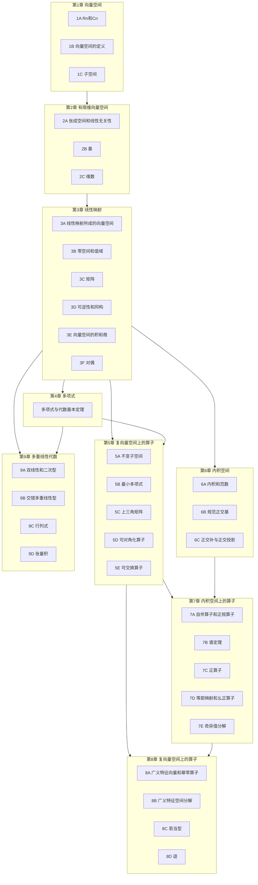

# LADR 全书学习路线规划

> [!abstract] 全书概览
> 《线性代数应该这样学》（Linear Algebra Done Right, 4th Edition）是 Sheldon Axler 的经典教材，以"线性映射"为核心视角重新组织线性代数。全书9章，从向量空间的抽象定义出发，经过线性映射、多项式、内积空间，最终到达谱定理、奇异值分解、若当型和行列式。
>
> **全书逻辑主线**：向量空间（第1-2章）→ 线性映射（第3章）→ 多项式（第4章）→ 算子理论（第5-8章）→ 多重线性代数（第9章）。
>
> **核心思想**：==线性映射是线性代数的灵魂==——矩阵只是线性映射的表示，特征值是理解算子的钥匙，分解定理（对角化、谱定理、SVD、若当型）是全书的高潮。

> [!tip] 导航
> 返回 [[线性代数/index|线性代数知识库总览]]，或按章节进入各章汇总页。

---

## 一、全书知识地图

---

## 二、分阶段学习路线

### 第一阶段：基础（第1-2章）

> [!abstract] 学习目标
> 建立向量空间的抽象思维，掌握子空间、基、维数等核心概念。

| 节 | 核心概念 | 关键定理 |
|---|---|---|
| 1A | $\mathbb{R}^n$ 和 $\mathbb{C}^n$、复数共轭 | 1.1~1.19 |
| 1B | 向量空间的8条公理、列表的例子 | 1.20~1.30 |
| 1C | 子空间、子空间之和、直和 | 1.31~1.43 |
| 2A | 张成空间、线性无关性 | 2.1~2.23 |
| 2B | 基、有限维与无限维 | 2.24~2.35 |
| 2C | 维数、维数的性质 | 2.36~2.43 |

**学习建议**：第1章的重点是理解"向量空间"的抽象定义——不限于 $\mathbb{R}^n$，函数空间、多项式空间都是向量空间。第2章的核心是==基与维数==——有限维空间的一切美好性质都源于"基"的存在。

**与后续的联系**：第1-2章是全书的基石。第3章的线性映射需要基来定义矩阵表示；第5章的特征值需要向量空间的语言；第6章的内积空间是向量空间加上额外结构。

---

### 第二阶段：核心（第3-4章）

> [!abstract] 学习目标
> 掌握线性映射的核心理论，理解矩阵与线性映射的关系，建立多项式工具。

| 节 | 核心概念 | 关键定理 |
|---|---|---|
| 3A | 线性映射的运算、零空间、值域 | 3.1~3.22 |
| 3B | 零空间和值域、基本定理 | 3.1~3.22（续） |
| 3C | 矩阵、矩阵的运算、可逆矩阵 | 3.31~3.72 |
| 3D | 可逆性、同构、维数公式 | 3.73~3.84 |
| 3E | 直和、积空间、商空间 | 3.85~3.114 |
| 3F | 对偶空间、对偶映射、零化子 | 3.115~3.131 |
| 第4章 | 多项式、带余除法、代数基本定理 | 4.1~4.52 |

**学习建议**：第3章是全书最长的章节，核心是==线性映射基本定理==（$\dim \text{null}\, T + \dim \text{range}\, T = \dim V$）。第4章多项式虽然独立，但为第5章的最小多项式和第8章的特征多项式提供基础。

**与后续的联系**：第3章的零空间/值域直接用于第5章的不变子空间和第8章的零空间序列；第3章的矩阵表示是第7章谱定理的基础；第3章的对偶空间与第6章的Riesz表示定理呼应。

---

### 第三阶段：进阶（第5-6章）

> [!abstract] 学习目标
> 掌握特征值理论和对角化，建立内积空间的几何直觉。

| 节 | 核心概念 | 关键定理 |
|---|---|---|
| 5A | 不变子空间、特征值、特征向量 | 5.1~5.38 |
| 5B | 最小多项式、Cauchy插值 | 5.1~5.38（续） |
| 5C | 上三角矩阵、特征值存在性 | 5.13, 5.27 |
| 5D | 可对角化算子、特征空间分解 | 5.20, 5.24, 5.41 |
| 5E | 可交换算子、同时上三角化/对角化 | 5.28, 5.41 |
| 6A | 内积、Cauchy-Schwarz、范数 | 6.2~6.31 |
| 6B | 规范正交基、Gram-Schmidt、Riesz表示 | 6.32~6.55 |
| 6C | 正交补、正交投影、最小距离 | 6.56~6.70 |

**学习建议**：第5章的核心是==特征值与可对角化==——理解为什么复数域上每个算子都有特征值（5.13），以及何时可对角化（5.41）。第6章引入内积，赋予向量空间"长度"和"角度"，Gram-Schmidt正交化是核心工具。

**与后续的联系**：第5章的特征值是第7章谱定理的前身；第6章的内积是第7章自伴算子和SVD的基础。

---

### 第四阶段：高阶（第7-9章）

> [!abstract] 学习目标
> 掌握谱定理、SVD、若当型三大分解定理，理解行列式的本质。

| 节 | 核心概念 | 关键定理 |
|---|---|---|
| 7A | 自伴算子、正规算子 | 7.1~7.28 |
| 7B | 复/实谱定理 | 7.29~7.47 |
| 7C | 正算子、正定矩阵 | 7.43~7.64 |
| 7D | 等距映射、幺正算子、QR/Cholesky分解 | 7.42, 7.49, 7.51, 7.59 |
| 7E | 奇异值分解（SVD） | 7.64~7.80 |
| 8A | 零空间序列、广义特征向量、幂零算子 | 8.1~8.18 |
| 8B | 广义特征空间分解、特征多项式 | 8.19~8.38 |
| 8C | 平方根、若当基、若当型 | 8.39~8.46 |
| 8D | 迹、迹的性质 | 8.47~8.57 |
| 9A | 双线性型、二次型 | 9.1~9.20 |
| 9B | 交错多重线性型 | 9.21~9.33 |
| 9C | 行列式 | 9.34~9.42 |
| 9D | 张量积 | 9.43~ |

**学习建议**：第7章是全书的==理论高潮==——谱定理告诉我们，自伴算子（和正规算子）关于规范正交基有对角矩阵。第7E的SVD是全书最重要的定理之一，适用于任意线性映射。第8章的若当型是算子理论的最完整描述。第9章的行列式用多重线性型的语言定义，揭示了行列式的本质。

---

## 三、各章知识点串讲

### 第1章 向量空间

**一句话总结**：建立向量空间的抽象框架，从 $\mathbb{R}^n$ 到一般向量空间。

| 核心概念 | 说明 |
|---|---|
| 向量空间 | 满足8条公理的集合，元素称为向量 |
| 子空间 | 对加法和标量乘法封闭的子集 |
| 子空间之和 | 两个子空间的并的最小子空间 |
| 直和 | 子空间之和且交集为零，记为 $U_1 \oplus \cdots \oplus U_m$ |

**关键定理**：1.34（子空间之和是子空间）、1.40（直和的等价刻画）、1.43（$\mathbb{F}^n$ 的子空间之和等于 $\mathbb{F}^n$）

**前后联系**：前置无；后续第2章（基与维数）、第3章（线性映射）。

---

### 第2章 有限维向量空间

**一句话总结**：有限维空间的灵魂是"基"——有了基，一切都可以计算。

| 核心概念 | 说明 |
|---|---|
| 张成空间 | 一组向量的所有线性组合 |
| 线性无关 | 没有多余向量的向量组 |
| 基 | 张成空间 = 整个空间的最小线性无关组 |
| 维数 | 基中向量的个数，是空间的不变量 |

**关键定理**：2.10（张成空间的子空间）、2.14（线性无关组的长度限制）、2.23（基的等价刻画）、2.35（维数良定义）、2.43（维数公式）

**前后联系**：前置第1章；后续第3章（矩阵表示需要基）、第5章（维数公式用于特征空间）。

---

### 第3章 线性映射

**一句话总结**：线性映射是线性代数的核心对象，矩阵只是它在基下的表示。

| 核心概念 | 说明 |
|---|---|
| 线性映射 | 保持加法和标量乘法的函数 |
| 零空间 | 映射到0的向量集合 |
| 值域 | 映射的像 |
| 矩阵表示 | 线性映射关于基的矩阵 |
| 可逆映射 | 有逆映射的线性映射 |
| 对偶空间 | 从V到F的所有线性映射 |
| 商空间 | 模掉子空间后的等价类空间 |

**关键定理**：3.14（零空间是子空间）、3.20（值域是子空间）、==3.22（基本定理：$\dim \text{null}\, T + \dim \text{range}\, T = \dim V$）==、3.69（可逆等价条件）、3.84（换基公式）、3.106（商空间的维数）、3.129（零化子）

**前后联系**：前置第1-2章；后续第5章（不变子空间）、第6章（Riesz表示）、第7章（矩阵表示）、第8章（零空间序列）、第9章（对偶）。

---

### 第4章 多项式

**一句话总结**：多项式是连接线性映射与算子理论的桥梁。

| 核心概念 | 说明 |
|---|---|
| 多项式 | $a_0 + a_1 z + \cdots + a_m z^m$ |
| 多项式的次数 | 最高次非零项的次数 |
| 带余除法 | $p = sq + r$，$\deg r < \deg s$ |
| 代数基本定理 | 每个非常数复系数多项式在C上有零点 |
| C上因式分解 | 每个多项式可分解为一次因式之积 |
| R上因式分解 | 每个多项式可分解为一次和二次因式之积 |

**关键定理**：4.8（带余除法）、4.14（代数基本定理）、4.16（C上因式分解）、4.24（互素多项式）、4.29（R上因式分解）

**前后联系**：前置第1-2章；后续第5章（最小多项式）、第8章（特征多项式）。

---

### 第5章 复向量空间上的算子

**一句话总结**：特征值是理解算子的钥匙——它告诉我们算子在哪些方向上"只是拉伸"。

| 核心概念 | 说明 |
|---|---|
| 不变子空间 | 算子映射到自身的子空间 |
| 特征值与特征向量 | $Tv = \lambda v$，$\lambda$ 是特征值 |
| 上三角矩阵 | 关于某基，算子的矩阵为上三角 |
| 可对角化 | 关于某基，算子的矩阵为对角矩阵 |
| 最小多项式 | 使 $p(T) = 0$ 的最低次首一多项式 |
| 可交换算子 | $ST = TS$ |

**关键定理**：==5.13（C上每个算子都有特征值）==、5.22（上三角矩阵的对角线元素是特征值）、==5.27（可对角化 ⟺ 最小多项式无重根）==、5.28（可交换算子有公共特征向量）、5.41（同时可对角化 ⟺ 可交换且各自可对角化）

**前后联系**：前置第3-4章；后续第6章（内积空间上的算子）、第7章（谱定理推广）、第8章（广义特征向量推广特征向量）。

---

### 第6章 内积空间

**一句话总结**：内积赋予向量空间"长度"和"角度"，使几何直觉可用于抽象空间。

| 核心概念 | 说明 |
|---|---|
| 内积 | 满足对称性、线性性、正定性的二元函数 |
| Cauchy-Schwarz不等式 | $|\langle u, v \rangle| \leq \|u\|\|v\|$ |
| 规范正交基 | 两两正交且长度为1的基 |
| Gram-Schmidt正交化 | 从任意基构造规范正交基 |
| Riesz表示定理 | 每个线性泛函都是与某向量的内积 |
| 正交补 | $U^\perp = \{v : \langle v, u \rangle = 0, \forall u \in U\}$ |
| 正交投影 | 到子空间的最优逼近 |

**关键定理**：==6.10（Cauchy-Schwarz不等式）==、6.31（Parseval等式）、==6.35（Gram-Schmidt）==、==6.42（Riesz表示）==、6.45（正交补的维数）、6.47（正交分解）、6.56（正交投影的最小距离性质）

**前后联系**：前置第1-3章；后续第7章（自伴算子、谱定理、SVD）。

---

### 第7章 内积空间上的算子

**一句话总结**：谱定理、SVD和若当型是全书的理论高潮——它们揭示了算子的深层结构。

| 核心概念 | 说明 |
|---|---|
| 自伴算子 | $T^* = T$，实数域上的"对称矩阵" |
| 正规算子 | $TT^* = T^*T$，包含自伴和幺正 |
| 谱定理 | 自伴/正规算子关于规范正交基可对角化 |
| 正算子 | $\langle Tv, v \rangle \geq 0$ |
| 等距映射 | $\|Tv\| = \|v\|$，保持长度 |
| 幺正算子 | 可逆的等距映射 |
| 奇异值分解 | $Tv = \sum s_k \langle v, e_k \rangle f_k$ |

**关键定理**：7.5（自伴 ⟺ 对角线元素为实）、7.15（正规 ⟺ 关于规范正交基可对角化）、==7.29/7.35（复/实谱定理）==、==7.70（SVD定理）==、7.75（伴随和伪逆的SVD）、7.80（矩阵SVD）

**前后联系**：前置第5-6章；后续第8章（广义特征空间分解推广谱定理）。

---

### 第8章 复向量空间上的算子

**一句话总结**：当算子不可对角化时，若当型给出最完整的描述。

| 核心概念 | 说明 |
|---|---|
| 零空间序列 | $\text{null}\, T \subseteq \text{null}\, T^2 \subseteq \cdots$ |
| 广义特征向量 | $(T - \lambda I)^k v = 0$ 的非零向量 |
| 幂零算子 | $T^m = 0$ 的算子 |
| 广义特征空间分解 | $V = G(\lambda_1, T) \oplus \cdots \oplus G(\lambda_m, T)$ |
| 特征多项式 | $\det(zI - T)$，根为特征值 |
| 若当基 | 使幂零算子有若当矩阵的基 |
| 若当型 | 每个算子关于若当基的矩阵 |
| 迹 | 矩阵对角线元素之和，等于特征值之和 |

**关键定理**：8.3（零空间停止增长）、8.9（广义特征向量构成基）、==8.22（广义特征空间分解）==、8.29（特征多项式的零点重数=特征值重数）、==8.45（每个幂零算子都有若当基）==、==8.46（若当型定理）==、8.52（迹=特征值之和）

**前后联系**：前置第5、7章；后续第9章（行列式）。

---

### 第9章 多重线性代数和行列式

**一句话总结**：行列式不是"竖式计算"，而是多重线性型的自然产物。

| 核心概念 | 说明 |
|---|---|
| 双线性型 | 两个变量都线性的函数 |
| 二次型 | $q(v) = B(v, v)$ |
| 交错多重线性型 | 交换任意两个变量变号 |
| 行列式 | 唯一的n次交错多重线性型 |
| 张量积 | 两个向量空间的"乘积"空间 |

**关键定理**：9.8（正定双线性型）、9.24（行列式的存在唯一性）、==9.36（行列式的乘法公式）==、9.38（行列式为0 ⟺ 不可逆）

**前后联系**：前置第3-4章；无后续。

---

## 四、跨章核心线索

### 线性结构：贯穿全书的统一视角

从第1章的向量空间（加法+标量乘法），到第3章的线性映射（保持线性结构），到第6章的内积（额外的"几何"结构），到第9章的双线性型（两个变量的线性结构）。==线性==是全书的核心形容词。

### 基与坐标：抽象与具体的桥梁

第2章引入基的概念 → 第3章用基定义矩阵表示 → 第5章用基判断可对角化 → 第6章用规范正交基简化一切计算 → 第8章用若当基得到最简矩阵。==选对基，一切变简单==。

### 对偶性：空间与泛函的镜像

第3章引入对偶空间 $V'$ → 第3章的零化子 $U^0$ → 第6章的Riesz表示定理（$V' \cong V$）→ 第7章的伴随算子 $T^*$ → 第9章的张量积 $V \otimes W$。对偶性是理解线性代数深层结构的钥匙。

### 谱理论：算子结构的终极揭示

第5章：特征值 → 第7章：谱定理（自伴/正规算子的完美对角化）→ 第8章：广义特征空间分解（任意算子的"准对角化"）→ 第8章：若当型（最完整的矩阵描述）。==谱理论是算子理论的皇冠==。

### 分解定理：全书的理论高潮

| 分解 | 章节 | 适用范围 | 核心思想 |
|---|---|---|---|
| 特征空间分解 | 5D | 可对角化算子 | $V = E(\lambda_1, T) \oplus \cdots$ |
| 谱定理 | 7B | 自伴/正规算子 | 关于规范正交基可对角化 |
| SVD | 7E | 任意线性映射 | $Tv = \sum s_k \langle v, e_k \rangle f_k$ |
| 广义特征空间分解 | 8B | C上任意算子 | $V = G(\lambda_1, T) \oplus \cdots$ |
| 若当型 | 8C | C上任意算子 | 最简矩阵表示 |

---

## 五、学习方法论与建议

> [!success] 学习策略
> 1. **先理解概念，再记忆公式**：LADR 强调概念理解而非计算技巧。每个定义都有其动机，每个定理都有其直觉。
> 2. **善用反例**：理解一个定理的最好方式是找到不满足条件时的反例。例如，为什么实数域上不是每个算子都有特征值？（考虑 $\mathbb{R}^2$ 上的旋转。）
> 3. **画图辅助理解**：第6-7章的几何内容（正交投影、谱定理的几何意义、SVD的椭球解释）尤其适合画图。
> 4. **做习题**：每节习题是理解深度的保障。至少完成每节的前5题。
> 5. **回顾总结**：每学完一章，回顾章节汇总（[[第1章 向量空间 — 章节汇总]] 等），梳理知识脉络。

> [!warning] 常见误区
> 1. **混淆矩阵与线性映射**：矩阵是线性映射关于特定基的表示，换基后矩阵会变，但映射本身不变。
> 2. **忽视域的选择**：$\mathbb{R}$ 和 $\mathbb{C}$ 上的结论可能不同。例如，特征值存在性（5.13）仅在 $\mathbb{C}$ 上成立。
> 3. **跳过第4章（多项式）**：多项式看似无关，但最小多项式（5B）和特征多项式（8B）都依赖它。
> 4. **认为SVD只适用于方阵**：SVD适用于任意 $p \times n$ 矩阵，这正是它比特征值分解更强大的原因。
> 5. **混淆特征值与奇异值**：奇异值是 $T^*T$ 特征值的平方根，不是 $T$ 本身的特征值。

> [!tip] 推荐学习顺序
> 1. 第1-2章（基础）→ 第3章前半（3A-3D，核心映射理论）
> 2. 第4章（多项式）→ 第5章（算子理论入门）
> 3. 第3章后半（3E-3F，积/商/对偶）→ 第6章（内积空间）
> 4. 第7章（谱定理、SVD）→ 第8章（若当型）
> 5. 第9章（行列式、张量积）→ 全书回顾

---

## 六、全书笔记索引

### 第1章 向量空间

| 节 | 笔记 | 核心主题 |
|---|---|---|
| 1A | [[1A Rⁿ 和 Cⁿ]] | $\mathbb{R}^n$ 和 $\mathbb{C}^n$、复数共轭 |
| 1B | [[1B 向量空间的定义]] | 向量空间的8条公理 |
| 1C | [[1C 子空间]] | 子空间、子空间之和、直和 |
| 汇总 | [[第1章 向量空间 — 章节汇总]] | 全章复习 |

### 第2章 有限维向量空间

| 节 | 笔记 | 核心主题 |
|---|---|---|
| 2A | [[2A 张成空间和线性无关性]] | 张成空间、线性无关 |
| 2B | [[2B 基]] | 基、有限维与无限维 |
| 2C | [[2C 维数]] | 维数、维数公式 |
| 汇总 | [[第2章 有限维向量空间 — 章节汇总]] | 全章复习 |

### 第3章 线性映射

| 节 | 笔记 | 核心主题 |
|---|---|---|
| 3A | [[3A 线性映射所成的向量空间]] | 线性映射的定义和运算 |
| 3B | [[3B 零空间和值域]] | 基本定理 |
| 3C | [[3C 矩阵]] | 矩阵表示、矩阵运算 |
| 3D | [[3D 可逆性和同构]] | 可逆映射、同构 |
| 3E | [[3E 向量空间的积和商]] | 直和、积空间、商空间 |
| 3F | [[3F 对偶]] | 对偶空间、零化子 |
| 汇总 | [[第3章 线性映射 — 章节汇总]] | 全章复习 |

### 第4章 多项式

| 节 | 笔记 | 核心主题 |
|---|---|---|
| — | [[第4章 多项式]] | 多项式、带余除法、代数基本定理 |
| 汇总 | [[第4章 多项式 — 章节汇总]] | 全章复习 |

### 第5章 复向量空间上的算子

| 节 | 笔记 | 核心主题 |
|---|---|---|
| 5A | [[5A 不变子空间、特征值和特征向量]] | 不变子空间、特征值 |
| 5B | [[5B 最小多项式]] | 最小多项式、Cauchy插值 |
| 5C | [[5C 上三角矩阵]] | 上三角矩阵、特征值存在性 |
| 5D | [[5D 可对角化算子]] | 可对角化、特征空间分解 |
| 5E | [[5E 可交换算子]] | 同时上三角化/对角化 |
| 汇总 | [[第5章 复向量空间上的算子 — 章节汇总]] | 全章复习 |

### 第6章 内积空间

| 节 | 笔记 | 核心主题 |
|---|---|---|
| 6A | [[6A 内积和范数]] | 内积、Cauchy-Schwarz |
| 6B | [[6B 规范正交基]] | Gram-Schmidt、Riesz表示 |
| 6C | [[6C 正交补和正交投影]] | 正交补、正交投影 |
| 汇总 | [[第6章 内积空间 — 章节汇总]] | 全章复习 |

### 第7章 内积空间上的算子

| 节 | 笔记 | 核心主题 |
|---|---|---|
| 7A | [[7A 自伴算子和正规算子]] | 自伴算子、正规算子 |
| 7B | [[7B 谱定理]] | 复/实谱定理 |
| 7C | [[7C 正算子]] | 正算子、正定矩阵 |
| 7D | [[7D 等距映射、幺正算子和矩阵分解]] | 等距映射、QR/Cholesky分解 |
| 7E | [[7E 奇异值分解与推论]] | SVD定理 |
| 汇总 | [[第7章 内积空间上的算子 — 章节汇总]] | 全章复习 |

### 第8章 复向量空间上的算子

| 节 | 笔记 | 核心主题 |
|---|---|---|
| 8A | [[8A 广义特征向量和幂零算子]] | 零空间序列、幂零算子 |
| 8B | [[8B 广义特征空间分解]] | 广义特征空间分解、特征多项式 |
| 8C | [[8C 广义特征空间分解的推论]] | 若当基、若当型 |
| 8D | [[8D 联系矩阵与算子的桥梁——迹]] | 迹、迹的性质 |
| 汇总 | [[第8章 复向量空间上的算子 — 章节汇总]] | 全章复习 |

### 第9章 多重线性代数和行列式

| 节 | 笔记 | 核心主题 |
|---|---|---|
| 9A | [[9A 双线性和二次型]] | 双线性型、二次型 |
| 9B | [[9B 交错多重线性型]] | 交错多重线性型 |
| 9C | [[9C 行列式]] | 行列式的定义和性质 |
| 9D | [[9D 张量积]] | 张量积 |
| 汇总 | [[第9章 多重线性代数和行列式 — 章节汇总]] | 全章复习 |

#学习/线性代数/全书学习路线
