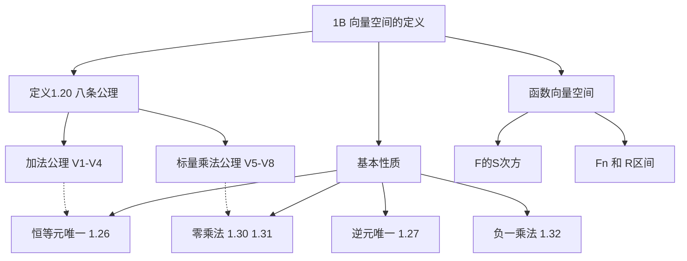

# 1B 向量空间的定义

> [!abstract] 本节概览
> 本节给出==向量空间==的公理化定义（定义 1.20），引入==函数向量空间 $\mathbb{F}^S$== 作为统一框架，并证明向量空间的若干基本性质（恒等元唯一性、逆元唯一性、与零的乘法等）。
>
> **逻辑链条**：八条公理定义 → $\mathbb{F}^S$ 例子验证 → 基本性质推导（唯一性 + 零乘法）
>
> **前置依赖**：[[1A Rⁿ 和 Cⁿ]]（$\mathbb{F}^n$ 的加法和标量乘法）
>
> **核心主线**：从具体的 $\mathbb{F}^n$ 到抽象的向量空间——理解公理化方法的力量

---

## 一、向量空间的定义

> [!def] 定义 1.20 向量空间
> 设 $\mathbb{F}$ 是域（$\mathbb{R}$ 或 $\mathbb{C}$）。**向量空间**是集合 $V$ 连同两个运算：
> - **加法** $+ : V \times V \to V$，将 $(u, v)$ 映射为 $u + v \in V$
> - **标量乘法** $\cdot : \mathbb{F} \times V \to V$，将 $(a, v)$ 映射为 $av \in V$
>
> 满足以下八条公理：

| 编号 | 公理名称 | 数学表述 |
|:---:|---|---|
| **V1** | 加法交换律 | $u + v = v + u$，对所有 $u, v \in V$ |
| **V2** | 加法结合律 | $(u + v) + w = u + (v + w)$，对所有 $u, v, w \in V$ |
| **V3** | 加法恒等元 | 存在 $0 \in V$，使得 $v + 0 = v$，对所有 $v \in V$ |
| **V4** | 加法逆元 | 对每个 $v \in V$，存在 $w \in V$，使得 $v + w = 0$ |
| **V5** | 标量乘法结合律 | $a(bv) = (ab)v$，对所有 $a, b \in \mathbb{F}$，$v \in V$ |
| **V6** | 标量乘法单位律 | $1v = v$，对所有 $v \in V$ |
| **V7** | 标量对加法的分配律 | $a(u + v) = au + av$，对所有 $a \in \mathbb{F}$，$u, v \in V$ |
| **V8** | 向量对加法的分配律 | $(a + b)v = av + bv$，对所有 $a, b \in \mathbb{F}$，$v \in V$ |

> [!important] 八条公理缺一不可
> 这八条公理是向量空间的"宪法"——所有后续定理都只能从这八条出发推导，不能使用任何额外的"直觉"假设。这正是==公理化方法==的核心思想。

> [!example] 验证：$\mathbb{F}^n$ 是向量空间
> 在 [[1A Rⁿ 和 Cⁿ]] 中定义的 $\mathbb{F}^n$ 上的加法和标量乘法满足全部八条公理：
> - V1~V2：由 $\mathbb{F}$ 中加法的交换律和结合律直接推出
> - V3：$0 = (0, \ldots, 0)$
> - V4：$-v = (-v_1, \ldots, -v_n)$
> - V5~V8：由 $\mathbb{F}$ 中乘法和加法的性质直接推出

---

## 二、函数向量空间 $\mathbb{F}^S$

> [!def] 定义 函数向量空间 $\mathbb{F}^S$
> 设 $S$ 是集合，$\mathbb{F}^S$ 表示从 $S$ 到 $\mathbb{F}$ 的所有函数构成的集合。在 $\mathbb{F}^S$ 上定义：
> - **加法**：$(f + g)(x) = f(x) + g(x)$，对所有 $x \in S$
> - **标量乘法**：$(af)(x) = a \cdot f(x)$，对所有 $x \in S$
>
> 则 $\mathbb{F}^S$ 是 $\mathbb{F}$ 上的向量空间。

### $\mathbb{F}^S$ 的特例

| 向量空间 | 集合 $S$ | 元素是什么 |
|---|---|---|
| $\mathbb{F}^n$ | $\{1, 2, \ldots, n\}$ | $n$ 元组 $(x_1, \ldots, x_n)$ |
| $\mathbb{F}^\infty$ | $\{1, 2, \ldots\}$ | 无穷序列 $(x_1, x_2, \ldots)$ |
| $\mathbb{R}^{[0,1]}$ | $[0, 1]$ | 区间上的实值函数 |

> [!note] 向量不一定是"箭头"
> 向量空间的元素==不一定是几何意义上的"箭头"==。在 $\mathbb{R}^{[0,1]}$ 中，每个"向量"是一个函数（如 $f(x) = x^2$）。公理化定义的强大之处在于：只要满足八条公理，==任何对象都可以是"向量"==——函数、多项式、矩阵、数列，甚至更抽象的数学对象。

---

## 三、向量空间的基本性质

> [!thm] 定理 1.26 加法恒等元唯一
> 向量空间有唯一的加法恒等元。

> [!abstract] 证明思路
> **[双重恒等元论证]**：设 $0$ 和 $0'$ 都是加法恒等元。
> $$0' = 0' + 0 = 0 + 0' = 0$$
> 第一个等号用 $0$ 是恒等元，第二个用交换律 V1，第三个用 $0'$ 是恒等元。故 $0' = 0$。 $\blacksquare$

> [!thm] 定理 1.27 加法逆元唯一
> 向量空间里的每个元素都有唯一的加法逆元。

> [!abstract] 证明思路
> **[逆元唯一性]**：设 $w$ 和 $w'$ 都是 $v$ 的加法逆元。
> $$w = w + 0 = w + (v + w') = (w + v) + w' = 0 + w' = w'$$
> 第一步加 $0$，第二步用 $w'$ 是 $v$ 的逆元，第三步用结合律 V2，第四步用 $w$ 是 $v$ 的逆元。故 $w = w'$。 $\blacksquare$

> [!thm] 记号 1.28 $-v$ 与 $w - v$
> - $-v$ 表示 $v$ 的（唯一的）加法逆元
> - $w - v$ 定义为 $w + (-v)$

> [!thm] 定理 1.30 向量与数 $0$ 相乘
> 对于每个 $v \in V$，都有 $0v = 0$。

> [!abstract] 证明思路
> **[分配律 + 逆元]**：
> $$0v = (0 + 0)v = 0v + 0v$$
> 两边加上 $0v$ 的加法逆元即得 $0 = 0v$。 $\blacksquare$

> [!warning] 注意符号歧义
> 等式左侧的 $0$ 是标量（数 $0 \in \mathbb{F}$），右侧的 $0$ 是向量（$V$ 的加法恒等元）。它们是不同对象，只是习惯上用相同符号表示。

> [!thm] 定理 1.31 数与向量 $0$ 相乘
> 对于每个 $a \in \mathbb{F}$，都有 $a0 = 0$。

> [!abstract] 证明思路
> **[分配律 + 逆元]**：
> $$a0 = a(0 + 0) = a0 + a0$$
> 两边加上 $a0$ 的加法逆元即得 $0 = a0$。 $\blacksquare$

> [!thm] 定理 1.32 向量与数 $-1$ 相乘
> 对于每个 $v \in V$，都有 $(-1)v = -v$。

> [!abstract] 证明思路
> **[分配律 + 已有定理]**：
> $$v + (-1)v = 1v + (-1)v = (1 + (-1))v = 0v = 0$$
> 这说明 $(-1)v$ 加上 $v$ 得到 $0$，因此 $(-1)v$ 就是 $v$ 的加法逆元 $-v$。 $\blacksquare$

---

## 四、知识结构总览

---

## 五、核心思想与证明技巧

> [!success] 公理化方法的力量
> 向量空间的定义是数学中==公理化方法==的经典范例。我们不再局限于"箭头"或"数组"的具体形象，而是抽象出八条最基本的性质作为公理。只要满足这八条，任何对象都可以成为"向量"，任何空间都可以成为"向量空间"。这使得一套理论可以同时应用于几何、分析、代数、概率等众多领域。

> [!tip] 证明技巧清单
> 1. **恒等元唯一性证明**：设两个候选恒等元，利用它们各自的恒等元性质和交换律证明它们相等
> 2. **逆元唯一性证明**：设两个候选逆元，利用结合律将它们"合流"到同一个表达式
> 3. **零乘法证明**：关键技巧是将 $0$ 写成 $0 + 0$，然后利用分配律产生"重复项"，再加逆元消去
> 4. **符号区分**：始终注意区分标量 $0 \in \mathbb{F}$ 和向量 $0 \in V$，它们在不同公理中扮演不同角色

---

## 六、补充理解与易混淆点

### 6.1 八条公理的直觉解读

| 公理 | 直觉含义 | 几何类比 |
|---|---|---|
| V1 交换律 | 加法顺序无关紧要 | 向东走再向北走 = 向北走再向东走 |
| V2 结合律 | 多个向量相加时括号位置无关 | 三段路程的总位移与分段方式无关 |
| V3 恒等元 | 存在"什么都不做"的元素 | 原点 $O$：$v + O = v$ |
| V4 逆元 | 每个运动都有"反向运动" | 向前走 $v$，再走 $-v$ 回到原点 |
| V5 乘法结合律 | 连续缩放的顺序无关紧要 | 放大 2 倍再放大 3 倍 = 放大 6 倍 |
| V6 单位律 | 数 1 是"不缩放" | 乘以 1 不改变向量 |
| V7 标量分配律 | 先加后乘 = 分别乘再相加 | $(a+b)v$：将 $v$ 拉伸 $a$ 倍和 $b$ 倍后拼接 |
| V8 向量分配律 | 先乘后加 = 分别乘再相加 | $a(u+v)$：将 $u+v$ 整体拉伸 $a$ 倍 |

**来源**：Ximera (OSU) Definition of a vector space 讲义、Western Oregon University Vector Spaces Fundamentals 讲义。

### 6.2 为什么向量不一定是"箭头"

许多初学者认为向量必须是"有方向和大小的箭头"。这种直觉来自物理中的力和速度，但在数学中，==向量空间的元素可以是任何满足八条公理的对象==：

- **多项式**：所有次数 $\leq n$ 的多项式构成向量空间（加法 = 多项式加法，数乘 = 系数乘法）
- **函数**：连续函数 $C[0,1]$ 构成向量空间
- **矩阵**：所有 $m \times n$ 矩阵构成向量空间
- **数列**：所有收敛数列构成向量空间
- **信号**：离散时间信号（如音频采样）构成向量空间

有限维向量空间都与 $\mathbb{F}^n$ 同构，因此几何直觉可以迁移。但无限维空间（如函数空间）则展现出全新的结构。

**来源**：CSDN 博客"抽象向量空间：超越箭头的世界"、CSDN 博客"向量空间与函数空间的类比分析"。

### 6.3 常见误区

> [!danger] 误区1：向量空间的元素必须是"数组"
> ❌ 错误认知：向量就是一列数字 $(v_1, v_2, \ldots, v_n)$
> ✅ 正确理解：数组只是向量的一种具体表示。向量空间的定义完全不涉及"坐标"或"分量"——只要满足八条公理，函数、多项式、矩阵都可以是向量。$\mathbb{F}^S$ 的定义明确展示了这一点

> [!danger] 误区2：验证向量空间时不需要检查封闭性
> ❌ 错误认知：只要八条公理成立，就是向量空间
> ✅ 正确理解：八条公理的前提是加法和标量乘法必须封闭——即 $u + v \in V$ 和 $av \in V$ 对所有合法输入都成立。封闭性不是八条公理之一，而是定义向量空间运算时的隐含要求

> [!danger] 误区3：标量 $0$ 和向量 $0$ 是同一个东西
> ❌ 错误认知：等式 $0v = 0$ 两边的 $0$ 是同一个对象
> ✅ 正确理解：左边的 $0$ 是域 $\mathbb{F}$ 中的数零（标量），右边的 $0$ 是 $V$ 中的加法恒等元（向量）。它们生活在不同的集合中，只是数学上习惯用相同的符号。类似地，$a0 = 0$ 中的两个 $0$ 也分别是标量和向量

> [!danger] 误区4：向量空间定义中的八条公理有冗余
> ❌ 错误认知：八条公理中有一些可以从其他公理推出，可以减少
> ✅ 正确理解：八条公理是相互独立的（在某种严格意义上），每一条都不可省略。不过，如果将加法逆元条件替换为 "$0v = 0$ 对所有 $v$ 成立"，则定义等价（见习题 5）

**来源**：Fiveable Abstract Linear Algebra 学习指南、Pitzer College RUME 研究论文"Commonly Identified Students' Misconceptions about Vectors"、Northeastern University Linear Algebra 讲义。

---

## 七、习题精选

> [!todo] 本节习题
>
> | 编号 | 标题 | 核心考点 | 难度 |
> |:---:|---|---|:---:|
> | 1 | 加法逆元的逆元 | 逆元的唯一性与运算 | ⭐ |
> | 2 | 零因子性质 | 标量乘法与零的关系 | ⭐⭐ |
> | 3 | 线性方程求解 | 向量空间中的存在唯一性 | ⭐⭐ |
> | 5 | 公理等价替换 | 加法逆元条件与 $0v=0$ 的等价性 | ⭐⭐⭐ |

### 习题 1：加法逆元的逆元

> [!problem] 习题 1
> 证明：$-(-v) = v$ 对任一 $v \in V$ 都成立。

> [!faq]- 查看解答
> **证明**：由定义，$-v$ 是 $v$ 的加法逆元，即 $v + (-v) = 0$。
>
> 这说明 $v$ 是 $-v$ 的加法逆元。由定理 1.27（加法逆元唯一），$-v$ 的加法逆元只有一个，即 $-(-v)$。因此 $-(-v) = v$。 $\blacksquare$

### 习题 2：零因子性质

> [!problem] 习题 2
> 设 $a \in \mathbb{F}$，$v \in V$ 且 $av = 0$。证明：$a = 0$ 或 $v = 0$。

> [!faq]- 查看解答
> **证明**：假设 $a \neq 0$，我们需要证明 $v = 0$。
>
> 因为 $a \neq 0$，所以 $a$ 在 $\mathbb{F}$ 中有乘法逆元 $a^{-1}$。于是：
> $$v = 1v = (a^{-1}a)v = a^{-1}(av) = a^{-1} \cdot 0 = 0$$
> 其中第一步用 V6，第二步用 $\mathbb{F}$ 中乘法结合律，第三步用 V5，第四步用已知 $av = 0$，第五步用定理 1.31。$\blacksquare$

### 习题 3：线性方程求解

> [!problem] 习题 3
> 设 $v, w \in V$，解释为什么存在唯一的 $x \in V$ 使得 $v + 3x = w$。

> [!faq]- 查看解答
> **解**：将方程改写为 $3x = w - v$，再两边乘以 $\frac{1}{3}$（即 $3$ 在 $\mathbb{F}$ 中的乘法逆元）：
> $$x = \frac{1}{3}(w - v)$$
>
> 这个 $x$ 满足原方程（代入验证即可），且由习题 2 的零因子性质，解是唯一的。$\blacksquare$

### 习题 5：公理等价替换

> [!problem] 习题 5
> 证明：在向量空间的定义（1.20）中，加法逆元条件（V4）可以替换成——$0v = 0$ 对所有 $v \in V$ 成立。

> [!faq]- 查看解答
> **证明**：需要证明两个方向。
>
> **方向一**：原定义 $\Rightarrow$ 新条件。即从 V1~V8 推出 $0v = 0$。这就是定理 1.30，已证。
>
> **方向二**：新条件 $\Rightarrow$ 原定义。即假设 V1~V3、V5~V8 和 "$0v = 0$ 对所有 $v$"，证明 V4（加法逆元存在）。
>
> 对任意 $v \in V$，令 $w = (-1)v$。则：
> $$v + w = v + (-1)v = 1v + (-1)v = (1 + (-1))v = 0v = 0$$
> 因此 $w = (-1)v$ 就是 $v$ 的加法逆元。$\blacksquare$

---

## 八、视频学习指南

> [!info] 视频资源
>
> | 视频主题 | 对应笔记模块 | 平台 |
> |---|---|---|
> | 向量空间的八条公理 | 一、向量空间的定义 | B站 |
> | 抽象向量空间与函数空间 | 二、函数向量空间 $\mathbb{F}^S$ | B站 |
> | 向量空间基本性质证明 | 三、向量空间的基本性质 | B站 |

> [!info] 视频精要
> 暂无对应视频的详细精要。建议在学习时关注以下要点：
> - 理解每条公理"为什么需要"（给出缺少该公理的反例）
> - 体会从 $\mathbb{F}^n$ 到 $\mathbb{F}^S$ 的推广过程
> - 掌握"分配律 + 逆元消去"的证明模板（定理 1.30/1.31）

---

## 九、教材原文
#学习/线性代数/向量空间/向量空间的定义
