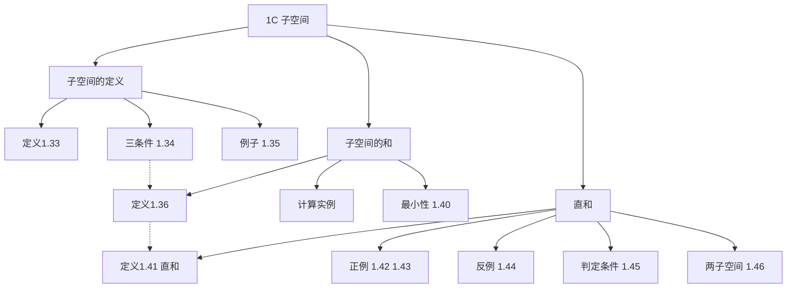

# 1C 子空间

> [!abstract] 本节概览
> 本节引入==子空间==的概念——向量空间中"自洽"的子集，并研究子空间的两种组合方式：==子空间的和==与==直和==。
>
> **逻辑链条**：子空间定义（三条件）→ 子空间的和（最小包含）→ 直和（唯一表示）
>
> **前置依赖**：[[1B 向量空间的定义]]（向量空间的八条公理）、[[1A Rⁿ 和 Cⁿ]]（$\mathbb{F}^n$ 的具体例子）
>
> **核心主线**：从"一个向量空间"到"向量空间的子结构"——子空间是理解线性代数整体架构的关键

---

## 一、子空间的定义

> [!def] 定义 1.33 子空间
> 如果 $V$ 的子集 $U$ 是与 $V$ 具有相同的加法恒等元、加法和标量乘法运算的向量空间，那么 $U$ 就称为 $V$ 的==子空间==。

> [!thm] 定理 1.34 子空间的条件
> 当且仅当 $V$ 的子集 $U$ 满足以下三个条件时，$U$ 是 $V$ 的子空间：
> 1. **加法恒等元**：$0 \in U$
> 2. **对加法封闭**：$u, w \in U$ 意味着 $u + w \in U$
> 3. **对标量乘法封闭**：$a \in \mathbb{F}$ 且 $u \in U$ 意味着 $au \in U$

> [!abstract] 证明思路
> **[必要性]**：如果 $U$ 是子空间，由向量空间定义直接得到三个条件。
>
> **[充分性]**：假设三条件成立。条件 1 保证 $V$ 的加法恒等元在 $U$ 中。条件 2 保证加法在 $U$ 上有意义。条件 3 保证标量乘法在 $U$ 上有意义。由条件 3 和定理 1.32，$-u = (-1)u \in U$，所以每个元素都有逆元。==八条公理中其余部分自动继承==自 $V$（因为它们在更大的空间中成立）。$\blacksquare$

> [!tip] 实用技巧
> 验证三条件时，通常==先验证 $0 \in U$==（最快的方法是取 $U$ 中的特殊元素或乘以 $0$）。如果 $0 \notin U$，直接判定不是子空间，无需继续。

### 例 1.35 子空间举例

> [!example] (a) $\mathbb{F}^4$ 中的条件子空间
> 当且仅当 $b = 0$ 时，$\{(x_1, x_2, x_3, x_4) \in \mathbb{F}^4 : x_3 = 5x_4 + b\}$ 是 $\mathbb{F}^4$ 的子空间。
>
> **验证**：$b = 0$ 时，$0 = (0,0,0,0)$ 满足 $0 = 5 \cdot 0$。加法和标量乘法的封闭性由线性条件保证。$b \neq 0$ 时，$(0,0,0,0)$ 不满足条件，故不是子空间。

> [!example] (b) 连续函数构成子空间
> 定义在 $[0,1]$ 上的全体连续实值函数构成 $\mathbb{R}^{[0,1]}$ 的子空间。
>
> **关键事实**：两个连续函数的和是连续的，连续函数的常数倍也是连续的。

> [!example] (c) 可微函数构成子空间
> 定义在 $\mathbb{R}$ 上的全体可微实值函数构成 $\mathbb{R}^{\mathbb{R}}$ 的子空间。

> [!example] (d) 边界条件子空间
> 当且仅当 $b = 0$ 时，定义在 $(0,3)$ 上且满足 $f'(2) = b$ 的全体可微函数构成 $\mathbb{R}^{(0,3)}$ 的子空间。

> [!example] (e) 极限为零的序列
> 极限为 $0$ 的所有复数序列构成 $\mathbb{C}^\infty$ 的子空间。

> [!important] $\mathbb{R}^2$ 和 $\mathbb{R}^3$ 的子空间
> - $\mathbb{R}^2$ 的子空间恰有：$\{0\}$、过原点的所有直线、$\mathbb{R}^2$ 本身
> - $\mathbb{R}^3$ 的子空间恰有：$\{0\}$、过原点的所有直线、过原点的所有平面、$\mathbb{R}^3$ 本身
>
> ==子空间必须过原点==——这是几何直觉的核心

---

## 二、子空间的和

> [!def] 定义 1.36 子空间的和
> 假设 $V_1, \ldots, V_m$ 是 $V$ 的子空间。它们的==和==定义为：
> $$V_1 + \cdots + V_m = \{v_1 + \cdots + v_m : v_1 \in V_1, \ldots, v_m \in V_m\}$$

> [!example] 例 1.37 $\mathbb{F}^3$ 的子空间之和
> 设 $U = \{(x, 0, 0) \in \mathbb{F}^3 : x \in \mathbb{F}\}$，$W = \{(0, y, 0) \in \mathbb{F}^3 : y \in \mathbb{F}\}$。
> 则 $U + W = \{(x, y, 0) \in \mathbb{F}^3 : x, y \in \mathbb{F}\}$（$xy$-平面）。

> [!example] 例 1.38 $\mathbb{F}^4$ 的子空间之和
> 设 $U = \{(x, x, y, y) \in \mathbb{F}^4 : x, y \in \mathbb{F}\}$，$W = \{(x, x, x, y) \in \mathbb{F}^4 : x, y \in \mathbb{F}\}$。
> 则 $U + W = \{(x, x, y, z) \in \mathbb{F}^4 : x, y, z \in \mathbb{F}\}$（前两个坐标相等的所有向量）。

> [!thm] 定理 1.40 子空间的和是最小包含子空间
> $V_1 + \cdots + V_m$ 是最小的包含 $V_1, \ldots, V_m$ 的子空间。

> [!abstract] 证明思路
> **[三条件验证 + 最小性]**：
> 1. $0 = 0 + \cdots + 0 \in V_1 + \cdots + V_m$
> 2. 加法封闭：$(v_1 + \cdots + v_m) + (u_1 + \cdots + u_m) = (v_1 + u_1) + \cdots + (v_m + u_m)$
> 3. 标量乘法封闭：$a(v_1 + \cdots + v_m) = av_1 + \cdots + av_m$
>
> **最小性**：每个 $V_k$ 都包含于和中（取其余为 $0$）。反之，任何包含所有 $V_k$ 的子空间必须包含它们的和（子空间对加法封闭）。$\blacksquare$

> [!note] 类比集合论
> 子空间的和 $\leftrightarrow$ 子集的并集。子空间的直和 $\leftrightarrow$ 不相交并集。

---

## 三、直和

> [!def] 定义 1.41 直和
> 如果 $V_1 + \cdots + V_m$ 中的每个元素都能用 $v_1 + \cdots + v_m$（其中各 $v_k \in V_k$）==唯一地==表示出来，则称此和为==直和==，记作 $V_1 \oplus \cdots \oplus V_m$。

> [!example] 例 1.42 两个子空间的直和
> 设 $U = \{(x, y, 0) \in \mathbb{F}^3 : x, y \in \mathbb{F}\}$（$xy$-平面），$W = \{(0, 0, z) \in \mathbb{F}^3 : z \in \mathbb{F}\}$（$z$-轴）。
> 则 $\mathbb{F}^3 = U \oplus W$。每个向量 $(x, y, z)$ 唯一地分解为 $(x, y, 0) + (0, 0, z)$。

> [!example] 例 1.43 坐标轴子空间的直和
> 设 $V_k$ 是 $\mathbb{F}^n$ 中除第 $k$ 个坐标外其余坐标均为 $0$ 的所有向量。则 $\mathbb{F}^n = V_1 \oplus \cdots \oplus V_n$。

> [!example] 例 1.44 不是直和的反例
> 设 $V_1 = \{(x, y, 0)\}$，$V_2 = \{(0, 0, z)\}$，$V_3 = \{(0, y, y)\}$。虽然 $\mathbb{F}^3 = V_1 + V_2 + V_3$，但 $\mathbb{F}^3 \neq V_1 \oplus V_2 \oplus V_3$，因为：
> $$\mathbf{0} = (0,1,0) + (0,0,1) + (0,-1,-1)$$
> $$\mathbf{0} = (0,0,0) + (0,0,0) + (0,0,0)$$
> 零向量的表示不唯一。

> [!thm] 定理 1.45 直和的条件
> $V_1 + \cdots + V_m$ 是直和，当且仅当用 $v_1 + \cdots + v_m$（其中各 $v_k \in V_k$）表示 $\mathbf{0}$ 的唯一方式是将每个 $v_k$ 都取 $\mathbf{0}$。

> [!abstract] 证明思路
> **[必要性]**：直和定义直接蕴含零向量的唯一表示。
>
> **[充分性]**：假设零向量只有全零表示。设 $v = v_1 + \cdots + v_m = u_1 + \cdots + u_m$ 是两种表示，则 $\mathbf{0} = (v_1 - u_1) + \cdots + (v_m - u_m)$。由假设，每个 $v_k - u_k = \mathbf{0}$，即 $v_k = u_k$，唯一性得证。$\blacksquare$

> [!thm] 定理 1.46 两个子空间的直和
> $U + W$ 是直和 $\Leftrightarrow$ $U \cap W = \{\mathbf{0}\}$。

> [!abstract] 证明思路
> **[$\Rightarrow$]**：设 $v \in U \cap W$，则 $\mathbf{0} = v + (-v)$（$v \in U$，$-v \in W$）。由直和的唯一性，$v = \mathbf{0}$。
>
> **[$\Leftarrow$]**：设 $\mathbf{0} = u + w$（$u \in U$，$w \in W$），则 $u = -w \in W$，故 $u \in U \cap W = \{\mathbf{0}\}$，即 $u = w = \mathbf{0}$。由定理 1.45，$U + W$ 是直和。$\blacksquare$

> [!warning] 定理 1.46 仅适用于两个子空间
> 对于三个或更多子空间，$V_i \cap V_j = \{\mathbf{0}\}$（对所有 $i \neq j$）==不保证==直和！例 1.44 就是反例：$V_1 \cap V_2 = V_1 \cap V_3 = V_2 \cap V_3 = \{\mathbf{0}\}$，但 $V_1 + V_2 + V_3$ 不是直和。

---

## 四、知识结构总览

---

## 五、核心思想与证明技巧

> [!success] 子空间的核心思想：继承而非重建
> 子空间不需要重新验证八条公理——它==自动继承==父空间的结合律、交换律、分配律等性质。我们只需要验证三个条件（含零向量、加法封闭、标量乘法封闭），其余公理"免费"获得。这就是子空间条件如此简洁的原因。

> [!tip] 证明技巧清单
> 1. **验证子空间三条件**：先验证 $0 \in U$（最快的方法是取特殊元素或乘以 $0$），再验证加法和标量乘法的封闭性
> 2. **直和的唯一性论证**：设两种表示相减得 $\mathbf{0}$，利用零向量的唯一表示推出两种表示相同
> 3. **交集判别法**（定理 1.46）：对两个子空间，只需验证 $U \cap W = \{\mathbf{0}\}$ 即可判定直和
> 4. **反例构造**：构造零向量的不同分解来证明"不是直和"（如例 1.44）

---

## 六、补充理解与易混淆点

### 6.1 子空间的几何直觉

在 $\mathbb{R}^2$ 和 $\mathbb{R}^3$ 中，子空间有非常直观的几何形象：

| 向量空间 | 子空间 | 几何形象 |
|---|---|---|
| $\mathbb{R}^2$ | $\{0\}$ | 原点 |
| $\mathbb{R}^2$ | 过原点的直线 | 一维子空间 |
| $\mathbb{R}^2$ | $\mathbb{R}^2$ | 二维子空间（自身） |
| $\mathbb{R}^3$ | $\{0\}$ | 原点 |
| $\mathbb{R}^3$ | 过原点的直线 | 一维子空间 |
| $\mathbb{R}^3$ | 过原点的平面 | 二维子空间 |
| $\mathbb{R}^3$ | $\mathbb{R}^3$ | 三维子空间（自身） |

==关键直觉：子空间必须过原点==。不过原点的直线或平面不是子空间（因为不包含零向量）。

**来源**：JHU Subspaces 讲义、University of Texas Austin Linear Algebra 讲义。

### 6.2 子空间的和 vs 并集

子空间的==并==通常不是子空间，而==和==一定是子空间。

> [!note] 为什么并集不是子空间？
> 设 $U$ 是 $x$ 轴，$W$ 是 $y$ 轴。$U \cup W$ 包含 $(1,0)$ 和 $(0,1)$，但不包含 $(1,1) = (1,0) + (0,1)$。所以 $U \cup W$ 对加法不封闭，不是子空间。
>
> 而 $U + W = \mathbb{R}^2$ 是子空间。

这就是为什么我们讨论"子空间的和"而不是"子空间的并集"。

**来源**：University of Florida Common Mistakes in Math Terminology、San Jose State University Vector Spaces 讲义。

### 6.3 直和 vs 普通和

| 性质 | 普通和 $U + W$ | 直和 $U \oplus W$ |
|---|---|---|
| 定义 | 所有 $u + w$ 的集合 | 同左 + 唯一表示 |
| 维数公式 | $\dim(U + W) = \dim U + \dim W - \dim(U \cap W)$ | $\dim(U \oplus W) = \dim U + \dim W$ |
| 判定条件 | 自动成立 | $U \cap W = \{\mathbf{0}\}$ |
| 直觉 | 两个子空间可能有"重叠" | 两个子空间"完全不重叠" |

直和的本质是：子空间之间"没有冗余"——每个向量恰好有一种方式被分解。

**来源**：Statlect Direct Sum 讲解、UCL Linear Algebra 子空间章节。

### 6.4 常见误区

> [!danger] 误区1：任何子集都是子空间
> ❌ 错误认知：向量空间的任何子集都是子空间
> ✅ 正确理解：子集要成为子空间，必须满足三个条件。最常见的不满足情况是==不过原点==（如 $x + 2y + 3z = 4$）或==非线性条件==（如 $x_1 x_2 x_3 = 0$）

> [!danger] 误区2：有限个向量的集合是子空间
> ❌ 错误认知：$\{v_1, v_2, \ldots, v_n\}$ 是子空间
> ✅ 正确理解：有限个向量（除 $\{\mathbf{0}\}$ 外）的集合==永远不是子空间==，因为它对标量乘法不封闭——$2v_1$ 不在集合中（除非 $v_1 = \mathbf{0}$）

> [!danger] 误区3：两两交集为零就保证直和
> ❌ 错误认知：如果 $V_i \cap V_j = \{\mathbf{0}\}$ 对所有 $i \neq j$ 成立，则 $V_1 + \cdots + V_m$ 是直和
> ✅ 正确理解：这只对==两个子空间==成立（定理 1.46）。三个或更多子空间时，例 1.44 给出了反例：虽然两两交集为零，但零向量有多种分解方式

> [!danger] 误区4：子空间等于基的集合
> ❌ 错误认知：子空间就是一组基向量
> ✅ 正确理解：子空间是一个==集合==（无限多个向量的集合），而基是子空间中一组==线性无关且张成整个子空间==的有限向量。子空间不是基，基也不是子空间

**来源**：University of Florida Common Mistakes in Math Terminology、Purdue University Q&A、Fiveable Linear Algebra 学习指南。

---

## 七、习题精选

> [!todo] 本节习题
>
> | 编号 | 标题 | 核心考点 | 难度 |
> |:---:|---|---|:---:|
> | 1 | 判断子空间 | 三条件验证 | ⭐ |
> | 3 | 导数条件子空间 | 微积分 + 线性条件 | ⭐⭐ |
> | 5 | $\mathbb{R}^2$ 与 $\mathbb{C}^2$ | 数域的区别 | ⭐⭐ |
> | 10 | 交集是子空间 | 子空间交集的性质 | ⭐⭐ |
> | 12 | 并集是子空间的条件 | 并集何时为子空间 | ⭐⭐⭐ |
> | 14 | 子空间之和的计算 | 符号描述与自然语言 | ⭐⭐ |

### 习题 1：判断子空间

> [!problem] 习题 1
> 对于 $\mathbb{F}^3$ 的下列各子集，判断其是否为 $\mathbb{F}^3$ 的子空间：
> (a) $\{(x_1, x_2, x_3) \in \mathbb{F}^3 : x_1 + 2x_2 + 3x_3 = 0\}$
> (b) $\{(x_1, x_2, x_3) \in \mathbb{F}^3 : x_1 + 2x_2 + 3x_3 = 4\}$
> (c) $\{(x_1, x_2, x_3) \in \mathbb{F}^3 : x_1 x_2 x_3 = 0\}$
> (d) $\{(x_1, x_2, x_3) \in \mathbb{F}^3 : x_1 = 5x_3\}$

> [!faq]- 查看解答
> **(a) 是子空间。** $\mathbf{0} = (0,0,0)$ 满足 $0 + 0 + 0 = 0$。加法封闭：若 $x_1 + 2x_2 + 3x_3 = 0$ 且 $y_1 + 2y_2 + 3y_3 = 0$，则 $(x_1+y_1) + 2(x_2+y_2) + 3(x_3+y_3) = 0$。标量乘法封闭类似。
>
> **(b) 不是子空间。** $\mathbf{0} = (0,0,0)$ 不满足 $0 + 0 + 0 = 4$。
>
> **(c) 不是子空间。** 虽然包含 $\mathbf{0}$，但对加法不封闭。例如 $(1,1,0)$ 和 $(1,0,1)$ 都满足 $x_1 x_2 x_3 = 0$，但 $(2,1,1)$ 不满足 $2 \cdot 1 \cdot 1 = 2 \neq 0$。
>
> **(d) 是子空间。** 类似 (a)，$x_1 = 5x_3$ 是齐次线性条件。

### 习题 3：导数条件子空间

> [!problem] 习题 3
> 证明在区间 $(-4,4)$ 上的满足 $f'(-1) = 3f(2)$ 的可微实值函数 $f$ 的集合是 $\mathbb{R}^{(-4,4)}$ 的子空间。

> [!faq]- 查看解答
> **证明**：设 $S = \{f \in \mathbb{R}^{(-4,4)} : f'(-1) = 3f(2)\}$。
>
> 1. **零向量**：零函数 $f(x) = 0$ 满足 $f'(-1) = 0 = 3 \cdot 0 = 3f(2)$，故 $\mathbf{0} \in S$。
> 2. **加法封闭**：若 $f, g \in S$，则 $(f+g)'(-1) = f'(-1) + g'(-1) = 3f(2) + 3g(2) = 3(f+g)(2)$，故 $f + g \in S$。
> 3. **标量乘法封闭**：若 $f \in S$，$a \in \mathbb{R}$，则 $(af)'(-1) = af'(-1) = a \cdot 3f(2) = 3(af)(2)$，故 $af \in S$。
>
> 由定理 1.34，$S$ 是子空间。$\blacksquare$

### 习题 5：$\mathbb{R}^2$ 与 $\mathbb{C}^2$

> [!problem] 习题 5
> $\mathbb{R}^2$ 是不是复向量空间 $\mathbb{C}^2$ 的子空间？

> [!faq]- 查看解答
> **不是。** 虽然 $\mathbb{R}^2 \subset \mathbb{C}^2$（实数对是复数对的特例），但 $\mathbb{R}^2$ 对 $\mathbb{C}$ 上的标量乘法不封闭。例如 $(1,0) \in \mathbb{R}^2$，但 $i(1,0) = (i,0) \notin \mathbb{R}^2$。
>
> 子空间的标量乘法必须使用与父空间==相同的域==。$\mathbb{C}^2$ 的标量域是 $\mathbb{C}$，而 $\mathbb{R}^2$ 的标量域是 $\mathbb{R}$，两者不同。

### 习题 10：交集是子空间

> [!problem] 习题 10
> 设 $V_1$ 和 $V_2$ 是 $V$ 的子空间，证明：交集 $V_1 \cap V_2$ 是 $V$ 的子空间。

> [!faq]- 查看解答
> **证明**：
> 1. $\mathbf{0} \in V_1$ 且 $\mathbf{0} \in V_2$，故 $\mathbf{0} \in V_1 \cap V_2$。
> 2. 若 $u, v \in V_1 \cap V_2$，则 $u, v \in V_1$ 且 $u, v \in V_2$。由 $V_1$ 和 $V_2$ 的封闭性，$u + v \in V_1$ 且 $u + v \in V_2$，故 $u + v \in V_1 \cap V_2$。
> 3. 若 $u \in V_1 \cap V_2$ 且 $a \in \mathbb{F}$，则 $au \in V_1$ 且 $au \in V_2$，故 $au \in V_1 \cap V_2$。
>
> 由定理 1.34，$V_1 \cap V_2$ 是子空间。$\blacksquare$

### 习题 12：并集是子空间的条件

> [!problem] 习题 12
> 证明：$V$ 的两个子空间的并集是 $V$ 的子空间，当且仅当其中一个包含于另一个。

> [!faq]- 查看解答
> **证明**：
>
> **($\Leftarrow$)**：若 $U \subseteq W$，则 $U \cup W = W$，是子空间。
>
> **($\Rightarrow$)**：设 $U \cup W$ 是子空间，但 $U \not\subseteq W$ 且 $W \not\subseteq U$。取 $u \in U \setminus W$ 和 $w \in W \setminus U$。由子空间条件，$u + w \in U \cup W$。若 $u + w \in U$，则 $w = (u + w) + (-u) \in U$（因为 $U$ 是子空间），矛盾。类似地 $u + w \in W$ 也会导致 $u \in W$，矛盾。$\blacksquare$

### 习题 14：子空间之和的计算

> [!problem] 习题 14
> 设 $U = \{(x, -x, 2x) \in \mathbb{F}^3 : x \in \mathbb{F}\}$，$W = \{(x, x, 2x) \in \mathbb{F}^3 : x \in \mathbb{F}\}$。用符号和自然语言描述 $U + W$。

> [!faq]- 查看解答
> **解**：取 $u = (a, -a, 2a) \in U$ 和 $w = (b, b, 2b) \in W$，则
> $$u + w = (a+b, -a+b, 2a+2b)$$
>
> 令 $s = a+b$，$t = -a+b$，则 $a = \frac{s-t}{2}$，$b = \frac{s+t}{2}$，且 $2a + 2b = 2s$。
>
> 所以 $U + W = \{(s, t, 2s) \in \mathbb{F}^3 : s, t \in \mathbb{F}\}$。
>
> **自然语言描述**：$\mathbb{F}^3$ 中第三个坐标等于第一个坐标的两倍的所有向量。

---

## 八、视频学习指南

> [!info] 视频资源
>
> | 视频主题 | 对应笔记模块 | 平台 |
> |---|---|---|
> | 子空间的定义与三条件 | 一、子空间的定义 | B站 |
> | 子空间的和与直和 | 二、三 | B站 |
> | 直和的判定与反例 | 三、直和 | B站 |

> [!info] 视频精要
> 暂无对应视频的详细精要。建议在学习时关注以下要点：
> - 理解为什么子空间必须过原点（几何直觉）
> - 掌握"三条件"验证的标准化流程
> - 理解直和"唯一表示"的数学含义和几何直觉
> - 注意定理 1.46 只适用于两个子空间的特殊情况

---

## 九、教材原文
#学习/线性代数/向量空间/子空间
