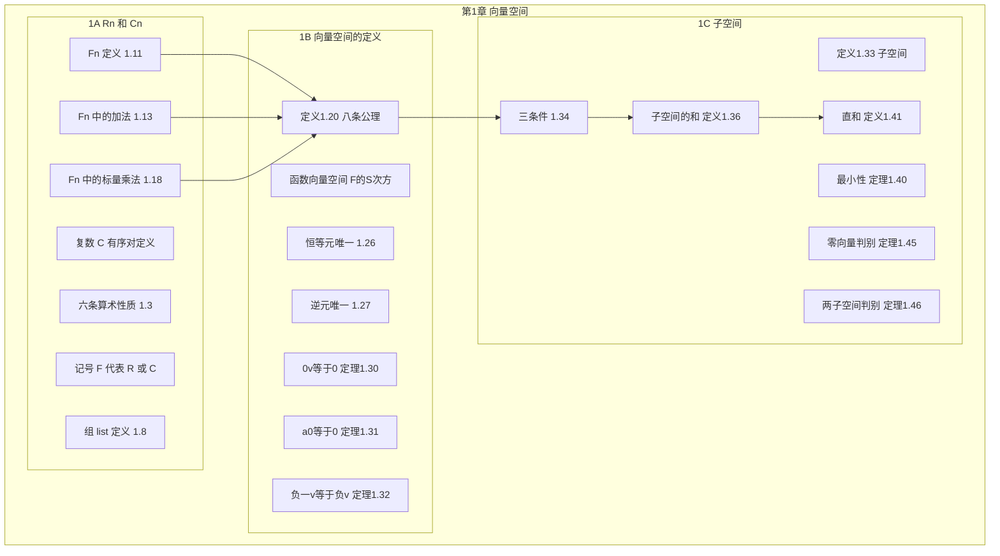
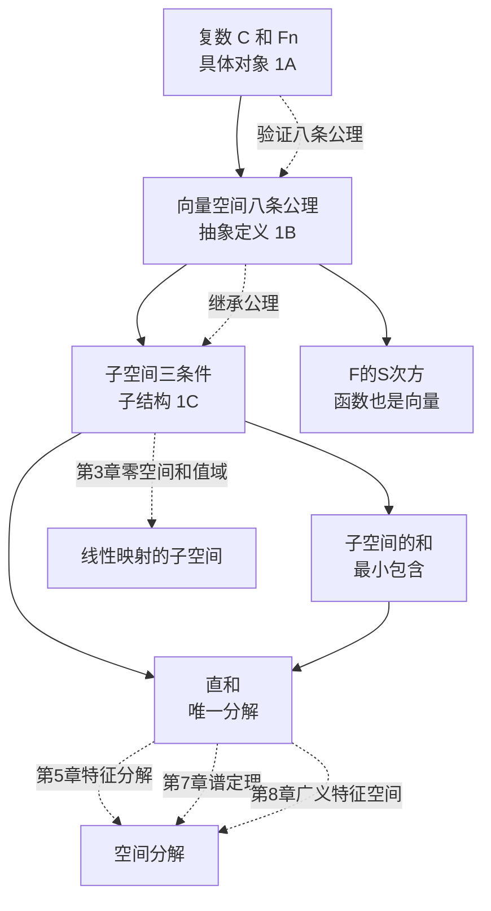

# 第 1 章 向量空间 — 章节汇总

> [!abstract] 全章概览
> 第 1 章是整本书的基石，从最基本的概念出发，逐步构建出==向量空间==的完整理论框架。全章三节构成一条清晰的抽象化链条：
>
> **具体对象**（1A：$\mathbb{F}^n$）→ **抽象定义**（1B：向量空间八条公理）→ **子结构**（1C：子空间、和、直和）
>
> **核心主线**：从"能看见的数组"到"看不见的公理结构"——理解公理化方法如何赋予线性代数跨越维度的力量

---

## 一、全章知识框架思维导图

---

## 二、全章核心知识点与重点公式汇总

### 2.1 $\mathbb{R}^n$ 和 $\mathbb{C}^n$（[[1A Rⁿ 和 Cⁿ]]）

| 定理/定义 | 内容 | 编号 |
|:---|:---|:---:|
| 复数 $\mathbb{C}$ | 有序对 $(a,b)$，加法和乘法按定义 | 1.1 |
| 复数算术性质 | 交换律、结合律、恒等元、逆元、分配律 | 1.3 |
| 减法与除法 | 通过逆元派生：$\beta - \alpha = \beta + (-\alpha)$ | 1.5 |
| 记号 $\mathbb{F}$ | $\mathbb{F}$ 代表 $\mathbb{R}$ 或 $\mathbb{C}$ | 1.6 |
| 组（list） | 有序、可重复、有限长度 | 1.8 |
| ==**$\mathbb{F}^n$**== | 全体长度为 $n$ 的 $\mathbb{F}$ 中元素之组 | 1.11 |
| $\mathbb{F}^n$ 中的加法 | 逐坐标相加 | 1.13 |
| 加法可交换性 | 从 $\mathbb{F}$ 的交换律"继承" | 1.14 |
| $\mathbb{F}^n$ 中的标量乘法 | $\lambda(x_1,\ldots,x_n)=(\lambda x_1,\ldots,\lambda x_n)$ | 1.18 |

### 2.2 向量空间的定义（[[1B 向量空间的定义]]）

| 定理/定义 | 内容 | 编号 |
|:---|:---|:---:|
| ==**向量空间定义**== | 集合 $V$ + 加法 + 标量乘法，满足八条公理 | 1.20 |
| 加法公理 V1~V4 | 交换律、结合律、恒等元、逆元 | 1.20 |
| 标量乘法公理 V5~V8 | 结合律、单位律、标量分配律、向量分配律 | 1.20 |
| $\mathbb{F}^S$ | 从 $S$ 到 $\mathbb{F}$ 的所有函数，逐点定义运算 | — |
| 恒等元唯一 | 加法恒等元只有一个 | 1.26 |
| 逆元唯一 | 每个元素的加法逆元只有一个 | 1.27 |
| ==**$0v = 0$**== | 标量零乘任何向量得零向量 | 1.30 |
| ==**$a0 = 0$**== | 任何数乘零向量得零向量 | 1.31 |
| $(-1)v = -v$ | $-1$ 乘 $v$ 等于 $v$ 的逆元 | 1.32 |

### 2.3 子空间（[[1C 子空间]]）

| 定理/定义 | 内容 | 编号 |
|:---|:---|:---:|
| ==**子空间**== | $U \subseteq V$，与 $V$ 共享运算且自身是向量空间 | 1.33 |
| ==**三条件**== | $0 \in U$、加法封闭、标量乘法封闭 | 1.34 |
| 子空间的和 | $V_1+\cdots+V_m=\{v_1+\cdots+v_m\}$ | 1.36 |
| ==**最小性**== | 子空间的和是最小的包含所有 $V_k$ 的子空间 | 1.40 |
| ==**直和**== | 和中每个元素有唯一的分解方式，记 $\oplus$ | 1.41 |
| 零向量判别 | 直和 $\Leftrightarrow$ 零向量只有全零分解 | 1.45 |
| ==**两子空间判别**== | $U+W$ 是直和 $\Leftrightarrow$ $U \cap W = \{0\}$ | 1.46 |

---

## 三、章节学习脉络梳理

### 3.1 第一层：具体对象——$\mathbb{F}^n$（1A）

**核心问题**：线性代数的基本"原材料"是什么？

- 从==复数==出发（有序对 $(a,b)$ + 特定运算规则），建立 $\mathbb{C}$ 的六条算术性质
- 引入==记号 $\mathbb{F}$==（$\mathbb{R}$ 或 $\mathbb{C}$），使定理同时适用于实数和复数
- 定义==组==（list）：有序、可重复、有限长度——这是坐标表示的基础
- 构造 $\mathbb{F}^n$：全体长度为 $n$ 的 $\mathbb{F}$ 中元素之组
- 在 $\mathbb{F}^n$ 上定义==加法==（逐坐标相加）和==标量乘法==（逐坐标缩放）

**关键收获**：$\mathbb{F}^n$ 是线性代数最基本的具体对象。加法和标量乘法的性质直接从 $\mathbb{F}$ 的性质"继承"而来——这种"逐坐标验证"的证明模式贯穿全书。

### 3.2 第二层：抽象定义——向量空间（1B）

**核心问题**：如何将 $\mathbb{F}^n$ 的经验推广到任意数学对象？

- 提取 $\mathbb{F}^n$ 的八条最本质的性质作为==公理==（定义 1.20）
- 引入==函数向量空间 $\mathbb{F}^S$==：函数、多项式、矩阵、数列都可以是"向量"
- 证明基本性质：恒等元唯一（1.26）、逆元唯一（1.27）、零乘法（1.30/1.31）、$-1$ 乘法（1.32）

**关键收获**：==公理化方法==是本章的核心思想。只要满足八条公理，任何对象都可以成为"向量"。这使得同一套理论可以同时应用于几何、分析、代数、概率等领域。

### 3.3 第三层：子结构——子空间（1C）

**核心问题**：向量空间内部有哪些"自洽"的子集？

- ==子空间==：与父空间共享运算且自身满足八条公理的子集（定义 1.33）
- ==三条件判别法==（定理 1.34）：验证子空间只需检查三个条件，无需重新验证全部八条公理——其余公理"免费继承"
- ==子空间的和==：多个子空间的"最小包含"（定义 1.36、定理 1.40）
- ==直和==：子空间之间"没有冗余"的组合方式（定义 1.41）
- 两个判定定理：零向量唯一分解（1.45）、交集为零（1.46，仅适用于两个子空间）

**关键收获**：子空间是理解线性代数整体架构的关键——后续的零空间、值域、特征空间等都是子空间的特例。直和的概念为后续的基分解和空间分解奠定了基础。

### 3.4 三节之间的深层联系

第 1 章的三节并非孤立的知识块，而是构成了一条==从具体到抽象再到结构==的递进链条。理解它们之间的联系，是掌握后续章节（特别是第 2 章线性无关与基、第 3 章线性映射）的关键。

#### 3.4.1 从 $\mathbb{F}^n$ 到向量空间：为什么要"抽象化"？

在 1A 中，我们认识了 $\mathbb{F}^n$——一个具体、可计算的对象。但线性代数的真正威力在于：==一旦证明了某个定理对"向量空间"成立，它就对所有满足八条公理的对象自动成立==（Wichita State University 讲义）。

这意味着：
- 在 $\mathbb{F}^n$ 上证明的定理，自动适用于函数空间 $\mathbb{F}^S$、多项式空间、矩阵空间等
- 无需为每种对象重新证明——==一套理论，处处适用==（Northeastern University Dummit 讲义）

这就是为什么 1B 要引入抽象定义：$\mathbb{F}^n$ 是"特例"，向量空间才是"一般规律"。

#### 3.4.2 从向量空间到子空间："继承"是核心机制

1C 的子空间三条件（定理 1.34）体现了 1B 八条公理的深层结构：==子空间不需要重新验证全部八条公理，因为其余公理从父空间"免费继承"==。

这种"继承"关系在第 3 章中反复出现：
- ==零空间== $\text{null}\,T$ 是 $V$ 的子空间（第 3 章）
- ==值域== $\text{range}\,T$ 是 $W$ 的子空间（第 3 章）
- ==特征空间== $E(\lambda, T)$ 是 $V$ 的子空间（第 5 章）

因此，1C 的三条件验证方法是后续几乎所有子空间证明的基础工具。

#### 3.4.3 直和的前瞻：空间分解的起点

1C 引入的直和概念（定义 1.41）看似简单，实则是后续多个核心理论的基石：

| 后续章节 | 直和的应用 |
|---|---|
| 第 2 章 | 基将向量空间分解为一维子空间的直和 |
| 第 5 章 | 特征空间分解：$V = E(\lambda_1, T) \oplus \cdots \oplus E(\lambda_m, T)$（可对角化时） |
| 第 7 章 | 谱定理：自伴算子的特征向量构成正交直和分解 |
| 第 8 章 | 广义特征空间分解：$V = G(\lambda_1, T) \oplus \cdots \oplus G(\lambda_m, T)$ |

直和的本质——==每个向量恰好有一种分解方式==——是理解"空间如何被线性算子分解"的统一框架（Fiveable Abstract Linear Algebra 学习指南）。

#### 3.4.4 $\mathbb{F}^S$ 的桥梁作用

1B 引入的 $\mathbb{F}^S$ 不仅是一个例子，更是连接具体与抽象的桥梁：

- 当 $S = \{1, \ldots, n\}$ 时，$\mathbb{F}^S \cong \mathbb{F}^n$（回到 1A 的具体对象）
- 当 $S = [0,1]$ 时，$\mathbb{F}^S$ 是函数空间（进入分析领域）
- 当 $S = \mathbb{N}$ 时，$\mathbb{F}^S$ 是无穷序列空间（进入泛函分析领域）

$\mathbb{F}^S$ 告诉我们：==$\mathbb{F}^n$ 不是特殊的，它只是函数空间在有限集上的特例==（University of Colorado Boulder 讲义）。

**来源**：Wichita State University Vector Spaces 讲义、Northeastern University Dummit 讲义、University of Colorado Boulder Bases and Coordinates 讲义、Fiveable Abstract Linear Algebra 学习指南、ResearchGate "Dealing with the Abstraction of Vector Space Concepts" 教育研究论文。

### 3.5 全章核心线索图

---

## 四、补充理解与跨章展望

### 4.1 学生常见的学习障碍

教育研究表明，向量空间理论是线性代数中最令学生困惑的部分之一（ResearchGate "Students' Difficulties in Vector Spaces Theory"）。主要障碍包括：

1. **运算视角与结构视角的割裂**：学生往往能进行向量计算（运算视角），但难以将向量空间理解为一个整体的数学结构（结构视角）。第 1 章从 $\mathbb{F}^n$ 到抽象向量空间的过渡，正是要求完成这种视角转换。

2. **$\mathbb{R}^n$ 的"标准基"依赖**：在 $\mathbb{R}^n$ 中，标准基 $(1,0,\ldots,0), \ldots, (0,\ldots,0,1)$ 是"天然存在"的，学生容易误以为所有向量空间都有这种"显然的基"。抽象向量空间（如函数空间）没有标准基，必须通过第 2 章的理论来构造。

3. **子空间验证中的反例构造**：许多学生知道子空间的定义，但难以构造反例来证明某个集合不是子空间（ResearchGate "Dealing with the Abstraction of Vector Space Concepts"）。关键在于：找到一个==不满足三条件中某一条==的具体元素。

### 4.2 第 1 章与后续章节的关联地图

| 第 1 章概念 | 后续章节中的深化 |
|---|---|
| $\mathbb{F}^n$ 的加法和标量乘法 | 第 2 章：线性无关与基、第 3 章：矩阵表示 |
| 向量空间八条公理 | 第 3 章：$\mathcal{L}(V,W)$ 本身是向量空间 |
| $\mathbb{F}^S$ 函数空间 | 第 4 章：多项式空间 $\mathcal{P}(\mathbb{F})$ |
| 子空间三条件 | 第 3 章：零空间和值域的子空间证明 |
| 子空间的和 | 第 2 章：张成空间 $\text{span}(v_1,\ldots,v_n)$ |
| 直和 $\oplus$ | 第 5 章：特征空间分解、第 7 章：谱定理、第 8 章：广义特征空间分解 |
| 定理 1.46（两子空间直和） | 第 6 章：正交补 $U \oplus U^\perp = V$ |

### 4.3 为什么 Axler 从向量空间而不是矩阵开始？

传统线性代数教材（如 Gilbert Strang）通常从矩阵和线性方程组开始，而 Axler 选择从向量空间的公理化定义开始。这种安排有深刻的教学考量：

- **"无坐标"思维**：先建立不依赖坐标的概念（向量空间、子空间、线性映射），再引入坐标（矩阵），使学生理解==矩阵是工具而非本质==
- **避免"矩阵=线性代数"的误解**：许多学生学完传统课程后认为线性代数就是"算矩阵"，而 Axler 的安排让学生先理解抽象结构，再看矩阵如何表示这种结构
- **更广泛的适用性**：从公理出发的理论可以直接应用于函数、多项式、算子等非矩阵对象

**来源**：UCSB Math 4A Vector Spaces 讲义、Emory University Chapter 6 Vector Spaces 讲义、Northeastern University Dummit 讲义。

---

## 五、全章总复习题

> [!info] 使用说明
> 以下复习题覆盖第 1 章全部三节的核心知识点。建议在不查阅笔记的情况下独立完成，然后对照答案自评。每题标注了考查的节次和知识点。

### A. 复数与 $\mathbb{F}^n$（1A）

**A1**. 计算 $(1+2i)^3$，验证你的答案是否正确。

查看解答

$(1+2i)^2 = 1 + 4i + 4i^2 = 1 + 4i - 4 = -3 + 4i$

$(1+2i)^3 = (1+2i)(-3+4i) = -3 + 4i - 6i + 8i^2 = -3 - 2i - 8 = -11 - 2i$

验证：$|1+2i| = \sqrt{5}$，$|(1+2i)^3| = (\sqrt{5})^3 = 5\sqrt{5}$。$|-11-2i| = \sqrt{121+4} = \sqrt{125} = 5\sqrt{5}$。✓

**A2**. 设 $x = (1, -2, 3) \in \mathbb{R}^3$，$y = (0, 1, -1) \in \mathbb{R}^3$。求 $2x - 3y$。

查看解答

$2x = (2, -4, 6)$，$3y = (0, 3, -3)$

$2x - 3y = (2-0, -4-3, 6-(-3)) = (2, -7, 9)$

### B. 向量空间定义（1B）

**B1**. 判断下列集合是否为 $\mathbb{R}$ 上的向量空间（具有自然的加法和标量乘法），并说明理由：
- (a) 正实数集 $\mathbb{R}^+ = \{x \in \mathbb{R} : x > 0\}$，加法为 $x \oplus y = xy$，标量乘法为 $c \odot x = x^c$
- (b) $\{(x, y) \in \mathbb{R}^2 : x \geq 0\}$，使用 $\mathbb{R}^2$ 的标准运算

查看解答

**(a) 是向量空间**（这是一个巧妙的重定义运算的例子）：
- 加法恒等元：$1$（因为 $x \oplus 1 = x \cdot 1 = x$）
- 加法逆元：$x^{-1}$（因为 $x \oplus x^{-1} = x \cdot x^{-1} = 1$）
- 标量乘法单位律：$1 \odot x = x^1 = x$ ✓
- 其余公理类似验证（利用实数乘法和指数的性质）

**(b) 不是向量空间**：对标量乘法不封闭。$(-1) \odot (1, 0) = (-1, 0) \notin \{(x,y) : x \geq 0\}$。

**B2**. 证明：在向量空间 $V$ 中，$-(a v) = (-a)v = a(-v)$ 对所有 $a \in \mathbb{F}$，$v \in V$ 成立。

查看解答

$-(av) = (-1)(av) = ((-1)a)v = (-a)v$（第一步用定理 1.32，第二步用 V5 标量乘法结合律）

$a(-v) = a((-1)v) = (a \cdot (-1))v = (-a)v$（第一步用定理 1.32，第二步用 V5）

因此 $-(av) = (-a)v = a(-v)$。$\blacksquare$

### C. 子空间（1C）

**C1**. 下列哪些是 $\mathbb{R}^3$ 的子空间？说明理由。
- (a) $\{(x, y, z) : x + y + z = 1\}$
- (b) $\{(x, y, z) : x = y\}$
- (c) $\{(x, y, z) : x^2 + y^2 + z^2 = 0\}$
- (d) $\{(x, y, z) : x^2 + y^2 + z^2 \leq 1\}$

查看解答

**(a) 不是**。$\mathbf{0} = (0,0,0)$ 不满足 $0+0+0 = 1$。

**(b) 是**。齐次线性条件。$\mathbf{0}$ 满足 $0=0$；加法和标量乘法的封闭性由线性条件保证。

**(c) 是**。$x^2+y^2+z^2=0 \Leftrightarrow (x,y,z)=(0,0,0)$，所以这个集合就是 $\{\mathbf{0}\}$，平凡子空间。

**(d) 不是**。对标量乘法不封闭：$(1,0,0)$ 在集合中，但 $2(1,0,0)=(2,0,0)$ 不满足 $4 \leq 1$。

**C2**. 设 $U = \{(x, y, 0) : x, y \in \mathbb{F}\}$，$W = \{(0, y, z) : y, z \in \mathbb{F}\}$。求 $U \cap W$、$U + W$，并判断 $U + W$ 是否为直和。

查看解答

$U \cap W$：同时满足 $x=0$ 且 $z=0$ 的向量，即 $\{(0, y, 0) : y \in \mathbb{F}\}$（$y$-轴）。

$U + W$：$(x_1, y_1, 0) + (0, y_2, z) = (x_1, y_1+y_2, z)$。令 $s=x_1$，$t=y_1+y_2$，$u=z$，则 $U+W = \{(s, t, u) : s, t, u \in \mathbb{F}\} = \mathbb{F}^3$。

$U + W$ ==不是直和==，因为 $U \cap W = \{(0,y,0)\} \neq \{\mathbf{0}\}$。由定理 1.46，$U+W$ 是直和当且仅当 $U \cap W = \{\mathbf{0}\}$。

### D. 跨节综合题

**D1**. 证明：$\mathbb{F}^S$（从 $S$ 到 $\mathbb{F}$ 的所有函数）是向量空间。你需要验证哪些公理？哪些是"免费"的？

查看解答

$\mathbb{F}^S$ 上的加法和标量乘法定义为：$(f+g)(x) = f(x)+g(x)$，$(af)(x) = a \cdot f(x)$。

**需要验证的**：
- 封闭性：$f+g$ 和 $af$ 仍然是 $S$ 到 $\mathbb{F}$ 的函数（值在 $\mathbb{F}$ 中，因为 $\mathbb{F}$ 对加法和乘法封闭）
- V1~V8 全部八条公理——但每条都直接归结为 $\mathbb{F}$ 中对应性质

例如 V1（交换律）：$(f+g)(x) = f(x)+g(x) = g(x)+f(x) = (g+f)(x)$，第二个等号用 $\mathbb{F}$ 的交换律。

**本质上没有"免费"的**——但每条公理的验证都极其直接，因为运算逐点定义，直接继承 $\mathbb{F}$ 的性质。

**D2**. 设 $V$ 是向量空间，$U_1$、$U_2$、$U_3$ 是 $V$ 的子空间。判断以下命题的真假：
- (a) $U_1 \cap U_2 \cap U_3$ 是 $V$ 的子空间
- (b) $U_1 \cup U_2 \cup U_3$ 是 $V$ 的子空间
- (c) 若 $U_i \cap U_j = \{\mathbf{0}\}$ 对所有 $i \neq j$，则 $U_1 + U_2 + U_3$ 是直和

查看解答

**(a) 真**。推广习题 10 的证明：$\mathbf{0}$ 在每个 $U_i$ 中，故在交集中；加法和标量乘法的封闭性类似验证。

**(b) 假**。两个子空间的并集一般不是子空间（习题 12），三个更不是。

**(c) 假**。例 1.44 给出了反例：$V_1 \cap V_2 = V_1 \cap V_3 = V_2 \cap V_3 = \{\mathbf{0}\}$，但 $V_1 + V_2 + V_3$ 不是直和。==定理 1.46 仅适用于两个子空间==。

---

## 六、各节笔记索引

| 节 | 笔记链接 | 核心主题 |
|:---:|:---|:---|
| 1A | [[1A Rⁿ 和 Cⁿ]] | 复数、$\mathbb{F}^n$、加法、标量乘法 |
| 1B | [[1B 向量空间的定义]] | ==八条公理==、$\mathbb{F}^S$、基本性质 |
| 1C | [[1C 子空间]] | ==三条件==、子空间的和、==直和== |

---

## 七、全章核心公式

> [!success] 必须熟记的公式与定理

1. **向量空间八条公理**：V1~V4（加法：交换律、结合律、恒等元、逆元），V5~V8（标量乘法：结合律、单位律、标量分配律、向量分配律）
2. **$0v = 0$**（定理 1.30）：标量零乘任何向量得零向量
3. **$a\mathbf{0} = \mathbf{0}$**（定理 1.31）：任何数乘零向量得零向量
4. **$(-1)v = -v$**（定理 1.32）：$-1$ 乘 $v$ 等于 $v$ 的加法逆元
5. **子空间三条件**（定理 1.34）：$\mathbf{0} \in U$、加法封闭、标量乘法封闭
6. **子空间的和**（定义 1.36）：$V_1+\cdots+V_m = \{v_1+\cdots+v_m : v_k \in V_k\}$
7. **直和零向量判别**（定理 1.45）：直和 $\Leftrightarrow$ 零向量只有全零分解
8. **两子空间直和判别**（定理 1.46）：$U+W$ 是直和 $\Leftrightarrow$ $U \cap W = \{\mathbf{0}\}$

> [!warning] 易错提醒
> - 定理 1.46 **仅适用于两个子空间**，三个或更多子空间时两两交集为零不保证直和
> - 标量 $0 \in \mathbb{F}$ 和向量 $\mathbf{0} \in V$ 是不同对象，只是习惯上用相同符号
> - 子空间**必须过原点**——不过原点的直线或平面不是子空间

#学习/线性代数/向量空间
