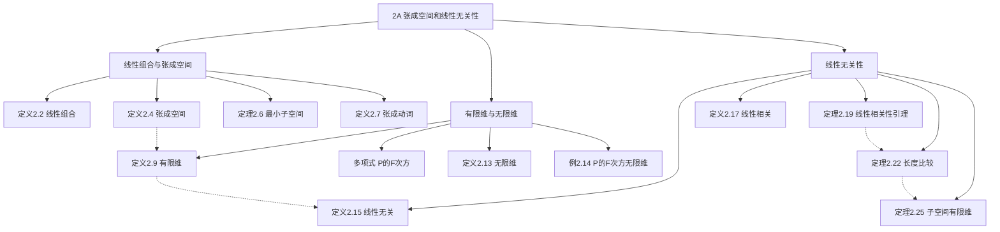

# 2A 张成空间和线性无关性

> [!abstract] 本节概览
> 本节是第 2 章的起点，引入线性代数中两个最核心的概念：==张成空间==（span）和==线性无关性==（linear independence）。从线性组合的定义出发，建立张成空间理论，然后引入有限维与无限维的区分，最后通过线性相关性引理证明"线性无关组不长于张成组"这一关键定理。
>
> **逻辑链条**：线性组合 → 张成空间（最小子空间）→ 有限维/无限维 → 线性无关 → 线性相关性引理 → 长度比较定理
>
> **前置依赖**：[[1B 向量空间的定义]]（向量空间八条公理）、[[1C 子空间]]（子空间三条件）
>
> **核心主线**：从"向量的组合方式"到"空间的维度限制"——为基和维数的定义铺路

---

## 一、线性组合与张成空间

> [!def] 定义 2.2 线性组合
> $V$ 中向量组 $v_1, \ldots, v_m$ 的==线性组合==是形如
> $$a_1 v_1 + \cdots + a_m v_m$$
> 的向量，其中 $a_1, \ldots, a_m \in \mathbb{F}$。

> [!example] 例 2.3 $\mathbb{F}^3$ 中的线性组合
> $(17, -4, 2)$ 是 $(2, 1, -3), (1, -2, 4)$ 的线性组合，因为
> $$(17, -4, 2) = 6(2, 1, -3) + 5(1, -2, 4)$$
>
> $(17, -4, 5)$ **不是**它们的线性组合——对应的线性方程组无解。

> [!def] 定义 2.4 张成空间
> $V$ 中向量组 $v_1, \ldots, v_m$ 的所有线性组合所构成的集合称为 $v_1, \ldots, v_m$ 的==张成空间==，记作 $\text{span}(v_1, \ldots, v_m)$：
> $$\text{span}(v_1, \ldots, v_m) = \{a_1 v_1 + \cdots + a_m v_m : a_1, \ldots, a_m \in \mathbb{F}\}$$
>
> 定义空向量组的张成空间为 $\{0\}$。

> [!thm] 定理 2.6 张成空间是最小包含子空间
> $V$ 中向量组的张成空间是最小的包含这向量组中所有向量的 $V$ 的子空间。

> [!abstract] 证明思路
> **[三条件验证 + 最小性]**：
> 1. $0 = 0v_1 + \cdots + 0v_m \in \text{span}(v_1, \ldots, v_m)$
> 2. 加法封闭：$(a_1 v_1 + \cdots) + (c_1 v_1 + \cdots) = (a_1+c_1)v_1 + \cdots$
> 3. 标量乘法封闭：$\lambda(a_1 v_1 + \cdots) = \lambda a_1 v_1 + \cdots$
>
> **最小性**：每个 $v_k$ 都在张成空间中（取 $a_k=1$，其余为 $0$）。反之，任何包含所有 $v_k$ 的子空间对加法和标量乘法封闭，因此必须包含所有线性组合。$\blacksquare$

> [!def] 定义 2.7 张成
> 如果 $\text{span}(v_1, \ldots, v_m) = V$，就说 $v_1, \ldots, v_m$ ==张成== $V$。

> [!example] 例 2.8 标准基向量张成 $\mathbb{F}^n$
> $$(x_1, \ldots, x_n) = x_1(1, 0, \ldots, 0) + x_2(0, 1, 0, \ldots, 0) + \cdots + x_n(0, \ldots, 0, 1)$$
> 所以 $(1,0,\ldots,0), (0,1,0,\ldots,0), \ldots, (0,\ldots,0,1)$ 张成 $\mathbb{F}^n$。

> [!note] 几何直觉
> 在 $\mathbb{R}^2$ 中：
> - 一个非零向量的张成空间 = 过原点的直线
> - 两个不共线向量的张成空间 = 整个 $\mathbb{R}^2$ 平面
> - 两个共线向量的张成空间 = 一条直线（有冗余）

---

## 二、有限维与无限维

> [!def] 定义 2.9 有限维向量空间
> 如果一个向量空间可由其中某个向量组张成，则称该向量空间是==有限维的==。

例 2.8 表明 $\mathbb{F}^n$ 是有限维的。

> [!def] 定义 2.10 多项式、$\mathcal{P}(\mathbb{F})$
> 对于函数 $p : \mathbb{F} \to \mathbb{F}$，如果存在 $a_0, \ldots, a_m \in \mathbb{F}$ 使得对所有 $z \in \mathbb{F}$ 都有
> $$p(z) = a_0 + a_1 z + a_2 z^2 + \cdots + a_m z^m$$
> 则称 $p$ 为系数在 $\mathbb{F}$ 中的==多项式==。
>
> $\mathcal{P}(\mathbb{F})$ 是系数在 $\mathbb{F}$ 中的全体多项式所构成的集合，是 $\mathbb{F}^\mathbb{F}$ 的子空间。

> [!def] 定义 2.11 多项式的次数
> 对于 $p \in \mathcal{P}(\mathbb{F})$，如果存在 $a_0, \ldots, a_m \in \mathbb{F}$ 且 $a_m \neq 0$ 使得 $p(z) = a_0 + a_1 z + \cdots + a_m z^m$，那么 $p$ 的==次数==是 $m$，记作 $\deg p$。
>
> 规定恒等于 $0$ 的多项式的次数为 $-\infty$。

> [!note] 记号 2.12 $\mathcal{P}_m(\mathbb{F})$
> $\mathcal{P}_m(\mathbb{F})$ 表示系数在 $\mathbb{F}$ 中且次数不高于 $m$ 的所有多项式。
>
> $\mathcal{P}_m(\mathbb{F}) = \text{span}(1, z, \ldots, z^m)$，因此==每个 $\mathcal{P}_m(\mathbb{F})$ 都是有限维的==。

> [!def] 定义 2.13 无限维向量空间
> 如果一个向量空间不是有限维的，就称它是==无限维的==。

> [!example] 例 2.14 $\mathcal{P}(\mathbb{F})$ 是无限维的
> 考虑 $\mathcal{P}(\mathbb{F})$ 中的任意一组元素。令 $m$ 表示这组中多项式的最高次数。那么张成空间中每个多项式的次数都不超过 $m$，从而 $z^{m+1}$ 不在张成空间里。因此没有组能张成 $\mathcal{P}(\mathbb{F})$。

> [!important] 有限维 vs 无限维
> | | 有限维 | 无限维 |
> |---|---|---|
> | 定义 | 可被某个有限向量组张成 | 不能被任何有限向量组张成 |
> | 例子 | $\mathbb{F}^n$、$\mathcal{P}_m(\mathbb{F})$ | $\mathcal{P}(\mathbb{F})$、$\mathbb{F}^\infty$、$C[0,1]$ |
> | 本书重点 | ✅ 第 2~8 章的核心对象 | 仅作为对比出现 |

---

## 三、线性无关性

> [!def] 定义 2.15 线性无关
> 对于 $V$ 中的向量组 $v_1, \ldots, v_m$，如果使得
> $$a_1 v_1 + \cdots + a_m v_m = 0$$
> 成立的 $a_1, \ldots, a_m \in \mathbb{F}$ 的唯一选取方式是 $a_1 = \cdots = a_m = 0$，那么称该向量组为==线性无关的==。
>
> 规定空向量组 $()$ 也是线性无关的。

> [!important] 线性无关 ⟺ 表示唯一
> $v_1, \ldots, v_m$ 线性无关，当且仅当 $\text{span}(v_1, \ldots, v_m)$ 中的每个向量都只能==唯一地==表示成 $v_1, \ldots, v_m$ 的线性组合。

> [!example] 例 2.16 线性无关组
> **(a)** $(1,0,0,0), (0,1,0,0), (0,0,1,0)$ 在 $\mathbb{F}^4$ 中线性无关——令线性组合等于 $\mathbf{0}$，逐坐标得 $a_1=a_2=a_3=0$。
>
> **(b)** $1, z, \ldots, z^m$ 在 $\mathcal{P}(\mathbb{F})$ 中线性无关——多项式恒等于零意味着所有系数为零。
>
> **(c)** 长度为 $1$ 的组线性无关 ⟺ 组中向量不是 $\mathbf{0}$。
>
> **(d)** 长度为 $2$ 的组线性无关 ⟺ 任一向量不是另一个的标量倍。

> [!def] 定义 2.17 线性相关
> 如果 $V$ 中的一个向量组不是线性无关的，就称它是==线性相关的==。即存在不全为 $0$ 的 $a_1, \ldots, a_m$ 使得 $a_1 v_1 + \cdots + a_m v_m = 0$。

> [!example] 例 2.18 线性相关组
> $(2,3,1), (1,-1,2), (7,3,8)$ 在 $\mathbb{F}^3$ 中线性相关，因为
> $$2(2,3,1) + 3(1,-1,2) + (-1)(7,3,8) = (0,0,0)$$

> [!warning] 线性相关的等价条件
> - 向量组中某个向量是其余向量的线性组合 ⟺ 该组线性相关
> - 包含 $\mathbf{0}$ 的向量组一定线性相关
> - 从线性无关组中移除某些向量，余下的仍线性无关

### 线性相关性引理

> [!thm] 定理 2.19 线性相关性引理
> 设 $v_1, \ldots, v_m$ 是 $V$ 中的线性相关组。那么存在 $k \in \{1, 2, \ldots, m\}$ 满足
> $$v_k \in \text{span}(v_1, \ldots, v_{k-1})$$
>
> 进而，如果从 $v_1, \ldots, v_m$ 中移除第 $k$ 项，剩余向量组成的向量组的张成空间仍等于 $\text{span}(v_1, \ldots, v_m)$。

> [!abstract] 证明思路
> **[取最大下标 + 替换]**：
>
> 因为线性相关，存在不全为 $0$ 的 $a_1, \ldots, a_m$ 使 $a_1 v_1 + \cdots + a_m v_m = 0$。
>
> **[关键步骤：取最大下标]**：令 $k$ 是使 $a_k \neq 0$ 的最大者。则
> $$v_k = -\frac{a_1}{a_k}v_1 - \cdots - \frac{a_{k-1}}{a_k}v_{k-1}$$
> 这证明了 $v_k \in \text{span}(v_1, \ldots, v_{k-1})$。
>
> **[最小性]**：将 $v_k$ 替换为上式右端，任何 $\text{span}(v_1, \ldots, v_m)$ 中的向量都可以不用 $v_k$ 表示。$\blacksquare$

> [!tip] 引理的直觉
> 线性相关性引理说的是：==冗余向量中，总有一个可以"追溯到"它前面的向量==。这个"前面的"条件很重要——它保证了我们可以按顺序逐步剔除冗余，而不影响张成空间。

> [!example] 例 2.21 引理中 $k$ 的最小值
> 考虑 $\mathbb{R}^3$ 中的组 $(1,2,3), (6,5,4), (15,16,17), (8,9,7)$。
> - $k=1$？需要 $(1,2,3)=\mathbf{0}$，不满足。
> - $k=2$？需要 $(6,5,4)=c(1,2,3)$，不存在这样的 $c$。
> - $k=3$？需要 $(15,16,17)=a(1,2,3)+b(6,5,4)$，解得 $a=3, b=2$。✓
>
> 所以 $k=3$ 是满足引理的最小值。

### 长度比较定理

> [!thm] 定理 2.22 线性无关组的长度 ≤ 张成组的长度
> 在有限维向量空间中，每个线性无关向量组的长度小于或等于每个张成向量组的长度。

> [!abstract] 证明思路
> **[逐步替换法（交换引理）]**：
>
> 设 $u_1, \ldots, u_m$ 线性无关，$w_1, \ldots, w_n$ 张成 $V$。需要证明 $m \leq n$。
>
> **[步骤 1]**：将 $u_1$ 加入 $w_1, \ldots, w_n$ 的开头。因为 $u_1 \in V = \text{span}(w_1, \ldots, w_n)$，新组线性相关。由线性相关性引理，可以移除某个 $w$（因为 $u_1 \neq \mathbf{0}$，所以移除的不是 $u_1$），新组仍张成 $V$。
>
> **[步骤 $k$]**：将 $u_k$ 插入 $u_1, \ldots, u_{k-1}$ 之后。因为 $u_1, \ldots, u_k$ 线性无关，被移除的不可能是某个 $u$，所以==每步至少移除一个 $w$==。
>
> 经过 $m$ 步后，所有 $u$ 都加入了。每步移除至少一个 $w$，所以 $n \geq m$。$\blacksquare$

> [!success] 定理 2.22 的重要性
> 这是==整个有限维线性代数的基石之一==。它直接蕴含：
> - 所有基的长度相等（第 2B 节）
> - 维数的定义是良定义的
> - $\dim \mathbb{F}^n = n$
> - 有限维空间中线性无关组不能无限延长

> [!example] 例 2.23/2.24 定理 2.22 的应用
> **例 2.23**：$(1,0,0), (0,1,0), (0,0,1)$ 长度为 $3$ 且张成 $\mathbb{R}^3$。所以 $\mathbb{R}^3$ 中长度 $>3$ 的组都不是线性无关的。
>
> **例 2.24**：$(1,0,0,0), \ldots, (0,0,0,1)$ 长度为 $4$ 且在 $\mathbb{R}^4$ 中线性无关。所以长度 $<4$ 的组都不能张成 $\mathbb{R}^4$。

### 有限维的子空间

> [!thm] 定理 2.25 有限维的子空间
> 有限维向量空间的每个子空间都是有限维的。

> [!abstract] 证明思路
> **[逐步构造线性无关组]**：
>
> 设 $V$ 有限维，$U$ 是 $V$ 的子空间。
>
> **[步骤 1]**：若 $U = \{0\}$，完成。否则取非零 $u_1 \in U$。
>
> **[步骤 $k$]**：若 $U = \text{span}(u_1, \ldots, u_{k-1})$，完成。否则取 $u_k \in U \setminus \text{span}(u_1, \ldots, u_{k-1})$。
>
> 每步构造出的组都线性无关（由线性相关性引理），而线性无关组不长于 $V$ 的张成组（由定理 2.22）。所以==过程终会停止==，$U$ 是有限维的。$\blacksquare$

---

## 四、知识结构总览

---

## 五、核心思想与证明技巧

> [!success] 核心思想
> 1. **张成 = "够不够大"**：张成空间回答"这组向量能否覆盖整个空间"。张成是"充分性"的概念。
> 2. **线性无关 = "有没有冗余"**：线性无关回答"这组向量中有没有多余的"。线性无关是"必要性"的概念。
> 3. **基 = "恰好合适"**：既张成又线性无关的向量组就是基（第 2B 节的核心）——不大不小，恰好描述整个空间。
> 4. **有限维的本质约束**：定理 2.22 告诉我们，在有限维空间中，"独立性"和"覆盖性"互相制约——你不能同时要太多的独立向量和太多的覆盖向量。

> [!tip] 证明技巧清单
> 1. **验证张成空间是子空间**：用三条件（定理 2.6 的模式），这是标准流程
> 2. **线性相关性引理的"取最大下标"技巧**：从不全为零的系数中取最大的下标 $k$，保证 $v_k$ 可以用前面的向量表示
> 3. **逐步替换法（定理 2.22）**：每次加入一个线性无关向量，同时移除一个张成向量——"进出平衡"保证 $m \leq n$
> 4. **反证法构造无限线性无关组**：证明无限维时，逐步构造越来越长的线性无关组（定理 2.25 的逆否命题）
> 5. **多项式恒等 = 系数全零**：判断多项式组线性无关的关键工具

---

## 六、补充理解与易混淆点

### 6.1 张成空间的几何直觉

在 $\mathbb{R}^2$ 和 $\mathbb{R}^3$ 中，张成空间有非常直观的几何含义（Georgia Tech ILA 讲义、UCSD 线性代数讲义）：

| 向量组 | 张成空间 | 几何形象 |
|---|---|---|
| 一个非零向量 $\{v\}$ | $\text{span}(v)$ | 过原点的直线 |
| 两个不共线向量 $\{u, v\}$ | $\text{span}(u, v)$ | 过原点的平面 |
| 两个共线向量 $\{u, cu\}$ | $\text{span}(u, cu)$ | 一条直线（$cu$ 是冗余的） |
| 三个不共面向量 | $\text{span}(u, v, w)$ | 整个 $\mathbb{R}^3$ |

==直觉：张成空间就是你用这些向量能"到达"的所有位置==。就像给你几根绳索（向量），你能到达的范围就是它们的张成空间。

**来源**：Georgia Tech Interactive Linear Algebra 讲义、UCSD 线性代数讲义、UCLA 数学圈讲义。

### 6.2 线性无关的多种等价表述

线性无关有多种等价定义，理解它们之间的转换非常重要：

| 等价表述 | 含义 |
|---|---|
| 零向量的线性组合唯一 | $a_1 v_1 + \cdots + a_m v_m = 0 \Rightarrow a_i = 0$ |
| 每个向量的表示唯一 | $\text{span}$ 中每个向量只有一种线性组合表示 |
| 没有冗余向量 | 移除任何一个向量都会缩小张成空间 |
| 不存在非平凡的线性依赖关系 | 没有不全为零的系数使线性组合为零 |

**来源**：Duke University ILA 讲义、WWU Chapter 2 Finite-Dimensional Vector Spaces 讲义。

### 6.3 线性相关 vs 线性无关：整体与局部

一个常见的逻辑混淆是关于线性相关/无关的"整体"与"局部"关系（Hanspub 线性代数注记）：

- ✅ 整体线性相关 ⟹ 存在某个部分组线性相关（去掉非零系数对应的向量后）
- ❌ 整体线性相关 ⟹ 任意部分组也线性相关（错误！）
- ✅ 部分组线性相关 ⟹ 整体线性相关
- ✅ 整体线性无关 ⟹ 任意部分组也线性无关

**来源**：Hanspub "线性代数中的几个注记"。

### 6.4 常见误区

> [!danger] 误区1："线性无关就是两两不成比例"
> ❌ 错误认知：向量组线性无关等价于其中任意两个向量不成比例
> ✅ 正确理解：两两不成比例只是线性无关的==必要条件==，不是充分条件。例如 $(1,0,0), (0,1,0), (1,1,0)$ 两两不成比例，但 $(1,1,0) = (1,0,0)+(0,1,0)$，所以线性相关。三个或更多向量时，需要检查==所有向量==的组合，而非仅两两关系

> [!danger] 误区2："张成空间就是所有向量的集合"
> ❌ 错误认知：$\text{span}(v_1, \ldots, v_m)$ 是 $\{v_1, \ldots, v_m\}$ 的某种"扩展"
> ✅ 正确理解：张成空间是==所有线性组合==的集合，通常是一个无限集（除非所有 $v_i = \mathbf{0}$）。向量组本身是有限的，但张成空间可以包含无穷多个向量（UFL Common Mistakes 讲义）

> [!danger] 误区3："线性无关的向量越多越好"
> ❌ 错误认知：在向量空间中可以找到任意长的线性无关组
> ✅ 正确理解：由定理 2.22，线性无关组的长度==不能超过==张成组的长度。在 $n$ 维空间中，线性无关组最多有 $n$ 个向量。超过 $n$ 个向量必然线性相关

> [!danger] 误区4："子空间可以是线性无关的"
> ❌ 错误认知：某个子空间是线性无关的
> ✅ 正确理解：线性无关是向量组的性质，==不是子空间的性质==。子空间是一个集合，包含无穷多个向量（除 $\{0\}$ 外），而任何包含多于一个向量的无穷集合都不可能线性无关（UFL Common Mistakes 讲义）

**来源**：University of Florida Common Mistakes in Math Terminology、Duke University ILA 讲义、Hanspub 线性代数注记、Georgia Tech ILA 讲义。

---

## 七、习题精选

> [!todo] 本节习题
>
> | 编号 | 标题 | 核心考点 | 难度 |
> |:---:|---|---|:---:|
> | 1 | 求 F³ 中的张成空间 | 张成的计算 | ⭐ |
> | 3 | 前缀和组的张成 | 张成空间相等 | ⭐⭐ |
> | 5 | 求参数使组线性相关 | 线性相关的判定 | ⭐⭐ |
> | 8 | 差分组线性无关 | 线性无关的传递 | ⭐⭐ |
> | 13 | 扩展线性无关组 | 线性无关的充要条件 | ⭐⭐⭐ |
> | 15 | P₄ 中无六元线性无关组 | 维数限制 | ⭐⭐ |

### 习题 1：求 $\mathbb{F}^3$ 中的张成空间

> [!problem] 习题 1
> 求 $\mathbb{F}^3$ 中的四个不同向量，其张成空间等于 $\{(x, y, z) \in \mathbb{F}^3 : x + y + z = 0\}$。

> [!faq]- 查看解答
> 条件 $x + y + z = 0$ 等价于 $z = -x - y$，所以
> $$\{(x, y, z) : x+y+z=0\} = \{(x, y, -x-y) : x, y \in \mathbb{F}\} = x(1, 0, -1) + y(0, 1, -1)$$
>
> 因此 $\text{span}((1,0,-1), (0,1,-1))$ 就是所求的子空间。
>
> 四个不同向量可以取：$(1,0,-1), (0,1,-1), (1,1,-2), (2,3,-5)$（后两个是前两个的线性组合，不影响张成空间）。

### 习题 3：前缀和组的张成

> [!problem] 习题 3
> 设 $v_1, \ldots, v_m$ 是 $V$ 中的一组向量。对于 $k \in \{1, \ldots, m\}$，令 $w_k = v_1 + \cdots + v_k$。证明 $\text{span}(v_1, \ldots, v_m) = \text{span}(w_1, \ldots, w_m)$。

> [!faq]- 查看解答
> **证明**：
>
> ($\subseteq$)：每个 $v_k = w_k - w_{k-1}$（约定 $w_0 = 0$），所以 $v_k \in \text{span}(w_1, \ldots, w_m)$。因此 $\text{span}(v_1, \ldots, v_m) \subseteq \text{span}(w_1, \ldots, w_m)$。
>
> ($\supseteq$)：每个 $w_k = v_1 + \cdots + v_k \in \text{span}(v_1, \ldots, v_m)$。因此 $\text{span}(w_1, \ldots, w_m) \subseteq \text{span}(v_1, \ldots, v_m)$。$\blacksquare$

### 习题 5：求参数使组线性相关

> [!problem] 习题 5
> 求一数 $t$ 使得 $(3,1,4), (2,-3,5), (5,9,t)$ 在 $\mathbb{R}^3$ 中不是线性无关的。

> [!faq]- 查看解答
> 三个向量在 $\mathbb{R}^3$ 中线性相关 ⟺ 它们张成的平行六面体体积为零 ⟺ 行列式为零。
>
> $$\begin{vmatrix} 3 & 1 & 4 \\ 2 & -3 & 5 \\ 5 & 9 & t \end{vmatrix} = 3(-3t - 45) - 1(2t - 25) + 4(18 + 15)$$
> $$= -9t - 135 - 2t + 25 + 132 = -11t + 22$$
>
> 令 $-11t + 22 = 0$，得 $t = 2$。
>
> 验证：$t=2$ 时 $(5,9,2) = (3,1,4) + (2,-3,5) - (0,-5,7)$... 更直接地，$t=2$ 时第三个向量是前两个的和：$(3,1,4)+(2,-3,5)=(5,-2,9)\neq(5,9,2)$。但行列式为零保证线性相关。$\blacksquare$

### 习题 8：差分组线性无关

> [!problem] 习题 8
> 设 $v_1, v_2, v_3, v_4$ 在 $V$ 中线性无关。证明组 $v_1 - v_2, v_2 - v_3, v_3 - v_4, v_4$ 也线性无关。

> [!faq]- 查看解答
> **证明**：设 $a(v_1-v_2) + b(v_2-v_3) + c(v_3-v_4) + d v_4 = 0$。
>
> 展开并按 $v_i$ 合并同类项：
> $$a v_1 + (-a+b) v_2 + (-b+c) v_3 + (-c+d) v_4 = 0$$
>
> 由 $v_1, v_2, v_3, v_4$ 线性无关，得方程组：
> $$a = 0, \quad -a+b = 0, \quad -b+c = 0, \quad -c+d = 0$$
>
> 由此 $a = b = c = d = 0$。$\blacksquare$

### 习题 13：扩展线性无关组

> [!problem] 习题 13
> 设 $v_1, \ldots, v_m$ 在 $V$ 中线性无关，且 $w \in V$。证明：$v_1, \ldots, v_m, w$ 线性无关 $\Leftrightarrow$ $w \notin \text{span}(v_1, \ldots, v_m)$。

> [!faq]- 查看解答
> **($\Rightarrow$)**：反证。若 $w \in \text{span}(v_1, \ldots, v_m)$，则 $w = a_1 v_1 + \cdots + a_m v_m$，于是 $a_1 v_1 + \cdots + a_m v_m + (-1)w = 0$，其中系数 $-1 \neq 0$，与线性无关矛盾。
>
> **($\Leftarrow$)**：设 $a_1 v_1 + \cdots + a_m v_m + a_{m+1} w = 0$。若 $a_{m+1} \neq 0$，则 $w = -\frac{a_1}{a_{m+1}}v_1 - \cdots - \frac{a_m}{a_{m+1}}v_m \in \text{span}(v_1, \ldots, v_m)$，矛盾。故 $a_{m+1} = 0$，从而 $a_1 = \cdots = a_m = 0$（由 $v_1, \ldots, v_m$ 线性无关）。$\blacksquare$

### 习题 15：$\mathcal{P}_4(\mathbb{F})$ 中无六元线性无关组

> [!problem] 习题 15
> 解释为什么在 $\mathcal{P}_4(\mathbb{F})$ 中不存在由六个多项式组成的线性无关组。

> [!faq]- 查看解答
> $\mathcal{P}_4(\mathbb{F}) = \text{span}(1, z, z^2, z^3, z^4)$，所以 $1, z, z^2, z^3, z^4$ 是一个长度为 $5$ 的张成组。
>
> 由定理 2.22，$\mathcal{P}_4(\mathbb{F})$ 中每个线性无关组的长度 $\leq 5$。因此不存在长度为 $6$ 的线性无关组。$\blacksquare$

---

## 八、视频学习指南

> [!info] 视频资源
>
> | 视频主题 | 对应笔记模块 | 平台 |
> |---|---|---|
> | 线性组合与张成空间 | 一、线性组合与张成空间 | B站 |
> | 有限维与无限维 | 二、有限维与无限维 | B站 |
> | 线性无关与线性相关 | 三、线性无关性 | B站 |
> | 线性相关性引理与长度定理 | 三、线性无关性 | B站 |

> [!info] 视频精要
> 暂无对应视频的详细精要。建议在学习时关注以下要点：
> - 理解张成空间的"最小包含"性质（定理 2.6）——它连接了 1C 的子空间理论
> - 掌握线性相关性引理的"取最大下标"技巧——这是后续基的构造方法的基础
> - 理解定理 2.22 的"逐步替换"证明——每步"进一个 $u$，出一个 $w$"
> - 注意有限维/无限维的区别——本书后续只关注有限维

---

## 九、教材原文
#学习/线性代数/有限维向量空间/张成空间与线性无关
