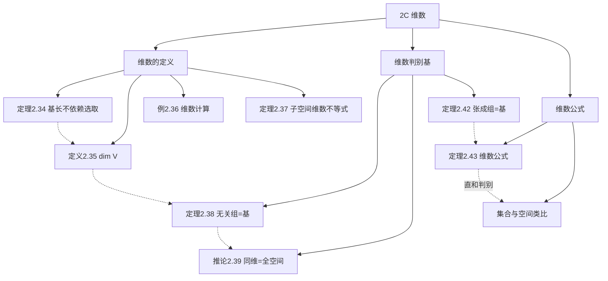

# 2C 维数

> [!abstract] 本节概览
> 本节引入向量空间最核心的不变量——==维数==（dimension）。维数是连接基的抽象理论与具体计算之间的桥梁，它将"基有多少个向量"这一信息提炼为一个整数，使得我们可以用数的大小关系来推理空间的结构。
>
> **逻辑链条**：基的长度不依赖选取 → 定义维数 → 维数判别基的两个充要条件 → 子空间维数公式
>
> **前置依赖**：[[2A 张成空间和线性无关性]]（定理 2.22 长度比较）、[[2B 基]]（定义 2.26、定理 2.30/2.32）
>
> **核心主线**：维数是向量空间的"DNA"——同构的空间有相同的维数，维数不同的空间不可能同构

---

## 一、维数的定义

> [!thm] 定理 2.34 基的长度不依赖于基的选取
> 有限维向量空间的任意两个基都有相同的长度。

> [!abstract] 证明思路
> **[双向长度比较]**：
>
> 设 $B_1$ 和 $B_2$ 是 $V$ 的两个基。
>
> - $B_1$ 线性无关，$B_2$ 张成 $V$ ⟹ $|B_1| \leq |B_2|$（由 [[2A 张成空间和线性无关性|定理 2.22]]）
> - $B_2$ 线性无关，$B_1$ 张成 $V$ ⟹ $|B_2| \leq |B_1|$（互换角色）
>
> 因此 $|B_1| = |B_2|$。$\blacksquare$

> [!def] 定义 2.35 维数
> 有限维向量空间的==维数==是这个向量空间中任意一个基的长度。
>
> 有限维向量空间 $V$ 的维数记作 $\dim V$。
>
> 规定 $\dim\{0\} = 0$。

> [!example] 例 2.36 维数计算
> | 向量空间 | 维数 | 基 |
> |---|:---:|---|
> | $\mathbb{F}^n$ | $n$ | 标准基 $(1,0,\ldots,0), \ldots, (0,\ldots,0,1)$ |
> | $\mathcal{P}_m(\mathbb{F})$ | $m+1$ | $1, z, \ldots, z^m$ |
> | $\{(x,x,y) \in \mathbb{F}^3\}$ | $2$ | $(1,1,0), (0,0,1)$ |
> | $\{(x,y,z) : x+y+z=0\}$ | $2$ | $(1,-1,0), (1,0,-1)$ |

> [!thm] 定理 2.37 子空间的维数
> 如果 $V$ 是有限维的且 $U$ 是 $V$ 的子空间，那么==$\dim U \leq \dim V$==。

> [!note] 证明
> 将 $U$ 的基看成 $V$ 中的线性无关组，$V$ 的基看成 $V$ 中的张成组，由定理 2.22 即得。

> [!important] 域的影响
> $\mathbb{R}^2$ 作为实向量空间维数为 $2$，$\mathbb{C}$ 作为复向量空间维数为 $1$。虽然 $\mathbb{R}^2$ 和 $\mathbb{C}$ 作为集合可以等同，但维数取决于==域的选取==。讨论维数时不可忽视 $\mathbb{F}$ 的影响。

---

## 二、维数判别基的充要条件

> [!thm] 定理 2.38 长度恰当的线性无关组是基
> 假设 $V$ 是有限维的。那么 $V$ 中每个长度为 $\dim V$ 的线性无关向量组都是 $V$ 的基。

> [!abstract] 证明思路
> **[扩充法的平凡情况]**：
>
> 设 $\dim V = n$，$v_1, \ldots, v_n$ 线性无关。由 [[2B 基|定理 2.32]]，可扩充为基。但基的长度为 $n$，所以扩充是平凡的——没有元素被加入。因此 $v_1, \ldots, v_n$ 已经是基。$\blacksquare$

> [!corollary] 推论 2.39 同维数子空间 = 整个空间
> 假设 $V$ 是有限维的，$U$ 是 $V$ 的子空间且 $\dim U = \dim V$。那么 $U = V$。

> [!note] 证明
> $U$ 的基是 $V$ 中长度为 $\dim V$ 的线性无关组，由定理 2.38 它是 $V$ 的基，故 $U = V$。

> [!example] 例 2.40 $\mathbb{F}^2$ 的一个基
> $(5,7), (4,3)$ 在 $\mathbb{F}^2$ 中线性无关（不成比例），$\dim\mathbb{F}^2 = 2$，由定理 2.38 直接得它是基——==无需验证张成==。

> [!example] 例 2.41 $\mathcal{P}_3(\mathbb{R})$ 的子空间的基
> 设 $U = \{p \in \mathcal{P}_3(\mathbb{R}) : p'(5) = 0\}$。
>
> **分析**：$1, (x-5)^2, (x-5)^3 \in U$（导数在 $x=5$ 处为零），且线性无关（比较最高次项系数）。
>
> 所以 $3 \leq \dim U \leq \dim\mathcal{P}_3(\mathbb{R}) = 4$（由定理 2.37）。
>
> 又 $x \notin U$（$x' = 1 \neq 0$），故 $U \neq \mathcal{P}_3(\mathbb{R})$，$\dim U \neq 4$（由推论 2.39）。
>
> 因此 $\dim U = 3$，$1, (x-5)^2, (x-5)^3$ 是 $U$ 的基（由定理 2.38）。

> [!thm] 定理 2.42 长度恰当的张成组是基
> 假设 $V$ 是有限维的。那么 $V$ 中每个长度为 $\dim V$ 的张成组都是 $V$ 的基。

> [!abstract] 证明思路
> **[削减法的平凡情况]**：
>
> 设 $\dim V = n$，$v_1, \ldots, v_n$ 张成 $V$。由 [[2B 基|定理 2.30]]，可缩减为基。但基的长度为 $n$，所以缩减是平凡的——没有元素被移除。因此 $v_1, \ldots, v_n$ 已经是基。$\blacksquare$

> [!success] 定理 2.38 和 2.42 的实用价值
> 这两个定理极大地简化了验证基的工作：
> - **定理 2.38**：已知线性无关 + 长度 = $\dim V$ ⟹ ==自动是基，无需验证张成==
> - **定理 2.42**：已知张成 + 长度 = $\dim V$ ⟹ ==自动是基，无需验证线性无关==
>
> 只需要验证基的两个条件之一，另一个"免费"获得。

---

## 三、维数公式

> [!thm] 定理 2.43 子空间之和的维数
> 如果 $V_1$ 和 $V_2$ 是一个有限维向量空间的子空间，那么
> $$\dim(V_1 + V_2) = \dim V_1 + \dim V_2 - \dim(V_1 \cap V_2)$$

> [!abstract] 证明思路
> **[分别取基再合并]**：
>
> **[步骤 1]**：取 $V_1 \cap V_2$ 的基 $v_1, \ldots, v_m$，则 $\dim(V_1 \cap V_2) = m$。
>
> **[步骤 2]**：扩充为 $V_1$ 的基 $v_1, \ldots, v_m, u_1, \ldots, u_j$，则 $\dim V_1 = m + j$。
>
> **[步骤 3]**：扩充为 $V_2$ 的基 $v_1, \ldots, v_m, w_1, \ldots, w_k$，则 $\dim V_2 = m + k$。
>
> **[关键步骤：证明合并组线性无关]**：
> 设 $a_1 v_1 + \cdots + a_m v_m + b_1 u_1 + \cdots + b_j u_j + c_1 w_1 + \cdots + c_k w_k = 0$。
>
> 将含 $w$ 的项移到右边：$c_1 w_1 + \cdots + c_k w_k = -a_1 v_1 - \cdots - b_j u_j$。
>
> 左边属于 $V_2$，右边属于 $V_1$，故属于 $V_1 \cap V_2$。因此可用 $v_1, \ldots, v_m$ 表示，由 $v_1, \ldots, v_m, w_1, \ldots, w_k$ 线性无关得所有 $c = 0$。再由 $v_1, \ldots, v_m, u_1, \ldots, u_j$ 线性无关得所有 $a = b = 0$。$\blacksquare$

> [!important] 集合与向量空间的类比
>
> | 集合 | 向量空间 |
> |---|---|
> | $S$ 是有限集 | $V$ 是有限维向量空间 |
> | $\#S$ | $\dim V$ |
> | $S_1 \cup S_2$ 是最小包含 | $V_1 + V_2$ 是最小包含 |
> | $\#(S_1 \cup S_2) = \#S_1 + \#S_2 - \#(S_1 \cap S_2)$ | $\dim(V_1 + V_2) = \dim V_1 + \dim V_2 - \dim(V_1 \cap V_2)$ |
> | $\#(S_1 \cup S_2) = \#S_1 + \#S_2 \Leftrightarrow S_1 \cap S_2 = \emptyset$ | $\dim(V_1 + V_2) = \dim V_1 + \dim V_2 \Leftrightarrow V_1 \cap V_2 = \{0\}$ |
> | 不相交集合的并 | 直和 $\oplus$ |

> [!tip] 直和的维数判别
> 由定理 2.43 和 [[1C 子空间|定理 1.46]]：
> $$V_1 + V_2 \text{ 是直和} \iff V_1 \cap V_2 = \{0\} \iff \dim(V_1 + V_2) = \dim V_1 + \dim V_2$$
>
> ==维数公式为直和的判定提供了一个计算工具==——只需比较维数，无需直接验证交集。

---

## 四、知识结构总览

---

## 五、核心思想与证明技巧

> [!success] 核心思想
> 1. **维数是不变量**：定理 2.34 保证维数不依赖基的选取——这是整个线性代数的基石。就像物体的质量不依赖你用什么秤来称。
> 2. **"半验证"策略**：定理 2.38 和 2.42 是最实用的工具——只要知道维数，只需验证线性无关或张成之一，另一个自动成立。
> 3. **维数公式 = 容斥原理**：定理 2.43 完全类比集合的容斥原理。交集被"重复计算"了一次，需要减去。
> 4. **维数是空间分类的依据**：$\dim U = \dim V$ 且 $U \subseteq V$ ⟹ $U = V$（推论 2.39）。维数严格不等的空间不可能相等。

> [!tip] 证明技巧清单
> 1. **证明 $\dim U = k$ 的标准流程**（如例 2.41）：先找 $k$ 个线性无关向量（下界），再用 $\dim U \leq \dim V$（上界），夹逼得 $\dim U = k$
> 2. **维数公式证明中的"分离变量"技巧**（定理 2.43）：将含 $w$ 的项移到等号一边，证明它属于 $V_1 \cap V_2$，从而利用交集基的线性无关性
> 3. **反证法利用推论 2.39**：要证 $U \neq V$，只需证 $\dim U < \dim V$

---

## 六、补充理解与易混淆点

### 6.1 维数的几何直觉

维数对应我们日常空间直觉中的"自由度"（OSU Ximera、UMich Lecture 4b 讲义）：

| 维数 | 几何对象 | 自由度 |
|:---:|---|---|
| $\dim = 0$ | 一个点（原点） | 无法移动 |
| $\dim = 1$ | 过原点的直线 | 沿一个方向移动 |
| $\dim = 2$ | 过原点的平面 | 沿两个独立方向移动 |
| $\dim = 3$ | 三维空间 | 沿三个独立方向移动 |
| $\dim = n$ | $n$ 维空间 | 沿 $n$ 个独立方向移动 |

==直觉：维数 = 描述空间中任意位置所需的独立参数个数==。就像描述平面上的点需要 2 个坐标，描述空间中的点需要 3 个坐标。

**来源**：OSU Ximera Bases and Dimension、UMich Lecture 4b Dimension。

### 6.2 维数公式与直和

维数公式（定理 2.43）的一个直接推论是直和的维数等于各子空间维数之和。这为判断两个子空间是否构成直和提供了计算方法（URI Math 215 讲义、MathOnline Wiki）：

$$V_1 + V_2 \text{ 是直和} \iff \dim(V_1 + V_2) = \dim V_1 + \dim V_2$$

这在具体计算中非常有用：不需要直接证明 $V_1 \cap V_2 = \{0\}$，只需分别计算三个维数。

**来源**：URI Math 215 Section 4.5、MathOnline Wiki Dimension of Sum of Subspaces。

### 6.3 常见误区

> [!danger] 误区1："维数就是向量的个数"
> ❌ 错误认知：$\dim V$ 是 $V$ 中向量的个数
> ✅ 正确理解：维数是==基的长度==，即描述空间所需的==最少独立方向数==。向量空间通常包含无穷多个向量（除 $\{0\}$ 外），维数是空间的结构属性，不是元素计数

> [!danger] 误区2："$\dim(U + W) = \dim U + \dim W$ 总是成立"
> ❌ 错误认知：子空间之和的维数等于维数之和
> ✅ 正确理解：只有当 $U \cap W = \{0\}$（即直和）时才成立。一般情况下需要==减去交集的维数==（CSDN 问答、StudyX 解题分析）。例如 $U = W$ 时，$\dim(U+W) = \dim U$，而非 $2\dim U$

> [!danger] 误区3："验证基必须同时检查张成和线性无关"
> ❌ 错误认知：要证明一组向量是基，必须同时验证张成和线性无关
> ✅ 正确理解：如果已知该组的长度等于 $\dim V$，只需验证==两个条件之一==（定理 2.38 和 2.42）。这是维数概念带来的巨大简化（OSU Ximera Bases and Dimension）

**来源**：OSU Ximera Bases and Dimension、URI Math 215 Section 4.5、CSDN 和的维数与并的维数区别问答、MathOnline Wiki、Yutsumura Linear Algebra。

---

## 七、习题精选

> [!todo] 本节习题
>
> | 编号 | 标题 | 核心考点 | 难度 |
> |:---:|---|---|:---:|
> | 1 | R² 的子空间分类 | 维数与几何 | ⭐ |
> | 3 | P₄ 中条件子空间 | 求基 + 扩充 + 直和 | ⭐⭐ |
> | 8 | 平移向量的维数 | 维数下界估计 | ⭐⭐⭐ |
> | 9 | 不同次多项式组 | 次数与线性无关 | ⭐⭐ |
> | 11 | C⁶ 中四维子空间 | 交集非零 | ⭐⭐⭐ |
> | 13 | R⁹ 中五维子空间 | 交集非零 | ⭐⭐ |

### 习题 1：$\mathbb{R}^2$ 的子空间分类

> [!problem] 习题 1
> 证明：$\mathbb{R}^2$ 的子空间恰有 $\{0\}$、$\mathbb{R}^2$ 中所有过原点的直线、以及 $\mathbb{R}^2$ 本身。

> [!faq]- 查看解答
> 设 $U$ 是 $\mathbb{R}^2$ 的子空间。由定理 2.25，$U$ 是有限维的。由定理 2.37，$\dim U \leq \dim\mathbb{R}^2 = 2$。
>
> - $\dim U = 0$：$U = \{0\}$
> - $\dim U = 1$：$U$ 有一组基 $\{v\}$（单个非零向量），$U = \text{span}(v)$ 是过原点的直线
> - $\dim U = 2$：由推论 2.39，$U = \mathbb{R}^2$
>
> 没有其他可能。$\blacksquare$

### 习题 3：$\mathcal{P}_4(\mathbb{F})$ 中条件子空间

> [!problem] 习题 3
> (a) 令 $U = \{p \in \mathcal{P}_4(\mathbb{F}) : p(6) = 0\}$，求 $U$ 的一个基。
> (b) 将 (a) 中的基扩充为 $\mathcal{P}_4(\mathbb{F})$ 的基。
> (c) 求 $\mathcal{P}_4(\mathbb{F})$ 的一个子空间 $W$ 使得 $\mathcal{P}_4(\mathbb{F}) = U \oplus W$。

> [!faq]- 查看解答
> **(a)** $p(6) = 0$ 意味着 $6$ 是 $p$ 的根，所以 $p(x) = (x-6)q(x)$，其中 $q \in \mathcal{P}_3(\mathbb{F})$。
>
> $U = \text{span}((x-6), (x-6)^2, (x-6)^3, (x-6)^4)$。这四个多项式线性无关（次数递增），所以是 $U$ 的基。$\dim U = 4$。
>
> **(b)** $\dim\mathcal{P}_4(\mathbb{F}) = 5$，$\dim U = 4$，需要添加一个不在 $U$ 中的向量。$1 \notin U$（因为 $1(6) = 1 \neq 0$），所以 $\{(x-6), (x-6)^2, (x-6)^3, (x-6)^4, 1\}$ 是 $\mathcal{P}_4(\mathbb{F})$ 的基。
>
> **(c)** 取 $W = \text{span}(1) = \{c : c \in \mathbb{F}\}$（常数多项式）。$\dim W = 1$，$\dim U + \dim W = 5 = \dim\mathcal{P}_4(\mathbb{F})$，且 $U \cap W = \{0\}$（非常数多项式的根为 $6$，常数多项式无根或恒为零）。所以 $\mathcal{P}_4(\mathbb{F}) = U \oplus W$。$\blacksquare$

### 习题 8：平移向量的维数下界

> [!problem] 习题 8
> 设 $v_1, \ldots, v_m$ 在 $V$ 中线性无关，$w \in V$。证明 $\dim\text{span}(v_1+w, \ldots, v_m+w) \geq m-1$。

> [!faq]- 查看解答
> **证明**：令 $u_k = v_k + w$，则 $u_k - u_j = v_k - v_j$。
>
> 特别地，$u_2 - u_1 = v_2 - v_1, \ldots, u_m - u_1 = v_m - v_1$。
>
> 所以 $v_2 - v_1, \ldots, v_m - v_1 \in \text{span}(u_1, \ldots, u_m)$。
>
> 这 $m-1$ 个向量线性无关（因为 $v_1, \ldots, v_m$ 线性无关：若 $\sum_{k=2}^m a_k(v_k-v_1)=0$，则 $(-\sum a_k)v_1 + \sum_{k=2}^m a_k v_k = 0$，得所有 $a_k = 0$）。
>
> 因此 $\dim\text{span}(u_1, \ldots, u_m) \geq m - 1$。$\blacksquare$

### 习题 9：不同次多项式组

> [!problem] 习题 9
> 设 $m$ 是一正整数，$p_0, p_1, \ldots, p_m \in \mathcal{P}(\mathbb{F})$，其中 $p_k$ 的次数为 $k$。证明 $p_0, p_1, \ldots, p_m$ 是 $\mathcal{P}_m(\mathbb{F})$ 的基。

> [!faq]- 查看解答
> **证明**：$p_0, \ldots, p_m$ 共 $m+1$ 个向量，而 $\dim\mathcal{P}_m(\mathbb{F}) = m+1$。由定理 2.42，只需证它们张成 $\mathcal{P}_m(\mathbb{F})$。
>
> 对 $k$ 做归纳：$p_0$ 次数为 $0$（非零常数），张成 $\mathcal{P}_0(\mathbb{F})$。
>
> 假设 $p_0, \ldots, p_{k-1}$ 张成 $\mathcal{P}_{k-1}(\mathbb{F})$。因为 $p_k$ 次数为 $k$，所以 $p_k \notin \mathcal{P}_{k-1}(\mathbb{F}) = \text{span}(p_0, \ldots, p_{k-1})$。由 [[2A 张成空间和线性无关性|习题 13]]，$p_0, \ldots, p_k$ 线性无关。
>
> 但我们需要张成。更直接地：由定理 2.38，只需证线性无关。
>
> 设 $a_0 p_0 + \cdots + a_m p_m = 0$。比较最高次项：$p_m$ 次数为 $m$ 且系数非零，而 $p_0, \ldots, p_{m-1}$ 次数至多为 $m-1$，所以 $a_m = 0$。递推得所有 $a_k = 0$。$\blacksquare$

### 习题 13：$\mathbb{R}^9$ 中五维子空间的交集

> [!problem] 习题 13
> 设 $U$ 和 $W$ 都是 $\mathbb{R}^9$ 的五维子空间。证明 $U \cap W \neq \{0\}$。

> [!faq]- 查看解答
> **证明**：由维数公式（定理 2.43）：
> $$\dim(U + W) = \dim U + \dim W - \dim(U \cap W) = 5 + 5 - \dim(U \cap W) = 10 - \dim(U \cap W)$$
>
> 又 $U + W \subseteq \mathbb{R}^9$，所以 $\dim(U + W) \leq 9$。
>
> 因此 $10 - \dim(U \cap W) \leq 9$，即 $\dim(U \cap W) \geq 1$。
>
> 所以 $U \cap W$ 至少是一维的，$U \cap W \neq \{0\}$。$\blacksquare$

---

## 八、视频学习指南

> [!info] 视频资源
>
> | 视频主题 | 对应笔记模块 | 平台 |
> |---|---|---|
> | 维数的定义与性质 | 一、维数的定义 | B站 |
> | 维数判别基 | 二、维数判别基的充要条件 | B站 |
> | 维数公式 | 三、维数公式 | B站 |

> [!info] 视频精要
> 暂无对应视频的详细精要。建议在学习时关注以下要点：
> - 定理 2.34 的证明极其简洁——双向使用定理 2.22
> - 定理 2.38/2.42 的"半验证"策略是考试中最常用的工具
> - 维数公式（2.43）的证明是"分别取基再合并"的标准范式
> - 集合与向量空间的类比表有助于直觉理解

---

## 九、教材原文
#学习/线性代数/有限维向量空间/维数
