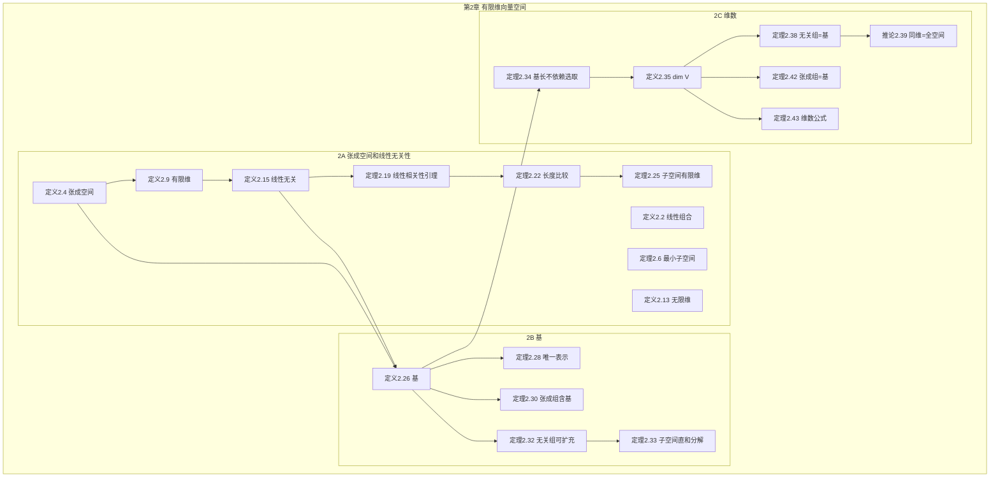
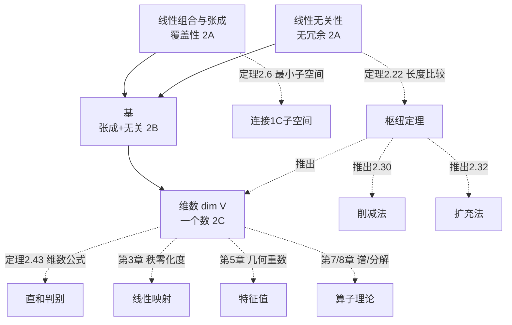

# 第 2 章 有限维向量空间 — 章节汇总

> [!abstract] 全章概览
> 第 2 章是线性代数的"骨架"——在第一章建立的向量空间基础上，引入了==张成==、==线性无关==、==基==和==维数==四个核心概念，构成了有限维线性代数的完整理论框架。全章三节构成一条从"组合方式"到"空间度量"的递进链条：
>
> **组合与筛选**（2A：张成空间 + 线性无关）→ **最优结构**（2B：基）→ **数值不变量**（2C：维数）
>
> **核心主线**：从"向量如何组合"到"空间有多大"——维数是贯穿后续所有章节的核心不变量

---

## 一、全章知识框架思维导图

---

## 二、全章核心知识点与重点公式汇总

### 2.1 张成空间和线性无关性（[[2A 张成空间和线性无关性]]）

| 定理/定义 | 内容 | 编号 |
|:---|:---|:---:|
| ==**线性组合**== | $a_1 v_1 + \cdots + a_m v_m$ | 2.2 |
| ==**张成空间**== | $\text{span}(v_1, \ldots, v_m) = \{a_1 v_1 + \cdots + a_m v_m\}$ | 2.4 |
| ==**最小子空间**== | 张成空间是最小的包含该向量组的子空间 | 2.6 |
| 有限维 | 可被某个有限向量组张成 | 2.9 |
| $\mathcal{P}(\mathbb{F})$ | 系数在 $\mathbb{F}$ 中的全体多项式 | 2.10 |
| 无限维 | 不能被任何有限向量组张成 | 2.13 |
| ==**线性无关**== | $a_1 v_1 + \cdots + a_m v_m = 0 \Rightarrow a_i = 0$ | 2.15 |
| 线性相关 | 存在非平凡的线性依赖关系 | 2.17 |
| ==**线性相关性引理**== | 冗余向量可追溯到前面的向量 | 2.19 |
| ==**长度比较定理**== | 线性无关组长度 $\leq$ 张成组长度 | 2.22 |
| 子空间有限维 | 有限维空间的子空间也是有限维的 | 2.25 |

### 2.2 基（[[2B 基]]）

| 定理/定义 | 内容 | 编号 |
|:---|:---|:---:|
| ==**基**== | 线性无关 + 张成 | 2.26 |
| ==**唯一表示**== | 基 $\Leftrightarrow$ 每个向量有唯一的线性组合表示 | 2.28 |
| ==**张成组含基**== | 每个张成组可缩减为基（削减法） | 2.30 |
| 有限维必有基 | 推论 2.31 | 2.31 |
| ==**无关组可扩充**== | 每个线性无关组可扩充为基（扩充法） | 2.32 |
| 子空间直和分解 | $V = U_1 + \cdots + U_m$ 时存在反映分解的基 | 2.33 |

### 2.3 维数（[[2C 维数]]）

| 定理/定义 | 内容 | 编号 |
|:---|:---|:---:|
| ==**基长不依赖选取**== | 任意两个基长度相同 | 2.34 |
| ==**维数**== | $\dim V$ = 任意基的长度 | 2.35 |
| 子空间维数不等式 | $\dim U \leq \dim V$ | 2.37 |
| ==**无关组=基**== | 长度为 $\dim V$ 的线性无关组是基 | 2.38 |
| ==**同维=全空间**== | $\dim U = \dim V$ 且 $U \subseteq V$ $\Rightarrow$ $U = V$ | 2.39 |
| ==**张成组=基**== | 长度为 $\dim V$ 的张成组是基 | 2.42 |
| ==**维数公式**== | $\dim(V_1+V_2) = \dim V_1 + \dim V_2 - \dim(V_1 \cap V_2)$ | 2.43 |

---

## 三、章节学习脉络梳理

### 3.1 第一层：组合与筛选——张成与线性无关（2A）

**核心问题**：向量如何组合？哪些组合是"有信息量的"？

- ==线性组合==是向量运算的基本方式（定义 2.2）
- ==张成空间==回答"这组向量能覆盖多大范围"（定义 2.4、定理 2.6）
- ==有限维 vs 无限维==区分了本书的主要研究对象和边缘情况
- ==线性无关==回答"这组向量有没有冗余"（定义 2.15）
- ==线性相关性引理==（定理 2.19）提供了剔除冗余向量的系统方法
- ==长度比较定理==（定理 2.22）是全章的理论基石——它蕴含了基长度的唯一性和维数的良定义性

**关键收获**：张成和线性无关是一对"对偶"概念——张成关注"够不够大"，线性无关关注"有没有冗余"。两者的交汇点就是"基"。

### 3.2 第二层：最优结构——基（2B）

**核心问题**：什么样的向量组能"完美地"描述一个空间？

- ==基== = 张成 + 线性无关 = "恰好合适"的向量组（定义 2.26）
- ==唯一表示==（定理 2.28）：基为空间建立"坐标系"，每个向量有唯一的坐标
- ==削减法==（定理 2.30）：从"太多"的向量中逐步移除冗余，得到基
- ==扩充法==（定理 2.32）：从"太少"的向量中逐步添加独立向量，得到基
- ==子空间直和分解==（定理 2.33）：空间的和可以由"整齐"的基来反映

**关键收获**：基是连接抽象向量空间和具体数组表示的桥梁。选定基后，每个向量对应唯一的坐标——这是矩阵表示（第 3 章）的基础。

### 3.3 第三层：数值不变量——维数（2C）

**核心问题**：如何用"一个数"来刻画空间的大小？

- ==维数不依赖基的选取==（定理 2.34）：这是整个理论的基石
- ==半验证策略==（定理 2.38/2.42）：已知维数时，只需验证张成或线性无关之一
- ==同维子空间=全空间==（推论 2.39）：维数是空间分类的依据
- ==维数公式==（定理 2.43）：$\dim(V_1+V_2) = \dim V_1 + \dim V_2 - \dim(V_1 \cap V_2)$，类比集合的容斥原理

**关键收获**：维数是向量空间最核心的不变量。后续章节中，零空间的维数（零化度）、值域的维数（秩）、特征空间的维数（几何重数）等都是维数概念的具体应用。

### 3.4 三节之间的深层联系

#### 3.4.1 从"两个概念"到"一个数"的浓缩

第 2 章的三节构成了一条==信息浓缩==的链条：

$$\underbrace{\text{张成} + \text{线性无关}}_{\text{2A：两个概念}} \longrightarrow \underbrace{\text{基}}_{\text{2B：一个结构}} \longrightarrow \underbrace{\dim V}_{\text{2C：一个数}}$$

这条链条的本质是：==基是张成和线性无关的交集，维数是基的长度==。每一步都在"压缩"信息——从两个条件到一个结构，再到一个整数。

#### 3.4.2 长度比较定理（2.22）的枢纽地位

定理 2.22 是第 2 章中==最核心的定理==，它是所有后续结果的源头：

| 由 2.22 直接推出 | 证明方式 |
|---|---|
| 基的长度不依赖选取（2.34） | 双向使用 2.22 |
| 张成组含基（2.30） | 削减时不会缩减到空 |
| 无关组可扩充（2.32） | 扩充时不会超过张成组长度 |
| 子空间有限维（2.25） | 逐步构造的无关组有上界 |

理解定理 2.22 的"逐步替换法"证明，是掌握整个第 2 章的关键。

#### 3.4.3 维数公式与直和

维数公式（定理 2.43）将第 1 章的直和理论与第 2 章的维数理论完美连接：

$$V_1 + V_2 \text{ 是直和} \iff \dim(V_1 + V_2) = \dim V_1 + \dim V_2$$

这为直和的判定提供了一个==计算工具==——不需要直接证明交集为零，只需计算三个维数。

### 3.5 全章核心线索图

---

## 四、补充理解与跨章展望

### 4.1 第 2 章的核心方法论

第 2 章不仅引入了概念，更建立了一套==方法论==，这套方法在后续每一章中都会反复使用（WWU Chapter 2 Finite-Dimensional Vector Spaces 讲义、OSU Ximera Dimension and Bases）：

1. **"半验证"策略**：已知维数时，只需验证基的两个条件之一。这是第 3 章证明零空间/值域维数、第 5 章证明特征空间维数的基本工具。
2. **"夹逼法"求维数**：先找下界（构造线性无关组），再找上界（利用 $\dim U \leq \dim V$），夹逼得精确维数。这是第 3 章秩-零化度定理证明的核心技巧。
3. **"分别取基再合并"**（定理 2.43 的证明模式）：这是第 5 章特征空间分解、第 8 章广义特征空间分解的标准证明范式。

### 4.2 第 2 章与后续章节的关联地图

| 第 2 章概念 | 后续章节中的深化 |
|---|---|
| 张成空间 $\text{span}$ | 第 3 章：值域 $\text{range}\,T = \text{span}(Tv_1, \ldots, Tv_n)$ |
| 线性无关 | 第 3 章：单射 $\Leftrightarrow$ 零空间只有零向量 |
| 基 | 第 3 章：矩阵表示 $\mathcal{M}(T)$ 依赖基的选取 |
| 基的扩充法 | 第 3 章：秩-零化度定理的证明 |
| 基不唯一 | 第 3 章：不同基给出不同矩阵 → 相似性 |
| $\dim V = n$ | 第 3 章：$\dim\mathcal{L}(V,W) = (\dim V)(\dim W)$ |
| 推论 2.39（同维=全空间） | 第 3 章：单射+满射 $\Leftrightarrow$ 同构 |
| 维数公式 2.43 | 第 3 章：秩-零化度定理 $\dim\text{null}\,T + \dim\text{range}\,T = \dim V$ |
| 子空间直和分解（2.33） | 第 5 章：特征空间分解、第 7 章：谱定理、第 8 章：广义特征空间分解 |

### 4.3 为什么第 2 章是全书最重要的章节？

第 2 章建立的"张成—无关—基—维数"理论框架，是后续==每一章的理论基础==：

- **第 3 章（线性映射）**：用基定义矩阵表示，用维数证明秩-零化度定理
- **第 4 章（多项式）**：$\mathcal{P}(\mathbb{F})$ 的维数理论
- **第 5 章（特征值）**：特征空间的维数（几何重数）$\leq$ 特征值的重数（代数重数）
- **第 6 章（内积空间）**：正交基、Gram-Schmidt 正交化
- **第 7 章（自伴算子）**：谱定理中的正交直和分解
- **第 8 章（算子）**：广义特征空间分解 $V = G(\lambda_1, T) \oplus \cdots \oplus G(\lambda_m, T)$

可以毫不夸张地说：==没有第 2 章的基础，后续所有章节都无法展开==。

**来源**：WWU Chapter 2 Finite-Dimensional Vector Spaces 讲义、OSU Ximera Dimension and Bases、Axler LADR4e Slides、UConn Math 2210 Section 4.5 讲义。

---

## 五、全章总复习题

> [!info] 使用说明
> 以下复习题覆盖第 2 章全部三节的核心知识点。建议在不查阅笔记的情况下独立完成，然后对照答案自评。

### A. 张成与线性无关（2A）

**A1**. 设 $v_1, v_2, v_3 \in \mathbb{R}^3$ 线性无关。证明 $v_1 + v_2, v_2 + v_3, v_3 + v_1$ 也线性无关。

查看解答

设 $a(v_1+v_2) + b(v_2+v_3) + c(v_3+v_1) = 0$。

展开：$(a+c)v_1 + (a+b)v_2 + (b+c)v_3 = 0$。

由 $v_1, v_2, v_3$ 线性无关，得方程组：
$$a + c = 0, \quad a + b = 0, \quad b + c = 0$$

由此 $a = -c$，$b = -a = c$，$b + c = 2c = 0$，故 $c = 0$，从而 $a = b = 0$。$\blacksquare$

**A2**. 证明：若 $v \in \text{span}(v_1, \ldots, v_m)$，则 $\text{span}(v_1, \ldots, v_m) = \text{span}(v_1, \ldots, v_{m-1}, v)$。

查看解答

($\supseteq$)：$v \in \text{span}(v_1, \ldots, v_m)$，所以 $v$ 可用 $v_1, \ldots, v_m$ 表示。因此 $\text{span}(v_1, \ldots, v_{m-1}, v) \subseteq \text{span}(v_1, \ldots, v_m)$。

($\subseteq$)：$v_m$ 可用 $v$ 和 $v_1, \ldots, v_{m-1}$ 表示（因为 $v \in \text{span}(v_1, \ldots, v_m)$，由线性相关性引理或直接展开），所以 $\text{span}(v_1, \ldots, v_m) \subseteq \text{span}(v_1, \ldots, v_{m-1}, v)$。$\blacksquare$

### B. 基（2B）

**B1**. 证明：若 $n$ 维向量空间中 $n+1$ 个向量张成 $V$，则移除其中任意一个后剩余的 $n$ 个向量仍张成 $V$。

查看解答

设 $v_1, \ldots, v_{n+1}$ 张成 $V$。任取 $v_k$，需证 $v_1, \ldots, v_{k-1}, v_{k+1}, \ldots, v_{n+1}$ 仍张成 $V$。

反证：若不张成 $V$，则存在 $w \notin \text{span}(v_1, \ldots, \hat{v_k}, \ldots, v_{n+1})$（帽子表示去掉）。但 $w \in V = \text{span}(v_1, \ldots, v_{n+1})$，所以 $w$ 可用全部 $n+1$ 个向量表示。在这个表示中 $v_k$ 的系数必须非零（否则 $w$ 就在不包含 $v_k$ 的张成空间中）。由线性相关性引理，$v_k$ 可用其余向量表示，矛盾。$\blacksquare$

**B2**. 设 $U$ 是 $\mathbb{F}^5$ 的三维子空间。证明：存在无穷多个不同的二维子空间 $W$ 使得 $U \cap W = \{0\}$。

查看解答

取 $U$ 的基 $u_1, u_2, u_3$，扩充为 $\mathbb{F}^5$ 的基 $u_1, u_2, u_3, w_1, w_2$。

对任意 $a \in \mathbb{F}^*$（非零标量），令 $W_a = \text{span}(w_1, w_2 + a u_1)$。

- $\dim W_a = 2$（$w_1$ 和 $w_2 + a u_1$ 不成比例）
- $W_a \cap U = \{0\}$：若 $c_1 w_1 + c_2(w_2 + a u_1) \in U$，则 $c_1 w_1 + c_2 w_2 + c_2 a u_1 \in U$。由于 $w_1, w_2$ 不在 $U$ 中（它们与 $u_1, u_2, u_3$ 构成基），必须有 $c_1 = c_2 = 0$。

不同的 $a$ 给出不同的 $W_a$（因为 $w_2 + a u_1 \neq w_2 + a' u_1$ 当 $a \neq a'$）。$\blacksquare$

### C. 维数（2C）

**C1**. 设 $U$ 和 $W$ 是 $\mathbb{R}^7$ 的子空间，$\dim U = 4$，$\dim W = 3$。证明 $U \cap W \neq \{0\}$。

查看解答

由维数公式：$\dim(U + W) = 4 + 3 - \dim(U \cap W) = 7 - \dim(U \cap W)$。

又 $U + W \subseteq \mathbb{R}^7$，所以 $\dim(U + W) \leq 7$。

因此 $7 - \dim(U \cap W) \leq 7$，即 $\dim(U \cap W) \geq 0$。

但这只给出 $\dim(U \cap W) \geq 0$，不够强。更精确地：$\dim(U + W) \leq 7$，所以 $7 - \dim(U \cap W) \leq 7$，得 $\dim(U \cap W) \geq 0$。

等等，这不对。让我重新计算：$4 + 3 - \dim(U \cap W) \leq 7$，即 $7 - \dim(U \cap W) \leq 7$，即 $\dim(U \cap W) \geq 0$。这不够。

实际上，$\dim(U + W) \leq 7$ 总是成立的，所以这个不等式不给出新信息。需要更强的约束。

正确的方法：$\dim(U + W) \leq \dim\mathbb{R}^7 = 7$，而 $\dim(U + W) = 4 + 3 - \dim(U \cap W) = 7 - \dim(U \cap W)$。所以 $7 - \dim(U \cap W) \leq 7$，即 $\dim(U \cap W) \geq 0$。

这确实不够。反例：取 $U = \{(x_1,\ldots,x_7) : x_5=x_6=x_7=0\}$（维数 4），$W = \{(x_1,\ldots,x_7) : x_1=x_2=x_3=x_4=0\}$（维数 3）。$U \cap W = \{0\}$，$U + W = \mathbb{R}^7$。

**结论：命题为假。** 当 $\dim U + \dim W = \dim V$ 时，可以 $U \cap W = \{0\}$。只有当 $\dim U + \dim W > \dim V$ 时才能保证交集非零。

**C2**. 设 $V_1, V_2$ 是 $V$ 的子空间。证明：$V = V_1 \oplus V_2$ 当且仅当 $V$ 中每个向量 $v$ 都可以唯一地写成 $v = v_1 + v_2$，其中 $v_1 \in V_1$，$v_2 \in V_2$。

查看解答

($\Rightarrow$)：$V = V_1 + V_2$ 保证存在性，直和保证唯一性（[[1C 子空间|定义 1.41]]）。

($\Leftarrow$)：$V = V_1 + V_2$ 由存在性保证。唯一性 ⟹ $\mathbf{0}$ 只有唯一分解 $\mathbf{0} = \mathbf{0} + \mathbf{0}$，由 [[1C 子空间|定理 1.45]] 得直和。$\blacksquare$

### D. 跨节综合题

**D1**. 设 $\dim V = n$，$v_1, \ldots, v_k \in V$ 线性无关，$w_1, \ldots, w_m \in V$ 张成 $V$。证明 $k \leq m$。如果 $k = m$，证明 $v_1, \ldots, v_k$ 也是 $V$ 的基。

查看解答

$k \leq m$：直接由 [[2A 张成空间和线性无关性|定理 2.22]]。

若 $k = m = n$（因为 $\dim V = n$ 且 $w_1, \ldots, w_m$ 张成 $V$，所以 $m \geq n$；又 $k \leq m$ 且 $k \leq n$），则 $v_1, \ldots, v_k$ 是长度为 $\dim V$ 的线性无关组，由 [[2C 维数|定理 2.38]] 是 $V$ 的基。$\blacksquare$

**D2**. 设 $U$ 是 $\mathcal{P}_4(\mathbb{R})$ 的子空间，$U = \{p \in \mathcal{P}_4(\mathbb{R}) : p(1) = p(2) = p(3)\}$。求 $\dim U$。

查看解答

条件 $p(1) = p(2) = p(3)$ 等价于 $1$ 和 $2$ 都是 $p' $ 的根（Rolle 定理），即 $p'(x) = (x-1)(x-2)q(x)$，其中 $\deg q \leq 1$。

所以 $p'(x) = a(x-1)(x-2) + b(x-1)(x-2)x$... 更直接地：

$p(1) = p(2)$ ⟹ $p' $ 在 $(1,2)$ 内有根（Rolle）。$p(2) = p(3)$ ⟹ $p' $ 在 $(2,3)$ 内有根。

但这是分析工具。用代数方法：

$U = \{p \in \mathcal{P}_4(\mathbb{R}) : p(1) = p(2) = p(3)\}$ 是两个线性条件的交集，所以 $\dim U \geq 5 - 2 = 3$。

构造线性无关组：$(x-1)(x-2)(x-3)$、$(x-1)(x-2)(x-3)x$、$(x-1)(x-2)(x-3)x^2$ 都在 $U$ 中（在 $x=1,2,3$ 处值为零，所以 $p(1)=p(2)=p(3)=0$）。它们线性无关（次数分别为 3, 4, 5... 等等，$\mathcal{P}_4$ 中最高次数为 4）。

重新构造：$1$（常数，$p(1)=p(2)=p(3)=1$ ✓）、$(x-1)(x-2)(x-3)$（三次，满足条件）、$(x-1)(x-2)(x-3)x$（四次，满足条件）。

这三个线性无关（次数递增），所以 $\dim U \geq 3$。又 $\dim U \leq 5 - 2 = 3$（两个独立线性条件最多降低 2 维）。所以 $\dim U = 3$。$\blacksquare$

---

## 六、各节笔记索引

| 节 | 笔记链接 | 核心主题 |
|:---:|:---|:---|
| 2A | [[2A 张成空间和线性无关性]] | ==张成空间==、==线性无关==、长度比较定理 |
| 2B | [[2B 基]] | ==基==、唯一表示、削减法、扩充法 |
| 2C | [[2C 维数]] | ==维数==、半验证策略、维数公式 |

---

## 七、全章核心公式

> [!success] 必须熟记的公式与定理

1. **张成空间**（定义 2.4）：$\text{span}(v_1, \ldots, v_m) = \{a_1 v_1 + \cdots + a_m v_m : a_i \in \mathbb{F}\}$
2. **线性无关**（定义 2.15）：$a_1 v_1 + \cdots + a_m v_m = 0 \Rightarrow a_i = 0$
3. ==**长度比较定理**==（定理 2.22）：线性无关组长度 $\leq$ 张成组长度
4. **基**（定义 2.26）：线性无关 + 张成
5. **唯一表示**（定理 2.28）：基 $\Leftrightarrow$ 每个向量有唯一的线性组合表示
6. ==**$\dim V$**==（定义 2.35）：任意基的长度
7. ==**半验证策略**==（定理 2.38/2.42）：长度 = $\dim V$ 时，只需验证张成或线性无关之一
8. ==**维数公式**==（定理 2.43）：$\dim(V_1+V_2) = \dim V_1 + \dim V_2 - \dim(V_1 \cap V_2)$

> [!warning] 易错提醒
> - 定理 2.22 是全章的枢纽——几乎所有重要结果都由它推出
> - 维数依赖域的选取：$\dim_\mathbb{R}\mathbb{C} = 2$，$\dim_\mathbb{C}\mathbb{C} = 1$
> - 维数公式仅适用于==两个==子空间，三个子空间的公式更复杂（习题 19/20）
> - $\dim\{0\} = 0$，零空间有基（空组），维数为零

#学习/线性代数/有限维向量空间
