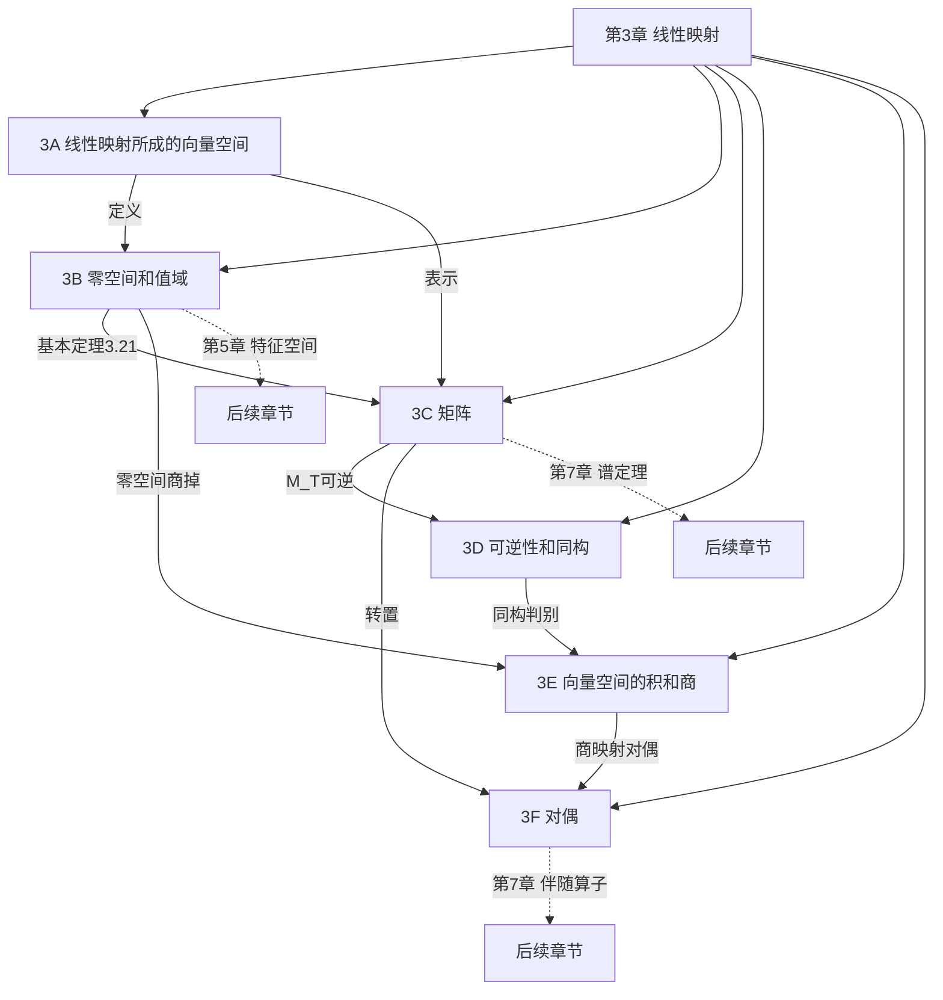
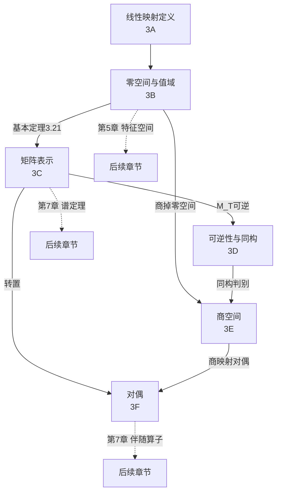

# 第 3 章 线性映射 — 章节汇总

> [!abstract] 全章概览
> 第 3 章是线性代数的"操作手册"——它将第 1-2 章建立的向量空间理论从"静态结构"推向"动态变换"。本章引入==线性映射==作为核心研究对象，证明所有线性映射的集合本身构成向量空间，建立零空间与值域的基本定理（秩-零化度定理），通过矩阵将抽象映射转化为具体计算，最终以对偶理论揭示映射与其"镜像"之间的深刻对称性。
>
> **逻辑链条**：线性映射定义 → $L(V,W)$ 是向量空间 → 零空间/值域 → ==基本定理== → 矩阵表示 $\mathcal{M}(T)$ → 矩阵运算 → 列秩=行秩 → 可逆性/同构 → 换基公式 → 直积/商空间 → 对偶空间 → 对偶映射 → 零化子 → ==双重对偶==
>
> **核心主线**：线性映射是向量空间之间的"结构保持映射"，矩阵是其坐标化身，对偶是其"镜像"

---

## 一、全章知识框架思维导图

---

## 二、全章核心知识点与重点公式汇总

### 2.1 线性映射所成的向量空间（[[3A 线性映射所成的向量空间]]）

| 定理/定义 | 内容 | 编号 |
|:---|:---|:---:|
| ==**线性映射**== | $T(u+v)=Tu+Tv$，$T(\lambda v)=\lambda(Tv)$，对所有 $u,v\in V$，$\lambda\in\mathbb{F}$ | 3.1 |
| 代数运算 | $(S+T)(v)=Sv+Tv$，$(\lambda T)(v)=\lambda(Tv)$ | 3.2-3.4 |
| ==**线性映射引理**== | 基上的值唯一确定线性映射（存在性+唯一性） | 3.4 |
| $L(V,W)$ 是向量空间 | 线性映射对加法和标量乘法封闭 | 3.5-3.7 |
| $\dim L(V,W)=(\dim V)(\dim W)$ | 通过 $\mathcal{M}$ 是同构证明 | 3.9 |
| 乘积运算 | $(ST)(v)=S(Tv)$，一般 $ST\neq TS$ | 3.11 |

### 2.2 零空间和值域（[[3B 零空间和值域]]）

| 定理/定义 | 内容 | 编号 |
|:---|:---|:---:|
| ==**零空间**== $\text{null}\,T$ | $\{v\in V : Tv=0\}$，是 $V$ 的子空间 | 3.12 |
| ==**值域**== $\text{range}\,T$ | $\{Tv : v\in V\}$，是 $W$ 的子空间 | 3.13 |
| 单射 $\Leftrightarrow$ $\text{null}\,T=\{0\}$ | 零空间平凡是单射的充要条件 | 3.14 |
| 满射 $\Leftrightarrow$ $\text{range}\,T=W$ | 值域等于全空间是满射的充要条件 | 3.15 |
| ==**基本定理**== | $\dim V = \dim \text{null}\,T + \dim \text{range}\,T$ | 3.21 |
| 秩 | $\text{rank}\,T = \dim \text{range}\,T$ | — |
| 零化度 | $\text{nullity}\,T = \dim \text{null}\,T$ | — |

### 2.3 矩阵（[[3C 矩阵]]）

| 定理/定义 | 内容 | 编号 |
|:---|:---|:---:|
| ==**矩阵**== | $m\times n$ 的 $\mathbb{F}$ 上元素阵列 | 3.29 |
| ==**$\mathcal{M}(T)$**== | 第 $k$ 列 = $Tv_k$ 在 $W$ 的基下的坐标 | 3.31 |
| 矩阵加法 | $\mathcal{M}(S+T)=\mathcal{M}(S)+\mathcal{M}(T)$ | 3.34 |
| 标量乘法 | $\mathcal{M}(\lambda T)=\lambda\mathcal{M}(T)$ | 3.36 |
| $\mathbb{F}^{m,n}$ | $m\times n$ 矩阵全体，是向量空间 | 3.39 |
| $\dim\mathbb{F}^{m,n}=mn$ | 标准基矩阵的个数 | 3.40 |
| ==**矩阵乘法**== | $(AB)_{j,k}=\sum_{r=1}^n A_{j,r}B_{r,k}$ | 3.41 |
| $\mathcal{M}(ST)=\mathcal{M}(S)\mathcal{M}(T)$ | 矩阵乘法的根本理由 | 3.43 |
| ==**列秩 = 行秩**== | 通过行列分解 + 转置对称性证明 | 3.57 |
| ==**$\text{rank}\,A$**== | 列秩 = 行秩（统称为秩） | 3.58 |

### 2.4 可逆性和同构（[[3D 可逆性和同构]]）

| 定理/定义 | 内容 | 编号 |
|:---|:---|:---:|
| ==**可逆**== | $\exists\,S\in L(W,V)$：$ST=I_V$ 且 $TS=I_W$ | 3.59 |
| 逆的唯一性 | $T^{-1}$ 唯一 | 3.60 |
| 可逆 $\Leftrightarrow$ 单射+满射 | 双向证明 | 3.63 |
| ==**有限维等价条件**== | $\dim V=\dim W<\infty$ 时：可逆 $\Leftrightarrow$ 单射 $\Leftrightarrow$ 满射 | 3.65 |
| $ST=I$ $\Leftrightarrow$ $TS=I$ | 有限维等维数下的单侧逆即双侧逆 | 3.68 |
| ==**同构**== | 存在可逆线性映射 $T:V\to W$ | 3.69 |
| 维数相同 $\Leftrightarrow$ 同构 | $\dim V=\dim W<\infty$ $\Leftrightarrow$ $V\cong W$ | 3.70 |
| $L(V,W)\cong\mathbb{F}^{m,n}$ | $\mathcal{M}$ 是同构 | 3.71 |
| ==**$\mathcal{M}(Tv)=\mathcal{M}(T)\mathcal{M}(v)$**== | 映射作用 = 矩阵乘法 | 3.76 |
| $\dim\text{range}\,T$ = 列秩 | 映射值域维数等于矩阵列秩 | 3.78 |
| ==**换基公式**== | $A=C^{-1}BC$（同一映射在不同基下的矩阵） | 3.84 |
| $\mathcal{M}(T^{-1})=\mathcal{M}(T)^{-1}$ | 逆映射的矩阵是逆矩阵 | 3.86 |

### 2.5 向量空间的积和商（[[3E 向量空间的积和商]]）

| 定理/定义 | 内容 | 编号 |
|:---|:---|:---:|
| ==**直积**== | $V_1\times\cdots\times V_m$，分量运算 | 3.71 |
| $\dim(V_1\times\cdots\times V_m)$ | $=\sum_{k=1}^m\dim V_k$ | 3.72 |
| 仿射子集 | $v+U=\{v+u:u\in U\}$ | 3.89 |
| ==**商空间**== $V/U$ | $\{v+U:v\in V\}$，是向量空间 | 3.91 |
| ==**商映射**== $\pi$ | $\pi:V\to V/U$，$\pi(v)=v+U$ | 3.104 |
| ==**$\dim V/U=\dim V-\dim U$**== | 商空间维数公式 | 3.105 |
| ==**诱导映射**== $\tilde{T}$ | $U\subseteq\text{null}\,T$ 时，$\tilde{T}:V/U\to W$，$\tilde{T}(v+U)=Tv$ | 3.106 |
| ==**$V/\text{null}\,T\cong\text{range}\,T$**== | 基本定理的几何版本（第一同构定理） | 3.107 |

### 2.6 对偶（[[3F 对偶]]）

| 定理/定义 | 内容 | 编号 |
|:---|:---|:---:|
| ==**线性泛函**== | $\varphi:V\to\mathbb{F}$ 的线性映射 | 3.108 |
| ==**对偶空间**== $V'$ | $L(V,\mathbb{F})$，$\dim V'=\dim V$ | 3.110-3.111 |
| ==**对偶基**== | $\varphi_j(v_k)=\delta_{jk}$，坐标提取器 | 3.112 |
| ==**对偶映射**== $T'$ | $T':W'\to V'$，$T'(\varphi)=\varphi\circ T$（方向反转！） | 3.118 |
| $(ST)'=T'S'$ | ==顺序反转== | 3.120 |
| ==**零化子**== $U^0$ | $\{\varphi\in V':\varphi(u)=0\ \forall u\in U\}$ | 3.121 |
| $\dim U^0=\dim V-\dim U$ | 零化子维数公式 | 3.125 |
| $\text{null}\,T'=(\text{range}\,T)^0$ | 对偶零空间 = 值域的零化子 | 3.128 |
| $T$ 满射 $\Leftrightarrow$ $T'$ 单射 | 对偶中单射/满射互换 | 3.129 |
| $\text{range}\,T'=(\text{null}\,T)^0$ | 对偶值域 = 零空间的零化子 | 3.130 |
| $T$ 单射 $\Leftrightarrow$ $T'$ 满射 | 对偶中单射/满射互换 | 3.131 |
| ==**$\mathcal{M}(T')=\mathcal{M}(T)^t$**== | 对偶映射的矩阵 = 转置 | 3.132 |
| ==**双重对偶**== $V''$ 与自然同构 $\Lambda$ | $\Lambda:V\to V''$，$\Lambda(v)(\varphi)=\varphi(v)$，不依赖基 | 习题 32 |

---

## 三、章节学习脉络梳理

### 3.1 第一层：定义与结构（3A）

**核心问题**：什么是线性映射？有什么结构？

- 线性映射保持加法和标量乘法——它是向量空间之间的"结构保持映射"
- $L(V,W)$ 本身是向量空间——映射也可以是"向量"，这为后续对偶理论埋下伏笔
- ==线性映射引理==（3.4）：基上的值决定整个映射，这是全章的理论起点
- $\dim L(V,W)=(\dim V)(\dim W)$：线性映射的"自由度"等于输入维数乘以输出维数

**关键收获**：线性映射是保持向量空间结构的函数，基上的"自由度"完全决定映射。映射的集合本身也是向量空间——这一事实在第 3F 节对偶理论中至关重要。

### 3.2 第二层：零空间与值域——映射的"输入输出分析"（3B）

**核心问题**：映射丢失了什么？映射覆盖了什么？

- $\text{null}\,T$：被映射到零的向量——"丢失的信息"
- $\text{range}\,T$：映射能到达的范围——"覆盖的能力"
- ==基本定理==（3.21）：$\dim V = \dim \text{null}\,T + \dim \text{range}\,T$ —— 这是全章最重要的定理
- 单射 $\Leftrightarrow$ $\text{null}\,T=\{0\}$：没有信息丢失
- 满射 $\Leftrightarrow$ $\text{range}\,T=W$：完全覆盖目标空间

**关键收获**：基本定理将映射的"输入端"（零空间）和"输出端"（值域）通过维数精确连接，是后续几乎所有重要结果的源头。

### 3.3 第三层：矩阵——映射的"坐标化身"（3C）

**核心问题**：如何用数字计算映射？

- $\mathcal{M}(T)$ 的第 $k$ 列 = $Tv_k$ 的坐标——矩阵的列蕴含了映射的全部信息
- 矩阵运算由映射运算驱动：$\mathcal{M}(S+T)=\mathcal{M}(S)+\mathcal{M}(T)$，$\mathcal{M}(ST)=\mathcal{M}(S)\mathcal{M}(T)$
- ==矩阵乘法的定义是从 $\mathcal{M}(ST)=\mathcal{M}(S)\mathcal{M}(T)$ 反推出来的==——这不是任意规定，而是必然结果
- 三种视角理解矩阵：元素视角（逐元素计算）、列视角（列的线性组合）、行视角（行向量）
- 行列分解 $A=CR$ → 列秩 = 行秩（通过转置对称性优雅证明）

**关键收获**：矩阵是线性映射的"坐标表示"，矩阵运算的意义来源于线性映射。选定基后，抽象的映射世界与具体的矩阵世界完美对应。

### 3.4 第四层：可逆性与同构——"完美对应"（3D）

**核心问题**：什么时候映射是"可逆的"？

- ==有限维等维空间中：单射 $\Leftrightarrow$ 满射 $\Leftrightarrow$ 可逆==（定理 3.65）——只需验证一个条件！
- 同构 = 维数相同的精确表述：$\dim V=\dim W$ $\Leftrightarrow$ $V\cong W$
- $\mathcal{M}(Tv)=\mathcal{M}(T)\mathcal{M}(v)$：抽象与具体的完美融合
- ==换基公式 $A=C^{-1}BC$==：同一映射在不同基下的矩阵是相似的——这是第 5 章特征值理论的出发点

**关键收获**：换基公式揭示了"相似矩阵"的本质——它们是同一个线性映射在不同坐标系下的化身。选取好基使矩阵简单，是后续章节的核心策略。

### 3.5 第五层：积与商——空间的"组装与折叠"（3E）

**核心问题**：如何从旧空间构造新空间？

- 直积：维数相加（"打包"），$\dim(V_1\times\cdots\times V_m)=\sum\dim V_k$
- 商空间：维数相减（"折叠"），$\dim V/U=\dim V-\dim U$
- 诱导映射 $\tilde{T}$：消除零空间的标准技术——当 $U\subseteq\text{null}\,T$ 时，映射"穿透"商空间
- ==$V/\text{null}\,T\cong\text{range}\,T$==：基本定理的几何版本，也称为第一同构定理

**关键收获**：商空间和直积是构造新空间的两种基本方式。标准分解 $T=\tilde{T}\circ\pi$ 揭示了任何线性映射都可以分解为"满射 $\times$ 单射"。

### 3.6 第六层：对偶——映射的"镜像世界"（3F）

**核心问题**：映射的"对偶"是什么？

- 对偶空间 $V'=L(V,\mathbb{F})$：线性泛函的空间，$\dim V'=\dim V$
- 对偶映射 $T':W'\to V'$：==方向反转！== $T:V\to W$ 变为 $T':W'\to V'$
- 零化子 $U^0$：在 $U$ 上取零的泛函，连接原空间与对偶空间的桥梁
- 单射/满射互换：$T$ 满射 $\Leftrightarrow$ $T'$ 单射；$T$ 单射 $\Leftrightarrow$ $T'$ 满射
- ==$\mathcal{M}(T')=\mathcal{M}(T)^t$==：对偶 = 转置——转置的"正确"理解方式
- 双重对偶 $V''$：自然同构 $\Lambda:V\to V''$，$\Lambda(v)(\varphi)=\varphi(v)$，==不依赖基的选取==

**关键收获**：对偶性是线性代数中最深刻的美——每个概念都有其"镜像"。$V\cong V'$ 需要选基（不自然），但 $V\cong V''$ 通过 $\Lambda$ 是自然的——这一区别在对偶理论中至关重要。

### 3.7 六节之间的深层联系

#### 3.7.1 基本定理（3.21）——全章的枢纽

基本定理 $\dim V = \dim \text{null}\,T + \dim \text{range}\,T$ 是全章最核心的定理，它串联了几乎所有重要结果：

- 推出 $\dim V/U = \dim V - \dim U$（3.105，商映射 $\pi$ 的零空间恰好是 $U$）
- 推出 $\dim U^0 = \dim V - \dim U$（3.125，通过包含映射 $i:U\to V$ 的对偶 $(\text{range}\,i)^0$）
- 推出有限维等维空间中单射 $\Leftrightarrow$ 满射（3.65，$\text{null}\,T=\{0\}$ $\Rightarrow$ $\dim\text{range}\,T=\dim V=\dim W$）
- 推出 $\dim L(V,W)=(\dim V)(\dim W)$（3.9，通过 $\mathcal{M}$ 是同构，而 $\dim\mathbb{F}^{m,n}=mn$）

#### 3.7.2 矩阵——从抽象到具体的桥梁

3C 的矩阵表示将 3A-3B 的抽象理论转化为可计算的形式：

- $\mathcal{M}(T)$ 将线性映射问题转化为矩阵问题——这是"坐标化"策略的核心
- $\mathcal{M}(Tv)=\mathcal{M}(T)\mathcal{M}(v)$ 使得映射作用 = 矩阵乘法——抽象与计算的完美统一
- 换基公式 $A=C^{-1}BC$ 揭示了"相似矩阵"的本质——同一映射的不同坐标化身
- 列秩 = 行秩通过行列分解证明，体现了矩阵的"双向对称性"

#### 3.7.3 对偶——全新的对称视角

3F 的对偶理论为全章提供了一个"镜像"：

- $T:V\to W$ 的每个性质都有 $T':W'\to V'$ 的对应性质，且方向反转
- 零化子 $U^0$ 连接了子空间理论和对偶理论——$U^0$ 是 $V'$ 的子空间，不是 $V$ 的子空间
- $\mathcal{M}(T')=\mathcal{M}(T)^t$ 将对偶理论与矩阵理论统一——转置的"正确"理解
- 双重对偶 $V''$ 的自然同构 $\Lambda$ 不依赖基——这是范畴论中"自然变换"思想的雏形

#### 3.7.4 全章核心线索图

---

## 四、补充理解与跨章展望

### 4.1 第 3 章的核心方法论

第 3 章建立的方法论在后续每一章中都会反复使用：

1. **"坐标化"策略**：选定基后，线性映射 $\to$ 矩阵，向量 $\to$ 坐标列。这使得抽象证明可以转化为矩阵计算。这是第 5-8 章中所有"矩阵语言"证明的基础。正如 UPC Barcelona Casanellas 线性映射讲义中所强调的，矩阵表示是连接抽象理论与具体计算的核心桥梁。

2. **"基本定理分解"**：$\dim V = \dim \text{null}\,T + \dim \text{range}\,T$ 将映射分解为"丢失的部分"和"保留的部分"。第 5 章中，特征空间分解 $V=G(\lambda_1,T)\oplus\cdots\oplus G(\lambda_m,T)$ 是这一思想的深化——将空间按映射的行为"分解"。Rutgers Math 320 笔记将此定理列为"维度定理"，是整个线性代数课程的核心支柱。

3. **"对偶翻转"**：$T$ 的每个性质都有 $T'$ 的对应翻转。第 7 章中，伴随算子 $T^*$ 是内积空间中的对偶推广——Riesz 表示定理将 $V'$ 与 $V$ 自然等同，使得 $T'$ 变为 $T^*$。Harvard Math 55a Elkies 讲义中特别强调了对偶性在抽象代数中的核心地位。

**来源**：UPC Barcelona Casanellas 线性映射讲义、Northeastern Dummit 线性变换讲义、Rutgers Math 320 笔记、Harvard Math 55a Elkies 对偶讲义。

### 4.2 第 3 章与后续章节的关联地图

| 第 3 章概念 | 后续章节中的深化 |
|---|---|
| 线性映射 $L(V,W)$ | 第 5 章：$L(V)$ 上的算子理论（不变子空间、特征值） |
| 基本定理 3.21 | 第 5 章：特征空间的维数之和 $\leq\dim V$ |
| 矩阵表示 $\mathcal{M}(T)$ | 第 5 章：上三角矩阵、对角矩阵——选取好基使 $\mathcal{M}(T)$ 简单 |
| 单射/满射/可逆 | 第 5 章：可对角化 $\Leftrightarrow$ 有 $\dim V$ 个线性无关特征向量 |
| 同构 | 第 5 章：$V\cong\mathbb{F}^n$（选定基后） |
| 换基公式 $A=C^{-1}BC$ | 第 5 章：相似矩阵有相同的特征值、相同的迹和行列式 |
| 商空间 $V/U$ | 第 8 章：广义特征空间分解、商算子 |
| 诱导映射 $\tilde{T}$ | 第 8 章：商算子 $\tilde{T}:V/G(\lambda,T)\to V/G(\lambda,T)$ |
| 对偶空间 $V'$ | 第 7 章：Riesz 表示定理（内积空间中 $V\cong V'$） |
| 对偶映射 $T'$ | 第 7 章：伴随算子 $T^*$（内积空间版本，$\langle Tv,w\rangle=\langle v,T^*w\rangle$） |
| 零化子 $U^0$ | 第 7 章：正交补 $U^\perp$（内积空间版本，$U^\perp=\{v:\langle v,u\rangle=0\ \forall u\in U\}$） |
| $\mathcal{M}(T')=\mathcal{M}(T)^t$ | 第 7 章：自伴算子 $\mathcal{M}(T^*)=\mathcal{M}(T)^*$（共轭转置） |
| 双重对偶 $V''$ | 第 7 章：自然同构 $\Lambda$ 被 Riesz 表示定理替代（$V\cong V'$ 变为"自然的"） |

### 4.3 为什么第 3 章是全书最重要的章节？

第 3 章建立了线性代数的三大核心工具：

- **矩阵语言**：后续所有计算都基于矩阵表示。没有第 3 章，就无法将抽象定理转化为具体算法。正如 Northeastern Dummit 线性变换讲义所指出的，矩阵是线性变换的"计算化身"，而线性变换才是第一性的概念。

- **秩-零化度定理**：这是线性代数中仅次于维数公式的第二重要等式。它连接了映射的"输入端"（零空间）和"输出端"（值域），为几乎所有维数计算提供了基本框架。BYU Math 344 讲义将其称为"Rank-Nullity Theorem"，并强调它是线性代数课程中"使用频率最高"的定理之一。

- **对偶理论**：对偶是现代数学中无处不在的思想——从泛函分析到微分几何，从表示论到量子力学。第 3 章的有限维对偶是其最简洁的入门。Northwestern 大学 dual spaces 讲义和 Clemson 大学 annihilators 讲义都强调，对偶空间和零化子是理解线性映射深层结构的关键工具。

可以毫不夸张地说：==第 3 章将第 1-2 章的"静态"向量空间理论推向了"动态"的映射理论，是线性代数从几何直觉走向代数计算的转折点==。

**来源**：UPC Barcelona Casanellas 线性映射讲义、Northeastern Dummit 线性变换讲义、Rutgers Math 320 笔记、Harvard Math 55a Elkies 对偶讲义、BYU Math 344 Rank-Nullity 讲义、Northwestern University dual spaces 讲义、Clemson University annihilators 讲义、CMU 双线性形式讲义。

---

## 五、全章总复习题

> [!info] 使用说明
> 以下复习题覆盖第 3 章全部六节的核心知识点。建议在不查阅笔记的情况下独立完成，然后对照答案自评。每题标注了考查的节次和知识点。

### A. 线性映射基础（3A）

**A1**. 证明 $T(0)=0$ 对任意线性映射 $T$ 成立。

查看解答

$T(0)=T(0+0)=T(0)+T(0)$（由可加性）。

两边减去 $T(0)$，得 $0=T(0)$。$\blacksquare$

**A2**. 若 $T\in L(V,W)$ 满足 $Tv=0$ 对所有 $v\in$ 某基成立，证明 $T=0$。

查看解答

设 $v_1,\ldots,v_n$ 是 $V$ 的基，且 $Tv_k=0$ 对所有 $k$。

对任意 $v\in V$，$v=a_1v_1+\cdots+a_nv_n$，故 $Tv=a_1Tv_1+\cdots+a_nTv_n=0$。

因此 $T=0$（零映射）。$\blacksquare$

### B. 零空间与值域（3B）

**B1**. 设 $T:\mathbb{F}^4\to\mathbb{F}^3$，$T(x_1,x_2,x_3,x_4)=(x_1+x_2,\ x_2+x_3,\ x_3+x_4)$。求 $\text{null}\,T$ 和 $\text{range}\,T$，验证基本定理。

查看解答

**求 $\text{null}\,T$**：$Tv=0$ 即
$$x_1+x_2=0,\quad x_2+x_3=0,\quad x_3+x_4=0$$

由第一个方程 $x_1=-x_2$；由第二个 $x_3=-x_2$；由第三个 $x_4=-x_3=x_2$。

所以 $\text{null}\,T=\{(-a,\,a,\,-a,\,a):a\in\mathbb{F}\}=\text{span}((-1,1,-1,1))$，$\dim\text{null}\,T=1$。

**求 $\text{range}\,T$**：$T(e_1)=(1,0,0)$，$T(e_2)=(1,1,0)$，$T(e_3)=(0,1,1)$，$T(e_4)=(0,0,1)$。

$\text{range}\,T=\text{span}((1,0,0),(1,1,0),(0,1,1),(0,0,1))$。

注意到 $(1,0,0),(0,1,0),(0,0,1)$ 都在值域中（例如 $(0,1,0)=(1,1,0)-(1,0,0)$），所以 $\text{range}\,T=\mathbb{F}^3$，$\dim\text{range}\,T=3$。

**验证**：$\dim\text{null}\,T+\dim\text{range}\,T=1+3=4=\dim\mathbb{F}^4$。$\blacksquare$

**B2**. 设 $\dim V=5$，$\dim\text{null}\,T=2$。证明 $T$ 不是满射，并求 $\dim\text{range}\,T$。

查看解答

由基本定理：$\dim\text{range}\,T=\dim V-\dim\text{null}\,T=5-2=3$。

若 $T$ 是满射，则 $\text{range}\,T=W$，故 $\dim W=3$。但题目未给出 $\dim W$。

更准确地说：$\dim\text{range}\,T=3$。若 $\dim W>3$，则 $T$ 不是满射。

若 $\dim W=3$，则 $T$ 恰好满射。

**修正**：题目说"证明 $T$ 不是满射"需要额外条件。如果 $\dim W>3$（例如 $W=V$），则 $\dim\text{range}\,T=3<5=\dim W$，$T$ 不是满射。

一般情况下，$\dim\text{range}\,T=3$。$\blacksquare$

### C. 矩阵（3C）

**C1**. 设 $A=\begin{pmatrix}1&2\\3&4\end{pmatrix}$，$B=\begin{pmatrix}5&6\\7&8\end{pmatrix}$。计算 $AB$ 和 $BA$，验证 $AB\neq BA$。

查看解答

$$AB=\begin{pmatrix}1\cdot5+2\cdot7&1\cdot6+2\cdot8\\3\cdot5+4\cdot7&3\cdot6+4\cdot8\end{pmatrix}=\begin{pmatrix}19&22\\43&50\end{pmatrix}$$

$$BA=\begin{pmatrix}5\cdot1+6\cdot3&5\cdot2+6\cdot4\\7\cdot1+8\cdot3&7\cdot2+8\cdot4\end{pmatrix}=\begin{pmatrix}23&34\\31&46\end{pmatrix}$$

$AB\neq BA$（例如 $(AB)_{1,1}=19\neq23=(BA)_{1,1}$）。$\blacksquare$

**C2**. 设 $3\times 2$ 矩阵 $A$ 的列线性无关。证明 $\text{rank}\,A=2$，并给出 $A$ 的行列分解。

查看解答

$\text{rank}\,A$ = 列秩 = $A$ 的列空间的维数。两列线性无关，故列秩 $=2$。

**行列分解**：设 $A$ 的列为 $c_1,c_2\in\mathbb{F}^3$。令 $C=\begin{pmatrix}c_1&c_2\end{pmatrix}$（$3\times 2$），$R=\begin{pmatrix}1&0\\0&1\end{pmatrix}$（$2\times 2$）。

则 $A=CR$（因为 $CR$ 的第 $k$ 列 $=C$ 的第 $k$ 列 $=c_k$）。

更一般地，若 $A$ 有 $r$ 个线性无关的列 $c_1,\ldots,c_r$，则 $A=CR$，其中 $C$ 是由这些列组成的 $m\times r$ 矩阵，$R$ 是满足 $A_{\cdot,k}=R_{1,k}c_1+\cdots+R_{r,k}c_r$ 的 $r\times n$ 矩阵。$\blacksquare$

### D. 可逆性与同构（3D）

**D1**. 设 $T:\mathbb{F}^3\to\mathbb{F}^3$，$T(x,y,z)=(2x+y,\ y+z,\ x+3z)$。判断 $T$ 是否可逆，并求 $T^{-1}$。

查看解答

**方法一（矩阵法）**：关于标准基的矩阵为
$$\mathcal{M}(T)=\begin{pmatrix}2&1&0\\0&1&1\\1&0&3\end{pmatrix}$$

$\det\mathcal{M}(T)=2(3-0)-1(0-1)+0=6+1=7\neq0$，故 $T$ 可逆。

**方法二（基本定理法）**：$\text{null}\,T=\{0\}$（因为 $\mathcal{M}(T)$ 的列线性无关），故 $T$ 单射。$\dim V=\dim W=3$，由 3.65 得 $T$ 可逆。

**求 $T^{-1}$**：设 $T^{-1}(a,b,c)=(x,y,z)$，则
$$2x+y=a,\quad y+z=b,\quad x+3z=c$$

由第一式 $y=a-2x$；代入第二式 $a-2x+z=b$，即 $z=b-a+2x$；代入第三式 $x+3(b-a+2x)=c$，即 $7x+3b-3a=c$，$x=\frac{c-3b+3a}{7}$。

$$x=\frac{3a-3b+c}{7},\quad y=a-2x=\frac{a+6b-2c}{7},\quad z=b-a+2x=\frac{-2a+2b+2c}{7}$$

所以 $T^{-1}(a,b,c)=\left(\frac{3a-3b+c}{7},\ \frac{a+6b-2c}{7},\ \frac{-2a+2b+2c}{7}\right)$。$\blacksquare$

**D2**. 设 $A$ 是 $3\times 3$ 矩阵，$AB=AC$ 且 $B\neq C$。证明 $A$ 不可逆。

查看解答

$AB=AC$ $\Rightarrow$ $A(B-C)=0$。

令 $D=B-C\neq 0$（因为 $B\neq C$），则 $AD=0$。

对应的线性映射满足 $TD=0$，即存在非零向量 $v$（$D$ 的某列）使得 $Tv=0$。

故 $\text{null}\,T\neq\{0\}$，$T$ 不是单射，由 3.65 得 $T$ 不可逆，即 $A$ 不可逆。$\blacksquare$

### E. 积与商（3E）

**E1**. 设 $\dim V=7$，$\dim U=3$。求 $\dim V/U$。

查看解答

$\dim V/U=\dim V-\dim U=7-3=4$。$\blacksquare$

**E2**. 设 $T:V\to W$ 线性，$U\subseteq\text{null}\,T$。证明存在唯一的 $S:V/U\to W$ 使得 $T=S\circ\pi$。

查看解答

**存在性**：定义 $S:V/U\to W$，$S(v+U)=Tv$。

- **良定义**：若 $v+U=v'+U$，则 $v-v'\in U\subseteq\text{null}\,T$，故 $T(v-v')=0$，即 $Tv=Tv'$。
- **线性**：$S((v+U)+(w+U))=S(v+w+U)=T(v+w)=Tv+Tw=S(v+U)+S(w+U)$。标量乘法类似。
- **满足 $T=S\circ\pi$**：$(S\circ\pi)(v)=S(v+U)=Tv$。

**唯一性**：若 $S':V/U\to W$ 也满足 $T=S'\circ\pi$，则对任意 $v+U\in V/U$：$S'(v+U)=S'(\pi(v))=(S'\circ\pi)(v)=Tv=S(v+U)$。$\blacksquare$

### F. 对偶（3F）

**F1**. 设 $V=\mathbb{F}^3$，$\varphi(x,y,z)=2x-3y+z$。求 $\varphi$ 在标准基下的对偶基表示。

查看解答

标准基 $e_1=(1,0,0)$，$e_2=(0,1,0)$，$e_3=(0,0,1)$。

对偶基 $\varphi_1,\varphi_2,\varphi_3$ 满足 $\varphi_j(e_k)=\delta_{jk}$，即 $\varphi_j$ 提取第 $j$ 个坐标：
- $\varphi_1(x,y,z)=x$
- $\varphi_2(x,y,z)=y$
- $\varphi_3(x,y,z)=z$

$\varphi(x,y,z)=2x-3y+z=2\varphi_1(x,y,z)-3\varphi_2(x,y,z)+\varphi_3(x,y,z)$。

所以 $\varphi=2\varphi_1-3\varphi_2+\varphi_3$，在标准对偶基下的坐标为 $(2,-3,1)$。$\blacksquare$

**F2**. 设 $T:\mathbb{F}^2\to\mathbb{F}^2$，$T(x,y)=(x+y,2y)$。计算 $T'$ 并验证 $\mathcal{M}(T')=\mathcal{M}(T)^t$。

查看解答

关于标准基：$\mathcal{M}(T)=\begin{pmatrix}1&1\\0&2\end{pmatrix}$。

**计算 $T'$**：$T':(\mathbb{F}^2)'\to(\mathbb{F}^2)'$，$T'(\psi)=\psi\circ T$。

对标准对偶基 $\varphi_1,\varphi_2$（$\varphi_i$ 提取第 $i$ 个坐标）：
- $T'(\varphi_1)(x,y)=\varphi_1(T(x,y))=\varphi_1(x+y,2y)=x+y=\varphi_1(x,y)+\varphi_2(x,y)$
- $T'(\varphi_2)(x,y)=\varphi_2(T(x,y))=\varphi_2(x+y,2y)=2y=2\varphi_2(x,y)$

所以 $T'(\varphi_1)=\varphi_1+\varphi_2$，$T'(\varphi_2)=2\varphi_2$。

关于对偶基：$\mathcal{M}(T')=\begin{pmatrix}1&0\\1&2\end{pmatrix}$。

**验证**：$\mathcal{M}(T)^t=\begin{pmatrix}1&0\\1&2\end{pmatrix}=\mathcal{M}(T')$。$\blacksquare$

### G. 跨节综合题

**G1**. 设 $T:V\to W$ 是有限维空间之间的线性映射。证明以下四个条件等价：
(a) $T$ 可逆
(b) 存在 $S:W\to V$ 使得 $ST=I_V$
(c) $\text{null}\,T=\{0\}$ 且 $\text{range}\,T=W$
(d) $\mathcal{M}(T)$ 是可逆矩阵（对某组基）

查看解答

**(a) $\Rightarrow$ (b)**：取 $S=T^{-1}$，则 $ST=T^{-1}T=I_V$。

**(b) $\Rightarrow$ (c)**：$ST=I_V$ $\Rightarrow$ $T$ 单射（若 $Tv=0$ 则 $v=STv=S0=0$）。又 $\dim V=\dim W$（因为 $ST=I_V$ 且 $T$ 单射推出 $\dim V\leq\dim W$，而 $T$ 单射推出 $\dim\text{range}\,T=\dim V$；若 $\dim V<\dim W$ 则 $T$ 不满射，但由 3.68 $ST=I_V$ $\Rightarrow$ $TS=I_W$，故 $T$ 也满射）。所以 $\text{null}\,T=\{0\}$ 且 $\text{range}\,T=W$。

**(c) $\Rightarrow$ (a)**：$\text{null}\,T=\{0\}$ $\Rightarrow$ $T$ 单射；$\text{range}\,T=W$ $\Rightarrow$ $T$ 满射。由 3.63 得 $T$ 可逆。

**(a) $\Rightarrow$ (d)**：$\mathcal{M}(T^{-1})=\mathcal{M}(T)^{-1}$（由 3.86），故 $\mathcal{M}(T)$ 可逆。

**(d) $\Rightarrow$ (a)**：$\mathcal{M}(T)$ 可逆 $\Rightarrow$ $\mathcal{M}(T^{-1})=\mathcal{M}(T)^{-1}$ 存在。对应的映射 $S$ 满足 $\mathcal{M}(S)=\mathcal{M}(T)^{-1}$，故 $ST=I_V$ 且 $TS=I_W$，$T$ 可逆。$\blacksquare$

**G2**. 设 $\dim V=n$，$T\in L(V)$。证明：$T$ 可逆 $\Leftrightarrow$ 存在基使得 $\mathcal{M}(T)$ 是对角矩阵且对角元全非零。

查看解答

**($\Leftarrow$)**：若 $\mathcal{M}(T)=\text{diag}(\lambda_1,\ldots,\lambda_n)$ 且 $\lambda_k\neq 0$，则 $\mathcal{M}(T)$ 可逆（行列式 $=\prod\lambda_k\neq 0$），故 $T$ 可逆。

**($\Rightarrow$)**：$T$ 可逆 $\Rightarrow$ 所有特征值 $\lambda\neq 0$（若 $Tv=\lambda v$ 且 $v\neq 0$，则 $T^{-1}Tv=\lambda T^{-1}v$，$v=\lambda T^{-1}v$，故 $\lambda\neq 0$）。

若 $T$ 可对角化（存在由特征向量组成的基），则在此基下 $\mathcal{M}(T)=\text{diag}(\lambda_1,\ldots,\lambda_n)$，且所有 $\lambda_k\neq 0$。

**注意**：并非所有可逆算子都可对角化（例如 Jordan 块矩阵）。更精确的命题是：$T$ 可逆且可对角化 $\Leftrightarrow$ 存在基使得 $\mathcal{M}(T)$ 是对角矩阵且对角元全非零。$\blacksquare$

---

## 六、各节笔记索引

| 节 | 笔记链接 | 核心主题 |
|:---:|:---|:---|
| 3A | [[3A 线性映射所成的向量空间]] | ==线性映射==、$L(V,W)$、线性映射引理 |
| 3B | [[3B 零空间和值域]] | ==零空间==、==值域==、==基本定理== |
| 3C | [[3C 矩阵]] | ==$\mathcal{M}(T)$==、矩阵运算、列秩=行秩 |
| 3D | [[3D 可逆性和同构]] | ==可逆性==、==同构==、==换基公式== |
| 3E | [[3E 向量空间的积和商]] | ==直积==、==商空间==、==诱导映射== |
| 3F | [[3F 对偶]] | ==对偶空间==、==对偶映射==、==零化子==、双重对偶 |

---

## 七、全章核心公式

> [!success] 必须熟记的公式与定理

1. ==**基本定理（秩-零化度定理）**==（定理 3.21）：$\dim V = \dim \text{null}\,T + \dim \text{range}\,T$
2. **单射/满射刻画**（定理 3.14/3.15）：$T$ 单射 $\Leftrightarrow$ $\text{null}\,T = \{0\}$；$T$ 满射 $\Leftrightarrow$ $\text{range}\,T = W$
3. **有限维等价条件**（定理 3.65）：$\dim V = \dim W$ 时，单射 $\Leftrightarrow$ 满射 $\Leftrightarrow$ 可逆
4. ==**$\mathcal{M}(Tv) = \mathcal{M}(T)\mathcal{M}(v)$**==（定理 3.76）：映射作用 = 矩阵乘法
5. ==**换基公式**==（定理 3.84）：$A = C^{-1}BC$
6. **商空间维数**（定理 3.105）：$\dim V/U = \dim V - \dim U$
7. **诱导映射**（定理 3.107）：$V/(\text{null}\,T) \cong \text{range}\,T$
8. ==**对偶翻转**==：$T$ 满射 $\Leftrightarrow$ $T'$ 单射；$T$ 单射 $\Leftrightarrow$ $T'$ 满射
9. ==**$\mathcal{M}(T') = \mathcal{M}(T)^t$**==（定理 3.132）：对偶映射的矩阵是转置
10. **零化子维数**（定理 3.125）：$\dim U^0 = \dim V - \dim U$

> [!warning] 易错提醒
> - 基本定理是全章枢纽——几乎所有重要结果都由它推出
> - 对偶映射 $T'$ 的方向==反转==：$T:V\to W$ 变为 $T':W'\to V'$
> - $(ST)' = T'S'$，顺序反转（与 $(AB)^t = B^t A^t$ 一致）
> - 零化子 $U^0$ 是 $V'$ 的子空间，不是 $V$ 的子空间
> - 换基公式 $A=C^{-1}BC$ 中 $C$ 是从新基到旧基的变换矩阵
> - $V\cong V'$ 需要选基（不自然），但 $V\cong V''$ 通过 $\Lambda$ 是自然的

#学习/线性代数/线性映射
