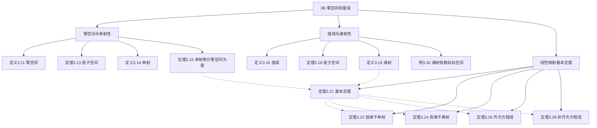

# 3B 零空间和值域

> [!abstract] 本节概览
> 本节引入与每个线性映射都紧密相关的两个子空间——==零空间==（null space）和==值域==（range），并证明线性代数中最重要的定理之一：==线性映射基本定理==（$\dim V = \dim\text{null}\,T + \dim\text{range}\,T$）。这个定理将"空间大小"与"映射行为"联系起来，是后续秩-零化度定理、特征值理论等的基石。
>
> **逻辑链条**：零空间 → 单射性 ⟺ null T = {0} → 值域 → 满射性 → 基本定理 → 维数推论 → 线性方程组理论
>
> **前置依赖**：[[3A 线性映射所成的向量空间]]（定义 3.1、定理 3.10）、[[1C 子空间]]（三条件 1.34）、[[2B 基]]（扩充法 2.32）
>
> **核心主线**：零空间度量"信息丢失"，值域度量"覆盖范围"，基本定理将两者统一

---

## 一、零空间与单射性

> [!def] 定义 3.11 零空间（null space）
> 对于 $T \in \mathcal{L}(V,W)$，$T$ 的==零空间==记为 $\text{null}\,T$，是 $V$ 的子集，由被 $T$ 映射到 $\mathbf{0}$ 的所有向量构成：
> $$\text{null}\,T = \{v \in V : Tv = \mathbf{0}\}$$

> [!example] 例 3.12 零空间的实例
> **零映射**：$\text{null}\,T = V$（所有向量都映射为零）
>
> **线性泛函** $\varphi(z_1, z_2, z_3) = z_1 + 2z_2 + 3z_3$：$\text{null}\,\varphi = \{(z_1, z_2, z_3) : z_1 + 2z_2 + 3z_3 = 0\}$（超平面）
>
> **微分映射** $Dp = p'$：$\text{null}\,D$ = 常值函数构成的集合
>
> **乘 $x^2$ 映射** $(Tp)(x) = x^2 p(x)$：$\text{null}\,T = \{0\}$（只有零多项式满足 $x^2 p(x) \equiv 0$）
>
> **后向移位** $T(x_1, x_2, x_3, \ldots) = (x_2, x_3, \ldots)$：$\text{null}\,T = \{(a, 0, 0, \ldots) : a \in \mathbb{F}\}$

> [!thm] 定理 3.13 零空间是子空间
> 假设 $T \in \mathcal{L}(V,W)$。那么 $\text{null}\,T$ 是 $V$ 的子空间。

> [!note] 证明
> 由定理 3.10，$T(\mathbf{0}) = \mathbf{0}$，所以 $\mathbf{0} \in \text{null}\,T$。
>
> 加法封闭：$u, v \in \text{null}\,T$ ⟹ $T(u+v) = Tu + Tv = \mathbf{0} + \mathbf{0} = \mathbf{0}$。
>
> 标量乘法封闭：$u \in \text{null}\,T$，$\lambda \in \mathbb{F}$ ⟹ $T(\lambda u) = \lambda Tu = \lambda\mathbf{0} = \mathbf{0}$。$\blacksquare$

> [!def] 定义 3.14 单射（injective）
> 对于函数 $T : V \to W$，若 $Tu = Tv$ 蕴涵 $u = v$，则称 $T$ 是==单射==。

> [!thm] 定理 3.15 单射 ⟺ 零空间等于 $\{0\}$
> 令 $T \in \mathcal{L}(V,W)$。那么 $T$ 是单射当且仅当 $\text{null}\,T = \{\mathbf{0}\}$。

> [!abstract] 证明思路
> **[$(\Rightarrow)$ 单射 ⟹ null T = {0}]**：设 $v \in \text{null}\,T$，则 $Tv = \mathbf{0} = T\mathbf{0}$。由单射得 $v = \mathbf{0}$。
>
> **[$(\Leftarrow)$ null T = {0} ⟹ 单射]**：设 $Tu = Tv$，则 $T(u-v) = \mathbf{0}$，所以 $u - v \in \text{null}\,T = \{\mathbf{0}\}$，得 $u = v$。$\blacksquare$

> [!tip] 定理 3.15 的实用价值
> 要判断线性映射是否为单射，只需检查零空间——这比直接验证"不同输入映射到不同输出"要简单得多（Lafayette College 讲义、Dartmouth Linear Algebra Refresher）。

---

## 二、值域与满射性

> [!def] 定义 3.16 值域（range）
> 对于 $T \in \mathcal{L}(V,W)$，$T$ 的==值域==是 $W$ 的子集，由所有等于 $Tv$（其中 $v \in V$）的向量构成：
> $$\text{range}\,T = \{Tv : v \in V\}$$

> [!example] 例 3.17 值域的实例
> **零映射**：$\text{range}\,T = \{\mathbf{0}\}$
>
> **$\mathbb{R}^2 \to \mathbb{R}^3$**：$T(x,y) = (2x, 5y, x+y)$，$\text{range}\,T = \{(2x, 5y, x+y) : x, y \in \mathbb{R}\}$
>
> **微分映射** $Dp = p'$：$\text{range}\,D = \mathcal{P}(\mathbb{R})$（每个多项式都是某个多项式的导数）

> [!thm] 定理 3.18 值域是子空间
> 如果 $T \in \mathcal{L}(V,W)$，那么 $\text{range}\,T$ 是 $W$ 的子空间。

> [!note] 证明
> $T(\mathbf{0}) = \mathbf{0}$，所以 $\mathbf{0} \in \text{range}\,T$。
>
> 加法封闭：$w_1, w_2 \in \text{range}\,T$ ⟹ 存在 $v_1, v_2$ 使 $Tv_i = w_i$ ⟹ $T(v_1+v_2) = w_1+w_2$。
>
> 标量乘法封闭：$w \in \text{range}\,T$ ⟹ $Tv = w$ ⟹ $T(\lambda v) = \lambda w$。$\blacksquare$

> [!def] 定义 3.19 满射（surjective）
> 如果函数 $T : V \to W$ 的值域等于 $W$，则称 $T$ 为==满射==。

> [!example] 例 3.20 满射取决于目标空间的选取
> 微分映射 $D \in \mathcal{L}(\mathcal{P}_5(\mathbb{R}))$：$\text{range}\,D = \mathcal{P}_4(\mathbb{R}) \neq \mathcal{P}_5(\mathbb{R})$，不满射。
>
> 微分映射 $S \in \mathcal{L}(\mathcal{P}_5(\mathbb{R}), \mathcal{P}_4(\mathbb{R}))$：$\text{range}\,S = \mathcal{P}_4(\mathbb{R})$，==满射==。
>
> ==同一个映射，目标空间不同，满射性可能不同==。

> [!important] 零空间 vs 值域的对称性
>
> | | 零空间 $\text{null}\,T$ | 值域 $\text{range}\,T$ |
> |---|---|---|
> | 定义 | $\{v \in V : Tv = \mathbf{0}\}$ | $\{Tv : v \in V\}$ |
> | 所属空间 | $V$ 的子空间 | $W$ 的子空间 |
> | 度量 | "信息丢失"的程度 | "覆盖范围"的大小 |
> | 对应性质 | $\text{null}\,T = \{\mathbf{0}\}$ ⟺ 单射 | $\text{range}\,T = W$ ⟺ 满射 |

---

## 三、线性映射基本定理

> [!thm] 定理 3.21 线性映射基本定理
> 假设 $V$ 是有限维的且 $T \in \mathcal{L}(V,W)$。那么 $\text{range}\,T$ 是有限维的，且
> $$\dim V = \dim\text{null}\,T + \dim\text{range}\,T$$

> [!abstract] 证明思路
> **[扩充零空间基为 V 的基]**：
>
> 设 $u_1, \ldots, u_m$ 是 $\text{null}\,T$ 的基（$\dim\text{null}\,T = m$）。由 [[2B 基|定理 2.32]]，扩充为 $V$ 的基：
> $$u_1, \ldots, u_m, v_1, \ldots, v_n$$
> 于是 $\dim V = m + n$。
>
> **[证明 $Tv_1, \ldots, Tv_n$ 张成 range T]**：
>
> 对任意 $v \in V$，$v = a_1 u_1 + \cdots + a_m u_m + b_1 v_1 + \cdots + b_n v_n$。施加 $T$：
> $$Tv = b_1 Tv_1 + \cdots + b_n Tv_n$$
> （含 $Tu_k$ 的项消失，因为 $u_k \in \text{null}\,T$）
>
> **[证明 $Tv_1, \ldots, Tv_n$ 线性无关]**：
>
> 设 $c_1 Tv_1 + \cdots + c_n Tv_n = \mathbf{0}$，则 $T(c_1 v_1 + \cdots + c_n v_n) = \mathbf{0}$。
> 所以 $c_1 v_1 + \cdots + c_n v_n \in \text{null}\,T$，可用 $u_1, \ldots, u_m$ 表示。由 $u_1, \ldots, u_m, v_1, \ldots, v_n$ 线性无关，得所有 $c_k = 0$。$\blacksquare$

> [!success] 定理 3.21 的重要性
> 这是==线性代数中最重要的定理之一==（Duke University ILA 讲义）：
> - 它建立了==定义域维数==、==零空间维数==和==值域维数==之间的精确关系
> - "零化度"（nullity）和"秩"（rank）之和恒等于定义域维数
> - 它是后续所有维数计算的基础：特征空间维数、广义特征空间维数等

### 3.1 维数推论

> [!thm] 定理 3.22 映到更低维空间不是单射
> 假设 $V$ 和 $W$ 是有限维向量空间且 $\dim V > \dim W$。那么从 $V$ 到 $W$ 的线性映射一定不是单射。

> [!note] 证明
> $\dim\text{null}\,T = \dim V - \dim\text{range}\,T \geq \dim V - \dim W > 0$。所以 $\text{null}\,T$ 包含非零向量，$T$ 不是单射。$\blacksquare$

> [!example] 例 3.23 $\mathbb{F}^4 \to \mathbb{F}^3$ 的线性映射不是单射
> 因为 $\dim\mathbb{F}^4 = 4 > 3 = \dim\mathbb{F}^3$，由定理 3.22，任何从 $\mathbb{F}^4$ 到 $\mathbb{F}^3$ 的线性映射都不是单射——==无需任何计算==。

> [!thm] 定理 3.24 映到更高维空间不是满射
> 假设 $V$ 和 $W$ 是有限维向量空间且 $\dim V < \dim W$。那么从 $V$ 到 $W$ 的线性映射一定不是满射。

> [!note] 证明
> $\dim\text{range}\,T = \dim V - \dim\text{null}\,T \leq \dim V < \dim W$。所以 $\text{range}\,T \neq W$。$\blacksquare$

### 3.2 线性方程组理论

> [!thm] 定理 3.26 齐次线性方程组
> ==未知数个数多于方程个数的齐次线性方程组具有非零解==。

> [!note] 证明
> 将方程组表示为 $T : \mathbb{F}^n \to \mathbb{F}^m$。$n$ 个未知数，$m$ 个方程。若 $n > m$，则 $\dim\mathbb{F}^n > \dim\mathbb{F}^m$，由定理 3.22，$T$ 不是单射，即 $\text{null}\,T \neq \{\mathbf{0}\}$。$\blacksquare$

> [!thm] 定理 3.28 方程个数多于未知数个数的线性方程组
> ==方程个数多于未知数个数的线性方程组当常数项取某些值时无解==。

> [!note] 证明
> 同上，$m$ 个方程，$n$ 个未知数。若 $m > n$，则 $\dim\mathbb{F}^n < \dim\mathbb{F}^m$，由定理 3.24，$T$ 不是满射，即 $\text{range}\,T \neq \mathbb{F}^m$。$\blacksquare$

> [!tip] 基本定理的"翻译"功能
> 线性映射基本定理将抽象的线性映射语言"翻译"为具体的线性方程组语言：
> - "单射" ⟺ "齐次方程组只有零解"
> - "满射" ⟺ "非齐次方程组对所有常数项都有解"
> - "基本定理" ⟺ "未知数个数 = 自由变量个数 + 主变量个数"

---

## 四、知识结构总览

---

## 五、核心思想与证明技巧

> [!success] 核心思想
> 1. **零空间 = "信息丢失"**：$\dim\text{null}\,T$ 度量了 $T$ 将多少维度的信息"压缩"为零。零空间越大，丢失的信息越多。
> 2. **值域 = "有效覆盖"**：$\dim\text{range}\,T$ 度量了 $T$ 实际覆盖了目标空间的多少维度。值域越小，覆盖越少。
> 3. **基本定理 = 守恒律**：$\dim V = \dim\text{null}\,T + \dim\text{range}\,T$——丢失的信息 + 保留的信息 = 原始信息。这是一个"守恒"关系。
> 4. **单射 ⟺ 满射的维数条件**：$\dim V \leq \dim W$ 是单射的必要条件，$\dim V \geq \dim W$ 是满射的必要条件。两者同时成立 ⟺ $\dim V = \dim W$。

> [!tip] 证明技巧清单
> 1. **证明子空间**：用三条件（定理 3.13/3.18 的模式）——零向量、加法封闭、标量乘法封闭
> 2. **基本定理的证明范式**：取 null T 的基 → 扩充为 V 的基 → 证明像构成 range T 的基（MSU Math 20F 讲义、UPC Linear Maps 讲义）
> 3. **利用基本定理做维数估计**：$\dim\text{null}\,T = \dim V - \dim\text{range}\,T \geq \dim V - \dim W$（定理 3.22 的证明模式）
> 4. **单射 ⟺ 线性无关的保持**：$T$ 单射 ⟺ $T$ 将线性无关组映射为线性无关组（习题 9）

---

## 六、补充理解与易混淆点

### 6.1 基本定理的直觉

基本定理可以理解为"信息守恒"（Duke University ILA Rank Theorem、EECS 245 Notes）：

- 想象 $V$ 有 $\dim V$ 个"信息通道"
- $T$ 将其中 $\dim\text{null}\,T$ 个通道"关闭"（映射为零）
- 剩余 $\dim\text{range}\,T$ 个通道正常传输
- 关闭的 + 正常的 = 总通道数

==直觉：你不能用更少的通道传输更多的信息。零空间和值域是"同一枚硬币的两面"==。

**来源**：Duke University ILA Rank Theorem、EECS 245 Null Space and Rank-Nullity Theorem。

### 6.2 单射、满射与维数的关系

| 条件 | 单射？ | 满射？ | 双射？ |
|:---|:---:|:---:|:---:|
| $\dim V < \dim W$ | 可能 | ❌ 不可能 | ❌ |
| $\dim V = \dim W$ | ⟺ $\text{null}\,T = \{0\}$ | ⟺ $\text{range}\,T = W$ | ⟺ 两者同时 |
| $\dim V > \dim W$ | ❌ 不可能 | 可能 | ❌ |

注意：$\dim V = \dim W$ 时，单射和满射等价——这是一个非常有用的推论。

**来源**：Lafayette College Unit 3 Section 3 讲义、Dartmouth Linear Algebra Refresher。

### 6.3 常见误区

> [!danger] 误区1："零空间大的映射不好"
> ❌ 错误认知：$\text{null}\,T$ 大说明 $T$ 是"差"的映射
> ✅ 正确理解：零空间的大小取决于应用场景。在数据压缩中，我们==希望==零空间大（丢弃冗余信息）；在编码中，我们希望零空间小（保留所有信息）。零空间的大小是映射的性质，不是优劣的评判

> [!danger] 误区2："值域等于目标空间就是满射"
> ❌ 错误认知：$\text{range}\,T$ "看起来很大"就是满射
> ✅ 正确理解：满射要求 $\text{range}\,T = W$，即==精确等于==整个目标空间，而不是"差不多等于"。由基本定理，$\dim\text{range}\,T \leq \dim V$，所以如果 $\dim V < \dim W$，无论 $T$ 怎么定义都不可能满射（StudyX Rank-Nullity 习题分析）

> [!danger] 误区3："秩-零化度定理中 n 是行数"
> ❌ 错误认知：$\dim V = \dim\text{null}\,T + \dim\text{range}\,T$ 中的 $\dim V$ 是矩阵的行数
> ✅ 正确理解：$\dim V$ 是==定义域==的维数，对应矩阵的==列数==（StudyX 习题分析）。这是最常见的计算错误——混淆了行数和列数

> [!danger] 误区4："单射和满射互不相关"
> ❌ 错误认知：一个映射可以任意组合单射性和满射性
> ✅ 正确理解：当 $\dim V = \dim W$ 时，单射 ⟺ 满射（由基本定理直接推出）。维数条件将两个性质紧密联系在一起（MSU Math 20F 讲义）

**来源**：Duke University ILA Rank Theorem、EECS 245 Notes、StudyX Rank-Nullity Analysis、MSU Math 20F Lecture 15、Hanspub 线性代数注记。

---

## 七、习题精选

> [!todo] 本节习题
>
> | 编号 | 标题 | 核心考点 | 难度 |
> |:---:|---|---|:---:|
> | 1 | 构造零空间和值域 | 基本定理 | ⭐ |
> | 2 | 复合映射的零化 | range S ⊆ null T | ⭐⭐ |
> | 3 | 张成与线性无关 | null/range 对应 | ⭐⭐ |
> | 5 | range T = null T | 基本定理 | ⭐⭐ |
> | 9 | 单射保持线性无关 | 定理 3.15 | ⭐⭐ |
> | 12 | 零空间维数 → 满射 | 基本定理 | ⭐⭐ |
> | 16 | 单射存在条件 | 维数比较 | ⭐⭐ |
> | 19 | 单射的左逆 | 存在性证明 | ⭐⭐⭐ |
> | 27 | 投影的直和分解 | null P ⊕ range P | ⭐⭐⭐ |

### 习题 1：构造零空间和值域

> [!problem] 习题 1
> 给出一例：满足 $\dim\text{null}\,T = 3$ 且 $\dim\text{range}\,T = 2$ 的线性映射 $T$。

> [!faq]- 查看解答
> 取 $V = \mathbb{F}^5$，$W = \mathbb{F}^2$。定义 $T(x_1, x_2, x_3, x_4, x_5) = (x_1 + x_2, x_3 + x_4)$。
>
> $\text{null}\,T = \{(a, -a, b, -b, c) : a, b, c \in \mathbb{F}\}$，基为 $(1,-1,0,0,0), (0,0,1,-1,0), (0,0,0,0,1)$，$\dim\text{null}\,T = 3$。
>
> $\text{range}\,T = \mathbb{F}^2$（取 $x_1 = x_3 = 1$，其余为 $0$ 得 $(1,1)$；取 $x_1 = 1, x_3 = 0$ 得 $(1,0)$），$\dim\text{range}\,T = 2$。
>
> 验证：$\dim\text{null}\,T + \dim\text{range}\,T = 3 + 2 = 5 = \dim V$。✓ $\blacksquare$

### 习题 2：复合映射的零化

> [!problem] 习题 2
> 设 $S, T \in \mathcal{L}(V)$ 使得 $\text{range}\,S \subseteq \text{null}\,T$，证明 $(ST)^2 = 0$。

> [!faq]- 查看解答
> **证明**：对任意 $v \in V$，$Sv \in \text{range}\,S \subseteq \text{null}\,T$，所以 $T(Sv) = \mathbf{0}$，即 $(ST)v = \mathbf{0}$。
>
> 因此 $ST = 0$（零映射），$(ST)^2 = 0 \cdot 0 = 0$。$\blacksquare$

### 习题 5：$\text{range}\,T = \text{null}\,T$

> [!problem] 习题 5
> 给出一例：使得 $\text{range}\,T = \text{null}\,T$ 的 $T \in \mathcal{L}(\mathbb{R}^4)$。

> [!faq]- 查看解答
> 定义 $T(x_1, x_2, x_3, x_4) = (x_3, x_4, 0, 0)$。
>
> $\text{range}\,T = \{(a, b, 0, 0) : a, b \in \mathbb{R}\}$，$\dim\text{range}\,T = 2$。
>
> $\text{null}\,T = \{(a, b, 0, 0) : a, b \in \mathbb{R}\}$，$\dim\text{null}\,T = 2$。
>
> 所以 $\text{range}\,T = \text{null}\,T = \{(a, b, 0, 0)\}$。$\blacksquare$

### 习题 9：单射保持线性无关

> [!problem] 习题 9
> 设 $T \in \mathcal{L}(V,W)$ 是单射，$v_1, \ldots, v_n$ 在 $V$ 中线性无关。证明 $Tv_1, \ldots, Tv_n$ 在 $W$ 中线性无关。

> [!faq]- 查看解答
> **证明**：设 $c_1 Tv_1 + \cdots + c_n Tv_n = \mathbf{0}$。则 $T(c_1 v_1 + \cdots + c_n v_n) = \mathbf{0}$。
>
> 所以 $c_1 v_1 + \cdots + c_n v_n \in \text{null}\,T = \{\mathbf{0}\}$（由定理 3.15）。
>
> 因此 $c_1 v_1 + \cdots + c_n v_n = \mathbf{0}$，由 $v_1, \ldots, v_n$ 线性无关得 $c_1 = \cdots = c_n = 0$。$\blacksquare$

### 习题 12：零空间维数 → 满射

> [!problem] 习题 12
> 设 $T$ 是从 $\mathbb{F}^4$ 到 $\mathbb{F}^2$ 的线性映射，使得 $\text{null}\,T = \{(x_1, x_2, x_3, x_4) \in \mathbb{F}^4 : x_1 = 5x_2 \text{ 且 } x_3 = 7x_4\}$。证明 $T$ 是满射。

> [!faq]- 查看解答
> $\text{null}\,T$ 由两个独立线性条件定义，所以 $\dim\text{null}\,T = 4 - 2 = 2$。
>
> 由基本定理：$\dim\text{range}\,T = \dim\mathbb{F}^4 - \dim\text{null}\,T = 4 - 2 = 2 = \dim\mathbb{F}^2$。
>
> 由 [[2C 维数|推论 2.39]]，$\text{range}\,T = \mathbb{F}^2$，所以 $T$ 是满射。$\blacksquare$

### 习题 16：单射存在条件

> [!problem] 习题 16
> 设 $V$ 和 $W$ 都是有限维的。证明：存在从 $V$ 到 $W$ 的单的线性映射，当且仅当 $\dim V \leq \dim W$。

> [!faq]- 查看解答
> **($\Leftarrow$)**：设 $\dim V \leq \dim W$。取 $V$ 的基 $v_1, \ldots, v_n$ 和 $W$ 中 $n$ 个线性无关向量 $w_1, \ldots, w_n$（由 $\dim W \geq n$，这样的组存在）。由 [[3A 线性映射所成的向量空间|定理 3.4]]，定义 $T$ 使 $Tv_k = w_k$。$\text{null}\,T = \{\mathbf{0}\}$（因为 $w_1, \ldots, w_n$ 线性无关），所以 $T$ 是单射。
>
> **($\Rightarrow$)**：若存在单射 $T : V \to W$，则 $\text{null}\,T = \{\mathbf{0}\}$，由基本定理 $\dim V = \dim\text{range}\,T \leq \dim W$。$\blacksquare$

### 习题 19：单射的左逆

> [!problem] 习题 19
> 设 $W$ 是有限维的，$T \in \mathcal{L}(V,W)$。证明：$T$ 是单射，当且仅当存在 $S \in \mathcal{L}(W,V)$ 使得 $ST$ 是 $V$ 上的恒等算子。

> [!faq]- 查看解答
> **($\Leftarrow$)**：若 $ST = I_V$，设 $Tu = Tv$，则 $u = STu = STv = v$，所以 $T$ 是单射。
>
> **($\Rightarrow$)**：$T$ 单射 ⟹ $\text{null}\,T = \{\mathbf{0}\}$ ⟹ $\dim V = \dim\text{range}\,T$。取 $\text{range}\,T$ 的基 $Tv_1, \ldots, Tv_n$，扩充为 $W$ 的基 $Tv_1, \ldots, Tv_n, w_1, \ldots, w_k$。
>
> 定义 $S \in \mathcal{L}(W,V)$ 为：$S(Tv_j) = v_j$（$j=1,\ldots,n$），$Sw_j = \mathbf{0}$（$j=1,\ldots,k$）。由 [[3A 线性映射所成的向量空间|定理 3.4]]，$S$ 存在。
>
> 对任意 $v \in V$，$v = c_1 v_1 + \cdots + c_n v_n$，$STv = S(T(c_1 v_1 + \cdots)) = S(c_1 Tv_1 + \cdots) = c_1 v_1 + \cdots + c_n v_n = v$。$\blacksquare$

### 习题 27：投影的直和分解

> [!problem] 习题 27
> 设 $P \in \mathcal{L}(V)$ 且 $P^2 = P$。证明 $V = \text{null}\,P \oplus \text{range}\,P$。

> [!faq]- 查看解答
> **证明**：
>
> **$\text{null}\,P \cap \text{range}\,P = \{\mathbf{0}\}$**：设 $v \in \text{null}\,P \cap \text{range}\,P$。则 $Pv = \mathbf{0}$ 且 $v = Pw$（某个 $w$）。所以 $\mathbf{0} = Pv = P(Pw) = P^2 w = Pw = v$。
>
> **$V = \text{null}\,P + \text{range}\,P$**：对任意 $v \in V$，$v = Pv + (v - Pv)$。$P(Pv) = P^2 v = Pv$，所以 $Pv \in \text{range}\,P$。$P(v - Pv) = Pv - P^2 v = Pv - Pv = \mathbf{0}$，所以 $v - Pv \in \text{null}\,P$。
>
> 因此 $V = \text{null}\,P \oplus \text{range}\,P$。$\blacksquare$

---

## 八、视频学习指南

> [!info] 视频资源
>
> | 视频主题 | 对应笔记模块 | 平台 |
> |---|---|---|
> | 零空间与单射 | 一、零空间与单射性 | B站 |
> | 值域与满射 | 二、值域与满射性 | B站 |
> | 线性映射基本定理 | 三、线性映射基本定理 | B站 |
> | 线性方程组理论 | 三、线性方程组理论 | B站 |

> [!info] 视频精要
> 暂无对应视频的详细精要。建议在学习时关注以下要点：
> - 定理 3.15 将"单射"转化为"零空间为零"——极大简化了验证
> - 基本定理的证明是"扩充基"的标准范式
> - 定理 3.22/3.24 可以"不计算"就判断单射/满射性
> - 定理 3.26/3.28 将抽象理论应用于具体的线性方程组

---

## 九、教材原文
#学习/线性代数/线性映射/零空间与值域
