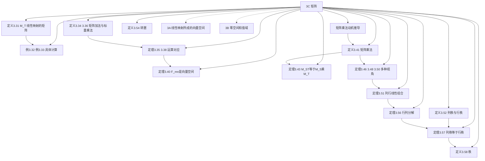

# 3C 矩阵

> [!abstract] 本节概览
> 本节建立了==线性映射==与==矩阵==之间的桥梁，将抽象的线性映射转化为具体的矩阵运算。核心成果包括：矩阵运算（加法、标量乘法、乘法）由线性映射运算驱动定义，$\mathbb{F}^{m,n}$ 构成 $mn$ 维向量空间，以及==列秩等于行秩==这一令人惊讶的事实。
>
> **逻辑链条**：线性映射的矩阵 $M(T)$ → 矩阵加法/标量乘法 → $\mathbb{F}^{m,n}$ 是向量空间 → ==矩阵乘法的定义动机== → $M(ST) = M(S)M(T)$ → 列/行线性组合视角 → 行列分解 → 列秩 = 行秩
>
> **前置依赖**：[[3A 线性映射所成的向量空间]]（线性映射的定义与运算）、[[3B 零空间和值域]]（值域与基本定理）、[[2B 基]]（基的选取与坐标表示）、[[2C 维数]]（维数的计算）、[[1C 子空间]]（张成空间）
>
> **核心主线**：矩阵是线性映射的"坐标化身"——选定基之后，抽象的映射行为被编码为具体的数字阵列

---

## 一、矩阵表示线性映射

### 1.1 矩阵的定义

> [!def] 定义 3.29 矩阵（matrix）、$A_{j,k}$
> 假设 $m$ 和 $n$ 是非负整数。$m \times n$ **矩阵** $A$ 是由 $\mathbb{F}$ 中元素构成的 $m$ 行 $n$ 列的矩形阵列：
> $$A = \begin{pmatrix} A_{1,1} & \cdots & A_{1,n} \\ \vdots & & \vdots \\ A_{m,1} & \cdots & A_{m,n} \end{pmatrix}$$
> 记号 $A_{j,k}$ 表示 $A$ 的第 $j$ 行第 $k$ 列中的元素。

> [!note] 学习注解
> 第一个下标代表行，第二个下标代表列——这是固定约定，务必牢记。

### 1.2 线性映射的矩阵

> [!def] 定义 3.31 线性映射的矩阵（matrix of a linear map）、$M(T)$
> 假设 $T \in \mathcal{L}(V, W)$，$v_1, \ldots, v_n$ 是 $V$ 的基，$w_1, \ldots, w_m$ 是 $W$ 的基。$T$ 关于这些基的矩阵是 $m \times n$ 矩阵 $M(T)$，其中各元素 $A_{j,k}$ 由下式定义：
> $$Tv_k = \sum_{j=1}^{m} A_{j,k} w_j$$
> 如果基不明确，用记号 $M(T, (v_1,\ldots,v_n), (w_1,\ldots,w_m))$。

> [!important] 核心直觉
> ==这是本节最关键的定义！==
>
> **$M(T)$ 的第 $k$ 列**就是 $Tv_k$ 在基 $w_1, \ldots, w_m$ 下的坐标。要记住 $M(T)$ 是如何构造的，可以在矩阵上方横着标上 $v_1, \ldots, v_n$，左侧竖着列出 $w_1, \ldots, w_m$：
> $$M(T) = \begin{pmatrix} & v_1 & \cdots & v_k & \cdots & v_n \\ w_1 & & & A_{1,k} & & \\ \vdots & & & \vdots & & \\ w_m & & & A_{m,k} & & \end{pmatrix}$$
>
> **维度关系**：$M(T)$ 是 $m \times n$ 矩阵，其中 $m = \dim W$（行数 = 目标空间维数），$n = \dim V$（列数 = 定义域维数）。
>
> **特殊约定**：如果 $T$ 是从 $\mathbb{F}^n$ 到 $\mathbb{F}^m$ 的线性映射，除非另有说明，总假定基是==标准基==。

> [!example] 例 3.32 从 $\mathbb{F}^2$ 到 $\mathbb{F}^3$ 的线性映射的矩阵
> $T(x, y) = (x + 3y,\ 2x + 5y,\ 7x + 9y)$。使用标准基：
> - $T(1,0) = (1, 2, 7)$ → 第一列
> - $T(0,1) = (3, 5, 9)$ → 第二列
> $$M(T) = \begin{pmatrix} 1 & 3 \\ 2 & 5 \\ 7 & 9 \end{pmatrix}$$

> [!example] 例 3.33 微分映射的矩阵
> $D \in \mathcal{L}(\mathcal{P}_3(\mathbb{R}), \mathcal{P}_2(\mathbb{R}))$，$Dp = p'$。关于标准基 $1, x, x^2, x^3$ 和 $1, x, x^2$：
> - $D(1) = 0$ → $(0,0,0)^T$
> - $D(x) = 1$ → $(1,0,0)^T$
> - $D(x^2) = 2x$ → $(0,2,0)^T$
> - $D(x^3) = 3x^2$ → $(0,0,3)^T$
> $$M(D) = \begin{pmatrix} 0 & 1 & 0 & 0 \\ 0 & 0 & 2 & 0 \\ 0 & 0 & 0 & 3 \end{pmatrix}$$

> [!note] 学习注解
> 微分映射的矩阵有一个漂亮的模式：第 $k$ 列只有一个非零元素 $k-1$，位于第 $k-1$ 行。这正是 $(x^{k-1})' = (k-1)x^{k-2}$ 的体现。==矩阵将微积分运算变成了纯代数运算==。

---

## 二、矩阵运算：加法、标量乘法与乘法

### 2.1 矩阵加法与标量乘法

> [!def] 定义 3.34 矩阵加法
> 两个相同大小的矩阵之和，是将两矩阵对应位置上的元素相加所得的矩阵。

> [!def] 定义 3.36 矩阵的标量乘法
> 一个标量和一个矩阵的乘积，是将该矩阵的各元素都乘以该标量所得的矩阵。

> [!example] 例 3.37 矩阵的加法和标量乘法
> $$\begin{pmatrix} 3 & 1 \\ -1 & 5 \end{pmatrix} + \begin{pmatrix} 4 & 2 \\ 1 & 6 \end{pmatrix} = \begin{pmatrix} 7 & 3 \\ 0 & 11 \end{pmatrix}, \quad 2\begin{pmatrix} 3 & 1 \\ -1 & 5 \end{pmatrix} = \begin{pmatrix} 6 & 2 \\ -2 & 10 \end{pmatrix}$$

> [!thm] 定理 3.35 $M(S + T) = M(S) + M(T)$
> 假设 $S, T \in \mathcal{L}(V, W)$。那么 $M(S + T) = M(S) + M(T)$。

> [!thm] 定理 3.38 $M(\lambda T) = \lambda M(T)$
> 假设 $\lambda \in \mathbb{F}$ 且 $T \in \mathcal{L}(V, W)$。那么 $M(\lambda T) = \lambda M(T)$。

> [!note] 学习注解
> 这两个定理的验证由定义即可完成。它们表明矩阵的加法和标量乘法是"被线性映射的对应运算所驱动"的——我们不是随意定义矩阵运算，而是为了让 $M$ 成为一个"保持结构"的映射。

### 2.2 $\mathbb{F}^{m,n}$ 是向量空间

> [!def] 记号 3.39 $\mathbb{F}^{m,n}$
> 对于正整数 $m$ 和 $n$，各元素均属于 $\mathbb{F}$ 的所有 $m \times n$ 矩阵构成的集合记作 $\mathbb{F}^{m,n}$。

> [!thm] 定理 3.40 $\dim \mathbb{F}^{m,n} = mn$
> 按上面定义的加法和标量乘法，$\mathbb{F}^{m,n}$ 是维数为 $mn$ 的向量空间。

> [!abstract] 证明思路
> **[构造标准基]**：$\mathbb{F}^{m,n}$ 的基由 $mn$ 个矩阵 $E_{j,k}$ 构成，其中 $E_{j,k}$ 在位置 $(j,k)$ 处的元素为 $1$，其余位置为 $0$。
>
> **[验证线性无关]**：若 $\sum_{j,k} c_{j,k} E_{j,k} = 0$，则每个 $c_{j,k} = 0$。
>
> **[验证张成]**：对任意 $A \in \mathbb{F}^{m,n}$，$A = \sum_{j,k} A_{j,k} E_{j,k}$。$\blacksquare$

> [!note] 学习注解
> ==与 [[3A 线性映射所成的向量空间]] 的联系==：后面将证明 $\mathcal{L}(V, W) \cong \mathbb{F}^{m,n}$（当 $\dim V = n$，$\dim W = m$ 时），且 $\dim \mathcal{L}(V, W) = mn$。

### 2.3 矩阵乘法

> [!note] 学习注解
> ==这一段是本节最精彩的部分！==
>
> Axler 没有直接给出矩阵乘法的定义，而是从"我们希望 $M(ST) = M(S)M(T)$ 成立"这个目标**反推**出矩阵乘法应该怎么定义。这种"动机驱动"的叙述方式远比直接给出定义更深刻。
>
> **推导过程**：设 $M(S) = A$（$m \times n$），$M(T) = B$（$n \times p$），$S$ 关于基 $v_1, \ldots, v_n$ 和 $w_1, \ldots, w_m$，$T$ 关于基 $u_1, \ldots, u_p$ 和 $v_1, \ldots, v_n$。对 $1 \le k \le p$：
> $$(ST)u_k = S\left(\sum_{r=1}^n B_{r,k} v_r\right) = \sum_{r=1}^n B_{r,k} Sv_r = \sum_{r=1}^n B_{r,k} \sum_{j=1}^m A_{j,r} w_j = \sum_{j=1}^m \left(\sum_{r=1}^n A_{j,r} B_{r,k}\right) w_j$$
> 所以 $M(ST)$ 的第 $j$ 行第 $k$ 列元素应该等于 $\sum_{r=1}^n A_{j,r} B_{r,k}$——这就是矩阵乘法的定义！

> [!def] 定义 3.41 矩阵乘法（matrix multiplication）
> 假设 $A$ 是 $m \times n$ 矩阵且 $B$ 是 $n \times p$ 矩阵。那么 $AB$ 定义为 $m \times p$ 矩阵，其中
> $$(AB)_{j,k} = \sum_{r=1}^n A_{j,r} B_{r,k}$$
> 取 $A$ 的第 $j$ 行和 $B$ 的第 $k$ 列，对应位置元素相乘再相加。

> [!warning] 学习注解
> - 只有当第一个矩阵的**列数**等于第二个矩阵的**行数**时，乘积才有定义。
> - 矩阵乘法**不满足交换律**：$AB \neq BA$（即使两个乘积都有定义）。
> - 矩阵乘法满足**分配律**和**结合律**。

> [!example] 例 3.42 矩阵乘积
> $$\begin{pmatrix} 1 & 2 \\ 3 & 4 \\ 5 & 6 \end{pmatrix} \begin{pmatrix} 6 & 5 & 4 & 3 \\ 2 & 1 & 0 & -1 \end{pmatrix} = \begin{pmatrix} 10 & 7 & 4 & 1 \\ 26 & 19 & 12 & 5 \\ 42 & 31 & 20 & 9 \end{pmatrix}$$
> $3 \times 2$ 矩阵乘以 $2 \times 4$ 矩阵，得到 $3 \times 4$ 矩阵。

> [!thm] 定理 3.43 $M(ST) = M(S)M(T)$
> 如果 $T \in \mathcal{L}(U, V)$ 且 $S \in \mathcal{L}(V, W)$，那么 $M(ST) = M(S)M(T)$。

> [!note] 学习注解
> ==这个定理是矩阵乘法存在的根本理由！== 我们定义矩阵乘法，就是为了让这个等式成立。它将线性映射的复合变成了矩阵的乘法——这是"抽象"与"具体"之间的完美对应。
>
> 注意基的选取必须一致：$T$ 和 $ST$ 在 $U$ 中取同一个基，$S$ 和 $ST$ 在 $W$ 中取同一个基，$T$ 和 $S$ 在 $V$ 中取同一个基。

### 2.4 矩阵乘法的多种视角

> [!def] 记号 3.44 $A_{j,\cdot}$、$A_{\cdot,k}$
> - $A_{j,\cdot}$：$A$ 的第 $j$ 行，视为 $1 \times n$ 矩阵
> - $A_{\cdot,k}$：$A$ 的第 $k$ 列，视为 $m \times 1$ 矩阵

> [!example] 例 3.45 $A_{2,\cdot}$ 和 $A_{\cdot,2}$
> 设 $A = \begin{pmatrix} 1 & 2 & 3 \\ 4 & 5 & 6 \end{pmatrix}$，则
> $$A_{2,\cdot} = \begin{pmatrix} 4 & 5 & 6 \end{pmatrix}, \quad A_{\cdot,2} = \begin{pmatrix} 2 \\ 5 \end{pmatrix}$$

> [!thm] 定理 3.46 行乘以列
> $(AB)_{j,k} = A_{j,\cdot} B_{\cdot,k}$
> $AB$ 中第 $j$ 行第 $k$ 列的元素 = $A$ 的第 $j$ 行 $\times$ $B$ 的第 $k$ 列。

> [!thm] 定理 3.48 矩阵之积的列等于矩阵与列之积
> $(AB)_{\cdot,k} = A(B_{\cdot,k})$
> $AB$ 的第 $k$ 列 = $A$ 乘以 $B$ 的第 $k$ 列。

> [!thm] 定理 3.50 列的线性组合
> $$Ab = b_1 A_{\cdot,1} + \cdots + b_n A_{\cdot,n}$$
> $Ab$ 是 $A$ 中各列的线性组合，系数来自 $b$。

> [!example] 例 3.49 列的线性组合
> 设 $A = \begin{pmatrix} 1 & 2 \\ 3 & 4 \\ 5 & 6 \end{pmatrix}$，$b = \begin{pmatrix} 3 \\ -1 \end{pmatrix}$，则
> $$Ab = 3\begin{pmatrix} 1 \\ 3 \\ 5 \end{pmatrix} + (-1)\begin{pmatrix} 2 \\ 4 \\ 6 \end{pmatrix} = \begin{pmatrix} 1 \\ 5 \\ 9 \end{pmatrix}$$

> [!thm] 定理 3.51 将矩阵乘法视为列或行的线性组合
> 假设 $C$ 是 $m \times c$ 矩阵且 $R$ 是 $c \times n$ 矩阵。
>
> (a) $CR$ 的第 $k$ 列是 $C$ 的各列的线性组合，系数来自 $R$ 的第 $k$ 列。
>
> (b) $CR$ 的第 $j$ 行是 $R$ 的各行的线性组合，系数来自 $C$ 的第 $j$ 行。

> [!important] 矩阵乘法三种视角对比

| 视角 | 核心公式 | 直觉 | 用途 |
|:---|:---|:---|:---|
| **元素视角** | $(AB)_{j,k} = A_{j,\cdot} B_{\cdot,k}$ | 行 $\times$ 列 = 标量 | 逐元素计算 |
| **列视角** | $(AB)_{\cdot,k} = A(B_{\cdot,k})$ | $A$ 的列的线性组合 | 理解值域、行列分解 |
| **行视角** | $(AB)_{j,\cdot} = (A_{j,\cdot}) B$ | $B$ 的行的线性组合 | 理解行空间 |

> [!note] 学习注解
> 其中==列视角最为重要==——它直接引出行列分解（定理 3.56），是证明列秩等于行秩的关键工具。

---

## 三、矩阵的秩与转置

### 3.1 列秩与行秩

> [!def] 定义 3.52 列秩（column rank）、行秩（row rank）
> - $A$ 的**列秩**是 $A$ 的各列在 $\mathbb{F}^{m,1}$ 中的张成空间的维数。
> - $A$ 的**行秩**是 $A$ 的各行在 $\mathbb{F}^{1,n}$ 中的张成空间的维数。

> [!example] 例 3.53 一个 $2 \times 4$ 矩阵的列秩和行秩
> $$A = \begin{pmatrix} 4 & 7 & 1 & 8 \\ 3 & 5 & 2 & 9 \end{pmatrix}$$
> - 列秩 = 2（前两列 $(4,3)^T$ 和 $(7,5)^T$ 不成标量倍数，张成整个 $\mathbb{F}^{2,1}$）
> - 行秩 = 2（两行 $(4,7,1,8)$ 和 $(3,5,2,9)$ 不成标量倍数，张成 $\mathbb{F}^{1,4}$ 的一个二维子空间）

### 3.2 转置

> [!def] 定义 3.54 转置（transpose）、$A^t$
> 矩阵 $A$ 的**转置**记为 $A^t$，是互换 $A$ 的行和列所得的矩阵。如果 $A$ 是 $m \times n$ 矩阵，那么 $A^t$ 是 $n \times m$ 矩阵，其中 $(A^t)_{k,j} = A_{j,k}$。

> [!example] 例 3.55 矩阵的转置
> $$A = \begin{pmatrix} 1 & 2 \\ 3 & 4 \\ 5 & 6 \end{pmatrix} \implies A^t = \begin{pmatrix} 1 & 3 & 5 \\ 2 & 4 & 6 \end{pmatrix}$$
> $3 \times 2$ 矩阵变为 $2 \times 3$ 矩阵。

> [!note] 转置的代数性质
> - $(A + B)^t = A^t + B^t$
> - $(\lambda A)^t = \lambda A^t$
> - $(AC)^t = C^t A^t$（==顺序反转！==）

### 3.3 行列分解

> [!thm] 定理 3.56 行列分解（column-row factorization）
> 假设 $A$ 是 $m \times n$ 矩阵且列秩 $c \ge 1$。那么存在 $m \times c$ 矩阵 $C$ 和 $c \times n$ 矩阵 $R$，使得 $A = CR$。

> [!abstract] 证明思路
> **[取列空间的基]**：将 $A$ 的各列 $A_{\cdot,1}, \ldots, A_{\cdot,n}$ 削减为列张成空间的基（由 [[2B 基|定理 2.30]]），基的长度 = 列秩 $c$。
>
> **[构造 C]**：将这 $c$ 个基向量合为 $m \times c$ 矩阵 $C$。
>
> **[构造 R]**：$A$ 的每一列都是 $C$ 的各列的线性组合，将系数组成 $c \times n$ 矩阵 $R$。
>
> **[验证 A = CR]**：由定理 3.51(a)，$A$ 的第 $k$ 列 = $C$ 的各列以 $R$ 的第 $k$ 列为系数的线性组合 = $(CR)_{\cdot,k}$。$\blacksquare$

> [!note] 学习注解
> ==直觉==：行列分解是说，任何秩为 $c$ 的矩阵都可以"压缩"为一个"瘦高"矩阵 $C$（$m \times c$）和一个"矮胖"矩阵 $R$（$c \times n$）的乘积。$C$ 包含列空间的基（"骨架"），$R$ 记录每列如何由骨架组装（"配方"）。
>
> **秩 1 的特殊情况**：若 $\text{rank}\,A = 1$，则 $A = CR$ 中 $C$ 是 $m \times 1$（列向量 $c$），$R$ 是 $1 \times n$（行向量 $d^t$），即 $A = cd^t$（外积）。

### 3.4 列秩等于行秩

> [!thm] 定理 3.57 列秩等于行秩
> 假设 $A \in \mathbb{F}^{m,n}$。那么 $A$ 的列秩等于 $A$ 的行秩。

> [!abstract] 证明思路
> **[行列分解给出第一个不等式]**：令 $c$ 为 $A$ 的列秩。由行列分解（定理 3.56），$A = CR$（$C$ 是 $m \times c$，$R$ 是 $c \times n$）。
>
> 由定理 3.51(b)，$A$ 的每一行都是 $R$ 的各行的线性组合。因为 $R$ 只有 $c$ 行，所以 $A$ 的行秩 $\le c$（即 $\le$ 列秩）。
>
> **[转置给出反向不等式]**：对 $A^t$ 应用同样的论证：$A^t$ 的行秩 $\le A^t$ 的列秩。但 $A^t$ 的行秩 = $A$ 的列秩，$A^t$ 的列秩 = $A$ 的行秩。所以 $A$ 的列秩 $\le A$ 的行秩。
>
> **[夹逼]**：两个不等式合起来，得 $A$ 的列秩 = $A$ 的行秩。$\blacksquare$

> [!note] 学习注解
> ==这个证明非常优雅！== 它利用行列分解将"行"的问题转化为"列"的问题，再用转置将方向反过来，两个不等式夹逼出等式。

> [!def] 定义 3.58 秩（rank）
> 矩阵 $A \in \mathbb{F}^{m,n}$ 的**秩**是 $A$ 的列秩（= 行秩）。

> [!note] 学习注解
> 由于列秩 = 行秩，我们不再需要区分两者，统一使用"秩"这个术语。
>
> ==与 [[3B 零空间和值域|基本定理]] 的联系==：后面将证明 $\dim\text{range}\,T$ 等于 $M(T)$ 的秩。这意味着基本定理可以重新表述为：
> $$\dim V = \dim\text{null}\,T + \text{rank}\,M(T)$$
> 这就是著名的**秩-零化度定理**的矩阵版本。

---

## 四、知识结构总览

---

## 五、核心思想与证明技巧

> [!success] 核心思想
> 1. **矩阵是线性映射的"坐标表示"**——选定了基之后，抽象的线性映射就变成了具体的矩阵。$M(T)$ 的第 $k$ 列就是 $Tv_k$ 的坐标——矩阵的每一列都承载着基向量的"命运"。
> 2. **矩阵运算由线性映射运算驱动**——我们不是随意定义矩阵加法、标量乘法和乘法，而是为了让 $M$ 成为线性映射与矩阵之间的"同构"——保持加法、标量乘法和乘法（复合）。
> 3. **矩阵乘法的三种互补视角**——元素视角（行 $\times$ 列）、列视角（列的线性组合）、行视角（行的线性组合）。其中==列视角最为重要==，它直接引出行列分解。
> 4. **列秩 = 行秩的优雅证明**——行列分解 + 转置对称性，两个不等式夹逼出等式，是"对称性论证"的典范。

> [!tip] 证明技巧清单
> 1. **动机驱动定义**：从期望的性质（$M(ST) = M(S)M(T)$）反推出运算的定义——这是数学中"好的定义"的典范
> 2. **行列分解**（3.56）：取列空间的基 → 每列用基表示 → 系数矩阵即为 $R$
> 3. **对称性论证**（3.57）：对 $A$ 得到"行秩 $\le$ 列秩"，对 $A^t$ 得到反向不等式，夹逼出等式
> 4. **列的线性组合视角**（3.50）：$Ab = b_1 A_{\cdot,1} + \cdots + b_n A_{\cdot,n}$——理解矩阵-向量乘法的关键

---

## 六、补充理解与易混淆点

### 6.1 矩阵乘法的本质：线性映射的复合

矩阵乘法 $AB$ 对应的是线性映射的复合：先应用 $B$ 对应的映射，再应用 $A$ 对应的映射（Georgia Tech Interactive Linear Algebra, Margalit & Rabinoff）。复合映射 $T \circ U$ 的矩阵等于 $T$ 的矩阵乘以 $U$ 的矩阵——这不是巧合，而是矩阵乘法被"设计"成这样的结果。

矩阵乘法不可交换（$AB \neq BA$），正是因为函数的复合不可交换：先旋转再平移，与先平移再旋转，结果通常不同（JHU Lecture 6, Lindblad）。"行乘列"的点积结构不是人为规定，而是坐标表示下复合映射的自然涌现——当我们把 $Tv_k$ 的坐标写入矩阵的第 $k$ 列，再将 $S(Tv_k)$ 展开，行与列的点积就自动出现了（BU CS132, Snyder）。

**来源**：Georgia Tech Interactive Linear Algebra (Margalit & Rabinoff)、JHU Lecture 6 (Lindblad)、BU CS132 (Snyder)。

### 6.2 行列分解的几何直觉

行列分解 $A = CR$ 可以这样理解：$C$ 捕捉了列空间的"骨架"——它的列是列空间的一组基向量。$R$ 记录了每列如何由骨架组装而成——$R$ 的第 $k$ 列就是 $A$ 的第 $k$ 列在基 $C$ 下的坐标（MIT OCW, Strang "Five Factorizations of a Matrix"）。

在秩 1 的特殊情况下，$A = cd^t$（列向量 $c$ 乘以行向量 $d^t$），这就是外积。秩 1 矩阵的几何意义是：所有列都是同一方向的标量倍数，所有行也都是同一方向的标量倍数（OSU Gerlach Lecture Notes）。

**来源**：MIT OCW (Strang, "Five Factorizations of a Matrix")、OSU (Gerlach Lecture Notes)。

### 6.3 列秩等于行秩——为什么这个事实令人惊讶

列空间"住在" $\mathbb{F}^m$ 中，行空间"住在" $\mathbb{F}^n$ 中——它们是完全不同的空间。然而，这两个空间的维数永远相等，这确实令人惊讶（arXiv 2112.06638, "On the Column and Row Ranks of a Matrix"）。

文献中至少有三种不同的证明路径：
1. **Axler 的行列分解法**（本节方法）：$A = CR$ → 行秩 $\le$ 列秩，再对 $A^t$ 重复论证
2. **正交性论证**：列空间的正交补等于零空间，行空间的正交补等于左零空间，利用正交补的维数公式推导
3. **秩-零化度 + $A^t A$ 方法**：$\text{null}\,A = \text{null}\,A^t A$，从而 $\text{rank}\,A = \text{rank}\,A^t A = \text{rank}\,A^t$（arXiv 2112.06638）

**来源**：arXiv 2112.06638 (On the Column and Row Ranks of a Matrix)、MIT 18.701 Algebra I (Row Rank = Column Rank)、CSDN 线性代数问答。

### 6.4 常见误区

> [!danger] 误区1：矩阵乘法满足交换律
> ❌ 错误认知：认为 $AB = BA$ 对所有矩阵成立
> ✅ 正确理解：矩阵乘法一般不可交换。即使 $AB$ 和 $BA$ 都有定义，结果也可能不同。例如 $A = \begin{pmatrix} 1 & 1 \\ 0 & 1 \end{pmatrix}$，$B = \begin{pmatrix} 1 & 0 \\ 0 & 0 \end{pmatrix}$，则 $AB = \begin{pmatrix} 1 & 0 \\ 0 & 0 \end{pmatrix}$ 但 $BA = \begin{pmatrix} 1 & 1 \\ 0 & 0 \end{pmatrix}$。交换律仅在极特殊条件下成立（如 $A$ 和 $B$ 可交换）。
>
> **来源**：Khan Academy (Properties of Matrix Multiplication)、Georgia Tech ILA (Margalit & Rabinoff)、CSDN 博客。

> [!danger] 误区2：矩阵乘法是逐元素相乘
> ❌ 错误认知：认为 $(AB)_{j,k} = A_{j,k} \cdot B_{j,k}$
> ✅ 正确理解：矩阵乘法是行与列的点积，不是逐元素乘法。逐元素乘法称为 Hadamard 积，是另一种完全不同的运算。初学者常犯此错误，尤其是在编程中混淆 `*` 和 `@` 运算符。
>
> **来源**：Vedantu (Matrix Multiplication Explained)、CSDN 博客。

> [!danger] 误区3：$M(T)$ 的列数等于目标空间维数
> ❌ 错误认知：混淆矩阵的行数与列数对应的维度
> ✅ 正确理解：$M(T)$ 是 $m \times n$ 矩阵，其中 $m = \dim W$（==行数 = 目标空间维数==），$n = \dim V$（==列数 = 定义域维数==）。第 $k$ 列记录的是 $Tv_k$ 的坐标——$k$ 遍历定义域的基向量，所以列数 = 定义域维数。
>
> **来源**：Vanderbilt University Lecture 19、BU CS132 (Snyder)。

> [!danger] 误区4：秩总是等于 $\min\{m, n\}$
> ❌ 错误认知：认为 $\text{rank}\,A = \min\{m, n\}$ 总成立
> ✅ 正确理解：秩可以严格小于 $\min\{m, n\}$。当 $\text{rank}\,A = \min\{m, n\}$ 时称 $A$ 为满秩矩阵，但这不是必然的。例如零矩阵的秩为 $0$，$A = \begin{pmatrix} 1 & 2 \\ 2 & 4 \end{pmatrix}$ 的秩为 $1 < 2$。
>
> **来源**：Vedantu JEE (Matrix Multiplication)、Brown University Homework Solutions。

> [!danger] 误区5：$\text{rank}(A+B) = \text{rank}\,A + \text{rank}\,B$
> ❌ 错误认知：认为秩对加法有简单的等式关系
> ✅ 正确理解：一般只有 $\text{rank}(A+B) \leq \text{rank}\,A + \text{rank}\,B$。类似地，$\text{rank}(AB) \leq \min\{\text{rank}\,A, \text{rank}\,B\}$。秩是"次可加的"，而非可加的。例如 $A = I$，$B = -I$，则 $\text{rank}(A+B) = 0$ 但 $\text{rank}\,A + \text{rank}\,B = 2n$。
>
> **来源**：CSDN 线性代数错误总结、Baylor University (Simanek, Rank Inequality)。

---

## 七、习题精选

> [!todo] 本节习题
>
> | 编号 | 标题 | 核心考点 | 难度 |
> |:---:|---|---|:---:|
> | 1 | $M(T)$ 的非零元素下界 | 值域维数与矩阵的关系 | ⭐⭐ |
> | 4 | 微分映射的"好基" | 基的选取简化矩阵 | ⭐⭐ |
> | 5 | 矩阵的标准形 | 基的选取与值域 | ⭐⭐⭐ |
> | 10 | 矩阵乘法不可交换 | 反例构造 | ⭐ |
> | 12 | 矩阵乘法的结合律 | 用线性映射证明 | ⭐⭐ |
> | 16 | 秩 1 矩阵的刻画 | 行列分解的特例 | ⭐⭐ |
> | 17 | 单射与列线性无关 | $M(T)$ 的列与 $T$ 的关系 | ⭐⭐⭐ |

### 习题 1：$M(T)$ 至少有 $\dim\text{range}\,T$ 个非零元素

> [!problem] 习题 1
> 假设 $V$ 和 $W$ 是有限维的且 $T \in \mathcal{L}(V, W)$。证明 $M(T)$ 至少有 $\dim\text{range}\,T$ 个非零元素。

> [!faq]- 查看解答
> **证明**：$M(T)$ 是 $m \times n$ 矩阵，其中 $m = \dim W$，$n = \dim V$。设 $\dim\text{range}\,T = d$。
>
> 取 $\text{range}\,T$ 的基 $w_1, \ldots, w_d$。每个 $w_k$ 等于 $Tv_{j_k}$（某个 $v_{j_k} \in V$），所以 $M(T)$ 的第 $j_k$ 列至少有一个非零元素（因为 $Tv_{j_k} \neq 0$）。
>
> 由于 $w_1, \ldots, w_d$ 线性无关，$Tv_{j_1}, \ldots, Tv_{j_d}$ 也线性无关。$M(T)$ 的第 $j_1, \ldots, j_d$ 列分别是这些向量的坐标，每列至少有一个非零元素。
>
> 因此 $M(T)$ 至少有 $d = \dim\text{range}\,T$ 个非零元素。$\blacksquare$

### 习题 4：微分映射的"好基"

> [!problem] 习题 4
> 找到 $\mathcal{P}_3(\mathbb{R})$ 和 $\mathcal{P}_2(\mathbb{R})$ 的基，使得微分映射 $D$ 关于这些基的矩阵为
> $$\begin{pmatrix} 1 & 0 & 0 & 0 \\ 0 & 1 & 0 & 0 \\ 0 & 0 & 1 & 0 \end{pmatrix}$$

> [!faq]- 查看解答
> **解题思路**：对比例 3.33 中 $M(D) = \begin{pmatrix} 0 & 1 & 0 & 0 \\ 0 & 0 & 2 & 0 \\ 0 & 0 & 0 & 3 \end{pmatrix}$。我们希望 $D$ 作用在基向量上后，系数都是 $1$ 而不是 $1, 2, 3$。关键观察：$(x^k/k!)' = x^{k-1}/(k-1)!$。
>
> **解答**：取 $\mathcal{P}_3(\mathbb{R})$ 的基为 $1, x, \dfrac{x^2}{2}, \dfrac{x^3}{6}$（即 $x^k/k!$），$\mathcal{P}_2(\mathbb{R})$ 的基为 $1, x, \dfrac{x^2}{2}$。
>
> 验证：
> - $D(1) = 1 \cdot 1 + 0 \cdot x + 0 \cdot \frac{x^2}{2}$ → 第一列 $(1, 0, 0)^T$
> - $D(x) = 0 \cdot 1 + 1 \cdot x + 0 \cdot \frac{x^2}{2}$ → 第二列 $(0, 1, 0)^T$
> - $D\!\left(\frac{x^2}{2}\right) = 0 \cdot 1 + 0 \cdot x + 1 \cdot \frac{x^2}{2}$ → 第三列 $(0, 0, 1)^T$
> - $D\!\left(\frac{x^3}{6}\right) = 0 \cdot 1 + 0 \cdot x + 0 \cdot \frac{x^2}{2}$ → 第四列 $(0, 0, 0)^T$
>
> $$M(D) = \begin{pmatrix} 1 & 0 & 0 & 0 \\ 0 & 1 & 0 & 0 \\ 0 & 0 & 1 & 0 \end{pmatrix} \quad \blacksquare$$

### 习题 5：矩阵的标准形

> [!problem] 习题 5
> 假设 $V$ 和 $W$ 是有限维的且 $T \in \mathcal{L}(V, W)$。证明：存在 $V$ 的基和 $W$ 的基，使得 $M(T)$ 除对角线上前 $\dim\text{range}\,T$ 个位置为 $1$ 外，其余元素全为 $0$。

> [!faq]- 查看解答
> **证明**：设 $d = \dim\text{range}\,T$。
>
> **[构造 $V$ 的基]**：取 $\text{null}\,T$ 的基 $u_1, \ldots, u_{n-d}$（其中 $n = \dim V$）。由 [[2B 基|定理 2.32]]，扩充为 $V$ 的基 $u_1, \ldots, u_{n-d}, v_1, \ldots, v_d$。
>
> **[构造 $W$ 的基]**：令 $w_k = Tv_k$（$k = 1, \ldots, d$）。由 [[3B 零空间和值域|基本定理]] 的证明，$w_1, \ldots, w_d$ 是 $\text{range}\,T$ 的基。扩充为 $W$ 的基 $w_1, \ldots, w_d, w_{d+1}, \ldots, w_m$。
>
> **[计算 $M(T)$]**：
> - $Tu_k = 0$ → 第 $k$ 列全为零（$k = 1, \ldots, n-d$）
> - $Tv_k = w_k$ → 第 $n-d+k$ 列为 $e_k$（$k = 1, \ldots, d$）
>
> $$M(T) = \begin{pmatrix} I_d & 0 \\ 0 & 0 \end{pmatrix}$$
> 其中 $I_d$ 是 $d \times d$ 单位矩阵。$\blacksquare$

### 习题 10：矩阵乘法不可交换

> [!problem] 习题 10
> 找到 $2 \times 2$ 矩阵 $A$ 和 $B$，使得 $AB \neq BA$。

> [!faq]- 查看解答
> 取 $A = \begin{pmatrix} 1 & 1 \\ 0 & 1 \end{pmatrix}$，$B = \begin{pmatrix} 1 & 0 \\ 0 & 0 \end{pmatrix}$。
>
> $$AB = \begin{pmatrix} 1 & 1 \\ 0 & 1 \end{pmatrix}\begin{pmatrix} 1 & 0 \\ 0 & 0 \end{pmatrix} = \begin{pmatrix} 1 & 0 \\ 0 & 0 \end{pmatrix}$$
>
> $$BA = \begin{pmatrix} 1 & 0 \\ 0 & 0 \end{pmatrix}\begin{pmatrix} 1 & 1 \\ 0 & 1 \end{pmatrix} = \begin{pmatrix} 1 & 1 \\ 0 & 0 \end{pmatrix}$$
>
> $AB \neq BA$。$\blacksquare$

### 习题 12：矩阵乘法的结合律

> [!problem] 习题 12
> 证明矩阵乘法是结合的。即，假设 $A$ 是 $m \times n$ 矩阵，$B$ 是 $n \times p$ 矩阵，$C$ 是 $p \times q$ 矩阵，证明 $(AB)C = A(BC)$。

> [!faq]- 查看解答
> **证明**：设 $T \in \mathcal{L}(\mathbb{F}^q, \mathbb{F}^p)$，$S \in \mathcal{L}(\mathbb{F}^p, \mathbb{F}^n)$，$R \in \mathcal{L}(\mathbb{F}^n, \mathbb{F}^m)$ 使得 $M(T) = C$，$M(S) = B$，$M(R) = A$。
>
> 由定理 3.43：
> $$M((RS)T) = M(RS)M(T) = M(R)M(S)M(T) = A(BC)$$
> $$M(R(ST)) = M(R)M(ST) = M(R)M(S)M(T) = (AB)C$$
>
> 由函数复合的结合律：$(RS)T = R(ST)$（因为函数复合总是结合的）。
>
> 所以 $M((RS)T) = M(R(ST))$，即 $A(BC) = (AB)C$。$\blacksquare$
>
> > [!quote] Artin 名言
> > "My experience is that if one can shorten a proof by 50% by leaving out matrices, one should do so."
> > （我的经验是，如果抛开矩阵的话，证明能缩短 50%，那就应该这么做。）

### 习题 16：秩 1 矩阵的刻画

> [!problem] 习题 16
> 假设 $A \in \mathbb{F}^{m,n}$。证明 $\text{rank}\,A = 1$ 当且仅当存在非零列向量 $c \in \mathbb{F}^{m,1}$ 和非零行向量 $d \in \mathbb{F}^{1,n}$ 使得对所有 $j, k$，$A_{j,k} = c_j d_k$。

> [!faq]- 查看解答
> **($\Rightarrow$)**：设 $\text{rank}\,A = 1$。由行列分解（定理 3.56），$A = CR$，其中 $C$ 是 $m \times 1$ 矩阵（列向量 $c$），$R$ 是 $1 \times n$ 矩阵（行向量 $d^t$）。所以 $A_{j,k} = c_j d_k$。由于 $\text{rank}\,A = 1 \ge 1$，$c \neq 0$ 且 $d \neq 0$。
>
> **($\Leftarrow$)**：设 $A_{j,k} = c_j d_k$，其中 $c \neq 0$，$d \neq 0$。令 $C$ 为以 $c$ 为唯一列的 $m \times 1$ 矩阵，$R$ 为以 $d^t$ 为唯一行的 $1 \times n$ 矩阵。则 $A = CR$，由定理 3.56 的构造，$\text{rank}\,A \le 1$。由于 $A \neq 0$（因为 $c \neq 0$ 且 $d \neq 0$），$\text{rank}\,A = 1$。$\blacksquare$

### 习题 17：单射与列线性无关

> [!problem] 习题 17
> 假设 $V$ 和 $W$ 是有限维的且 $T \in \mathcal{L}(V, W)$。证明以下等价：
> (a) $T$ 是单射
> (b) $M(T)$ 的各列线性无关
> (c) $M(T)$ 的各列张成 $\mathbb{F}^{m,1}$
> (d) $M(T)$ 的各行线性无关
> (e) $M(T)$ 的各行张成 $\mathbb{F}^{1,n}$

> [!faq]- 查看解答
> **(a) $\Leftrightarrow$ (b)**：$T$ 单射 ⟺ $\text{null}\,T = \{0\}$（[[3B 零空间和值域|定理 3.15]]）。
>
> $M(T)$ 的第 $k$ 列是 $Tv_k$ 在 $W$ 的基下的坐标。$M(T)$ 的列线性无关 ⟺ $\sum_k c_k Tv_k = 0$ 蕴涵所有 $c_k = 0$ ⟺ $T(\sum_k c_k v_k) = 0$ 蕴涵 $\sum_k c_k v_k = 0$ ⟺ $\text{null}\,T = \{0\}$（因为 $v_1, \ldots, v_n$ 线性无关）。
>
> **(b) $\Leftrightarrow$ (c)**：$M(T)$ 有 $n$ 列。在 $\mathbb{F}^{m,1}$ 中，$n$ 个向量线性无关 ⟺ 它们张成 $\mathbb{F}^{m,1}$（当且仅当 $n = m$ 时两者同时成立，即 $T$ 既单射又满射）。
>
> **(b) $\Leftrightarrow$ (d)**：$M(T)$ 的列线性无关 ⟺ $\text{rank}\,M(T) = n$ ⟺ $M(T)^t$ 的列线性无关 ⟺ $M(T)$ 的行线性无关。
>
> **(c) $\Leftrightarrow$ (e)**：类似地，$M(T)$ 的列张成 $\mathbb{F}^{m,1}$ ⟺ $\text{rank}\,M(T) = m$ ⟺ $M(T)$ 的行张成 $\mathbb{F}^{1,n}$。$\blacksquare$

---

## 八、视频学习指南

> [!info] 视频资源
>
> | 视频主题 | 对应笔记模块 | 平台 |
> |---|---|---|
> | 3Blue1Brown 线性代数的本质 第3章：矩阵与线性变换 | 模块一 | YouTube / B站 |
> | 3Blue1Brown 线性代数的本质 第4章：矩阵乘法与线性变换复合 | 模块二 | YouTube / B站 |

> [!info] 视频精要
> - **第3章（矩阵与线性变换）**：矩阵的列就是基向量变换后的位置。理解了这一点，矩阵乘法就不再神秘——它只是"先变换、再变换"的坐标记录。
> - **第4章（矩阵乘法作为复合）**：矩阵乘法对应线性变换的复合——先应用右边矩阵的变换，再应用左边矩阵的变换。这与函数复合的书写顺序 $(f \circ g)(x) = f(g(x))$ 一致。
> - **关键直觉**：矩阵乘法的"行乘列"规则，本质上是复合变换的坐标计算。当我们把两个变换"串接"起来，新变换的矩阵自然就是两个矩阵的乘积。

---

## 九、教材原文
#学习/线性代数/线性映射/矩阵
