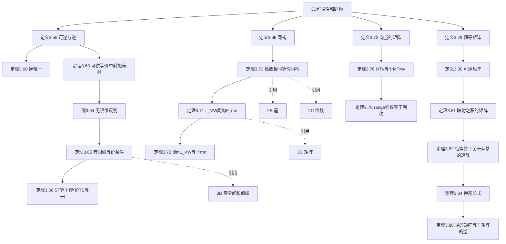

# 3D 可逆性和同构

> [!abstract] 本节概览
> 本节围绕==可逆线性映射==和==同构==两个核心概念展开，建立了一系列等价刻画，并最终导出==换基公式==。同构精确地刻画了"两个向量空间本质上相同"的含义——==维数相同==是唯一的判别标准。本节还证明了 $\mathcal{L}(V,W)$ 与 $\mathbb{F}^{m,n}$ 同构，以及线性映射的作用可以用矩阵乘法表达：$M(Tv) = M(T)M(v)$。
>
> **逻辑链条**：可逆定义 → 逆的唯一性 → 可逆 ⟺ 单射+满射 → 有限维下三者等价 → 同构 → 维数判别 → $\mathcal{L}(V,W) \cong \mathbb{F}^{m,n}$ → 向量矩阵 → $M(Tv)=M(T)M(v)$ → range 维数 = 列秩 → 恒等矩阵/可逆矩阵 → ==换基公式== $A=C^{-1}BC$
>
> **前置依赖**：[[3A 线性映射所成的向量空间]]（线性映射定义与运算）、[[3B 零空间和值域]]（单射/满射性、基本定理 3.21）、[[3C 矩阵]]（$M(T)$ 的定义、矩阵乘法、列秩）、[[2B 基]]（基的选取与坐标表示）、[[2C 维数]]（维数等式）
>
> **核心主线**：可逆性是线性映射"完美对应"的精确表述——在有限维等维空间中，单射、满射、可逆三者完全等价；同构将不同向量空间统一为同一维数下的等价类

---

## 一、可逆线性映射

### 1.1 可逆与逆的定义

> [!def] 定义 3.59：可逆的（invertible）、逆（inverse）
> 设 $T \in \mathcal{L}(V, W)$，如果存在线性映射 $S \in \mathcal{L}(W, V)$，使得
> $$ST = I_V \quad \text{且} \quad TS = I_W$$
> （其中 $I_V$ 是 $V$ 上的恒等算子，$I_W$ 是 $W$ 上的恒等算子），则称 $T$ 是**可逆的**。满足上述条件的 $S$ 被称为 $T$ 的一个**逆**。

> [!note] 学习注解
> - 注意 $ST = I_V$ 和 $TS = I_W$ **缺一不可**。$S$ 和 $T$ 作用于不同空间，顺序不可交换。
> - 定义说的是"**一个**逆"（an inverse），因为此时尚未证明唯一性。
> - 直觉：$T$ 可逆意味着 $T$ 建立 $V$ 和 $W$ 之间的一一对应，且保持线性结构。

### 1.2 逆的唯一性

> [!thm] 定理 3.60：逆是唯一的
> 可逆的线性映射具有唯一的逆。

> [!abstract] 证明思路
> 设 $S_1, S_2$ 都是 $T$ 的逆，则
> $$S_1 = S_1 I_W = S_1(TS_2) = (S_1 T)S_2 = I_V S_2 = S_2$$
>
> **[三明治消去技巧]：** 利用结合律，将 $I_W$ 替换为 $TS_2$，再利用 $S_1 T = I_V$ 替换为 $I_V$，最终得到 $S_1 = S_2$。
>
> $\blacksquare$

> [!def] 记号 3.61：$T^{-1}$
> 如果 $T \in \mathcal{L}(V, W)$ 是可逆的，那么它的逆记作 $T^{-1}$。换言之，$T^{-1} \in \mathcal{L}(W, V)$ 是 $\mathcal{L}(W, V)$ 中唯一使得 $T^{-1}T = I_V$ 和 $TT^{-1} = I_W$ 成立的元素。

### 1.3 典型例子

> [!example] 例 3.62：$\mathbb{R}^3$ 上的可逆线性映射
> 设 $T \in \mathcal{L}(\mathbb{R}^3)$ 定义为 $T(x, y, z) = (-y, x, 4z)$。
> - 几何意义：在 $xy$ 平面上逆时针旋转 $90°$，并将 $z$ 轴分量拉伸至 $4$ 倍。
> - 逆映射：$T^{-1}(x, y, z) = (y, -x, \frac{z}{4})$（顺时针旋转 $90°$，$z$ 轴压缩至 $\frac{1}{4}$ 倍）。

> [!note] 学习注解
> 这个例子很好地展示了**可逆映射的几何直观**：旋转是可逆的（反向旋转即可），非零拉伸也是可逆的（反向拉伸即可）。两者复合仍然可逆。

---

## 二、有限维空间中的等价条件

### 2.1 核心等价定理

> [!thm] 定理 3.63：可逆性 ⟺ 单射性 + 满射性
> 一个线性映射是可逆的，**当且仅当**它既是单射又是满射。

> [!abstract] 证明思路
> **方向一（可逆 → 单射+满射）：**
>
> - **[单射性]：** $Tu = Tv \Rightarrow u = T^{-1}(Tu) = T^{-1}(Tv) = v$
> - **[满射性]：** $\forall w \in W$，$w = T(T^{-1}w) \in \text{range}\, T$
>
> **方向二（单射+满射 → 可逆）：**
>
> - **[构造逆映射]：** 对每个 $w \in W$，由满射性知存在 $v \in V$ 使 $Tv = w$；由单射性知这样的 $v$ 唯一。定义 $S(w) = v$。
> - **[验证 $ST = I_V$]：** 对任意 $v \in V$，$T(S(Tv)) = Tv$（因为 $S(Tv)$ 是满足 $T(\cdot) = Tv$ 的唯一向量，即 $v$ 本身），故 $S(Tv) = v$。
> - **[验证 $TS = I_W$]：** 由 $S$ 的定义，$T(Sw) = w$，故 $TS = I_W$。
> - **[验证 $S$ 是线性的]：**
>   - 可加性：$T(S(w_1 + w_2)) = w_1 + w_2 = T(Sw_1) + T(Sw_2) = T(Sw_1 + Sw_2)$，由 $T$ 的单射性得 $S(w_1+w_2) = Sw_1 + Sw_2$。
>   - 齐次性：$T(S(\lambda w)) = \lambda w = \lambda T(Sw) = T(\lambda Sw)$，由单射性得 $S(\lambda w) = \lambda Sw$。
>
> ==关键洞察==：满射性保证 $S$ 的**存在性**（每个 $w$ 都有原像），单射性保证 $S$ 的**良定义性**（原像唯一）。
>
> $\blacksquare$

### 2.2 无限维的反例

> [!example] 例 3.64：仅凭单射性或满射性不能推出可逆性
> - 与 $x^2$ 相乘的映射 $\mathcal{P}(\mathbb{R}) \to \mathcal{P}(\mathbb{R})$：是**单射**但不是满射（常数多项式 $1$ 不在值域中）。
> - 后向移位映射 $\mathbb{F}^\infty \to \mathbb{F}^\infty$：是**满射**但不是单射（向量 $(1,0,0,0,\ldots)$ 在零空间中）。

> [!warning] 学习注解
> 这个例子极其重要！它说明在**无限维空间**中，单射和满射是**独立**的条件，不能互推。这为下面的有限维定理做了铺垫——有限维的"好性质"在无限维中不再成立。

### 2.3 有限维下的三者等价

> [!thm] 定理 3.65：若 $\dim V = \dim W < \infty$，则单射性与满射性等价
> 假设 $V$ 和 $W$ 都是有限维向量空间，$\dim V = \dim W$，且 $T \in \mathcal{L}(V, W)$。那么
> $$T \text{ 可逆} \iff T \text{ 是单射} \iff T \text{ 是满射}$$

> [!abstract] 证明思路
> **核心工具：** [[3B 零空间和值域|线性映射基本定理（3.21）]]
> $$\dim V = \dim \text{null}\, T + \dim \text{range}\, T$$
>
> - **[单射 ⟹ 满射]：** 若 $T$ 单射，则 $\dim \text{null}\, T = 0$，故 $\dim \text{range}\, T = \dim V = \dim W$。由于 $\text{range}\, T \subseteq W$ 且维数相同，$\text{range}\, T = W$，故 $T$ 满射。
> - **[满射 ⟹ 单射]：** 若 $T$ 满射，则 $\dim \text{range}\, T = \dim W = \dim V$，故 $\dim \text{null}\, T = \dim V - \dim \text{range}\, T = 0$，即 $\text{null}\, T = \{0\}$，故 $T$ 单射。
>
> $\blacksquare$

> [!note] 学习注解
> ==这是本节最重要的定理之一！== 它意味着在有限维且维数相同的条件下，验证可逆性只需验证单射**或**满射之一即可，大大简化了问题。
>
> **特例**：当 $W = V$（即 $T \in \mathcal{L}(V)$）时，$\dim V = \dim W$ 自动满足。

> [!tip] 应用实例：例 3.67
> **问题**：给定 $q \in \mathcal{P}(\mathbb{R})$，是否存在 $p$ 使得 $(x^2 + 5x + 7)p'' = q$？
>
> **解法**：
> 1. $\mathcal{P}(\mathbb{R})$ 是无限维的，不能直接用 3.65。
> 2. 限制到有限维子空间 $\mathcal{P}_m(\mathbb{R})$，定义 $Tp = (x^2+5x+7)p''$。
> 3. 验证 $T: \mathcal{P}_m(\mathbb{R}) \to \mathcal{P}_m(\mathbb{R})$ 是良定义的（乘 $x^2+5x+7$ 升 $2$ 次，求两次导降 $2$ 次，次数不变）。
> 4. $\text{null}\, T = \{0\}$（因为 $p'' = 0$ 的多项式形如 $ax+b$，但乘以 $x^2+5x+7$ 后不为零）。
> 5. 由 3.65，$T$ 是满射，故存在 $p$。

> [!note] 学习注解
> 这个例子展示了一个强大的**技巧**：当无限维空间上的问题难以处理时，将其**限制到有限维子空间**，利用有限维的优良性质来解决问题。这是一种非常通用的数学方法。

### 2.4 单侧逆即双侧逆

> [!thm] 定理 3.68：$ST = I \iff TS = I$（$S$ 和 $T$ 作用于维数相同的向量空间）
> 假设 $V$ 和 $W$ 是维数相同的有限维向量空间，$S \in \mathcal{L}(W, V)$ 且 $T \in \mathcal{L}(V, W)$。那么 $ST = I$ 当且仅当 $TS = I$。

> [!abstract] 证明思路
> **[单侧逆 ⟹ 双侧逆]：**
>
> 假设 $ST = I_V$。
> - $ST = I_V \Rightarrow T$ 是单射（若 $Tu = Tv$，则 $u = STu = STv = v$）
> - 由定理 3.65（$\dim V = \dim W$），$T$ 单射 $\Rightarrow T$ 可逆
> - $T$ 可逆 $\Rightarrow S = T^{-1}$（因为 $ST = I$ 且逆唯一）
> - $S = T^{-1} \Rightarrow TS = TT^{-1} = I_W$
>
> $\blacksquare$

> [!note] 学习注解
> ==深刻含义==：在有限维等维数的条件下，"左逆"和"右逆"自动统一。这在无限维中不成立（参考例 3.64）。
>
> **推论**：对于有限维 $V$ 上的方阵，$AB = I \iff BA = I$（习题 24）。

---

## 三、同构向量空间

### 3.1 同构的定义

> [!def] 定义 3.69：同构（isomorphism）、同构的（isomorphic）
> **同构**就是可逆线性映射。
> 对于两个向量空间，若存在将其中一个向量空间映成另一个向量空间的同构，则称它们是**同构的**。

> [!note] 学习注解
> - "同构"和"可逆线性映射"这两个术语**同义**，但用法上有微妙区别：
>   - 用"可逆线性映射"时，强调映射本身的性质。
>   - 用"同构"时，强调两个空间之间的**本质相同性**。
> - 同构 $T: V \to W$ 可以理解为把 $v \in V$ "改写"为 $Tv \in W$——只是换了标签，结构完全一样。

### 3.2 维数判定同构

> [!thm] 定理 3.70：维数表明了向量空间是否同构
> 对于 $\mathbb{F}$ 上的两个有限维向量空间，**当且仅当它们的维数相同时**，它们才是同构的。

> [!abstract] 证明思路
> **方向一（同构 → 维数相同）：**
>
> 设 $T: V \to W$ 是同构。则 $\text{null}\, T = \{0\}$（$T$ 是单射）且 $\text{range}\, T = W$（$T$ 是满射）。
> 由 [[3B 零空间和值域|基本定理]]：$\dim V = \dim \text{null}\, T + \dim \text{range}\, T = 0 + \dim W = \dim W$。
>
> **方向二（维数相同 → 同构）：**
>
> 设 $\dim V = \dim W = n$。取 $V$ 的基 $v_1, \ldots, v_n$ 和 $W$ 的基 $w_1, \ldots, w_n$。
> 定义 $T(c_1 v_1 + \cdots + c_n v_n) = c_1 w_1 + \cdots + c_n w_n$。
> - $T$ 是满射：$w_1, \ldots, w_n$ 张成 $W$，故任意 $w \in W$ 都能写成 $T$ 的像。
> - $T$ 是单射：若 $T(\sum c_i v_i) = 0$，则 $\sum c_i w_i = 0$，由 $w_i$ 线性无关得所有 $c_i = 0$，故 $\text{null}\, T = \{0\}$。
>
> $\blacksquare$

> [!note] 学习注解
> ==核心推论==：每个 $n$ 维向量空间都与 $\mathbb{F}^n$ 同构。例如 $\mathcal{P}_m(\mathbb{F}) \cong \mathbb{F}^{m+1}$。

> [!question] 深度思考
> 既然每个有限维向量空间都与某个 $\mathbb{F}^n$ 同构，为何不只研究 $\mathbb{F}^n$？
>
> 书中给出的回答非常深刻：对 $\mathbb{F}^n$ 的研究势必引入其他向量空间（如线性映射的零空间和值域），虽然这些空间也同构于某个 $\mathbb{F}^m$，但这样考虑问题往往更复杂且不带来新见解。**直接在抽象向量空间上工作，反而更简洁、更深刻。**

### 3.3 线性映射空间的同构

> [!thm] 定理 3.71：$M$ 是 $\mathcal{L}(V, W)$ 与 $\mathbb{F}^{m,n}$ 间的同构
> 设 $v_1, \ldots, v_n$ 是 $V$ 的基且 $w_1, \ldots, w_m$ 是 $W$ 的基。那么 $M$ 是 $\mathcal{L}(V, W)$ 与 $\mathbb{F}^{m,n}$ 间的同构。

> [!abstract] 证明思路
> - **[线性性]：** 由 [[3C 矩阵|定理 3.35 和 3.38]]，$M(T+S) = M(T) + M(S)$ 且 $M(\lambda T) = \lambda M(T)$。
> - **[单射性]：** 若 $M(T) = 0$，则 $Tv_k = 0$ 对所有 $k$ 成立。由 $v_1, \ldots, v_n$ 张成 $V$，$T = 0$。
> - **[满射性]：** 给定 $A \in \mathbb{F}^{m,n}$，由 [[3C 矩阵|线性映射引理（3.4）]]，存在 $T \in \mathcal{L}(V, W)$ 使得 $Tv_k = \sum_{j=1}^{m} A_{j,k} w_j$，于是 $M(T) = A$。
>
> $\blacksquare$

> [!thm] 定理 3.72：$\dim \mathcal{L}(V, W) = (\dim V)(\dim W)$
> 假设 $V$ 和 $W$ 是有限维的。那么 $\mathcal{L}(V, W)$ 是有限维的，且 $\dim \mathcal{L}(V, W) = (\dim V)(\dim W)$。

> [!abstract] 证明思路
> 由定理 3.71，$M$ 是 $\mathcal{L}(V, W)$ 到 $\mathbb{F}^{m,n}$ 的同构。由定理 3.70，同构的空间维数相同。由 [[3C 矩阵|定理 3.40]]，$\dim \mathbb{F}^{m,n} = mn = (\dim V)(\dim W)$。
>
> $\blacksquare$

> [!note] 学习注解
> 这两个定理揭示了**线性映射空间本身也是一个向量空间**，且其维数等于定义域维数乘以目标空间维数。这是一个非常优美的结果。

---

## 四、线性映射与矩阵乘法、换基

### 4.1 向量的矩阵与 $M(Tv) = M(T)M(v)$

> [!def] 定义 3.73：向量的矩阵（matrix of a vector）、$M(v)$
> 假设 $v \in V$ 且 $v_1, \ldots, v_n$ 是 $V$ 的基。$v$ 关于该基的矩阵是 $n \times 1$ 矩阵
> $$M(v) = \begin{pmatrix} b_1 \\ \vdots \\ b_n \end{pmatrix}$$
> 其中 $b_1, \ldots, b_n$ 是使得 $v = b_1 v_1 + \cdots + b_n v_n$ 成立的标量。

> [!example] 例 3.74：多项式的矩阵
> 多项式 $2 - 7x + 5x^3 + x^4 \in \mathcal{P}_4(\mathbb{R})$ 关于标准基 $1, x, x^2, x^3, x^4$ 的矩阵为
> $$M(2 - 7x + 5x^3 + x^4) = \begin{pmatrix} 2 \\ -7 \\ 0 \\ 5 \\ 1 \end{pmatrix}$$

> [!note] 学习注解
> 一旦取定基 $v_1, \ldots, v_n$，映射 $M: V \to \mathbb{F}^{n,1}$ 就是一个**同构**。这意味着我们可以把抽象向量 $v$ "翻译"成具体的列矩阵 $M(v)$。

> [!thm] 定理 3.75：$M(T)_{\cdot,k} = M(Tv_k)$
> 设 $T \in \mathcal{L}(V, W)$，$v_1, \ldots, v_n$ 是 $V$ 的基且 $w_1, \ldots, w_m$ 是 $W$ 的基。令 $1 \le k \le n$。那么 $M(T)$ 的第 $k$ 列就等于 $M(Tv_k)$。

> [!thm] 定理 3.76：线性映射的作用就像矩阵乘法
> $$M(Tv) = M(T)M(v)$$

> [!abstract] 证明思路
> 设 $v = b_1 v_1 + \cdots + b_n v_n$，则 $Tv = b_1 Tv_1 + \cdots + b_n Tv_n$。
> $$M(Tv) = b_1 M(Tv_1) + \cdots + b_n M(Tv_n) = b_1 M(T)_{\cdot,1} + \cdots + b_n M(T)_{\cdot,n} = M(T)M(v)$$
>
> $\blacksquare$

> [!note] 学习注解
> ==这是线性代数中最核心的公式之一！==
>
> 它将三个概念完美融合：
> - **线性映射的矩阵** $M(T)$（$m \times n$ 矩阵）
> - **向量的矩阵** $M(v)$（$n \times 1$ 矩阵）
> - **矩阵乘法**
>
> **但必须牢记**：矩阵 $M(T)$ 不仅依赖于 $T$，还依赖于基的选取。后续章节的一个重要主题就是选取使矩阵尽可能简单的基。

> [!thm] 定理 3.78：$\dim \text{range}\, T$ 等于 $M(T)$ 的列秩
> 假设 $V$ 和 $W$ 是有限维的，$T \in \mathcal{L}(V, W)$。那么 $\dim \text{range}\, T$ 等于 $M(T)$ 的列秩。

> [!abstract] 证明思路
> 同构 $w \mapsto M(w)$ 将 $\text{range}\, T$ 映到 $\text{span}(M(Tv_1), \ldots, M(Tv_n))$，而 $M(Tv_1), \ldots, M(Tv_n)$ 正是 $M(T)$ 的各列。同构保持维数，故 $\dim \text{range}\, T$ 等于 $M(T)$ 的列秩。
>
> $\blacksquare$

> [!note] 学习注解
> 这个定理建立了**抽象概念**（值域维数）和**具体计算**（矩阵列秩）之间的桥梁。值得注意的是，虽然 $M(T)$ 依赖于基的选取，但列秩不变——因为 $\text{range}\, T$ 与基无关。

### 4.2 恒等矩阵与可逆矩阵

> [!def] 定义 3.79：恒等矩阵（identity matrix）、$I$
> 仅对角线上元素为 $1$ 而其他元素均为 $0$ 的 $n \times n$ 矩阵称为**恒等矩阵**，记作 $I$。

> [!note] 学习注解
> - $M(I) = I$ 对任意基成立——恒等算子的矩阵总是恒等矩阵。
> - 对任意 $m \times n$ 矩阵 $A$，有 $AI = IA = A$（前提是维度兼容）。

> [!def] 定义 3.80：可逆矩阵、$A^{-1}$
> 称方阵 $A$ 是可逆的，如果存在方阵 $B$ 使得 $AB = BA = I$。$B$ 称为 $A$ 的逆，记为 $A^{-1}$。

> [!note] 学习注解
> 矩阵的可逆性与线性映射的可逆性完全对应：
> - $(A^{-1})^{-1} = A$
> - $(AC)^{-1} = C^{-1}A^{-1}$（==注意顺序反转！==，与函数复合的逆一致）

### 4.3 换基公式

> [!thm] 定理 3.81：线性映射之积的矩阵（推广版）
> 设 $T \in \mathcal{L}(U, V)$ 且 $S \in \mathcal{L}(V, W)$。如果 $u_1, \ldots, u_m$ 是 $U$ 的基，$v_1, \ldots, v_n$ 是 $V$ 的基且 $w_1, \ldots, w_p$ 是 $W$ 的基，那么
> $$M(ST, (u_1,\ldots,u_m), (w_1,\ldots,w_p)) = M(S, (v_1,\ldots,v_n), (w_1,\ldots,w_p)) \cdot M(T, (u_1,\ldots,u_m), (v_1,\ldots,v_n))$$

> [!note] 学习注解
> 这正是**矩阵乘法定义的动机**——我们定义矩阵乘法就是为了使这个等式成立！

> [!thm] 定理 3.82：恒等算子关于两个基的矩阵互逆
> 假设 $u_1, \ldots, u_n$ 和 $v_1, \ldots, v_n$ 是 $V$ 的两个基。那么矩阵
> $$M(I, (u_1,\ldots,u_n), (v_1,\ldots,v_n)) \quad \text{和} \quad M(I, (v_1,\ldots,v_n), (u_1,\ldots,u_n))$$
> 都是可逆的，且互为对方的逆。

> [!abstract] 证明思路
> 在定理 3.81 中取 $S = T = I$，则
> $$M(I, (u), (u)) = M(I, (v), (u)) \cdot M(I, (u), (v))$$
> 而 $M(I, (u), (u)) = I$（恒等算子在同一基下的矩阵是恒等矩阵），故两个矩阵互逆。
>
> $\blacksquare$

> [!note] 学习注解
> **直觉理解**：$M(I, (u), (v))$ 的第 $k$ 列就是把 $u_k$ 用基 $v_1, \ldots, v_n$ 表示的坐标。这个矩阵本质上是一个"**坐标翻译器**"——把 $u$-基下的坐标翻译成 $v$-基下的坐标。

> [!example] 例 3.83：$\mathbb{F}^2$ 的换基矩阵
> $\mathbb{F}^2$ 的两组基：$(4,2), (5,3)$ 和 $(1,0), (0,1)$。
>
> $M(I, ((4,2),(5,3)), ((1,0),(0,1))) = \begin{pmatrix} 4 & 5 \\ 2 & 3 \end{pmatrix}$
>
> 其逆为 $M(I, ((1,0),(0,1)), ((4,2),(5,3))) = \begin{pmatrix} 4 & 5 \\ 2 & 3 \end{pmatrix}^{-1} = \begin{pmatrix} \frac{3}{2} & -\frac{5}{2} \\ -1 & 2 \end{pmatrix}$

> [!thm] 定理 3.84：换基公式（change-of-basis formula）
> 设 $T \in \mathcal{L}(V)$。假设 $u_1, \ldots, u_n$ 和 $v_1, \ldots, v_n$ 都是 $V$ 的基。令
> $$A = M(T, (u_1,\ldots,u_n)), \quad B = M(T, (v_1,\ldots,v_n)), \quad C = M(I, (u_1,\ldots,u_n), (v_1,\ldots,v_n))$$
> 那么
> $$A = C^{-1}BC$$

> [!abstract] 证明思路
> 1. 由 3.81（取 $S = I$）：$A = C^{-1} \cdot M(T, (u), (v))$（利用 3.82 知 $C^{-1} = M(I, (v), (u))$）
> 2. 再由 3.81（取 $T = I, S = T$）：$M(T, (u), (v)) = BC$
> 3. 代入得 $A = C^{-1}(BC) = C^{-1}BC$
>
> $\blacksquare$

> [!note] 学习注解
> ==换基公式是本节的压轴定理，也是线性代数中最实用的公式之一！==
>
> **几何意义**：$A$ 和 $B$ 是同一个线性映射 $T$ 在不同基下的矩阵，它们是**相似的**（$A = C^{-1}BC$）。矩阵 $C$ 是基变换的"翻译器"。
>
> **核心启示**：后续章节（特征值、特征向量、谱定理）的一个主要目标就是选取基使 $B$ 尽可能简单（如对角矩阵）。

> [!thm] 定理 3.86：逆的矩阵等于矩阵的逆
> 设 $v_1, \ldots, v_n$ 是 $V$ 的基且 $T \in \mathcal{L}(V)$ 是可逆的。那么 $M(T^{-1}) = M(T)^{-1}$。

> [!note] 学习注解
> 这个定理优雅地表明：取逆的操作在"线性映射"和"矩阵"两个层面是完全一致的。

---

## 五、知识结构总览

---

## 六、核心思想与证明技巧

> [!success] 核心思想
> 1. ==可逆性统一了单射性和满射性==——在有限维等维空间中，三者完全等价
> 2. ==同构是"向量空间相同性"的精确表述==——[[2C 维数|维数]]是唯一的判别标准
> 3. $M(Tv)=M(T)M(v)$ 是线性映射与矩阵之间的==终极桥梁==
> 4. 换基公式 $A=C^{-1}BC$ 揭示了矩阵随基变化的规律——==相似矩阵的本质==是同一个变换的不同描述

> [!tip] 证明技巧清单
> 1. **逆的唯一性**：$S_1=S_1(TS_2)=(S_1T)S_2=S_2$（三明治技巧）
> 2. **构造逆映射**：利用满射性保证存在性，单射性保证唯一性
> 3. **基本定理推导等价条件**：$\dim V = \dim \text{null}\, T + \dim \text{range}\, T$ 是万能工具
> 4. **单侧逆推出双侧逆**：$ST=I \Rightarrow T \text{ 单射} \Rightarrow T \text{ 可逆} \;(\dim V=\dim W)$

---

## 七、补充理解与易混淆点

### 7.1 可逆性的层次结构

> [!note]
> 可逆性在不同语境下有不同的等价条件，形成清晰的层次结构：
>
> | 层次 | 条件 | 说明 |
> |---|---|---|
> | 一般函数 | 双射 ⟺ 可逆 | 集合论基本事实 |
> | 一般线性映射 | 可逆 ⟺ 单射 **且** 满射 | 定理 3.63 |
> | 有限维等维线性映射 | 单射 ⟺ 满射 ⟺ 可逆 | 定理 3.65 |
>
> 有限维情形是特殊的——在无限维中，单射 ↛ 满射，满射 ↛ 单射（例 3.64）。
>
> **来源**：[MIT 18.700 Lecture 9](https://math.mit.edu/~sschiavo/18-700/Lectures/LessonPlan9.pdf)；[U of Toronto MAT240 Notes](https://www.math.toronto.edu/mein/teaching/MAT240/2016_MAT240/LinearAlgebra.pdf)；[LibreTexts 6.7 Invertibility](https://math.libretexts.org/Bookshelves/Linear_Algebra/Book%3A_Linear_Algebra_(Schilling_Nachtergaele_and_Lankham)/06%3A_Linear_Maps/6.07%3A_Invertibility)

### 7.2 同构的直觉：向量空间的"身份证"

> [!note]
> 两个向量空间同构 = 它们有相同的"结构" = [[2C 维数|维数]]相同。
>
> 同构映射做的事情本质上是"**改名**"——把 $V$ 中的元素改名为 $W$ 中的元素，同时保持所有线性结构（加法、标量乘法）不变。
>
> 每个 $n$ 维空间在某种意义上"暗地里"就是 $\mathbb{F}^n$，只是贴了不同的标签。但为什么不全用 $\mathbb{F}^n$？因为自然构造（如 [[3B 零空间和值域|零空间]]和[[3B 零空间和值域|值域]]）会产生其他空间，直接在抽象空间上工作更简洁。
>
> **来源**：[Ximera OSU - Isomorphic Vector Spaces](https://ximera.osu.edu/oerlinalg/LinearAlgebra/LTR-0060/main)；[Clark University Math 130](http://aleph0.clarku.edu/~ma130/isomorphism.pdf)；[Jay Daigle - Isomorphisms and Similarity](https://jaydaigle.net/assets/courses/2017-spring-214/5_isomorphisms.pdf)

### 7.3 换基公式的几何直觉

> [!note]
> 换基公式 $A = C^{-1}BC$ 的三个因子各有明确的几何角色：
> - $C$：将新基坐标转换为旧基坐标
> - $B$：在旧基下执行线性变换
> - $C^{-1}$：将结果从旧基坐标转换回新基坐标
>
> **相似矩阵**（$A$ 和 $B$ 满足 $A = C^{-1}BC$）代表**同一个线性变换在不同基下的不同面孔**。选取合适的基可以使矩阵尽可能简单（对角矩阵、上三角矩阵等），这正是后续特征值理论的核心动机。
>
> **来源**：[Harvard Math 22b - Knill](https://math.harvard.edu/~knill/teaching/math22b2019/handouts/lecture05.pdf)；[Georgia Tech Interactive Linear Algebra - Similarity](https://textbooks.math.gatech.edu/ila/similarity.html)；[LibreTexts - Coordinatization and Similar Matrices](https://math.libretexts.org/Courses/Irvine_Valley_College/Math_26:_Introduction_to_Linear_Algebra/03:_Eigenvalues_and_Eigenvectors/3.02:_Similarity_and_Diagonalization/3.2.01:_Coordinatization_and_Similar_Matrices)

### 7.4 常见误区

> [!danger] 误区1：单射（或满射）就能推出可逆
> ❌ 认为线性映射只要单射（或满射）就可逆
> ✅ 一般需要同时单射且满射。仅在 $\dim V = \dim W < \infty$ 时，单射 ⟺ 满射 ⟺ 可逆。无限维空间中两者独立（参考例 3.64）。
> **来源**：[MIT 18.700 Lecture 9](https://math.mit.edu/~sschiavo/18-700/Lectures/LessonPlan9.pdf)；[U of Toronto MAT240 Notes](https://www.math.toronto.edu/mein/teaching/MAT240/2016_MAT240/LinearAlgebra.pdf)

> [!danger] 误区2：所有方阵都可逆
> ❌ 认为只要是方阵就一定有逆
> ✅ 方阵可逆当且仅当其列线性无关（或行线性无关，或行列式非零）。零矩阵、奇异矩阵不可逆。
> **来源**：[Cornell Math 2940 - Invertible Matrices](https://pi.math.cornell.edu/~jerison/math2940/invertible-matrices.pdf)；[LibreTexts 6.7 Invertibility](https://math.libretexts.org/Bookshelves/Linear_Algebra/Book%3A_Linear_Algebra_(Schilling_Nachtergaele_and_Lankham)/06%3A_Linear_Maps/6.07%3A_Invertibility)

> [!danger] 误区3：$AB=I$ 就能推出 $BA=I$（任意矩阵）
> ❌ 对任意大小的矩阵认为 $AB=I \Rightarrow BA=I$
> ✅ 仅当 $A$ 和 $B$ 是同阶方阵时成立（由定理 3.68）。对非方阵，$AB=I_m$ 和 $BA=I_n$ 可能一个成立另一个不成立。
> **来源**：LADR 定理 3.68；[Cornell Math 2940](https://pi.math.cornell.edu/~jerison/math2940/invertible-matrices.pdf)；[arXiv: AB=I implies BA=I](https://arxiv.org/pdf/1608.08964v1)

> [!danger] 误区4：逆矩阵与转置矩阵混淆
> ❌ 混淆 $A^{-1}$ 和 $A^t$，认为逆就是转置
> ✅ 逆矩阵满足 $AA^{-1}=A^{-1}A=I$，转置仅交换行列。仅在正交矩阵（幺正矩阵）时 $A^{-1}=A^t$。
> **来源**：[Duke University - Matrix Inverses](https://services.math.duke.edu/~jdr/ila/matrix-inverses.html)

> [!danger] 误区5：$(AB)^{-1} = A^{-1}B^{-1}$
> ❌ 认为乘积的逆等于逆的按序乘积
> ✅ $(AB)^{-1} = B^{-1}A^{-1}$，顺序反转！这与函数复合 $(f \circ g)^{-1} = g^{-1} \circ f^{-1}$ 一致。
> **来源**：LADR 定义 3.80；[CSDN 逆矩阵易错点](https://blog.csdn.net/passxgx/article/details/134564846)；[Duke University - Matrix Inverses](https://services.math.duke.edu/~jdr/ila/matrix-inverses.html)

> [!danger] 误区6：同构的向量空间是"同一个空间"
> ❌ 认为同构意味着两个空间完全相同
> ✅ 同构意味着结构相同（[[2C 维数|维数]]相同），但元素可能完全不同。例如 $\mathcal{P}_3(\mathbb{R})$ 和 $\mathbb{R}^4$ 同构，但多项式和 4 元组是不同对象。同构只保证线性代数性质一致。
> **来源**：[Jay Daigle - Isomorphisms](https://jaydaigle.net/assets/courses/2017-spring-214/5_isomorphisms.pdf)；[Clark University Math 130](http://aleph0.clarku.edu/~ma130/isomorphism.pdf)；[Ximera OSU](https://ximera.osu.edu/oerlinalg/LinearAlgebra/LTR-0060/main)

---

## 八、习题精选

> [!todo] 推荐习题总览
> | 习题 | 核心考点 | 难度 |
> |---|---|---|
> | 习题 1 | $(T^{-1})^{-1} = T$ | ⭐ |
> | 习题 3 | $T$ 可逆 ⟺ $T$ 将基映为基 | ⭐⭐⭐ |
> | 习题 5 | 单射映射的扩张 | ⭐⭐⭐ |
> | 习题 11 | $ST$ 可逆 ⟺ $S, T$ 均可逆 | ⭐⭐ |
> | 习题 19 | $M(T)$ 与基无关 ⟺ $T = \lambda I$ | ⭐⭐⭐ |
> | 习题 21 | 齐次方程 vs 非齐次方程 | ⭐⭐ |
> | 习题 24 | $AB = I \Rightarrow BA = I$（方阵） | ⭐⭐ |

---

> [!problem] 习题 1：$(T^{-1})^{-1} = T$
> 假设 $T \in \mathcal{L}(V, W)$ 是可逆的。证明 $(T^{-1})^{-1} = T$。

> [!faq]- 查看解答
> 由 $T^{-1}$ 的定义，$T^{-1}T = I_V$ 且 $TT^{-1} = I_W$。
> 这恰好说明 $T$ 满足 $T^{-1}$ 的逆的定义（交换 $T$ 和 $T^{-1}$ 的角色）。
> 由逆的唯一性（定理 3.60），$(T^{-1})^{-1} = T$。$\blacksquare$

---

> [!problem] 习题 3：$T$ 可逆 ⟺ $T$ 将（某个/每个）基映为基
> 假设 $V$ 和 $W$ 是有限维向量空间且 $\dim V = \dim W$。证明 $T \in \mathcal{L}(V, W)$ 是可逆的，当且仅当以下条件之一成立：
>
> (a) $T$ 将 $V$ 的每个基都映为 $W$ 的基。
>
> (b) $T$ 将 $V$ 的某个基映为 $W$ 的基。
>
> (c) $T$ 将 $V$ 的某个基映为 $W$ 的某个基。

> [!faq]- 查看解答
> **(a) ⟹ (b) ⟹ (c)**：显然。
>
> **(c) ⟹ (a)**：只需证明 $T$ 可逆。
>
> 设 $T$ 将某个基 $v_1, \ldots, v_n$ 映为 $W$ 的某个基 $w_1, \ldots, w_n$。
> - **$T$ 是满射**：$w_1, \ldots, w_n$ 是 $W$ 的基，张成 $W$。任意 $w \in W$ 可写成 $w = \sum a_k w_k = \sum a_k Tv_k = T(\sum a_k v_k) \in \text{range}\, T$。
> - **$T$ 是单射**：若 $\sum a_k v_k \in \text{null}\, T$，则 $T(\sum a_k v_k) = \sum a_k w_k = 0$。由 $w_1, \ldots, w_n$ 线性无关，所有 $a_k = 0$，故 $\text{null}\, T = \{0\}$。
>
> 由定理 3.65（$\dim V = \dim W$），$T$ 可逆。
>
> **(a) 的证明**：$T$ 可逆 ⟹ $T^{-1}$ 存在。设 $v_1, \ldots, v_n$ 是 $V$ 的任意基。
> - 线性无关：若 $\sum a_k (Tv_k) = 0$，则 $T(\sum a_k v_k) = 0$，由单射性 $\sum a_k v_k = 0$，故所有 $a_k = 0$。
> - 张成 $W$：任意 $w \in W$，$w = T(T^{-1}w) = T(\sum b_k v_k) = \sum b_k (Tv_k)$。
>
> 故 $Tv_1, \ldots, Tv_n$ 是 $W$ 的基。$\blacksquare$

---

> [!problem] 习题 5：单射映射的扩张
> 假设 $U$ 是 $V$ 的子空间，$S \in \mathcal{L}(U, W)$。证明：$S$ 可以扩张为 $V$ 到 $W$ 的可逆线性映射，当且仅当 $S$ 是单射且 $\dim W = \dim V$。

> [!faq]- 查看解答
> **(⇒)**：若 $T \in \mathcal{L}(V, W)$ 可逆且 $T|_U = S$，则 $S$ 是 $T$ 在 $U$ 上的限制。$T$ 是单射 $\Rightarrow$ $S$ 也是单射。$T$ 可逆 $\Rightarrow$ $\dim V = \dim W$。
>
> **(⇐)**：设 $S: U \to W$ 是单射且 $\dim W = \dim V$。
> - 取 $U$ 的基 $u_1, \ldots, u_k$，扩张为 $V$ 的基 $u_1, \ldots, u_k, v_{k+1}, \ldots, v_n$。
> - $Su_1, \ldots, Su_k$ 线性无关（$S$ 单射）。将其扩张为 $W$ 的基 $Su_1, \ldots, Su_k, w_{k+1}, \ldots, w_n$。
> - 定义 $T \in \mathcal{L}(V, W)$：$Tu_i = Su_i$（$i = 1, \ldots, k$），$Tv_j = w_j$（$j = k+1, \ldots, n$）。
> - $T$ 将 $V$ 的基映为 $W$ 的基，由习题 3，$T$ 可逆。$\blacksquare$

---

> [!problem] 习题 11：$ST$ 可逆 ⟺ $S$ 和 $T$ 均可逆
> 假设 $V$ 是有限维向量空间，$S, T \in \mathcal{L}(V)$。证明 $ST$ 可逆，当且仅当 $S$ 和 $T$ 都可逆。

> [!faq]- 查看解答
> **(⇒)**：假设 $ST$ 可逆。
> - $ST$ 单射 $\Rightarrow$ $T$ 单射（若 $Tv = 0$，则 $STv = 0$，由 $ST$ 单射得 $v = 0$）。
> - $ST$ 满射 $\Rightarrow$ $S$ 满射（任意 $w \in V$，$w = STv = S(Tv) \in \text{range}\, S$）。
> - 由定理 3.65（$\dim V = \dim V$）：$T$ 单射 $\Rightarrow$ $T$ 可逆；$S$ 满射 $\Rightarrow$ $S$ 可逆。
>
> **(⇐)**：若 $S$ 和 $T$ 都可逆，则 $(T^{-1}S^{-1})(ST) = T^{-1}(S^{-1}S)T = T^{-1}IT = T^{-1}T = I$。
> 同理 $(ST)(T^{-1}S^{-1}) = I$。故 $ST$ 可逆且 $(ST)^{-1} = T^{-1}S^{-1}$。$\blacksquare$

---

> [!problem] 习题 19：$M(T)$ 与基无关 ⟺ $T = \lambda I$
> 假设 $V$ 是有限维的，$T \in \mathcal{L}(V)$。证明 $M(T)$ 关于 $V$ 的每个基都相同，当且仅当 $T = \lambda I$（某个 $\lambda \in \mathbb{F}$）。

> [!faq]- 查看解答
> **(⇐)**：若 $T = \lambda I$，则对任意基 $v_1, \ldots, v_n$，$Tv_k = \lambda v_k$，故 $M(T) = \lambda I$ 与基无关。
>
> **(⇒)**：设 $M(T)$ 关于每个基都等于同一个矩阵 $A$。
> - 对任意可逆矩阵 $C$（代表某个换基），换基公式给出 $A = C^{-1}AC$，即 $CA = AC$。
> - $A$ 与**所有**可逆矩阵 $C$ 可交换。
> - 取 $C$ 为将第 $i$ 行和第 $j$ 行交换的置换矩阵，可推出 $A$ 的非对角元素为零。
> - 取 $C$ 为将第 $i$ 行乘以非零常数 $c$ 的对角矩阵，可推出 $A$ 的所有对角元素相等。
> - 故 $A = \lambda I$，从而 $T = \lambda I$。$\blacksquare$

---

> [!problem] 习题 21：齐次方程 vs 非齐次方程
> 假设 $A$ 是 $n \times n$ 矩阵。证明以下条件等价：
>
> (a) 齐次方程 $Ax = 0$ 只有平凡解 $x = 0$。
>
> (b) 对每个 $b \in \mathbb{F}^n$，非齐次方程 $Ax = b$ 都有解。

> [!faq]- 查看解答
> 设 $T \in \mathcal{L}(\mathbb{F}^n)$ 由 $Tx = Ax$ 定义。
>
> - (a) 说的是 $\text{null}\, T = \{0\}$，即 $T$ 是单射。
> - (b) 说的是 $\text{range}\, T = \mathbb{F}^n$，即 $T$ 是满射。
>
> 由定理 3.65（$\dim \mathbb{F}^n = \dim \mathbb{F}^n$），单射 ⟺ 满射，故 (a) ⟺ (b)。$\blacksquare$

---

> [!problem] 习题 24：$AB = I \Rightarrow BA = I$（方阵）
> 假设 $A$ 和 $B$ 都是 $n \times n$ 矩阵且 $AB = I$。证明 $BA = I$。

> [!faq]- 查看解答
> 设 $T_A, T_B \in \mathcal{L}(\mathbb{F}^n)$ 分别由矩阵 $A$ 和 $B$ 定义。
>
> $AB = I$ 意味着 $T_A \circ T_B = I$，即 $T_A T_B = I$。
>
> - $T_A T_B = I \Rightarrow T_A$ 是满射（任意 $y$，$y = T_A(T_B y)$）。
> - 由定理 3.65（$\dim \mathbb{F}^n = \dim \mathbb{F}^n$），$T_A$ 满射 $\Rightarrow T_A$ 可逆。
> - $T_A$ 可逆 $\Rightarrow T_B = T_A^{-1}$（因为 $T_A T_B = I$ 且逆唯一）。
> - $T_B = T_A^{-1} \Rightarrow T_B T_A = I$，即 $BA = I$。$\blacksquare$

---

## 九、视频学习指南

> [!info] 视频资源
> | 视频主题 | 对应笔记模块 | 平台 |
> |---|---|---|
> | 3Blue1Brown 线性代数的本质 第5章：逆矩阵、列空间与零空间 | 模块一、模块三 | YouTube / B站 |
> | 3Blue1Brown 逆矩阵和列空间 | 模块一、模块四 | YouTube / B站 |
> | 3Blue1Brown 非方阵、矩阵的秩 | 模块二 | YouTube / B站 |

> [!info] 视频精要
> - **3Blue1Brown 第5章**：逆矩阵的几何意义——列空间"填满"整个目标空间 ⟺ 可逆。当列空间维数等于目标空间维数时，变换可逆。
> - **换基的几何意义**：同一个线性变换在不同坐标系下的不同"面孔"。换基公式 $A = C^{-1}BC$ 中的 $C$ 就是坐标系之间的"翻译器"。
> - **相似矩阵** $A = C^{-1}BC$ 代表同一变换的不同描述——选取合适的基（如特征向量组成的基）可以使矩阵变得极为简洁。

---

## 十、教材原文
#学习/线性代数/线性映射/可逆性和同构
