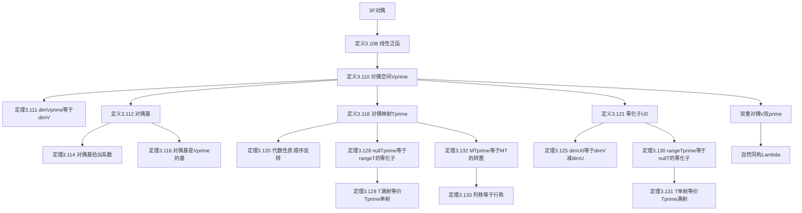

# 3F 对偶

> [!abstract] 本节概览
> 本节研究线性代数中最深刻的对偶性理论。从线性泛函出发，构建==对偶空间== $V'$，引入对偶基和对偶映射，通过零化子连接子空间与对偶空间，最终揭示原映射与对偶映射之间单射/满射互换的优美对称性，并以==双重对偶的自然同构==收尾。
>
> **逻辑链条**：线性泛函 → 对偶空间 $V'$ → 对偶基 → 坐标提取 → 对偶映射 $T'$（方向反转）→ 零化子 $U^0$ → $\text{null}\,T' = (\text{range}\,T)^0$ → 单射/满射互换 → $M(T') = M(T)^t$ → 列秩=行秩对偶证法 → ==双重对偶== $V''$ → 自然同构 $\Lambda$
>
> **前置依赖**：[[3A 线性映射所成的向量空间]]（$\mathcal{L}(V,W)$ 的维数公式）、[[3B 零空间和值域]]（基本定理 3.21）、[[3C 矩阵]]（矩阵表示、列秩）、[[3D 可逆性和同构]]（同构与可逆映射）、[[3E 向量空间的积和商]]（商空间维数公式）、[[2B 基]]（基与线性无关）、[[2C 维数]]（维数公式）
>
> **核心主线**：对偶翻转——方向反转、单射/满射互换、零空间与值域交叉对应

---

## 一、对偶空间与对偶基

### 线性泛函

> [!def] 定义 3.108：线性泛函（linear functional）
> $V$ 上的**线性泛函**是从 $V$ 到 $\mathbb{F}$ 的线性映射。换言之，线性泛函是 $\mathcal{L}(V, \mathbb{F})$ 的元素。

线性泛函是"最简单"的线性映射——输出只是一个标量。但它们在线性代数中扮演着极其重要的角色：内积、对偶空间、特征值理论等都离不开线性泛函。

> [!example] 例 3.109：线性泛函的例子
> - $\varphi : \mathbb{R}^3 \to \mathbb{R}$，$\varphi(x, y, z) = 4x - 5y + 2z$
> - $\varphi : \mathbb{F}^n \to \mathbb{F}$，$\varphi(x_1, \ldots, x_n) = c_1 x_1 + \cdots + c_n x_n$（固定 $(c_1, \ldots, c_n) \in \mathbb{F}^n$）
> - $\varphi : \mathcal{P}(\mathbb{R}) \to \mathbb{R}$，$\varphi(p) = 3p''(5) + 7p(4)$
> - $\varphi : \mathcal{P}(\mathbb{R}) \to \mathbb{R}$，$\varphi(p) = \int_0^1 p$

### 对偶空间

> [!def] 定义 3.110：对偶空间（dual space）、$V'$
> $V$ 的**对偶空间**记作 $V'$，是 $V$ 上全体线性泛函所构成的向量空间。换言之，$V' = \mathcal{L}(V, \mathbb{F})$。

> [!thm] 定理 3.111：$\dim V' = \dim V$
> 假设 $V$ 是有限维的。那么 $V'$ 也是有限维的，且 $\dim V' = \dim V$。

> [!abstract] 证明思路
> **直接计算维数**：由 [[3A 线性映射所成的向量空间]] 中的维数公式，
> $$\dim V' = \dim \mathcal{L}(V, \mathbb{F}) = (\dim V)(\dim \mathbb{F}) = \dim V \cdot 1 = \dim V$$
> $\blacksquare$

这个结果非常优美：$V$ 和 $V'$ 维数相同，因此它们是同构的。但要注意，找到从 $V$ 到 $V'$ 的同构通常需要选取基（模块四中讨论的 $\Lambda : V \to V''$ 则是"自然"的同构，不需要选基）。

### 对偶基

> [!def] 定义 3.112：对偶基（dual basis）
> 如果 $v_1, \ldots, v_n$ 是 $V$ 的基，那么其**对偶基**是 $V'$ 中的元素 $\varphi_1, \ldots, \varphi_n$ 所构成的组，其中各 $\varphi_j$ 满足：
> $$\varphi_j(v_k) = \delta_{jk} = \begin{cases} 1 & \text{若 } k = j, \\ 0 & \text{若 } k \neq j. \end{cases}$$
> 这里 $\delta_{jk}$ 是 Kronecker delta 符号。

> [!example] 例 3.113：$\mathbb{F}^n$ 的标准基的对偶基
> 设 $e_1, \ldots, e_n$ 是 $\mathbb{F}^n$ 的标准基。对偶基 $\varphi_1, \ldots, \varphi_n$ 就是"取第 $j$ 个坐标"的线性泛函：
> $$\varphi_j(x_1, \ldots, x_n) = x_j$$
> 这就是==坐标投影==（coordinate projection）。

> [!thm] 定理 3.114：对偶基给出了线性组合的系数
> 假设 $v_1, \ldots, v_n$ 是 $V$ 的基，且 $\varphi_1, \ldots, \varphi_n$ 是其对偶基。那么对每个 $v \in V$，有
> $$v = \varphi_1(v) v_1 + \cdots + \varphi_n(v) v_n$$

> [!abstract] 证明思路
> **对偶基提取系数**：设 $v = c_1 v_1 + \cdots + c_n v_n$。两端作用 $\varphi_j$，利用线性性得：
> $$\varphi_j(v) = c_1 \varphi_j(v_1) + \cdots + c_n \varphi_j(v_n) = c_1 \cdot 0 + \cdots + c_j \cdot 1 + \cdots + c_n \cdot 0 = c_j$$
> 将 $c_j = \varphi_j(v)$ 代入原展开式即得。$\blacksquare$

==关键洞察==：对偶基的每个 $\varphi_j$ 就是一个"坐标提取器"——它从向量 $v$ 中提取出第 $j$ 个坐标（相对于基 $v_1, \ldots, v_n$）。

> [!thm] 定理 3.116：对偶基是对偶空间的基
> 假设 $V$ 是有限维的。那么 $V$ 的基的对偶基是 $V'$ 的基。

> [!abstract] 证明思路
> **线性无关性**：设 $a_1 \varphi_1 + \cdots + a_n \varphi_n = 0$（$V'$ 中的零映射）。两端作用于 $v_k$ 得：
> $$0 = (a_1 \varphi_1 + \cdots + a_n \varphi_n)(v_k) = a_1 \cdot 0 + \cdots + a_k \cdot 1 + \cdots + a_n \cdot 0 = a_k$$
> 故 $a_k = 0$（对每个 $k$），所以 $\varphi_1, \ldots, \varphi_n$ 线性无关。
>
> **长度匹配**：$\dim V' = \dim V = n$（定理 3.111），而我们有 $n$ 个线性无关的元素。
>
> **结论**：由 [[2C 维数]] 中的定理 2.38，$n$ 个线性无关的元素构成 $n$ 维空间的基。$\blacksquare$

---

## 二、对偶映射

### 定义

> [!def] 定义 3.118：对偶映射（dual map）、$T'$
> 设 $T \in \mathcal{L}(V, W)$。$T$ 的**对偶映射**是 $T' \in \mathcal{L}(W', V')$，定义为：对每个 $\varphi \in W'$，
> $$T'(\varphi) = \varphi \circ T$$

> [!warning] 方向反转！
> - $T : V \to W$，但 $T' : W' \to V'$——==方向反转了！==
> - $T$ 的定义域 $V$ 变成了 $T'$ 的上标域（$T'$ 的值域），$T$ 的上标域 $W$ 变成了 $T'$ 的定义域
> - $T'(\varphi)$ 就是 $\varphi$ 和 $T$ 的复合，所以 $T'(\varphi) \in V'$（从 $V$ 到 $\mathbb{F}$ 的映射）
> - 有些书用 $V^*$ 和 $T^*$ 表示对偶，但 Axler 将 $T^*$ 预留给第 7 章的==伴随==（adjoint）

> [!example] 例 3.119：微分映射的对偶
> 设 $D : \mathcal{P}(\mathbb{R}) \to \mathcal{P}(\mathbb{R})$，$Dp = p'$。
>
> - 取 $\varphi(p) = p(3)$。则 $D'(\varphi)(p) = \varphi(Dp) = \varphi(p') = p'(3)$。
> - 取 $\hat{\varphi}(p) = \int_0^1 p$。则 $D'(\hat{\varphi})(p) = \hat{\varphi}(p') = \int_0^1 p' = p(1) - p(0)$。

### 代数性质

> [!thm] 定理 3.120：对偶映射的代数性质
> 设 $T \in \mathcal{L}(V, W)$。那么
> - (a) $(S + T)' = S' + T'$
> - (b) $(\lambda T)' = \lambda T'$
> - (c) ==$(ST)' = T'S'$（顺序反转！）==

> [!abstract] 证明思路
> **证明 (c)——顺序反转**：对任意 $\varphi \in W'$，
> $$(ST)'(\varphi) = \varphi \circ (ST) = (\varphi \circ S) \circ T = T'(\varphi \circ S) = T'(S'(\varphi)) = (T'S')(\varphi)$$
> 因此 $(ST)' = T'S'$。$\blacksquare$
>
> (a) 和 (b) 的证明类似，直接展开定义即可。

==顺序反转==是对偶映射最重要的性质：复合的顺序在对偶时反转。这与矩阵转置的性质 $(AC)^t = C^t A^t$ 完全对应（模块四将看到 $M(T') = M(T)^t$）。

---

## 三、零化子与对偶映射的零空间/值域

### 零化子

> [!def] 定义 3.121：零化子（annihilator）、$U^0$
> 对 $U \subseteq V$，$U$ 的**零化子**记作 $U^0$，定义为
> $$U^0 = \{\varphi \in V' : \varphi(u) = 0 \text{ 对所有 } u \in U\}$$

直觉：$U^0$ 是 $V'$ 中所有"看不见" $U$ 的线性泛函——它们在 $U$ 上全部取值为 $0$。记号 $U^0$ 中的上标 $0$ 暗示"取值为零"。

> [!example] 例 3.122：多项式空间的零化子
> $U = \{x^2 p(x) : p \in \mathcal{P}(\mathbb{R})\} \subseteq \mathcal{P}(\mathbb{R})$。取 $\varphi(p) = p'(0)$。对任意 $u = x^2 p(x) \in U$，$u'(x) = 2xp(x) + x^2 p'(x)$，故 $u'(0) = 0$。因此 $\varphi(u) = 0$，即 $\varphi \in U^0$。

> [!example] 例 3.123：$\mathbb{R}^5$ 中的零化子
> $U = \text{span}(e_1, e_2) \subseteq \mathbb{R}^5$。则 $\varphi \in U^0$ 当且仅当 $\varphi(e_1) = 0$ 且 $\varphi(e_2) = 0$。对于标准基的对偶基 $\psi_1, \ldots, \psi_5$，有 $U^0 = \text{span}(\psi_3, \psi_4, \psi_5)$，$\dim U^0 = 3 = 5 - 2$。

> [!thm] 定理 3.124：零化子是子空间
> 设 $U \subseteq V$。那么 $U^0$ 是 $V'$ 的子空间。

> [!thm] 定理 3.125：零化子的维数
> 设 $V$ 是有限维的且 $U$ 是 $V$ 的子空间。那么
> $$\dim U^0 = \dim V - \dim U$$

> [!abstract] 证明思路
> **包含映射技巧**：令 $i : U \to V$ 是包含映射（$i(u) = u$）。
>
> **第一步**：证明 $\text{null}\,i' = U^0$。
> $\varphi \in \text{null}\,i' \iff i'(\varphi) = 0 \iff \varphi \circ i = 0 \iff \varphi(u) = 0\ \forall u \in U \iff \varphi \in U^0$。
>
> **第二步**：证明 $\text{range}\,i' = U'$。
> $i'(\varphi) = \varphi \circ i$，将 $U$ 上的线性泛函限制到 $U$ 上。由线性泛函的延拓定理，$U$ 上的每个线性泛函都可以扩充为 $V$ 上的线性泛函，故 $\text{range}\,i' = U'$。
>
> **第三步**：由 [[3B 零空间和值域]] 中的基本定理，
> $$\dim V' = \dim \text{range}\,i' + \dim \text{null}\,i' = \dim U + \dim U^0$$
> 又 $\dim V' = \dim V$（定理 3.111），故 $\dim U^0 = \dim V - \dim U$。$\blacksquare$

==与商空间的维数公式对比==（[[3E 向量空间的积和商]]）：$\dim V/U = \dim V - \dim U$。零化子和商空间"从两个方向"消去 $U$ 的维数，但意义不同：商空间在 $V$ 中操作，零化子在 $V'$ 中操作。

> [!thm] 定理 3.127：零化子等于 $\{0\}$ 或整个空间的条件
> 设 $V$ 是有限维的且 $U$ 是 $V$ 的子空间。
> - (a) $U^0 = \{0\} \iff U = V$
> - (b) $U^0 = V' \iff U = \{0\}$

### 对偶映射的零空间和值域

> [!thm] 定理 3.128：$T'$ 的零空间
> 设 $V$ 和 $W$ 是有限维的且 $T \in \mathcal{L}(V, W)$。那么
> - (a) ==$\text{null}\,T' = (\text{range}\,T)^0$==
> - (b) $\dim \text{null}\,T' = \dim \text{null}\,T + \dim W - \dim V$

> [!abstract] 证明思路
> **证明 (a)**：对 $\varphi \in W'$，以下等价链成立：
> $$\varphi \in \text{null}\,T' \iff T'(\varphi) = 0 \iff \varphi \circ T = 0 \iff \varphi(Tv) = 0\ \forall v \in V \iff \varphi \in (\text{range}\,T)^0$$
> $\blacksquare$
>
> **证明 (b)**：由 (a) 和定理 3.125，
> $$\dim \text{null}\,T' = \dim(\text{range}\,T)^0 = \dim W - \dim \text{range}\,T$$
> 由 [[3B 零空间和值域]] 的基本定理，$\dim \text{range}\,T = \dim V - \dim \text{null}\,T$，代入得：
> $$\dim \text{null}\,T' = \dim W - (\dim V - \dim \text{null}\,T) = \dim \text{null}\,T + \dim W - \dim V$$
> $\blacksquare$

==这个等式极其重要==：它将对偶映射的零空间与原映射的值域联系起来——通过零化子这个桥梁。

> [!thm] 定理 3.129：$T$ 是满射 $\iff$ $T'$ 是单射
> 设 $V$ 和 $W$ 是有限维的且 $T \in \mathcal{L}(V, W)$。那么 $T$ 是满射当且仅当 $T'$ 是单射。

> [!abstract] 证明思路
> **零化子转译**：以下等价链成立：
> $$T \text{ 满射} \iff \text{range}\,T = W \iff (\text{range}\,T)^0 = \{0\} \iff \text{null}\,T' = \{0\} \iff T' \text{ 单射}$$
> 其中第二个 $\iff$ 用了定理 3.127(a)，第三个 $\iff$ 用了定理 3.128(a)。$\blacksquare$

> [!thm] 定理 3.130：$T'$ 的值域
> 设 $V$ 和 $W$ 是有限维的且 $T \in \mathcal{L}(V, W)$。那么
> - (a) $\dim \text{range}\,T' = \dim \text{range}\,T$
> - (b) ==$\text{range}\,T' = (\text{null}\,T)^0$==

> [!abstract] 证明思路
> **证明 (a)——维数追赶**：
> $$\dim \text{range}\,T' = \dim W' - \dim \text{null}\,T' = \dim W - \dim(\text{range}\,T)^0$$
> 由定理 3.125，$\dim(\text{range}\,T)^0 = \dim W - \dim \text{range}\,T$，代入得：
> $$\dim \text{range}\,T' = \dim W - (\dim W - \dim \text{range}\,T) = \dim \text{range}\,T$$
> $\blacksquare$
>
> **证明 (b)——包含关系加维数相等**：
> - $\text{range}\,T' \subseteq (\text{null}\,T)^0$：对 $\varphi \in W'$，若 $\varphi = T'(\psi) = \psi \circ T$，则对 $v \in \text{null}\,T$，$\varphi(v) = \psi(Tv) = \psi(0) = 0$。
> - 维数相等：$\dim \text{range}\,T' = \dim \text{range}\,T$（由 (a)），而 $\dim(\text{null}\,T)^0 = \dim V - \dim \text{null}\,T = \dim \text{range}\,T$（由定理 3.125 和基本定理）。
> - 两个子空间维数相同且一个包含另一个，故相等。$\blacksquare$

> [!thm] 定理 3.131：$T$ 是单射 $\iff$ $T'$ 是满射
> 设 $V$ 和 $W$ 是有限维的且 $T \in \mathcal{L}(V, W)$。那么 $T$ 是单射当且仅当 $T'$ 是满射。

> [!abstract] 证明思路
> **零化子转译**：以下等价链成立：
> $$T \text{ 单射} \iff \text{null}\,T = \{0\} \iff (\text{null}\,T)^0 = V' \iff \text{range}\,T' = V' \iff T' \text{ 满射}$$
> 其中第二个 $\iff$ 用了定理 3.127(b)，第三个 $\iff$ 用了定理 3.130(b)。$\blacksquare$

> [!tip] 对偶性对称性总结
> | 原映射 $T$ | 对偶映射 $T'$ |
> |:---:|:---:|
> | $T$ 满射 | $\iff$ $T'$ 单射 |
> | $T$ 单射 | $\iff$ $T'$ 满射 |
> | $\text{null}\,T'$ | $= (\text{range}\,T)^0$ |
> | $\text{range}\,T'$ | $= (\text{null}\,T)^0$ |
> | $\dim \text{range}\,T'$ | $= \dim \text{range}\,T$ |

==对偶性（duality）的核心美感==：单射和满射在对偶映射中"互换角色"。零空间和值域通过零化子"交叉对应"。这种对称性是线性代数中最深刻的美之一。

---

## 四、对偶的矩阵与双重对偶

### 对偶的矩阵是转置

> [!thm] 定理 3.132：$T'$ 的矩阵是 $T$ 的矩阵的转置
> 设 $V$ 和 $W$ 是有限维的且 $T \in \mathcal{L}(V, W)$。那么
> $$M(T') = M(T)^t$$
> 其中矩阵取关于 $V$ 的基 $v_1, \ldots, v_n$、$W$ 的基 $w_1, \ldots, w_m$ 以及各自的对偶基。

> [!abstract] 证明思路
> **逐元素比较**：设 $A = M(T)$，$C = M(T')$。设 $v_1, \ldots, v_n$ 是 $V$ 的基，$w_1, \ldots, w_m$ 是 $W$ 的基，$\varphi_1, \ldots, \varphi_n$ 和 $\psi_1, \ldots, \psi_m$ 分别是对偶基。
>
> **展开 $T'(\psi_j)$**：$T'(\psi_j) = \sum_{r=1}^{n} C_{r,j} \varphi_r$。
>
> **作用于 $v_k$**：$T'(\psi_j)(v_k) = \sum_{r=1}^{n} C_{r,j} \varphi_r(v_k) = C_{k,j}$。
>
> **另一面**：$T'(\psi_j)(v_k) = (\psi_j \circ T)(v_k) = \psi_j(Tv_k) = \psi_j\!\left(\sum_{r=1}^{m} A_{r,k} w_r\right) = \sum_{r=1}^{m} A_{r,k} \psi_j(w_r) = A_{j,k}$。
>
> **结论**：$C_{k,j} = A_{j,k}$，即 $C = A^t$，也就是 $M(T') = M(T)^t$。$\blacksquare$

==这是本节最漂亮的结论！== 对偶映射的矩阵就是原矩阵的转置——这完美解释了为什么转置如此重要。

### 列秩等于行秩的另一种证法

> [!thm] 定理 3.133：列秩等于行秩（对偶证法）
> 设 $A \in \mathbb{F}^{m,n}$。那么 $A$ 的列秩等于 $A$ 的行秩。

> [!abstract] 证明思路
> **对偶链**：
> $$A \text{ 的列秩} = \dim \text{range}\,T = \dim \text{range}\,T' = M(T') \text{ 的列秩} = A^t \text{ 的列秩} = A \text{ 的行秩}$$
>
> 其中用到了：[[3C 矩阵]] 中的列秩 = 值域维数（3.78）、定理 3.130(a)（$T$ 和 $T'$ 值域维数相同）、定理 3.132（$M(T') = M(T)^t$）。$\blacksquare$

==这个证明比 [[3C 矩阵]] 节的行列分解证法更加简洁优雅！== 它展示了对偶理论的强大威力。

### 双重对偶与自然同构

> [!def] 双重对偶（double dual）
> $V$ 的**双重对偶**记作 $V''$，定义为 $(V')' = \mathcal{L}(V', \mathbb{F})$。即 $V''$ 是 $V'$ 上的全体线性泛函。

> [!def] 求值映射 $\Lambda : V \to V''$
> 定义 $\Lambda : V \to V''$ 为：对每个 $v \in V$，$\Lambda v \in V''$ 由以下公式给出：
> $$(\Lambda v)(\varphi) = \varphi(v), \quad \forall \varphi \in V'$$
> 即 $\Lambda v$ 是 $V'$ 上的"在 $v$ 处求值"这个线性泛函。

> [!thm] 双重对偶的性质（习题 32）
> 设 $V$ 是有限维的。
> - (a) $\Lambda$ 是线性的
> - (b) 对 $T \in \mathcal{L}(V, W)$，有 $T'' \circ \Lambda_V = \Lambda_W \circ T$（交换图）
> - (c) $\Lambda$ 是同构（当 $V$ 有限维时）

> [!abstract] 证明思路
> **证明 (a)**：$(\Lambda(v + u))(\varphi) = \varphi(v + u) = \varphi(v) + \varphi(u) = (\Lambda v)(\varphi) + (\Lambda u)(\varphi)$。标量乘法类似。$\blacksquare$
>
> **证明 (b)**：对任意 $\varphi \in W'$，
> $$(T''(\Lambda v))(\varphi) = (\Lambda v)(T'\varphi) = (T'\varphi)(v) = \varphi(Tv) = (\Lambda(Tv))(\varphi)$$
> 故 $T'' \circ \Lambda = \Lambda \circ T$。$\blacksquare$
>
> **证明 (c)**：$\dim V'' = \dim V' = \dim V$。$\Lambda$ 是单射：若 $\Lambda v = 0$，则 $\varphi(v) = 0$ 对所有 $\varphi \in V'$。由习题 3（非零向量上存在取值为 1 的线性泛函），$v = 0$。由维数计数，$\Lambda$ 也是满射。$\blacksquare$

> [!success] 自然同构 vs. 非自然同构
> - $V \cong V'$：需要==选取基==才能构造同构（非自然/非典范）
> - $V \cong V''$：通过 $\Lambda$ 直接定义，==不依赖基的选取==（自然/典范）
>
> 在无穷维空间中，$\Lambda$ 仍然单射，但可能不满射——$V''$ 可以严格大于 $V$。这是泛函分析中的核心现象。

> [!thm] 商空间的对偶（习题 33）
> 设 $V$ 是有限维的且 $U$ 是 $V$ 的子空间。定义 $\pi' : (V/U)' \to U^0$ 为 $\pi'(\varphi) = \varphi \circ \pi$（其中 $\pi : V \to V/U$ 是商映射）。那么 $\pi'$ 是一个同构。

---

## 五、知识结构总览

---

## 六、核心思想与证明技巧

> [!success] 核心思想
> 1. **对偶空间将"向量"翻转为"测量向量的函数"**——线性泛函是向量空间的"坐标提取器"，$V'$ 中的每个元素都是对 $V$ 的一次线性测量
> 2. **对偶映射反转方向**——$T : V \to W$ 变为 $T' : W' \to V'$，复合也反转：$(ST)' = T'S'$。这种"反转"是对偶性最鲜明的体现
> 3. **零化子连接子空间与对偶空间**——$U^0$ 的维数 $= \dim V - \dim U$，与商空间维数公式形式相同但意义不同
> 4. **对偶翻转单射/满射**——$T$ 满射 $\iff$ $T'$ 单射，$T$ 单射 $\iff$ $T'$ 满射。零空间和值域通过零化子"交叉对应"
> 5. **双重对偶的自然同构**——$V \to V''$ 的 $\Lambda$ 不依赖基的选取，是"真正自然"的同构，与 $V \to V'$ 的基依赖同构形成鲜明对比

> [!tip] 证明技巧清单
> 1. **对偶基提取系数**：$\varphi_j(v) = c_j$——对偶基的核心功能，将抽象的展开系数转化为具体的函数求值
> 2. **包含映射技巧**（定理 3.125）：令 $i : U \to V$ 为包含映射，则 $\text{null}\,i' = U^0$，$\text{range}\,i' = U'$，将零化子问题转化为对偶映射的零空间/值域问题
> 3. **零化子转译**（定理 3.128）：$\text{null}\,T' = (\text{range}\,T)^0$ 将对偶映射的零空间问题转回原映射的值域问题
> 4. **维数追赶**（定理 3.130(b)）：证明两个子空间相等时，先证包含关系，再通过维数相等推出相等
> 5. **自然同构**（习题 32）：$\Lambda : V \to V''$ 的定义不涉及任何基的选取，与 $V \to V'$ 的基依赖同构形成对比

---

## 七、补充理解与易混淆点

### 对偶空间的直觉：行向量与列向量

如果我们把 $V$ 中的向量等同于列向量（$n \times 1$ 矩阵），那么 $V'$ 中的线性泛函就对应于行向量（$1 \times n$ 矩阵）。具体来说，线性泛函 $\varphi(v) = c_1 v_1 + \cdots + c_n v_n$ 就是行向量 $(c_1, \ldots, c_n)$ 与列向量 $(v_1, \ldots, v_n)^t$ 的矩阵乘法。对偶基 $\varphi_j$ 对应于第 $j$ 个标准行向量 $e_j^t$。

这种直觉解释了为什么对偶映射的矩阵是转置：行向量在左边乘，列向量在右边乘，对偶映射将"右乘"翻转为"左乘"，矩阵自然就转置了。

**来源**：Harvard Math 55a (Elkies) 讲义、OSU Costin 线性代数课程笔记、Michigan Speyer 对偶空间讲义

### 零化子的几何意义

$U^0$ 由所有在 $U$ 上取值为零的线性泛函组成。如果 $U$ 是 $n$ 维空间 $V$ 中的 $k$ 维子空间，那么 $U^0$ 是 $(n-k)$ 维的 $V'$ 的子空间。

以 $\mathbb{R}^3$ 为例：如果 $U$ 是过原点的一条直线（1 维），那么 $U^0$ 是 $(\mathbb{R}^3)'$ 中的一个平面（2 维）——由所有在该直线上取值为零的线性泛函构成。这与内积空间中"垂直于直线的平面"有相似之处，但零化子是对偶空间中的概念，不依赖内积。

**来源**：Clemson Macauley Lecture 1.6、Kansas Mandal 线性代数笔记、Harvard Elkies 对偶空间讲义

### 双重对偶与自然同构

$V \cong V'$ 需要选取基——不同的基给出不同的同构，没有"最优"的选择。但 $V \cong V''$ 通过 $\Lambda : (\Lambda v)(\varphi) = \varphi(v)$ 直接定义，完全不依赖基的选取。这种不依赖额外结构（如基、内积）的同构称为"自然的"（natural）或"典范的"（canonical）。

在无穷维空间中，$\Lambda$ 仍然单射，但可能不满射——$V''$ 可以严格大于 $V$。例如，取 $V = c_{00}$（有限支撑序列空间），则 $V' = \mathbb{R}^{\mathbb{N}}$（所有实数序列），而 $V''$ 更大。这是泛函分析中自反空间（reflexive space）理论的核心出发点。

**来源**：Cambridge WTG10 线性代数笔记、UCLA Math 115A 课程材料、Harvard Math 55a 讲义、今日头条数学科普文章

### 常见误区

> [!danger] 误区1：对偶映射 $T'$ 的方向与 $T$ 相同
> ❌ 认为 $T : V \to W$ 的对偶 $T'$ 也是从 $V$ 到 $W$ 的映射
> ✅ $T' : W' \to V'$，==方向反转了==！$T$ 的定义域变成 $T'$ 的上标域，$T$ 的上标域变成 $T'$ 的定义域。直觉：$T$ 把向量从 $V$ 送入 $W$，$T'$ 则把 $W$ 上的"测量工具"拉回到 $V$ 上使用。
>
> **来源**：LADR 定义 3.118、Harvard Math 55a 讲义

> [!danger] 误区2：$V$ 和 $V'$ 是"同一个空间"
> ❌ 认为对偶空间就是原空间本身
> ✅ $V$ 和 $V'$ 同构（维数相同），但==不是同一个空间==。$V$ 中的元素是向量，$V'$ 中的元素是线性泛函（函数）。找到 $V \to V'$ 的同构需要选取基，不是自然的。只有通过双重对偶 $\Lambda : V \to V''$ 才能得到不依赖基的同构。
>
> **来源**：Harvard Math 55a 讲义、OSU Gerlach 线性代数笔记、今日头条数学科普文章

> [!danger] 误区3：零化子 $U^0$ 是 $V$ 的子空间
> ❌ 认为 $U^0 \subseteq V$
> ✅ $U^0$ 是==$V'$ 的子空间==，不是 $V$ 的子空间。$U^0$ 中的元素是线性泛函（函数），不是向量。记号 $U^0$ 容易让人误以为它是 $V$ 中的东西，但实际上它生活在完全不同的空间 $V'$ 中。
>
> **来源**：LADR 定义 3.121、Clemson Macauley Lecture 1.6

> [!danger] 误区4：$(ST)' = S'T'$
> ❌ 认为对偶保持复合顺序
> ✅ $(ST)' = T'S'$，顺序==反转==！这与转置的性质 $(AB)^t = B^t A^t$ 完全一致。直觉：$ST$ 先做 $T$ 再做 $S$，但对偶时，$S$ 的对偶先作用（因为 $S'$ 在右边），$T$ 的对偶后作用。
>
> **来源**：LADR 定理 3.120、Michigan Speyer 对偶空间讲义

> [!danger] 误区5：$T'$ 的零空间与 $T$ 的零空间相同
> ❌ 认为 $\text{null}\,T' = \text{null}\,T$
> ✅ $\text{null}\,T' = (\text{range}\,T)^0$，这是 $W'$ 的子空间，而 $\text{null}\,T$ 是 $V$ 的子空间。它们甚至不在同一个空间中！正确的关系是：$T$ 满射 $\iff$ $T'$ 单射，$T$ 单射 $\iff$ $T'$ 满射。
>
> **来源**：LADR 定理 3.128/3.129/3.131

> [!danger] 误区6：$M(T') = M(T)$（不转置）
> ❌ 认为对偶映射的矩阵与原映射的矩阵相同
> ✅ $M(T') = M(T)^t$，对偶映射的矩阵是==转置==矩阵。这是在使用对偶基时的漂亮结论。行和列互换，反映了对偶映射方向反转的本质。
>
> **来源**：LADR 定理 3.132、Michigan Speyer 对偶空间讲义

---

## 八、习题精选

> [!todo] 本节习题
> | 编号 | 标题 | 核心考点 | 难度 |
> |:---:|---|---|:---:|
> | 1 | 线性泛函要么满射要么为零 | 值域维数 | ⭐ |
> | 3 | 非零向量上的线性泛函 | 对偶基构造 | ⭐ |
> | 6 | 零空间包含与比例关系 | 维数论证 | ⭐⭐⭐ |
> | 14 | 计算对偶映射 | $T'$ 的计算 | ⭐⭐ |
> | 17 | $T$ 可逆 $\iff$ $T'$ 可逆 | 单射/满射翻转 | ⭐⭐ |
> | 22 | 零化子的 De Morgan 律 | 零化子运算 | ⭐⭐ |
> | 32 | 双重对偶与自然同构 | $\Lambda$ 的性质 | ⭐⭐⭐ |

### 习题 1：线性泛函要么满射要么为零

> [!problem] 习题 1：线性泛函要么满射要么为零
> 设 $V$ 是有限维向量空间且 $\varphi \in V'$。证明：$\varphi$ 要么是满射，要么是零映射。

> [!faq]- 查看解答
> $\varphi$ 的值域 $\text{range}\,\varphi$ 是 $\mathbb{F}$ 的子空间（线性映射的值域是子空间）。由于 $\dim \mathbb{F} = 1$，$\mathbb{F}$ 的子空间只有 $\{0\}$ 和 $\mathbb{F}$ 两种。
>
> - 若 $\varphi = 0$（零映射），则 $\text{range}\,\varphi = \{0\}$。
> - 若 $\varphi \neq 0$，则 $\text{range}\,\varphi$ 是 $\mathbb{F}$ 的非零子空间，故 $\text{range}\,\varphi = \mathbb{F}$，即 $\varphi$ 是满射。

### 习题 3：非零向量上的线性泛函

> [!problem] 习题 3：非零向量上的线性泛函
> 设 $V$ 是有限维向量空间且 $v \in V$，$v \neq 0$。证明：存在 $\varphi \in V'$ 使得 $\varphi(v) = 1$。

> [!faq]- 查看解答
> 将 $v$ 扩充为 $V$ 的基 $v, v_2, \ldots, v_n$（由 [[2B 基]]，线性无关组可以扩充为基）。
>
> 设 $\varphi_1, \ldots, \varphi_n$ 是该基的对偶基。由对偶基的定义，$\varphi_1(v) = 1$。
>
> 取 $\varphi = \varphi_1$ 即可。$\blacksquare$

### 习题 6：零空间包含与比例关系

> [!problem] 习题 6：零空间包含关系与线性泛函的比例关系
> 设 $V$ 是有限维向量空间且 $\varphi, \psi \in V'$。证明：$\text{null}\,\varphi \subseteq \text{null}\,\psi$ 当且仅当存在 $c \in \mathbb{F}$ 使得 $\psi = c\varphi$。

> [!faq]- 查看解答
> **($\Leftarrow$)**：若 $\psi = c\varphi$，则 $\varphi(u) = 0$ 推出 $\psi(u) = c \cdot 0 = 0$，故 $\text{null}\,\varphi \subseteq \text{null}\,\psi$。
>
> **($\Rightarrow$)**：假设 $\text{null}\,\varphi \subseteq \text{null}\,\psi$。
>
> - 若 $\varphi = 0$：则 $\text{null}\,\varphi = V$，故 $\text{null}\,\psi = V$，即 $\psi = 0 = 0 \cdot \varphi$。
> - 若 $\varphi \neq 0$：由习题 1，$\varphi$ 是满射，故 $\text{range}\,\varphi = \mathbb{F}$。由基本定理，$\dim \text{null}\,\varphi = \dim V - 1$。
>
>   由于 $\text{null}\,\varphi \subseteq \text{null}\,\psi$，$\dim \text{null}\,\psi \in \{\dim V, \dim V - 1\}$。
>
>   - 若 $\dim \text{null}\,\psi = \dim V$，则 $\psi = 0 = 0 \cdot \varphi$。
>   - 若 $\dim \text{null}\,\psi = \dim V - 1 = \dim \text{null}\,\varphi$，则 $\text{null}\,\psi = \text{null}\,\varphi$（因为真包含不可能，维数相同）。
>
>     取 $v \notin \text{null}\,\varphi$（由 $\varphi \neq 0$，这样的 $v$ 存在）。令 $c = \psi(v) / \varphi(v)$。
>
>     考虑 $\eta = \psi - c\varphi$。则 $\eta(v) = \psi(v) - c\varphi(v) = 0$，且 $\text{null}\,\eta \supseteq \text{null}\,\varphi$。
>
>     若 $\eta \neq 0$，则 $\dim \text{null}\,\eta = \dim V - 1 = \dim \text{null}\,\varphi$，故 $\text{null}\,\eta = \text{null}\,\varphi$。但 $\eta(v) = 0$ 且 $v \notin \text{null}\,\varphi$，矛盾。
>
>     因此 $\eta = 0$，即 $\psi = c\varphi$。$\blacksquare$

### 习题 14：计算对偶映射

> [!problem] 习题 14：计算对偶映射
> 设 $T : \mathbb{R}^3 \to \mathbb{R}^2$，$T(x, y, z) = (4x + 5y + 6z,\ 7x + 8y + 9z)$。设 $\varphi_1, \varphi_2$ 是 $\mathbb{R}^2$ 的标准基的对偶基，$\psi_1, \psi_2, \psi_3$ 是 $\mathbb{R}^3$ 的标准基的对偶基。计算 $T'(\varphi_1)$ 和 $T'(\varphi_2)$。

> [!faq]- 查看解答
> 由定义，$T'(\varphi_j) = \varphi_j \circ T$。
>
> **计算 $T'(\varphi_1)$**：
> $$T'(\varphi_1)(x, y, z) = \varphi_1(T(x, y, z)) = \varphi_1(4x + 5y + 6z,\ 7x + 8y + 9z) = 4x + 5y + 6z = 4\psi_1 + 5\psi_2 + 6\psi_3$$
>
> **计算 $T'(\varphi_2)$**：
> $$T'(\varphi_2)(x, y, z) = \varphi_2(T(x, y, z)) = \varphi_2(4x + 5y + 6z,\ 7x + 8y + 9z) = 7x + 8y + 9z = 7\psi_1 + 8\psi_2 + 9\psi_3$$
>
> **验证**：$M(T) = \begin{pmatrix} 4 & 5 & 6 \\ 7 & 8 & 9 \end{pmatrix}$，$M(T') = \begin{pmatrix} 4 & 7 \\ 5 & 8 \\ 6 & 9 \end{pmatrix} = M(T)^t$ ✓

### 习题 17：$T$ 可逆 ⟺ $T'$ 可逆

> [!problem] 习题 17：$T$ 可逆 $\iff$ $T'$ 可逆
> 设 $V$ 和 $W$ 是有限维向量空间且 $T \in \mathcal{L}(V, W)$。证明：$T$ 可逆当且仅当 $T'$ 可逆。

> [!faq]- 查看解答
> **($\Rightarrow$)**：设 $T$ 可逆。
>
> - $T$ 满射，由定理 3.129，$T'$ 单射。
> - $T$ 单射，由定理 3.131，$T'$ 满射。
> - $T'$ 既单射又满射，故 $T'$ 可逆。
> - 此外，由定理 3.120(c)，$(T^{-1})' \circ T' = (T \circ T^{-1})' = I_W' = I_{W'}$，$T' \circ (T^{-1})' = (T^{-1} \circ T)' = I_V' = I_{V'}$。故 $(T')^{-1} = (T^{-1})'$。
>
> **($\Leftarrow$)**：设 $T'$ 可逆。
>
> - 对 $T'$ 应用已证的 ($\Rightarrow$) 方向，$(T')' = T''$ 可逆。
> - 由习题 32，$\Lambda_V : V \to V''$ 和 $\Lambda_W : W \to W''$ 是同构（有限维），且 $T'' \circ \Lambda_V = \Lambda_W \circ T$。
> - 因此 $T = \Lambda_W^{-1} \circ T'' \circ \Lambda_V$，作为三个可逆映射的复合，$T$ 可逆。$\blacksquare$

### 习题 22：零化子的 De Morgan 律

> [!problem] 习题 22：零化子的 De Morgan 律
> 设 $V$ 是有限维向量空间且 $U, W$ 是 $V$ 的子空间。证明：
> - (a) $(U + W)^0 = U^0 \cap W^0$
> - (b) $(U \cap W)^0 = U^0 + W^0$

> [!faq]- 查看解答
> **证明 (a)**：
>
> ($\subseteq$)：设 $\varphi \in (U + W)^0$。则 $\varphi(u + w) = 0$ 对所有 $u \in U, w \in W$。取 $w = 0$ 得 $\varphi(u) = 0$ 对所有 $u \in U$，故 $\varphi \in U^0$。取 $u = 0$ 得 $\varphi \in W^0$。故 $\varphi \in U^0 \cap W^0$。
>
> ($\supseteq$)：设 $\varphi \in U^0 \cap W^0$。对任意 $u \in U, w \in W$，$\varphi(u + w) = \varphi(u) + \varphi(w) = 0 + 0 = 0$。故 $\varphi \in (U + W)^0$。
>
> **证明 (b)**：对 $U^0, W^0 \subseteq V'$ 应用 (a)：
> $$(U^0 + W^0)^0 = (U^0)^0 \cap (W^0)^0$$
> 由习题 20（有限维时 $(U^0)^0 = U$），上式右边 $= U \cap W$。取零化子：
> $$U^0 + W^0 = (U \cap W)^0$$
> （最后一步用了：有限维时，对 $V'$ 的子空间取零化子再取一次回到原空间。）$\blacksquare$

### 习题 32：双重对偶与自然同构

> [!problem] 习题 32：双重对偶与自然同构
> 设 $V$ 是有限维向量空间。定义 $\Lambda : V \to V''$ 为 $(\Lambda v)(\varphi) = \varphi(v)$。
> - (a) 证明 $\Lambda$ 是线性的
> - (b) 设 $T \in \mathcal{L}(V, W)$。证明 $T'' \circ \Lambda_V = \Lambda_W \circ T$
> - (c) 证明 $\Lambda$ 是同构

> [!faq]- 查看解答
> **(a)**：对 $v, u \in V$ 和 $\lambda \in \mathbb{F}$，
> $$(\Lambda(v + u))(\varphi) = \varphi(v + u) = \varphi(v) + \varphi(u) = (\Lambda v)(\varphi) + (\Lambda u)(\varphi)$$
> $$(\Lambda(\lambda v))(\varphi) = \varphi(\lambda v) = \lambda \varphi(v) = \lambda(\Lambda v)(\varphi)$$
> 对所有 $\varphi \in V'$ 成立，故 $\Lambda$ 线性。
>
> **(b)**：对 $v \in V$ 和 $\varphi \in W'$，
> $$(T''(\Lambda v))(\varphi) = (\Lambda v)(T'\varphi) = (T'\varphi)(v) = \varphi(Tv) = (\Lambda(Tv))(\varphi)$$
> 对所有 $\varphi$ 成立，故 $T'' \circ \Lambda_V = \Lambda_W \circ T$。
>
> **(c)**：
> - **单射**：若 $\Lambda v = 0$，则 $\varphi(v) = 0$ 对所有 $\varphi \in V'$。由习题 3（取反：若 $v \neq 0$，则存在 $\varphi$ 使 $\varphi(v) = 1 \neq 0$），$v = 0$。
> - **满射**：$\dim V'' = \dim V' = \dim V$。由 [[2C 维数]] 中的定理 2.38，单射的线性映射在维数相同时自动满射。
> - 故 $\Lambda$ 是同构。$\blacksquare$

---

## 九、视频学习指南

> [!info] 视频资源
> | 视频主题 | 对应笔记模块 | 平台 |
> |---|---|---|
> | 3Blue1Brown 线性代数的本质 第3章 | 模块一 | YouTube / B站 |
> | Zach Star 对偶空间解释 | 模块一、三 | YouTube |

> [!info] 视频精要
> - 对偶空间是"行向量"的抽象版本——每个线性泛函就像一个行向量，对列向量做点积
> - 零化子是"垂直于子空间的所有线性泛函"——与正交补有相似几何直觉，但不依赖内积
> - $M(T') = M(T)^t$ 是对偶最实用的结论——转置不再只是一个操作，而是对偶映射的矩阵表示

---

## 十、教材原文
#学习/线性代数/线性映射/对偶
