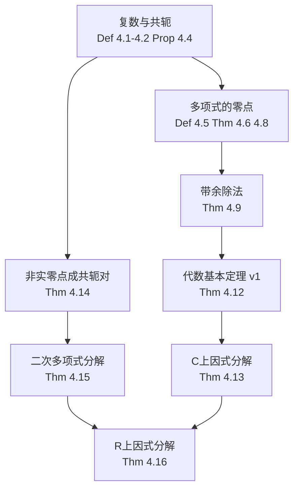

# 第4章 多项式

> [!abstract] 本节概览
> 本章是连接第3章（线性映射）与第5章（特征值与不变子空间）的桥梁章节，系统讨论多项式的代数性质，为后续特征多项式、极小多项式等概念提供基础。
>
> **逻辑链条**：复数与共轭 → 多项式零点与因式定理 → 带余除法 → 代数基本定理 → C上因式分解 → 共轭对 → R上因式分解
>
> **前置依赖**：[[1A Rⁿ 和 Cⁿ]]（复数基础）、[[2C 维数]]（P^n(F)的维数）、[[2B 基]]（基与线性无关）、[[3A 线性映射所成的向量空间]]（线性映射）、[[3E 向量空间的积和商]]（商空间）
>
> **核心主线**：从复数的基本代数性质出发，逐步建立多项式零点理论，最终证明复系数多项式可唯一分解为一次因式之积（代数封闭），实系数多项式可唯一分解为一次与不可约二次因式之积。

---

## 一、复数与共轭

> [!def] 定义 4.1：实部与虚部
> 设 $z = a + bi$（$a, b \in \mathbb{R}$），则
> - $z$ 的**实部** $\text{Re}\,z = a$
> - $z$ 的**虚部** $\text{Im}\,z = b$

> [!def] 定义 4.2：复共轭与绝对值
> 设 $z = a + bi$（$a, b \in \mathbb{R}$），则
> - $z$ 的**复共轭** $\bar{z} = \text{Re}\,z - (\text{Im}\,z)i$
> - $z$ 的**绝对值** $|z| = \sqrt{(\text{Re}\,z)^2 + (\text{Im}\,z)^2}$

> [!example] 例 4.3
> 设 $z = 3 + 2i$，则：
> - $\text{Re}\,z = 3$，$\text{Im}\,z = 2$
> - $\bar{z} = 3 - 2i$
> - $|z| = \sqrt{3^2 + 2^2} = \sqrt{13}$

> [!thm] 性质 4.4：复共轭与绝对值的性质
> 设 $w, z \in \mathbb{C}$，则：
> 1. $z + \bar{z} = 2\,\text{Re}\,z$
> 2. $z - \bar{z} = 2(\text{Im}\,z)i$
> 3. $z\bar{z} = |z|^2$
> 4. $\overline{w+z} = \bar{w} + \bar{z}$ 且 $\overline{wz} = \bar{w}\bar{z}$
> 5. $\bar{\bar{z}} = z$
> 6. $|\text{Re}\,z| \leq |z|$ 且 $|\text{Im}\,z| \leq |z|$
> 7. $|\bar{z}| = |z|$
> 8. $|wz| = |w||z|$
> 9. $|w+z| \leq |w| + |z|$（三角不等式）

> [!abstract] 证明思路：三角不等式
> - **展开 $|w+z|^2$**：$|w+z|^2 = (w+z)(\bar{w}+\bar{z}) = |w|^2 + |z|^2 + w\bar{z} + \bar{w}z$
> - **提取实部**：$w\bar{z} + \bar{w}z = 2\,\text{Re}(w\bar{z})$
> - **利用实部有界**：$2\,\text{Re}(w\bar{z}) \leq 2|w\bar{z}| = 2|w||z|$
> - **配方完成**：$|w+z|^2 \leq |w|^2 + |z|^2 + 2|w||z| = (|w|+|z|)^2$ → 开方即得 ==$|w+z| \leq |w|+|z|$==
> - $\blacksquare$

其中 ==$z\bar{z} = |z|^2$== 是连接复数代数运算与几何长度的核心恒等式，贯穿后续所有证明。

---

## 二、多项式的零点

> [!def] 定义 4.5：多项式的零点/根
> 设 $p \in \mathcal{P}(F)$。如果 $\lambda \in F$ 满足 $p(\lambda) = 0$，则称 $\lambda$ 是 $p$ 的一个**零点**（或**根**）。

> [!thm] 定理 4.6：零点对应一次因式
> 设 $p \in \mathcal{P}(F)$，$\lambda \in F$，$m = \deg p \geq 1$。则
> $$p(\lambda) = 0 \iff \exists\, q \in \mathcal{P}(F),\ \deg q = m-1,\ p(z) = (z-\lambda)q(z)$$

> [!abstract] 证明思路
> - **($\Rightarrow$) 因式分解**：$p(z) = p(z) - p(\lambda) = a_1(z-\lambda) + \cdots + a_m(z^m - \lambda^m)$
> - **关键恒等式**：$z^k - \lambda^k = (z-\lambda)\sum_{j=1}^{k} \lambda^{j-1}z^{k-j}$（对 $k$ 用求和公式）
> - **提取公因子**：每项都含 $(z-\lambda)$，得 $p(z) = (z-\lambda)q(z)$，其中 $\deg q = m-1$
> - **($\Leftarrow$) 代入**：$p(\lambda) = (\lambda-\lambda)q(\lambda) = 0$
> - $\blacksquare$

> [!thm] 定理 4.8：次数为 $m$ 表明最多有 $m$ 个零点
> 设 $p \in \mathcal{P}(F)$，$m = \deg p \geq 1$。则 $p$ 在 $F$ 中最多有 $m$ 个不同的零点。

> [!abstract] 证明思路
> - **归纳基础**：$m=1$ 时 $p(z) = a_0 + a_1 z$，唯一零点为 $-a_0/a_1$
> - **归纳步骤**：若 $p$ 有零点 $\lambda$，由定理 4.6 得 $p(z) = (z-\lambda)q(z)$，其中 $\deg q = m-1$。由归纳假设，$q$ 至多有 $m-1$ 个不同零点，加上 $\lambda$，$p$ 至多有 $m$ 个不同零点。
> - $\blacksquare$

> [!important] 推论：系数唯一性
> 若两组不同系数的多项式对所有 $z \in F$ 取值相同，则其差多项式非零却有无穷多零点，与定理 4.8 矛盾。因此多项式的系数由其在 $F$ 上的取值唯一确定。

参见 [[2C 维数]] 中关于 $\mathcal{P}^n(F)$ 的维数讨论。

---

## 三、带余除法

> [!thm] 定理 4.9：多项式的带余除法
> 设 $p, s \in \mathcal{P}(F)$，$s \neq 0$。则存在唯一的 $q, r \in \mathcal{P}(F)$ 使得
> $$p = sq + r \quad \text{且} \quad \deg r < \deg s$$

> [!abstract] 证明思路
> - **平凡情形**：若 $n = \deg p < m = \deg s$，取 $q = 0$，$r = p$
> - **构造基**：考虑 $\mathcal{P}^n(F)$ 中的向量组 $\{1, z, \ldots, z^{m-1}, s, zs, \ldots, z^{n-m}s}$（式 4.10）
> - **线性无关**：组中每个多项式次数不同 → 线性无关
> - **恰好是基**：长度 $n+1 = \dim \mathcal{P}^n(F)$ → 由 [[2B 基]] 中的定理 2.38，该组是 $\mathcal{P}^n(F)$ 的基
> - **唯一表示**：$p$ 在此基下的唯一线性组合 → 分离出 $r$（低次部分）和 $q$（$s$ 的倍数部分）
> - **唯一性**：源于基表示的唯一性
> - $\blacksquare$

==利用 $\mathcal{P}^n(F)$ 的基== 这一线性代数证法是 Axler 本书的特色——不需要任何计算，只需"不同次数的多项式线性无关"这一基本事实。参见 [[2B 基]] 和 [[2C 维数]]。

---

## 四、复系数多项式的因式分解

> [!thm] 定理 4.12：代数基本定理，版本一
> 每个不是常值的复系数多项式都在 $\mathbb{C}$ 中有零点。

> [!abstract] 证明思路
> - **棣莫弗定理**：$(\cos\theta + i\sin\theta)^k = \cos k\theta + i\sin k\theta$ → 每个复数有 $k$ 次方根
> - **连续函数取最小值**：$|p(z)| \to \infty$（$|z|\to\infty$）→ $\exists\,\zeta$ 使 $|p(z)|$ 在 $\zeta$ 取全局最小值
> - **反证法**：假设 $p(\zeta) \neq 0$
> - **构造 $q(z)$**：$q(z) = p(z+\zeta)/p(\zeta)$，$q(0) = 1$ 是全局最小值
> - **展开 $q$**：$q(z) = 1 + a_k z^k + \cdots + a_m z^m$（$a_k \neq 0$）
> - **选取 $\beta$**：$\beta^k = -1/a_k$ → 取 $t = 1/(2c)$ 使 $|q(t\beta)| < 1$
> - **矛盾**：与 $|q|$ 的全局最小值为 $1$ 矛盾
> - $\blacksquare$

> [!thm] 定理 4.13：代数基本定理，版本二
> 设 $p \in \mathcal{P}(\mathbb{C})$ 是非常数多项式，$\deg p = m$。则 $p$ 可以唯一地（不计因式顺序）表示为
> $$p(z) = c(z-\lambda_1)\cdots(z-\lambda_m)$$
> 其中 $c, \lambda_1, \ldots, \lambda_m \in \mathbb{C}$。

> [!abstract] 证明思路
> - **归纳基础**：$m=1$ 时分解存在且唯一
> - **存在性**：由定理 4.12，$p$ 有零点 $\lambda$ → 由定理 4.6，$p(z) = (z-\lambda)q(z)$ → 归纳假设 $q$ 可分解
> - **唯一性**：$c$ 是 $z^m$ 的系数（唯一）→ 比较零点集 → 归约到 $m-1$ 次
> - $\blacksquare$

复数域是 ==代数封闭域==——不需要引入更大的数域来求多项式的零点。定理 4.13 给出的 ==唯一分解== 是后续特征多项式理论的基石。

---

## 五、实系数多项式的因式分解

> [!thm] 定理 4.14：实系数多项式的非实数零点成对出现
> 设 $p \in \mathcal{P}(\mathbb{C})$ 是实系数多项式，$\lambda \in \mathbb{C}$ 是 $p$ 的零点。则 $\bar{\lambda}$ 也是 $p$ 的零点。

> [!abstract] 证明思路
> - **取共轭**：$p(\lambda) = 0$ → 对等式两边取共轭
> - **利用共轭性质**：$\bar{a}_j = a_j$（实系数）→ $\sum a_j \bar{\lambda}^j = 0$ → $p(\bar{\lambda}) = 0$
> - $\blacksquare$

> [!thm] 定理 4.15：二次多项式的分解
> 设 $b, c \in \mathbb{R}$。则
> $$x^2 + bx + c = (x-\lambda_1)(x-\lambda_2) \iff b^2 \geq 4c$$

> [!abstract] 证明思路
> - **配方法**：$x^2 + bx + c = (x + b/2)^2 + c - b^2/4$
> - **$b^2 < 4c$**：右侧恒正 → 无实零点 → 不可分解
> - **$b^2 \geq 4c$**：令 $d^2 = b^2/4 - c$ → $(x + b/2 + d)(x + b/2 - d)$
> - $\blacksquare$

> [!thm] 定理 4.16：多项式在 $\mathbb{R}$ 上的分解
> 设 $p \in \mathcal{P}(\mathbb{R})$ 是非常数多项式。则 $p$ 可以唯一地（不计因式顺序）表示为
> $$p(x) = c(x-\lambda_1)\cdots(x-\lambda_m)(x^2+b_1x+c_1)\cdots(x^2+b_Mx+c_M)$$
> 其中 $c, \lambda_1, \ldots, \lambda_m, b_1, c_1, \ldots, b_M, c_M \in \mathbb{R}$，且每个二次因式满足 $b_k^2 < 4c_k$（即无实零点）。

> [!abstract] 证明思路
> - **在 $\mathbb{C}$ 上分解**：由定理 4.13 得到 $\mathbb{C}$ 上的分解
> - **共轭对合并**：$(x-\lambda)(x-\bar{\lambda}) = x^2 - 2(\text{Re}\,\lambda)x + |\lambda|^2$
> - **证明 $q$ 的系数为实数**：$q(x) = p(x)/((x-\lambda)(x-\bar{\lambda}))$，对所有 $x \in \mathbb{R}$ 有 $q(x) \in \mathbb{R}$ → $\text{Im}\,a_j = 0$（由定理 4.8）
> - **归纳法**完成存在性
> - **唯一性**：若 $\mathbb{R}$ 上有两个不同分解 → $\mathbb{C}$ 上也有两个 → 与定理 4.13 矛盾
> - $\blacksquare$

==实数域不代数封闭==——实系数多项式可能包含 ==不可约二次因式==（判别式 $b^2 - 4c < 0$），这正是实数域与复数域的本质区别。

---

## 六、知识结构总览



---

## 七、核心思想与证明技巧

> [!success] 核心思想
> 1. **代数基本定理是多项式理论的基石**——复数域是代数封闭域，每个非常数复系数多项式都可完全分解为一次因式的乘积
> 2. **因式分解的形式取决于系数域**——$\mathbb{C}$ 只需一次因式，$\mathbb{R}$ 需一次加不可约二次因式
> 3. **共轭是连接 $\mathbb{R}$ 和 $\mathbb{C}$ 的桥梁**——实系数多项式的非实零点成对出现
> 4. **带余除法的线性代数证法**——巧妙利用 $\mathcal{P}^n(F)$ 的基，体现了线性代数的统一力量

> [!tip] 证明技巧清单
> 1. $z^k - \lambda^k$ 的因式分解公式（定理 4.6 的关键步骤）：$z^k - \lambda^k = (z-\lambda)\sum_{j=1}^{k}\lambda^{j-1}z^{k-j}$
> 2. 构造特殊基证明带余除法（定理 4.9——利用不同次数的多项式线性无关）
> 3. 反证法 + 连续函数取最小值（定理 4.12——FTA 的经典证法）
> 4. 归纳法 + 因式定理的组合（定理 4.13——从存在一个零点到完全分解）
> 5. 共轭对合并为二次因式（定理 4.16——从 $\mathbb{C}$ 上的分解推导 $\mathbb{R}$ 上的分解）

---

## 八、补充理解与易混淆点

### 八.1 代数基本定理为什么需要分析学？

FTA 的所有证明都需要分析学（连续性/拓扑/完备性），纯代数无法证明。反例：有理数域 $\mathbb{Q}$ 不满足 FTA（$x^2-2=0$ 在 $\mathbb{Q}$ 中无解）；实数域 $\mathbb{R}$ 也不满足（$x^2+1=0$ 在 $\mathbb{R}$ 中无解）。

剑桥大学 Timothy Gowers 的解释：代数只能告诉我们"引入根不会导致矛盾"，但无法证明根的存在；证明存在性需要分析学（如连续函数的介值定理）。Irish Mathematical Society 的 Anthony O'Farrell 指出：$\mathbb{C}$ 的完备性是 FTA 的本质要素。

**来源**：Timothy Gowers (Cambridge) "How to think of a proof of the FTA"、Anthony O'Farrell (Irish Math. Soc. Bulletin, 2025) "The Fundamental Theorem of Algebra"、科普中国"代数基本定理的证明方法研究"

### 八.2 带余除法的线性代数证法之美

传统证法：多项式长除法（归纳法，逐步消去最高次项）。Axler 的证法：构造 $\mathcal{P}^n(F)$ 的特殊基 $\{1, z, \ldots, z^{m-1}, s, zs, \ldots, z^{n-m}s\}$。

为什么更深刻：不需要任何计算，只需"不同次数的多项式线性无关"这一基本事实。UCLA 数学圈讲义指出：这个证法虽然是"非构造性"的（不给出 $q$ 和 $r$ 的具体算法），但更清晰地揭示了除法的本质——不过是基下的坐标分解。

**来源**：UCLA Math Circle "The Fundamental Theorem of Algebra" 讲义、MIT 6.S897 "Algebra and Computation" Lecture 6

### 八.3 代数封闭域的层次结构

$\mathbb{Q} \subset \mathbb{R} \subset \mathbb{C}$ 的代数封闭性递进：$\mathbb{Q}$ 不封闭（$x^2-2$），$\mathbb{R}$ 不封闭（$x^2+1$），$\mathbb{C}$ 封闭（FTA）。$\mathbb{C}$ 是"包含 $\mathbb{R}$ 的最小代数封闭域"。代数数（algebraic numbers）= $\mathbb{Q}$ 上多项式的所有根的集合，构成一个代数封闭域。超越数（transcendental numbers）如 $\pi$ 和 $e$ 不满足任何整系数多项式。

**来源**：Newcastle University "Complex Roots of Polynomials"、Vaia "Undergraduate Algebra" Ch.9、博客园"复数为什么这么神奇"

### 常见误区

> [!danger] 误区1："代数基本定理给出了求根方法"
> ❌ FTA 告诉我们如何求多项式的零点
> ✅ FTA 仅是==存在性定理==，不提供构造性方法。二次多项式有求根公式，三次四次有复杂公式，但==五次及以上不存在一般求根公式==（Abel-Ruffini 定理）。实际应用中依赖数值方法。

> [!danger] 误区2："实系数多项式一定有实数零点"
> ❌ 每个实多项式都能在 $\mathbb{R}$ 上分解为一次因式
> ✅ $x^2+1$ 没有实零点。实系数多项式可能只有==不可约二次因式==（判别式 $b^2-4c < 0$）。这正是实数域不代数封闭的体现。

> [!danger] 误区3："多项式的次数等于零点的个数"
> ❌ 次数为 $m$ 的多项式恰好有 $m$ 个零点
> ✅ 不同零点的个数 $\leq$ 次数。只有==计重数==时，零点总数才等于次数。例如 $(z-1)^2(z-2)$ 有 2 个不同零点（1 和 2），但次数为 3。

> [!danger] 误区4："共轭只是一种符号运算"
> ❌ $\bar{z}$ 只是形式上的记号，没有实际意义
> ✅ 共轭有深刻的==几何意义==——关于实轴的反射。它保持所有域运算（$\bar{w}+\bar{z}=\overline{w+z}$，$\bar{w}\cdot\bar{z}=\overline{wz}$），且 $z\bar{z}=|z|^2$ 将代数运算与几何长度联系起来。

> [!danger] 误区5："带余除法就是多项式长除法"
> ❌ 带余除法只有长除法这一种理解和证法
> ✅ Axler 的证法利用==$\mathcal{P}^n(F)$ 的基==，将除法问题转化为坐标分解问题。这种方法更深刻地揭示了除法的本质，体现了线性代数的统一力量，虽然不直接给出计算步骤。

---

## 九、习题精选

> [!todo] 推荐习题
> | 编号 | 标题 | 核心考点 | 难度 |
> |---|---|---|---|
> | 1 | 共轭与绝对值的基本性质验证 | 4.4 全部性质 | 低 |
> | 2 | 反向三角不等式 | 三角不等式应用 | 低 |
> | 3 | 复线性泛函的实部刻画 | 共轭+线性泛函 | 中 |
> | 4 | 多点插值多项式的存在唯一性 | Lagrange插值 | 中 |
> | 5 | 不同零点与导数的关系 | 零点重数 | 高 |
> | 6 | 商空间 P(F)/U 的维数 | 商空间+多项式 | 高 |
> | 7 | 互素多项式的 Bezout 恒等式 | 线性映射+多项式 | 高 |

### 习题1：共轭与绝对值的基本性质验证

> [!problem] 习题1
> 设 $w, z \in \mathbb{C}$。验证下列等式和不等式：(a) $z+\bar{z} = 2\,\text{Re}\,z$ (b) $z-\bar{z} = 2(\text{Im}\,z)i$ (c) $z\bar{z} = |z|^2$ (d) $\bar{w}+\bar{z} = \overline{w+z}$ 且 $\bar{w}\bar{z} = \overline{wz}$ (e) $\bar{\bar{z}} = z$ (f) $|\text{Re}\,z| \leq |z|$ 且 $|\text{Im}\,z| \leq |z|$ (g) $|\bar{z}| = |z|$ (h) $|wz| = |w||z|$

> [!faq]- 查看解答
> (a) $z+\bar{z} = (a+bi)+(a-bi) = 2a = 2\,\text{Re}\,z$ ✓
>
> (b) $z-\bar{z} = (a+bi)-(a-bi) = 2bi = 2(\text{Im}\,z)i$ ✓
>
> (c) $z\bar{z} = (a+bi)(a-bi) = a^2+b^2 = |z|^2$ ✓
>
> (d) 直接展开即可验证 ✓
>
> (e) $\bar{\bar{z}} = \overline{a-bi} = a+bi = z$ ✓
>
> (f) $|\text{Re}\,z| = |a| \leq \sqrt{a^2+b^2} = |z|$，同理 $|\text{Im}\,z| \leq |z|$ ✓
>
> (g) $|\bar{z}| = \sqrt{a^2+(-b)^2} = \sqrt{a^2+b^2} = |z|$ ✓
>
> (h) $|wz|^2 = wz\cdot\bar{w}\bar{z} = w\bar{w}\cdot z\bar{z} = |w|^2|z|^2 \to |wz| = |w||z|$ ✓

### 习题2：反向三角不等式

> [!problem] 习题2
> 证明：如果 $w, z \in \mathbb{C}$，那么 $\big||w|-|z|\big| \leq |w-z|$。

> [!faq]- 查看解答
> 由三角不等式：$|w| = |(w-z)+z| \leq |w-z|+|z| \to |w|-|z| \leq |w-z|$
>
> 同理：$|z| = |(z-w)+w| \leq |z-w|+|w| = |w-z|+|w| \to |z|-|w| \leq |w-z|$
>
> 因此 $\big||w|-|z|\big| \leq |w-z|$。□

### 习题3：复线性泛函的实部刻画

> [!problem] 习题3
> 设 $V$ 是复向量空间且 $\varphi \in V'$。定义 $\sigma : V \to \mathbb{R}$ 为 $\sigma(v) = \text{Re}\,\varphi(v)$ 对任一 $v \in V$ 成立。证明 $\varphi(v) = \sigma(v) - i\sigma(iv)$ 对所有 $v \in V$ 成立。

> [!faq]- 查看解答
> 对任意 $v \in V$，设 $\varphi(v) = a + bi$，其中 $a, b \in \mathbb{R}$。
>
> 则 $\sigma(v) = \text{Re}\,\varphi(v) = a$。
>
> 又 $\sigma(iv) = \text{Re}\,\varphi(iv) = \text{Re}\,(i(a+bi)) = \text{Re}\,(ai-b) = -b$。
>
> 因此 $\sigma(v) - i\sigma(iv) = a - i(-b) = a + bi = \varphi(v)$。□

### 习题4：多点插值多项式的存在唯一性

> [!problem] 习题7
> 设 $m$ 是一非负整数，$z_1, \ldots, z_{m+1}$ 是 $F$ 中的不同元素，$w_1, \ldots, w_{m+1} \in F$。证明：存在唯一的多项式 $p \in \mathcal{P}_m(F)$ 使得 $p(z_k) = w_k$ 对每个 $k = 1, \ldots, m+1$ 成立。

> [!faq]- 查看解答
> **存在性（线性代数证法）**：定义线性映射 $T : \mathcal{P}_m(F) \to F^{m+1}$ 为 $T(p) = (p(z_1), \ldots, p(z_{m+1}))$。$\dim \mathcal{P}_m(F) = m+1 = \dim F^{m+1}$。只需证 $T$ 是单射（或满射）。
>
> 若 $T(p) = 0$，则 $p$ 在 $m+1$ 个不同点取值为 $0$。由定理 4.8，$\deg p \leq m$ 的多项式若有超过 $m$ 个零点，则 $p = 0$。故 $T$ 是单射，也是满射。存在性得证。
>
> **唯一性**：若 $p, q$ 都满足条件，则 $p-q$ 在 $m+1$ 个点为零且 $\deg(p-q) \leq m$，故 $p-q = 0$。□

### 习题5：不同零点与导数的关系

> [!problem] 习题8
> 设 $p \in \mathcal{P}(\mathbb{C})$ 的次数为 $m$。证明：$p$ 有 $m$ 个不同零点，当且仅当 $p$ 和其导数 $p'$ 没有共同的零点。

> [!faq]- 查看解答
> ($\Rightarrow$) 若 $p$ 有 $m$ 个不同零点 $\lambda_1, \ldots, \lambda_m$，则 $p(z) = c(z-\lambda_1)\cdots(z-\lambda_m)$。对 $p$ 求导：
> $$p'(z) = c\sum_{j=1}^{m}\prod_{k \neq j}(z-\lambda_k)$$
> 对每个 $j$，$p'(\lambda_j) = c\prod_{k \neq j}(\lambda_j-\lambda_k) \neq 0$（因为各零点不同）。故 $p$ 和 $p'$ 无共同零点。
>
> ($\Leftarrow$) 反证：若 $p$ 的不同零点个数 $< m$，则存在某个 $\lambda$ 使得 $(z-\lambda)^2$ 整除 $p$。于是 $p(\lambda) = 0$ 且 $p'(\lambda) = 0$，矛盾。□

### 习题6：商空间 P(F)/U 的维数

> [!problem] 习题13
> 设 $p \in \mathcal{P}(F)$（$p \neq 0$），令 $U = \{pq : q \in \mathcal{P}(F)\}$。(a) 证明 $\dim \mathcal{P}(F)/U = \deg p$。(b) 求 $\mathcal{P}(F)/U$ 的一个基。

> [!faq]- 查看解答
> (a) 由带余除法（定理 4.9），每个 $f \in \mathcal{P}(F)$ 可唯一写成 $f = pq + r$，$\deg r < \deg p$。因此每个陪集 $f+U = r+U$，其中 $r \in \mathcal{P}_{\deg p - 1}(F)$。映射 $\varphi : \mathcal{P}(F)/U \to \mathcal{P}_{\deg p - 1}(F)$，$\varphi(f+U) = r$ 是同构。故 $\dim \mathcal{P}(F)/U = \dim \mathcal{P}_{\deg p - 1}(F) = \deg p$。
>
> (b) $\mathcal{P}(F)/U$ 的一个基是 $\{1+U, z+U, z^2+U, \ldots, z^{\deg p - 1}+U\}$。□

### 习题7：互素多项式的 Bezout 恒等式

> [!problem] 习题14
> 设 $p, q \in \mathcal{P}(\mathbb{C})$ 是不为常值的多项式，且没有共同的零点。令 $m = \deg p$，$n = \deg q$。使用线性代数证明：存在 $r \in \mathcal{P}_{n-1}(\mathbb{C})$ 和 $s \in \mathcal{P}_{m-1}(\mathbb{C})$ 使得 $rp + sq = 1$。

> [!faq]- 查看解答
> (a) 定义 $T : \mathcal{P}_{n-1}(\mathbb{C}) \times \mathcal{P}_{m-1}(\mathbb{C}) \to \mathcal{P}_{m+n-1}(\mathbb{C})$ 为 $T(r,s) = rp + sq$。$\dim(\text{定义域}) = n + m = \dim(\text{值域})$。若 $T(r,s) = 0$，则 $rp = -sq$。若 $r \neq 0$，则 $p$ 的每个零点都是 $r$ 的零点（因为 $q$ 没有与 $p$ 共同的零点），但 $\deg r < n = \deg q$，矛盾。故 $r = 0$，同理 $s = 0$。$T$ 是单射。
>
> (b) 定义域和值域维数相同，单射即满射。故 $T$ 是满射。
>
> (c) 常数多项式 $1 \in \mathcal{P}_{m+n-1}(\mathbb{C})$，由满射性，存在 $(r,s)$ 使得 $T(r,s) = 1$，即 $rp + sq = 1$。□

---

## 十、视频学习指南

> [!info] 推荐视频资源
> | 视频系列 | 讲者 | 主题 | 链接 |
> |---|---|---|---|
> | Essence of Linear Algebra | 3Blue1Brown | 多项式与线性变换的几何直觉 | [YouTube](https://www.youtube.com/playlist?list=PLZHQObOWTQDPD3MizzM2xVFitgF8hE_ab) |
> | Complex Analysis | Dr. Peyam | 代数基本定理的证明 | [YouTube](https://www.youtube.com/c/DrPeyam) |
> | Abstract Algebra | Michael Penn | 多项式环与因式分解 | [YouTube](https://www.youtube.com/c/MichaelPennMath) |
> | Linear Algebra Done Right | Sheldon Axler | 第4章配套讲解 | [YouTube](https://www.youtube.com/user/sheldonaxler) |

> [!info] 视频精要
> - **3Blue1Brown** 的视频帮助建立多项式与线性变换之间的几何直觉，适合初学者建立直观理解
> - **Dr. Peyam** 对代数基本定理的证明讲解深入浅出，补充了本书未详细展开的分析学证明
> - **Michael Penn** 的抽象代数系列从更高视角审视多项式环的结构，适合学有余力时拓展
> - **Axler 本人**的视频讲解最贴近教材思路，推荐作为第一优先级观看

---

## 十一、教材原文

```
```

#学习/线性代数/多项式
