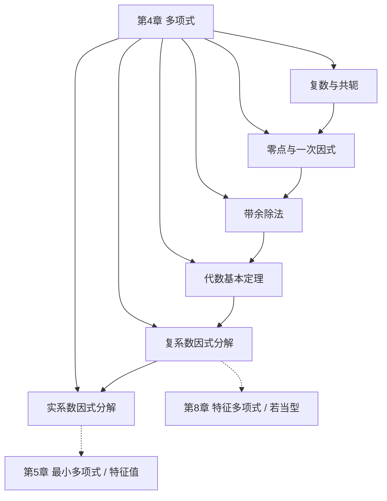

# 第 4 章 多项式 — 章节汇总

> [!abstract] 全章概览
> 第 4 章是从线性映射通向算子理论的过渡章。它把复数、零点、带余除法和代数基本定理组织成一条完整链路，为第 5 章的特征值、最小多项式和第 8 章的特征多项式提供统一代数背景。
>
> **逻辑链条**：复数与共轭 → 零点与一次因式 → 带余除法 → 代数基本定理 → 复系数因式分解 → 实系数因式分解
>
> **核心主线**：多项式的代数结构决定了算子可分解到什么程度，而这正是后续最小多项式、特征多项式和若当型理论的起点。

> [!tip] 导航
> 返回 [[线性代数/index|线性代数知识库总览]]，查看全书路径请见 [[LADR 全书学习路线规划]]。

---

## 一、全章知识框架

---

## 二、核心知识点

### 4.1 本章正文（[[第4章 多项式]]）

| 定理/定义 | 内容 |
|---|---|
| 复数与共轭 | 实部、虚部、共轭、模及其基本性质 |
| 零点与因式定理 | $p(\lambda)=0$ 当且仅当 $(z-\lambda)$ 整除 $p$ |
| 带余除法 | 任意多项式可写成 $p=sq+r$ 且 $\deg r < \deg s$ |
| 代数基本定理 | 每个非常数复多项式在 $\mathbb{C}$ 中至少有一个零点 |
| 复系数因式分解 | 可唯一分解为一次因式之积 |
| 实系数因式分解 | 可唯一分解为一次因式与不可约二次因式之积 |

### 4.2 与前后章节的联系

| 关联主题 | 关联笔记 | 作用 |
|---|---|---|
| 复数基础 | [[1A Rⁿ 和 Cⁿ]] | 为共轭、模和复零点提供语言 |
| 维数与多项式空间 | [[2C 维数]] | 解释 $\mathcal{P}_n(\mathbb{F})$ 的维数背景 |
| 线性映射 | [[3A 线性映射所成的向量空间]] | 为后续把多项式作用到算子上做准备 |
| 最小多项式 | [[5B 最小多项式]] | 直接建立在本章零点和因式分解之上 |
| 特征多项式 | [[8B 广义特征空间分解]]、[[9C 行列式]] | 本章提供可分解和零点理论支撑 |

---

## 三、学习建议

- 先掌握“零点”和“一次因式”的等价，这会贯穿后续全部特征值理论。
- 带余除法不只是计算工具，更是“最小多项式唯一性”证明的模板。
- 读完本章后，优先衔接 [[5B 最小多项式]] 和 [[凯莱-哈密尔顿定理]]，最容易形成整体感。
