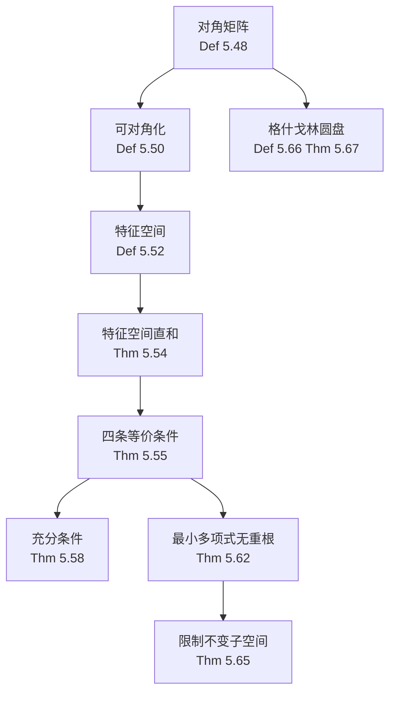

# 5D 可对角化算子

> [!abstract] 本节概览
> 本节是第5章的核心高潮，引入==对角矩阵==与==可对角化==的概念，建立可对角化的多重等价刻画——特征向量基、特征空间直和分解、维数等式、最小多项式无重根。最后介绍==格什戈林圆盘定理==，给出特征值的定位工具。
>
> **逻辑链条**：对角矩阵 → 可对角化定义 → 特征空间 E(λ,T) → 特征空间直和 → 4条等价条件 → 充分条件(5.58) → 最小多项式无重根(5.62) → 限制不变子空间(5.65) → 格什戈林圆盘(5.67)
>
> **前置依赖**：[[5A 不变子空间、特征值和特征向量]]（算子、特征值、特征向量、不变子空间）、[[5B 最小多项式]]（最小多项式、q(T)=0、5.29/5.31）、[[5C 上三角矩阵]]（上三角矩阵、5.40/5.41/5.44）、[[第4章 多项式]]（因式分解、带余除法）
>
> **核心主线**：可对角化是算子"最理想"的矩阵表示——对角矩阵使算子的幂、多项式、逆的计算都变得极其简单。判定可对角化的核心工具是最小多项式：无重根 ⟺ 可对角化。

---

## 一、对角矩阵与可对角化

### 对角矩阵

> [!def] 定义 5.48：对角矩阵（diagonal matrix）
> 称一个方阵为**对角矩阵**，若其中所有在对角线之外的元素都等于 $0$。
>
> 对角矩阵的一般形式为：
> $$\begin{pmatrix} \lambda_1 & 0 & \cdots & 0 \\ 0 & \lambda_2 & \cdots & 0 \\ \vdots & \vdots & \ddots & \vdots \\ 0 & 0 & \cdots & \lambda_n \end{pmatrix}$$
> 记作 $\text{diag}(\lambda_1, \lambda_2, \ldots, \lambda_n)$。

> [!example] 例 5.49：对角矩阵实例
> $\begin{pmatrix} 8 & 0 & 0 \\ 0 & 5 & 0 \\ 0 & 0 & 5 \end{pmatrix}$ 是一个 $3 \times 3$ 对角矩阵，记作 $\text{diag}(8, 5, 5)$。
>
> 注意对角线上的元素可以重复——$5$ 出现了两次。

> [!note] 对角矩阵的运算优势
> 对角矩阵是上三角矩阵的特例（对角线以上也全为零），具有极其简单的运算性质：
> - 乘法：$\text{diag}(\lambda_1,\ldots,\lambda_n) \cdot \text{diag}(\mu_1,\ldots,\mu_n) = \text{diag}(\lambda_1\mu_1, \ldots, \lambda_n\mu_n)$
> - 幂运算：$\text{diag}(\lambda_1,\ldots,\lambda_n)^m = \text{diag}(\lambda_1^m, \ldots, \lambda_n^m)$
> - 行列式：$\det = \lambda_1 \cdot \lambda_2 \cdots \lambda_n$
> - 迹：$\text{tr} = \lambda_1 + \lambda_2 + \cdots + \lambda_n$

### 可对角化的定义

> [!def] 定义 5.50：可对角化（diagonalizable）
> 设 $T \in \mathcal{L}(V)$。称 $T$ 是**可对角化的**，若存在 $V$ 的基使得 $T$ 关于该基的矩阵是对角矩阵。

> [!example] 例 5.51：对角化需要选取合适的基
> 考虑 $\mathbb{R}^2$ 上的算子 $T(x, y) = (41x + 7y,\; -20x + 74y)$。
>
> **关于标准基** $(1,0), (0,1)$ 的矩阵为：
> $$M(T) = \begin{pmatrix} 41 & 7 \\ -20 & 74 \end{pmatrix}$$
> 这不是对角矩阵。
>
> **但 $T$ 是可对角化的**。取基 $(1, 4), (7, 5)$：
> - $T(1, 4) = (41 \cdot 1 + 7 \cdot 4,\; -20 \cdot 1 + 74 \cdot 4) = (69, 276) = 69(1, 4)$
> - $T(7, 5) = (41 \cdot 7 + 7 \cdot 5,\; -20 \cdot 7 + 74 \cdot 5) = (322, 230) = 46(7, 5)$
>
> 因此关于基 $(1, 4), (7, 5)$，$T$ 的矩阵为：
> $$M(T) = \begin{pmatrix} 69 & 0 \\ 0 & 46 \end{pmatrix} = \text{diag}(69, 46)$$
>
> 特征值为 $69$ 和 $46$，对应的特征向量分别为 $(1, 4)$ 和 $(7, 5)$。

> [!warning] 注意
> - ==一个算子是否可对角化与基的选取有关==——关于某个基的矩阵不是对角矩阵，不代表算子不可对角化。
> - 不要把"矩阵可对角化"和"矩阵本身是对角矩阵"混淆。

### 特征空间

> [!def] 定义 5.52：特征空间（eigenspace）
> 设 $T \in \mathcal{L}(V)$ 且 $\lambda \in \mathbb{F}$。$T$ 对应于 $\lambda$ 的==特征空间==定义为：
> $$E(\lambda, T) = \text{null}(T - \lambda I) = \{v \in V : Tv = \lambda v\}$$

> [!note] 特征空间的关键性质
> - $E(\lambda, T)$ 是 $V$ 的子空间（零空间的子空间）
> - $\lambda$ 是 $T$ 的特征值 $\iff$ $E(\lambda, T) \neq \{0\}$（即 $\dim E(\lambda, T) \geq 1$）
> - $E(\lambda, T)$ 中的每个非零向量都是对应于 $\lambda$ 的特征向量
> - $\dim E(\lambda, T)$ 称为 $\lambda$ 的**几何重数**

> [!example] 例 5.53：特征空间实例
> 设 $T \in \mathcal{L}(\mathbb{C}^3)$ 的矩阵为 $\text{diag}(8, 5, 5)$，即 $T(z_1, z_2, z_3) = (8z_1, 5z_2, 5z_3)$。
>
> - 特征值 $8$：$E(8, T) = \{(z_1, 0, 0) : z_1 \in \mathbb{C}\} = \text{span}((1,0,0))$，$\dim E(8, T) = 1$
> - 特征值 $5$：$E(5, T) = \{(0, z_2, z_3) : z_2, z_3 \in \mathbb{C}\} = \text{span}((0,1,0), (0,0,1))$，$\dim E(5, T) = 2$
>
> 注意 $\dim E(8, T) + \dim E(5, T) = 1 + 2 = 3 = \dim \mathbb{C}^3$，这正是 $T$ 可对角化的原因（定理 5.55）。

### 特征空间之和是直和

> [!thm] 定理 5.54：特征空间之和是直和
> 设 $T \in \mathcal{L}(V)$。设 $\lambda_1, \ldots, \lambda_m$ 是 $T$ 的互不相同的特征值。则
> $$E(\lambda_1, T) + \cdots + E(\lambda_m, T) \text{ 是直和}$$
> 且 $\dim E(\lambda_1, T) + \cdots + \dim E(\lambda_m, T) \leq \dim V$。

> [!abstract] 证明思路
> **直和部分**：要证零向量表示唯一。设 $v_1 + \cdots + v_m = 0$，其中 $v_k \in E(\lambda_k, T)$。由[[5A 不变子空间、特征值和特征向量|定理 5.11]]（不同特征值对应的特征向量线性无关），各 $v_k = 0$。由[[2A 张成空间和线性无关性|命题 1.45]]，和为直和。
>
> **维数部分**：直和的维数等于各分量维数之和（[[3B 零空间和值域|定理 3.94]]），而直和是 $V$ 的子空间，故维数不超过 $\dim V$（[[2C 维数|推论 2.37]]）。$\blacksquare$

> [!tip] 关键洞察
> ==这个证明的核心是"不同特征空间指向不同方向"——它们的交集只有零向量。== 这与[[5A 不变子空间、特征值和特征向量|定理 5.11]]的证明思路一脉相承，都是利用"不同特征值的差不为零"来消去分量。

### 可对角化的四条等价条件

> [!thm] 定理 5.55：可对角化的等价条件
> 设 $T \in \mathcal{L}(V)$，并设 $\lambda_1, \ldots, \lambda_m$ 是 $T$ 的所有互不相同的特征值。则以下四条等价：
>
> - **(a)** $T$ 是可对角化的。
> - **(b)** $V$ 存在由 $T$ 的特征向量构成的基。
> - **(c)** $V = E(\lambda_1, T) \oplus \cdots \oplus E(\lambda_m, T)$。
> - **(d)** $\dim V = \dim E(\lambda_1, T) + \cdots + \dim E(\lambda_m, T)$。

> [!abstract] 证明思路
> 按 $(a) \iff (b) \Rightarrow (c) \Rightarrow (d) \Rightarrow (b)$ 的路线循环证明。
>
> **(a) $\Leftrightarrow$ (b)**：对角矩阵的第 $k$ 列只有第 $k$ 个位置非零 $\Leftrightarrow$ $Tv_k = \lambda_k v_k$ $\Leftrightarrow$ 基向量都是特征向量。
>
> **(b) $\Rightarrow$ (c)**：将特征向量基按对应特征值分组。每个向量是各特征空间中向量的组合，由 5.54 分解是直和。
>
> **(c) $\Rightarrow$ (d)**：直和的维数等于各分量维数之和（[[3B 零空间和值域|3.94]]）。
>
> **(d) $\Rightarrow$ (b)**：由 5.54，特征空间之和是直和，维数为 $\sum \dim E(\lambda_k, T) = \dim V$。合并各 $E(\lambda_k, T)$ 的基得到 $\dim V$ 个线性无关向量，构成基（[[2B 基|2.38]]），每个基向量都是特征向量。$\blacksquare$

> [!important] 四条等价条件的直觉含义
>
> | 条件 | 直觉含义 |
> |------|----------|
> | (a) 可对角化 | 矩阵视角：存在基使矩阵为对角矩阵 |
> | (b) 特征向量构成基 | 几何视角：空间被特征向量"铺满" |
> | (c) 特征空间直和分解 | 结构视角：空间被特征空间完全分解 |
> | (d) 维数等式 | 数值视角：各特征空间维数之和恰好等于全空间维数 |
>
> ==条件 (d) 在实际计算中最常用：算出每个特征空间的维数，看它们的和是否等于 $\dim V$。==

---

## 二、可对角化的判定

### 不可对角化的反例

> [!example] 例 5.57：不可对角化的算子
> 定义 $T \in \mathcal{L}(\mathbb{C}^3)$ 为 $T(a, b, c) = (b, c, 0)$。
>
> **求特征值**：设 $T(z_1, z_2, z_3) = \lambda(z_1, z_2, z_3)$，即 $(z_2, z_3, 0) = (\lambda z_1, \lambda z_2, \lambda z_3)$。
>
> 由第三个分量：$\lambda z_3 = 0$。
> - 若 $\lambda \neq 0$，则 $z_3 = 0$；由第二个分量 $z_3 = \lambda z_2$ 得 $z_2 = 0$；由第一个分量 $z_2 = \lambda z_1$ 得 $z_1 = 0$。所以 $(z_1, z_2, z_3) = (0, 0, 0)$，不是特征向量。
> - 若 $\lambda = 0$，则 $(z_2, z_3, 0) = (0, 0, 0)$，即 $z_2 = z_3 = 0$，$z_1$ 任意。
>
> 因此 $T$ 的唯一特征值是 $0$，且
> $$E(0, T) = \{(a, 0, 0) : a \in \mathbb{C}\} = \text{span}((1, 0, 0))$$
> $$\dim E(0, T) = 1 < 3 = \dim V$$
>
> 由定理 5.55 (d)，$T$ ==不可对角化==。

> [!warning] 关键教训
> - ==有特征值不等于可对角化==。例 5.57 中 $T$ 有特征值 $0$，但不可对角化。
> - 关键不是"有几个特征值"，而是"特征空间维数之和是否等于 $\dim V$"。

### 互异特征值足够多则可对角化

> [!thm] 定理 5.58：互异特征值足够多 $\Rightarrow$ 可对角化
> 设 $T \in \mathcal{L}(V)$。若 $T$ 有 $\dim V$ 个互不相同的特征值，则 $T$ 是可对角化的。

> [!abstract] 证明思路
> 设 $\lambda_1, \ldots, \lambda_n$ 是 $T$ 的 $n = \dim V$ 个互不相同的特征值。对每个 $\lambda_k$ 取一个对应的特征向量 $v_k \neq 0$。由[[5A 不变子空间、特征值和特征向量|定理 5.11]]，不同特征值对应的特征向量线性无关，故 $v_1, \ldots, v_n$ 线性无关。$n$ 个线性无关的向量构成 $\dim V = n$ 的空间的一组基。由定理 5.55 (b) $\Rightarrow$ (a)，$T$ 可对角化。$\blacksquare$

> [!note] 充分条件 vs 必要条件
> 定理 5.58 是==充分条件==（但非必要条件）。比如恒等算子 $I$ 只有一个特征值 $1$，但它是可对角化的（$E(1, I) = V$）。
>
> ==定理 5.58 的价值在于：当你发现一个算子有足够多的互异特征值时，可以立刻断言它可对角化，而无需计算特征空间的维数。==

### 利用对角化计算 $T^{100}$

> [!example] 例 5.59：对角化的强大应用——计算 $T^{100}$
> 设 $T \in \mathcal{L}(\mathbb{R}^3)$ 定义为 $T(x, y, z) = (2x + y,\; 5y + 3z,\; 8z)$。
>
> **第一步：求特征值和特征向量。**
>
> $M(T) = \begin{pmatrix} 2 & 1 & 0 \\ 0 & 5 & 3 \\ 0 & 0 & 8 \end{pmatrix}$，已经是上三角矩阵。由[[5C 上三角矩阵|定理 5.41]]，特征值为对角线元素 $2, 5, 8$。
>
> - $\lambda = 2$：$(T - 2I)(x,y,z) = (y, 3z, 6z) = (0,0,0)$，即 $y = z = 0$，特征向量 $(1, 0, 0)$。
> - $\lambda = 5$：$(T - 5I)(x,y,z) = (-3x+y, 3z, 3z) = (0,0,0)$，即 $y = 3x, z = 0$，特征向量 $(1, 3, 0)$。
> - $\lambda = 8$：$(T - 8I)(x,y,z) = (-6x+y, -3y+3z, 0) = (0,0,0)$，即 $y = 6x, z = 2y = 12x$，特征向量 $(1, 6, 6)$。
>
> **第二步：写出对角化。**
>
> 关于基 $(1,0,0), (1,3,0), (1,6,6)$，$M(T) = \text{diag}(2, 5, 8)$。
>
> **第三步：计算 $T^{100}(0, 0, 1)$。**
>
> 将 $(0, 0, 1)$ 用特征向量基表示。设 $(0, 0, 1) = a(1,0,0) + b(1,3,0) + c(1,6,6)$，解得 $a = 1/6, b = -1/3, c = 1/6$。
>
> $$T^{100}(0,0,1) = \frac{1}{6} \cdot 2^{100}(1,0,0) - \frac{1}{3} \cdot 5^{100}(1,3,0) + \frac{1}{6} \cdot 8^{100}(1,6,6)$$
>
> 化简得：
> $$T^{100}(0,0,1) = \left(\frac{1}{6}(2^{100} - 2 \cdot 5^{100} + 8^{100}),\; 6 \cdot 8^{100} - 6 \cdot 5^{100},\; 6 \cdot 8^{100}\right)$$

> [!tip] 对角化的威力
> ==直接计算 $T^{100}$ 需要做 $100$ 次矩阵乘法，而对角化后只需计算 $\lambda^{100}$——从 $O(n^4 \cdot 100)$ 的计算量降为 $O(n)$ 的标量幂运算。==

### 可对角化但无法求出确切特征值

> [!example] 例 5.60：可对角化但无法求出确切特征值
> 考虑 $\mathbb{C}^5$ 上的算子 $T$，其最小多项式有 $5$ 个互不相同的零点。由定理 5.62（稍后证明），$T$ 可对角化。
>
> 但如果最小多项式是 $5$ 次一般多项式，==即使知道可对角化，也可能无法用根式表达特征值的精确值==（由 Abel-Ruffini 定理，$5$ 次以上多项式一般没有根式解）。
>
> 这说明：==可对角化是一个结构性结论，与能否"算出"特征值是两回事。==

### 不可对角化的判定——最小多项式视角

> [!example] 例 5.61：利用最小多项式判定不可对角化
> 设 $T \in \mathcal{L}(\mathbb{C}^3)$，$T(x,y,z) = (6x + 3y + 4z,\; 6y + 2z,\; 7z)$。
>
> $M(T) = \begin{pmatrix} 6 & 3 & 4 \\ 0 & 6 & 2 \\ 0 & 0 & 7 \end{pmatrix}$，上三角矩阵，特征值为 $6, 6, 7$。
>
> 验证 $(T - 6I)^2(T - 7I) = 0$（直接计算可验证），但 $(T - 6I)(T - 7I) \neq 0$。
>
> 因此[[5B 最小多项式|最小多项式]]为 $q(z) = (z - 6)^2(z - 7)$，含有 $(z - 6)$ 的平方因子——==有重根==。
>
> 由定理 5.62（稍后证明），$T$ ==不可对角化==。

### 可对角化的充要条件——最小多项式无重根

> [!thm] 定理 5.62：可对角化 $\iff$ 最小多项式无重根
> 设 $T \in \mathcal{L}(V)$。则 $T$ 可对角化当且仅当 $T$ 的最小多项式为 $(z - \lambda_1)(z - \lambda_2) \cdots (z - \lambda_m)$，其中 $\lambda_1, \ldots, \lambda_m$ 互不相同。

> [!abstract] 证明思路
> **($\Rightarrow$)方向：可对角化 $\Rightarrow$ 最小多项式无重根。**
>
> 设 $T$ 可对角化，$\lambda_1, \ldots, \lambda_m$ 是 $T$ 的互不相同的特征值。由定理 5.55 (c)：
> $$V = E(\lambda_1, T) \oplus \cdots \oplus E(\lambda_m, T)$$
>
> 定义 $q(z) = (z - \lambda_1)(z - \lambda_2) \cdots (z - \lambda_m)$。任取 $v \in V$，由直和分解写成 $v = v_1 + \cdots + v_m$，其中 $v_k \in E(\lambda_k, T)$。则 $q(T)v_k = q(\lambda_k)v_k = 0$（因为 $q(\lambda_k)$ 中含因子 $(\lambda_k - \lambda_k) = 0$）。故 $q(T)v = 0$，即 $q(T) = 0$。
>
> 由[[5B 最小多项式|5.29]]，最小多项式 $p$ 整除 $q$。由于 $q$ 无重根，$p$ 也无重根，故 $p = (z - \lambda_1) \cdots (z - \lambda_m)$。
>
> ---
>
> **($\Leftarrow$)方向：最小多项式无重根 $\Rightarrow$ 可对角化。**
>
> 对最小多项式的根的个数 $m$ 做数学归纳法。
>
> **$m = 1$**：$p(z) = z - \lambda_1$，即 $T = \lambda_1 I$，显然可对角化。
>
> **$m > 1$**：设 $p(z) = (z - \lambda_1) \cdots (z - \lambda_m)$，$\lambda_j$ 互不相同。令 $\lambda = \lambda_m$。
>
> **断言 1**：$U = \text{range}(T - \lambda I)$ 在 $T$ 下不变（由[[5A 不变子空间、特征值和特征向量|5.18]]）。
>
> **断言 2**：$T|_U$ 的最小多项式整除 $(z - \lambda_1) \cdots (z - \lambda_{m-1})$，无重根。由归纳假设，$T|_U$ 可对角化。
>
> **断言 3**：$\text{range}(T - \lambda I) \cap \text{null}(T - \lambda I) = \{0\}$。
>
> 证明：设 $v \in \text{range}(T - \lambda I) \cap \text{null}(T - \lambda I)$，则 $(T - \lambda I)v = 0$ 且存在 $w$ 使 $v = (T - \lambda I)w$。令 $q(z) = (z - \lambda_1) \cdots (z - \lambda_{m-1})$。则 $q(T)v = q(T)(T - \lambda I)w = p(T)w = 0$。但 $q(\lambda) = (\lambda - \lambda_1) \cdots (\lambda - \lambda_{m-1}) \neq 0$（因为 $\lambda = \lambda_m$ 与其他 $\lambda_k$ 互异），故 $q(T)|_{E(\lambda, T)}$ 是乘以 $q(\lambda) \neq 0$，可逆。因此 $v = 0$。
>
> 由[[3B 零空间和值域|3.94]]和[[3B 零空间和值域|3.21]]（秩-零度定理），$\dim \text{range} + \dim \text{null} = \dim V$。由于交集为零，$\text{range} \oplus \text{null} = V$。
>
> **完成归纳**：$T|_U$ 可对角化（断言 2），$\text{null}(T - \lambda I) = E(\lambda, T)$。合并 $U$ 和 $E(\lambda, T)$ 的特征向量基，得到 $V$ 的特征向量基。由 5.55 (b) $\Rightarrow$ (a)，$T$ 可对角化。$\blacksquare$

> [!important] 核心结论
> ==最小多项式无重根 ⟺ 可对角化==。这是判定可对角化的终极工具——不需要求出特征值，只需检查最小多项式是否有重根。
>
> **深层原因**：断言 3 的证明中，关键一步是 $q(\lambda) \neq 0$。当最小多项式无重根时，$q(\lambda_k) \neq 0$ 对所有 $k$ 成立，保证了 $q(T)|_{E(\lambda_k, T)}$ 可逆。但如果最小多项式有重根 $(z - \lambda)^2$，则 $q(z)$ 中仍含 $(z - \lambda)$，导致 $q(\lambda) = 0$，论证失效。

---

## 三、可对角化算子的性质

### 限制于不变子空间仍可对角化

> [!thm] 定理 5.65：可对角化算子限制于不变子空间仍可对角化
> 设 $T \in \mathcal{L}(V)$ 可对角化，$U$ 是 $V$ 的在 $T$ 下不变的子空间。则 $T|_U$ 也可对角化。

> [!abstract] 证明思路
> $T$ 可对角化 $\Rightarrow$ 由定理 5.62，$T$ 的最小多项式 $p$ 无重根，即 $p = (z - \lambda_1) \cdots (z - \lambda_m)$。
>
> $T|_U$ 的最小多项式 $p_U$ 整除 $p$（由[[5B 最小多项式|5.31]]，因为 $p(T) = 0$ 蕴含 $p(T|_U) = 0$）。
>
> $p$ 无重根 $\Rightarrow$ $p_U$ 也无重根（$p_U$ 的根都是 $p$ 的根，且重数不超过 $p$ 中的重数）。
>
> 由定理 5.62，$T|_U$ 可对角化。$\blacksquare$

> [!tip] 证明的简洁性
> ==这个证明极其简洁，充分体现了最小多项式判别法的威力——它把一个几何问题（不变子空间上的可对角化）转化为了一个纯代数问题（多项式整除关系）。==

---

## 四、格什戈林圆盘定理

### 格什戈林圆盘的定义

> [!def] 定义 5.66：格什戈林圆盘（Gershgorin disk）
> 设 $A$ 是 $n \times n$ 矩阵。对 $j = 1, \ldots, n$，第 $j$ 个==格什戈林圆盘==定义为复平面上的闭圆盘：
> $$D_j = \left\{z \in \mathbb{C} : |z - A_{j,j}| \leq \sum_{k \neq j} |A_{j,k}|\right\}$$
>
> 即以对角线元素 $A_{j,j}$ 为圆心，以第 $j$ 行非对角线元素的绝对值之和为半径的圆盘。

> [!note] 直觉理解
> 格什戈林圆盘的半径 $\sum_{k \neq j}|A_{j,k}|$ 度量了第 $j$ 行中"非对角线元素的总影响力"。如果非对角线元素都很小（接近对角矩阵），则圆盘很小，特征值被紧紧约束在对角线元素附近。

### 格什戈林圆盘定理

> [!thm] 定理 5.67：格什戈林圆盘定理（Gershgorin Disk Theorem）
> 设 $A$ 是 $n \times n$ 矩阵（元素在 $\mathbb{C}$ 中）。则 $A$ 的每个特征值都至少属于一个格什戈林圆盘 $D_j$。

> [!abstract] 证明思路
> 设 $\lambda$ 是 $A$ 的特征值，$w = (c_1, \ldots, c_n)^T$ 是对应的特征向量（$w \neq 0$），即 $Aw = \lambda w$。
>
> 将 $w$ 用基表示 $w = \sum_{j} c_j v_j$。取使 $|c_j|$ 最大的那个 $j$（即 $|c_j| = \max_k |c_k|$，且 $c_j \neq 0$）。
>
> 比较特征方程 $Aw = \lambda w$ 在 $v_j$ 方向上的系数：
> $$A_{j,j} c_j + \sum_{k \neq j} A_{j,k} c_k = \lambda c_j$$
>
> 改写为 $(A_{j,j} - \lambda)c_j = -\sum_{k \neq j} A_{j,k} c_k$。两边取绝对值：
> $$|A_{j,j} - \lambda| \cdot |c_j| = \left|\sum_{k \neq j} A_{j,k} c_k\right| \leq \sum_{k \neq j} |A_{j,k}| \cdot |c_k|$$
>
> 由于 $|c_k| \leq |c_j|$（$j$ 是最大分量的下标），故：
> $$\sum_{k \neq j} |A_{j,k}| \cdot |c_k| \leq \sum_{k \neq j} |A_{j,k}| \cdot |c_j| = |c_j| \cdot \sum_{k \neq j} |A_{j,k}|$$
>
> 约去 $|c_j| > 0$：
> $$|A_{j,j} - \lambda| \leq \sum_{k \neq j} |A_{j,k}|$$
>
> 这正是说 $\lambda \in D_j$。$\blacksquare$

> [!important] 定理的意义
> ==格什戈林圆盘定理==告诉我们，特征值"不会跑太远"——每个特征值都至少被一个以对角线元素为中心的圆盘"捕获"。
>
> **实际应用**：
> - **特征值的粗略定位**：不需要计算特征多项式，只需看矩阵的元素就能给出特征值的范围
> - **严格对角占优矩阵**：如果 $|A_{j,j}| > \sum_{k \neq j}|A_{j,k}|$ 对所有 $j$ 成立，则每个圆盘不包含原点，矩阵可逆
> - **数值稳定性**：如果格什戈林圆盘彼此分离，则每个圆盘恰好包含一个特征值

> [!example] 格什戈林圆盘定理的应用实例
> 考虑矩阵：
> $$A = \begin{pmatrix} 4 & 1 & 0 \\ 1 & 3 & 1 \\ 0 & 1 & 5 \end{pmatrix}$$
>
> 三个格什戈林圆盘为：
> - $D_1$：圆心 $4$，半径 $1$，即 $|z - 4| \leq 1$
> - $D_2$：圆心 $3$，半径 $2$，即 $|z - 3| \leq 2$
> - $D_3$：圆心 $5$，半径 $1$，即 $|z - 5| \leq 1$
>
> $A$ 的所有特征值都落在 $D_1 \cup D_2 \cup D_3$ 中。

---

## 五、知识结构总览



---

## 六、核心思想与证明技巧

> [!success] 核心思想
> 1. ==可对角化 = 存在一组基使 T 只做拉伸不做旋转==——最理想的矩阵表示。对角化把算子"拆解"为各坐标方向上独立的标量乘法。
> 2. 可对角化有 4 种等价刻画（定理 5.55）——可根据具体情况选择最方便的验证方式：(a) 对角矩阵、(b) 特征向量基、(c) 特征空间直和分解、(d) 维数等式。
> 3. ==最小多项式无重根是判定可对角化的终极工具==——不需要求出特征值，只需检查最小多项式是否有重根。重根的存在标志着"广义特征向量"的存在，标志着 Jordan 块的出现。
> 4. ==格什戈林圆盘提供特征值的"粗定位"==——非对角元素小时特征值接近对角线元素。无需精确计算就能定位特征值，体现了"先粗后精"的数学思维。

> [!tip] 证明技巧
> 1. **合并各特征空间的基构造特征向量基**（定理 5.55 中 (d) $\Rightarrow$ (b)）：直和的基可以合并，$\dim V$ 个线性无关向量就是基。
> 2. **利用 $\text{range}(T - \lambda_m I) \cap \text{null}(T - \lambda_m I) = \{0\}$ 的维数论证**（定理 5.62）：关键在于 $q(\lambda) \neq 0$ 保证 $q(T)|_{E(\lambda, T)}$ 可逆。
> 3. **对最小多项式的因式个数做归纳法**（定理 5.62 的 ($\Leftarrow$) 方向）：$m$ 个根的情形通过 $\text{range}(T - \lambda_m I)$ 降为 $m - 1$ 个根。
> 4. **利用对角化计算算子的高次幂**（例 5.59）：$T^n$ 在特征向量基下就是对角矩阵的 $n$ 次幂，标量幂运算替代矩阵乘法。
> 5. **取最大坐标分量证明格什戈林定理**（定理 5.67）：取 $|c_j|$ 最大的 $j$，利用 $|c_k|/|c_j| \leq 1$ 放缩后约掉 $|c_j|$。

---

## 七、补充理解与易混淆点

### 可对角化的几何意义

> [!note]
> 可对角化意味着存在一组基，使 $T$ 在每个基向量方向上只做拉伸（乘以标量），不做旋转或剪切。
>
> 不可对角化意味着存在"剪切"效应——如 Jordan 块 $\begin{pmatrix} \lambda & 1 & 0 \\ 0 & \lambda & 1 \\ 0 & 0 & \lambda \end{pmatrix}$ 中，$T$ 在第二个基向量方向上不仅有拉伸还有"推移"。
>
> 可对角化是"最理想"的矩阵表示，但并非所有算子都能达到。在 $\mathbb{C}$ 上，每个算子都能上三角化（[[5C 上三角矩阵|5.47]]），但只有满足最小多项式无重根的算子才能对角化（5.62）。
>
> **来源**：Georgia Tech "Interactive Linear Algebra" Diagonalization 章节、Boston University "Diagonalization — Linear Algebra, Geometry, and Computation"、Ohio State "Eigenvalues and Eigenvectors" 讲义

### 为什么最小多项式无重根等价于可对角化

> [!note]
> 最小多项式的重根对应 Jordan 块的大小——重根次数 = 最大 Jordan 块的尺寸。
>
> 无重根意味着所有 Jordan 块都是 $1 \times 1$ 的，即对角矩阵。
>
> 有重根意味着存在 $\geq 2 \times 2$ 的 Jordan 块，此时不可对角化。
>
> 定理 5.62 的证明不依赖 Jordan 标准形（第8章才引入），而是直接利用 range 和 null 的直和分解，这是 Axler 教材的独特处理方式。
>
> **来源**：Keith Conrad (UConn) "The Minimal Polynomial and Some Applications"、CSDN "可对角化等价于极小多项式为互不相同一次式的乘积"、Vaia "Undergraduate Algebra" Ch.5

### 格什戈林圆盘定理的应用

> [!note]
> - **严格对角占优矩阵**（$|A_{j,j}| > \sum_{k \neq j}|A_{j,k}|$）的格什戈林圆盘不包含原点 $\Rightarrow$ 矩阵可逆（$0$ 不是特征值）
> - 非对角元素很小时，特征值接近对角线元素——这是数值方法中迭代法的理论基础
> - 孤立圆盘恰好包含一个特征值（连通分支定理）
>
> **来源**：UCLA ECE133B "Geršgorin bounds" (Vandenberghe)、Ohio State Ximera "Gershgorin's Theorem"、Nebraska-Lincoln M447 Homework Solutions

### 常见误区

> [!danger] 误区1："有 $n$ 个特征值就可对角化"
> ❌ 特征值个数等于 $\dim V$ 就可对角化
> ✅ 需要 $n$ 个==互不相同==的特征值（定理 5.58），或特征空间维数之和等于 $\dim V$（定理 5.55(d)）。例如恒等算子 $I_3$ 只有一个特征值 $1$，但 $\dim E(1, I_3) = 3 = \dim V$，所以可对角化。

> [!danger] 误区2："上三角矩阵都可对角化"
> ❌ 上三角矩阵一定可对角化
> ✅ 上三角不保证可对角化。反例：$T(a,b,c) = (b,c,0)$ 的矩阵 $\begin{pmatrix} 0 & 1 & 0 \\ 0 & 0 & 1 \\ 0 & 0 & 0 \end{pmatrix}$ 是上三角但不可对角化（最小多项式 $z^3$ 有重根 $0$）。

> [!danger] 误区3："可对角化只与特征值有关"
> ❌ 只要知道特征值就能判断可对角化
> ✅ 还需要检查==特征空间的维数==（几何重数）或最小多项式是否有重根。例如 $T(x,y,z) = (6x+3y+4z, 6y+2z, 7z)$ 有特征值 $6$ 和 $7$，但最小多项式 $(z-6)^2(z-7)$ 有重根 $\Rightarrow$ 不可对角化。

> [!danger] 误区4："$T^2$ 可对角化 $\Rightarrow$ $T$ 可对角化"
> ❌ 算子幂可对角化则原算子也可对角化
> ✅ 反例：$T(x,y) = (y, 0)$ 在 $\mathbb{C}^2$ 上，$T^2 = 0$ 可对角化（零算子），但 $T$ 的最小多项式 $z^2$ 有重根 $\Rightarrow$ $T$ 不可对角化。不过若 $T$ 可逆且 $\mathbb{F} = \mathbb{C}$，则 $T$ 可对角化 $\Leftrightarrow$ $T^k$ 可对角化（习题14(b)）。

> [!danger] 误区5："格什戈林圆盘给出精确的特征值"
> ❌ 圆盘定理精确给出特征值的位置
> ✅ 圆盘定理只给出特征值的==包含区域==，不精确。但当非对角元素相对于对角元素很小时，圆盘很小，特征值被精确定位。这是==严格对角占优矩阵==可逆的理论基础。

> [!danger] 误区6："实算子不可能可对角化"
> ❌ 实数域上算子不能可对角化
> ✅ 若最小多项式在 $\mathbb{R}$ 上可分解为不同一次因式之积，实算子也可对角化。例如 $T(x,y) = (2x, 5y)$ 在 $\mathbb{R}^2$ 上可对角化（最小多项式 $(z-2)(z-5)$ 在 $\mathbb{R}$ 上可分解）。关键是最小多项式能否在 $\mathbb{F}$ 上分解，而非 $\mathbb{F}$ 的选择。

---

## 八、习题精选

> [!todo] 推荐习题
>
> | 编号 | 标题 | 核心考点 | 难度 |
> |---|---|---|---|
> | 1 | $T^4=I$ 和 $T^4=T$ 的可对角化 | 最小多项式无重根 | 低 |
> | 2 | $\text{null}(T-\lambda I) \oplus \text{range}(T-\lambda I)$ | 等价刻画 | 中 |
> | 3 | 相同特征值的三维算子相似 | 可对角化+相似 | 中 |
> | 4 | $T^2$ 可对角化但 $T$ 不可对角化 | 算子幂 | 中 |
> | 5 | 最小多项式与导数的公因式 | 无需零点信息 | 高 |
> | 6 | 不变子空间的刻画 | 特征空间 | 高 |
> | 7 | 斐波那契数列的对角化 | 经典应用 | 高 |

### 习题1：$T^4=I$ 和 $T^4=T$ 的可对角化

> [!problem] 习题1
> (a) 如果 $T^4 = I$，那么 $T$ 可对角化。(b) 如果 $T^4 = T$，那么 $T$ 可对角化。(c) 给出一例：$T \in \mathcal{L}(\mathbb{C}^2)$ 使得 $T^4 = T^2$ 且 $T$ 不可对角化。

> [!faq]- 查看解答
> **(a)** $T^4 - I = 0$，即 $(T^2 - I)(T^2 + I) = 0$，即 $(T - I)(T + I)(T^2 + I) = 0$。
>
> 在 $\mathbb{C}$ 上，$T^2 + I = (T - iI)(T + iI)$，故 $T^4 - I = (T - I)(T + I)(T - iI)(T + iI) = 0$。
>
> 最小多项式整除 $(z-1)(z+1)(z-i)(z+i)$，无重根 $\Rightarrow$ 可对角化（5.62）。
>
> **(b)** $T^4 - T = 0$，即 $T(T^3 - I) = 0$，即 $T(T - I)(T^2 + T + I) = 0$。
>
> 在 $\mathbb{C}$ 上，$T^2 + T + I$ 的零点为 $\frac{-1 \pm \sqrt{3}i}{2}$（即 $\omega_3$ 和 $\omega_3^2$，三次单位根），故 $T^2 + T + I = (T - \omega_3 I)(T - \omega_3^2 I)$。
>
> 最小多项式整除 $z(z-1)(z - \omega_3)(z - \omega_3^2)$，在 $\mathbb{C}$ 上无重根 $\Rightarrow$ 可对角化。
>
> **(c)** $T(x, y) = (y, 0)$。$T^2 = 0$，$T^4 = 0 = T^2$。$T$ 的最小多项式是 $z^2$（有重根）$\Rightarrow$ $T$ 不可对角化。

### 习题5：$\text{null}(T-\lambda I) \oplus \text{range}(T-\lambda I)$

> [!problem] 习题5
> $V$ 是有限维复向量空间，$T \in \mathcal{L}(V)$。证明：$T$ 可对角化 $\Leftrightarrow$ $V = \text{null}(T - \lambda I) \oplus \text{range}(T - \lambda I)$ 对任一 $\lambda \in \mathbb{C}$ 成立。

> [!faq]- 查看解答
> **($\Rightarrow$)** $T$ 可对角化 $\Rightarrow$ 最小多项式 $= (z - \lambda_1) \cdots (z - \lambda_m)$（5.62）。
>
> 对任意 $\lambda \in \mathbb{C}$：
> - 若 $\lambda$ 不是特征值，$\text{null}(T - \lambda I) = \{0\}$，$T - \lambda I$ 可逆，$\text{range}(T - \lambda I) = V$，直和成立。
> - 若 $\lambda = \lambda_j$ 是特征值，则由 5.62 的证明（断言 3），$\text{range}(T - \lambda_j I) \oplus \text{null}(T - \lambda_j I) = V$。
>
> **($\Leftarrow$)** 取 $\lambda$ 为 $T$ 的任意特征值。由条件，$\text{range}(T - \lambda I) \cap \text{null}(T - \lambda I) = \{0\}$。由[[3B 零空间和值域|3.94]]和[[3B 零空间和值域|3.21]]，$\dim \text{range} + \dim \text{null} = \dim V$。
>
> 对每个特征值 $\lambda_j$，$\dim E(\lambda_j, T) = \dim \text{null}(T - \lambda_j I)$。由 5.55 (d)，$T$ 可对角化。

### 习题9：相同特征值的三维算子相似

> [!problem] 习题9
> $R, T \in \mathcal{L}(\mathbb{F}^3)$ 都有特征值 $2$、$6$ 和 $7$。证明：存在可逆算子 $S \in \mathcal{L}(\mathbb{F}^3)$ 使得 $R = S^{-1}TS$。

> [!faq]- 查看解答
> $R$ 和 $T$ 各有 $3$ 个互不相同的特征值 $\Rightarrow$ 由 5.58，$R$ 和 $T$ 都可对角化。
>
> 设 $R$ 关于基 $u_1, u_2, u_3$ 的矩阵为 $\text{diag}(2, 6, 7)$，$T$ 关于基 $v_1, v_2, v_3$ 的矩阵为 $\text{diag}(2, 6, 7)$。
>
> 定义 $S \in \mathcal{L}(\mathbb{F}^3)$ 为 $S(u_j) = v_j$。则 $S$ 可逆（将一组基映为另一组基）。
>
> 验证：$S^{-1}TS(u_j) = S^{-1}T(v_j) = S^{-1}(\lambda_j v_j) = \lambda_j S^{-1}(v_j) = \lambda_j u_j = R(u_j)$。
>
> 故 $R = S^{-1}TS$。$\blacksquare$

### 习题14：$T^2$ 可对角化但 $T$ 不可对角化

> [!problem] 习题14
> (a) 给出一例：有限维复向量空间和算子 $T$，使得 $T^2$ 可对角化但 $T$ 不可对角化。(b) 设 $\mathbb{F} = \mathbb{C}$，$k$ 是正整数，$T \in \mathcal{L}(V)$ 可逆。证明：$T$ 可对角化 $\Leftrightarrow$ $T^k$ 可对角化。

> [!faq]- 查看解答
> **(a)** $T \in \mathcal{L}(\mathbb{C}^2)$，$T(x, y) = (y, 0)$。$T^2 = 0$ 可对角化（零算子），但 $T$ 的最小多项式 $z^2$ 有重根 $\Rightarrow$ $T$ 不可对角化。
>
> **(b)**
>
> **($\Rightarrow$)** $T$ 可对角化 $\Rightarrow$ 存在特征向量基使 $M(T) = \text{diag}(\lambda_1, \ldots, \lambda_n)$。则 $M(T^k) = \text{diag}(\lambda_1^k, \ldots, \lambda_n^k)$，仍为对角矩阵 $\Rightarrow$ $T^k$ 可对角化。
>
> **($\Leftarrow$)** 设 $T^k$ 可对角化。$T$ 可逆 $\Rightarrow$ $0$ 不是 $T$ 的特征值 $\Rightarrow$ $T$ 的最小多项式 $p(z)$ 的常数项 $\neq 0$，$p(z)$ 的每个零点 $\lambda \neq 0$。
>
> $T^k$ 可对角化 $\Rightarrow$ $T^k$ 的最小多项式 $q(z)$ 无重根（5.62）。
>
> $p(T) = 0 \Rightarrow p(T^k) = 0$（因为 $p(T^k) = p(T^k)$，且 $T^k$ 的多项式也是 $T$ 的多项式）。实际上更直接：$p(z)$ 整除某个 $r(z)$ 使得 $r(T^k) = 0$。但更简洁的证法是：
>
> $T^k$ 的最小多项式 $q$ 无重根。$p(T) = 0 \Rightarrow$ 存在多项式 $h$ 使得 $p(z) | h(z^k)$（因为 $T$ 的特征值 $\lambda_j \neq 0$，$z^k - \lambda_j^k = (z - \lambda_j)(z - \omega_k \lambda_j) \cdots (z - \omega_k^{k-1} \lambda_j)$，其中 $\omega_k$ 是 $k$ 次单位根）。
>
> 更直接的证法：$p(z)$ 整除 $q(z^k)$（因为 $q(T^k) = 0$ 意味着 $q(z^k)$ 是 $T$ 的零化多项式）。$q$ 无重根 $\Rightarrow$ $q(z^k)$ 的每个不可约因式形如 $(z - \lambda_j)$（因为 $\lambda_j \neq 0$，$z^k - \mu_j$ 的根互不相同），故 $p$ 无重根 $\Rightarrow$ $T$ 可对角化（5.62）。

### 习题15：最小多项式与导数的公因式

> [!problem] 习题15
> $V$ 是有限维复向量空间，$T \in \mathcal{L}(V)$，$p$ 是 $T$ 的最小多项式。证明下列等价：(a) $T$ 可对角化。(b) 不存在 $\lambda \in \mathbb{C}$ 使得 $p$ 是 $(z - \lambda)^2$ 的多项式倍。(c) $p$ 和 $p'$ 没有公共零点。(d) $p$ 和 $p'$ 的最大公因式是常多项式 $1$。

> [!faq]- 查看解答
> **(a) $\Leftrightarrow$ (b)**：由 5.62，$T$ 可对角化 $\Leftrightarrow$ 最小多项式 $= (z - \lambda_1) \cdots (z - \lambda_m)$ 无重根 $\Leftrightarrow$ 不存在 $\lambda$ 使 $(z - \lambda)^2 | p$。
>
> **(b) $\Leftrightarrow$ (c)**：$(z - \lambda)^2 | p$ $\Leftrightarrow$ $\lambda$ 是 $p$ 的零点且 $p'(\lambda) = 0$。
>
> 证明：若 $p(z) = (z - \lambda)^2 q(z)$，则 $p'(z) = 2(z - \lambda)q(z) + (z - \lambda)^2 q'(z)$，故 $p'(\lambda) = 0$。反之，若 $\lambda$ 是 $p$ 的零点且 $p'(\lambda) = 0$，则 $\lambda$ 至少是 $p$ 的二重零点（否则 $p(z) = (z - \lambda)q(z)$，$q(\lambda) \neq 0$，$p'(\lambda) = q(\lambda) \neq 0$，矛盾），故 $(z - \lambda)^2 | p$。
>
> 因此 $p$ 和 $p'$ 有公共零点 $\Leftrightarrow$ 存在 $\lambda$ 使 $(z - \lambda)^2 | p$。
>
> **(c) $\Leftrightarrow$ (d)**：$p$ 和 $p'$ 的最大公因式非常数 $\Leftrightarrow$ 它们有公共零点（在 $\mathbb{C}$ 上，非常数多项式至少有一个零点）。
>
> 因此 (a) $\Leftrightarrow$ (b) $\Leftrightarrow$ (c) $\Leftrightarrow$ (d)。$\blacksquare$
>
> **注**：(d) 的意义在于：可用欧几里得算法求 $\gcd(p, p')$，==不需要知道 $p$ 的零点==！

### 习题16：不变子空间的刻画

> [!problem] 习题16
> $T \in \mathcal{L}(V)$ 可对角化，$\lambda_1, \ldots, \lambda_m$ 是 $T$ 的所有互异特征值。证明：$V$ 的子空间 $U$ 在 $T$ 下不变 $\Leftrightarrow$ 存在 $U_1, \ldots, U_m$ 使得 $U_k \subseteq E(\lambda_k, T)$ 且 $U = U_1 \oplus \cdots \oplus U_m$。

> [!faq]- 查看解答
> **($\Leftarrow$)** 若 $U_k \subseteq E(\lambda_k, T)$，则 $TU_k \subseteq T(E(\lambda_k, T)) = \lambda_k E(\lambda_k, T) \subseteq E(\lambda_k, T)$。故 $T(U_1 \oplus \cdots \oplus U_m) \subseteq U_1 \oplus \cdots \oplus U_m$。
>
> **($\Rightarrow$)** 设 $U$ 在 $T$ 下不变。因为 $T$ 可对角化，$V = E(\lambda_1, T) \oplus \cdots \oplus E(\lambda_m, T)$。
>
> 对 $u \in U$，唯一写成 $u = u_1 + \cdots + u_m$，$u_k \in E(\lambda_k, T)$。
>
> 定义投影 $P_k : V \to E(\lambda_k, T)$。由 Lagrange 插值，$P_k$ 可以表示为 $T$ 的多项式：$P_k = \prod_{j \neq k} \frac{T - \lambda_j I}{\lambda_k - \lambda_j}$。
>
> 因为 $U$ 在 $T$ 下不变，$U$ 也在 $T$ 的多项式下不变，故 $P_k(U) \subseteq U$。
>
> 令 $U_k = P_k(U) \subseteq U \cap E(\lambda_k, T)$。则 $U = U_1 \oplus \cdots \oplus U_m$（因为 $u = \sum P_k u$，且各 $P_k$ 的像互不相交）。$\blacksquare$

### 习题21：斐波那契数列的对角化

> [!problem] 习题21
> 斐波那契数列定义为 $F_0 = 0, F_1 = 1, F_n = F_{n-2} + F_{n-1}$ ($n \geq 2$)。定义 $T \in \mathcal{L}(\mathbb{R}^2)$ 为 $T(x, y) = (y, x + y)$。
> (a) 证明 $T^n(0, 1) = (F_n, F_{n+1})$。
> (b) 求 $T$ 的特征值。
> (c) 求 $\mathbb{R}^2$ 的一个由 $T$ 的特征向量构成的基。
> (d) 用 (c) 计算 $T^n(0, 1)$，得出 $F_n = \frac{1}{\sqrt{5}}\left(\left(\frac{1+\sqrt{5}}{2}\right)^n - \left(\frac{1-\sqrt{5}}{2}\right)^n\right)$。
> (e) 证明 $F_n$ 是最接近 $\left(\frac{1+\sqrt{5}}{2}\right)^n / \sqrt{5}$ 的整数。

> [!faq]- 查看解答
> **(a) 归纳法。**
>
> $n = 0$：$T^0(0, 1) = (0, 1) = (F_0, F_1)$ ✓
>
> $n = 1$：$T(0, 1) = (1, 0 + 1) = (1, 1) = (F_1, F_2)$ ✓
>
> 归纳步骤：若 $T^n(0, 1) = (F_n, F_{n+1})$，则
> $$T^{n+1}(0, 1) = T(F_n, F_{n+1}) = (F_{n+1}, F_n + F_{n+1}) = (F_{n+1}, F_{n+2})$$ ✓
>
> **(b)** $M(T) = \begin{pmatrix} 0 & 1 \\ 1 & 1 \end{pmatrix}$。特征方程：
> $$\det\begin{pmatrix} -\lambda & 1 \\ 1 & 1 - \lambda \end{pmatrix} = \lambda^2 - \lambda - 1 = 0$$
>
> 解得 $\lambda = \frac{1 \pm \sqrt{5}}{2}$。记 $\varphi = \frac{1 + \sqrt{5}}{2}$（黄金比例），$\psi = \frac{1 - \sqrt{5}}{2}$。
>
> **(c)** $\lambda_1 = \varphi$：$\begin{pmatrix} -\varphi & 1 \\ 1 & 1 - \varphi \end{pmatrix}\begin{pmatrix} x \\ y \end{pmatrix} = 0$，取特征向量 $(1, \varphi)$。
>
> $\lambda_2 = \psi$：$\begin{pmatrix} -\psi & 1 \\ 1 & 1 - \psi \end{pmatrix}\begin{pmatrix} x \\ y \end{pmatrix} = 0$，取特征向量 $(1, \psi)$。
>
> $(1, \varphi)$ 和 $(1, \psi)$ 线性无关（$\varphi \neq \psi$），构成 $\mathbb{R}^2$ 的基。
>
> **(d) 将 $(0, 1)$ 用特征向量基表示。**
>
> 设 $(0, 1) = a(1, \varphi) + b(1, \psi)$，即：
> $$a + b = 0, \quad a\varphi + b\psi = 1$$
>
> 由第一式 $b = -a$，代入第二式：$a(\varphi - \psi) = 1$，故 $a = \frac{1}{\varphi - \psi} = \frac{1}{\sqrt{5}}$，$b = -\frac{1}{\sqrt{5}}$。
>
> 因此：
> $$T^n(0, 1) = \frac{1}{\sqrt{5}} \varphi^n (1, \varphi) - \frac{1}{\sqrt{5}} \psi^n (1, \psi) = \frac{1}{\sqrt{5}}(\varphi^n - \psi^n,\; \varphi^{n+1} - \psi^{n+1})$$
>
> 比较第一个分量：$F_n = \frac{\varphi^n - \psi^n}{\sqrt{5}} = \frac{1}{\sqrt{5}}\left(\left(\frac{1+\sqrt{5}}{2}\right)^n - \left(\frac{1-\sqrt{5}}{2}\right)^n\right)$。
>
> 这就是著名的 **Binet 公式**。
>
> **(e)** $|\psi| = \frac{\sqrt{5} - 1}{2} \approx 0.618 < 1$，故 $|\psi^n / \sqrt{5}| < 1/2$（当 $n \geq 1$ 时）。
>
> $F_n = \varphi^n / \sqrt{5} - \psi^n / \sqrt{5}$，其中 $|\psi^n / \sqrt{5}| < 1/2$。
>
> 因此 $F_n$ 是距离 $\varphi^n / \sqrt{5}$ 最近的整数。$\blacksquare$

---

## 九、视频学习指南

> [!info] 视频资源
>
> | 资源 | 主题 | 链接 |
> |---|---|---|
> | 3Blue1Brown | 特征值与特征向量（直觉理解） | [Essence of Linear Algebra](https://www.3blue1brown.com/lessons/eigenvalues) |
> | Dr. Peyam | Diagonalization | [YouTube](https://www.youtube.com/@DrPeyam) |
> | Michael Penn | Gershgorin Circle Theorem | [YouTube](https://www.youtube.com/@MichaelPennMath) |
> | Zach Star | 线性代数核心概念 | [YouTube](https://www.youtube.com/@ZachStar) |

> [!info] 视频精要
> - 3Blue1Brown 的特征值视频提供了极佳的几何直觉——特征向量是"变换中方向不变的向量"，特征值是"拉伸因子"，适合作为本节的入门
> - Dr. Peyam 的对角化视频更贴近教材风格，适合深入学习证明细节
> - Michael Penn 的格什戈林圆盘定理视频有清晰的证明演示，适合配合定理 5.67 学习
> - 建议先看 3Blue1Brown 建立直觉，再结合教材和本笔记学习严格证明

---

## 十、教材原文

```
```

#学习/线性代数/特征值与特征向量/可对角化
