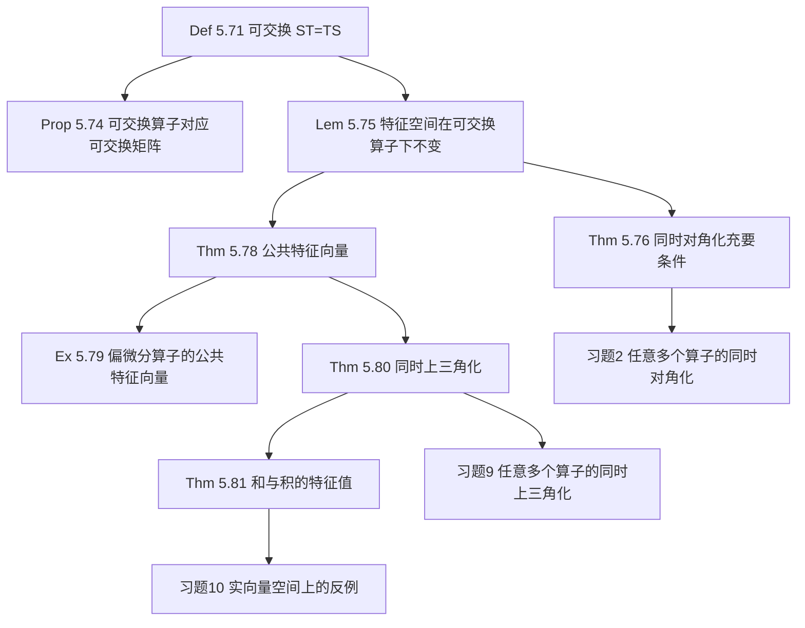

# 5E 可交换算子

> [!abstract] 本节概览
>
> 本节研究同一向量空间上两个算子之间的**可交换性**（$ST = TS$）这一核心关系。可交换性看似简单的代数条件，却蕴含着深刻的结构信息：它保证特征空间的不变性（引理 5.75），进而导出本节最重要的结果——**可对角化算子可同时对角化的充要条件是可交换性**（定理 5.76）。在此基础上，我们进一步得到公共特征向量的存在性（定理 5.78）、同时上三角化（定理 5.80）以及和与积的特征值公式（定理 5.81）。
>
> **逻辑链条**：可交换定义 $\xrightarrow{\text{命题 5.74}}$ 可交换矩阵 $\xrightarrow{\text{引理 5.75}}$ 特征空间不变 $\xrightarrow{\text{定理 5.76}}$ 同时对角化充要条件 $\xrightarrow{\text{定理 5.78}}$ 公共特征向量 $\xrightarrow{\text{定理 5.80}}$ 同时上三角化 $\xrightarrow{\text{定理 5.81}}$ 和与积的特征值
>
> **前置依赖**：[[5A 不变子空间、特征值和特征向量]]（特征空间、不变子空间）、[[5B 最小多项式]]（多项式作用于算子）、[[5C 上三角矩阵]]（上三角化定理 5.47）、[[5D 可对角化算子]]（可对角化条件 5.55、限制算子的可对角化 5.65）、[[第4章 多项式]]、[[3E 向量空间的积和商]]（直和分解）、[[3F 对偶]]（对偶算子）
>
> **核心主线**：$ST = TS$ 是贯穿全节的唯一假设，由此逐步推导出一系列等价刻画和结构性质，最终回答"两个算子何时能共享同一组优良基"这一核心问题。

---

## 一、可交换的定义与基本性质

### 可交换的定义

> [!def] 定义 5.71：可交换（commute）
> 对于同一向量空间 $V$ 上的两个算子 $S$ 和 $T$，若 $ST = TS$，则它们**可交换**。
> 对于两个大小相同的方阵 $A$ 和 $B$，若 $AB = BA$，则它们**可交换**。

可交换性是算子之间最基本的代数关系之一。以下是一些天然满足可交换性的例子：

- **恒等算子**：若 $I$ 是 $V$ 上的恒等算子且 $\lambda \in \mathbb{F}$，那么 $\lambda I$ 与 $V$ 上每个算子都可交换。
- **同一算子的多项式**：若 $T$ 是算子，那么 $T^2$ 和 $T^3$ 可交换。更一般地，若 $p, q \in \mathcal{P}(\mathbb{F})$，那么 $p(T)$ 和 $q(T)$ 可交换（见 [[5B 最小多项式|5.17 (b)]]）。

### 偏微分算子：可交换性的经典实例

> [!example] 例 5.72：偏微分算子可交换
> 设 $m$ 是非负整数。令 $\mathcal{P}^m(\mathbb{C}^2, \mathbb{C})$ 表示具有两个自变量且次数最高为 $m$ 的复系数多项式构成的复向量空间。其元素是从 $\mathbb{C}^2$ 到 $\mathbb{C}$ 的形式如下的函数 $p$：
> $$p(w, z) = \sum_{j+k \leq m} a_{j,k}\, w^j z^k \tag{5.73}$$
> 其中每个 $a_{j,k} \in \mathbb{C}$，$w^j z^k$ 表示定义为 $(w, z) \mapsto w^j z^k$ 的 $\mathbb{C}^2$ 上的函数。
>
> 定义偏微分算子 $D_w, D_z \in \mathcal{L}(\mathcal{P}^m(\mathbb{C}^2, \mathbb{C}))$ 为：
> $$D_w p = \frac{\partial p}{\partial w} = \sum_{j+k \leq m} j\, a_{j,k}\, w^{j-1} z^k, \quad D_z p = \frac{\partial p}{\partial z} = \sum_{j+k \leq m} k\, a_{j,k}\, w^j z^{k-1}$$
>
> $D_w$ 和 $D_z$ 可交换，因为：
> $$(D_w D_z)\, p = \sum_{j+k \leq m} jk\, a_{j,k}\, w^{j-1} z^{k-1} = (D_z D_w)\, p$$

这个例子说明了一个重要的分析学事实：对于性质良好的函数，偏微分运算的顺序是无关紧要的（Clairaut 定理 / Schwarz 定理的离散版本）。

### 可交换矩阵的稀有性

教材给出了一个令人惊讶的统计数据：各元素均为区间 $[-5, 5]$ 内整数的 $2 \times 2$ 矩阵，两两共可凑出 $214{,}358{,}881$ 对（考虑顺序），但如此多对矩阵中仅有约 **0.3%** 是可交换的（$674{,}609$ 对）。

这意味着可交换性是一个**极强的约束条件**——两个随机矩阵几乎不可能可交换。这也从侧面说明了为什么可交换的算子具有如此丰富的结构性质：可交换性本身就排除了绝大多数"一般情况"。

### 可交换算子对应可交换矩阵

> [!thm] 命题 5.74：可交换算子对应可交换矩阵
> 设 $S, T \in \mathcal{L}(V)$ 且 $v_1, \ldots, v_n$ 是 $V$ 的基。那么 $S$ 和 $T$ 可交换，当且仅当 $\mathcal{M}(S, (v_1, \ldots, v_n))$ 和 $\mathcal{M}(T, (v_1, \ldots, v_n))$ 可交换。

> [!abstract] 证明思路
> **[矩阵表示保持乘法运算]**：利用算子乘积的矩阵等于矩阵的乘积这一基本性质。
>
> $S$ 和 $T$ 可交换 $\iff ST = TS$
> $\iff \mathcal{M}(ST) = \mathcal{M}(TS)$
> $\iff \mathcal{M}(S)\,\mathcal{M}(T) = \mathcal{M}(T)\,\mathcal{M}(S)$
> $\iff \mathcal{M}(S)$ 和 $\mathcal{M}(T)$ 可交换。
>
> $\blacksquare$

这个命题建立了算子语言与矩阵语言之间的桥梁：讨论算子的可交换性等价于讨论矩阵的可交换性，前提是两个矩阵关于**同一个基**。

---

## 二、可交换算子的核心定理

本节包含六个紧密相连的结果，构成一条从"特征空间不变"到"和与积的特征值公式"的逻辑链条。

### 特征空间在可交换算子下不变

> [!thm] 引理 5.75：特征空间在可交换算子下不变
> 设 $S, T \in \mathcal{L}(V)$ 可交换且 $\lambda \in \mathbb{F}$。那么 $E(\lambda, S)$ 在 $T$ 下不变。

> [!abstract] 证明思路
> **[直接验证不变性条件]**：要证 $E(\lambda, S)$ 在 $T$ 下不变，只需验证对任意 $v \in E(\lambda, S)$，有 $Tv \in E(\lambda, S)$。
>
> 设 $v \in E(\lambda, S)$，即 $Sv = \lambda v$。那么：
> $$S(Tv) = (ST)v = (TS)v = T(Sv) = T(\lambda v) = \lambda\, Tv$$
>
> 上式即表明 $Tv \in E(\lambda, S)$。因此 $E(\lambda, S)$ 在 $T$ 下不变。
>
> $\blacksquare$

==关键洞察==：这个证明的核心只有一步——利用 $ST = TS$ 将 $S$ 从 $T$ 的"右边"移到"左边"。可交换性使得我们可以自由调整算子的作用顺序，从而将 $T$ 作用后的向量仍然保持在 $S$ 的特征空间内。**这个引理是本节所有后续定理的基础。**

### 可同时对角化的充要条件

> [!thm] 定理 5.76：可同时对角化 $\iff$ 可交换性
> 同一向量空间上的两个可对角化算子关于相同的基都有对角矩阵，当且仅当这两个算子可交换。

这是本节**最重要的定理**，它给出了可交换性与同时对角化之间的完全等价关系。

> [!abstract] 证明思路
> **[充分性（$\Leftarrow$）：可交换 $\Rightarrow$ 同时对角化]**
>
> 设 $S, T \in \mathcal{L}(V)$ 是可对角化算子且可交换。令 $\lambda_1, \ldots, \lambda_m$ 代表 $S$ 的所有互异特征值。
>
> **[利用可对角化的直和分解]**：因为 $S$ 可对角化，由 [[5D 可对角化算子|5.55 (c)]] 有：
> $$V = E(\lambda_1, S) \oplus \cdots \oplus E(\lambda_m, S) \tag{5.77}$$
>
> **[特征空间在 $T$ 下不变]**：每个子空间 $E(\lambda_k, S)$（$k = 1, \ldots, m$）在 $T$ 下不变（由引理 5.75）。
>
> **[限制算子仍可对角化]**：因为 $T$ 是可对角化的，由 [[5D 可对角化算子|5.65]]，对每个 $k$，限制算子 $T|_{E(\lambda_k, S)}$ 均可对角化。
>
> **[在每个特征空间中取 $T$ 的特征向量基]**：所以对每个 $k = 1, \ldots, m$，都存在由 $T$ 的特征向量组成的 $E(\lambda_k, S)$ 的基。
>
> **[合并基]**：将这些基合并起来就得到了 $V$ 的基（由式 (5.77) 的直和性质），且该基中每个向量既是 $S$ 的特征向量（因为它属于某个 $E(\lambda_k, S)$），又是 $T$ 的特征向量。于是 $S$ 和 $T$ 关于这个基均具有对角矩阵。
>
> **[必要性（$\Rightarrow$）：同时对角化 $\Rightarrow$ 可交换]**
>
> 设 $S, T \in \mathcal{L}(V)$ 关于同一个基有对角矩阵。两个大小相同的对角矩阵的乘积，等于将这两个矩阵对角线上的元素对应相乘所得的对角矩阵，因此**任意两个大小相同的对角矩阵都可交换**。于是 $S$ 和 $T$ 可交换（由命题 5.74）。
>
> $\blacksquare$

==定理结构的对称之美==：充分性方向的证明展示了一个精妙的"分治"策略——先按 $S$ 的特征空间分解 $V$，再在每个子空间中找 $T$ 的特征向量。必要性方向则极其简洁——对角矩阵天然可交换。

### 可交换算子的公共特征向量

> [!thm] 定理 5.78：可交换算子的公共特征向量
> 非零有限维**复**向量空间上的每对可交换算子都有公共的特征向量。

> [!warning] 注意
> 两个可交换算子有公共特征向量，但**不一定有共同的特征值**。公共特征向量意味着存在某个向量 $v$ 和标量 $\lambda, \mu$ 使得 $Sv = \lambda v$ 且 $Tv = \mu v$，但 $\lambda$ 和 $\mu$ 一般不同。

> [!abstract] 证明思路
> **[在特征空间中寻找特征向量]**
>
> 设 $V$ 是非零有限维复向量空间且 $S, T \in \mathcal{L}(V)$ 可交换。
>
> **[取 $S$ 的特征值]**：令 $\lambda$ 是 $S$ 的特征值（[[5C 上三角矩阵|5.19]] 告诉我们 $S$ 肯定有特征值，因为 $\mathbb{C}$ 是代数闭域）。
>
> **[特征空间非零]**：于是 $E(\lambda, S) \neq \{0\}$。
>
> **[特征空间在 $T$ 下不变]**：并且，$E(\lambda, S)$ 在 $T$ 下不变（由引理 5.75）。
>
> **[限制算子有特征向量]**：于是，再次利用 [[5C 上三角矩阵|5.19]]，限制算子 $T|_{E(\lambda, S)}$ 具有特征向量。该向量既是 $S$ 的特征向量（因为它属于 $E(\lambda, S)$），又是 $T$ 的特征向量，证毕。
>
> $\blacksquare$

这个证明极其简洁——核心思想就是"在 $S$ 的特征空间里找 $T$ 的特征向量"。引理 5.75 保证了这个操作是合法的。

### 偏微分算子的公共特征向量

> [!example] 例 5.79：偏微分算子的公共特征向量
> 令 $\mathcal{P}^m(\mathbb{C}^2, \mathbb{C})$ 定义如例 5.72，$D_w, D_z$ 是可交换偏微分算子。这两个算子的唯一特征值是 $0$（因为对任何多项式 $p$，$D_w p$ 的次数比 $p$ 低 $1$，反复求导最终得到 $0$）。
>
> $$E(0, D_w) = \left\{ \sum_{k=0}^{m} a_k z^k : a_0, \ldots, a_m \in \mathbb{C} \right\}$$
> $$E(0, D_z) = \left\{ \sum_{j=0}^{m} c_j w^j : c_0, \ldots, c_m \in \mathbb{C} \right\}$$
>
> 这两个特征空间的交集 $E(0, D_w) \cap E(0, D_z)$ 是由**常值函数**构成的集合。常值函数既是 $D_w$ 的特征向量又是 $D_z$ 的特征向量，验证了定理 5.78 的结论。

### 可交换算子可同时上三角化

> [!thm] 定理 5.80：可交换算子可同时上三角化
> 设 $V$ 是有限维复向量空间，$S, T$ 是 $V$ 上的可交换算子。那么存在 $V$ 的一个基，使得 $S$ 和 $T$ 关于该基均有上三角矩阵。

这个定理将 [[5C 上三角矩阵|5.47]]（单个算子的上三角化）推广到两个可交换算子的情形。注意，与定理 5.76 不同，这里**不要求** $S$ 和 $T$ 可对角化。

> [!abstract] 证明思路
> **[对维数用归纳法 + 投影算子技术]**
>
> 令 $n = \dim V$。对 $n$ 用归纳法。
>
> **[基础情形]**：$n = 1$ 时结论成立，因为所有 $1 \times 1$ 矩阵都是上三角矩阵。
>
> **[归纳步骤]**：设 $n > 1$，假设结论对所有维数为 $n - 1$ 的复向量空间成立。
>
> **[取公共特征向量]**：令 $v_1$ 为 $S$ 和 $T$ 共有的特征向量（由定理 5.78）。因此 $Sv_1 \in \operatorname{span}(v_1)$ 且 $Tv_1 \in \operatorname{span}(v_1)$。
>
> **[作直和分解]**：令 $W$ 为 $V$ 的子空间使得 $V = \operatorname{span}(v_1) \oplus W$（由 [[3E 向量空间的积和商|2.33]]）。
>
> **[定义投影算子]**：定义线性映射 $P: V \to W$ 为：对各 $a \in \mathbb{C}$ 和各 $w \in W$ 有 $P(av_1 + w) = w$。
>
> **[定义 $W$ 上的诱导算子]**：定义 $\hat{S}, \hat{T} \in \mathcal{L}(W)$ 为：对每个 $w \in W$ 有 $\hat{S}w = P(Sw)$ 及 $\hat{T}w = P(Tw)$。
>
> **[验证诱导算子可交换]**：设 $w \in W$。那么存在 $a \in \mathbb{C}$ 使得 $Tw = av_1 + \hat{T}w$（因为 $V = \operatorname{span}(v_1) \oplus W$），于是：
> $$(\hat{S}\hat{T})w = \hat{S}(P(Tw)) = \hat{S}(Tw - av_1) = P(S(Tw - av_1)) = P((ST)w)$$
> 其中最后一个等号成立是因为 $v_1$ 是 $S$ 的特征向量且 $Pv_1 = 0$。类似有 $(\hat{T}\hat{S})w = P((TS)w)$。因为 $S$ 和 $T$ 可交换，所以 $(\hat{S}\hat{T})w = (\hat{T}\hat{S})w$。因此 $\hat{S}$ 和 $\hat{T}$ 可交换。
>
> **[应用归纳假设]**：由归纳假设，存在 $W$ 的基 $v_2, \ldots, v_n$ 使得 $\hat{S}$ 和 $\hat{T}$ 关于该基都有上三角矩阵。
>
> **[验证 $V$ 的基满足上三角性]**：$v_1, \ldots, v_n$ 是 $V$ 的基。若 $k \in \{2, \ldots, n\}$，那么存在 $a_k, b_k \in \mathbb{C}$ 使得：
> $$Sv_k = a_k v_1 + \hat{S}v_k \quad \text{及} \quad Tv_k = b_k v_1 + \hat{T}v_k$$
> 因为 $\hat{S}$ 和 $\hat{T}$ 关于 $v_2, \ldots, v_n$ 有上三角矩阵，所以 $\hat{S}v_k \in \operatorname{span}(v_2, \ldots, v_k)$ 且 $\hat{T}v_k \in \operatorname{span}(v_2, \ldots, v_k)$。因此：
> $$Sv_k \in \operatorname{span}(v_1, \ldots, v_k) \quad \text{及} \quad Tv_k \in \operatorname{span}(v_1, \ldots, v_k)$$
> 于是 $S$ 和 $T$ 关于基 $v_1, \ldots, v_n$ 有上三角矩阵。
>
> $\blacksquare$

==证明技巧要点==：这个证明的关键创新是**投影算子技术**——不是直接在商空间 $V/\operatorname{span}(v_1)$ 上工作，而是选取一个补空间 $W$ 并通过投影 $P$ 将 $S, T$ "压缩"到 $W$ 上。这种方法保持了算子的线性性，同时利用 $v_1$ 是公共特征向量这一事实来确保压缩后的算子仍然可交换。

### 可交换算子的和与积的特征值

> [!thm] 定理 5.81：可交换算子的和与积的特征值
> 设 $V$ 是有限维复向量空间，$S, T$ 是 $V$ 上的可交换算子。那么：
> - $S + T$ 的每个特征值都等于 $S$ 的某个特征值加上 $T$ 的某个特征值。
> - $ST$ 的每个特征值都等于 $S$ 的某个特征值乘以 $T$ 的某个特征值。

> [!warning] 注意
> 这个定理要求 $V$ 是**复**向量空间。在实向量空间上，结论不一定成立（见习题 10）。

> [!abstract] 证明思路
> **[利用同时上三角化，对角线上读特征值]**
>
> **[同时上三角化]**：存在 $V$ 的一个基，使得 $S$ 和 $T$ 关于该基都有上三角矩阵（由定理 5.80）。
>
> **[矩阵运算保持上三角性]**：由 [[3E 向量空间的积和商|3.35]] 和 [[3E 向量空间的积和商|3.43]]，关于该基的矩阵满足：
> $$\mathcal{M}(S + T) = \mathcal{M}(S) + \mathcal{M}(T) \quad \text{及} \quad \mathcal{M}(ST) = \mathcal{M}(S)\,\mathcal{M}(T)$$
>
> **[对角线元素对应特征值]**：$\mathcal{M}(S)$ 对角线上的每个元素都是 $S$ 的特征值，$\mathcal{M}(T)$ 对角线上的每个元素都是 $T$ 的特征值（由 [[5C 上三角矩阵|5.41]]）。
>
> **[和的对角线]**：矩阵加法的定义表明，$\mathcal{M}(S + T)$ 对角线上的每个元素都等于 $\mathcal{M}(S)$ 对角线与 $\mathcal{M}(T)$ 对角线上对应元素之和。
>
> **[积的对角线]**：由于 $\mathcal{M}(S)$ 和 $\mathcal{M}(T)$ 都是上三角矩阵，矩阵乘法的定义表明，$\mathcal{M}(ST)$ 对角线上的每个元素都等于 $\mathcal{M}(S)$ 对角线与 $\mathcal{M}(T)$ 对角线上对应元素之积。
>
> **[上三角矩阵的和与积仍为上三角]**：$\mathcal{M}(S + T)$ 和 $\mathcal{M}(ST)$ 都是上三角矩阵。
>
> **[读出特征值]**：$S + T$ 的每个特征值都在 $\mathcal{M}(S + T)$ 对角线上，$ST$ 的每个特征值都在 $\mathcal{M}(ST)$ 对角线上（由 [[5C 上三角矩阵|5.41]]）。
>
> 综上所述，$S + T$ 的每个特征值都等于 $S$ 的某个特征值加上 $T$ 的某个特征值，$ST$ 的每个特征值都等于 $S$ 的某个特征值乘以 $T$ 的某个特征值。
>
> $\blacksquare$

---

## 三、知识结构总览

---

## 四、核心思想与证明技巧

> [!success] 核心思想：可交换性是不变性的源泉
>
> 本节最核心的洞察是：**$ST = TS$ 这一简单的代数条件，保证了算子 $S$ 的结构（特征空间）在算子 $T$ 下不被破坏**。引理 5.75 是这一思想的精确表达：
> $$S(Tv) = \lambda(Tv) \quad \text{当} \quad Sv = \lambda v \text{ 且 } ST = TS$$
>
> 这一不变性是一系列深刻结论的起点：
> - 在可对角化情形下，不变性允许我们在每个特征空间中独立地对 $T$ 对角化 $\Rightarrow$ 同时对角化（定理 5.76）
> - 在一般情形下，不变性允许我们在特征空间中找到 $T$ 的特征向量 $\Rightarrow$ 公共特征向量（定理 5.78）
> - 通过归纳法，公共特征向量提供了同时上三角化的起点 $\Rightarrow$ 同时上三角化（定理 5.80）
> - 同时上三角化使得我们可以直接在对角线上读出和与积的特征值 $\Rightarrow$ 特征值公式（定理 5.81）

> [!tip] 证明技巧清单
>
> 1. **交换算子顺序技巧**：引理 5.75 的证明中，$S(Tv) = (ST)v = (TS)v = T(Sv)$，关键一步是利用 $ST = TS$ 将 $S$ 从 $T$ 右边移到左边。这个技巧在本节中反复出现。
>
> 2. **分治策略（定理 5.76）**：先按一个算子的特征空间分解全空间，再在每个子空间中处理另一个算子。这是"同时对角化"证明的标准范式。
>
> 3. **在特征空间中找特征向量（定理 5.78）**：要找两个算子的公共特征向量，先取一个算子的特征空间，再在其中找另一个算子的特征向量。这要求特征空间在另一个算子下不变——正是引理 5.75 提供的。
>
> 4. **投影算子 + 归纳法（定理 5.80）**：取公共特征向量 $v_1$，将空间分解为 $\operatorname{span}(v_1) \oplus W$，通过投影 $P$ 将算子"压缩"到 $W$ 上，验证压缩后的算子仍可交换，然后对 $W$ 用归纳假设。这种技术避免了商空间的抽象性。
>
> 5. **上三角矩阵的对角线读特征值（定理 5.81）**：上三角矩阵的对角线元素恰好是特征值，而两个上三角矩阵的和（积）的对角线元素是对应对角线元素的和（积）。这是将算子问题转化为矩阵计算的经典策略。

---

## 五、补充理解与易混淆点

### 可交换算子在量子力学中的意义

在量子力学中，算子代表**可观察量**（observables），如位置、动量、自旋等。可交换性在量子力学中具有深刻的物理意义：

**可交换 = 可同时精确测量**。如果两个可观察量对应的算子 $A$ 和 $B$ 可交换（$AB = BA$），那么存在一组共同的本征态（即公共特征向量），在这组态上可以同时确定两个可观察量的值。例如，氢原子中电子的哈密顿量（能量）和角动量平方算子可交换，因此能量和角动量大小可以同时精确测量。

**不可交换 = 不确定性原理**。如果 $AB \neq BA$，则两个可观察量之间存在根本的不兼容性，不可能同时精确测量。最著名的例子是位置算子 $\hat{x}$ 和动量算子 $\hat{p}$，它们的交换子 $[\hat{x}, \hat{p}] = \hat{x}\hat{p} - \hat{p}\hat{x} = i\hbar$，这正是海森堡不确定性原理的数学根源：$\Delta x \cdot \Delta p \geq \hbar/2$。

**来源**：MIT 8.321 Quantum Theory I 课程讲义（同时对角化与量子测量）、Princeton CHM 305 Lecture 8（不确定性原理与交换子）、UCSB Chemistry 11 Chapter 11（交换子与可观察量的兼容性）、CSU East Bay Chemistry 352（交换子与可同时测量的可观察量）。

### 同时对角化的应用场景

同时对角化不仅是理论上的优美结论，在计算和应用中也有重要价值：

**矩阵函数的计算**。若 $A$ 和 $B$ 可同时对角化，即存在可逆矩阵 $P$ 使得 $A = P D_1 P^{-1}$ 且 $B = P D_2 P^{-1}$，其中 $D_1, D_2$ 为对角矩阵，那么：
- $A + B = P(D_1 + D_2)P^{-1}$，$AB = P(D_1 D_2)P^{-1}$
- $e^{A+B} = P\, e^{D_1 + D_2}\, P^{-1} = P\, e^{D_1}\, e^{D_2}\, P^{-1} = e^A e^B$

最后一个等式 $e^{A+B} = e^A e^B$ 仅在 $A$ 和 $B$ 可交换时成立，这在微分方程和量子力学中极为重要。

**耦合系统的解耦**。在线性微分方程组 $\dot{x} = Ax + By$、$\dot{y} = Cx + Dy$ 中，如果矩阵对 $(A, C)$ 和 $(B, D)$ 可同时对角化，系统可以解耦为独立的单变量方程。

**谱定理的推广**。[[7B 谱定理|谱定理]]表明正规算子可以酉对角化。对于一族两两可交换的正规算子，可以同时对角化，这是多重谱定理的基础，在泛函分析和量子场论中有核心地位。

**来源**：Harvard SEAS 讲义（可交换算子与矩阵指数 $e^{A+B} = e^A e^B$）、UC Davis "Spectral Theorem for Normal Linear Maps"（多重谱定理与可交换正规算子族）、UPenn CIS 515 "Spectral Theorems"（同时对角化在谱分解中的应用）。

### 为什么可交换性如此稀有

教材提到在元素取自 $[-5, 5]$ 的 $2 \times 2$ 整数矩阵中，可交换对仅占约 0.3%。这个现象可以从**自由度**的角度理解：

一个 $n \times n$ 矩阵有 $n^2$ 个自由参数。两个矩阵 $A$ 和 $B$ 共有 $2n^2$ 个自由参数。可交换条件 $AB = BA$ 给出 $n^2$ 个方程（矩阵等式的每个位置给出一个方程）。因此，可交换矩阵对的"自由度"约为 $2n^2 - n^2 = n^2$，相比无约束的 $2n^2$ 自由度，可交换对在所有矩阵对中构成一个"低维"子集。

更精确地说，对于 $n \times n$ 复矩阵，可交换矩阵对构成的代数簇的维数为 $n^2 + n$（而非 $2n^2$），这意味着随着 $n$ 增大，可交换性越来越稀有。这也解释了为什么可交换的算子具有如此特殊的结构性质——可交换性是一个极强的约束，它将算子对限制在一个非常特殊的子集中。

**来源**：Keith Conrad (University of Connecticut) "Simultaneous Commutativity of Operators"（可交换算子对的代数结构与稀有性分析）、MIT 8.321 Quantum Theory I（可交换算子的约束条件讨论）。

### 常见误区

> [!danger] 误区 1："可交换的算子有相同的特征值"
> ❌ $ST = TS$ 意味着 $S$ 和 $T$ 有相同的特征值。
>
> ✅ 可交换性**不保证** $S$ 和 $T$ 有相同的特征值。例如，$S = I$（恒等算子）与任何算子可交换，但 $T$ 可以有任意特征值。可交换性保证的是**公共特征向量的存在性**（定理 5.78），而非公共特征值。公共特征向量 $v$ 满足 $Sv = \lambda v$ 和 $Tv = \mu v$，其中 $\lambda$ 和 $\mu$ 一般不同。

> [!danger] 误区 2："可交换性保证可对角化"
> ❌ $ST = TS$ 且 $S$ 可对角化，则 $T$ 也可对角化。
>
> ✅ 可交换性本身**不保证**任何一个算子可对角化。定理 5.76 的前提是**两个算子都可对角化**，可交换性是它们能**同时对角化**的充要条件。反例：设 $S$ 为任意可对角化算子，$T$ 为与 $S$ 可交换但不可对角化的算子（例如 $T = S + N$，其中 $N$ 是与 $S$ 可交换的非零幂零算子），则 $ST = TS$ 但 $T$ 不可对角化。

> [!danger] 误区 3："和与积的特征值公式总成立"
> ❌ 对任意算子 $S, T$，$S + T$ 的特征值等于 $S$ 和 $T$ 的特征值之和，$ST$ 的特征值等于 $S$ 和 $T$ 的特征值之积。
>
> ✅ 这个公式**仅在可交换时成立**（定理 5.81），且要求 $V$ 是**复**向量空间。不可交换时，$S + T$ 和 $ST$ 的特征值与 $S, T$ 的特征值之间没有简单关系。即使在实向量空间上可交换，结论也可能不成立（见习题 10），因为实向量空间上的算子不一定有特征值。

---

## 六、习题精选

> [!todo] 本节习题
>
> | 习题号 | 标题 | 核心考点 | 难度 |
> |---|---|---|---|
> | 1 | 可交换算子的不变子空间 | 可交换不保证共享所有不变子空间 | 中 |
> | 2 | 任意多个可对角化算子的同时对角化 | 定理 5.76 的推广至无穷集 | 高 |
> | 3 | null 和 range 在可交换算子下不变 | 引理 5.75 的推广 | 中 |
> | 5 | 对偶算子的可交换性 | 对偶与可交换的关系 | 高 |
> | 6 | range 之和不等于 $V$ | 特征值配对与子空间覆盖 | 高 |
> | 7 | 可对角化与可交换的混合矩阵表示 | 定理 5.76 的弱化版本 | 中 |
> | 10 | 实向量空间上 5.81 的反例 | 定理 5.81 对复空间的依赖 | 中 |

### 习题 1：可交换算子的不变子空间

> [!problem] 习题 1
> 给出一例：$\mathbb{F}^4$ 上的两个可交换算子 $S, T$，使得 $\mathbb{F}^4$ 中有在 $S$ 下不变但不在 $T$ 下不变的子空间，以及在 $T$ 下不变但不在 $S$ 下不变的子空间。

> [!faq]- 查看解答
> 取 $\mathbb{F} = \mathbb{C}$。令 $S, T \in \mathcal{L}(\mathbb{C}^4)$ 关于标准基的矩阵分别为：
> $$\mathcal{M}(S) = \begin{pmatrix} 1 & 0 & 0 & 0 \\ 0 & 1 & 0 & 0 \\ 0 & 0 & 2 & 0 \\ 0 & 0 & 0 & 2 \end{pmatrix}, \quad \mathcal{M}(T) = \begin{pmatrix} 1 & 0 & 0 & 0 \\ 0 & 2 & 0 & 0 \\ 0 & 0 & 1 & 0 \\ 0 & 0 & 0 & 2 \end{pmatrix}$$
>
> $S$ 和 $T$ 都是对角矩阵，因此可交换（命题 5.74 的必要性方向）。
>
> 令 $U_1 = \operatorname{span}(e_1, e_2)$。因为 $S e_1 = e_1 \in U_1$，$S e_2 = e_2 \in U_1$，所以 $U_1$ 在 $S$ 下不变。但 $T e_2 = 2e_2 \in U_1$，而 $T e_1 = e_1 \in U_1$——看起来 $U_1$ 在 $T$ 下也不变。需要更精细的构造。
>
> 令 $U_1 = \operatorname{span}(e_1, e_3)$。$S e_1 = e_1 \in U_1$，$S e_3 = 2e_3 \in U_1$，所以 $U_1$ 在 $S$ 下不变。但 $T e_1 = e_1 \in U_1$，$T e_3 = e_3 \in U_1$——仍不变。
>
> 更好的做法：令 $U_1 = \operatorname{span}(e_1 + e_2)$。$S(e_1 + e_2) = e_1 + e_2 \in U_1$，所以 $U_1$ 在 $S$ 下不变。但 $T(e_1 + e_2) = e_1 + 2e_2 \notin U_1$（因为 $e_1 + 2e_2$ 不是 $e_1 + e_2$ 的标量倍），所以 $U_1$ 不在 $T$ 下不变。
>
> 类似地，令 $U_2 = \operatorname{span}(e_1 + e_3)$。$T(e_1 + e_3) = e_1 + e_3 \in U_2$，所以 $U_2$ 在 $T$ 下不变。但 $S(e_1 + e_3) = e_1 + 2e_3 \notin U_2$，所以 $U_2$ 不在 $S$ 下不变。
>
> 因此 $S$ 和 $T$ 可交换，$U_1$ 在 $S$ 下不变但不在 $T$ 下不变，$U_2$ 在 $T$ 下不变但不在 $S$ 下不变。

### 习题 2：任意多个可对角化算子的同时对角化

> [!problem] 习题 2
> 设 $E$ 是 $\mathcal{L}(V)$ 的子集，且 $E$ 中每个元素都可对角化。证明：存在 $V$ 的一个基使得 $E$ 的每个元素关于它都有对角矩阵，当且仅当 $E$ 中每对元素都可交换。

> [!faq]- 查看解答
> **必要性（$\Rightarrow$）**：若存在 $V$ 的基使得 $E$ 中每个元素关于它都有对角矩阵，则 $E$ 中任意两个元素关于同一基有对角矩阵，由命题 5.74，它们可交换。
>
> **充分性（$\Leftarrow$）**：对 $E$ 中元素个数 $|E|$ 用归纳法。
>
> **基础情形**：$|E| = 1$ 时，结论平凡成立（单个可对角化算子存在对角化基）。
>
> **$|E| = 2$ 时**：这就是定理 5.76。
>
> **归纳步骤**：设 $|E| \geq 3$，且结论对所有元素个数少于 $|E|$ 的集合成立。取 $T \in E$，令 $E' = E \setminus \{T\}$。由归纳假设，存在 $V$ 的基 $v_1, \ldots, v_n$ 使得 $E'$ 中每个元素关于该基有对角矩阵。
>
> 令 $\lambda_1, \ldots, \lambda_m$ 是 $T$ 的互异特征值。因为 $T$ 可对角化：
> $$V = E(\lambda_1, T) \oplus \cdots \oplus E(\lambda_m, T)$$
>
> 对每个 $S \in E'$，因为 $S$ 和 $T$ 可交换，由引理 5.75，$E(\lambda_k, T)$ 在 $S$ 下不变。由于 $S$ 关于 $v_1, \ldots, v_n$ 有对角矩阵，$S$ 可对角化，从而 $S|_{E(\lambda_k, T)}$ 可对角化（由 5.65）。
>
> 对每个 $k$，$E'$ 中所有算子限制在 $E(\lambda_k, T)$ 上仍两两可交换。由归纳假设（$E'$ 在 $E(\lambda_k, T)$ 上的限制的元素个数更少，或者对 $E'$ 中元素个数用归纳），存在 $E(\lambda_k, T)$ 的基使得 $E'$ 中每个元素的限制关于该基有对角矩阵。同时 $T|_{E(\lambda_k, T)} = \lambda_k I$，关于任何基都是对角矩阵。
>
> 将这些基合并，得到 $V$ 的基，使得 $E$ 中每个元素关于该基有对角矩阵。
>
> $\blacksquare$

### 习题 3：null 和 range 在可交换算子下不变

> [!problem] 习题 3
> 设 $S, T \in \mathcal{L}(V)$ 使得 $ST = TS$。设 $p \in \mathcal{P}(\mathbb{F})$。
> (a) 证明：$\operatorname{null} p(S)$ 在 $T$ 下不变。
> (b) 证明：$\operatorname{range} p(S)$ 在 $T$ 下不变。

> [!faq]- 查看解答
> (a) 设 $v \in \operatorname{null} p(S)$，即 $p(S)v = 0$。我们需要证明 $Tv \in \operatorname{null} p(S)$，即 $p(S)(Tv) = 0$。
>
> 因为 $ST = TS$，所以对任意正整数 $k$，有 $S^k T = TS^k$（可通过对 $k$ 归纳证明）。因此对任意多项式 $p$，有 $p(S)T = Tp(S)$。
>
> 于是：$p(S)(Tv) = T(p(S)v) = T \cdot 0 = 0$。
>
> 因此 $Tv \in \operatorname{null} p(S)$，即 $\operatorname{null} p(S)$ 在 $T$ 下不变。
>
> (b) 设 $v \in \operatorname{range} p(S)$，则存在 $u \in V$ 使得 $v = p(S)u$。我们需要证明 $Tv \in \operatorname{range} p(S)$。
>
> $Tv = T(p(S)u) = p(S)(Tu)$（因为 $p(S)T = Tp(S)$）。
>
> 因为 $Tu \in V$，所以 $p(S)(Tu) \in \operatorname{range} p(S)$。因此 $Tv \in \operatorname{range} p(S)$，即 $\operatorname{range} p(S)$ 在 $T$ 下不变。
>
> $\blacksquare$

### 习题 5：对偶算子的可交换性

> [!problem] 习题 5
> 证明：有限维向量空间上的一对算子可交换，当且仅当其对偶算子可交换。

> [!faq]- 查看解答
> 设 $V$ 是有限维向量空间，$S, T \in \mathcal{L}(V)$。由 [[3F 对偶|3.118]]，对偶算子 $S', T' \in \mathcal{L}(V')$ 定义为 $S'(\varphi) = \varphi \circ S$，$T'(\varphi) = \varphi \circ T$。
>
> **($\Rightarrow$）**：设 $ST = TS$。对任意 $\varphi \in V'$：
> $$(S'T')(\varphi) = S'(T'(\varphi)) = S'(\varphi \circ T) = (\varphi \circ T) \circ S = \varphi \circ (TS) = \varphi \circ (ST) = (\varphi \circ S) \circ T = T'(\varphi \circ S) = T'(S'(\varphi)) = (T'S')(\varphi)$$
> 因此 $S'T' = T'S'$。
>
> **($\Leftarrow$）**：设 $S'T' = T'S'$。由 [[3F 对偶|3.121]]，$(ST)' = T'S'$ 且 $(TS)' = S'T'$。因此：
> $$(ST)' = T'S' = S'T' = (TS)'$$
> 由 [[3F 对偶|3.122]]（对偶映射是单射），得 $ST = TS$。
>
> $\blacksquare$

### 习题 6：range 之和不等于 $V$

> [!problem] 习题 6
> 设 $V$ 是非零有限维复向量空间，且 $S, T \in \mathcal{L}(V)$ 可交换。证明：存在 $\alpha, \lambda \in \mathbb{C}$ 使得 $\operatorname{range}(S - \alpha I) + \operatorname{range}(T - \lambda I) \neq V$。

> [!faq]- 查看解答
> 由定理 5.78，$S$ 和 $T$ 有公共特征向量 $v \neq 0$。设 $Sv = \alpha v$ 且 $Tv = \lambda v$，其中 $\alpha, \lambda \in \mathbb{C}$。
>
> 那么 $(S - \alpha I)v = 0$，所以 $v \in \operatorname{null}(S - \alpha I)$。
>
> 类似地，$(T - \lambda I)v = 0$，所以 $v \in \operatorname{null}(T - \lambda I)$。
>
> 因此 $v \in \operatorname{null}(S - \alpha I) \cap \operatorname{null}(T - \lambda I)$。
>
> 注意到 $\operatorname{null}(S - \alpha I) \perp \operatorname{range}(S' - \bar{\alpha}I)$（在有限维空间中，null 空间与对偶的 range 正交），但我们不需要内积。直接用维数公式：
>
> 由秩-零化度定理：
> $$\dim \operatorname{range}(S - \alpha I) = \dim V - \dim \operatorname{null}(S - \alpha I)$$
> $$\dim \operatorname{range}(T - \lambda I) = \dim V - \dim \operatorname{null}(T - \lambda I)$$
>
> 因为 $v \in \operatorname{null}(S - \alpha I) \cap \operatorname{null}(T - \lambda I)$，所以 $\dim \operatorname{null}(S - \alpha I) \geq 1$ 且 $\dim \operatorname{null}(T - \lambda I) \geq 1$。
>
> 因此：
> $$\dim(\operatorname{range}(S - \alpha I) + \operatorname{range}(T - \lambda I)) \leq \dim \operatorname{range}(S - \alpha I) + \dim \operatorname{range}(T - \lambda I)$$
> $$= (n - \dim \operatorname{null}(S - \alpha I)) + (n - \dim \operatorname{null}(T - \lambda I)) \leq 2n - 2$$
>
> 其中 $n = \dim V$。但这并不直接给出 $\neq V$ 的结论（当 $n \geq 2$ 时 $2n - 2 \geq n$）。
>
> 更好的方法：因为 $v \neq 0$ 且 $v \in \operatorname{null}(S - \alpha I) \cap \operatorname{null}(T - \lambda I)$，取 $\varphi \in V'$ 使得 $\varphi(v) = 1$（由 Hahn-Banach 或有限维对偶基的存在性）。那么对任意 $u \in \operatorname{range}(S - \alpha I)$ 和任意 $w \in \operatorname{range}(T - \lambda I)$：
> $$\varphi(u) = \varphi((S - \alpha I)x) = (S' - \alpha I)(\varphi)(x)$$
> 但这不是直接的。更简洁的论证：
>
> 反设 $\operatorname{range}(S - \alpha I) + \operatorname{range}(T - \lambda I) = V$。那么对任意 $x \in V$，存在 $y, z \in V$ 使得 $x = (S - \alpha I)y + (T - \lambda I)z$。特别地，取 $x = v$：
> $$v = (S - \alpha I)y + (T - \lambda I)z$$
> 两边用 $\varphi$ 作用（其中 $\varphi(v) = 1$）：
> $$1 = \varphi((S - \alpha I)y) + \varphi((T - \lambda I)z)$$
>
> 但实际上更直接的证明：$(S - \alpha I)v = 0$ 意味着 $v \notin \operatorname{range}(S - \alpha I)$ 不一定成立。我们换一种方法。
>
> **正确方法**：考虑商空间 $V / \operatorname{null}(S - \alpha I)$。算子 $S - \alpha I$ 诱导出商空间上的单射。但更简单的是：
>
> 因为 $v \in \operatorname{null}(T - \lambda I)$，所以对任意 $w \in \operatorname{range}(T - \lambda I)$，存在 $u \in V$ 使得 $w = (T - \lambda I)u$。于是：
> $$\varphi_v(w) = \varphi_v((T - \lambda I)u) = ((T - \lambda I)' \varphi_v)(u)$$
> 其中 $\varphi_v$ 是满足 $\varphi_v(v) = 1$ 的线性泛函。由于 $(T - \lambda I)v = 0$，由对偶性质，$v \in \operatorname{null}(T - \lambda I)$ 意味着 $\varphi_v \in \operatorname{null}((T - \lambda I)')$，所以 $\varphi_v(w) = 0$。
>
> 类似地，$\varphi_v \in \operatorname{null}((S - \alpha I)')$，所以对任意 $u \in \operatorname{range}(S - \alpha I)$，$\varphi_v(u) = 0$。
>
> 因此对任意 $x \in \operatorname{range}(S - \alpha I) + \operatorname{range}(T - \lambda I)$，$\varphi_v(x) = 0$。但 $\varphi_v(v) = 1$，所以 $v \notin \operatorname{range}(S - \alpha I) + \operatorname{range}(T - \lambda I)$。因此这个和不等于 $V$。
>
> $\blacksquare$

### 习题 7：可对角化与可交换的混合矩阵表示

> [!problem] 习题 7
> 设 $V$ 是复向量空间，$S \in \mathcal{L}(V)$ 可对角化，且 $T \in \mathcal{L}(V)$ 和 $S$ 可交换。证明：存在 $V$ 的一个基使得 $S$ 关于该基有对角矩阵而 $T$ 关于该基有上三角矩阵。

> [!faq]- 查看解答
> 令 $\lambda_1, \ldots, \lambda_m$ 是 $S$ 的互异特征值。因为 $S$ 可对角化，由 [[5D 可对角化算子|5.55 (c)]]：
> $$V = E(\lambda_1, S) \oplus \cdots \oplus E(\lambda_m, S)$$
>
> 因为 $S$ 和 $T$ 可交换，由引理 5.75，每个 $E(\lambda_k, S)$ 在 $T$ 下不变。
>
> 对每个 $k = 1, \ldots, m$，考虑限制算子 $T|_{E(\lambda_k, S)}$。因为 $E(\lambda_k, S)$ 是复向量空间，由 [[5C 上三角矩阵|5.47]]，存在 $E(\lambda_k, S)$ 的基 $v_{k,1}, \ldots, v_{k, d_k}$（其中 $d_k = \dim E(\lambda_k, S)$）使得 $T|_{E(\lambda_k, S)}$ 关于该基有上三角矩阵。同时 $S|_{E(\lambda_k, S)} = \lambda_k I$，关于任何基都是对角矩阵。
>
> 将所有这些基合并：$v_{1,1}, \ldots, v_{1,d_1}, v_{2,1}, \ldots, v_{2,d_2}, \ldots, v_{m,1}, \ldots, v_{m,d_m}$。这是 $V$ 的基（由直和分解）。
>
> 关于这个基：
> - $S$ 的矩阵是分块对角矩阵，每个对角块是 $\lambda_k I_{d_k}$，因此 $S$ 有对角矩阵。
> - $T$ 的矩阵是分块上三角矩阵（每个块对应 $T|_{E(\lambda_k, S)}$ 的上三角矩阵），且块之间没有非零元素（因为每个 $E(\lambda_k, S)$ 在 $T$ 下不变），因此 $T$ 有上三角矩阵。
>
> $\blacksquare$

### 习题 10：实向量空间上 5.81 的反例

> [!problem] 习题 10
> 给出一例：在一有限维实向量空间上的两个可交换算子 $S, T$，使得 $S + T$ 有特征值不等于 $S$ 的特征值加上 $T$ 的特征值，且 $ST$ 有特征值不等于 $S$ 的特征值乘以 $T$ 的特征值。

> [!faq]- 查看解答
> 取 $V = \mathbb{R}^2$。令 $S, T \in \mathcal{L}(\mathbb{R}^2)$ 关于标准基的矩阵为：
> $$\mathcal{M}(S) = \begin{pmatrix} 0 & -1 \\ 1 & 0 \end{pmatrix}, \quad \mathcal{M}(T) = \begin{pmatrix} 0 & 1 \\ -1 & 0 \end{pmatrix}$$
>
> 首先验证可交换性：
> $$ST = \begin{pmatrix} 0 & -1 \\ 1 & 0 \end{pmatrix} \begin{pmatrix} 0 & 1 \\ -1 & 0 \end{pmatrix} = \begin{pmatrix} 1 & 0 \\ 0 & 1 \end{pmatrix} = I$$
> $$TS = \begin{pmatrix} 0 & 1 \\ -1 & 0 \end{pmatrix} \begin{pmatrix} 0 & -1 \\ 1 & 0 \end{pmatrix} = \begin{pmatrix} 1 & 0 \\ 0 & 1 \end{pmatrix} = I$$
> 所以 $ST = TS = I$，$S$ 和 $T$ 可交换。
>
> $S$ 的特征多项式为 $\lambda^2 + 1$，在 $\mathbb{R}$ 上没有根，因此 $S$ 在 $\mathbb{R}^2$ 上**没有特征值**。同理 $T$ 也没有实特征值。
>
> 但 $S + T$ 的矩阵为：
> $$\mathcal{M}(S + T) = \begin{pmatrix} 0 & 0 \\ 0 & 0 \end{pmatrix}$$
> 所以 $S + T = 0$，其唯一特征值为 $0$。
>
> 由于 $S$ 和 $T$ 没有实特征值，"$S + T$ 的特征值 $0$ 等于 $S$ 的某个特征值加上 $T$ 的某个特征值"这一陈述在实数范围内无法成立（因为 $S$ 和 $T$ 根本没有实特征值可供选取）。
>
> 类似地，$ST = I$，其唯一特征值为 $1$，但 $S$ 和 $T$ 没有实特征值，所以 "$ST$ 的特征值 $1$ 等于 $S$ 的某个特征值乘以 $T$ 的某个特征值"也无法成立。
>
> 这个反例说明定理 5.81 依赖于 $\mathbb{C}$ 是代数闭域这一事实——在实向量空间上，算子可能没有特征值，从而特征值公式无从谈起。
>
> $\blacksquare$

---

## 七、视频学习指南

> [!info] 视频资源
>
> 暂无对应视频。

> [!info] 视频精要
>
> 暂无视频精要。

---

## 八、教材原文
#学习/线性代数/特征值与特征向量/可交换算子
