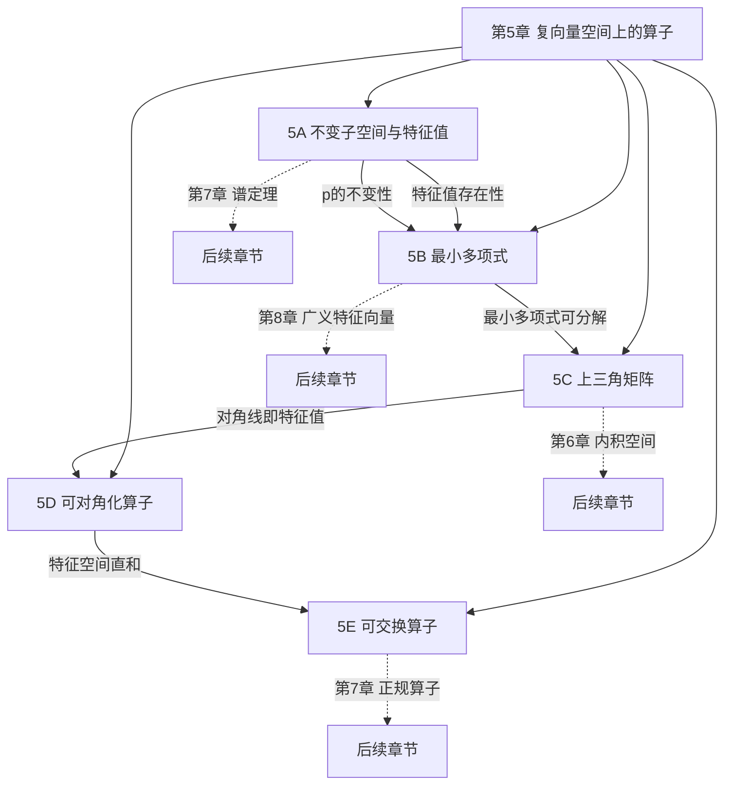

# 第 5 章 复向量空间上的算子 — 章节汇总

> [!abstract] 全章概览
> 第 5 章是线性代数的"算子核心篇"——它将第 3 章的一般线性映射聚焦到==算子== $T\in\mathcal{L}(V)$（从空间到自身的映射），引入==特征值==与==特征向量==作为理解算子行为的基本工具。本章从不变子空间出发，建立最小多项式理论，证明复向量空间上每个算子都可上三角化（Schur 分解的抽象形式），给出可对角化的多重等价刻画，最后研究可交换算子的同时对角化与同时上三角化。
>
> **逻辑链条**：算子定义 → 不变子空间 → 特征值/特征向量 → 线性无关性 → $p(T)$ → 最小多项式 → 上三角矩阵 → 特征值=对角线 → 可对角化 → 最小多项式无重根 → 可交换算子 → 同时对角化/上三角化
>
> **核心主线**：特征值是算子的"DNA"，最小多项式是"基因图谱"，上三角化是"最简表示的第一步"，对角化是"最简表示的终极目标"

---

## 一、全章知识框架思维导图

---

## 二、全章核心知识点与重点公式汇总

### 5A 不变子空间、特征值和特征向量（[[5A 不变子空间、特征值和特征向量]]）

| 编号 | 类型 | 名称 | 内容 |
|:---:|:---:|:---|:---|
| 5.1 | 定义 | ==**算子**== | $T\in\mathcal{L}(V)$，从向量空间到自身的线性映射 |
| 5.2 | 定义 | ==**不变子空间**== | $U\subseteq V$ 在 $T$ 下不变：$Tu\in U$ 对所有 $u\in U$ |
| 5.5 | 定义 | ==**特征值**== | $\exists\, v\neq 0$ 使 $Tv=\lambda v$ |
| 5.7 | 定理 | 特征值的等价条件 | $\lambda$ 是特征值 $\Leftrightarrow$ $T-\lambda I$ 不是单射/满射/不可逆 |
| 5.8 | 定义 | ==**特征向量**== | $v\neq 0$ 且 $Tv=\lambda v$，即 $v\in\text{null}(T-\lambda I)$ |
| 5.11 | 定理 | 不同特征值的特征向量线性无关 | 对应互异特征值的特征向量组线性无关 |
| 5.12 | 定理 | 特征值个数上界 | 互异特征值个数 $\leq\dim V$ |
| 5.14 | 记号 | $p(T)$ | 多项式作用于算子：$p(T)=a_0 I+a_1 T+\cdots+a_m T^m$ |
| 5.17 | 定理 | 乘积性质 | $(pq)(T)=p(T)q(T)$，$p(T)q(T)=q(T)p(T)$ |
| 5.18 | 定理 | $p(T)$ 的零空间和值域不变 | $\text{null}\,p(T)$ 和 $\text{range}\,p(T)$ 在 $T$ 下不变 |

### 5B 最小多项式（[[5B 最小多项式]]）

| 编号 | 类型 | 名称 | 内容 |
|:---:|:---:|:---|:---|
| 5.19 | 定理 | ==**复向量空间上特征值的存在性**== | 有限维复向量空间上每个算子都有特征值 |
| 5.21 | 定义 | 首一多项式 | 最高次项系数为 $1$ 的多项式 |
| 5.22/5.24 | 定理/定义 | ==**最小多项式**== | 唯一首一多项式 $p$ 使 $p(T)=0$，$\deg p\leq\dim V$，$p\mid q$ 若 $q(T)=0$ |
| 5.27 | 定理 | 特征值=最小多项式的零点 | $\lambda$ 是特征值 $\Leftrightarrow$ $p(\lambda)=0$ |
| 5.29 | 定理 | $q(T)=0$ 的充要条件 | $q(T)=0$ $\Leftrightarrow$ $p\mid q$（$p$ 为最小多项式） |
| 5.31 | 定理 | 受限算子的最小多项式 | $T|_U$ 的最小多项式整除 $T$ 的最小多项式 |
| 5.32 | 定理 | 可逆性判定 | $T$ 不可逆 $\Leftrightarrow$ 最小多项式常数项为 $0$ |
| 5.33 | 定理 | 偶数维的零空间 | 无特征值时 $\dim\text{null}(T^2+I)$ 是偶数 |
| 5.34 | 定理 | ==**奇数维实空间总有特征值**== | 奇数维实向量空间上每个算子都有特征值 |

### 5C 上三角矩阵（[[5C 上三角矩阵]]）

| 编号 | 类型 | 名称 | 内容 |
|:---:|:---:|:---|:---|
| 5.35 | 定义 | ==**算子的矩阵**== $\mathcal{M}(T)$ | 方阵，第 $k$ 列 = $Tv_k$ 在基下的坐标 |
| 5.37 | 定义 | 矩阵的对角线 | $A_{1,1},A_{2,2},\ldots,A_{n,n}$ |
| 5.38 | 定义 | ==**上三角矩阵**== | 对角线以下所有元素为零 |
| 5.39 | 定理 | 上三角矩阵的等价条件 | 上三角 $\Leftrightarrow$ $\text{span}(v_1,\ldots,v_k)$ 在 $T$ 下不变 $\Leftrightarrow$ $Tv_k\in\text{span}(v_1,\ldots,v_k)$ |
| 5.40 | 定理 | 上三角算子满足的等式 | $(T-\lambda_1 I)\cdots(T-\lambda_n I)=0$ |
| 5.41 | 定理 | ==**特征值=对角线元素**== | 上三角矩阵的对角线元素恰为全部特征值 |
| 5.44 | 定理 | 上三角矩阵存在的充要条件 | 有上三角矩阵 $\Leftrightarrow$ 最小多项式可分解为一次因式之积 |
| 5.47 | 定理 | ==**$\mathbb{C}$ 上每个算子都可上三角化**== | 复向量空间上 $T$ 总有上三角矩阵（Schur 分解） |

### 5D 可对角化算子（[[5D 可对角化算子]]）

| 编号 | 类型 | 名称 | 内容 |
|:---:|:---:|:---|:---|
| 5.48 | 定义 | 对角矩阵 | 对角线之外全为零的方阵 |
| 5.50 | 定义 | ==**可对角化**== | 存在基使 $\mathcal{M}(T)$ 为对角矩阵 |
| 5.52 | 定义 | ==**特征空间**== $E(\lambda,T)$ | $\text{null}(T-\lambda I)=\{v:Tv=\lambda v\}$ |
| 5.54 | 定理 | 特征空间之和是直和 | $E(\lambda_1,T)+\cdots+E(\lambda_m,T)$ 是直和，维数之和 $\leq\dim V$ |
| 5.55 | 定理 | ==**可对角化的四条等价条件**== | 可对角化 $\Leftrightarrow$ 特征向量基 $\Leftrightarrow$ 特征空间直和分解 $\Leftrightarrow$ 维数等式 |
| 5.58 | 定理 | 互异特征值足够多则可对角化 | $\dim V$ 个互异特征值 $\Rightarrow$ 可对角化 |
| 5.62 | 定理 | ==**可对角化 $\Leftrightarrow$ 最小多项式无重根**== | 最小多项式为 $(z-\lambda_1)\cdots(z-\lambda_m)$，$\lambda_j$ 互不相同 |
| 5.65 | 定理 | 限制于不变子空间仍可对角化 | $T$ 可对角化且 $U$ 不变 $\Rightarrow$ $T|_U$ 可对角化 |
| 5.66 | 定义 | 格什戈林圆盘 | $D_j=\{z:|z-A_{j,j}|\leq\sum_{k\neq j}|A_{j,k}|\}$ |
| 5.67 | 定理 | 格什戈林圆盘定理 | 每个特征值至少属于一个格什戈林圆盘 |

### 5E 可交换算子（[[5E 可交换算子]]）

| 编号 | 类型 | 名称 | 内容 |
|:---:|:---:|:---|:---|
| 5.71 | 定义 | ==**可交换**== | $ST=TS$ |
| 5.74 | 命题 | 可交换算子对应可交换矩阵 | $ST=TS$ $\Leftrightarrow$ $\mathcal{M}(S)\mathcal{M}(T)=\mathcal{M}(T)\mathcal{M}(S)$（同基下） |
| 5.75 | 引理 | ==**特征空间在可交换算子下不变**== | $ST=TS$ $\Rightarrow$ $E(\lambda,S)$ 在 $T$ 下不变 |
| 5.76 | 定理 | ==**同时对角化 $\Leftrightarrow$ 可交换**== | 两个可对角化算子可同时对角化当且仅当可交换 |
| 5.78 | 定理 | 公共特征向量 | 复向量空间上每对可交换算子都有公共特征向量 |
| 5.80 | 定理 | 同时上三角化 | 复向量空间上可交换算子可同时上三角化 |
| 5.81 | 定理 | 和与积的特征值 | $S+T$ 的特征值 $=$ $S$ 的特征值 $+$ $T$ 的特征值；$ST$ 类似（乘积） |

---

## 三、章节学习脉络梳理

### 5A 不变子空间、特征值和特征向量

**核心问题**：算子作用在空间上时，哪些子空间是"稳定"的？算子的"固有方向"是什么？

- ==算子== $T\in\mathcal{L}(V)$ 是从空间到自身的线性映射——它可以取幂 $T^m$，这是算子区别于一般线性映射的关键
- ==不变子空间==是"分而治之"的工具：若 $V=V_1\oplus\cdots\oplus V_m$ 且每个 $V_k$ 不变，则理解 $T$ 归结为理解各 $T|_{V_k}$
- 一维不变子空间自然导出==特征值==与==特征向量==：$Tv=\lambda v$ 意味着 $T$ 将 $v$ 映射到其所在直线上
- 定理 5.7 给出特征值的四条等价条件，其中"$T-\lambda I$ 不可逆"最实用
- 不同特征值对应的特征向量线性无关（5.11），由此得特征值个数 $\leq\dim V$（5.12）
- $p(T)$ 的理论为下一节做准备：$p(T)$ 与 $T$ 可交换（5.17），$\text{null}\,p(T)$ 和 $\text{range}\,p(T)$ 在 $T$ 下不变（5.18）

**关键收获**：特征值和特征向量是理解算子行为的最基本工具。不变子空间提供了"分而治之"的框架，而一维不变子空间恰好对应特征向量。

### 5B 最小多项式

**核心问题**：如何"消灭"一个算子？算子的特征值信息能否被一个多项式完全编码？

- ==复向量空间上每个算子都有特征值==（5.19）——这是全章最重要的存在性定理，证明利用了代数基本定理
- ==最小多项式==是"消灭"算子的次数最低的首一多项式：$p(T)=0$，$\deg p\leq\dim V$，且整除所有满足 $q(T)=0$ 的 $q$
- 特征值恰好是最小多项式的零点（5.27）——最小多项式编码了全部特征值信息
- $q(T)=0$ $\Leftrightarrow$ $p\mid q$（5.29）：最小多项式是算子的"DNA"
- 可逆性判定（5.32）：$T$ 不可逆 $\Leftrightarrow$ 最小多项式常数项为 $0$（即 $0$ 是特征值）
- 奇数维实向量空间上每个算子都有特征值（5.34）——利用偶数维零空间定理（5.33）和商空间归纳法证明

**关键收获**：最小多项式是算子的"基因图谱"——它不仅决定了特征值的存在性和可逆性，还为后续可对角化判据（5.62）和上三角化充要条件（5.44）奠定基础。

### 5C 上三角矩阵

**核心问题**：能否通过选取合适的基使算子的矩阵尽可能简单？

- ==算子的矩阵== $\mathcal{M}(T)$ 一定是方阵——与一般线性映射的长方形矩阵不同
- ==上三角矩阵==对应一组嵌套的不变子空间链：$\{0\}\subseteq\text{span}(v_1)\subseteq\cdots\subseteq V$
- 上三角算子满足 $(T-\lambda_1 I)\cdots(T-\lambda_n I)=0$（5.40）——这是连接上三角矩阵与特征值的桥梁
- ==特征值=对角线元素==（5.41）：上三角矩阵的对角线直接给出全部特征值
- 存在上三角矩阵 $\Leftrightarrow$ 最小多项式可分解为一次因式之积（5.44）——取决于域 $\mathbb{F}$ 的选择
- ==$\mathbb{C}$ 上每个算子都可上三角化==（5.47）——本质上是 Schur 分解的抽象形式，由代数基本定理保证

**关键收获**：上三角矩阵是"最简矩阵表示"的第一步。在复数域上，每个算子都可以上三角化，特征值可以直接从对角线读出。这是后续对角化理论和谱定理的基础。

### 5D 可对角化算子

**核心问题**：什么时候算子可以"最简化"为对角矩阵？如何判定？

- ==可对角化==意味着存在特征向量基——对角矩阵使算子的幂、多项式、逆的计算极其简单
- ==特征空间== $E(\lambda,T)=\text{null}(T-\lambda I)$ 是对应于 $\lambda$ 的所有特征向量加上零向量
- 特征空间之和是直和（5.54），维数之和 $\leq\dim V$
- ==可对角化的四条等价条件==（5.55）：可对角化 $\Leftrightarrow$ 特征向量基 $\Leftrightarrow$ 特征空间直和分解 $\Leftrightarrow$ 维数等式
- ==可对角化 $\Leftrightarrow$ 最小多项式无重根==（5.62）：这是判定可对角化的终极工具
- 可对角化算子限制于不变子空间仍可对角化（5.65）——5E 中同时对角化的关键引理
- 格什戈林圆盘定理（5.67）给出特征值的定位工具——不需要计算特征多项式

**关键收获**：可对角化是算子"最理想"的矩阵表示。判定可对角化有两条路线：几何路线（维数等式 5.55(d)）和代数路线（最小多项式无重根 5.62），后者往往更高效。

### 5E 可交换算子

**核心问题**：两个算子何时能共享同一组"优良基"？

- ==可交换== $ST=TS$ 是一个极强的约束条件——随机矩阵对中仅约 $0.3\%$ 可交换
- 特征空间在可交换算子下不变（5.75）——这是本节所有后续定理的基础，证明核心是利用 $ST=TS$ 交换作用顺序
- ==可对角化算子可同时对角化 $\Leftrightarrow$ 可交换==（5.76）：本节最重要的定理，充分性证明展示精妙的"分治"策略
- 复向量空间上每对可交换算子都有公共特征向量（5.78）——在 $S$ 的特征空间里找 $T$ 的特征向量
- 可交换算子可同时上三角化（5.80）——不要求可对角化，推广了 5.47
- 和与积的特征值公式（5.81）：$S+T$ 的特征值 $=$ $S$ 的特征值 $+$ $T$ 的特征值（类似乘积）

**关键收获**：可交换性看似简单的代数条件，却蕴含深刻的结构信息——它保证了特征空间的不变性，从而使得两个算子可以共享同一组优良基。这对理解谱定理中正规算子的同时对角化至关重要。

---

## 四、补充理解与跨章展望

### 4.1 第 5 章的核心方法论

第 5 章建立了算子理论的三大核心方法论：

1. **"选取好基"策略**：通过选取使 $\mathcal{M}(T)$ 尽可能简单的基来理解算子。上三角矩阵是第一步（5.47），对角矩阵是终极目标（5.55）。这一策略在第 7 章谱定理中达到顶峰——正规算子关于标准正交基有对角矩阵。

2. **"最小多项式"判别法**：最小多项式统一了特征值存在性（5.27）、可逆性判定（5.32）、上三角化充要条件（5.44）和可对角化判据（5.62）。在第 8 章中，最小多项式的因式分解将导出广义特征空间分解。

3. **"分而治之"的分解思想**：不变子空间将 $V$ 分解为更小的子空间，在每个子空间上分别研究算子。特征空间直和分解（5.55(c)）是最理想的情形。在第 8 章中，广义特征空间分解将这一思想推广到不可对角化的情形。

### 4.2 第 5 章与后续章节的关联地图

| 第 5 章概念 | 后续章节中的深化 |
|---|---|
| 算子 $T\in\mathcal{L}(V)$ | 第 6 章：内积空间上的算子、伴随算子 $T^*$ |
| 不变子空间 | 第 7 章：不变子空间在谱定理证明中的核心作用 |
| 特征值/特征向量 | 第 7 章：正规算子的特征值都是实数/特征向量标准正交 |
| 最小多项式 | 第 8 章：Cayley-Hamilton 定理、广义特征空间分解 |
| 上三角矩阵（5.47） | 第 7 章：Schur 分解的精确形式（标准正交基版本） |
| 可对角化（5.55） | 第 7 章：正规算子可对角化（谱定理 7.24） |
| 最小多项式无重根（5.62） | 第 8 章：最小多项式的因式分解与广义特征空间 |
| 特征空间 $E(\lambda,T)$ | 第 8 章：广义特征空间 $G(\lambda,T)$ |
| 可交换算子（5.76） | 第 7 章：正规算子与 $T^*$ 可交换（$TT^*=T^*T$） |
| 同时对角化（5.76） | 第 7 章：正规算子族的同时对角化 |
| 同时上三角化（5.80） | 第 7 章：可交换正规算子族的同时对角化 |
| 换基公式 $A=C^{-1}BC$（[[3D 可逆性和同构]]） | 第 5 章：相似矩阵有相同的特征值、迹和行列式 |
| 基本定理 3.21（[[3B 零空间和值域]]） | 第 5 章：特征空间维数之和 $\leq\dim V$（5.54） |
| 商空间 $V/U$（[[3E 向量空间的积和商]]） | 第 5 章：奇数维特征值存在性证明（5.34） |
| 对偶空间 $V'$（[[3F 对偶]]） | 第 7 章：Riesz 表示定理使 $V\cong V'$ 自然化 |

### 4.3 为什么第 5 章是算子理论的基石？

第 5 章建立了算子理论的四大支柱：

- **特征值理论**：特征值和特征向量是理解算子行为的最基本工具。第 7 章的谱定理和第 8 章的 Jordan 标准形都是特征值理论的深化。

- **最小多项式**：最小多项式是算子的"基因图谱"，统一了特征值存在性、可逆性、上三角化和可对角化的判别。第 8 章的 Cayley-Hamilton 定理是最小多项式理论的巅峰。

- **上三角化**：$\mathbb{C}$ 上每个算子都可上三角化（5.47），这是 Schur 分解的抽象形式。第 7 章将这一结果加强为"关于标准正交基可上三角化"。

- **可对角化**：可对角化的四条等价条件（5.55）和最小多项式判据（5.62）提供了完整的判定工具。第 7 章将证明正规算子一定可对角化——这是谱定理的核心。

可以毫不夸张地说：==第 5 章将第 3 章的"一般映射理论"聚焦到"算子理论"，建立了从抽象到具体的完整桥梁，是后续谱定理和 Jordan 标准形理论的直接基础==。

---

## 五、全章总复习题

> [!info] 使用说明
> 以下复习题覆盖第 5 章全部五节的核心知识点。建议在不查阅笔记的情况下独立完成，然后对照答案自评。每题标注了考查的节次和知识点。

### A. 不变子空间与特征值（5A）

**A1**. 设 $T\in\mathcal{L}(\mathbb{C}^2)$，$T(z_1,z_2)=(z_2,z_1)$。求 $T$ 的所有特征值和对应的特征空间。

查看解答

$T(z_1,z_2)=(z_2,z_1)=\lambda(z_1,z_2)$ 即 $z_2=\lambda z_1$ 且 $z_1=\lambda z_2$。

代入得 $z_1=\lambda^2 z_1$，故 $\lambda^2=1$，$\lambda=1$ 或 $\lambda=-1$。

- $\lambda=1$：$z_2=z_1$，$E(1,T)=\text{span}((1,1))$。
- $\lambda=-1$：$z_2=-z_1$，$E(-1,T)=\text{span}((1,-1))$。

$\dim E(1,T)+\dim E(-1,T)=1+1=2=\dim\mathbb{C}^2$，故 $T$ 可对角化。$\blacksquare$

**A2**. 设 $T\in\mathcal{L}(V)$，$U$ 是 $V$ 的子空间。证明：$U$ 在 $T$ 下不变当且仅当 $T|_U$ 是 $U$ 上的算子。

查看解答

**($\Rightarrow$)**：$U$ 在 $T$ 下不变，即对每个 $u\in U$ 有 $Tu\in U$。因此 $T|_U:U\to U$ 是良定义的线性映射，即 $U$ 上的算子。

**($\Leftarrow$)**：$T|_U$ 是 $U$ 上的算子意味着 $T|_U:U\to U$，即对每个 $u\in U$ 有 $Tu=T|_U(u)\in U$。故 $U$ 在 $T$ 下不变。$\blacksquare$

### B. 最小多项式（5B）

**B1**. 设 $T\in\mathcal{L}(\mathbb{C}^3)$ 的最小多项式为 $p(z)=(z-2)(z-5)(z-8)$。求 $T$ 的所有特征值，并判断 $T$ 是否可对角化。

查看解答

由定理 5.27，特征值 = 最小多项式的零点 = $\{2,5,8\}$。

最小多项式无重根（三个一次因式互不相同），由定理 5.62，$T$ 可对角化。$\blacksquare$

**B2**. 设 $T\in\mathcal{L}(V)$ 不可逆。证明 $0$ 是 $T$ 的特征值。

查看解答

$T$ 不可逆 $\Leftrightarrow$ 最小多项式 $p$ 的常数项为 $0$（定理 5.32）$\Leftrightarrow$ $p(0)=0$ $\Leftrightarrow$ $0$ 是 $p$ 的零点 $\Leftrightarrow$ $0$ 是 $T$ 的特征值（定理 5.27）。$\blacksquare$

### C. 上三角矩阵（5C）

**C1**. 设 $T\in\mathcal{L}(\mathbb{C}^4)$ 关于某基的矩阵为
$$\begin{pmatrix}3&7&1&2\\0&5&8&3\\0&0&3&1\\0&0&0&6\end{pmatrix}$$
求 $T$ 的所有特征值。

查看解答

矩阵是上三角矩阵，由定理 5.41，特征值 = 对角线元素 = $\{3,5,3,6\}$。

注意 $3$ 出现两次——它是代数重数为 $2$ 的特征值。$\blacksquare$

**C2**. 举例说明存在 $\mathbb{R}$ 上的算子没有上三角矩阵。

查看解答

设 $T\in\mathcal{L}(\mathbb{R}^2)$，$T(x,y)=(-y,x)$（旋转 $90°$）。

$T$ 在 $\mathbb{R}$ 上没有特征值（见 5A 例 5.9）。若 $T$ 有上三角矩阵，则对角线元素都是特征值（定理 5.41），矛盾。

故 $T$ 在 $\mathbb{R}$ 上没有上三角矩阵。$\blacksquare$

### D. 可对角化算子（5D）

**D1**. 设 $T\in\mathcal{L}(\mathbb{C}^3)$，$T(x,y,z)=(y,z,0)$。判断 $T$ 是否可对角化。

查看解答

$T$ 的唯一特征值是 $0$（见 5D 例 5.57），$E(0,T)=\text{span}((1,0,0))$，$\dim E(0,T)=1$。

由定理 5.55(d)：$\dim E(0,T)=1<3=\dim V$，故 $T$ 不可对角化。$\blacksquare$

**D2**. 设 $T\in\mathcal{L}(\mathbb{C}^4)$ 的最小多项式为 $p(z)=(z-1)(z-2)(z-3)$。证明 $T$ 可对角化，并求 $\dim E(1,T)+\dim E(2,T)+\dim E(3,T)$。

查看解答

$p$ 无重根，由定理 5.62，$T$ 可对角化。

由定理 5.55(d)：$\dim E(1,T)+\dim E(2,T)+\dim E(3,T)=\dim V=4$。$\blacksquare$

### E. 可交换算子（5E）

**E1**. 设 $S,T\in\mathcal{L}(V)$ 可对角化且可交换。证明存在 $V$ 的基使 $\mathcal{M}(S)$ 和 $\mathcal{M}(T)$ 都是对角矩阵。

查看解答

由定理 5.76，两个可对角化算子可同时对角化当且仅当可交换。

$S$ 可对角化 $\Rightarrow$ $V=E(\lambda_1,S)\oplus\cdots\oplus E(\lambda_m,S)$（5.55(c)）。

$ST=TS$ $\Rightarrow$ 每个 $E(\lambda_k,S)$ 在 $T$ 下不变（引理 5.75）。

$T$ 可对角化 $\Rightarrow$ 每个 $T|_{E(\lambda_k,S)}$ 可对角化（定理 5.65）。

在每个 $E(\lambda_k,S)$ 中取 $T$ 的特征向量基，合并得到 $V$ 的基。该基中每个向量既是 $S$ 的特征向量又是 $T$ 的特征向量，故 $\mathcal{M}(S)$ 和 $\mathcal{M}(T)$ 都是对角矩阵。$\blacksquare$

**E2**. 设 $S,T\in\mathcal{L}(\mathbb{C}^3)$ 可交换，$S$ 的特征值为 $1,2,3$，$T$ 的特征值为 $4,5$。证明 $S+T$ 的每个特征值都等于 $S$ 的某个特征值加上 $T$ 的某个特征值。

查看解答

由定理 5.80，$S$ 和 $T$ 可同时上三角化：存在基使 $\mathcal{M}(S)$ 和 $\mathcal{M}(T)$ 都是上三角矩阵。

$\mathcal{M}(S)$ 的对角线元素为 $S$ 的特征值 $\{1,2,3\}$，$\mathcal{M}(T)$ 的对角线元素为 $T$ 的特征值 $\{4,5,\alpha\}$（其中 $\alpha$ 是某个特征值，可能重复）。

$\mathcal{M}(S+T)=\mathcal{M}(S)+\mathcal{M}(T)$ 仍为上三角矩阵，对角线元素为对应位置之和：$\{1+4,\,2+5,\,3+\alpha\}$。

由定理 5.41，$S+T$ 的特征值恰为这些对角线元素，每个都等于 $S$ 的某个特征值加上 $T$ 的某个特征值。$\blacksquare$

---

## 六、各节笔记索引

| 节 | 笔记链接 | 核心主题 |
|:---:|:---|:---|
| 5A | [[5A 不变子空间、特征值和特征向量]] | ==算子==、==不变子空间==、==特征值==、==特征向量==、$p(T)$ |
| 5B | [[5B 最小多项式]] | ==特征值存在性==、==最小多项式==、可逆性判定、奇数维特征值 |
| 5C | [[5C 上三角矩阵]] | ==算子的矩阵==、==上三角矩阵==、==特征值=对角线==、Schur 分解 |
| 5D | [[5D 可对角化算子]] | ==可对角化==、==特征空间==、==四条等价条件==、==最小多项式无重根==、格什戈林圆盘 |
| 5E | [[5E 可交换算子]] | ==可交换==、==特征空间不变==、==同时对角化==、同时上三角化 |

---

## 七、全章核心公式

> [!success] 必须熟记的公式与定理

1. ==**特征值的等价条件**==（定理 5.7）：$\lambda$ 是特征值 $\Leftrightarrow$ $T-\lambda I$ 不可逆
2. ==**不同特征值的特征向量线性无关**==（定理 5.11）：对应互异特征值的特征向量组线性无关
3. ==**复向量空间上每个算子都有特征值**==（定理 5.19）：有限维复向量空间上 $T$ 至少有一个特征值
4. ==**最小多项式**==（定理 5.22/5.24）：唯一首一多项式 $p$ 使 $p(T)=0$，$\deg p\leq\dim V$
5. **特征值=最小多项式的零点**（定理 5.27）：$\lambda$ 是特征值 $\Leftrightarrow$ $p(\lambda)=0$
6. **$q(T)=0$ 的充要条件**（定理 5.29）：$q(T)=0$ $\Leftrightarrow$ $p\mid q$
7. ==**上三角算子等式**==（定理 5.40）：$(T-\lambda_1 I)\cdots(T-\lambda_n I)=0$
8. ==**特征值=对角线元素**==（定理 5.41）：上三角矩阵的对角线元素恰为全部特征值
9. ==**$\mathbb{C}$ 上每个算子都可上三角化**==（定理 5.47）
10. ==**可对角化的四条等价条件**==（定理 5.55）：可对角化 $\Leftrightarrow$ 特征向量基 $\Leftrightarrow$ 特征空间直和 $\Leftrightarrow$ 维数等式
11. ==**可对角化 $\Leftrightarrow$ 最小多项式无重根**==（定理 5.62）
12. ==**同时对角化 $\Leftrightarrow$ 可交换**==（定理 5.76）：两个可对角化算子可同时对角化当且仅当可交换

> [!warning] 易错提醒
> - 特征值要求 $v\neq 0$——$T0=\lambda 0$ 对所有 $\lambda$ 成立，不能用来定义特征值
> - 同一个算子在不同数域上可能有不同的特征值结构——$\mathbb{R}$ 上旋转 $90°$ 无特征值，$\mathbb{C}$ 上有
> - ==有特征值不等于可对角化==——关键看特征空间维数之和是否等于 $\dim V$
> - 最小多项式的次数上界是 $\dim V$（不是 $\dim V^2$）
> - 上三角矩阵的第一个基向量一定是特征向量，但其余基向量不一定是
> - 可交换性是极强的约束——随机矩阵对中仅约 $0.3\%$ 可交换
> - 两个可交换算子有公共特征向量，但==不一定有共同的特征值==

#学习/线性代数/复向量空间上的算子
