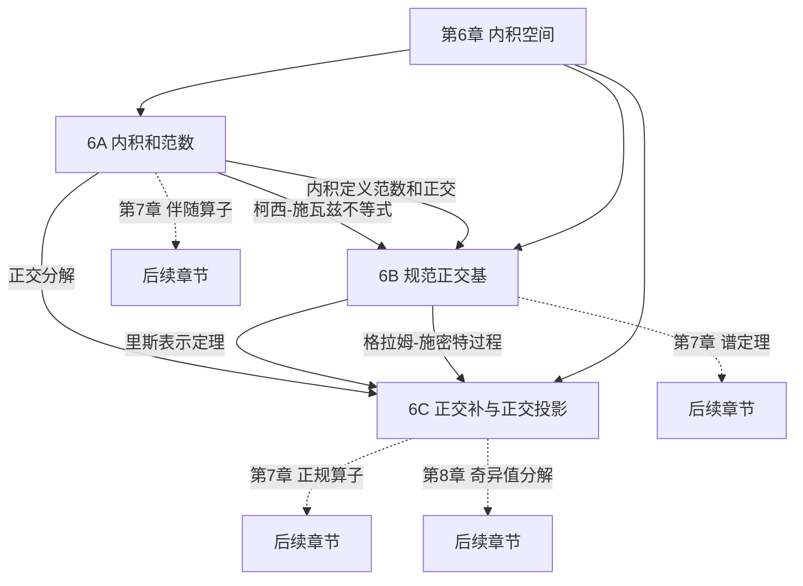
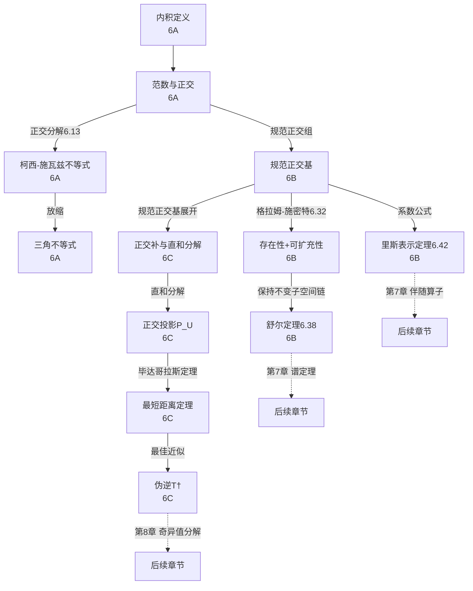

# 第 6 章 内积空间 — 章节汇总

> [!abstract] 全章概览
> 第 6 章是线性代数的"几何革命"——它在前五章建立的纯代数结构（向量空间、线性映射、算子）之上，引入==内积==赋予空间长度、角度和正交性等几何结构。本章从内积的公理化定义出发，导出范数、正交、柯西-施瓦兹不等式等基本工具，建立规范正交基的三大计算优势与格拉姆-施密特构造过程，通过舒尔定理将上三角化升级为规范正交版本，利用里斯表示定理实现内积空间中对偶空间与原空间的自然等同，最终以正交补与正交投影理论收束，将直和分解、最小化问题和伪逆统一在正交性的框架下。
>
> **逻辑链条**：内积（定义 6.2）$\to$ 范数（6.7）$\to$ 正交（6.10）$\to$ 正交分解（6.13）$\to$ ==柯西-施瓦兹不等式==（6.14）$\to$ 三角不等式（6.17）$\to$ 平行四边形等式（6.21）$\to$ 规范正交组（6.22）$\to$ 规范正交基（6.27）$\to$ ==格拉姆-施密特过程==（6.32）$\to$ 舒尔定理（6.38）$\to$ ==里斯表示定理==（6.42）$\to$ 正交补（6.46）$\to$ 直和分解 $V = U \oplus U^\perp$（6.49）$\to$ 正交投影 $P_U$（6.55）$\to$ 最小化问题（6.61）$\to$ ==伪逆== $T^\dagger$（6.68）
>
> **核心主线**：内积赋予空间几何结构，规范正交基是最优坐标系，正交投影是几何分析的核心工具，伪逆是不可逆映射的最佳替代

---

## 一、全章知识框架思维导图

---

## 二、全章核心知识点与重点公式汇总

### 2.1 内积和范数（[[6A 内积和范数]]）

| 定理/定义 | 内容 | 编号 |
|:---|:---|:---:|
| ==**内积**== | 五条公理：正性、定性、第一位置可加性、第一位置齐次性、共轭对称性 | 6.2 |
| 内积空间 | 带有内积的向量空间 | 6.4 |
| 内积的基本性质 | sesquilinear 结构：第一位置线性，第二位置共轭线性；$\langle 0,v\rangle=0$ | 6.6 |
| ==**范数**== | $\|v\|=\sqrt{\langle v,v\rangle}$；$\|v\|=0\Leftrightarrow v=0$；$\|\lambda v\|=|\lambda|\|v\|$ | 6.7, 6.9 |
| ==**正交**== | $\langle u,v\rangle=0$；$0$ 与所有向量正交且是唯一自正交向量 | 6.10, 6.11 |
| ==**毕达哥拉斯定理**== | $u\perp v$ $\Rightarrow$ $\|u+v\|^2=\|u\|^2+\|v\|^2$ | 6.12 |
| ==**正交分解**== | $u=cv+w$，$c=\dfrac{\langle u,v\rangle}{\|v\|^2}$，$w\perp v$ | 6.13 |
| ==**柯西-施瓦兹不等式**== | $|\langle u,v\rangle|\leq\|u\|\|v\|$，等号 $\Leftrightarrow$ $u,v$ 成标量倍 | 6.14 |
| ==**三角不等式**== | $\|u+v\|\leq\|u\|+\|v\|$，等号 $\Leftrightarrow$ 非负实数倍 | 6.17 |
| ==**平行四边形等式**== | $\|u+v\|^2+\|u-v\|^2=2(\|u\|^2+\|v\|^2)$ | 6.21 |

### 2.2 规范正交基（[[6B 规范正交基]]）

| 定理/定义 | 内容 | 编号 |
|:---|:---|:---:|
| ==**规范正交**== | $\langle e_j,e_k\rangle=\delta_{jk}$：范数为 1 且两两正交 | 6.22 |
| 规范正交组线性组合的范数 | $\|a_1e_1+\cdots+a_me_m\|^2=|a_1|^2+\cdots+|a_m|^2$ | 6.24 |
| 规范正交组线性无关 | 规范正交 $\Rightarrow$ 线性无关 | 6.25 |
| ==**贝塞尔不等式**== | $\sum|\langle v,e_k\rangle|^2\leq\|v\|^2$ | 6.26 |
| ==**规范正交基**== | 既是规范正交组又是基；长度 $=\dim V$ 即可判定 | 6.27, 6.28 |
| ==**规范正交基三大优势**== | (a) 系数 $a_k=\langle v,e_k\rangle$；(b) 帕塞瓦尔恒等式；(c) 内积按坐标计算 | 6.30 |
| ==**格拉姆-施密特过程**== | 系统性将线性无关组转化为规范正交组，保持张成空间 | 6.32 |
| 规范正交基的存在性 | 每个有限维内积空间都有规范正交基 | 6.35 |
| 可扩充性 | 每个规范正交组都可扩充为规范正交基 | 6.36 |
| 规范正交基上三角化 | $T$ 关于规范正交基有上三角矩阵 $\Leftrightarrow$ 最小多项式可分解 | 6.37 |
| ==**舒尔定理**== | 复内积空间上每个算子都关于某个规范正交基有上三角矩阵 | 6.38 |
| ==**里斯表示定理**== | 每个 $\varphi\in V'$ 唯一对应 $v\in V$：$\varphi(u)=\langle u,v\rangle$ | 6.42 |

### 2.3 正交补与正交投影（[[6C 正交补和正交投影]]）

| 定理/定义 | 内容 | 编号 |
|:---|:---|:---:|
| ==**正交补**== $U^\perp$ | $\{v\in V:\langle u,v\rangle=0\ \forall u\in U\}$ | 6.46 |
| 正交补的性质 | 子空间性、$\{0\}^\perp=V$、$V^\perp=\{0\}$、$U\cap U^\perp=\{0\}$、反序性 | 6.48 |
| ==**直和分解**== | $V=U\oplus U^\perp$ | 6.49 |
| ==**$\dim U^\perp=\dim V-\dim U$**== | 正交补的维数公式 | 6.51 |
| ==**双重正交补**== | $(U^\perp)^\perp=U$ | 6.52 |
| 正交补为零/全空间判定 | $U^\perp=\{0\}\Leftrightarrow U=V$ | 6.54 |
| ==**正交投影**== $P_U$ | $P_Uv=u$（$v=u+w$，$u\in U$，$w\in U^\perp$） | 6.55 |
| 正交投影 9 条性质 | 线性性、恒等/零化、值域/零空间、幂等性、范数收缩、显式公式 | 6.57 |
| 里斯表示定理（正交补证明） | 利用 $\text{null}\,\varphi$ 的正交补是一维的 | 6.58 |
| ==**最短距离定理**== | $\|v-u\|$ 最小 $\Leftrightarrow$ $u=P_Uv$ | 6.61 |
| 限制映射为双射 | $T|_{(\text{null}\,T)^\perp}$ 是到 $\text{range}\,T$ 的双射 | 6.67 |
| ==**伪逆**== $T^\dagger$ | $(T|_{(\text{null}\,T)^\perp})^{-1}$，扩展到整个 $W$ | 6.68 |
| 伪逆代数性质 | $TT^\dagger=P_{\text{range}\,T}$，$T^\dagger T=P_{(\text{null}\,T)^\perp}$ | 6.69 |
| ==**伪逆最优性**== | $T^\dagger w$ 使 $\|Tv-w\|$ 最小；有解时范数最小 | 6.70 |

---

## 三、章节学习脉络梳理

### 3.1 第一层：内积的公理化与基本推论（6A）

**核心问题**：如何在线性空间上定义"长度"和"角度"？

- 内积的五条公理（6.2）是整个理论的基石——正性和定性保证"长度"有意义，可加性和齐次性保证线性结构，共轭对称性适配复数域
- ==sesquilinear 结构==：内积对第一变元线性、对第二变元共轭线性——这是复内积空间最本质的结构特征
- 范数 $\|v\|=\sqrt{\langle v,v\rangle}$ 由内积导出，正交 $\langle u,v\rangle=0$ 也由内积定义
- ==正交分解==（6.13）是全章的枢纽——它将任意向量分解为"平行分量"和"正交分量"
- 柯西-施瓦兹不等式（6.14）由正交分解+毕达哥拉斯定理推出，是数学中最重要的不等式之一
- 三角不等式（6.17）由柯西-施瓦兹推出，注意其等号条件比柯西-施瓦兹更严格（非负实数倍）
- 平行四边形等式（6.21）刻画了内积空间的特征——不满足该等式的范数不可能由内积导出

**关键收获**：内积是赋予向量空间几何结构的"最小代价"工具。从五条公理出发，长度、角度、正交、距离等所有几何概念都可以严格定义。柯西-施瓦兹不等式是连接代数与几何的核心桥梁。

### 3.2 第二层：规范正交基——最优坐标系（6B）

**核心问题**：什么样的基能让计算最简单？

- 规范正交组自动线性无关（6.25）——正交性是比线性无关更强的条件
- ==规范正交基三大优势==（6.30）：系数直接读出、帕塞瓦尔恒等式、内积按坐标计算——无需解方程组
- 贝塞尔不等式（6.26）：投影只能"损失"信息，不能"创造"信息
- ==格拉姆-施密特过程==（6.32）：从任意线性无关组系统构造规范正交组，同时保持张成空间不变
- 存在性（6.35）+ 可扩充性（6.36）：规范正交基普遍存在且可扩充
- 舒尔定理（6.38）：复内积空间上每个算子都关于某个规范正交基有上三角矩阵——格拉姆-施密特保持不变子空间链
- ==里斯表示定理==（6.42）：$V'\cong V$ 的自然同构——内积空间中对偶空间等同于原空间

**关键收获**：规范正交基是内积空间中的"最优基"，它让所有计算退化为简单的坐标运算。格拉姆-施密特过程保证了这种最优基的普遍存在性。里斯表示定理揭示了内积空间区别于一般向量空间的本质特征——对偶空间与原空间自然等同。

### 3.3 第三层：正交补与正交投影——几何分析的核心工具（6C）

**核心问题**：如何利用正交性分解空间并解决最优化问题？

- ==正交补== $U^\perp$（6.46）：与子空间完全垂直的所有向量——"法向量空间"
- ==直和分解 $V=U\oplus U^\perp$==（6.49）：每个向量唯一分解为 $U$ 分量和 $U^\perp$ 分量——全章最重要的结构定理
- 维数公式 $\dim U^\perp=\dim V-\dim U$（6.51）与秩-零化度定理形式上对称
- 双重正交补 $(U^\perp)^\perp=U$（6.52）：正交补运算的"对合性"
- ==正交投影 $P_U$==（6.55）：保留 $U$ 分量、丢弃 $U^\perp$ 分量——"垂直投影"
- 正交投影 9 条性质（6.57）：幂等性 $P_U^2=P_U$、范数收缩 $\|P_Uv\|\leq\|v\|$、显式公式 $P_Uv=\sum\langle v,e_j\rangle e_j$
- ==最短距离定理==（6.61）：正交投影给出子空间中最近的向量——最小二乘法的理论基础
- ==伪逆 $T^\dagger$==（6.68）：不可逆映射的"最佳替代"——使误差最小且在所有最优解中范数最小

**关键收获**：正交补和正交投影将代数问题转化为几何问题。直和分解 $V=U\oplus U^\perp$ 是整个 6C 节的基石，正交投影的所有性质、最小化问题和伪逆都建立在这个分解之上。伪逆是逆映射的自然推广，在数据科学和工程计算中有广泛应用。

### 3.4 三节之间的深层联系

#### 3.4.1 正交分解——全章的枢纽

正交分解（命题 6.13）是全章最核心的技术工具，它串联了几乎所有重要结果：

- 推出柯西-施瓦兹不等式（6.14）：正交分解 + 毕达哥拉斯定理 $\Rightarrow$ $|\langle u,v\rangle|\leq\|u\|\|v\|$
- 推出三角不等式（6.17）：柯西-施瓦兹 + 实部放缩 $\Rightarrow$ $\|u+v\|\leq\|u\|+\|v\|$
- 推出贝塞尔不等式（6.26）：将 $v$ 正交分解为规范正交组张成空间上的分量和正交分量
- 推出格拉姆-施密特过程（6.32）：每步都是正交分解——减去投影，保留正交分量
- 推出直和分解 $V=U\oplus U^\perp$（6.49）：利用规范正交基展开自然地将向量拆分
- 推出最短距离定理（6.61）：正交分解 + 毕达哥拉斯定理 $\Rightarrow$ 正交投影最优

#### 3.4.2 格拉姆-施密特——万能构造器

格拉姆-施密特过程（6.32）是全章的"发动机"：

- 保证规范正交基的普遍存在性（6.35）——没有它，规范正交基的三大优势就只是空中楼阁
- 保证可扩充性（6.36）——任何规范正交组都可以扩展为规范正交基
- 保持不变子空间链——这是舒尔定理（6.38）成立的关键
- 等价于 QR 分解——数值线性代数中最基本的矩阵分解之一

#### 3.4.3 里斯表示定理——对偶的自然化

里斯表示定理（6.42）是连接第 3 章对偶理论与第 6-7 章内积空间理论的桥梁：

- 在一般向量空间中，$V'\cong V$ 需要选基（不自然，见 3F 节）
- 在内积空间中，$V'\cong V$ 通过内积实现（自然同构）
- 6C 节利用正交补给出了更深刻的证明（6.58）——$\text{null}\,\varphi$ 的正交补是一维的
- 第 7 章中，伴随算子 $T^*$ 是对偶映射 $T'$ 在内积空间中的"化身"

#### 3.4.4 全章核心线索图

---

## 四、补充理解与跨章展望

### 4.1 第 6 章的核心方法论

第 6 章建立的方法论在后续章节和数学的许多分支中都会反复使用：

1. **"正交分解"策略**：将向量分解为"有用分量"和"正交分量"，然后丢弃正交分量。这一策略贯穿全章——格拉姆-施密特过程的每一步都是正交分解，正交投影是正交分解的直接应用，最小化问题的证明也依赖正交分解。这是数值线性代数和优化理论中最基本的思想。

2. **"规范正交基优先"策略**：在涉及内积空间的问题中，优先选取规范正交基。规范正交基让系数、范数、内积的计算全部退化为简单的坐标运算，消去所有交叉项。这一策略是第 7 章谱定理证明的核心——在规范正交基下，正规算子的矩阵具有特殊结构。

3. **"伪逆"思想**：当映射不可逆时，通过限制定义域（去掉零空间）和缩小值域（只关注能达到的部分）来构造"最佳替代逆"。这一思想在最小二乘法、数据拟合、机器学习中有广泛应用。第 8 章的奇异值分解（SVD）将伪逆理论推向高潮。

### 4.2 第 6 章与后续章节的关联地图

| 第 6 章概念 | 后续章节中的深化 |
|---|---|
| 内积 $\langle u,v\rangle$ | 第 7 章：伴随算子 $T^*$ 的定义基础 |
| 柯西-施瓦兹不等式（6.14） | 第 7 章：刻画算子范数 $\|T\|$ |
| 格拉姆-施密特过程（6.32） | 第 7 章：构造特征向量的规范正交基 |
| 舒尔定理（6.38） | 第 7 章：谱定理的证明起点——上三角矩阵的进一步简化 |
| 里斯表示定理（6.42） | 第 7 章：$T^*$ 的定义——$\langle Tv,w\rangle=\langle v,T^*w\rangle$ |
| 对偶空间 $V'\cong V$ | 第 7 章：$T'$ 变为 $T^*$，$\mathcal{M}(T')=\mathcal{M}(T)^t$ 变为 $\mathcal{M}(T^*)=\mathcal{M}(T)^*$ |
| 正交补 $U^\perp$ | 第 7 章：正规算子的不变子空间、谱分解 |
| 正交投影 $P_U$ | 第 7 章：自伴算子的谱定理——$T=\sum\lambda_j P_{E(\lambda_j,T)}$ |
| 伪逆 $T^\dagger$ | 第 8 章：奇异值分解（SVD）——$T^\dagger=\sum\sigma_j^{-1}\langle\cdot,e_j\rangle f_j$ |
| 直和分解 $V=U\oplus U^\perp$ | 第 7 章：$V=E(\lambda_1,T)\oplus\cdots\oplus E(\lambda_m,T)$（正规算子的谱分解） |
| 平行四边形等式（6.21） | 泛函分析：内积空间的刻画定理——满足平行四边形等式的范数空间可赋予内积 |

### 4.3 为什么第 6 章是全书最重要的章节之一？

第 6 章建立了线性代数的几何基础：

- **内积赋予几何结构**：前五章的向量空间只有代数结构（加法、标量乘法），第 6 章通过内积引入了长度、角度、正交性、距离等几何概念。没有第 6 章，就无法讨论"最优近似"、"最短距离"等几何问题。

- **规范正交基是最优坐标系**：规范正交基让所有计算退化为简单的坐标运算。格拉姆-施密特过程保证了这种最优基的普遍存在性。舒尔定理表明，在复内积空间中，每个算子都可以在规范正交基下表示为上三角矩阵——这是第 7 章谱定理的出发点。

- **正交投影是几何分析的核心工具**：正交投影将代数问题（解方程组）转化为几何问题（找最近点）。最小二乘法、数据拟合、信号处理中的傅里叶分析，本质上都是正交投影。

- **里斯表示定理统一了对偶理论**：在一般向量空间中，$V'$ 和 $V$ 是"不同"的空间（第 3 章）；但在内积空间中，$V'\cong V$ 通过内积自然实现。这使得第 3 章的对偶映射 $T'$ 在第 7 章变为更几何化的伴随算子 $T^*$。

可以毫不夸张地说：==第 6 章将前五章的纯代数理论推向了几何与代数完美融合的境界，是理解第 7 章谱定理和第 8 章奇异值分解的必要前提==。

---

## 五、全章总复习题

> [!info] 使用说明
> 以下复习题覆盖第 6 章全部三节的核心知识点。建议在不查阅笔记的情况下独立完成，然后对照答案自评。每题标注了考查的节次和知识点。

### A. 内积和范数（6A）

**A1**. 证明：对内积空间 $V$ 中的 $u,v$，有 $\|u-v\|^2=\|u\|^2-2\operatorname{Re}\langle u,v\rangle+\|v\|^2$。

查看解答

$\|u-v\|^2=\langle u-v,u-v\rangle=\langle u,u\rangle-\langle u,v\rangle-\langle v,u\rangle+\langle v,v\rangle$

$=\|u\|^2-\langle u,v\rangle-\overline{\langle u,v\rangle}+\|v\|^2$

$=\|u\|^2-2\operatorname{Re}\langle u,v\rangle+\|v\|^2$。$\blacksquare$

**A2**. 设 $V$ 是实内积空间，$u,v\in V$ 满足 $\|u\|=3$，$\|v\|=4$，$\|u+v\|=5$。求 $\langle u,v\rangle$。

查看解答

由 $\|u+v\|^2=\|u\|^2+\|v\|^2+2\langle u,v\rangle$（实空间中 $\langle v,u\rangle=\langle u,v\rangle$）：

$25=9+16+2\langle u,v\rangle$，故 $\langle u,v\rangle=0$。

即 $u\perp v$（这正好是勾股定理 $3^2+4^2=5^2$ 的逆命题）。$\blacksquare$

**A3**. 利用柯西-施瓦兹不等式证明：对 $x_1,\ldots,x_n\in\mathbb{R}$，有 $\left(\sum_{k=1}^n x_k\right)^2\leq n\sum_{k=1}^n x_k^2$。

查看解答

令 $u=(1,1,\ldots,1)\in\mathbb{R}^n$，$v=(x_1,\ldots,x_n)\in\mathbb{R}^n$。

$\langle u,v\rangle=\sum x_k$，$\|u\|=\sqrt{n}$，$\|v\|=\sqrt{\sum x_k^2}$。

由柯西-施瓦兹不等式：$|\langle u,v\rangle|\leq\|u\|\|v\|$，即

$\left|\sum x_k\right|\leq\sqrt{n}\cdot\sqrt{\sum x_k^2}$

两边平方得 $\left(\sum x_k\right)^2\leq n\sum x_k^2$。$\blacksquare$

### B. 规范正交基（6B）

**B1**. 设 $e_1,e_2,e_3$ 是 $\mathbb{R}^3$ 的规范正交基，$v=e_1+2e_2+3e_3$。求 $\|v\|$ 和 $v$ 在 $e_2$ 方向上的正交投影。

查看解答

由帕塞瓦尔恒等式（6.30(b)）：$\|v\|^2=|\langle v,e_1\rangle|^2+|\langle v,e_2\rangle|^2+|\langle v,e_3\rangle|^2=1^2+2^2+3^2=14$，故 $\|v\|=\sqrt{14}$。

$v$ 在 $e_2$ 方向上的正交投影为 $\langle v,e_2\rangle e_2=2e_2$。$\blacksquare$

**B2**. 对 $\mathbb{R}^3$ 中的线性无关组 $v_1=(1,1,0)$，$v_2=(1,0,1)$ 执行格拉姆-施密特过程，求出规范正交组 $e_1,e_2$。

查看解答

**第一步**：$f_1=v_1=(1,1,0)$。$\|f_1\|^2=1^2+1^2+0^2=2$。$e_1=\dfrac{1}{\sqrt{2}}(1,1,0)$。

**第二步**：$\langle v_2,f_1\rangle=(1)(1)+(0)(1)+(1)(0)=1$。

$f_2=v_2-\dfrac{\langle v_2,f_1\rangle}{\|f_1\|^2}f_1=(1,0,1)-\dfrac{1}{2}(1,1,0)=\left(\dfrac{1}{2},-\dfrac{1}{2},1\right)$。

$\|f_2\|^2=\dfrac{1}{4}+\dfrac{1}{4}+1=\dfrac{3}{2}$。

$e_2=\dfrac{f_2}{\|f_2\|}=\dfrac{1}{\sqrt{3/2}}\left(\dfrac{1}{2},-\dfrac{1}{2},1\right)=\left(\dfrac{1}{\sqrt{6}},-\dfrac{1}{\sqrt{6}},\sqrt{\dfrac{2}{3}}\right)$。$\blacksquare$

**B3**. 设 $\varphi$ 是 $\mathbb{R}^3$ 上的线性泛函，$\varphi(x,y,z)=2x-3y+z$。利用里斯表示定理求出对应的向量 $v$。

查看解答

由里斯表示定理（6.42），存在唯一 $v\in\mathbb{R}^3$ 使得 $\varphi(u)=\langle u,v\rangle$。

在欧几里得内积下，$\langle (x,y,z),(a,b,c)\rangle=xa+yb+zc$。

要使 $2x-3y+z=xa+yb+zc$ 对所有 $(x,y,z)$ 成立，需要 $a=2$，$b=-3$，$c=1$。

所以 $v=(2,-3,1)$。$\blacksquare$

### C. 正交补与正交投影（6C）

**C1**. 设 $U=\text{span}\{(1,2,3)\}\subset\mathbb{R}^3$。求 $U^\perp$ 和向量 $(4,5,6)$ 在 $U$ 上的正交投影。

查看解答

**求 $U^\perp$**：$(x,y,z)\in U^\perp$ $\Leftrightarrow$ $\langle (1,2,3),(x,y,z)\rangle=x+2y+3z=0$。

所以 $U^\perp=\{(x,y,z)\in\mathbb{R}^3:x+2y+3z=0\}$，是过原点的平面。

**求正交投影**：$P_Uv=\dfrac{\langle v,u\rangle}{\|u\|^2}\cdot u$，其中 $u=(1,2,3)$，$v=(4,5,6)$。

$\langle v,u\rangle=4+10+18=32$，$\|u\|^2=1+4+9=14$。

$P_U(4,5,6)=\dfrac{32}{14}(1,2,3)=\left(\dfrac{16}{7},\dfrac{32}{7},\dfrac{48}{7}\right)$。$\blacksquare$

**C2**. 设 $\dim V=5$，$\dim U=2$。求 $\dim U^\perp$，并验证 $U\cap U^\perp=\{0\}$。

查看解答

由定理 6.51：$\dim U^\perp=\dim V-\dim U=5-2=3$。

验证 $U\cap U^\perp=\{0\}$：设 $v\in U\cap U^\perp$。由 $v\in U^\perp$，$\langle u,v\rangle=0$ 对所有 $u\in U$。特别取 $u=v$（因为 $v\in U$），得 $\langle v,v\rangle=\|v\|^2=0$，故 $v=0$。$\blacksquare$

**C3**. 设 $T:\mathbb{R}^3\to\mathbb{R}^2$，$T(x,y,z)=(x+y,\,y+z)$。求 $\text{null}\,T$、$\text{range}\,T$，并验证 $T^\dagger T=P_{(\text{null}\,T)^\perp}$。

查看解答

**求 $\text{null}\,T$**：$T(x,y,z)=(0,0)$ 即 $x+y=0$，$y+z=0$。得 $x=-y$，$z=-y$。

$\text{null}\,T=\{(-a,\,a,\,-a):a\in\mathbb{R}\}=\text{span}\{(-1,1,-1)\}$，$\dim\text{null}\,T=1$。

**求 $\text{range}\,T$**：$T(e_1)=(1,0)$，$T(e_2)=(1,1)$，$T(e_3)=(0,1)$。$\text{range}\,T=\text{span}\{(1,0),(1,1)\}=\mathbb{R}^2$。

**求 $(\text{null}\,T)^\perp$**：$(x,y,z)\perp(-1,1,-1)$ $\Leftrightarrow$ $-x+y-z=0$，即 $y=x+z$。

$(\text{null}\,T)^\perp=\{(a,\,a+c,\,c):a,c\in\mathbb{R}\}=\text{span}\{(1,1,0),(0,1,1)\}$。

**验证**：因为 $\text{range}\,T=\mathbb{R}^2$（全空间），$T$ 是满射。$TT^\dagger=P_{\text{range}\,T}=I_{\mathbb{R}^2}$。

$T^\dagger T$ 将 $v$ 投影到 $(\text{null}\,T)^\perp$ 上。对任意 $v=(x,y,z)$，$P_{(\text{null}\,T)^\perp}v$ 是 $v$ 在 $\text{span}\{(1,1,0),(0,1,1)\}$ 上的正交投影。$\blacksquare$

### D. 跨节综合题

**D1**. 设 $e_1,\ldots,e_n$ 是 $V$ 的规范正交基，$U=\text{span}\{e_1,\ldots,e_m\}$（$m<n$）。证明：$P_Uv=\sum_{j=1}^m\langle v,e_j\rangle e_j$，并求 $\|v-P_Uv\|^2$。

查看解答

**证明 $P_Uv$ 的公式**：由定理 6.57(i)，$P_Uv=\sum_{j=1}^m\langle v,e_j\rangle e_j$（$e_1,\ldots,e_m$ 是 $U$ 的规范正交基）。

**求 $\|v-P_Uv\|^2$**：$v-P_Uv=\sum_{j=m+1}^n\langle v,e_j\rangle e_j$（$v$ 的展开减去 $U$ 分量）。

由命题 6.24（规范正交组线性组合的范数）：

$\|v-P_Uv\|^2=\sum_{j=m+1}^n|\langle v,e_j\rangle|^2$。

由帕塞瓦尔恒等式（6.30(b)），这等于 $\|v\|^2-\sum_{j=1}^m|\langle v,e_j\rangle|^2=\|v\|^2-\|P_Uv\|^2$。

这也验证了毕达哥拉斯定理：$\|v\|^2=\|P_Uv\|^2+\|v-P_Uv\|^2$。$\blacksquare$

**D2**. 证明：有限维内积空间 $V$ 中，若 $U$ 是子空间，则 $(U^\perp)^\perp=U$。说明为什么有限维条件不可去掉。

查看解答

**证明 $(U^\perp)^\perp=U$**（定理 6.52）：

第一步（$U\subseteq(U^\perp)^\perp$）：设 $u\in U$。对每个 $v\in U^\perp$，$\langle u,v\rangle=0$（$U^\perp$ 的定义），故 $u\in(U^\perp)^\perp$。

第二步（$(U^\perp)^\perp\subseteq U$）：$\dim(U^\perp)^\perp=\dim V-\dim U^\perp=\dim V-(\dim V-\dim U)=\dim U$。又 $U\subseteq(U^\perp)^\perp$ 且维数相同，故相等。

**有限维条件不可去掉**：在无限维空间中，一般只有 $U\subseteq(U^\perp)^\perp$，等号不一定成立。例如，在 $C[-1,1]$（连续函数空间）中，取 $U$ 为多项式全体，则 $U^\perp=\{0\}$（只有零函数与所有多项式正交），$(U^\perp)^\perp=C[-1,1]\neq U$。$\blacksquare$

---

## 六、各节笔记索引

| 节 | 笔记链接 | 核心主题 |
|:---:|:---|:---|
| 6A | [[6A 内积和范数]] | ==内积==、==范数==、==正交==、==柯西-施瓦兹不等式==、三角不等式、平行四边形等式 |
| 6B | [[6B 规范正交基]] | ==规范正交基==、==格拉姆-施密特过程==、==舒尔定理==、==里斯表示定理== |
| 6C | [[6C 正交补和正交投影]] | ==正交补==、==直和分解==、==正交投影==、==最短距离定理==、==伪逆== |

---

## 七、全章核心公式

> [!success] 必须熟记的公式与定理

1. ==**柯西-施瓦兹不等式**==（定理 6.14）：$|\langle u,v\rangle|\leq\|u\|\|v\|$，等号 $\Leftrightarrow$ $u,v$ 成标量倍
2. ==**三角不等式**==（定理 6.17）：$\|u+v\|\leq\|u\|+\|v\|$
3. ==**平行四边形等式**==（定理 6.21）：$\|u+v\|^2+\|u-v\|^2=2(\|u\|^2+\|v\|^2)$
4. **规范正交基系数公式**（定理 6.30(a)）：$v=\sum\langle v,e_k\rangle e_k$
5. ==**帕塞瓦尔恒等式**==（定理 6.30(b)）：$\|v\|^2=\sum|\langle v,e_k\rangle|^2$
6. **内积按坐标计算**（定理 6.30(c)）：$\langle u,v\rangle=\sum\langle u,e_k\rangle\overline{\langle v,e_k\rangle}$
7. ==**格拉姆-施密特公式**==（定理 6.32）：$f_k=v_k-\sum_{j=1}^{k-1}\dfrac{\langle v_k,f_j\rangle}{\|f_j\|^2}f_j$
8. ==**舒尔定理**==（定理 6.38）：复内积空间上每个算子都关于某个规范正交基有上三角矩阵
9. ==**里斯表示定理**==（定理 6.42）：$\varphi(u)=\langle u,v\rangle$，$v$ 唯一
10. ==**直和分解**==（定理 6.49）：$V=U\oplus U^\perp$
11. **正交补维数**（定理 6.51）：$\dim U^\perp=\dim V-\dim U$
12. ==**双重正交补**==（定理 6.52）：$(U^\perp)^\perp=U$
13. ==**正交投影公式**==（定理 6.57(i)）：$P_Uv=\sum_{j=1}^m\langle v,e_j\rangle e_j$
14. ==**最短距离定理**==（定理 6.61）：$\|v-u\|$ 最小 $\Leftrightarrow$ $u=P_Uv$
15. ==**伪逆核心等式**==（定理 6.69）：$TT^\dagger=P_{\text{range}\,T}$，$T^\dagger T=P_{(\text{null}\,T)^\perp}$

> [!warning] 易错提醒
> - 内积是 sesquilinear 的：第一位置线性，第二位置==共轭==线性——$\langle u,\lambda v\rangle=\bar{\lambda}\langle u,v\rangle$
> - 柯西-施瓦兹等号条件是"标量倍"（任意复数），三角不等式等号条件是"非负实数倍"（更严格）
> - 格拉姆-施密特过程要求输入组==线性无关==，否则 $f_k$ 可能为零
> - 舒尔定理要求 $\mathbb{F}=\mathbb{C}$，实数域上不一定成立
> - 里斯表示定理中，$\varphi(u)=\langle u,v\rangle$ 的 $v$ 在第二位置——因为内积对第二位置共轭线性，而 $\varphi$ 是线性的
> - 正交补的维数公式 $\dim U^\perp=\dim V-\dim U$ 依赖==有限维==条件
> - 正交投影 $P_U$ 的零空间是 $U^\perp$（不是某个任意补空间），这是"正交"投影区别于普通投影的关键
> - 伪逆 $T^\dagger$ 是逆的推广：$T$ 可逆时 $T^\dagger=T^{-1}$；$T$ 不可逆时 $T^\dagger$ 给出最佳近似解

#学习/线性代数/内积空间
