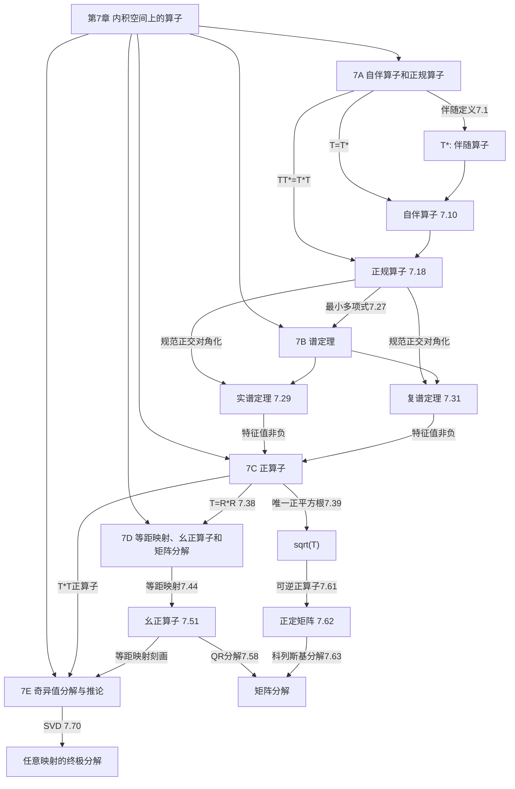
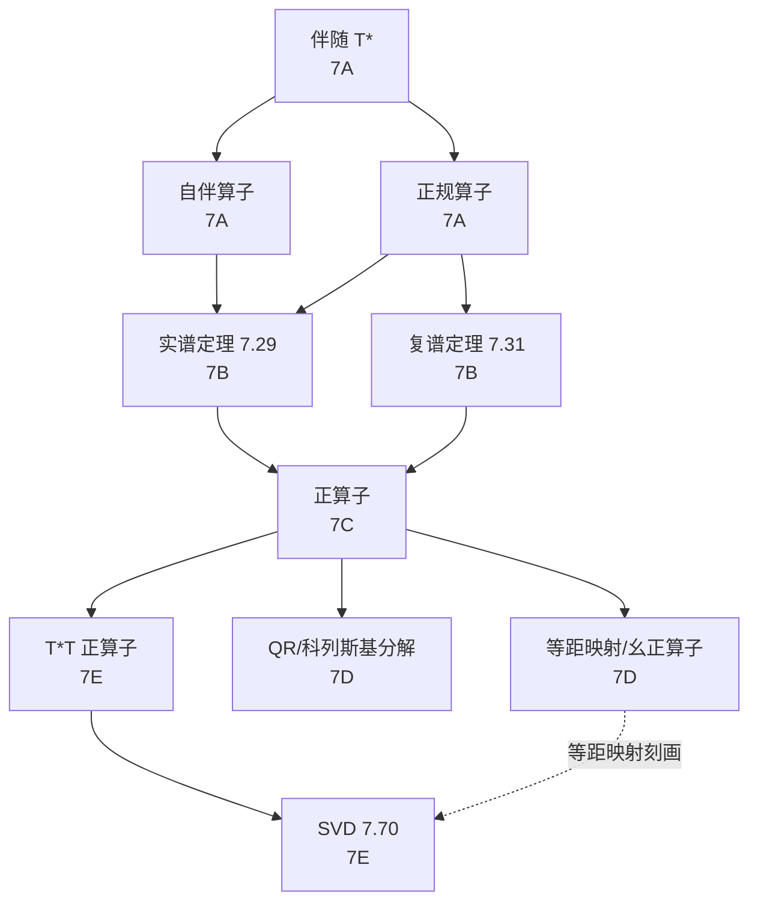

# 第 7 章 内积空间上的算子 — 章节汇总

> [!abstract] 全章概览
> 第 7 章是线性代数的"皇冠"——它将第 6 章建立的内积空间理论与第 5 章的算子理论深度融合，利用内积的几何结构对算子进行精细分类和分解。本章以==伴随算子==为起点，依次建立自伴算子、正规算子的理论，通过==谱定理==实现规范正交对角化，再引入正算子的平方根理论、等距映射与幺正算子，最终以==奇异值分解==（SVD）作为全章乃至全书的高潮。
>
> **逻辑链条**：伴随 $T^*$（7.1）→ 自伴算子 $T=T^*$（7.10）→ 正规算子 $TT^*=T^*T$（7.18）→ 实谱定理（7.29）→ 复谱定理（7.31）→ 正算子与平方根（7.34~7.43）→ 等距映射与幺正算子（7.44~7.57）→ QR分解（7.58）→ 科列斯基分解（7.63）→ ==奇异值分解==（7.70）
>
> **核心主线**：伴随是内积空间中的"对偶"→ 自伴/正规算子是"最好的"算子类 → 谱定理实现规范正交对角化 → 正算子/幺正算子是谱定理的两大应用方向 → SVD 是对任意线性映射的终极分解

---

## 一、全章知识框架思维导图

---

## 二、全章核心知识点与重点公式汇总

### 7.1 自伴算子和正规算子（[[7A 自伴算子和正规算子]]）

| 定理/定义 | 内容 | 编号 |
|:---|:---|:---:|
| ==**伴随**== $T^*$ | $\langle Tv, w\rangle = \langle v, T^*w\rangle$，由里斯表示定理保证存在唯一性 | 7.1 |
| $T^*$ 是线性映射 | $T^*\in\mathcal{L}(W,V)$ | 7.4 |
| 伴随的6条性质 | $(S+T)^*=S^*+T^*$，$(\lambda T)^*=\bar{\lambda}T^*$，$(ST)^*=T^*S^*$，$(T^*)^*=T$，$(I_V)^*=I_V$，$\text{null}\,T^*=(\text{range}\,T)^\perp$ | 7.5-7.6 |
| ==**共轭转置**== $A^*$ | 规范正交基下 $\mathcal{M}(T^*)=\mathcal{M}(T)^*$ | 7.7, 7.9 |
| ==**自伴算子**== | $T=T^*$，类比于"实数" | 7.10 |
| 自伴算子特征值为实 | $\lambda\in\mathbb{R}$（$\mathbb{F}=\mathbb{C}$ 时非平凡） | 7.12 |
| $\langle Tv,v\rangle=0\;\forall v\Rightarrow T=0$ | 复空间极化恒等式（$\mathbb{F}=\mathbb{C}$） | 7.13 |
| $\langle Tv,v\rangle\in\mathbb{R}\;\forall v\Leftrightarrow T$ 自伴 | 复空间判定准则（$\mathbb{F}=\mathbb{C}$） | 7.14 |
| 自伴且 $\langle Tv,v\rangle=0\Rightarrow T=0$ | 实空间版本（需自伴假设） | 7.16 |
| ==**正规算子**== | $TT^*=T^*T$，自伴 $\Rightarrow$ 正规但反之不然 | 7.18 |
| $\|Tv\|=\|T^*v\|\;\forall v\Leftrightarrow T$ 正规 | 范数等价刻画 | 7.20 |
| 正规算子5条性质 | $\text{null}\,T=\text{null}\,T^*$，$\text{range}\,T=\text{range}\,T^*$，$\text{range}\,T=(\text{null}\,T)^\perp$，$T-\lambda I$ 正规，$T,T^*$ 特征向量相同 | 7.21 |
| 正规算子正交特征向量 | 不同特征值对应的特征向量正交 | 7.22 |
| 实部虚部可交换 | $T=A+iB$，$A,B$ 自伴可交换 $\Leftrightarrow T$ 正规（$\mathbb{F}=\mathbb{C}$） | 7.23 |

### 7.2 谱定理（[[7B 谱定理]]）

| 定理/定义 | 内容 | 编号 |
|:---|:---|:---:|
| 可逆二次表达式 | $T$ 自伴，$b^2<4c$ $\Rightarrow$ $T^2+bT+cI$ 可逆 | 7.26 |
| 自伴算子最小多项式 | 仅含实线性因子 $(z-\lambda_1)\cdots(z-\lambda_m)$，$\lambda_j\in\mathbb{R}$ | 7.27 |
| ==**实谱定理**== | $\mathbb{F}=\mathbb{R}$：$T$ 自伴 $\Leftrightarrow$ 存在规范正交基使 $\mathcal{M}(T)$ 为对角矩阵 $\Leftrightarrow$ $V$ 有规范正交的特征向量基 | 7.29 |
| ==**复谱定理**== | $\mathbb{F}=\mathbb{C}$：$T$ 正规 $\Leftrightarrow$ 存在规范正交基使 $\mathcal{M}(T)$ 为对角矩阵 $\Leftrightarrow$ $V$ 有规范正交的特征向量基 | 7.31 |

### 7.3 正算子（[[7C 正算子]]）

| 定理/定义 | 内容 | 编号 |
|:---|:---|:---:|
| ==**正算子**== | $T$ 自伴且 $\langle Tv,v\rangle\geq 0$（$\mathbb{F}=\mathbb{C}$ 时自伴条件可省） | 7.34 |
| 平方根 | $R^2=T$ | 7.36 |
| ==**正算子六个等价刻画**== | (a) 正算子 (b) 自伴且特征值非负 (c) 规范正交基下非负对角矩阵 (d) 有正平方根 (e) 有自伴平方根 (f) $T=R^*R$ | 7.38 |
| ==**唯一正平方根**== | 每个正算子有唯一的正平方根 $\sqrt{T}$ | 7.39 |
| $\sqrt{T}$ 记号 | $T$ 的唯一正平方根记为 $\sqrt{T}$ | 7.40 |
| $\langle Tv,v\rangle=0\Rightarrow Tv=0$ | 正算子的确定性条件 | 7.43 |

### 7.4 等距映射、幺正算子和矩阵分解（[[7D 等距映射、幺正算子和矩阵分解]]）

| 定理/定义 | 内容 | 编号 |
|:---|:---|:---:|
| ==**等距映射**== | $\|Sv\|=\|v\|$ 对所有 $v\in V$ | 7.44 |
| 等距映射5个等价刻画 | (a) 保范数 (b) $S^*S=I$ (c) 保内积 (d) 规范正交基映射到规范正交组 (e) 矩阵列规范正交 | 7.49 |
| ==**幺正算子**== | 可逆的等距映射（$S^{-1}=S^*$） | 7.51 |
| 幺正算子6个等价刻画 | (a) 可逆等距 (b) $S^*S=SS^*=I$ (c) 保内积且可逆 (d) 规范正交基映射到规范正交基 (e) 矩阵列规范正交 (f) 矩阵行规范正交 | 7.53 |
| 幺正算子特征值 | $|\lambda|=1$ | 7.54 |
| 复空间幺正谱描述 | 幺正 $\Leftrightarrow$ 特征值 $|\lambda|=1$ 且有规范正交特征向量基（$\mathbb{F}=\mathbb{C}$） | 7.55 |
| ==**幺正矩阵**== | $A^*A=I$（实空间中即正交矩阵 $Q^TQ=I$） | 7.56, 7.57 |
| ==**QR分解**== | 列线性无关的方阵 $A=QR$，$Q$ 幺正，$R$ 上三角正对角线，且分解唯一 | 7.58 |
| 可逆正算子 | $T$ 可逆正 $\Leftrightarrow$ $\langle Tv,v\rangle>0$（$v\neq 0$） | 7.61 |
| ==**正定矩阵**== | $\langle Bv,v\rangle>0$（$v\neq 0$），即 $B$ 可逆正 | 7.62 |
| ==**科列斯基分解**== | 正定矩阵 $B=R^*R$，$R$ 上三角正对角线，且分解唯一 | 7.63 |

### 7.5 奇异值分解与推论（[[7E 奇异值分解与推论]]）

| 定理/定义 | 内容 | 编号 |
|:---|:---|:---:|
| $T^*T$ 的性质 | (a) 正算子 (b) $\text{null}\,T^*T=\text{null}\,T$ (c) $\text{range}\,T^*T=\text{range}\,T^*$ (d) $\dim\text{range}\,T=\dim\text{range}\,T^*=\dim\text{range}\,T^*T$ | 7.64 |
| ==**奇异值**== | $T^*T$ 的特征值的非负平方根（按重数计） | 7.65 |
| 正奇异值个数 | $=\dim\text{range}\,T=\text{rank}\,T$ | 7.68 |
| 等距映射的奇异值刻画 | 所有奇异值 $=1$ $\Leftrightarrow$ 等距映射 | 7.69 |
| ==**奇异值分解（SVD）**== | $Tv=s_1\langle v,e_1\rangle f_1+\cdots+s_r\langle v,e_r\rangle f_r$，$e_j$ 和 $f_j$ 规范正交，$s_j>0$ | 7.70 |
| 伴随和伪逆的SVD | $T^*v=\sum s_j\langle v,f_j\rangle e_j$；$T^+w=\sum\frac{\langle w,f_j\rangle}{s_j}e_j$ | 7.75 |
| ==**矩阵SVD**== | $A=BDC^*$，$B,C$ 幺正，$D$ 对角（奇异值） | 7.80 |

---

## 三、章节学习脉络梳理

### 3.1 第一层：伴随——内积空间中的"对偶"（7A）

**核心问题**：如何利用内积定义算子的"转置"？

- 伴随 $T^*$ 的定义（7.1）：$\langle Tv,w\rangle=\langle v,T^*w\rangle$，存在性和唯一性由里斯表示定理保证
- 伴随是线性映射（7.4）：$(S+T)^*=S^*+T^*$，$(\lambda T)^*=\bar{\lambda}T^*$
- 伴随的6条代数性质（7.5）：注意 $(ST)^*=T^*S^*$（顺序反转！），以及 $(T^*)^*=T$
- 零空间与值域的对偶关系（7.6）：$\text{null}\,T^*=(\text{range}\,T)^\perp$，$\text{range}\,T^*=(\text{null}\,T)^\perp$
- 共轭转置（7.7, 7.9）：规范正交基下 $\mathcal{M}(T^*)=\mathcal{M}(T)^*$，这是对偶映射 $\mathcal{M}(T')=\mathcal{M}(T)^t$ 在内积空间中的升级版

**关键收获**：伴随是第 3 章对偶映射在内积空间中的"几何化身"——里斯表示定理将 $V'$ 与 $V$ 自然等同，使得 $T':W'\to V'$ 变为 $T^*:W\to V$。伴随的核心作用是"将算子从内积的一侧移到另一侧"。

### 3.2 第二层：自伴算子与正规算子——"最好的"算子类（7A）

**核心问题**：哪些算子拥有最丰富的结构？

- ==自伴算子==（7.10）：$T=T^*$，类比于实数。实空间中矩阵对称，复空间中矩阵厄米
- 自伴算子特征值为实（7.12）：复空间中非平凡，实空间中自动成立
- 极化恒等式技巧（7.13, 7.16）：$\langle Tv,v\rangle=0\;\forall v\Rightarrow T=0$，这是全章最常用的证明工具
- ==正规算子==（7.18）：$TT^*=T^*T$，自伴蕴含正规但反之不然（如旋转矩阵）
- 范数等价刻画（7.20）：$\|Tv\|=\|T^*v\|$ $\Leftrightarrow$ $T$ 正规
- 正规算子5条性质（7.21）：零空间相同、值域相同、$T-\lambda I$ 正规、特征向量相同
- 正交特征向量（7.22）：不同特征值对应的特征向量自动正交——谱定理的基石
- 实部虚部可交换（7.23）：$T=A+iB$，正规性等价于实部虚部可交换

**关键收获**：自伴算子和正规算子是内积空间中"行为最好"的算子类。正规性保证了对角化的可能性，而自伴性进一步保证了特征值为实。这两类算子是谱定理的主角。

### 3.3 第三层：谱定理——全章的核心定理（7B）

**核心问题**：哪些算子可以"完美对角化"（规范正交基下对角化）？

- 引理7.26：自伴算子与可逆二次表达式——配方法在算子层面的推广
- 引理7.27：自伴算子最小多项式仅含实线性因子——排除不可约二次因子的关键
- ==实谱定理==（7.29）：$\mathbb{F}=\mathbb{R}$，$T$ 自伴 $\Leftrightarrow$ 规范正交对角化。证明链：7.27（最小多项式分裂）$\to$ 6.37（上三角化）$\to$ 自伴使上三角=转置 $\to$ 对角矩阵
- ==复谱定理==（7.31）：$\mathbb{F}=\mathbb{C}$，$T$ 正规 $\Leftrightarrow$ 规范正交对角化。证明链：舒尔定理 $\to$ 上三角矩阵 $\to$ 逐行用 $\|Te_j\|=\|T^*e_j\|$ 消去非对角元素
- 统一视角：$T$ 规范正交对角化 $\Leftrightarrow$ $T$ 正规且特征多项式在 $\mathbb{F}$ 上分裂

**关键收获**：谱定理是线性代数中最重要的定理之一，它将算子分解为互相正交的一维不变子空间的直和。实谱定理的证明需要先处理实多项式的不可约二次因子（引理7.26、7.27），而复谱定理的证明更直接（舒尔定理+逐行消去）。

### 3.4 第四层：正算子——"非负实数"的算子类比（7C）

**核心问题**：自伴算子中哪些类比于非负实数？

- 正算子定义（7.34）：$T$ 自伴且 $\langle Tv,v\rangle\geq 0$，复空间中自伴条件可省
- ==六个等价刻画==（7.38）：从定义、特征值、矩阵、平方根、分解等多角度刻画正算子
- ==唯一正平方根==（7.39）：每个正算子有唯一的正平方根 $\sqrt{T}$——本节最重要的结果
- $\langle Tv,v\rangle=0\Rightarrow Tv=0$（7.43）：正算子的确定性条件，证明中反复使用 $\langle R^*Rv,v\rangle=\|Rv\|^2$

**关键收获**：正算子是非负实数在算子世界中的精确类比。六个等价刻画提供了多角度理解，唯一正平方根定理是后续极分解和SVD的理论基础。谱定理的"分而治之"模式（在每个特征空间上操作再拼回来）在此节中得到典型体现。

### 3.5 第五层：等距映射与幺正算子——"保距变换"（7D）

**核心问题**：哪些映射"保持距离"和"保持结构"？

- 等距映射（7.44）：$\|Sv\|=\|v\|$，保持范数（因而保持距离）
- 等距映射5个等价刻画（7.49）：保范数 $\Leftrightarrow$ $S^*S=I$ $\Leftrightarrow$ 保内积 $\Leftrightarrow$ 规范正交基映射到规范正交组
- ==幺正算子==（7.51）：可逆等距映射，$S^{-1}=S^*$
- 幺正算子6个等价刻画（7.53）：在等距映射基础上增加可逆性带来的额外性质
- 特征值模为1（7.54）：幺正算子的特征值在单位圆上
- QR分解（7.58）：格拉姆-施密特的矩阵版本，$A=QR$ 唯一分解
- 正定矩阵与科列斯基分解（7.62, 7.63）：正定矩阵 $B=R^*R$，$R$ 上三角正对角线

**关键收获**：等距映射和幺正算子分别是模为1的复数和单位圆在算子世界中的类比。QR分解是格拉姆-施密特过程的矩阵化身，科列斯基分解是正算子平方根理论与QR分解的组合产物。

### 3.6 第六层：奇异值分解——全章的高潮（7E）

**核心问题**：如何对任意线性映射（不要求方阵、不要求可对角化）进行"终极分解"？

- $T^*T$ 的性质（7.64）：正算子、零空间相同、值域维数相同——SVD理论的基石
- 奇异值定义（7.65）：$T^*T$ 的特征值的非负平方根
- 正奇异值个数 = $\text{rank}\,T$（7.68）
- ==SVD定理==（7.70）：$Tv=\sum s_j\langle v,e_j\rangle f_j$，$e_j,f_j$ 规范正交，$s_j>0$
- 伴随和伪逆的SVD（7.75）：$T^*$ 和 $T^+$ 的SVD形式
- 矩阵SVD（7.80）：$A=BDC^*$，$B,C$ 幺正，$D$ 对角

**关键收获**：SVD 是特征值分解在非方阵和非可对角化情形下的完美推广。其核心洞察是通过 $T^*T$ 将任意映射"自伴随化"为正算子，从而利用谱定理。SVD 的应用遍及数据科学、信号处理、数值线性代数等几乎所有需要矩阵分解的领域。

### 3.7 五节之间的深层联系

#### 3.7.1 谱定理——全章的枢纽

谱定理（7.29 和 7.31）是全章最核心的定理，它串联了几乎所有重要结果：

- 推出正算子的规范正交对角化（7.38(b)$\Rightarrow$(c)），从而构造唯一正平方根（7.39）
- 推出幺正算子的谱描述（7.55），特征值在单位圆上
- 推出 $T^*T$ 的规范正交对角化（7.64(a) 是正算子），从而定义奇异值（7.65）并证明 SVD（7.70）
- QR 分解的存在性依赖格拉姆-施密特过程（6.32），而唯一性依赖幺正矩阵的性质（7.57）

#### 3.7.2 伴随——全章的理论地基

7A 的伴随理论为全章提供了基本语言：

- 自伴算子 $T=T^*$ 和正规算子 $TT^*=T^*T$ 的定义都依赖于伴随
- $\langle Tv,v\rangle=0\Rightarrow T=0$（7.13, 7.16）是全章使用频率最高的证明工具
- $T^*T$ 是正算子（7.64(a)）是 SVD 理论的起点
- 共轭转置 $\mathcal{M}(T^*)=\mathcal{M}(T)^*$（7.9）是所有矩阵形式结果的桥梁

#### 3.7.3 正算子——连接谱定理与SVD的桥梁

7C 的正算子理论起到了承上启下的作用：

- 承上：正算子是自伴算子的子类，其理论直接依赖谱定理
- 启下：$T^*T$ 是正算子（7.64(a)），正算子的谱分解是 SVD 证明的起点
- 唯一正平方根（7.39）是科列斯基分解（7.63）和极分解的理论基础

#### 3.7.4 全章核心线索图

---

## 四、补充理解与跨章展望

### 4.1 第 7 章的核心方法论

第 7 章建立的方法论在后续学习和应用中反复使用：

1. **"自伴随化"策略**：将任意算子 $T$ 转化为自伴算子 $T^*T$，从而利用谱定理。这是 SVD 理论的核心洞察——$T^*T$ 是正算子，其特征值非负，可以用谱定理对角化。这一策略在泛函分析（自伴算子的谱理论）、微分方程（Sturm-Liouville 理论）中广泛使用。

2. **"极化恒等式"技巧**：从 $\langle Tv,v\rangle=0$ 推出 $T=0$，这是全章使用频率最高的证明工具。其本质是将二次型信息转化为双线性型信息。MIT 18.700 讲义中强调这是"内积空间中最基本的恒等式之一"。

3. **"分而治之"模式**：谱定理将算子限制到各个特征空间上，在每个特征空间上做简单操作（取平方根、取函数值），然后通过直和拼回来。这一模式在正算子平方根（7.39）、函数演算、泛函分析中的谱测度理论中反复出现。

4. **"组合已知定理"策略**：科列斯基分解（7.63）的证明组合了正算子平方根（7.38(f)）和 QR 分解（7.58），SVD 的证明组合了谱定理和等距映射理论。这种"站在巨人的肩膀上"的策略是高等数学中构造新结果的典型方法。

**来源**：MIT 18.700 线性代数讲义、UC Berkeley EE 127 讲义、UCSB Math 108B Notes on Spectral Theorem。

### 4.2 第 7 章与前后章节的关联地图

| 第 7 章概念 | 前置章节中的来源 | 后续/应用中的深化 |
|---|---|---|
| 伴随 $T^*$ | 第 3 章：对偶映射 $T'$，$\mathcal{M}(T')=\mathcal{M}(T)^t$ | 泛函分析：无界算子的伴随、自伴扩张 |
| 里斯表示定理 | 第 6 章：规范正交基、线性泛函表示 | 泛函分析：Riesz 表示定理的一般形式 |
| 自伴算子 | 第 5 章：特征值理论 | 量子力学：可观测量由自伴算子表示 |
| 正规算子 | 第 5 章：可对角化算子 | 泛函分析：正规算子的谱分解 |
| 实谱定理 | 第 4 章：实多项式分解（4.16） | 主成分分析（PCA）：协方差矩阵的对角化 |
| 复谱定理 | 第 4 章：代数基本定理（4.13） | 量子力学：可观测量测量值的完备性 |
| 正算子 | 第 6 章：正交投影 $P_U$ | 机器学习：核方法、正定核函数 |
| 唯一正平方根 | 第 3 章：线性映射引理（3.4） | 矩阵分析：矩阵函数 $f(A)$ 的定义 |
| 等距映射 | 第 6 章：格拉姆-施密特（6.32） | 信号处理：正交变换（DFT、DCT） |
| 幺正算子 | 第 6 章：规范正交基 | 量子计算：量子门都是幺正算子 |
| QR 分解 | 第 6 章：格拉姆-施密特过程 | 数值线性代数：QR 算法求特征值 |
| 科列斯基分解 | 第 7 章：正算子平方根 + QR | 数值优化：牛顿法中的 Hessian 分解 |
| SVD | 第 7 章：谱定理 + 等距映射 | 数据科学：推荐系统、图像压缩、降维 |

### 4.3 为什么第 7 章是全书的集大成者？

第 7 章将前 6 章的所有核心工具汇聚在一起：

- **内积空间**（第 6 章）提供了几何框架——内积、范数、正交性、规范正交基
- **算子理论**（第 5 章）提供了代数框架——特征值、特征向量、可对角化性、最小多项式
- **多项式理论**（第 4 章）提供了分析工具——代数基本定理、实多项式分解
- **线性映射**（第 3 章）提供了基本语言——矩阵表示、零空间、值域、对偶
- **向量空间**（第 1-2 章）提供了基础——维数、基、直和

第 7 章的终极成果——==奇异值分解==——是线性代数中"最后的定理"。它不要求方阵、不要求可对角化、不要求特征值存在，适用于任意有限维线性映射。SVD 的广泛应用（从数据科学到量子力学）证明了线性代数作为"数据的语言"的核心地位。

**来源**：MIT 18.700 线性代数讲义、UC Berkeley EE 127 讲义、UCSB Math 108B Notes、Princeton CHM 502 量子力学讲义、Caltech Ph106a Normal Modes 讲义。

---

## 五、全章总复习题

> [!info] 使用说明
> 以下复习题覆盖第 7 章全部五节的核心知识点。建议在不查阅笔记的情况下独立完成，然后对照答案自评。每题标注了考查的节次和知识点。

### A. 伴随与自伴算子（7A）

**A1**. 设 $T\in\mathcal{L}(\mathbb{R}^3)$ 关于标准基的矩阵为 $\begin{pmatrix}1&2&3\\2&5&6\\3&6&7\end{pmatrix}$。判断 $T$ 是否自伴，并说明理由。

查看解答

矩阵 $A=\begin{pmatrix}1&2&3\\2&5&6\\3&6&7\end{pmatrix}$ 满足 $A=A^T$（对称矩阵）。

由定理 7.9，规范正交基（标准基是规范正交基）下 $\mathcal{M}(T^*)=\mathcal{M}(T)^*$。

在实空间中，共轭转置 $A^*=A^T=A$，所以 $\mathcal{M}(T^*)=\mathcal{M}(T)$，即 $T^*=T$。

因此 $T$ 是自伴算子。$\blacksquare$

**A2**. 设 $T\in\mathcal{L}(V)$ 是正规算子，$\lambda\in\mathbb{F}$。证明 $\text{null}(T-\lambda I)=\text{null}(T^*-\bar{\lambda}I)$。

查看解答

由定理 7.21(d)，$T$ 正规 $\Rightarrow$ $T-\lambda I$ 正规。

由定理 7.21(a)，正规算子的零空间等于其伴随的零空间：

$$\text{null}(T-\lambda I)=\text{null}(T-\lambda I)^*$$

由 7.5(b) 和 7.5(c)：$(T-\lambda I)^*=T^*-\bar{\lambda}I$。

因此 $\text{null}(T-\lambda I)=\text{null}(T^*-\bar{\lambda}I)$。$\blacksquare$

### B. 谱定理（7B）

**B1**. 设 $T\in\mathcal{L}(\mathbb{R}^3)$ 是自伴算子，其特征值为 $2,3,5$。求 $T$ 关于某个规范正交基的矩阵。

查看解答

由实谱定理（7.29），$T$ 关于某个规范正交基的矩阵为对角矩阵。

设 $e_1,e_2,e_3$ 是对应的规范正交特征向量（$Te_j=\lambda_j e_j$），则

$$\mathcal{M}(T,(e_1,e_2,e_3))=\begin{pmatrix}2&0&0\\0&3&0\\0&0&5\end{pmatrix}$$

注意：规范正交基的具体选取不唯一（特征空间内可以旋转），但对角矩阵的形式唯一（特征值的排列顺序可以不同）。$\blacksquare$

**B2**. 设 $T\in\mathcal{L}(\mathbb{C}^2)$ 满足 $T^*T=TT^*$ 且 $\dim\text{null}\,T=0$。证明 $T$ 可逆，并描述 $T$ 关于某个规范正交基的矩阵。

查看解答

$T$ 正规（$T^*T=TT^*$），$\dim\text{null}\,T=0$。

由复谱定理（7.31），$V=\mathbb{C}^2$ 存在由 $T$ 的特征向量构成的规范正交基 $e_1,e_2$。

设 $Te_1=\lambda_1 e_1$，$Te_2=\lambda_2 e_2$。因为 $\text{null}\,T=\{0\}$，所以 $\lambda_1\neq 0$ 且 $\lambda_2\neq 0$。

$$\mathcal{M}(T,(e_1,e_2))=\begin{pmatrix}\lambda_1&0\\0&\lambda_2\end{pmatrix}$$

$\lambda_1,\lambda_2\neq 0$，故矩阵可逆，$T$ 可逆。$\blacksquare$

### C. 正算子（7C）

**C1**. 设 $T$ 是正算子。证明 $T$ 和 $-T$ 都正当且仅当 $T=0$。

查看解答

**($\Leftarrow$)**：$T=0$ 时，$T$ 和 $-T$ 都是零算子，显然都是正算子。

**($\Rightarrow$)**：$T$ 正 $\Rightarrow$ $\langle Tv,v\rangle\geq 0$；$-T$ 正 $\Rightarrow$ $\langle -Tv,v\rangle\geq 0$，即 $\langle Tv,v\rangle\leq 0$。

两者结合得 $\langle Tv,v\rangle=0$ 对所有 $v\in V$ 成立。

由定理 7.43，$Tv=0$ 对所有 $v$，即 $T=0$。$\blacksquare$

**C2**. 设 $T\in\mathcal{L}(V)$ 是正算子，$S\in\mathcal{L}(V,W)$。证明 $S^*TS$ 是 $W$ 上的正算子。

查看解答

$T$ 正，由定理 7.38(f)，存在 $R\in\mathcal{L}(V)$ 使得 $T=R^*R$（可取 $R=\sqrt{T}$）。

则 $S^*TS=S^*R^*RS=(RS)^*(RS)$。

由 7.38(f)$\Rightarrow$(a)，$(RS)^*(RS)$ 是 $W$ 上的正算子。

因此 $S^*TS$ 是正算子。$\blacksquare$

### D. 等距映射与幺正算子（7D）

**D1**. 设 $S\in\mathcal{L}(V)$ 是等距映射。证明 $S$ 是幺正算子当且仅当 $S$ 可逆。

查看解答

**($\Rightarrow$)**：幺正算子定义（7.51）即为可逆的等距映射，故 $S$ 可逆。

**($\Leftarrow$)**：$S$ 是等距映射，由定理 7.49(b)，$S^*S=I$。$S$ 可逆，故 $S^*=S^*I=S^*(SS^{-1})=(S^*S)S^{-1}=IS^{-1}=S^{-1}$。因此 $SS^*=I$，$S$ 是幺正算子。$\blacksquare$

**D2**. 对矩阵 $A=\begin{pmatrix}1&1\\1&0\end{pmatrix}$ 进行 QR 分解。

查看解答

$A$ 的列：$v_1=(1,1)^T$，$v_2=(1,0)^T$。

**格拉姆-施密特**：
- $e_1=\frac{v_1}{\|v_1\|}=\frac{1}{\sqrt{2}}(1,1)^T$
- $\langle v_2,e_1\rangle=\frac{1}{\sqrt{2}}$，$v_2-\langle v_2,e_1\rangle e_1=(1,0)^T-\frac{1}{2}(1,1)^T=(\frac{1}{2},-\frac{1}{2})^T$
- $e_2=\frac{(\frac{1}{2},-\frac{1}{2})^T}{\|(\frac{1}{2},-\frac{1}{2})^T\|}=\frac{1}{\sqrt{2}}(1,-1)^T$

$$Q=\begin{pmatrix}\frac{1}{\sqrt{2}}&\frac{1}{\sqrt{2}}\\\frac{1}{\sqrt{2}}&-\frac{1}{\sqrt{2}}\end{pmatrix},\quad R=\begin{pmatrix}\sqrt{2}&\frac{1}{\sqrt{2}}\\0&\frac{1}{\sqrt{2}}\end{pmatrix}$$

验证 $R$ 上三角正对角线，$A=QR$。$\blacksquare$

### E. 奇异值分解（7E）

**E1**. 设 $T\in\mathcal{L}(\mathbb{F}^3,\mathbb{F}^2)$，$T(x_1,x_2,x_3)=(x_1+x_2,x_2+x_3)$。求 $T$ 的奇异值。

查看解答

关于标准基：$\mathcal{M}(T)=\begin{pmatrix}1&1&0\\0&1&1\end{pmatrix}$。

$\mathcal{M}(T^*)=\mathcal{M}(T)^*=\begin{pmatrix}1&0\\1&1\\0&1\end{pmatrix}$（实空间中 $A^*=A^T$）。

$T^*T$ 的矩阵：$\begin{pmatrix}1&0\\1&1\\0&1\end{pmatrix}\begin{pmatrix}1&1&0\\0&1&1\end{pmatrix}=\begin{pmatrix}1&1&0\\1&2&1\\0&1&1\end{pmatrix}$。

$T^*T$ 的特征值：$\det(T^*T-\lambda I)=\det\begin{pmatrix}1-\lambda&1&0\\1&2-\lambda&1\\0&1&1-\lambda\end{pmatrix}$

$=(1-\lambda)[(2-\lambda)(1-\lambda)-1]-1\cdot[(1-\lambda)-0]$

$=(1-\lambda)(\lambda^2-3\lambda+1)-(1-\lambda)=(1-\lambda)(\lambda^2-3\lambda)=(1-\lambda)\lambda(\lambda-3)$

特征值：$\lambda_1=3$，$\lambda_2=1$，$\lambda_3=0$。

奇异值：$s_1=\sqrt{3}$，$s_2=\sqrt{1}=1$，$s_3=\sqrt{0}=0$。

正奇异值：$\sqrt{3}$ 和 $1$。$\blacksquare$

**E2**. 设 $T\in\mathcal{L}(V)$ 是正规算子。证明 $T$ 的奇异值等于 $T$ 的特征值的绝对值。

查看解答

$T$ 正规，由复谱定理（7.31），$V$ 存在规范正交基 $e_1,\ldots,e_n$ 使得 $Te_j=\lambda_j e_j$。

$T^*e_j=\bar{\lambda}_j e_j$（由 7.21(e)）。

$T^*Te_j=T^*(\lambda_j e_j)=\lambda_j T^*e_j=\lambda_j\bar{\lambda}_j e_j=|\lambda_j|^2 e_j$。

所以 $T^*T$ 的特征值为 $|\lambda_1|^2,\ldots,|\lambda_n|^2$。

$T$ 的奇异值为 $\sqrt{|\lambda_1|^2},\ldots,\sqrt{|\lambda_n|^2}=|\lambda_1|,\ldots,|\lambda_n|$。$\blacksquare$

### F. 跨节综合题

**F1**. 设 $T\in\mathcal{L}(V)$ 满足 $T^*=-T$（反自伴算子）。证明 $T$ 的特征值都是纯虚数或零。

查看解答

设 $\lambda$ 是 $T$ 的特征值，$v$ 是对应的特征向量（$v\neq 0$）。

$Tv=\lambda v$，取伴随得 $v^*T^*=\bar{\lambda}v^*$。

$T^*=-T$，所以 $-v^*T=\bar{\lambda}v^*$，即 $\langle Tu,v\rangle=-\bar{\lambda}\langle u,v\rangle$。

取 $u=v$：$\langle Tv,v\rangle=\lambda\|v\|^2$。

另一方面，$\langle Tv,v\rangle=\langle v,T^*v\rangle=\langle v,-Tv\rangle=-\langle v,\lambda v\rangle=-\bar{\lambda}\|v\|^2$。

所以 $\lambda\|v\|^2=-\bar{\lambda}\|v\|^2$，即 $\lambda=-\bar{\lambda}$，$\lambda+\bar{\lambda}=0$。

因此 $2\operatorname{Re}(\lambda)=0$，$\operatorname{Re}(\lambda)=0$，$\lambda$ 是纯虚数或零。$\blacksquare$

**F2**. 设 $T\in\mathcal{L}(V)$ 是可逆算子。证明存在幺正算子 $S$ 和正算子 $P$ 使得 $T=SP$（极分解）。

查看解答

**构造**：令 $P=\sqrt{T^*T}$（$T^*T$ 是正算子，由 7.64(a)；$\sqrt{T^*T}$ 由 7.39 定义）。

$P$ 是正算子（7.39 保证 $\sqrt{T^*T}$ 是正算子）。

定义 $S:V\to V$，$Sv=Pv\mapsto Tv$，即 $S(Tv)=Tv$ 对值域中的向量成立。

更精确地：对 $v\in V$，令 $S(Pv)=Tv$。

**$S$ 是等距映射**：$\|S(Pv)\|^2=\|Tv\|^2=\langle Tv,Tv\rangle=\langle v,T^*Tv\rangle=\langle v,P^2v\rangle=\langle Pv,Pv\rangle=\|Pv\|^2$。

**$S$ 可逆**：$T$ 可逆 $\Rightarrow$ $T^*T$ 可逆 $\Rightarrow$ $P$ 可逆 $\Rightarrow$ $S$ 可逆。

因此 $S$ 是幺正算子（可逆的等距映射），$T=SP$。$\blacksquare$

---

## 六、各节笔记索引

| 节 | 笔记链接 | 核心主题 |
|:---:|:---|:---|
| 7A | [[7A 自伴算子和正规算子]] | ==伴随== $T^*$、==自伴算子==、==正规算子==、特征值为实、正交特征向量 |
| 7B | [[7B 谱定理]] | ==实谱定理==（7.29）、==复谱定理==（7.31）、规范正交对角化 |
| 7C | [[7C 正算子]] | ==正算子==、==六个等价刻画==（7.38）、==唯一正平方根==（7.39） |
| 7D | [[7D 等距映射、幺正算子和矩阵分解]] | ==等距映射==、==幺正算子==、==QR分解==（7.58）、==科列斯基分解==（7.63） |
| 7E | [[7E 奇异值分解与推论]] | ==奇异值==、==奇异值分解==（7.70）、矩阵SVD（7.80） |

---

## 七、全章核心公式

> [!success] 必须熟记的公式与定理

1. ==**伴随的定义**==（定义 7.1）：$\langle Tv, w\rangle = \langle v, T^*w\rangle$
2. **伴随的代数性质**（命题 7.5）：$(S+T)^*=S^*+T^*$，$(\lambda T)^*=\bar{\lambda}T^*$，$(ST)^*=T^*S^*$，$(T^*)^*=T$
3. **零空间与值域的对偶**（命题 7.6）：$\text{null}\,T^*=(\text{range}\,T)^\perp$，$\text{range}\,T^*=(\text{null}\,T)^\perp$
4. **共轭转置**（定理 7.9）：$\mathcal{M}(T^*)=\mathcal{M}(T)^*$（规范正交基下）
5. ==**自伴算子特征值为实**==（定理 7.12）：$\lambda\in\mathbb{R}$
6. ==**$\langle Tv,v\rangle=0\;\forall v\Rightarrow T=0$**==（定理 7.13/7.16）：全章最常用的证明工具
7. ==**正规算子正交特征向量**==（定理 7.22）：不同特征值对应的特征向量正交
8. ==**实谱定理**==（定理 7.29）：$T$ 自伴 $\Leftrightarrow$ 规范正交基下对角矩阵（$\mathbb{F}=\mathbb{R}$）
9. ==**复谱定理**==（定理 7.31）：$T$ 正规 $\Leftrightarrow$ 规范正交基下对角矩阵（$\mathbb{F}=\mathbb{C}$）
10. ==**正算子六个等价刻画**==（定理 7.38）：正算子 $\Leftrightarrow$ 特征值非负 $\Leftrightarrow$ 有正平方根 $\Leftrightarrow$ $T=R^*R$
11. ==**唯一正平方根**==（定理 7.39）：$\sqrt{T}$ 唯一存在
12. ==**等距映射刻画**==（定理 7.49）：$\|Sv\|=\|v\|$ $\Leftrightarrow$ $S^*S=I$ $\Leftrightarrow$ 保内积
13. ==**幺正算子刻画**==（定理 7.53）：可逆等距 $\Leftrightarrow$ $S^*S=SS^*=I$ $\Leftrightarrow$ $S^{-1}=S^*$
14. ==**QR分解**==（定理 7.58）：$A=QR$，$Q$ 幺正，$R$ 上三角正对角线，唯一
15. ==**科列斯基分解**==（定理 7.63）：正定 $B=R^*R$，$R$ 上三角正对角线，唯一
16. ==**SVD**==（定理 7.70）：$Tv=\sum_{j=1}^r s_j\langle v,e_j\rangle f_j$，$s_j>0$，$e_j,f_j$ 规范正交
17. **矩阵SVD**（定理 7.80）：$A=BDC^*$，$B,C$ 幺正，$D$ 对角

> [!warning] 易错提醒
> - 伴随 $(ST)^*=T^*S^*$，==顺序反转==（与对偶映射 $(ST)'=T'S'$ 一致）
> - $(\lambda T)^*=\bar{\lambda}T^*$，标量取==共轭==（不是 $\lambda T^*$）
> - 定理 7.13（$\langle Tv,v\rangle=0\Rightarrow T=0$）只在==复空间==成立；实空间需要自伴假设（7.16）
> - 定理 7.14（$\langle Tv,v\rangle\in\mathbb{R}\Leftrightarrow T$ 自伴）只在==复空间==成立
> - 自伴蕴含正规，但正规不蕴含自伴（如旋转矩阵）
> - 实谱定理需要"自伴"条件（不是"正规"），因为实空间中正规算子可能没有实特征值
> - 正算子对应==非负==实数，不是正实数；可逆正算子（正定矩阵）才对应正实数
> - $\sqrt{T}$ 是==唯一的正平方根==，但正算子可以有无穷多个非正平方根
> - QR 分解要求==方阵且列线性无关==（教材版本），长方形矩阵有推广版本
> - 奇异值 $\geq 0$（非负平方根），不可能为负
> - SVD 中的 $e_j$ 是 $T^*T$ 的特征向量，$f_j$ 是 $TT^*$ 的特征向量，两者通过 $f_j=Te_j/s_j$ 关联

#学习/线性代数/内积空间上的算子
