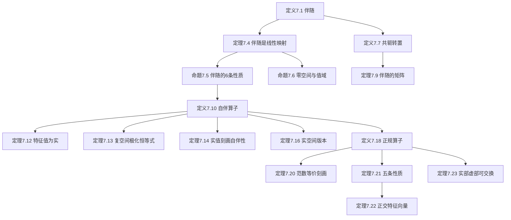

# 7A 自伴算子和正规算子

> [!abstract] 本节概览
> 本节是第7章"内积空间上的算子"的开篇，在[[6A 内积和范数]]和[[6B 规范正交基]]的基础上，引入了==伴随==（adjoint）这一核心概念，并由此定义==自伴算子==和==正规算子==两类最重要的算子。逻辑链条如下：
>
> 1. **定义7.1：伴随** $\to$ 由里斯表示定理保证存在唯一性，$\langle Tv, w\rangle = \langle v, T^*w\rangle$
> 2. **定理7.4 + 命题7.5：伴随的基本性质** $\to$ 线性性、6条代数运算规则
> 3. **命题7.6：零空间与值域** $\to$ $\text{null}\, T^* = (\text{range}\, T)^\perp$ 等4条对偶关系
> 4. **定义7.7 + 定理7.9：共轭转置** $\to$ 规范正交基下 $M(T^*) = M(T)^*$
> 5. **定义7.10：自伴算子** $\to$ $T = T^*$，类比于"实数"
> 6. **定理7.12~7.16：自伴算子的性质** $\to$ 特征值为实、$\langle Tv,v\rangle$ 的刻画
> 7. **定义7.18：正规算子** $\to$ $TT^* = T^*T$，自伴 $\Rightarrow$ 正规但反之不然
> 8. **定理7.20~7.23：正规算子的刻画** $\to$ 范数等价、正交特征向量、实部虚部分解
>
> **核心主线**：伴随的定义与性质 $\to$ 自伴算子（实数类比、特征值为实）$\to$ 正规算子（更一般的类、正交特征向量、谱定理的基石）。
>
> **前置依赖**：[[6A 内积和范数]]（内积、范数、柯西-施瓦兹不等式）、[[6B 规范正交基]]（规范正交基、里斯表示定理）、[[6C 正交补和正交投影]]（正交补、正交投影）、[[3F 对偶]]（对偶空间、对偶映射）、[[5D 可对角化算子]]（特征值、特征向量）。

---

## 一、伴随的定义与基本性质

### 伴随的动机

在[[6B 规范正交基]]中，我们学习了里斯表示定理：对于有限维内积空间 $V$ 上的每一个线性泛函 $\varphi$，都存在唯一的向量 $u \in V$ 使得 $\varphi(v) = \langle v, u\rangle$ 对所有 $v \in V$ 成立。现在，给定一个线性映射 $T \in \mathcal{L}(V, W)$ 和一个固定的 $w \in W$，考虑 $V$ 上的线性泛函

$$v \mapsto \langle Tv, w\rangle$$

这个线性泛函依赖于 $T$ 和 $w$。根据里斯表示定理，$V$ 中存在唯一的向量使得该线性泛函由与它的内积给出。我们称这唯一的向量为 $T^*w$。

### 定义与基本计算

> [!def] 定义7.1：伴随（adjoint）、$T^*$
> 设 $T \in \mathcal{L}(V, W)$。$T$ 的**伴随**是使得对任一 $v \in V$ 和任一 $w \in W$ 都有
> $$\langle Tv, w\rangle = \langle v, T^*w\rangle$$
> 的函数 $T^* : W \to V$。

**注意**：上式中左侧的内积是在 $W$ 上的，右侧的内积是在 $V$ 上的。不过，我们对这两种内积用相同的记号 $\langle \cdot, \cdot \rangle$。

> [!tip] 计算伴随的常用方法
> 从 $\langle Tv, w\rangle$ 的表达式开始，然后处理一番，使得 $\langle \cdot, \cdot \rangle$ 的前一个位置里只有 $v$，那么后一个位置里就是 $T^*w$ 了。

> [!example] 例7.2：从 $\mathbb{R}^3$ 到 $\mathbb{R}^2$ 的一线性映射之伴随
> 定义 $T : \mathbb{R}^3 \to \mathbb{R}^2$ 为
> $$T(x_1, x_2, x_3) = (x_1 + 3x_3,\, 2x_2)$$
> 为了计算 $T^*$，设 $(x_1, x_2, x_3) \in \mathbb{R}^3$ 和 $(y_1, y_2) \in \mathbb{R}^2$。从而有
> $$\langle T(x_1,x_2,x_3),\, (y_1,y_2)\rangle = \langle (x_1+3x_3,\, 2x_2),\, (y_1,y_2)\rangle$$
> $$= x_2 y_1 + 3x_3 y_1 + 2x_1 y_2$$
> $$= \langle (x_1, x_2, x_3),\, (2y_2,\, y_1,\, 3y_1)\rangle$$
> 根据上式以及伴随的定义可得
> $$T^*(y_1, y_2) = (2y_2,\, y_1,\, 3y_1)$$

> [!example] 例7.3：值域维数至多为 1 的一线性映射之伴随
> 取定 $u \in V$ 和 $x \in W$。定义 $T \in \mathcal{L}(V, W)$ 为：对任一 $v \in V$ 都有 $Tv = \langle v, u\rangle x$。
>
> 为了计算 $T^*$，设 $v \in V$ 和 $w \in W$。从而有
> $$\langle Tv, w\rangle = \langle \langle v, u\rangle x,\, w\rangle = \langle v, u\rangle\langle x, w\rangle = \langle v,\, \langle w, x\rangle u\rangle$$
> 因此，
> $$T^*w = \langle w, x\rangle u$$

### 伴随是线性映射

> [!thm] 定理7.4：线性映射的伴随是线性映射
> 如果 $T \in \mathcal{L}(V, W)$，那么 $T^* \in \mathcal{L}(W, V)$。

> [!abstract] 证明思路
> **[可加性]**：设 $v \in V$ 且 $w_1, w_2 \in W$，那么
> $$\langle Tv,\, w_1 + w_2\rangle = \langle Tv, w_1\rangle + \langle Tv, w_2\rangle = \langle v, T^*w_1\rangle + \langle v, T^*w_2\rangle = \langle v,\, T^*w_1 + T^*w_2\rangle$$
> 上式表明 $T^*(w_1 + w_2) = T^*w_1 + T^*w_2$。
>
> **[齐次性]**：如果 $v \in V$、$\lambda \in \mathbb{F}$ 且 $w \in W$，那么
> $$\langle Tv, \lambda w\rangle = \bar{\lambda}\langle Tv, w\rangle = \bar{\lambda}\langle v, T^*w\rangle = \langle v,\, \lambda T^*w\rangle$$
> 上式表明 $T^*(\lambda w) = \lambda T^*w$。
>
> 因此，$T^*$ 是线性映射。$\blacksquare$

### 伴随的代数性质

> [!thm] 命题7.5：伴随的性质
> 设 $T \in \mathcal{L}(V, W)$，那么有：
> - **(a)** $(S + T)^* = S^* + T^*$ 对所有 $S \in \mathcal{L}(V, W)$ 成立；
> - **(b)** $(\lambda T)^* = \bar{\lambda}\, T^*$ 对所有 $\lambda \in \mathbb{F}$ 成立；
> - **(c)** $(T^*)^* = T$；
> - **(d)** $(ST)^* = T^* S^*$ 对所有 $S \in \mathcal{L}(W, U)$ 成立（这里 $U$ 是 $\mathbb{F}$ 上的有限维内积空间）；
> - **(e)** $I^* = I$，其中 $I$ 是 $V$ 上的恒等算子；
> - **(f)** 如果 $T$ 可逆，那么 $T^*$ 可逆且 $(T^*)^{-1} = (T^{-1})^*$。

> [!abstract] 证明思路
> 设 $v \in V$ 且 $w \in W$。
>
> **[(a) 和的伴随]**：如果 $S \in \mathcal{L}(V, W)$，那么
> $$\langle (S+T)v,\, w\rangle = \langle Sv, w\rangle + \langle Tv, w\rangle = \langle v, S^*w\rangle + \langle v, T^*w\rangle = \langle v,\, S^*w + T^*w\rangle$$
> 因此 $(S+T)^*w = S^*w + T^*w$。
>
> **[(b) 标量乘法的伴随]**：如果 $\lambda \in \mathbb{F}$，那么
> $$\langle (\lambda T)v,\, w\rangle = \lambda\langle Tv, w\rangle = \lambda\langle v, T^*w\rangle = \langle v,\, \bar{\lambda}\, T^*w\rangle$$
> 因此 $(\lambda T)^*w = \bar{\lambda}\, T^*w$。
>
> **[(c) 双重伴随]**：因为
> $$\langle T^*w, v\rangle = \overline{\langle v, T^*w\rangle} = \overline{\langle Tv, w\rangle} = \langle w, Tv\rangle$$
> 所以 $(T^*)^*v = Tv$。
>
> **[(d) 复合的伴随]**：设 $S \in \mathcal{L}(W, U)$ 和 $u \in U$，从而有
> $$\langle (ST)v,\, u\rangle = \langle S(Tv),\, u\rangle = \langle Tv,\, S^*u\rangle = \langle v,\, T^*(S^*u)\rangle$$
> 因此 $(ST)^*u = T^*(S^*u)$。
>
> **[(e) 恒等算子的伴随]**：设 $u \in V$。从而有 $\langle Iu, v\rangle = \langle u, v\rangle$。因此 $I^*v = v$。
>
> **[(f) 逆的伴随]**：设 $T$ 可逆。对等式 $T^{-1}T = I$ 两边取伴随，然后用 (d) 和 (e) 证得 $T^*(T^{-1})^* = I$。类似地，由 $TT^{-1} = I$ 可得 $(T^{-1})^* T^* = I$。因此，$(T^{-1})^*$ 是 $T^*$ 的逆。$\blacksquare$

> [!important] 实数域与复数域的差异
> 如果 $\mathbb{F} = \mathbb{R}$，那么根据 (a) 和 (b)，$T \mapsto T^*$ 这一映射是从 $\mathcal{L}(V, W)$ 到 $\mathcal{L}(W, V)$ 的线性映射。然而，如果 $\mathbb{F} = \mathbb{C}$，那么该映射==不是==线性的，这是由于 (b) 中出现的复共轭。

### 伴随的零空间与值域

> [!thm] 命题7.6：$T^*$ 的零空间和值域
> 设 $T \in \mathcal{L}(V, W)$，那么有：
> - **(a)** $\text{null}\, T^* = (\text{range}\, T)^\perp$；
> - **(b)** $\text{range}\, T^* = (\text{null}\, T)^\perp$；
> - **(c)** $\text{null}\, T = (\text{range}\, T^*)^\perp$；
> - **(d)** $\text{range}\, T = (\text{null}\, T^*)^\perp$。

> [!abstract] 证明思路
> **[(a) 的证明]**：令 $w \in W$，从而有
> $$w \in \text{null}\, T^* \iff T^*w = 0 \iff \langle v, T^*w\rangle = 0\;\text{对所有}\; v \in V\;\text{成立}$$
> $$\iff \langle Tv, w\rangle = 0\;\text{对所有}\; v \in V\;\text{成立} \iff w \in (\text{range}\, T)^\perp$$
>
> **[(b)(c)(d) 的推导]**：
> - 对 (a) 的两侧求正交补，利用 [[6C 正交补和正交投影]] 的正交补性质，就得到了 (d)。
> - 在 (a) 中将 $T$ 替换成 $T^*$，利用 7.5(c) $(T^*)^* = T$，就得到了 (c)。
> - 在 (d) 中将 $T$ 替换成 $T^*$，就得到了 (b)。$\blacksquare$

### 共轭转置

> [!def] 定义7.7：共轭转置（conjugate transpose）、$A^*$
> $m \times n$ 矩阵 $A$ 的**共轭转置**是将其行列互换再对每个元素取复共轭得到的 $n \times m$ 矩阵 $A^*$。换句话说，如果 $j \in \{1, \ldots, n\}$ 且 $k \in \{1, \ldots, m\}$，那么有
> $$(A^*)_{j,k} = \overline{A_{k,j}}$$

> [!note] 实矩阵的共轭转置
> 若矩阵 $A$ 只含有实元素，则 $A^* = A^t$，其中 $A^t$ 表示 $A$ 的转置（行列互换得到的矩阵）。

> [!example] 例7.8：一个 $2 \times 3$ 矩阵的共轭转置
> $2 \times 3$ 矩阵 $\begin{pmatrix} 2 & 3+4i & 7 \\ 6 & 5 & 8i \end{pmatrix}$ 的共轭转置是 $3 \times 2$ 矩阵 $\begin{pmatrix} 2 & 6 \\ 3-4i & 5 \\ 7 & -8i \end{pmatrix}$。

### 伴随的矩阵

> [!thm] 定理7.9：$M(T^*) = M(T)^*$
> 令 $T \in \mathcal{L}(V, W)$。设 $e_1, \ldots, e_n$ 是 $V$ 的规范正交基，$f_1, \ldots, f_m$ 是 $W$ 的规范正交基。那么 $M\bigl(T^*,\, (f_1, \ldots, f_m),\, (e_1, \ldots, e_n)\bigr)$ 是 $M\bigl(T,\, (e_1, \ldots, e_n),\, (f_1, \ldots, f_m)\bigr)$ 的共轭转置。换句话说，
> $$M(T^*) = M(T)^*$$

> [!abstract] 证明思路
> **[规范正交基下矩阵元素等于内积]**：
> 回顾 $M(T)$ 的第 $k$ 列，是通过把 $Te_k$ 写成各 $f_j$ 的线性组合得到的。因为 $f_1, \ldots, f_m$ 是 $W$ 的规范正交基，所以
> $$Te_k = \langle Te_k, f_1\rangle f_1 + \cdots + \langle Te_k, f_m\rangle f_m$$
> 因此 $M(T)$ 的 $j$ 行 $k$ 列元素是 $\langle Te_k, f_j\rangle$。
>
> **[计算 $M(T^*)$ 的元素]**：将上式中 $T$ 替换成 $T^*$，并互换 $e_1, \ldots, e_n$ 和 $f_1, \ldots, f_m$，就证得 $M(T^*)$ 的 $j$ 行 $k$ 列元素为 $\langle T^*f_k, e_j\rangle$。这等于 $\langle f_k, Te_j\rangle$，进而等于 $\overline{\langle Te_j, f_k\rangle}$，而这就等于 $M(T)$ 的 $k$ 行 $j$ 列元素的复共轭。因此 $M(T^*) = M(T)^*$。$\blacksquare$

> [!warning] 伴随不依赖于基的选取
> 线性映射的伴随不依赖于基的选取。因此我们经常强调的是线性映射的伴随，而不是矩阵的转置或共轭转置。==关于非规范正交基，$T^*$ 的矩阵不一定等于 $T$ 的矩阵的共轭转置==（见习题14）。

> [!note] 伴随与对偶映射的关系
> 里斯表示定理（6.58）指出了 $V$ 和其对偶空间 $V'$（在3.110中定义）的等同关系。在这一等同关系下，伴随映射 $T^* : W \to V$ 对应于[[3F 对偶]]中的对偶映射 $T' : W' \to V'$。在这一等同关系下，$\text{null}\, T^*$ 和 $\text{range}\, T^*$ 的公式（7.6(a) 和 (b)）就跟 $\text{null}\, T'$ 和 $\text{range}\, T'$ 的公式（3.128(a) 和 3.130(b)）完全一致。

---

## 二、自伴算子

### 自伴的定义

现在我们把注意力转向内积空间上的算子（从 $V$ 到 $V$ 的线性映射）。

> [!def] 定义7.10：自伴（self-adjoint）
> 算子 $T \in \mathcal{L}(V)$ 称为**自伴的**，如果 $T = T^*$。

> [!note] 矩阵判别法
> 若 $T \in \mathcal{L}(V)$ 且 $e_1, \ldots, e_n$ 是 $V$ 的规范正交基，则 $T$ 是自伴的当且仅当 $M(T) = M(T)^*$。这是由定理7.9推得的。

> [!tip] 自伴算子 = 实数的类比
> $\mathcal{L}(V)$ 上的伴随扮演了类似于 $\mathbb{C}$ 上的复共轭的角色。复数 $z$ 是实的当且仅当 $z = \bar{z}$；==自伴算子（$T = T^*$）就类似于实数==。

> [!note] 自伴的等价刻画
> 算子 $T \in \mathcal{L}(V)$ 自伴，当且仅当 $\langle Tv, w\rangle = \langle v, Tw\rangle$ 对所有 $v, w \in V$ 成立。

> [!example] 例7.11：根据 $T$ 的矩阵确定其是否自伴
> 设 $c \in \mathbb{F}$ 且 $T$ 是 $\mathbb{F}^2$ 上的算子，其关于标准基的矩阵是
> $$M(T) = \begin{pmatrix} 2 & c \\ 3 & 7 \end{pmatrix}$$
> $T^*$ 关于标准基的矩阵是
> $$M(T^*) = \begin{pmatrix} 2 & 3 \\ \bar{c} & 7 \end{pmatrix}$$
> 因此 $M(T) = M(T^*)$ 当且仅当 $c = 3$。于是，算子 $T$ 自伴当且仅当 $c = 3$。

### 特征值为实

> [!thm] 定理7.12：自伴算子的特征值
> 自伴算子的每个特征值都是**实的**。

> [!abstract] 证明思路
> **[利用自伴性推导特征值的共轭等于自身]**：
> 设 $T$ 是 $V$ 上的自伴算子。令 $\lambda$ 是 $T$ 的特征值，再令 $v$ 是 $V$ 中使得 $Tv = \lambda v$ 的非零向量。那么有
> $$\lambda\|v\|^2 = \langle \lambda v, v\rangle = \langle Tv, v\rangle = \langle v, Tv\rangle = \langle v, \lambda v\rangle = \bar{\lambda}\|v\|^2$$
> 因此 $\lambda = \bar{\lambda}$，意即 $\lambda$ 是实的。$\blacksquare$

> [!note] 实数域情形
> 如果 $\mathbb{F} = \mathbb{R}$，那么根据定义每个特征值都是实的。所以定理7.12只在 $\mathbb{F} = \mathbb{C}$ 的情形下引人兴趣。

### 复空间中 $\langle Tv, v\rangle = 0 \Longrightarrow T = 0$

> [!thm] 定理7.13：$\langle Tv, v\rangle = 0\;\forall v \Longrightarrow T = 0$（$\mathbb{F} = \mathbb{C}$）
> 设 $V$ 是复内积空间以及 $T \in \mathcal{L}(V)$，那么
> $$\langle Tv, v\rangle = 0\;\text{对任一}\; v \in V\;\text{都成立} \iff T = 0$$

> [!abstract] 证明思路
> **[极化恒等式]**：如果 $u, w \in V$，那么有
> $$\langle Tu, w\rangle = \frac{\langle T(u+w),\, u+w\rangle - \langle T(u-w),\, u-w\rangle}{4} + \frac{i\langle T(u+iw),\, u+iw\rangle - i\langle T(u-iw),\, u-iw\rangle}{4}$$
> 这可以通过直接展开右侧来验证。注意到，右侧的每一项都具有 $\langle Tv, v\rangle$（$v \in V$）的形式。
>
> **[推导 $T = 0$]**：现在设 $\langle Tv, v\rangle = 0$ 对任一 $v \in V$ 都成立，那么上式意味着 $\langle Tu, w\rangle = 0$ 对所有 $u, w \in V$ 成立。这意味着 $Tu = 0$ 对任一 $u \in V$ 都成立（取 $w = Tu$）。于是 $T = 0$。$\blacksquare$

> [!danger] 定理7.13在实空间中不成立
> 考虑"绕原点逆时针旋转 $90^\circ$"这一算子 $T \in \mathcal{L}(\mathbb{R}^2)$，那么 $T(x, y) = (-y, x)$。注意到，$Tv$ 正交于 $v$ 对任一 $v \in \mathbb{R}^2$ 都成立（即 $\langle Tv, v\rangle = 0$），尽管 $T \neq 0$。

### $\langle Tv, v\rangle \in \mathbb{R}$ 刻画自伴性

> [!thm] 定理7.14：$\langle Tv, v\rangle \in \mathbb{R}\;\forall v \iff T$ 自伴（$\mathbb{F} = \mathbb{C}$）
> 设 $V$ 是复内积空间以及 $T \in \mathcal{L}(V)$，那么
> $$T\;\text{是自伴的} \iff \langle Tv, v\rangle \in \mathbb{R}\;\text{对任一}\; v \in V\;\text{都成立}$$

> [!abstract] 证明思路
> **[关键等式]**：如果 $v \in V$，那么
> $$\langle T^*v, v\rangle = \overline{\langle v, T^*v\rangle} = \overline{\langle Tv, v\rangle} \tag{7.15}$$
>
> **[等价链推导]**：
> $$T\;\text{是自伴的} \iff T - T^* = 0$$
> $$\iff \langle (T - T^*)v, v\rangle = 0\;\text{对任一}\; v \in V\;\text{都成立}$$
> $$\iff \langle Tv, v\rangle - \overline{\langle Tv, v\rangle} = 0\;\text{对任一}\; v \in V\;\text{都成立}$$
> $$\iff \langle Tv, v\rangle \in \mathbb{R}\;\text{对任一}\; v \in V\;\text{都成立}$$
>
> 其中第二个等价关系通过对 $T - T^*$ 应用定理7.13得到（注意 $T - T^*$ 是自伴的），第三个等价关系由式 (7.15) 得到。$\blacksquare$

> [!danger] 定理7.14在实空间中不成立
> 考虑实内积空间上任何一个非自伴的算子，都能说明这点——因为实空间中 $\langle Tv, v\rangle$ 总是实数（内积的值域就是 $\mathbb{R}$），但 $T$ 未必自伴。

### 实空间中自伴算子的 $\langle Tv, v\rangle$ 刻画

> [!thm] 定理7.16：$T$ 自伴且 $\langle Tv, v\rangle = 0\;\forall v \Longrightarrow T = 0$
> 设 $T$ 是 $V$ 上的自伴算子，那么
> $$\langle Tv, v\rangle = 0\;\text{对任一}\; v \in V\;\text{都成立} \iff T = 0$$

> [!abstract] 证明思路
> **[实空间极化恒等式]**：在 $\mathbb{F} = \mathbb{C}$ 的条件下，我们已经证明过这一定理（定理7.13），且无需假设 $T$ 自伴。因此我们可以假设 $V$ 是实内积空间。如果 $u, w \in V$，那么有
> $$\langle Tu, w\rangle = \frac{\langle T(u+w),\, u+w\rangle - \langle T(u-w),\, u-w\rangle}{4} \tag{7.17}$$
> 这可以通过直接展开右侧来证明。计算过程需用到下式：
> $$\langle Tw, u\rangle = \langle w, Tu\rangle = \langle Tu, w\rangle$$
> 其中第一个等号成立是因为 $T$ 自伴，第二个等号成立是因为我们在实内积空间里操作（实内积对称）。
>
> **[推导 $T = 0$]**：设 $\langle Tv, v\rangle = 0$ 对任一 $v \in V$ 都成立。因为式 (7.17) 的右侧每一项都具有 $\langle Tv, v\rangle$（$v \in V$）的形式，所以这意味着 $\langle Tu, w\rangle = 0$ 对所有 $u, w \in V$ 成立。取 $w = Tu$ 得 $Tu = 0$ 对任一 $u \in V$ 都成立。于是 $T = 0$。$\blacksquare$

> [!important] 对比三个版本的 $\langle Tv, v\rangle$ 刻画
> | 定理 | 条件 | 结论 |
> |---|---|---|
> | 7.13 | $\mathbb{F} = \mathbb{C}$，$T$ 任意 | $\langle Tv,v\rangle = 0\;\forall v \iff T = 0$ |
> | 7.14 | $\mathbb{F} = \mathbb{C}$，$T$ 任意 | $\langle Tv,v\rangle \in \mathbb{R}\;\forall v \iff T$ 自伴 |
> | 7.16 | $\mathbb{F}$ 任意，$T$ 自伴 | $\langle Tv,v\rangle = 0\;\forall v \iff T = 0$ |

---

## 三、正规算子

### 正规的定义

> [!def] 定义7.18：正规（normal）
> 内积空间上的算子被称为**正规的**，如果它与它的伴随可交换。换句话说，$T \in \mathcal{L}(V)$ 是正规的，如果
> $$TT^* = T^*T$$

> [!note] 自伴蕴含正规
> 每个自伴算子都是正规的，这是因为，如果 $T$ 自伴，那么 $T^* = T$，于是 $T$ 和 $T^*$ 可交换。但正规算子不一定是自伴的。

> [!example] 例7.19：正规但不自伴的算子
> 令 $T$ 是 $\mathbb{F}^2$ 上的算子，其关于标准基的矩阵是
> $$\begin{pmatrix} 2 & -3 \\ 3 & 2 \end{pmatrix}$$
> 因此 $T(w, z) = (2w - 3z,\, 3w + 2z)$。
>
> 该算子 $T$ 并不是自伴的，因为其矩阵第 2 行第 1 列的元素（等于 3）不等于第 1 行第 2 列的元素（等于 $-3$）的复共轭。
>
> $TT^*$ 的矩阵等于
> $$\begin{pmatrix} 2 & -3 \\ 3 & 2 \end{pmatrix}\begin{pmatrix} 2 & 3 \\ -3 & 2 \end{pmatrix} = \begin{pmatrix} 13 & 0 \\ 0 & 13 \end{pmatrix}$$
> 类似地，$T^*T$ 的矩阵等于
> $$\begin{pmatrix} 2 & 3 \\ -3 & 2 \end{pmatrix}\begin{pmatrix} 2 & -3 \\ 3 & 2 \end{pmatrix} = \begin{pmatrix} 13 & 0 \\ 0 & 13 \end{pmatrix}$$
> 因为 $TT^*$ 和 $T^*T$ 的矩阵相同，我们得知 $TT^* = T^*T$。因此 $T$ 是正规的。

### 范数等价刻画

> [!thm] 定理7.20：$T$ 是正规的 $\iff$ $\|Tv\| = \|T^*v\|\;\forall v$
> 设 $T \in \mathcal{L}(V)$，那么有
> $$T\;\text{是正规的} \iff \|Tv\| = \|T^*v\|\;\text{对任一}\; v \in V\;\text{都成立}$$

> [!abstract] 证明思路
> **[利用定理7.16建立关键等价关系]**：我们有
> $$T\;\text{是正规的} \iff T^*T - TT^* = 0$$
> $$\iff \langle (T^*T - TT^*)v,\, v\rangle = 0\;\text{对任一}\; v \in V\;\text{都成立}$$
> $$\iff \langle T^*Tv,\, v\rangle = \langle TT^*v,\, v\rangle\;\text{对任一}\; v \in V\;\text{都成立}$$
> $$\iff \langle Tv,\, Tv\rangle = \langle T^*v,\, T^*v\rangle\;\text{对任一}\; v \in V\;\text{都成立}$$
> $$\iff \|Tv\|^2 = \|T^*v\|^2\;\text{对任一}\; v \in V\;\text{都成立}$$
> $$\iff \|Tv\| = \|T^*v\|\;\text{对任一}\; v \in V\;\text{都成立}$$
>
> 其中，我们用到了定理7.16来建立第二个等价关系（注意到算子 $T^*T - TT^*$ 是自伴的，因为 $(T^*T - TT^*)^* = T^*T - TT^*$）。$\blacksquare$

### 值域、零空间和特征向量

> [!thm] 定理7.21：正规算子的值域、零空间和特征向量
> 设 $T \in \mathcal{L}(V)$ 是正规的，那么有：
> - **(a)** $\text{null}\, T = \text{null}\, T^*$；
> - **(b)** $\text{range}\, T = \text{range}\, T^*$；
> - **(c)** $V = \text{null}\, T \oplus \text{range}\, T$；
> - **(d)** 对任一 $\lambda \in \mathbb{F}$，$T - \lambda I$ 都是正规的；
> - **(e)** 如果 $v \in V$ 且 $\lambda \in \mathbb{F}$，那么 $Tv = \lambda v$ 当且仅当 $T^*v = \bar{\lambda}v$。

> [!abstract] 证明思路
> **[(a) 零空间相等]**：设 $v \in V$，那么有
> $$v \in \text{null}\, T \iff \|Tv\| = 0 \iff \|T^*v\| = 0 \iff v \in \text{null}\, T^*$$
> 以上等价关系的中间那个由定理7.20得到。因此，$\text{null}\, T = \text{null}\, T^*$。
>
> **[(b) 值域相等]**：我们有
> $$\text{range}\, T = (\text{null}\, T^*)^\perp = (\text{null}\, T)^\perp = \text{range}\, T^*$$
> 其中，第一个相等关系来自 7.6(d)，第二个来自本结果的 (a)，第三个来自 7.6(b)。
>
> **[(c) 正交直和分解]**：我们有
> $$V = \text{null}\, T \oplus (\text{null}\, T)^\perp = \text{null}\, T \oplus \text{range}\, T^* = \text{null}\, T \oplus \text{range}\, T$$
> 其中，第一个相等关系来自 [[6C 正交补和正交投影]] 的正交分解定理，第二个来自 7.6(b)，第三个来自本结果的 (b)。
>
> **[(d) 平移保持正规性]**：设 $\lambda \in \mathbb{F}$，那么有
> $$(T - \lambda I)(T - \lambda I)^* = (T - \lambda I)(T^* - \bar{\lambda}I) = TT^* - \lambda T^* - \bar{\lambda}T + |\lambda|^2 I$$
> $$= T^*T - \bar{\lambda}T - \lambda T^* + |\lambda|^2 I = (T^* - \bar{\lambda}I)(T - \lambda I) = (T - \lambda I)^*(T - \lambda I)$$
> 因此，$T - \lambda I$ 和它的伴随可交换。于是 $T - \lambda I$ 是正规的。
>
> **[(e) 特征向量相同，特征值共轭]**：设 $v \in V$ 且 $\lambda \in \mathbb{F}$。那么 (d) 和定理7.20蕴涵
> $$\|(T - \lambda I)v\| = \|(T - \lambda I)^*v\| = \|(T^* - \bar{\lambda}I)v\|$$
> 因此，$\|(T - \lambda I)v\| = 0$ 当且仅当 $\|(T^* - \bar{\lambda}I)v\| = 0$。于是 $Tv = \lambda v$ 当且仅当 $T^*v = \bar{\lambda}v$。$\blacksquare$

> [!important] 定理7.21(e) 的意义
> 习题3指出每个算子的伴随的特征值（作为集合）都等于该算子特征值的复共轭，但没有提及特征向量，因为算子同它的伴随可以有不同的特征向量。然而，定理7.21(e)表明，==正规算子和它的伴随特征向量完全相同==。

### 正交特征向量

> [!thm] 定理7.22：正规算子的正交特征向量
> 设 $T \in \mathcal{L}(V)$ 是正规的。那么 $T$ 的对应于==不同特征值==的特征向量正交。

> [!abstract] 证明思路
> **[利用定理7.21(e)建立正交性]**：
> 设 $\alpha, \beta$ 是 $T$ 的不同特征值，对应的特征向量是 $u, v$。因此 $Tu = \alpha u$ 且 $Tv = \beta v$。根据定理7.21(e)，有 $T^*v = \bar{\beta}v$。因此
> $$(\alpha - \beta)\langle u, v\rangle = \langle \alpha u, v\rangle - \langle u, \bar{\beta}v\rangle = \langle Tu, v\rangle - \langle u, T^*v\rangle = \langle Tu, v\rangle - \langle Tu, v\rangle = 0$$
> 因为 $\alpha \neq \beta$，所以上式表明 $\langle u, v\rangle = 0$。因此 $u$ 和 $v$ 正交。$\blacksquare$

> [!note] 推广到自伴算子
> 因为每个自伴算子都是正规的，所以定理7.22也适用于自伴算子。

### 实部与虚部分解

> [!thm] 定理7.23：$T$ 是正规的 $\iff$ $T$ 的实部和虚部可交换（$\mathbb{F} = \mathbb{C}$）
> 设 $\mathbb{F} = \mathbb{C}$ 且 $T \in \mathcal{L}(V)$。那么，$T$ 是正规的当且仅当存在可交换的自伴算子 $A$ 和 $B$ 使得 $T = A + iB$。

> [!abstract] 证明思路
> **[$\Rightarrow$ 方向：正规推出可交换]**：
> 设 $T$ 是正规的。令
> $$A = \frac{T + T^*}{2} \quad \text{且} \quad B = \frac{T - T^*}{2i} \tag{7.24}$$
> 那么 $A$ 和 $B$ 是自伴的（可由 7.5 验证）且 $T = A + iB$。可以很快计算得
> $$AB - BA = \frac{T^*T - TT^*}{2i} \tag{7.25}$$
> 因为 $T$ 是正规的（$T^*T = TT^*$），所以上式右侧等于 $0$。因此，算子 $A$ 和 $B$ 可交换。
>
> **[$\Leftarrow$ 方向：可交换推出正规]**：
> 假设存在可交换的自伴算子 $A$ 和 $B$ 使得 $T = A + iB$，那么 $T^* = A - iB$。将前面这两个式子相加再除以 2，得到式 (7.24) 中 $A$ 的式子；相减再除以 $2i$，得到式 (7.24) 中 $B$ 的式子。再由式 (7.24) 可得式 (7.25)。因为 $B$ 和 $A$ 可交换（$AB = BA$），所以式 (7.25) 蕴涵 $T^*T = TT^*$，即 $T$ 是正规的。$\blacksquare$

> [!tip] 实部虚部的类比
> 将 $\mathcal{L}(V)$ 类比为 $\mathbb{C}$，$\mathcal{L}(V)$ 上的伴随就如同 $\mathbb{C}$ 上的复共轭，那么由式 (7.24) 定义的算子 $A$ 和 $B$ 也就相当于 $T$ 的"实部"和"虚部"。复数 $z$ 的实部和虚部总是可交换的（因为它们是实数），但算子的"实部"和"虚部"不一定可交换——可交换性恰好等价于正规性。

---

## 四、知识结构总览

---

## 五、核心思想与证明技巧

> [!success] 伴随：内积空间的"万能转置"
> 伴随的核心思想是：给定 $T \in \mathcal{L}(V, W)$，对每个 $w \in W$，利用里斯表示定理，将线性泛函 $v \mapsto \langle Tv, w\rangle$ 表示为与某个向量的内积，这个向量就是 $T^*w$。伴随的存在性和唯一性完全依赖于里斯表示定理（[[6B 规范正交基]]），这是整个理论的地基。
>
> 伴随与[[3F 对偶]]中的对偶映射 $T'$ 本质上是同一个对象在不同框架下的表现：对偶映射作用于对偶空间（没有内积结构），而伴随作用于原空间本身（利用内积"识别"对偶空间）。在内积空间的框架下，正交补和伴随比零化子和对偶映射更容易处理。

> [!success] 自伴算子 = 实数，正规算子 = 复数
> 这种类比贯穿全节：
> - **复共轭** $\leftrightarrow$ **伴随** $T^*$
> - **实数** $z = \bar{z}$ $\leftrightarrow$ **自伴** $T = T^*$（特征值为实，类比实数）
> - **复数** $z\bar{z} = \bar{z}z$ $\leftrightarrow$ **正规** $TT^* = T^*T$（所有复数都满足，类比所有正规算子）
> - **实部虚部** $\text{Re}(z) = \frac{z+\bar{z}}{2}$，$\text{Im}(z) = \frac{z-\bar{z}}{2i}$ $\leftrightarrow$ **定理7.23**的分解

> [!tip] 证明技巧清单
> 1. **计算伴随的标准流程**：从 $\langle Tv, w\rangle$ 出发，通过内积的线性性/共轭线性性进行变形，将 $v$ 单独提取到内积的第一个位置，第二个位置就是 $T^*w$。
> 2. **极化恒等式**：将一般的 $\langle Tu, w\rangle$ 表示为形如 $\langle Tv, v\rangle$ 的项的线性组合。复空间版本有 4 项（含 $i$），实空间版本只有 2 项。这是连接"二次型信息"和"双线性型信息"的桥梁。
> 3. **利用自伴性推导 $T = 0$**：先证 $\langle Tu, w\rangle = 0$ 对所有 $u, w$ 成立，再取 $w = Tu$ 得 $\|Tu\|^2 = 0$，从而 $Tu = 0$。这是定理7.13和7.16的共同证明模板。
> 4. **正规算子的平移技巧**：$T$ 正规 $\Rightarrow$ $T - \lambda I$ 正规（定理7.21(d)），从而可以对 $T - \lambda I$ 应用正规算子的所有性质。
> 5. **利用定理7.16证明定理7.20**：$T^*T - TT^*$ 是自伴的，所以 $\langle (T^*T - TT^*)v, v\rangle = 0$ 对所有 $v$ 成立等价于 $T^*T - TT^* = 0$。

---

## 六、补充理解与易混淆点

### 伴随的物理意义与量子力学

在量子力学中，自伴算子（又称**厄米算子**，Hermitian operator）扮演着核心角色。量子力学的数学框架建立在复希尔伯特空间之上，其中：

- **可观察量**（observables）——如位置、动量、角动量、能量——都由自伴算子表示。这是因为自伴算子的特征值是实数（定理7.12），而物理测量结果必须是实数。
- **期望值**（expectation value）：对于状态 $|\psi\rangle$ 和可观察量对应的算子 $\hat{Q}$，期望值为 $\langle \psi | \hat{Q} | \psi \rangle$。由于 $\hat{Q}$ 自伴，$\langle \psi | \hat{Q} | \psi \rangle \in \mathbb{R}$（定理7.14），这与"测量结果是实数"的物理事实一致。
- **狄拉克符号**（bra-ket notation）中的伴随关系非常自然：$\langle \phi | T | \psi \rangle = \langle \phi | (T|\psi\rangle) = (T|\psi\rangle, |\phi\rangle)$，而 $\langle T^\dagger \phi | \psi \rangle = \langle \phi | T | \psi \rangle$，其中 $T^\dagger$ 就是伴随 $T^*$。

例如，动量算子 $\hat{p} = -i\hbar \frac{d}{dx}$ 在适当的函数空间上是自伴的（需要合适的边界条件），其特征值（动量的可能测量值）是实数。位置算子 $\hat{x}$（乘以 $x$）也是自伴的。而升降算子（ladder operators）$a_+$ 和 $a_-$ 互为对方的厄米共轭（即 $a_+^* = a_-$），但它们本身不是自伴的。

**来源**：Princeton CHM 502 量子力学公设讲义（Marissa Weichman）、University of Washington 物理系量子力学附录（bra-ket 符号）、University of Rochester PHYS 237 讲义（Hermitian operators and observables）、MIT 8.04 量子力学I讲义。

### 自伴算子与谱定理预告

本节建立的自伴算子和正规算子的基本性质，是下一节[[7B 谱定理]]的基石。谱定理（Spectral Theorem）是有限维线性代数中最深刻的定理之一，它断言：

- **复谱定理**：复内积空间上的算子 $T$ 是正规的，当且仅当 $V$ 存在由 $T$ 的特征向量构成的规范正交基。等价地说，$T$ 关于某个规范正交基的矩阵是对角矩阵。
- **实谱定理**：实内积空间上的算子 $T$ 是自伴的，当且仅当 $V$ 存在由 $T$ 的特征向量构成的规范正交基。

谱定理的证明直接依赖于本节的几个关键结果：
1. 定理7.22（正规算子的不同特征值对应的特征向量正交）保证了特征向量之间的正交性。
2. 定理7.12（自伴算子的特征值为实）保证了实空间中特征值不会"跑出"实数域。
3. 定理7.21(c)（$V = \text{null}\, T \oplus \text{range}\, T$）提供了正交直和分解的工具。

在矩阵语言下，谱定理说的是：
- 复正规矩阵 $A$ 可以被酉矩阵对角化：$A = UDU^*$，其中 $U$ 是酉矩阵（$U^* = U^{-1}$），$D$ 是对角矩阵。
- 实对称矩阵 $A$ 可以被正交矩阵对角化：$A = QDQ^t$，其中 $Q$ 是正交矩阵（$Q^t = Q^{-1}$），$D$ 是实对角矩阵。

**来源**：UC Davis 数学系谱定理讲义（Lankham, Nachtergaele, Schilling）、MIT RES.18-011 讲义28（The Spectral Theorem）、Harvard Math 22b 讲义17（Spectral theorem）、TAMU MATH 423 讲义（正规矩阵的对角化）。

### 正规算子与矩阵分解

正规算子之所以重要，不仅因为谱定理提供了完美的对角化理论，还因为它与多种重要的矩阵分解密切相关：

- **酉对角化**：复正规矩阵 $A$ 满足 $A = UDU^*$，其中 $U$ 是酉矩阵，$D$ 是对角矩阵。这是正规矩阵的"身份标识"——正规性等价于可酉对角化。自伴矩阵（$A = A^*$）是 $D$ 为实对角矩阵的特殊情形；酉矩阵（$A^* = A^{-1}$）是 $D$ 的对角元素模为 1 的特殊情形；斜自伴矩阵（$A^* = -A$）是 $D$ 为纯虚对角矩阵的特殊情形。
- **与奇异值分解（SVD）的关系**：[[7E 奇异值分解与推论]]中的 SVD 分解 $A = U\Sigma V^*$ 适用于任意矩阵，而酉对角化 $A = UDU^*$ 是 SVD 在正规矩阵上的特殊简化——当 $A$ 正规时，可以取 $V = U$，且 $\Sigma$ 的非零对角元素恰好是 $|D_{ii}|$。
- **正规矩阵的谱分解**：$A = \sum_{j=1}^{n} \lambda_j\, u_j u_j^*$，其中 $\lambda_j$ 是特征值，$u_j$ 是对应的规范正交特征向量。这种分解在数值线性代数、量子力学和信号处理中有广泛应用。

**来源**：Stanford CME 302 讲义（Normal matrices）、Purdue University 数学讲义（Hermitian, unitary and normal matrices）、Harvard Math 22b 讲义17（Spectral theorem and applications）。

### 常见误区

> [!danger] 误区1："伴随就是转置"
> ❌ $T^*$ 的矩阵就是 $T$ 的矩阵的转置 $A^t$。
> ✅ 根据定理7.9，在规范正交基下，$M(T^*) = M(T)^*$，即==共轭转置==（行列互换 + 每个元素取复共轭）。仅当矩阵元素全为实数时，共轭转置才等于转置。在复数域上，混淆转置和共轭转置会导致严重错误。

> [!danger] 误区2："自伴算子的矩阵是对称的"
> ❌ 自伴算子关于任何基的矩阵都是对称的。
> ✅ 根据定理7.9，自伴算子 $T$ 关于==规范正交基==的矩阵满足 $M(T) = M(T)^*$，即矩阵等于其共轭转置（称为**厄米矩阵**，Hermitian matrix）。关于非规范正交基，$M(T)$ 不一定满足这个性质——习题14给出了一个具体反例：算子 $T$ 关于基 $1, x, x^2$ 的矩阵等于其共轭转置，但 $T$ 不是自伴的，因为该基不是规范正交基。

> [!danger] 误区3："$\langle Tv, v\rangle = 0 \Longrightarrow T = 0$ 总成立"
> ❌ 在所有内积空间上，$\langle Tv, v\rangle = 0\;\forall v$ 都能推出 $T = 0$。
> ✅ 这取决于底域：
> - **复数域**（$\mathbb{F} = \mathbb{C}$）：成立（定理7.13），无需额外条件。
> - **实数域**（$\mathbb{F} = \mathbb{R}$）：==不成立==（旋转 $90^\circ$ 就是反例）。需要==额外假设 $T$ 自伴==才能成立（定理7.16）。
> 极化恒等式在复空间中有 4 项（含 $i$），足以恢复全部信息；在实空间中只有 2 项，信息不足，必须借助自伴性来补充对称性。

> [!danger] 误区4："正规算子就是自伴算子"
> ❌ 正规算子和自伴算子是同一回事。
> ✅ 自伴 $\Rightarrow$ 正规，但正规 $\not\Rightarrow$ 自伴。正规算子是更一般的类。例7.19中的矩阵 $\begin{pmatrix} 2 & -3 \\ 3 & 2 \end{pmatrix}$ 是正规的但不是自伴的。类比：实数都是复数，但复数不一定是实数。正规算子类包含自伴算子、酉算子、斜自伴算子等子类。

> [!danger] 误区5："$T$ 和 $T^*$ 有相同的特征向量"
> ❌ 任何算子 $T$ 都和它的伴随 $T^*$ 有相同的特征向量。
> ✅ 仅当 $T$ 是正规算子时，$T$ 和 $T^*$ 才有相同的特征向量（定理7.21(e)）。对于非正规算子，$T$ 和 $T^*$ 可以有完全不同的特征向量。习题3只保证了特征值（作为多重集）互为复共轭，但特征向量可以完全不同。

> [!danger] 误区6："$T$ 正规 $\iff$ $T - T^*$ 正规"
> ❌ $T$ 正规当且仅当 $T - T^*$ 正规。
> ✅ $T$ 正规 $\Rightarrow$ $T - T^*$ 正规（因为 $T - T^*$ 是斜自伴的，而斜自伴算子是正规的），但反之不成立。$T - T^*$ 正规是一个比 $T$ 正规弱得多的条件，它只告诉我们 $T - T^*$ 属于正规算子类（具体地，属于斜自伴子类），但并不约束 $T + T^*$ 的行为。

---

## 七、习题精选

> [!todo] 本节习题
>
> | 习题号 | 标题 | 核心考点 | 难度 |
> |---|---|---|---|
> | 习题2 | $T=0 \iff T^*=0 \iff T^*T=0 \iff TT^*=0$ | 伴随的基本性质、零空间 | 中 |
> | 习题4 | 不变子空间与伴随 | $U$ 不变 $\iff$ $U^\perp$ 在 $T^*$ 下不变 | 高 |
> | 习题9 | 自伴算子的乘积 | 乘积自伴 $\iff$ 可交换 | 高 |
> | 习题15 | 可逆自伴/正规算子 | $T$ 自伴 $\iff$ $T^{-1}$ 自伴 | 中 |
> | 习题20 | 正交投影的自伴/正规性 | $P^2=P \iff P$ 自伴 $\iff P$ 正规 $\iff P = P_U$ | 高 |
> | 习题24 | $T^*$ 的最小多项式 | 共轭系数 | 中 |
> | 习题31 | 微分算子的自伴/正规性 | $D^* = -D$，$D^2$ 自伴 | 高 |

### 习题2：$T=0 \iff T^*=0 \iff T^*T=0 \iff TT^*=0$

> [!problem] 习题2
> 设 $T \in \mathcal{L}(V, W)$。证明：
> $$T = 0 \iff T^* = 0 \iff T^*T = 0 \iff TT^* = 0$$

> [!faq]- 查看解答
> **证明**：
>
> （$T = 0 \Rightarrow T^* = 0$）：如果 $T = 0$，那么对任意 $v \in V$ 和 $w \in W$，$\langle Tv, w\rangle = \langle 0, w\rangle = 0 = \langle v, 0\rangle$。因此 $T^*w = 0$ 对所有 $w$ 成立，即 $T^* = 0$。
>
> （$T^* = 0 \Rightarrow T^*T = 0$）：显然，零映射与任何映射的复合都是零映射。
>
> （$T^*T = 0 \Rightarrow T = 0$）：设 $T^*T = 0$。对任意 $v \in V$，$\|Tv\|^2 = \langle Tv, Tv\rangle = \langle T^*Tv, v\rangle = \langle 0, v\rangle = 0$。因此 $Tv = 0$ 对所有 $v$ 成立，即 $T = 0$。
>
> （$T = 0 \Rightarrow TT^* = 0$）：由 $T = 0$ 推出 $T^* = 0$（已证），从而 $TT^* = 0$。
>
> 综上，四个条件等价。$\blacksquare$

### 习题4：不变子空间与伴随

> [!problem] 习题4
> 设 $T \in \mathcal{L}(V)$ 且 $U$ 是 $V$ 的子空间。证明：
> $$U\;\text{在}\; T\;\text{下不变} \iff U^\perp\;\text{在}\; T^*\;\text{下不变}$$

> [!faq]- 查看解答
> **证明**：
>
> （$\Rightarrow$）：设 $U$ 在 $T$ 下不变。要证 $U^\perp$ 在 $T^*$ 下不变，即 $T^*(U^\perp) \subseteq U^\perp$。取 $w \in U^\perp$ 和 $u \in U$，需要证 $\langle T^*w, u\rangle = 0$。由于 $U$ 在 $T$ 下不变，$Tu \in U$，所以
> $$\langle T^*w, u\rangle = \langle w, Tu\rangle = 0$$
> 因为 $w \in U^\perp$ 且 $Tu \in U$。因此 $T^*w \in U^\perp$。
>
> （$\Leftarrow$）：设 $U^\perp$ 在 $T^*$ 下不变。在上述证明中将 $T$ 替换为 $T^*$，利用 $(T^*)^* = T$（命题7.5(c)），就得到 $U$ 在 $T$ 下不变。$\blacksquare$

### 习题9：自伴算子的乘积

> [!problem] 习题9
> 证明：$V$ 上的两自伴算子的乘积是自伴的，当且仅当这两个算子可交换。

> [!faq]- 查看解答
> **证明**：
>
> 设 $S, T \in \mathcal{L}(V)$ 都是自伴的。
>
> （$\Leftarrow$）：如果 $ST = TS$，那么 $(ST)^* = T^*S^* = TS = ST$，所以 $ST$ 是自伴的。
>
> （$\Rightarrow$）：如果 $ST$ 是自伴的，那么 $(ST)^* = ST$。但 $(ST)^* = T^*S^* = TS$（因为 $S, T$ 自伴）。因此 $ST = TS$。$\blacksquare$

### 习题15：可逆自伴/正规算子

> [!problem] 习题15
> 设 $T \in \mathcal{L}(V)$ 可逆。证明：
> - (a) $T$ 自伴 $\iff$ $T^{-1}$ 自伴；
> - (b) $T$ 正规 $\iff$ $T^{-1}$ 正规。

> [!faq]- 查看解答
> **证明**：
>
> **(a)** （$\Rightarrow$）：设 $T$ 自伴。由命题7.5(f)，$(T^*)^{-1} = (T^{-1})^*$。因为 $T^* = T$，所以 $(T^{-1})^* = (T^*)^{-1} = T^{-1}$，即 $T^{-1}$ 自伴。
>
> （$\Leftarrow$）：设 $T^{-1}$ 自伴。由已证的方向，$(T^{-1})^{-1} = T$ 也是自伴的。
>
> **(b)** （$\Rightarrow$）：设 $T$ 正规。那么 $T^*T = TT^*$。两边同时左乘和右乘 $(T^*)^{-1}$（由7.5(f)，$T^*$ 也可逆），得
> $$T(T^*)^{-1} = (T^*)^{-1}T$$
> 即 $T^{-1}$ 与 $(T^*)^{-1} = (T^{-1})^*$ 可交换，所以 $T^{-1}$ 正规。
>
> （$\Leftarrow$）：与 (a) 类似，由 $T^{-1}$ 正规推出 $T = (T^{-1})^{-1}$ 正规。$\blacksquare$

### 习题20：正交投影的自伴/正规性

> [!problem] 习题20
> 设 $P \in \mathcal{L}(V)$ 使得 $P^2 = P$。证明下列等价：
> - (a) $P$ 是自伴的。
> - (b) $P$ 是正规的。
> - (c) 存在 $V$ 的子空间 $U$ 使得 $P = P_U$。

> [!faq]- 查看解答
> **证明**：
>
> **(a) $\Rightarrow$ (b)**：自伴蕴含正规，显然。
>
> **(b) $\Rightarrow$ (a)**：设 $P$ 正规且 $P^2 = P$。由命题7.5(c)，$(P^*)^2 = (P^2)^* = P^* = P^*P^*$。我们需要证 $P = P^*$。
>
> 利用正规性（定理7.20），$\|Pv\| = \|P^*v\|$ 对所有 $v$ 成立。因此
> $$\text{null}\, P = \text{null}\, P^*$$
> 由命题7.6(b)，$\text{range}\, P^* = (\text{null}\, P)^\perp = (\text{null}\, P^*)^\perp = \text{range}\, P$。
>
> 另一方面，$P^2 = P$ 意味着 $\text{range}\, P \subseteq \text{null}\, P$（不对，应该是 $\text{range}\, P \subseteq \text{range}\, P$ 恒成立，且 $P$ 在 $\text{range}\, P$ 上是恒等映射）。
>
> 更直接的证法：$P$ 正规且 $P^2 = P$，则
> $$\|Pv - P^*v\|^2 = \|Pv\|^2 - \langle Pv, P^*v\rangle - \langle P^*v, Pv\rangle + \|P^*v\|^2$$
> $$= 2\|Pv\|^2 - \langle P^2v, v\rangle - \langle v, P^2v\rangle = 2\|Pv\|^2 - 2\|Pv\|^2 = 0$$
> 因此 $P = P^*$。
>
> **(a) $\Rightarrow$ (c)**：设 $P$ 自伴且 $P^2 = P$。令 $U = \text{range}\, P$。由 [[6C 正交补和正交投影]]，正交投影 $P_U$ 满足 $P_U^2 = P_U$ 且 $P_U$ 自伴。我们需要证 $P = P_U$。
>
> 对任意 $v \in V$，$v = u + w$，其中 $u \in U = \text{range}\, P$，$w \in U^\perp = \text{null}\, P$（由命题7.6(a)，$\text{null}\, P = (\text{range}\, P^*)^\perp = (\text{range}\, P)^\perp = U^\perp$）。则 $Pv = Pu + Pw = u + 0 = u = P_U v$。
>
> **(c) $\Rightarrow$ (a)**：如果 $P = P_U$，由 [[6C 正交补和正交投影]]，正交投影是自伴的。$\blacksquare$

### 习题24：$T^*$ 的最小多项式

> [!problem] 习题24
> 设 $T \in \mathcal{L}(V)$ 且
> $$a_0 + a_1 z + a_2 z^2 + \cdots + a_{m-1}z^{m-1} + z^m$$
> 是 $T$ 的最小多项式。证明：$T^*$ 的最小多项式是
> $$\bar{a}_0 + \bar{a}_1 z + \bar{a}_2 z^2 + \cdots + \bar{a}_{m-1}z^{m-1} + z^m$$

> [!faq]- 查看解答
> **证明**：
>
> 设 $p(z) = a_0 + a_1 z + \cdots + a_{m-1}z^{m-1} + z^m$ 是 $T$ 的最小多项式，即 $p(T) = 0$。
>
> 令 $\bar{p}(z) = \bar{a}_0 + \bar{a}_1 z + \cdots + \bar{a}_{m-1}z^{m-1} + z^m$。我们需要证 $\bar{p}(T^*) = 0$。
>
> 由命题7.5，$(T^*)^k = (T^k)^*$，且 $(\lambda T^*)^* = \bar{\lambda} T$。因此
> $$\bar{p}(T^*) = \bar{a}_0 I + \bar{a}_1 T^* + \cdots + \bar{a}_{m-1}(T^*)^{m-1} + (T^*)^m$$
> 取伴随：
> $$(\bar{p}(T^*))^* = a_0 I + a_1 T + \cdots + a_{m-1}T^{m-1} + T^m = p(T) = 0$$
> 因此 $\bar{p}(T^*) = 0$。
>
> 还需证 $\bar{p}$ 是 $T^*$ 的最小多项式。如果存在更低次的非零多项式 $q$ 使得 $q(T^*) = 0$，那么对 $q$ 的系数取复共轭得到的多项式 $\bar{q}$ 满足 $\bar{q}(T) = 0$（与上面类似可证），且 $\deg \bar{q} = \deg q < \deg p$，这与 $p$ 是 $T$ 的最小多项式矛盾。$\blacksquare$

### 习题31：微分算子的自伴/正规性

> [!problem] 习题31
> 给定一正整数 $n$。在由 $[-\pi, \pi]$ 上全体连续实值函数构成的、具有内积 $\langle f, g\rangle = \int_{-\pi}^{\pi} fg$ 的内积空间中，令
> $$V = \text{span}(1, \cos x, \cos 2x, \ldots, \cos nx, \sin x, \sin 2x, \ldots, \sin nx)$$
> - (a) 定义 $D \in \mathcal{L}(V)$ 为 $Df = f'$。证明 $D^* = -D$，并得出结论：$D$ 正规但不自伴。
> - (b) 定义 $T \in \mathcal{L}(V)$ 为 $Tf = f''$。证明：$T$ 是自伴的。

> [!faq]- 查看解答
> **证明**：
>
> **(a)** 注意 $V$ 由 $2n+1$ 个函数张成，它们构成 $V$ 的规范正交基（乘以适当常数后）。关键性质是：对 $f, g \in V$，分部积分给出
> $$\langle Df, g\rangle = \int_{-\pi}^{\pi} f'g = [fg]_{-\pi}^{\pi} - \int_{-\pi}^{\pi} fg' = -\int_{-\pi}^{\pi} fg' = -\langle f, Dg\rangle = \langle f, (-D)g\rangle$$
> 其中 $[fg]_{-\pi}^{\pi} = 0$ 是因为 $V$ 中的函数都是周期为 $2\pi$ 的周期函数（$\cos$ 和 $\sin$ 在 $[-\pi, \pi]$ 端点取值相同）。
>
> 因此 $D^* = -D$。
>
> $D$ 不是自伴的（因为 $D^* = -D \neq D$，除非 $D = 0$）。
>
> $D$ 是正规的：$DD^* = D(-D) = -D^2 = (-D)D = D^*D$。
>
> **(b)** $T = D^2$。由 (a)，$T^* = (D^2)^* = (D^*)^2 = (-D)^2 = D^2 = T$。因此 $T$ 是自伴的。$\blacksquare$

---

## 八、视频学习指南

> [!info] 视频资源
> 暂无对应视频。

> [!info] 视频精要
> 暂无对应视频。建议结合 [[7B 谱定理]] 的视频资源一起学习，因为谱定理是本节概念的直接应用。

---

## 九、教材原文
#学习/线性代数/内积空间上的算子/自伴算子与正规算子
