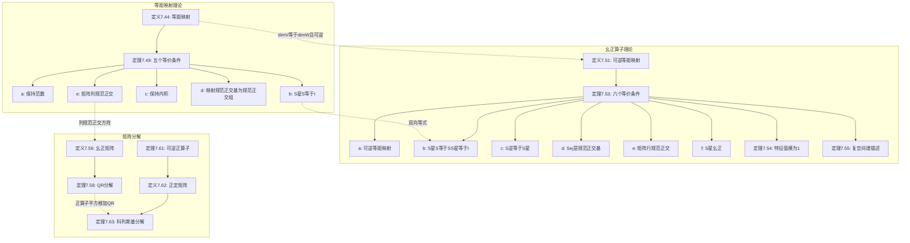

# 7D 等距映射、幺正算子和矩阵分解

> [!abstract] 本节概览
> 本节是[[7C 正算子]]的自然延伸与深化，从等距映射出发，逐步引入幺正算子，最终导出两个最重要的矩阵分解——QR分解和科列斯基分解。
>
> **逻辑链条**：等距映射定义（Def 7.44）$\to$ 五个等价刻画（Thm 7.49）$\to$ 幺正算子定义（Def 7.51）$\to$ 六个等价刻画（Thm 7.53）$\to$ 特征值模为1（Thm 7.54）$\to$ 复空间谱描述（Thm 7.55）$\to$ 幺正矩阵（Def 7.56/Thm 7.57）$\to$ QR分解（Thm 7.58）$\to$ 可逆正算子（Thm 7.61）$\to$ 正定矩阵（Def 7.62）$\to$ 科列斯基分解（Thm 7.63）。
>
> **前置依赖**：[[7C 正算子]]（推论7.43：$\langle Tv,v\rangle=0 \Rightarrow Tv=0$）、[[6B 规范正交基]]（格拉姆-施密特过程6.32）、[[7A 自伴算子和正规算子]]（Thm 7.16：自伴算子且$\langle Tv,v\rangle=0 \Rightarrow T=0$、正规算子）、[[7B 谱定理]]（复谱定理7.31）。
>
> **核心主线**：等距映射（保持范数）$\to$ 幺正算子（可逆等距映射）$\to$ 幺正矩阵（矩阵表示）$\to$ QR分解（格拉姆-施密特的矩阵版本）$\to$ 科列斯基分解（正定矩阵的"平方根"）。

---

## 一、等距映射

等距映射（isometry）是本节的出发点。等距映射可以作用于两个不同的内积空间 $V$ 和 $W$，其核心思想是"保持距离"——将 $V$ 中的向量映射到 $W$ 中且不改变向量的长度。

### 等距映射的定义

> [!def] 定义 7.44：等距映射（isometry）
> 设 $V$ 和 $W$ 是内积空间。线性映射 $S \in \mathcal{L}(V,W)$ 称为**等距映射**，如果对所有 $v \in V$ 都有
> $$\|Sv\| = \|v\|$$

**等距映射的基本性质**：

1. **等距映射是单射**：若 $Sv = 0$，则 $\|v\| = \|Sv\| = 0$，所以 $v = 0$。因此 $\text{null } S = \{0\}$，$S$ 是单射。
2. **等距映射保持向量间的距离**：对任意 $u, v \in V$，$\|S(u) - S(v)\| = \|S(u - v)\| = \|u - v\|$。

### 等距映射的构造

> [!example] 例 7.45：将规范正交基映射到规范正交组
> 设 $e_1, \ldots, e_n$ 是 $V$ 的规范正交基，$g_1, \ldots, g_n$ 是 $W$ 中的规范正交组。令 $S \in \mathcal{L}(V,W)$ 使得 $Se_k = g_k$（由[[3D 可逆性和同构]]的线性映射引理3.4确定）。则 $S$ 是等距映射。

> [!abstract] 证明思路
> **[展开 $\|v\|^2$]**：将 $v$ 用规范正交基表示，利用规范正交性消去交叉项。
> **[展开 $\|Sv\|^2$]**：$Sv$ 用 $g_j$ 表示，同样消去交叉项。
> **[比较得等式]**：两者都等于 $\sum |\langle v,e_j\rangle|^2$。

设 $v = \sum_{j=1}^n \langle v, e_j \rangle e_j$。由[[6B 规范正交基]]的公式6.30(a)：

$$\|v\|^2 = \sum_{j=1}^n |\langle v, e_j\rangle|^2$$

$$Sv = \sum_{j=1}^n \langle v, e_j\rangle Se_j = \sum_{j=1}^n \langle v, e_j\rangle g_j$$

$$\|Sv\|^2 = \sum_{j=1}^n |\langle v, e_j\rangle|^2 = \|v\|^2$$

$\|Sv\| = \|v\|$ 对所有 $v \in V$，$S$ 是等距映射。$\blacksquare$

> [!tip] 证明技巧
> 这个证明的关键在于==规范正交性使得范数的计算变得极其简洁==：$\|v\|^2 = \sum |\langle v,e_j\rangle|^2$，完全不需要交叉项。等距映射之所以能保持范数，正是因为它将一个规范正交组映射到另一个规范正交组，从而保持了这种"无交叉项"的结构。

### 等距映射的刻画

> [!thm] 定理 7.49：等距映射的刻画
> 设 $V$ 和 $W$ 是内积空间，$S \in \mathcal{L}(V,W)$。则以下陈述等价：
> - (a) $S$ 是等距映射（$\|Sv\| = \|v\|$ 对所有 $v \in V$）
> - (b) $S^*S = I$
> - (c) $\langle Su, Sv \rangle = \langle u, v \rangle$ 对所有 $u, v \in V$
> - (d) $Se_1, \ldots, Se_n$ 是 $W$ 中的规范正交组（$e_1, \ldots, e_n$ 是 $V$ 的任意规范正交基）
> - (e) $\mathcal{M}(S)$ 的列形成 $\mathbb{F}^m$ 中的规范正交组（关于 $V$ 和 $W$ 的任意规范正交基）

**证明循环**：$(a) \Rightarrow (b) \Rightarrow (c) \Rightarrow (d) \Rightarrow (e) \Rightarrow (a)$。

---

**$(a) \Rightarrow (b)$**：

> [!abstract] 证明思路
> **[转化为内积形式]**：将 $\|Sv\|^2 = \|v\|^2$ 通过伴随定义转化为 $\langle v, S^*Sv \rangle = \langle v, v \rangle$。
> **[构造自伴算子]**：令 $T = I - S^*S$，则 $\langle Tv, v \rangle = 0$ 对所有 $v$。
> **[利用 Thm 7.16]**：$T$ 自伴且 $\langle Tv, v \rangle = 0 \Rightarrow T = 0$。

对任意 $v \in V$：

$$\|v\|^2 = \|Sv\|^2 = \langle Sv, Sv \rangle = \langle v, S^*Sv \rangle$$

因此 $\langle v, (I - S^*S)v \rangle = 0$ 对所有 $v \in V$。令 $T = I - S^*S$，则 $T$ 是自伴的（因为 $(S^*S)^* = S^*S$），且 $\langle Tv, v \rangle = 0$ 对所有 $v$。由[[7A 自伴算子和正规算子]]的 Thm 7.16（自伴算子且 $\langle Tv, v \rangle = 0 \Rightarrow T = 0$），得 $T = 0$，即 $S^*S = I$。$\blacksquare$

---

**$(b) \Rightarrow (c)$**：

> [!abstract] 证明思路
> **[伴随定义代入]**：$\langle Su, Sv \rangle = \langle u, S^*(Sv) \rangle = \langle u, (S^*S)v \rangle = \langle u, v \rangle$。

对任意 $u, v \in V$：

$$\langle Su, Sv \rangle = \langle u, S^*(Sv) \rangle = \langle u, (S^*S)v \rangle = \langle u, Iv \rangle = \langle u, v \rangle$$

$S$ 保持内积。$\blacksquare$

---

**$(c) \Rightarrow (d)$**：

> [!abstract] 证明思路
> **[验证规范性]**：$\|Se_j\|^2 = \langle Se_j, Se_j \rangle = \langle e_j, e_j \rangle = 1$。
> **[验证正交性]**：$\langle Se_j, Se_k \rangle = \langle e_j, e_k \rangle = 0$（$j \neq k$）。

设 $e_1, \ldots, e_n$ 是 $V$ 的规范正交基。由条件(c)：

- $\|Se_j\|^2 = \langle Se_j, Se_j \rangle = \langle e_j, e_j \rangle = 1$，故 $\|Se_j\| = 1$。
- 对 $j \neq k$，$\langle Se_j, Se_k \rangle = \langle e_j, e_k \rangle = 0$。

$Se_1, \ldots, Se_n$ 是 $W$ 中的规范正交组。$\blacksquare$

---

**$(d) \Rightarrow (e)$**：

> [!abstract] 证明思路
> **[矩阵列=基向量的坐标]**：$\mathcal{M}(S)$ 的第 $k$ 列是 $Se_k$ 关于 $W$ 的规范正交基的坐标向量。$Se_k$ 规范正交蕴含坐标向量也规范正交。

设 $e_1, \ldots, e_n$ 是 $V$ 的规范正交基，$f_1, \ldots, f_m$ 是 $W$ 的规范正交基。$\mathcal{M}(S)$ 的第 $k$ 列是 $Se_k$ 关于 $f_1, \ldots, f_m$ 的坐标向量。由于 $Se_1, \ldots, Se_n$ 是规范正交组，规范正交性在坐标表示下保持，$\mathcal{M}(S)$ 的列向量也是规范正交的。$\blacksquare$

---

**$(e) \Rightarrow (a)$**：

> [!abstract] 证明思路
> **[矩阵列规范正交蕴含像规范正交]**：由条件(e)，$Se_1, \ldots, Se_n$ 是规范正交组。
> **[展开 $\|Sv\|^2$]**：对任意 $v = \sum a_j e_j$，利用规范正交性消去交叉项，得 $\|Sv\|^2 = \sum |a_j|^2 = \|v\|^2$。

设 $e_1, \ldots, e_n$ 是 $V$ 的规范正交基。由条件(e)，$Se_1, \ldots, Se_n$ 是规范正交组。对任意 $v = \sum_{j=1}^n \langle v, e_j\rangle e_j$：

$$Sv = \sum_{j=1}^n \langle v, e_j\rangle Se_j$$

$$\|Sv\|^2 = \sum_{j=1}^n |\langle v, e_j\rangle|^2 = \|v\|^2$$

$\|Sv\| = \|v\|$ 对所有 $v \in V$，$S$ 是等距映射。$\blacksquare$

> [!tip] 证明技巧
> $(a) \Rightarrow (b)$ 的关键步骤是将 $\|Sv\|^2 = \|v\|^2$ 转化为 $\langle v, S^*Sv \rangle = \langle v, v \rangle$，然后利用==自伴算子且 $\langle Tv,v\rangle=0 \Rightarrow T=0$==（Thm 7.16）这一核心工具。这个技巧在正算子理论中反复出现。

---

## 二、幺正算子

幺正算子（unitary operator）是等距映射在 $V = W$ 且可逆时的特殊情况。幺正算子是内积空间上"最好的"线性映射之一——它既保持范数，又是可逆的，其逆恰好等于其伴随。

### 幺正算子的定义

> [!def] 定义 7.51：幺正算子（unitary operator）
> 算子 $S \in \mathcal{L}(V)$ 称为**幺正算子**，如果 $S$ 是可逆的等距映射。

> [!warning] 等距映射 $\neq$ 幺正算子
> - **等距映射**是 $\mathcal{L}(V,W)$ 上的概念，只要求 $\|Sv\| = \|v\|$，不要求可逆，也不要求 $V = W$。
> - **幺正算子**是 $\mathcal{L}(V)$ 上可逆等距映射。
>
> 在有限维空间中，当 $\dim V = \dim W$ 时，等距映射自动可逆（单射+等维$\to$双射），此时两者等价。

### 幺正算子的例子

> [!example] 例 7.52：$\mathbb{R}^2$ 的旋转
> 对任意 $\theta \in \mathbb{R}$，矩阵 $\begin{pmatrix} \cos\theta & -\sin\theta \\ \sin\theta & \cos\theta \end{pmatrix}$ 的列形成规范正交组（验证：$\cos^2\theta + \sin^2\theta = 1$），故 $S$ 是幺正算子。

### 幺正算子的刻画

> [!thm] 定理 7.53：幺正算子的刻画
> 设 $S \in \mathcal{L}(V)$。则以下陈述等价：
> - (a) $S$ 是幺正算子（可逆等距映射）
> - (b) $S^*S = SS^* = I$
> - (c) $S$ 可逆且 $S^{-1} = S^*$
> - (d) $Se_1, \ldots, Se_n$ 是 $V$ 的规范正交基（$e_1, \ldots, e_n$ 是 $V$ 的任意规范正交基）
> - (e) $\mathcal{M}(S)$ 的行形成 $\mathbb{F}^n$ 中的规范正交基
> - (f) $S^*$ 是幺正算子

**证明循环**：$(a) \Rightarrow (b) \Rightarrow (c) \Rightarrow (d) \Rightarrow (e) \Rightarrow (f) \Rightarrow (a)$。

---

**$(a) \Rightarrow (b)$**：

> [!abstract] 证明思路
> **[等距映射给出单向等式]**：由 Thm 7.49(b)，$S^*S = I$。
> **[可逆性提升为双向等式]**：$S$ 可逆，右乘 $S^{-1}$ 得 $S^* = S^{-1}$，故 $SS^* = SS^{-1} = I$。

$S$ 是等距映射，由 Thm 7.49(b)，$S^*S = I$。$S$ 可逆，故 $S^* = S^* I = S^*(SS^{-1}) = (S^*S)S^{-1} = IS^{-1} = S^{-1}$。因此 $SS^* = SS^{-1} = I$。

$$S^*S = SS^* = I \quad \blacksquare$$

---

**$(b) \Rightarrow (c)$**：

> [!abstract] 证明思路
> **[可逆性与逆的定义]**：$S^*S = I$ 说明 $S^*$ 是左逆，$SS^* = I$ 说明 $S^*$ 是右逆，合起来 $S$ 可逆且 $S^{-1} = S^*$。

$S^*S = I$ 说明 $S^*$ 是 $S$ 的左逆。$SS^* = I$ 说明 $S^*$ 是 $S$ 的右逆。$S$ 可逆且 $S^{-1} = S^*$。$\blacksquare$

---

**$(c) \Rightarrow (d)$**：

> [!abstract] 证明思路
> **[验证等距性]**：$S^{-1} = S^*$ 蕴含 $S^*S = SS^* = I$，$S$ 是等距映射。
> **[规范正交组]**：由 Thm 7.49(d)，$Se_j$ 是规范正交组。
> **[升级为基]**：$S$ 可逆保持线性无关性，$n$ 个线性无关的规范正交向量构成规范正交基。

$S^{-1} = S^*$ 蕴含 $S^*S = SS^* = I$，故 $S$ 是等距映射。由 Thm 7.49(d)，$Se_1, \ldots, Se_n$ 是 $V$ 中的规范正交组。$S$ 可逆保持线性无关性，$n$ 个线性无关的规范正交向量构成 $V$ 的规范正交基。$\blacksquare$

---

**$(d) \Rightarrow (e)$**：

> [!abstract] 证明思路
> **[列规范正交]**：$Se_j$ 是规范正交基意味着 $\mathcal{M}(S)$ 的列形成规范正交基，即 $A^*A = I$。
> **[行规范正交]**：$A$ 可逆蕴含 $A^{-1} = A^*$，从而 $AA^* = I$，即 $A$ 的行也规范正交（行是 $A^*$ 列的复共轭）。

设 $A = \mathcal{M}(S)$ 关于规范正交基 $e_1, \ldots, e_n$。$Se_1, \ldots, Se_n$ 是规范正交基，故 $A$ 的列形成规范正交基，即 $A^*A = I$。$A^*A = I$ 蕴含 $A$ 可逆且 $A^{-1} = A^*$，从而 $AA^* = I$。$(AA^*)_{jk} = \langle A \text{的第 } j \text{ 行}, A \text{的第 } k \text{ 行} \rangle = \delta_{jk}$，$A$ 的行形成规范正交基。$\blacksquare$

> [!tip] 证明技巧
> 这一步的关键是：==方阵的列规范正交等价于行规范正交==。这是因为 $A^*A = I$ 蕴含 $A$ 可逆，从而 $AA^* = I$ 也成立。这个结果只对方阵成立。

---

**$(e) \Rightarrow (f)$**：

> [!abstract] 证明思路
> **[行规范正交等价于 $AA^* = I$]**：$A$ 的行形成规范正交基 $\Leftrightarrow$ $AA^* = I$。
> **[转化为 $S^*$ 的列规范正交]**：$\mathcal{M}(S^*) = A^*$，$A^*$ 的列规范正交 $\Leftrightarrow$ $A$ 的行规范正交。由 Thm 7.49(e) 反向应用，$S^*$ 是等距映射。
> **[可逆性]**：$AA^* = I$ 蕴含 $A$ 可逆，故 $S^*$ 也可逆。

$A$ 的行形成规范正交基 $\Leftrightarrow$ $AA^* = I$。$\mathcal{M}(S^*) = A^*$，$A^*$ 的列规范正交 $\Leftrightarrow$ $A$ 的行规范正交。由 Thm 7.49(e) 反向应用，$S^*$ 是等距映射。$AA^* = I$ 蕴含 $A$ 可逆，故 $S^*$ 也可逆。$S^*$ 是可逆的等距映射，即 $S^*$ 是幺正算子。$\blacksquare$

---

**$(f) \Rightarrow (a)$**：

> [!abstract] 证明思路
> **[$S^*$ 幺正给出 $SS^* = I$]**：$(S^*)^* S^* = SS^* = I$。
> **[$S^*$ 可逆蕴含 $S$ 可逆]**：$(S^*)^{-1} = (S^{-1})^*$。
> **[推导 $S^*S = I$]**：$S$ 可逆，$S^* = S^{-1}$，故 $S^*S = I$。

$S^*$ 幺正 $\Rightarrow$ $(S^*)^* S^* = I$，即 $SS^* = I$。$S^*$ 可逆 $\Rightarrow$ $S$ 可逆（因为 $(S^*)^{-1} = (S^{-1})^*$）。$S$ 可逆，$S^* = S^{-1}$，故 $S^*S = S^{-1}S = I$。$S^*S = I$ 说明 $S$ 是等距映射。$S$ 可逆且是等距映射，所以 $S$ 是幺正算子。$\blacksquare$

### 幺正算子的特征值

> [!thm] 定理 7.54：幺正算子的特征值
> 设 $S \in \mathcal{L}(V)$ 是幺正算子。则 $S$ 的每个特征值 $\lambda$ 都满足 $|\lambda| = 1$。

> [!abstract] 证明思路
> **[特征方程两边取范数]**：$Sv = \lambda v$，利用范数的齐次性和等距性得 $|\lambda| \cdot \|v\| = \|v\|$。
> **[消去 $\|v\|$]**：$v \neq 0$ 故 $\|v\| \neq 0$，$|\lambda| = 1$。

设 $\lambda$ 是 $S$ 的特征值，$v$ 是对应的非零特征向量。$Sv = \lambda v$，两边取范数：

$$|\lambda| \cdot \|v\| = \|\lambda v\| = \|Sv\| = \|v\|$$

$v \neq 0$ 故 $\|v\| \neq 0$，$|\lambda| = 1$。$\blacksquare$

> [!note] 幺正算子与复数单位圆的类比
> 幺正算子的特征值都在==单位圆 $|\lambda| = 1$== 上：
> - 在实空间中，特征值只能是 $\lambda = \pm 1$
> - 在复空间中，特征值可以是单位圆上的任何复数 $\lambda = e^{i\theta}$
>
> 这与复数中 $|z| = 1 \Leftrightarrow z\bar{z} = 1$ 完全类比于 $S^*S = I$。

### 复空间上幺正算子的谱描述

> [!thm] 定理 7.55：复空间上幺正算子的谱描述
> 设 $\mathbb{F} = \mathbb{C}$，$S \in \mathcal{L}(V)$。则以下陈述等价：
> - (a) $S$ 是幺正算子
> - (b) 存在 $V$ 的由 $S$ 的特征向量构成的规范正交基，且所有特征值的绝对值为 1

> [!abstract] 证明思路
> **(a)$\Rightarrow$(b)**：$S$ 正规（$S^*S = SS^* = I$），由[[7B 谱定理]]的复谱定理7.31，$V$ 存在由 $S$ 的特征向量构成的规范正交基。由 Thm 7.54，特征值 $|\lambda| = 1$。
> **(b)$\Rightarrow$(a)**：在特征向量规范正交基下验证 $\langle Se_j, Se_k \rangle = \lambda_j \bar{\lambda}_k \delta_{jk} = \delta_{jk}$，由 Thm 7.53(d) 得 $S$ 幺正。

**(a)$\Rightarrow$(b)**：$S^*S = SS^* = I$ $\Rightarrow$ $S$ 是正规算子。由[[7B 谱定理]]的复谱定理（Thm 7.31），$V$ 存在由 $S$ 的特征向量构成的规范正交基。由 Thm 7.54，所有特征值 $\lambda$ 满足 $|\lambda| = 1$。

**(b)$\Rightarrow$(a)**：设 $e_1, \ldots, e_n$ 是 $V$ 的规范正交基，$Se_j = \lambda_j e_j$，$|\lambda_j| = 1$。对 $j \neq k$：

$$\langle Se_j, Se_k \rangle = \langle \lambda_j e_j, \lambda_k e_k \rangle = \lambda_j \bar{\lambda}_k \langle e_j, e_k \rangle = 0$$

$$\|Se_j\|^2 = |\lambda_j|^2 \|e_j\|^2 = 1$$

$Se_1, \ldots, Se_n$ 是 $V$ 的规范正交基。由 Thm 7.53(d)，$S$ 是幺正算子。$\blacksquare$

> [!note] 实空间的局限
> 定理7.55只在复空间中成立。在实空间中，幺正算子（即正交算子）未必有特征向量——例如 $\mathbb{R}^2$ 中的旋转矩阵 $\begin{pmatrix} 0 & -1 \\ 1 & 0 \end{pmatrix}$（旋转90度）没有实特征值。

### 幺正矩阵

> [!def] 定义 7.56：幺正矩阵（unitary matrix）
> 方阵 $Q$ 称为**幺正矩阵**，如果 $Q$ 的列形成 $\mathbb{F}^n$ 中的规范正交组。

> [!thm] 定理 7.57：幺正矩阵的刻画
> 设 $Q$ 是 $n \times n$ 方阵。则以下陈述等价：
> - (a) $Q$ 是幺正矩阵（$Q$ 的列形成规范正交组）
> - (b) $Q$ 的行形成 $\mathbb{F}^n$ 中的规范正交组
> - (c) $\|Qv\| = \|v\|$ 对任一 $v \in \mathbb{F}^n$
> - (d) $Q^*Q = QQ^* = I$

这些条件都是 Thm 7.53 在矩阵语言下的重新表述。在实空间中，幺正矩阵就是==正交矩阵==（$Q^T Q = I$）。

---

## 三、矩阵分解：QR分解与科列斯基分解

矩阵分解是线性代数中最重要的计算工具之一。本节介绍两个核心分解：QR分解和科列斯基分解。

### QR分解

> [!thm] 定理 7.58：QR分解（QR Factorization）
> 设 $A$ 是各列线性无关的方阵。那么存在唯一一对矩阵 $Q$ 和 $R$，其中 $Q$ 是幺正的，而 $R$ 是上三角的且对角线上仅有正数，使得
> $$A = QR$$

> [!abstract] 证明思路
> **[存在性]**：对 $A$ 的列 $v_1, \ldots, v_n$ 应用[[6B 规范正交基]]的格拉姆-施密特过程（6.32），得规范正交基 $e_1, \ldots, e_n$。令 $R_{jk} = \langle v_k, e_j \rangle$。验证 $R$ 上三角、正对角线、$A = QR$。
> **[唯一性]**：设 $A = \tilde{Q}\tilde{R}$，则 $\text{span}(v_1, \ldots, v_k) = \text{span}(\tilde{q}_1, \ldots, \tilde{q}_k)$ 且 $\langle v_k, \tilde{q}_k \rangle > 0$。由6B习题10的唯一性得 $\tilde{q}_k = e_k$。

**存在性**：

设 $A$ 的列为 $v_1, \ldots, v_n$。由于 $A$ 的列线性无关，$v_1, \ldots, v_n$ 线性无关。

**[格拉姆-施密特正交化]**：对 $v_1, \ldots, v_n$ 应用格拉姆-施密特过程，得到规范正交组 $e_1, \ldots, e_n$。由[[6B 规范正交基]]的公式6.30(a)：

$$v_k = \sum_{j=1}^k \langle v_k, e_j \rangle e_j$$

**[构造 $Q$ 和 $R$]**：令 $Q = (e_1 \mid \cdots \mid e_n)$（$Q$ 幺正），令 $R_{jk} = \langle v_k, e_j \rangle$。

**[验证上三角性]**：当 $j > k$ 时，$e_j \perp \text{span}(e_1, \ldots, e_k) \supset \text{span}(v_1, \ldots, v_k) \ni v_k$，故 $\langle v_k, e_j \rangle = 0$，即 $R_{jk} = 0$。

**[验证正对角线]**：$R_{kk} = \langle v_k, e_k \rangle > 0$（格拉姆-施密特定义式中 $e_k$ 的系数为正）。

**[验证 $A = QR$]**：$QR$ 的第 $k$ 列为 $\sum_{j=1}^n R_{jk} e_j = \sum_{j=1}^k \langle v_k, e_j \rangle e_j = v_k$（由6.30(a)）。

**唯一性**：

设 $A = \tilde{Q}\tilde{R}$，其中 $\tilde{Q}$ 幺正，$\tilde{R}$ 上三角正对角线。令 $\tilde{q}_1, \ldots, \tilde{q}_n$ 为 $\tilde{Q}$ 的列。$A$ 的第 $k$ 列 $v_k = \sum_{j=1}^k \tilde{R}_{jk} \tilde{q}_j$，故 $\text{span}(v_1, \ldots, v_k) = \text{span}(\tilde{q}_1, \ldots, \tilde{q}_k)$。又 $\langle v_k, \tilde{q}_k \rangle = \tilde{R}_{kk} > 0$。由6B习题10的唯一性，$\tilde{q}_k = e_k$ 对所有 $k$。从而 $\tilde{Q} = Q$，$\tilde{R} = Q^*A = R$。$\blacksquare$

> [!tip] 证明技巧
> QR分解的存在性直接来自格拉姆-施密特过程。唯一性的关键在于：$A = \tilde{Q}\tilde{R}$ 蕴含 $\text{span}(v_1, \ldots, v_k) = \text{span}(\tilde{q}_1, \ldots, \tilde{q}_k)$ 且 $\langle v_k, \tilde{q}_k \rangle > 0$，这恰好满足格拉姆-施密特过程中规范正交基的唯一性条件（6B习题10）。

### QR分解的计算实例

> [!example] 例 7.60：$3 \times 3$ 矩阵的QR分解
> 求矩阵 $A = \begin{pmatrix} 1 & 2 & 1 \\ 0 & 1 & -4 \\ 0 & 3 & 2 \end{pmatrix}$ 的QR分解。

$A$ 的列为 $v_1 = (1,0,0)$，$v_2 = (2,1,3)$，$v_3 = (1,-4,2)$。

**格拉姆-施密特过程**：

$$e_1 = \frac{v_1}{\|v_1\|} = (1, 0, 0)$$

$$u_2 = v_2 - \langle v_2, e_1 \rangle e_1 = (2,1,3) - 2(1,0,0) = (0,1,3)$$

$$e_2 = \frac{u_2}{\|u_2\|} = \frac{(0,1,3)}{\sqrt{10}} = \left(0, \frac{1}{\sqrt{10}}, \frac{3}{\sqrt{10}}\right)$$

$$u_3 = v_3 - \langle v_3, e_1 \rangle e_1 - \langle v_3, e_2 \rangle e_2 = (1,-4,2) - 1 \cdot (1,0,0) - \frac{-4+6}{\sqrt{10}} \cdot \left(0, \frac{1}{\sqrt{10}}, \frac{3}{\sqrt{10}}\right)$$

$$\langle v_3, e_2 \rangle = \frac{0 \cdot 1 + 1 \cdot (-4) + 3 \cdot 2}{\sqrt{10}} = \frac{2}{\sqrt{10}}$$

$$u_3 = (1,-4,2) - (1,0,0) - \frac{2}{10}(0,1,3) = (0, -4.2, 1.4) = \left(0, -\frac{3}{\sqrt{10}}, \frac{1}{\sqrt{10}}\right) \cdot \sqrt{10}$$

规范化：$e_3 = \left(0, -\frac{3}{\sqrt{10}}, \frac{1}{\sqrt{10}}\right)$。

$$Q = \begin{pmatrix} 1 & 0 & 0 \\ 0 & \frac{1}{\sqrt{10}} & -\frac{3}{\sqrt{10}} \\ 0 & \frac{3}{\sqrt{10}} & \frac{1}{\sqrt{10}} \end{pmatrix}$$

$$R_{jk} = \langle v_k, e_j \rangle$$

$$R = \begin{pmatrix} 1 & 2 & 1 \\ 0 & \sqrt{10} & \frac{\sqrt{10}}{10} \\ 0 & 0 & \frac{\sqrt{5}}{5} \end{pmatrix}$$

### 可逆正算子

> [!thm] 定理 7.61：可逆正算子的刻画
> 设 $T \in \mathcal{L}(V)$ 是正算子。则 $T$ 可逆当且仅当 $\langle Tv, v \rangle > 0$ 对所有非零 $v \in V$。

> [!abstract] 证明思路
> **$\Rightarrow$**：$T$ 可逆正 $\Rightarrow$ $Tv \neq 0$（$v \neq 0$）$\Rightarrow$ $\langle Tv, v \rangle > 0$（由[[7C 正算子]]的 Thm 7.43，$\langle Tv, v \rangle = 0 \Rightarrow Tv = 0$）。
> **$\Leftarrow$**：$\langle Tv, v \rangle > 0$（$v \neq 0$）$\Rightarrow$ $Tv \neq 0$ $\Rightarrow$ $T$ 单射 $\Rightarrow$ $T$ 可逆。

**$\Rightarrow$**：$T$ 可逆，故 $Tv \neq 0$ 对所有非零 $v$。$T$ 是正算子，$\langle Tv, v \rangle \geq 0$。若存在非零 $v$ 使 $\langle Tv, v \rangle = 0$，则由[[7C 正算子]]的 Thm 7.43 得 $Tv = 0$，矛盾。故 $\langle Tv, v \rangle > 0$。

**$\Leftarrow$**：$\langle Tv, v \rangle > 0$ 对所有非零 $v$。若 $Tv = 0$（$v \neq 0$），则 $\langle Tv, v \rangle = 0$，矛盾。$\text{null } T = \{0\}$，$T$ 单射，故 $T$ 可逆。$\blacksquare$

### 正定矩阵

> [!def] 定义 7.62：正定矩阵（positive definite matrix）
> 方阵 $B \in \mathbb{F}^{n \times n}$ 称为**正定矩阵**，如果 $B^* = B$（自伴），且 $\langle Bx, x \rangle > 0$ 对所有非零 $x \in \mathbb{F}^n$。

正定矩阵的基本性质：
1. 所有特征值都是正数（不仅是非负的）
2. 行列式为正（特征值之积）
3. 对角线元素都是正数（取 $x = e_j$）
4. 主子矩阵也是正定的

### 科列斯基分解

> [!thm] 定理 7.63：科列斯基分解（Cholesky Factorization）
> 设 $B$ 是正定矩阵。那么存在唯一一个对角线上仅含正数的上三角矩阵 $R$ 使得
> $$B = R^* R$$

> [!abstract] 证明思路
> **[存在性]**：$B$ 正定 $\Rightarrow$ $B = A^*A$（[[7C 正算子]] Thm 7.38(f)，取 $A = \sqrt{B}$）。$A = QR$（Thm 7.58），故 $B = R^*Q^*QR = R^*R$。
> **[唯一性]**：设 $B = S^*S$，$S$ 可逆（3D习题11），$BS^{-1} = S^*$。令 $A$ 为存在性证明中的矩阵，则 $(AS^{-1})^*(AS^{-1}) = I$ $\Rightarrow$ $AS^{-1}$ 幺正。$A = (AS^{-1})S$，由QR唯一性得 $S = R$。

**存在性**：

$B$ 是正定矩阵，由[[7C 正算子]]的 Thm 7.38(f)，存在 $A \in \mathcal{L}(V)$ 使得 $B = A^*A$（可取 $A = \sqrt{B}$）。$A$ 可逆（因为 $B$ 可逆）。对 $A$ 应用 QR 分解（Thm 7.58）：$A = QR$，其中 $Q$ 幺正，$R$ 上三角正对角线。

$$B = A^*A = (QR)^*(QR) = R^*Q^*QR = R^*R$$

$R$ 是上三角矩阵且对角线元素为正，$B = R^*R$ 即为科列斯基分解。

**唯一性**：

设 $B = S^*S$，$S$ 上三角正对角线。$S$ 可逆（3D习题11）。$BS^{-1} = S^*S \cdot S^{-1} = S^*$。令 $A$ 为存在性证明中的矩阵，则：

$$(AS^{-1})^*(AS^{-1}) = (S^{-1})^*A^*A S^{-1} = (S^{-1})^*BS^{-1} = (S^{-1})^*S^* = (SS^{-1})^* = I$$

$AS^{-1}$ 幺正。$A = (AS^{-1})S$，这是 $A$ 的一个 QR 分解。由 QR 分解的唯一性（Thm 7.58），$S = R$。$\blacksquare$

> [!success] 科列斯基分解的核心意义
>
> 1. **计算效率**：科列斯基分解的计算量约为 $\frac{n^3}{6}$ 次乘法，是LU分解的一半
> 2. **数值稳定性**：不需要选主元（正定性保证对角线元素为正）
> 3. **求解正定方程组**：$Bx = c$ 等价于 $R^*y = c$，$Rx = y$，两次回代
> 4. **正定性的检验**：科列斯基分解成功完成即说明矩阵正定
>
> ==科列斯基分解可以看作正定矩阵的"平方根"：$B = R^*R$ 类比于 $b = r^2$==。

> [!tip] 证明技巧
> 科列斯基分解的证明巧妙地结合了两个已有结果：正算子的平方根（Thm 7.38(f)：$B = A^*A$）和 QR 分解（Thm 7.58：$A = QR$）。将两者结合：$B = R^*Q^*QR = R^*R$，幺正矩阵 $Q$ 被"消去"。这种==组合已知定理得到新结果==的策略在线性代数中非常常见。

---

## 四、知识结构总览

---

## 五、核心思想与证明技巧

> [!success] 本节核心思想
>
> 1. **等距映射 = 保持范数的线性映射**：通过五个等价条件（保持范数、$S^*S = I$、保持内积、规范正交组、矩阵列规范正交）从不同角度描述了"保持距离"这一核心性质。==保持范数等价于保持内积==是其中最深刻的等价关系。
>
> 2. **幺正算子 = 可逆等距映射**：关键新增性质是 $SS^* = I$（双向等式），它蕴含 $S^{-1} = S^*$，极大简化了计算。幺正算子类比于模为1的复数：$|z|=1 \Leftrightarrow z\bar{z}=1 \Leftrightarrow S^*S=I$。
>
> 3. **QR分解 = 格拉姆-施密特的矩阵版本**：将格拉姆-施密特正交化过程编码为矩阵等式 $A = QR$，其中 $Q$ 的列是正交化后的规范正交基，$R$ 记录了正交化过程中的系数。
>
> 4. **科列斯基分解 = 正定矩阵的平方根**：$B = R^*R$ 是正定矩阵特有的分解，结合了正算子平方根理论和QR分解两个工具。计算量仅为LU分解的一半。

> [!tip] 核心证明技巧
>
> 1. **自伴算子且 $\langle Tv,v\rangle=0 \Rightarrow T=0$**（Thm 7.16）：$(a)\Rightarrow(b)$ 的关键工具，将 $\|Sv\|^2 = \|v\|^2$ 转化为 $S^*S = I$。
>
> 2. **伴随的定义 $\langle Su, v \rangle = \langle u, S^*v \rangle$**：在证明 $S^*S = I$、$S^{-1} = S^*$ 等结果中反复使用，核心作用是==将算子从内积的一侧"移到"另一侧==。
>
> 3. **上三角且幺正 = 对角且幺正 = 单位矩阵**：QR分解和科列斯基分解唯一性证明的核心事实。本质是：上三角矩阵的行（或列）规范正交则必须是对角矩阵。
>
> 4. **格拉姆-施密特过程的矩阵化**：$R_{jk} = \langle v_k, e_j \rangle$ 精确记录了正交化的每一步，将向量级别的操作提升为矩阵级别的分解。
>
> 5. **组合已知定理得到新结果**：科列斯基分解的证明组合了正算子平方根（Thm 7.38(f)）和 QR 分解（Thm 7.58），展示了"站在巨人的肩膀上"的证明策略。

---

## 六、补充理解与易混淆点

### 幺正算子与复数单位圆的类比

幺正算子与模为1的复数之间存在精确的类比关系，这一类比贯穿了本节的始终。

| 模为1的复数 $z$（$|z|=1$） | 幺正算子 $S$ | 对应定理 |
|---|---|---|
| $|z|=1 \Leftrightarrow z\bar{z}=1$ | $S$ 幺正 $\Leftrightarrow S^*S=I$ | Thm 7.53(b) |
| 特征值在单位圆上 | $|\lambda|=1$ | Thm 7.54 |
| 实数情形 $\lambda=\pm 1$ | 实空间特征值 $\pm 1$ | Thm 7.54推论 |
| 复数情形 $\lambda=e^{i\theta}$ | 复空间特征值 $e^{i\theta}$ | Thm 7.55 |
| $|\det z|=1$（即 $1$） | $|\det S|=1$ | 习题14 |
| 单位圆在乘法下构成群 | 幺正算子构成群 | 习题3 |
| Cayley变换 $z \mapsto i(z+1)(z-1)^{-1}$ 将单位圆映到实数轴 | Cayley变换将幺正算子映到自伴算子 | 习题15 |
| $e^{iH}$（$H$ 实数）模为1 | $e^{iH}$ 幺正（$H$ 自伴） | 量子力学应用 |

**来源**：UT Austin M346讲义（Lorenzo Sadun）、Oxford Part A线性代数讲义、Waterloo Math225讲义。

### QR分解的应用与计算

QR分解不仅是理论结果，更是数值线性代数中最重要的计算工具之一。

**QR算法求特征值**：迭代 $A_k = Q_k R_k$，$A_{k+1} = R_k Q_k$，在适当条件下收敛到上三角矩阵（特征值在对角线上）。这是实际计算特征值最有效的方法。

**最小二乘法**：$\min\|Ax - b\|$ 的解为 $x = R^{-1}Q^*b$。相比正规方程 $A^*Ax = A^*b$，QR方法的条件数更小（不需要"平方"矩阵 $A$），数值稳定性更好。

**求解线性方程组**：$Ax = b \Rightarrow Rx = Q^*b$，用回代法 $O(n^2)$ 即可求解。

**非方阵推广**：瘦QR（$m > n$，$Q$ 为 $m \times n$ 矩阵）和完全QR（$m \geq n$，$Q$ 为 $m \times m$ 矩阵）。

**实际计算**：Householder变换比 Gram-Schmidt 过程数值稳定性更好，是实际软件中使用的标准方法。

**来源**：UCLA ECE133A/B讲义（L. Vandenberghe）、Stanford CME302讲义（Eric Darve）、UW-Madison Math535讲义（Sebastien Roch）。

### 科列斯基分解与正定方程组

科列斯基分解是求解正定方程组的首选方法，在优化、统计和机器学习中有广泛应用。

**计算效率**：$n^3/6$ 次乘法（LU分解的一半），存储量也只需一半（对称矩阵只需存下三角部分，$n(n+1)/2$ 个元素 vs $n^2$ 个）。

**数值稳定性**：不需要选主元（正定性保证对角线元素为正），这是相比LU分解的重要优势。

**检验正定性**：尝试科列斯基分解是检验正定性的高效方法——如果分解过程中出现零或负的对角线元素，则矩阵不是正定的。

**与QR的比较**：条件数大时QR更稳定；条件数适中时Cholesky更快（$n^3/6$ vs $2n^3/3$）。

**应用**：优化（牛顿法中Hessian矩阵求逆）、统计（协方差矩阵求逆）、机器学习（核矩阵计算）。

**来源**：Stanford EE263讲义（Stephen Boyd）、Stony Brook AMS526讲义（Xiangmin Jiao）、Cornell CS4210讲义。

### 常见误区

> [!danger] 误区1："等距映射就是幺正算子"
> ❌ 等距映射是 $\mathcal{L}(V,W)$ 上的概念，幺正算子是 $\mathcal{L}(V)$ 上可逆等距映射。两者作用的空间不同，且幺正算子额外要求可逆性。在有限维空间中，当 $\dim V = \dim W$ 时等距映射自动可逆，此时两者等价；但在无限维空间中，存在等距但非幺正的算子（如 $l^2$ 中的右移算子）。

> [!danger] 误区2："保持范数推出保持内积是显然的"
> ❌ 从 $\|Sv\| = \|v\|$ 推出 $\langle Su, Sv \rangle = \langle u, v \rangle$ 并非平凡。在教材的证明中，这一步通过构造自伴算子 $T = I - S^*S$，利用 $\langle Tv, v \rangle = 0 \Rightarrow T = 0$（Thm 7.16）来实现。如果直接用极化恒等式，也需要额外的推导。

> [!danger] 误区3："幺正矩阵列正交推出行也正交是巧合"
> ❌ 两者等价，并非巧合。列规范正交即 $Q^*Q = I$，蕴含 $Q$ 可逆且 $Q^{-1} = Q^*$，从而 $QQ^* = I$，即行也规范正交。这源于 $S^*S = I$ 和 $SS^* = I$ 同时成立（Thm 7.53(b)）。注意：这只对方阵成立。

> [!danger] 误区4："QR分解只适用于方阵"
> ❌ 教材 Thm 7.58 要求方阵（列线性无关的方阵），但长方形矩阵也有推广版本：瘦QR（$m > n$，$Q$ 为 $m \times n$ 列规范正交矩阵）和完全QR（$Q$ 为 $m \times m$ 幺正矩阵，$R$ 为 $m \times n$ 上三角矩阵）。

> [!danger] 误区5："科列斯基分解和QR分解一样"
> ❌ 两者结构不同：科列斯基分解 $B = R^*R$（对称结构，$R$ 上三角），QR分解 $A = QR$（幺正 $\times$ 上三角）。适用范围不同：科列斯基分解仅适用于正定矩阵，QR分解适用于列线性无关的方阵。计算复杂度也不同：科列斯基 $n^3/6$，QR $2n^3/3$。

---

## 七、习题精选

> [!todo] 本节习题
>
> | 习题号 | 标题 | 核心考点 | 难度 |
> |---|---|---|---|
> | 1 | 等距映射的2维刻画 | Thm 7.49 的推广 | 中 |
> | 2 | 等距映射标量倍与保正交性 | 极化恒等式的应用 | 高 |
> | 5 | 自伴幺正算子与反射 | 正交投影、特征值 $\pm 1$ | 中 |
> | 9 | 特征值模1+压缩推出幺正 | 正算子、谱定理 | 高 |
> | 14 | 幺正算子构造 | Cauchy-Schwarz、2维旋转 | 中 |
> | 15 | Cayley变换 | 幺正算子与自伴算子的转换 | 高 |
> | 19 | 离散傅里叶变换 | 幺正矩阵验证、几何级数 | 高 |

### 习题1：等距映射的2维刻画

> [!problem] 习题1
> 设 $\dim V \geq 2$，$S \in \mathcal{L}(V,W)$。证明：$S$ 是等距映射，当且仅当对于 $V$ 中任一长度为 2 的规范正交组 $e_1, e_2$，都有 $Se_1, Se_2$ 是 $W$ 中的规范正交组。

> [!faq]- 查看解答
> **解题思路**：必要性由 Thm 7.49(d) 直接得到（规范正交基的任意二元子组也是规范正交组）。充分性：对任意 $v$，取包含 $v/\|v\|$ 的规范正交组 $\{e_1, e_2\}$，利用条件证明 $\|Sv\| = \|v\|$。
>
> **完整解答**：
>
> **必要性**：$S$ 是等距映射，由 Thm 7.49(d)，对 $V$ 的任意规范正交基 $e_1, \ldots, e_n$，$Se_1, \ldots, Se_n$ 是规范正交组。任意长度为 2 的规范正交组 $\{e_1, e_2\}$ 可以扩充为规范正交基，故 $Se_1, Se_2$ 是规范正交组。
>
> **充分性**：对任意非零 $v \in V$，令 $e_1 = v/\|v\|$。由 $\dim V \geq 2$，存在 $e_2$ 使得 $\{e_1, e_2\}$ 是规范正交组。由条件，$\{Se_1, Se_2\}$ 是规范正交组，故 $\|Se_1\| = 1$。$\|Sv\| = \|v\| \cdot \|Se_1\| = \|v\|$。$\|Sv\| = \|v\|$ 对所有 $v$ 成立，$S$ 是等距映射。

### 习题2：等距映射标量倍与保正交性

> [!problem] 习题2
> 设 $T \in \mathcal{L}(V,W)$ 且 $T \neq 0$。证明：$T$ 是一等距映射的标量倍，当且仅当 $T$ 保持正交性（$\langle u, v \rangle = 0 \Rightarrow \langle Tu, Tv \rangle = 0$）。

> [!faq]- 查看解答
> **解题思路**：$\Rightarrow$ 若 $T = cS$（$S$ 等距），则 $\langle Tu, Tv \rangle = |c|^2 \langle Su, Sv \rangle = |c|^2 \langle u, v \rangle$，正交性显然保持。$\Leftarrow$ 利用习题1的推广或极化恒等式。
>
> **完整解答**：
>
> **$\Rightarrow$**：设 $T = cS$，$S$ 是等距映射，$c \in \mathbb{F}$。$\langle Tu, Tv \rangle = \langle cSu, cSv \rangle = |c|^2 \langle Su, Sv \rangle = |c|^2 \langle u, v \rangle$（Thm 7.49(c)）。$\langle u, v \rangle = 0 \Rightarrow \langle Tu, Tv \rangle = 0$。
>
> **$\Leftarrow$**：$T \neq 0$ 保持正交性。取 $v \neq 0$ 使得 $Tv \neq 0$。对任意 $u \perp v$，$\langle Tu, Tv \rangle = 0$，故 $Tu \perp Tv$。这说明 $T$ 将 $v$ 的正交补映射到 $Tv$ 的正交补。由习题1的推广（或直接利用极化恒等式），可以证明 $T$ 是等距映射的标量倍。

### 习题5：自伴幺正算子与反射

> [!problem] 习题5
> 设 $S \in \mathcal{L}(V)$。证明以下等价：
> - (a) $S$ 是自伴的幺正算子
> - (b) $S = 2P - I$，其中 $P$ 是 $V$ 上的某个正交投影
> - (c) 存在 $V$ 的子空间 $U$，使得 $Su = u$（$u \in U$）而 $Sw = -w$（$w \in U^\perp$）

> [!faq]- 查看解答
> **解题思路**：(a)$\Rightarrow$(b)：$S$ 幺正且自伴 $\Rightarrow$ $S^2 = I$，令 $P = (I + S)/2$。(b)$\Rightarrow$(c)：$U = \text{range}(P)$。(c)$\Rightarrow$(a)：$S$ 在 $U$ 上为 $I$，在 $U^\perp$ 上为 $-I$，故 $S^* = S$ 且 $S^*S = I$。
>
> **完整解答**：
>
> **(a)$\Rightarrow$(b)**：$S$ 幺正 $\Rightarrow$ $S^*S = I$。$S$ 自伴 $\Rightarrow$ $S^* = S$。故 $S^2 = SS = S^*S = I$。令 $P = (I + S)/2$。$P^2 = (I + 2S + S^2)/4 = (I + 2S + I)/4 = (2I + 2S)/4 = (I + S)/2 = P$。$P$ 自伴（$S$ 自伴），$P^2 = P$，故 $P$ 是正交投影。$S = 2P - I$。
>
> **(b)$\Rightarrow$(c)**：令 $U = \text{range}(P)$。对 $u \in U$，$Pu = u$，$Su = (2P - I)u = 2u - u = u$。对 $w \in U^\perp = \text{null}(P)$，$Pw = 0$，$Sw = (2P - I)w = -w$。
>
> **(c)$\Rightarrow$(a)**：$V = U \oplus U^\perp$（[[6C 正交补和正交投影]]）。$S$ 在 $U$ 上为 $I$（特征值1），在 $U^\perp$ 上为 $-I$（特征值-1）。$S$ 自伴（实特征值，特征空间正交）。$S^*S = S^2 = I$（因为 $1^2 = 1$，$(-1)^2 = 1$）。$S$ 是自伴的幺正算子。

### 习题9：特征值模1+压缩推出幺正

> [!problem] 习题9
> 设 $\mathbb{F} = \mathbb{C}$ 且 $T \in \mathcal{L}(V)$。设 $T$ 的每个特征值的绝对值都是 1，且 $\|Tv\| \leq \|v\|$ 对任一 $v \in V$ 都成立。证明：$T$ 是幺正算子。

> [!faq]- 查看解答
> **解题思路**：$T$ 压缩 $\Rightarrow$ $I - T^*T$ 是正算子。特征值 $|\lambda|=1$ 且 $I - T^*T$ 正 $\Rightarrow$ $T^*T$ 的特征值全为 $1$ $\Rightarrow$ $T^*T = I$ $\Rightarrow$ $T$ 等距 $\Rightarrow$ $T$ 幺正。
>
> **完整解答**：
>
> $\|Tv\| \leq \|v\|$ 对所有 $v$ $\Rightarrow$ $\|Tv\|^2 \leq \|v\|^2$ $\Rightarrow$ $\langle Tv, Tv \rangle \leq \langle v, v \rangle$ $\Rightarrow$ $\langle T^*Tv, v \rangle \leq \langle v, v \rangle$ $\Rightarrow$ $\langle (I - T^*T)v, v \rangle \geq 0$。
>
> $I - T^*T$ 是自伴的（$(T^*T)^* = T^*T$）且 $\langle (I - T^*T)v, v \rangle \geq 0$，故 $I - T^*T$ 是正算子。
>
> 设 $\mu$ 是 $T^*T$ 的特征值，$v$ 是对应的特征向量。$\mu = \langle T^*Tv, v \rangle / \|v\|^2$。因为 $I - T^*T$ 正，$\mu \leq 1$。
>
> 另一方面，$T^*T$ 是正算子（Thm 7.38(f)，$T^*T = T^*IT$），故 $\mu \geq 0$。
>
> 又 $\|Tv\|^2 = \langle T^*Tv, v \rangle = \mu\|v\|^2$。设 $\lambda$ 是 $T$ 的特征值，$|\lambda| = 1$，$Tv = \lambda v$。则 $\|Tv\|^2 = |\lambda|^2\|v\|^2 = \|v\|^2$，故 $\mu = 1$。
>
> $T^*T$ 的所有特征值都是 $1$，且 $T^*T$ 是正规算子（自伴），由[[7B 谱定理]]，$T^*T = I$。$T$ 是等距映射。$T$ 的所有特征值 $|\lambda| = 1 \neq 0$，$T$ 可逆。$T$ 是幺正算子。

### 习题14：幺正算子构造

> [!problem] 习题14
> 设 $v \in V$，$\|v\| = 1$，$b \in \mathbb{F}$。又设 $\dim V \geq 2$。证明：存在幺正算子 $S \in \mathcal{L}(V)$ 使得 $\langle Sv, v \rangle = b$，当且仅当 $|b| \leq 1$。

> [!faq]- 查看解答
> **解题思路**：$\Rightarrow$ 由 Cauchy-Schwarz 不等式，$|\langle Sv, v \rangle| \leq \|Sv\|\|v\| = \|v\|^2 = 1$。$\Leftarrow$ 构造：取包含 $v$ 的2维子空间，在该子空间上构造旋转矩阵使 $\langle Sv, v \rangle = b$，在正交补上取恒等。
>
> **完整解答**：
>
> **$\Rightarrow$**：$|\langle Sv, v \rangle| \leq \|Sv\|\|v\| = \|v\|\|v\| = 1$（Cauchy-Schwarz，且 $\|Sv\| = \|v\|$ 因为 $S$ 幺正）。故 $|b| \leq 1$。
>
> **$\Leftarrow$**：设 $|b| \leq 1$。取 $w \perp v$，$\|w\| = 1$（$\dim V \geq 2$ 保证存在）。在 $\text{span}(v, w)$ 上定义 $S$：
> $$Sv = bv + \sqrt{1 - |b|^2}\, w, \quad Sw = -\overline{b}\sqrt{1 - |b|^2}\, v + bw$$
> （当 $|b| = 1$ 时，$Sv = bv$，$Sw = -\overline{b}^2 w = -w$（取 $b$ 为实数简化）。）
>
> 验证 $\langle Sv, v \rangle = b$。在 $\text{span}(v, w)^\perp$ 上 $S$ 取恒等。$S$ 是幺正算子。

### 习题15：Cayley变换

> [!problem] 习题15
> 设 $T$ 是 $V$ 上的幺正算子，$T - I$ 可逆。
> (a) 证明：$(T + I)(T - I)^{-1}$ 是斜算子（等于其伴随的负）
> (b) 证明：如果 $\mathbb{F} = \mathbb{C}$，那么 $i(T + I)(T - I)^{-1}$ 是自伴算子

> [!faq]- 查看解答
> **解题思路**：(a) 直接计算伴随，利用 $T^* = T^{-1}$。(b) 由(a)得斜算子乘以 $i$ 得自伴。类比：$z \mapsto i(z+1)(z-1)^{-1}$ 将单位圆映到实数轴。
>
> **完整解答**：
>
> **(a)**：令 $A = (T + I)(T - I)^{-1}$。计算 $A^*$：
> $$A^* = ((T - I)^{-1})^*(T + I)^* = ((T - I)^*)^{-1}(T^* + I) = (T^* - I)^{-1}(T^* + I)$$
> （利用 $(XY)^{-1} = Y^{-1}X^{-1}$ 和 $(T^*)^{-1} = (T^{-1})^*$。）
>
> $T$ 幺正 $\Rightarrow$ $T^* = T^{-1}$。故：
> $$A^* = (T^{-1} - I)^{-1}(T^{-1} + I)$$
>
> 注意 $(T^{-1} - I)^{-1} = (T^{-1}(I - T))^{-1} = (I - T)^{-1}T = -(T - I)^{-1}T$。
>
> $$A^* = -(T - I)^{-1}T(T^{-1} + I) = -(T - I)^{-1}(I + T) = -(T + I)(T - I)^{-1} = -A$$
>
> $A^* = -A$，$A$ 是斜算子。
>
> **(b)**：$A$ 斜算子 $\Rightarrow$ $A^* = -A$。$(iA)^* = \bar{i}A^* = -i(-A) = iA$（$\mathbb{F} = \mathbb{C}$ 时 $\bar{i} = -i$）。$iA$ 自伴。

### 习题19：离散傅里叶变换

> [!problem] 习题19
> 定义 $\mathbb{C}^n$ 上的算子 $\mathcal{F}$：$\mathcal{F}z = (\omega_0(z), \omega_1(z), \ldots, \omega_{n-1}(z))$，其中 $\omega_j(z) = \frac{1}{\sqrt{n}}\sum_{m=0}^{n-1} z_m e^{-2\pi ijm/n}$。
> (a) 证明 $\mathcal{F}$ 是 $\mathbb{C}^n$ 上的幺正算子
> (b) 证明 $\mathcal{F}^{-1}(z_0, \ldots, z_{n-1}) = \mathcal{F}(z_n, z_{n-1}, \ldots, z_1)$（下标循环排列）
> (c) 证明 $\mathcal{F}^4 = I$

> [!faq]- 查看解答
> **解题思路**：(a) 验证 $\mathcal{F}$ 的矩阵列形成规范正交组（利用几何级数求和）。(b) 利用(a)和 $\mathcal{F}$ 的对称性。(c) 直接计算或利用特征值。
>
> **完整解答**：
>
> **(a)**：$\mathcal{F}$ 的矩阵 $F$ 的第 $j$ 行第 $k$ 列元素为 $F_{jk} = \frac{1}{\sqrt{n}} e^{-2\pi ijk/n}$。验证列的规范正交性：对第 $a$ 列和第 $b$ 列：
> $$\sum_{j=0}^{n-1} \overline{F_{ja}} F_{jb} = \frac{1}{n}\sum_{j=0}^{n-1} e^{2\pi ija/n} \cdot e^{-2\pi ijb/n} = \frac{1}{n}\sum_{j=0}^{n-1} e^{2\pi ij(a-b)/n}$$
> 当 $a = b$ 时，和为 $n$，结果为 $1$。当 $a \neq b$ 时，几何级数 $\sum_{j=0}^{n-1} (e^{2\pi i(a-b)/n})^j = \frac{1 - e^{2\pi i(a-b)}}{1 - e^{2\pi i(a-b)/n}} = 0$。故列规范正交，$\mathcal{F}$ 幺正。
>
> **(b)**：由(a)，$\mathcal{F}^{-1} = \mathcal{F}^*$。$\mathcal{F}^*$ 的矩阵 $(F^*)_{jk} = \overline{F_{kj}} = \frac{1}{\sqrt{n}} e^{2\pi ikj/n}$。这与 $\mathcal{F}$ 的矩阵在适当排列下相同——具体地，$\mathcal{F}^*$ 作用于 $(z_0, \ldots, z_{n-1})$ 等价于 $\mathcal{F}$ 作用于 $(z_0, z_{n-1}, \ldots, z_1)$（下标循环排列）。
>
> **(c)**：$\mathcal{F}^4 = I$。这可以通过直接计算验证：$\mathcal{F}^2$ 对应于翻转操作（$z_k \mapsto z_{-k}$），$\mathcal{F}^4$ 对应于翻转两次，即恒等。或者利用特征值：$\mathcal{F}$ 的特征值是 $\{\pm 1, \pm i\}$ 的子集，四次方全为 $1$。

---

## 八、视频学习指南

> [!info] 视频资源
>
> | 视频 | 标题 | 时长 | 核心内容 |
> |------|------|------|----------|
> | P85 | 等距同构 | 1:06:49 | 等距映射定义与五个等价条件、幺正算子与六个等价条件、QR分解预告 |
> | P86 | 7C习题 | 47:37 | 习题1-6, 9-10, 14-15, 18-19 |

> [!info] 学习建议
>
> 1. **先复习[[7C 正算子]]**，特别是推论7.43（$\langle Tv,v\rangle=0 \Rightarrow Tv=0$）和正算子的平方根理论。本节多处直接引用这些结果。
> 2. **重点理解等距映射的五个等价条件**（Thm 7.49），掌握它们之间的转换关系是理解本节的关键。
> 3. **幺正算子的六个等价条件**（Thm 7.53）是五个条件的升级版——增加了"可逆性"带来的额外性质。
> 4. **QR分解和科列斯基分解**是本节的计算重点，建议自己动手计算几个例子。
> 5. **P85 视频**覆盖了等距映射和幺正算子的核心理论，**P86 视频**覆盖了精选习题的讲解。

---

## 九、教材原文
#学习/线性代数/内积空间上的算子/等距映射
