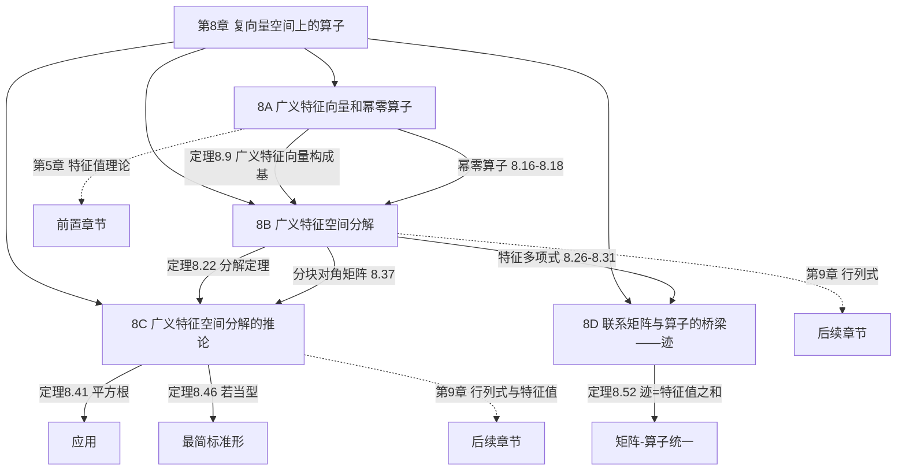
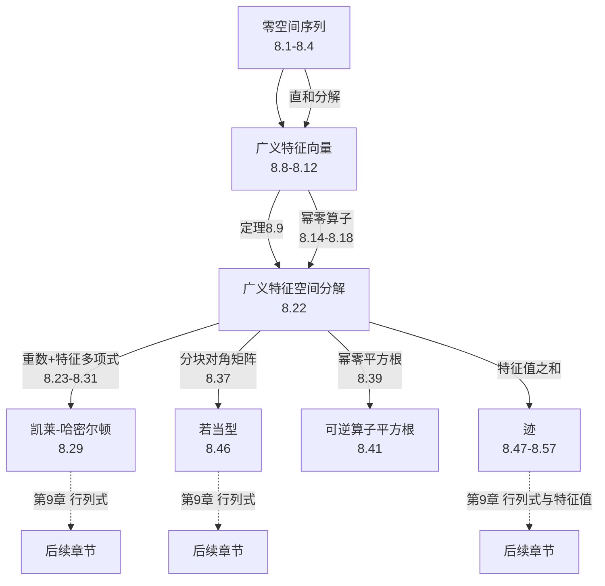

# 第 8 章 复向量空间上的算子 — 章节汇总

> [!abstract] 全章概览
> 第 8 章是线性代数算子理论的"终极武器库"——它将第 5 章在复向量空间上开启的算子结构研究推向最高潮。本章引入==广义特征向量==作为特征向量的推广，证明每个复算子都有足够多的广义特征向量构成基（定理 8.9），由此建立==广义特征空间分解==（定理 8.22），推导出特征多项式与凯莱-哈密尔顿定理，最终以若当标准型（定理 8.46）给出每个复算子的"最简标准形"。末节以==迹==为桥梁，统一矩阵语言与算子语言。
>
> **逻辑链条**：零空间序列（8.1-8.4）→ ==广义特征向量==（定义 8.8, 定理 8.9）→ 幂零算子（定义 8.14, 定理 8.16-8.18）→ ==广义特征空间分解==（定理 8.22）→ 重数（定义 8.23, 定理 8.25）→ 特征多项式（定义 8.26, 定理 8.28-8.31）→ ==凯莱-哈密尔顿定理==（定理 8.29）→ 分块对角矩阵（定理 8.37）→ 平方根（定理 8.41）→ ==若当基==（定义 8.44, 定理 8.45-8.46）→ ==迹==（定义 8.47/8.51, 定理 8.49-8.57）
>
> **核心主线**：广义特征向量是特征向量的推广 → 广义特征空间分解将 $V$ 按特征值"切块" → 若当型是最精细的标准形 → 迹是矩阵与算子之间的桥梁

---

## 一、全章知识框架思维导图

---

## 二、全章核心知识点与重点公式汇总

### 8A 广义特征向量和幂零算子（[[8A 广义特征向量和幂零算子]]）

| 定理/定义 | 内容 | 编号 |
|:---|:---|:---:|
| ==**递增的零空间序列**== | $\{0\}=\text{null}\,T^0\subseteq\text{null}\,T^1\subseteq\cdots$ | 8.1 |
| ==**零空间序列中的等式**== | 若 $\text{null}\,T^m=\text{null}\,T^{m+1}$，则后续全等 | 8.2 |
| ==**零空间停止增长**== | $\text{null}\,T^{\dim V}=\text{null}\,T^{\dim V+1}=\cdots$ | 8.3 |
| ==**$V=\text{null}\,T^{\dim V}\oplus\text{range}\,T^{\dim V}$**== | 零空间与值域的直和分解（用 $T^{\dim V}$ 代替 $T$） | 8.4 |
| ==**广义特征向量**== | $(T-\lambda I)^k v=0$，$v\neq0$，$k$ 为某正整数 | 定义 8.8 |
| ==**广义特征向量构成基**== | 复向量空间上，每个算子都有由广义特征向量构成的基 | 8.9 |
| 广义特征向量对应唯一特征值 | 一个广义特征向量只属于一个特征值 | 8.11 |
| ==**广义特征向量线性无关**== | 对应于互异特征值的广义特征向量线性无关 | 8.12 |
| ==**幂零算子**== | 某次幂等于零的算子 | 定义 8.14 |
| $T^{\dim V}=0$（$T$ 幂零时） | $n$ 维空间上幂零算子的 $n$ 次幂为零 | 8.16 |
| 幂零算子的特征值 | 幂零 $\Leftrightarrow$ 唯一特征值为 $0$（$\mathbb{C}$ 上） | 8.17 |
| ==**幂零算子的等价刻画**== | 幂零 $\Leftrightarrow$ 最小多项式 $=z^m$ $\Leftrightarrow$ 存在全零对角线的上三角矩阵 | 8.18 |

### 8B 广义特征空间分解（[[8B 广义特征空间分解]]）

| 定理/定义 | 内容 | 编号 |
|:---|:---|:---:|
| ==**广义特征空间**== $G(\lambda,T)$ | $\{v:(T-\lambda I)^k v=0\}$，是 $V$ 的子空间 | 定义 8.19 |
| ==**$G(\lambda,T)=\text{null}(T-\lambda I)^{\dim V}$**== | 广义特征空间的显式描述 | 8.20 |
| ==**广义特征空间分解**== | $V=G(\lambda_1,T)\oplus\cdots\oplus G(\lambda_m,T)$，每个 $G(\lambda_k,T)$ 不变且 $(T-\lambda_k I)|_{G(\lambda_k,T)}$ 幂零 | 8.22 |
| ==**重数**== | 特征值 $\lambda$ 的重数 $=\dim G(\lambda,T)$ | 定义 8.23 |
| ==**重数之和 $=\dim V$**== | 所有特征值的重数之和等于空间维数 | 8.25 |
| ==**特征多项式**== | $q(z)=(z-\lambda_1)^{d_1}\cdots(z-\lambda_m)^{d_m}$ | 定义 8.26 |
| 特征多项式的次数和零点 | 次数 $=\dim V$，零点 $=$ 特征值 | 8.28 |
| ==**凯莱-哈密尔顿定理**== | $q(T)=0$，算子满足自己的特征方程 | 8.29 |
| 特征多项式是最小多项式的倍 | $q$ 是 $p_{\min}$ 的多项式倍 | 8.30 |
| 重数 $=$ 对角线上出现次数 | 上三角矩阵中 $\lambda$ 出现次数 $=$ 重数 | 8.31 |
| ==**分块对角矩阵**== | 每个对角块 $A_k$ 是 $d_k\times d_k$ 上三角矩阵，对角线全为 $\lambda_k$ | 8.37 |

### 8C 广义特征空间分解的推论（[[8C 广义特征空间分解的推论]]）

| 定理/定义 | 内容 | 编号 |
|:---|:---|:---:|
| $I+T$ 有平方根（$T$ 幂零时） | 利用泰勒级数截断构造有限和 | 引理 8.39 |
| ==**复空间上可逆算子有平方根**== | 利用广义特征空间分解 + 幂零平方根拼接 | 8.41 |
| ==**若当基**== | 使 $T$ 具有若当块分块对角矩阵的基 | 定义 8.44 |
| ==**幂零算子有若当基**== | 对偶空间构造补空间 + 归纳法 | 8.45 |
| ==**若当型（Jordan Form）**== | 每个复算子都有若当基，从而有若当型 | 8.46 |

### 8D 联系矩阵与算子的桥梁——迹（[[8D 联系矩阵与算子的桥梁——迹]]）

| 定理/定义 | 内容 | 编号 |
|:---|:---|:---:|
| ==**矩阵的迹**== | $\text{tr}\,A=\sum_{j=1}^n A_{j,j}$，对角线元素之和 | 定义 8.47 |
| ==**$\text{tr}(AB)=\text{tr}(BA)$**== | 循环迹性质，$A$ 和 $B$ 甚至可以不同维数 | 8.49 |
| ==**迹不依赖基的选取**== | 利用换基公式 $+$ 循环迹性质证明 | 8.50 |
| ==**算子的迹**== | $\text{tr}\,T=\text{tr}\,\mathcal{M}(T)$，基无关 | 定义 8.51 |
| ==**$\text{tr}\,T=$ 特征值之和**== | 各特征值出现次数等于其重数 | 8.52 |
| 迹与特征多项式 | $\text{tr}\,T$ 是 $z^{n-1}$ 项系数的相反数 | 8.54 |
| 内积空间上的迹 | $\text{tr}\,T=\sum\langle Te_k,e_k\rangle$（规范正交基） | 8.55 |
| ==**迹的线性性**== | $\text{tr}$ 是线性泛函，且 $\text{tr}(ST)=\text{tr}(TS)$ | 8.56 |
| ==**$ST-TS\neq I$**== | 不存在算子使 $ST-TS=I$（有限维） | 8.57 |

---

## 三、章节学习脉络梳理

### 3.1 第一层：零空间序列——"逐步消灭"的数学刻画（8A 前半）

**核心问题**：算子的幂反复作用后，零空间如何变化？

- 定理 8.1：零空间序列 $\text{null}\,T^0\subseteq\text{null}\,T^1\subseteq\cdots$ 单调递增——被"消灭"的向量只会越来越多
- 定理 8.2：一旦相邻两项相等，后续永远相等——"水桶满了就不再涨"
- 定理 8.3：零空间在 $\dim V$ 步之内停止增长——显式的上界
- 定理 8.4：$V=\text{null}\,T^{\dim V}\oplus\text{range}\,T^{\dim V}$——注意 $\text{null}\,T\oplus\text{range}\,T$ 一般不成立！需要用 $T^{\dim V}$

**关键收获**：零空间序列的递增性和停止增长性质是整个广义特征向量理论的基石。定理 8.4 的直和分解是定理 8.9（广义特征向量构成基）的归纳法证明中的关键工具。

### 3.2 第二层：广义特征向量——特征向量的"升级版"（8A 后半）

**核心问题**：当特征向量不够用时怎么办？

- 定义 8.8：广义特征向量允许 $(T-\lambda I)^k v=0$（$k>1$），条件比特征向量更宽松
- ==定理 8.9==（核心定理）：复向量空间上，每个算子都有由广义特征向量构成的基——这是全章最重要的定理之一
- 定理 8.11：每个广义特征向量只对应唯一特征值——不会"归属混乱"
- 定理 8.12：对应于互异特征值的广义特征向量线性无关——与 5.11 的证明结构完全类似

**关键收获**：广义特征向量是解决"特征向量不够"问题的完美方案。在复向量空间上，虽然不是每个算子都可对角化，但每个算子都有足够多的广义特征向量来构成基。

### 3.3 第三层：幂零算子——"终将归零"的算子（8A 末尾）

**核心问题**：什么样的算子"终将归零"？

- 定义 8.14：幂零算子——某次幂等于零
- 定理 8.16：$T^{\dim V}=0$——统一的幂次上界
- 定理 8.17：幂零 $\Leftrightarrow$ 唯一特征值为 $0$（$\mathbb{C}$ 上）
- 定理 8.18：幂零 $\Leftrightarrow$ 最小多项式 $=z^m$ $\Leftrightarrow$ 存在全零对角线的上三角矩阵——三种等价刻画

**关键收获**：幂零算子是广义特征空间分解中的"核心组件"——在每个 $G(\lambda_k,T)$ 上，$T-\lambda_k I$ 都是幂零的。理解幂零算子是理解若当型的前提。

### 3.4 第四层：广义特征空间分解——"按特征值切块"（8B）

**核心问题**：如何将整个空间按算子的行为"切块"？

- 定义 8.19 + 定理 8.20：$G(\lambda,T)=\text{null}(T-\lambda I)^{\dim V}$——广义特征空间是零空间，因此是子空间
- ==定理 8.22==（核心定理）：$V=G(\lambda_1,T)\oplus\cdots\oplus G(\lambda_m,T)$——每个 $G(\lambda_k,T)$ 不变且 $(T-\lambda_k I)|_{G(\lambda_k,T)}$ 幂零
- 定义 8.23 + 定理 8.25：重数 $=\dim G(\lambda,T)$，重数之和 $=\dim V$
- 定义 8.26 + 定理 8.28：特征多项式 $q(z)=(z-\lambda_1)^{d_1}\cdots(z-\lambda_m)^{d_m}$，次数 $=\dim V$
- ==定理 8.29==（凯莱-哈密尔顿定理）：$q(T)=0$——算子满足自己的特征方程
- 定理 8.31：特征值的重数等于其在上三角矩阵对角线上出现的次数
- 定理 8.37：分块对角矩阵——每个对角块对应一个广义特征空间

**关键收获**：广义特征空间分解是全章的核心结果，它将算子在每个不变子空间上的行为简化为"特征值 $+$ 幂零分量"的形式。凯莱-哈密尔顿定理是其最重要的推论之一。

### 3.5 第五层：若当型——"最简标准形"（8C）

**核心问题**：每个复算子的"最简矩阵表示"是什么？

- 引理 8.39 + 定理 8.41：复空间上每个可逆算子都有平方根——利用幂零算子的泰勒级数截断
- 定义 8.44：若当基——使 $T$ 具有若当块分块对角矩阵的基
- ==定理 8.45==：每个幂零算子都有若当基——通过对偶空间构造补空间的归纳法
- ==定理 8.46==（若当型）：每个复算子都有若当基——广义特征空间分解 $+$ 幂零算子的若当基

**关键收获**：若当型是复算子理论的最高成就——它给出了比上三角矩阵更精细的"最简标准形"。每个若当块的结构完全由特征值和链长决定，是算子结构的终极刻画。

### 3.6 第六层：迹——矩阵与算子的"统一语言"（8D）

**核心问题**：如何统一矩阵语言和算子语言？

- 定义 8.47 + 定理 8.49：矩阵的迹 $=$ 对角线之和，且 $\text{tr}(AB)=\text{tr}(BA)$——循环迹性质
- 定理 8.50 + 定义 8.51：算子的迹不依赖基的选取——利用换基公式 $+$ 循环迹性质
- ==定理 8.52==：$\text{tr}\,T=$ 特征值之和——迹蕴含了算子的全局信息
- 定理 8.54：迹是特征多项式中 $z^{n-1}$ 项系数的相反数
- 定理 8.56：迹是线性泛函，且 $\text{tr}(ST)=\text{tr}(TS)$
- 定理 8.57：$ST-TS\neq I$——有限维空间上的基本限制

**关键收获**：迹是连接矩阵与算子的桥梁——它既可以从矩阵角度计算（对角线之和），也可以从算子角度理解（特征值之和），两种视角通过循环迹性质完美统一。

### 3.7 四节之间的深层联系

#### 3.7.1 广义特征向量构成基（8.9）——全章的枢纽

定理 8.9 是全章的逻辑枢纽，它串联了几乎所有重要结果：

- 推出广义特征空间分解（8.22）：$V$ 中每个向量都是广义特征向量的有限和，结合线性无关性（8.12）得直和分解
- 推出特征多项式的定义（8.26）：重数 $=\dim G(\lambda,T)$，由直和维数公式得重数之和 $=\dim V$
- 推出凯莱-哈密尔顿定理（8.29）：在每个 $G(\lambda_k,T)$ 上 $(T-\lambda_k I)^{d_k}=0$，因子可交换
- 推出若当型（8.46）：先分解为广义特征空间，再在每个空间上找若当基

#### 3.7.2 幂零算子——分解的"核心组件"

8A 的幂零算子理论在后续每一节中都发挥关键作用：

- 8.22(b)：$(T-\lambda_k I)|_{G(\lambda_k,T)}$ 是幂零的——这是分解定理的关键部分
- 8.29 的证明：幂零性保证 $(T-\lambda_k I)^{d_k}|_{G(\lambda_k,T)}=0$
- 8.37 的证明：幂零算子的上三角矩阵刻画（8.18）给出分块对角矩阵的形式
- 8.45：幂零算子的若当基是若当型定理的证明核心
- 8.39：幂零算子的泰勒级数截断技巧用于构造平方根

#### 3.7.3 迹——全章的"收尾之笔"

8D 的迹理论为全章提供了一个统一的计算工具：

- $\text{tr}\,T=$ 特征值之和（8.52）：可以直接验证特征值计算的正确性
- $\text{tr}(AB)=\text{tr}(BA)$（8.49）：是证明基无关性（8.50）的关键
- 特征多项式 $q(z)=z^n-(\text{tr}\,T)z^{n-1}+\cdots+(-1)^n\det T$（8.54）：连接迹与行列式
- $\text{tr}(ST)=\text{tr}(TS)$（8.56）：推出 $ST-TS\neq I$（8.57），量子力学对易关系的基础

#### 3.7.4 全章核心线索图

---

## 四、补充理解与跨章展望

### 4.1 第 8 章的核心方法论

第 8 章建立的方法论是算子结构理论的巅峰：

1. **"广义化"策略**：当特征向量不够用时，将其推广为广义特征向量——放宽条件（允许 $(T-\lambda I)^k v=0$ 而非仅 $(T-\lambda I)v=0$），换取更强的存在性保证。这一策略在数学中极为常见：从整数到有理数、从实数到复数、从函数到广义函数，都是类似的"放宽条件以获得更好性质"的思路。

2. **"分解-归约"策略**：将 $V$ 分解为 $G(\lambda_1,T)\oplus\cdots\oplus G(\lambda_m,T)$，在每个不变子空间上分别研究算子的行为。这是线性代数中最强大的方法论之一——从第 5 章的上三角化（分解为一维不变子空间的直和，但需要特征向量足够多）到第 7 章的谱定理（分解为特征空间的直和，但需要正规性条件），再到第 8 章的广义特征空间分解（对任意复算子都成立），"分解"策略一步步放宽条件，最终达到最一般的结论。

3. **"幂零性截断"技巧**：幂零算子 $T^m=0$ 将无限过程截断为有限和——泰勒级数变为有限多项式。这一技巧在引理 8.39（平方根的构造）中体现得淋漓尽致，也是泛函分析中谱理论的基本思想。

### 4.2 第 8 章与前后章节的关联地图

| 第 8 章概念 | 前置章节中的来源 | 后续章节中的深化 |
|---|---|---|
| 零空间序列 | 第 3 章：[[3B 零空间和值域]]（零空间、值域、基本定理） | — |
| 广义特征向量 | 第 5 章：[[5A 不变子空间、特征值和特征向量]]（特征向量、不变子空间） | — |
| 幂零算子 | 第 5 章：[[5B 最小多项式]]（最小多项式 $=z^m$） | — |
|| 广义特征空间分解 | 第 5 章：[[5C 上三角矩阵]]（上三角矩阵、特征值与对角元） | 第 9 章：[[9C 行列式]]（行列式定义的特征多项式） |
|| 特征多项式 | 第 5 章：[[5B 最小多项式]]（零化多项式、最小多项式） | 第 9 章：[[9C 行列式]]（$q(z)=\det(zI-T)$） |
|| 凯莱-哈密尔顿定理 | 第 5 章：[[5B 最小多项式]]（5.29：最小多项式整除零化多项式） | 第 9 章：[[9C 行列式]]（行列式证明版本） |
|| 分块对角矩阵 | 第 3 章：[[3D 可逆性和同构]]（换基公式 $A=C^{-1}BC$） | — |
|| 若当型 | 第 5 章：[[5D 可对角化算子]]（对角化是若当型的特例） | — |
|| 迹 | 第 3 章：[[3C 矩阵]]（矩阵乘法、换基公式） | 第 9 章：[[9C 行列式]]（$\det T=\prod\lambda_k$） |
|| $\text{tr}(AB)=\text{tr}(BA)$ | 第 3 章：[[3C 矩阵]]（矩阵乘法定义） | — |
|| 迹 $=$ 特征值之和 | 第 8 章：[[8B 广义特征空间分解]]（重数、特征多项式） | 第 9 章：[[9C 行列式]]（Vieta 公式） |

### 4.3 为什么第 8 章是算子理论的"终极篇章"？

第 8 章完成了复向量空间上算子结构理论的全部核心目标：

- **广义特征空间分解**（8.22）：回答了"如何将任意复算子分解为简单部分"这一根本问题。每个部分上，算子的行为是"特征值 $+$ 幂零分量"——这是最简洁的描述。

- **若当型**（8.46）：给出了每个复算子的"最简标准形"。若当块的结构完全由特征值和链长决定，没有任何多余信息。这是算子分类的终极结果——两个算子有相同的若当型当且仅当它们"本质上相同"（相似）。

- **凯莱-哈密尔顿定理**（8.29）：算子满足自己的特征方程——这一结果在控制论、微分方程、矩阵函数等领域有广泛应用。

- **迹**（8.51）：提供了矩阵与算子之间的统一语言。迹是相似不变量（$\text{tr}\,T$ 不依赖基），是特征值的基本对称函数，也是量子力学中可观测量的原型。

可以毫不夸张地说：==第 8 章将第 5 章开启的复算子结构研究推向了完美的终点——每个复算子都可以被完全理解和精确分类==。

---

## 五、全章总复习题

> [!info] 使用说明
> 以下复习题覆盖第 8 章全部四节的核心知识点。建议在不查阅笔记的情况下独立完成，然后对照答案自评。每题标注了考查的节次和知识点。

### A. 广义特征向量和幂零算子（8A）

**A1**. 设 $T\in\mathcal{L}(\mathbb{C}^4)$，$T(z_1,z_2,z_3,z_4)=(z_2,z_3,0,0)$。求 $T$ 的特征值和广义特征空间。

查看解答

**特征值**：$T$ 关于标准基的矩阵为
$$\mathcal{M}(T)=\begin{pmatrix}0&1&0&0\\0&0&1&0\\0&0&0&0\\0&0&0&0\end{pmatrix}$$
对角线元素全为 $0$，故唯一特征值为 $0$。

**广义特征空间**：$G(0,T)=\text{null}\,T^4$。计算 $T^2(z_1,z_2,z_3,z_4)=(z_3,0,0,0)$，$T^3(z_1,z_2,z_3,z_4)=(0,0,0,0)$。

所以 $\text{null}\,T^3=\mathbb{C}^4$，即 $G(0,T)=\mathbb{C}^4$。

重数 $=\dim G(0,T)=4=\dim\mathbb{C}^4$。$\blacksquare$

**A2**. 设 $T\in\mathcal{L}(V)$ 是幂零的。证明 $T$ 没有非零的不变子空间 $U$ 使得 $T|_U$ 是可逆的。

查看解答

设 $U$ 是 $T$ 的不变子空间且 $T|_U$ 可逆。那么 $T|_U$ 是单射。

但 $T$ 是幂零的，故存在 $m$ 使得 $T^m=0$。于是 $(T|_U)^m=0$，即 $T|_U$ 是幂零的。

由 8.17(a)，$T|_U$ 的唯一特征值为 $0$。但可逆算子的所有特征值非零，矛盾。

因此不存在这样的 $U$。$\blacksquare$

### B. 广义特征空间分解（8B）

**B1**. 设 $T\in\mathcal{L}(\mathbb{C}^3)$，$T(z_1,z_2,z_3)=(2z_1+z_2,\,2z_2,\,3z_3)$。求 $T$ 的广义特征空间分解和特征多项式。

查看解答

**矩阵**：$\mathcal{M}(T)=\begin{pmatrix}2&1&0\\0&2&0\\0&0&3\end{pmatrix}$

**特征值**：对角线元素为 $2,2,3$，故特征值为 $2$（重数 $2$）和 $3$（重数 $1$）。

**广义特征空间**：
- $G(2,T)$：$(T-2I)(z_1,z_2,z_3)=(z_2,0,0)$，$(T-2I)^2=0$，故 $G(2,T)=\text{null}(T-2I)^2=\mathbb{C}^2\times\{0\}$，$\dim=2$
- $G(3,T)$：$(T-3I)(z_1,z_2,z_3)=(-z_1+z_2,-z_3,0)$，$\text{null}(T-3I)=\{(a,a,0):a\in\mathbb{C}\}$，但 $\dim G(3,T)=1$，故 $G(3,T)=\text{span}((1,1,0))$... 

更精确地：$G(3,T)=\{v:(T-3I)^3 v=0\}$。由于 $3$ 的重数为 $1$，$G(3,T)=\text{null}(T-3I)$。

$(T-3I)(z_1,z_2,z_3)=(-z_1+z_2,-z_3,0)=0$ 得 $z_3=0$，$z_1=z_2$。故 $G(3,T)=\text{span}((1,1,0))$。

**分解**：$\mathbb{C}^3=G(2,T)\oplus G(3,T)$，其中 $G(2,T)=\text{span}((1,0,0),(0,1,0))$，$G(3,T)=\text{span}((1,1,0))$。

**特征多项式**：$q(z)=(z-2)^2(z-3)$。$\blacksquare$

**B2**. 设 $T\in\mathcal{L}(\mathbb{C}^4)$ 有特征值 $1$（重数 $3$）和 $2$（重数 $1$）。写出 $T$ 的特征多项式和最小多项式的所有可能形式。

查看解答

**特征多项式**：$q(z)=(z-1)^3(z-2)$。

**最小多项式**：$p_{\min}(z)$ 整除 $q(z)$，且包含 $q(z)$ 的所有因子。

由 8.30，$q$ 是 $p_{\min}$ 的多项式倍，故 $p_{\min}\mid q$。

$p_{\min}$ 的可能形式：
- $(z-1)(z-2)$：$T$ 可对角化（每个若当块都是 $1\times1$）
- $(z-1)^2(z-2)$：对应 $1$ 的最大若当块为 $2\times2$
- $(z-1)^3(z-2)$：对应 $1$ 的最大若当块为 $3\times3$（一个 $3\times3$ 若当块）

注意 $p_{\min}$ 必须包含 $(z-2)$ 因子（因为 $2$ 是特征值），也必须包含 $(z-1)$ 因子。$\blacksquare$

### C. 若当型与推论（8C）

**C1**. 写出所有可能的 $3\times3$ 若当型矩阵，使其特征值全为 $\lambda$。

查看解答

所有可能的若当型（不计若当块排列顺序）：

1. 三个 $1\times1$ 块（可对角化）：
$$\begin{pmatrix}\lambda&0&0\\0&\lambda&0\\0&0&\lambda\end{pmatrix}$$

2. 一个 $2\times2$ 块 $+$ 一个 $1\times1$ 块：
$$\begin{pmatrix}\lambda&1&0\\0&\lambda&0\\0&0&\lambda\end{pmatrix}$$

3. 一个 $3\times3$ 块：
$$\begin{pmatrix}\lambda&1&0\\0&\lambda&1\\0&0&\lambda\end{pmatrix}$$

分别对应最小多项式 $(z-\lambda)$、$(z-\lambda)^2$、$(z-\lambda)^3$。$\blacksquare$

**C2**. 设 $T\in\mathcal{L}(\mathbb{C}^3)$ 可逆。证明 $T$ 有平方根，并说明为什么这个结论在 $\mathbb{R}^3$ 上不成立。

查看解答

**复空间上的证明**（定理 8.41）：

设 $\lambda_1,\ldots,\lambda_m$ 是 $T$ 的互异特征值。由 8.22，$V=G(\lambda_1,T)\oplus\cdots\oplus G(\lambda_m,T)$。

因为 $T$ 可逆，所有 $\lambda_k\neq0$。在每个 $G(\lambda_k,T)$ 上，$T|_{G(\lambda_k,T)}=\lambda_k I+N_k$，其中 $N_k$ 幂零。

由引理 8.39，$I+N_k/\lambda_k$ 有平方根。取 $\sqrt{\lambda_k}\in\mathbb{C}$，则 $\sqrt{\lambda_k}\cdot\sqrt{I+N_k/\lambda_k}$ 是 $T|_{G(\lambda_k,T)}$ 的平方根。

将各块上的平方根拼接，得到 $T$ 的平方根。

**实空间上的反例**：

$\mathbb{R}^1$ 上"乘以 $-1$"的算子没有实平方根——因为 $\sqrt{-1}\notin\mathbb{R}$。$\blacksquare$

### D. 迹（8D）

**D1**. 设 $A=\begin{pmatrix}1&2\\3&4\end{pmatrix}$，$B=\begin{pmatrix}5&6\\7&8\end{pmatrix}$。验证 $\text{tr}(AB)=\text{tr}(BA)$。

查看解答

$$AB=\begin{pmatrix}19&22\\43&50\end{pmatrix},\quad \text{tr}(AB)=19+50=69$$

$$BA=\begin{pmatrix}23&34\\31&46\end{pmatrix},\quad \text{tr}(BA)=23+46=69$$

$\text{tr}(AB)=\text{tr}(BA)=69$。$\blacksquare$

**D2**. 设 $T\in\mathcal{L}(\mathbb{C}^3)$ 的特征值为 $2,2,5$。求 $\text{tr}\,T$ 和 $T$ 的特征多项式。

查看解答

由定理 8.52：$\text{tr}\,T=2+2+5=9$。

特征多项式：$q(z)=(z-2)^2(z-5)=(z-2)(z^2-7z+10)=z^3-9z^2+24z-20$。

验证：$z^2$ 项系数的相反数 $=9=\text{tr}\,T$（定理 8.54）。$\blacksquare$

**D3**. 证明：不存在 $S,T\in\mathcal{L}(V)$ 使得 $ST-TS=I$。

查看解答

假设存在 $S,T$ 使得 $ST-TS=I$。

两边取迹：$\text{tr}(ST-TS)=\text{tr}\,I$。

左边 $=\text{tr}(ST)-\text{tr}(TS)=0$（由定理 8.56，$\text{tr}(ST)=\text{tr}(TS)$）。

右边 $=\dim V\neq0$。

矛盾！故不存在这样的 $S,T$。$\blacksquare$

### E. 跨节综合题

**E1**. 设 $T\in\mathcal{L}(\mathbb{C}^5)$ 的最小多项式为 $(z-3)^2(z+1)$。求 $T$ 的特征值、各特征值的重数、特征多项式和 $\text{tr}\,T$ 所需的额外信息。

查看解答

**特征值**：$3$ 和 $-1$（最小多项式的根）。

**重数**：
- $3$ 的重数 $\geq2$（因为最小多项式中 $(z-3)$ 的幂次为 $2$）
- $-1$ 的重数 $\geq1$
- 重数之和 $=5$（定理 8.25）

所以 $3$ 的重数可以是 $2,3,$ 或 $4$，$-1$ 的重数相应为 $3,2,$ 或 $1$。

**特征多项式**：$q(z)=(z-3)^{d_1}(z+1)^{d_2}$，其中 $d_1+d_2=5$，$d_1\geq2$，$d_2\geq1$。

**$\text{tr}\,T$**：$\text{tr}\,T=3d_1+(-1)d_2=3d_1-d_2=3d_1-(5-d_1)=4d_1-5$。

需要知道 $d_1$（即 $3$ 的重数）才能确定 $\text{tr}\,T$ 的具体值。$\blacksquare$

**E2**. 设 $T\in\mathcal{L}(\mathbb{C}^4)$ 有若当型 $\begin{pmatrix}2&1&0&0\\0&2&0&0\\0&0&2&1\\0&0&0&2\end{pmatrix}$。求 $T$ 的特征多项式、最小多项式、$\text{tr}\,T$ 和 $\det T$。

查看解答

**特征多项式**：特征值 $2$ 的重数 $=4$，故 $q(z)=(z-2)^4$。

**最小多项式**：最大若当块为 $2\times2$，故 $p_{\min}(z)=(z-2)^2$。

**$\text{tr}\,T$**：$2+2+2+2=8$。

**$\det T$**：$2\times2\times2\times2=16$。

验证：$q(z)=(z-2)^4=z^4-8z^3+\cdots+16$，$z^3$ 系数的相反数 $=8=\text{tr}\,T$，常数项 $=16=\det T$。$\blacksquare$

---

## 六、各节笔记索引

| 节 | 笔记链接 | 核心主题 |
|:---:|:---|:---|
| 8A | [[8A 广义特征向量和幂零算子]] | ==零空间序列==、==广义特征向量==、==幂零算子== |
| 8B | [[8B 广义特征空间分解]] | ==广义特征空间分解==、==特征多项式==、==凯莱-哈密尔顿定理==、分块对角矩阵 |
| 8C | [[8C 广义特征空间分解的推论]] | ==若当基==、==若当型==、可逆算子的平方根 |
| 8D | [[8D 联系矩阵与算子的桥梁——迹]] | ==矩阵的迹==、==算子的迹==、==$\text{tr}(AB)=\text{tr}(BA)$==、$\text{tr}\,T=$ 特征值之和 |

---

## 七、全章核心公式

> [!success] 必须熟记的公式与定理

1. ==**广义特征空间分解**==（定理 8.22）：$V = G(\lambda_1, T) \oplus \cdots \oplus G(\lambda_m, T)$
2. ==**广义特征空间的描述**==（定理 8.20）：$G(\lambda, T) = \text{null}(T - \lambda I)^{\dim V}$
3. ==**广义特征向量构成基**==（定理 8.9）：复向量空间上每个算子都有由广义特征向量构成的基
4. ==**凯莱-哈密尔顿定理**==（定理 8.29）：$q(T) = 0$，算子满足自己的特征方程
5. ==**特征多项式**==（定义 8.26）：$q(z) = (z - \lambda_1)^{d_1} \cdots (z - \lambda_m)^{d_m}$
6. **重数之和**（定理 8.25）：$\sum d_k = \dim V$
7. ==**$\text{tr}(AB) = \text{tr}(BA)$**==（定理 8.49）：循环迹性质
8. ==**$\text{tr}\,T = $ 特征值之和**==（定理 8.52）：各特征值出现次数等于其重数
9. ==**若当型**==（定理 8.46）：每个复算子都有若当基
10. **特征多项式的展开**（定理 8.54）：$q(z) = z^n - (\text{tr}\,T)\,z^{n-1} + \cdots + (-1)^n \det T$

> [!warning] 易错提醒
> - $V = \text{null}\,T \oplus \text{range}\,T$ 一般不成立！需要用 $T^{\dim V}$ 代替 $T$（定理 8.4）
> - 广义特征值不是一个新概念——$(T-\lambda I)^k$ 不是单射当且仅当 $T-\lambda I$ 不是单射，即 $\lambda$ 就是特征值
> - 幂零算子的特征值唯一为 $0$，但"唯一特征值为 $0$"蕴含幂零性仅在 $\mathbb{C}$ 上成立（8.17(b)）
> - 凯莱-哈密尔顿定理的证明关键：因子可交换 + 在每个 $G(\lambda_k, T)$ 上分别验证
> - 若当基中向量的排列顺序很重要——从高次幂到低次幂排列才能使 $1$ 出现在超对角线上
> - 定理 8.41（可逆算子有平方根）在实向量空间上不成立
> - $\text{tr}(AB) = \text{tr}(BA)$ 中 $AB$ 和 $BA$ 甚至可以不同维数
> - $ST - TS \neq I$ 仅在有限维成立，无限维上可以成立（量子力学对易关系）

#学习/线性代数/复向量空间上的算子
