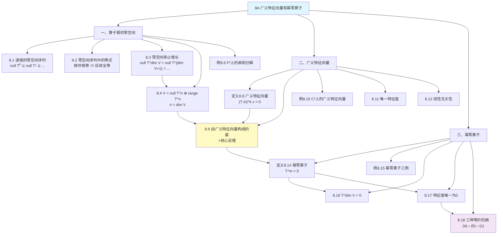

# 8A 广义特征向量和幂零算子

> [!abstract] 本节概览
> 本节是第8章的**基础工具篇**，为后续的广义特征空间分解和Jordan标准型奠定核心基础。逻辑链条如下：
>
> 1. **算子幂的零空间**（8.1-8.4）$\to$ 零空间序列递增、一旦相邻相等则后续全等、在 $\dim V$ 处停止增长、$V = \text{null}\, T^{\dim V} \oplus \text{range}\, T^{\dim V}$
> 2. **广义特征向量**（定义8.8, 8.9-8.12）$\to$ 放宽特征向量条件，在复向量空间上保证能构成基
> 3. **幂零算子**（定义8.14, 8.15-8.18）$\to$ 某次幂为零的算子，特征值唯一为0，与上三角矩阵的刻画
>
> **核心主线**：零空间序列 $\to$ 广义特征向量（核心定理8.9）$\to$ 幂零算子（特殊情形）。
>
> **前置依赖**：[[5A 不变子空间、特征值和特征向量]]（特征值、特征向量、不变子空间）、[[5B 最小多项式]]（最小多项式）、[[5C 上三角矩阵]]（上三角矩阵、特征值与对角元）、[[3B 零空间和值域]]（零空间、值域、线性映射基本定理）。

---

## 一、算子幂的零空间

我们从研究算子的幂的零空间开启本章。这一小节的结果是后续广义特征向量理论的基石。

> [!video] 视频精要
> **[P90 - 8A(1)：幂的零空间](https://www.bilibili.com/video/BV1Vg411G7cz?p=90)**（48:19）
>
> 本节视频对应教材定理 8.1--8.4 和例 8.6，重点讲解零空间序列的递增性质和直和分解。

### 递增的零空间序列

> [!thm] 定理 8.1：递增的零空间序列
>
> 设 $T \in \mathcal{L}(V)$。那么
>
> $$\{0\} = \text{null}\, T^0 \subseteq \text{null}\, T^1 \subseteq \cdots \subseteq \text{null}\, T^k \subseteq \text{null}\, T^{k+1} \subseteq \cdots.$$

> [!abstract] 证明思路
>
> **[零空间递增性]：** 设 $k$ 是非负整数，且 $v \in \text{null}\, T^k$。那么 $T^k v = 0$，这表明 $T^{k+1} v = T(T^k v) = T(0) = 0$。从而 $v \in \text{null}\, T^{k+1}$。因此 $\text{null}\, T^k \subseteq \text{null}\, T^{k+1}$。

**直觉理解**：$T^k$ 作用在 $v$ 上如果已经归零了，那么多作用一次 $T$（即 $T^{k+1}$）自然还是零。所以被"消灭"的向量集合只会越来越大，不会缩小。

### 零空间序列中的等式

> [!thm] 定理 8.2：零空间序列中的等式
>
> 设 $T \in \mathcal{L}(V)$，$m$ 是非负整数，满足 $\text{null}\, T^m = \text{null}\, T^{m+1}$。那么
>
> $$\text{null}\, T^m = \text{null}\, T^{m+1} = \text{null}\, T^{m+2} = \text{null}\, T^{m+3} = \cdots.$$

> [!abstract] 证明思路
>
> **[目标]：** 证明 $\text{null}\, T^{m+k} = \text{null}\, T^{m+k+1}$ 对任意正整数 $k$ 成立。
>
> 由 8.1，已知 $\text{null}\, T^{m+k} \subseteq \text{null}\, T^{m+k+1}$。
>
> **[反向包含]：** 设 $v \in \text{null}\, T^{m+k+1}$。那么
> $$T^{m+1}(T^k v) = T^{m+k+1} v = 0.$$
> 因此 $T^k v \in \text{null}\, T^{m+1} = \text{null}\, T^m$（利用已知等式）。
>
> 于是 $T^{m+k} v = T^m(T^k v) = 0$，意味着 $v \in \text{null}\, T^{m+k}$。
>
> **[结论]：** $\text{null}\, T^{m+k+1} \subseteq \text{null}\, T^{m+k}$，结合正向包含得等式。

**直觉理解**：一旦零空间"停止增长"（相邻两项相等），它就永远不会再增长了。就像水桶装水，一旦满了，再倒也不会更多。

### 零空间停止增长

> [!thm] 定理 8.3：零空间停止增长
>
> 设 $T \in \mathcal{L}(V)$。那么
>
> $$\text{null}\, T^{\dim V} = \text{null}\, T^{\dim V+1} = \text{null}\, T^{\dim V+2} = \cdots.$$

> [!abstract] 证明思路
>
> **[反证法]：** 只需证明 $\text{null}\, T^{\dim V} = \text{null}\, T^{\dim V+1}$（由 8.2 即可推广）。
>
> 假设此式不成立。那么由 8.1 和 8.2，我们有
> $$\{0\} = \text{null}\, T^0 \subsetneq \text{null}\, T^1 \subsetneq \cdots \subsetneq \text{null}\, T^{\dim V} \subsetneq \text{null}\, T^{\dim V+1},$$
> 其中 $\subsetneq$ 表示真包含。
>
> **[维数论证]：** 在每个真包含号处，维数至少增加 1。因此
> $$\dim \text{null}\, T^{\dim V+1} \geq \dim V + 1,$$
> 这与"$V$ 的子空间的维数不超过 $\dim V$"矛盾。

> [!tip] 关键洞察
> 零空间序列最多在 $\dim V$ 步之内就会停止增长。这是一个非常强的结论——它给出了一个==显式的上界==，告诉我们不需要考虑任意高次的幂。

### $V = \text{null}\, T^{\dim V} \oplus \text{range}\, T^{\dim V}$

> [!warning] 注意
> $V = \text{null}\, T \oplus \text{range}\, T$ 并不对每个 $T \in \mathcal{L}(V)$ 都成立。下面的定理给出了一个"好用的替代结论"——用 $T^{\dim V}$ 代替 $T$。

> [!thm] 定理 8.4：$V$ 是 $\text{null}\, T^{\dim V}$ 与 $\text{range}\, T^{\dim V}$ 的直和
>
> 设 $T \in \mathcal{L}(V)$。那么
>
> $$V = \text{null}\, T^{\dim V} \oplus \text{range}\, T^{\dim V}.$$

> [!abstract] 证明思路
>
> 令 $n = \dim V$。
>
> **[第一步：证明交集为零]：** 证明 $(\text{null}\, T^n) \cap (\text{range}\, T^n) = \{0\}$。
>
> 设 $v \in (\text{null}\, T^n) \cap (\text{range}\, T^n)$。那么 $T^n v = 0$，并且存在 $u \in V$ 使得 $v = T^n u$。将 $T^n$ 作用于 $v = T^n u$ 两侧，可得 $T^n v = T^{2n} u$。因此 $T^{2n} u = 0$，由 8.3（零空间在 $n$ 处停止增长），这表明 $T^n u = 0$。于是 $v = T^n u = 0$。
>
> **[第二步：维数论证]：** 由第一步和 [[3B 零空间和值域]] 中的 1.46，$\text{null}\, T^n + \text{range}\, T^n$ 是直和。并且，
> $$\dim(\text{null}\, T^n \oplus \text{range}\, T^n) = \dim \text{null}\, T^n + \dim \text{range}\, T^n = \dim V,$$
> 其中第一个等号源于 3.94，第二个等号来自==线性映射基本定理==（3.21）。
>
> **[结论]：** 维数等于 $\dim V$ 的子空间就是 $V$ 本身（2.39），即 $\text{null}\, T^n \oplus \text{range}\, T^n = V$。

> [!example] 例 8.6：对于 $T \in \mathcal{L}(\mathbb{F}^3)$，$\mathbb{F}^3 = \text{null}\, T^3 \oplus \text{range}\, T^3$
>
> 定义 $T \in \mathcal{L}(\mathbb{F}^3)$ 为 $T(z_1, z_2, z_3) = (4z_2, 0, 5z_3)$。
>
> - $\text{null}\, T = \{(z_1, 0, 0) : z_1 \in \mathbb{F}\}$，$\text{range}\, T = \{(z_1, 0, z_3) : z_1, z_3 \in \mathbb{F}\}$
> - 注意 $\text{null}\, T \cap \text{range}\, T \neq \{0\}$（例如 $(1,0,0)$ 同时属于两者），所以 $\text{null}\, T + \text{range}\, T$ 不是直和！
> - 同时 $\text{null}\, T + \text{range}\, T \neq \mathbb{F}^3$（缺少形如 $(0, z_2, 0)$ 的向量）
>
> 但是，$T^3(z_1, z_2, z_3) = (0, 0, 125z_3)$，所以：
> - $\text{null}\, T^3 = \{(z_1, z_2, 0) : z_1, z_2 \in \mathbb{F}\}$
> - $\text{range}\, T^3 = \{(0, 0, z_3) : z_3 \in \mathbb{F}\}$
>
> 因此 $\mathbb{F}^3 = \text{null}\, T^3 \oplus \text{range}\, T^3$，正如 8.4 所述。

> [!note] 教材注记
> 上述结论的加强版本见习题 19：若 $T$ 不是幂零的，则 $V = \text{null}\, T^{\dim V - 1} \oplus \text{range}\, T^{\dim V - 1}$，即可以少用一次幂。

---

## 二、广义特征向量

仅凭特征向量不足以很好地描述有些算子。在本小节中，我们引入广义特征向量的概念，它将在描述算子的结构方面发挥==决定性作用==。

> [!video] 视频精要
> **[P91 - 8A(2)：广义特征向量和特征空间](https://www.bilibili.com/video/BV1Vg411G7cz?p=91)**（1:01:16）
>
> 本节视频对应教材定义 8.8、定理 8.9--8.12 和例 8.10，是本节最核心的内容。

### 为什么需要推广特征向量？

为了理解为何需要拓展特征向量，我们来回顾 [[5A 不变子空间、特征值和特征向量]] 中的讨论。

取定 $T \in \mathcal{L}(V)$。我们想通过找到一个"好"的直和分解 $V = V_1 \oplus \cdots \oplus V_n$（其中各 $V_k$ 都是 $V$ 的在 $T$ 下不变的子空间）来描述 $T$。

- 最简单的非零不变子空间是一维的
- 当且仅当 $V$ 具有由 $T$ 的特征向量构成的基时，上述直和分解式中各 $V_k$ 才全是 $V$ 的在 $T$ 下不变的一维子空间（见 5.55）
- 这等价于 $V$ 具有==特征空间分解==：
$$V = E(\lambda_1, T) \oplus \cdots \oplus E(\lambda_m, T) \tag{8.7}$$
其中 $\lambda_1, \ldots, \lambda_m$ 是 $T$ 的所有互异特征值

由 [[7B 谱定理]] 可知，若 $V$ 是内积空间，那么形如 (8.7) 的分解对于每个自伴算子（若 $\mathbb{F} = \mathbb{R}$）及每个正规算子（若 $\mathbb{F} = \mathbb{C}$）都成立。

> [!warning] 核心问题
> 然而，对于更一般的算子来说，形如 (8.7) 的分解==不一定成立==，即便在复向量空间上也是如此。比如，[[5A 不变子空间、特征值和特征向量]] 中 5.57 展示的算子的特征向量就不足以使 (8.7) 成立。

**广义特征向量和广义特征空间**正是为了解决这一问题而引入的。

### 广义特征向量的定义

> [!def] 定义 8.8：广义特征向量（Generalized Eigenvector）
>
> 设 $T \in \mathcal{L}(V)$，$\lambda$ 是 $T$ 的特征值。称向量 $v \in V$ 是 $T$ 对应于 $\lambda$ 的**广义特征向量**，若 $v \neq 0$ 且对某个正整数 $k$ 有
>
> $$(T - \lambda I)^k v = 0.$$

> [!info] 补充说明
> - 我们并未定义"广义特征值"，因为这样不会得到任何新东西：若 $(T - \lambda I)^k$ 对于某个正整数 $k$ 不是单射，那么 $T - \lambda I$ 也不是单射，因此 $\lambda$ 就是 $T$ 的特征值。
> - 将 8.1 和 8.3 应用于算子 $T - \lambda I$ 即可得出：非零向量 $v \in V$ 是 $T$ 对应于 $\lambda$ 的广义特征向量，当且仅当 $(T - \lambda I)^{\dim V} v = 0$。这意味着我们==总是可以取 $k = \dim V$==。

> [!tip] 关键洞察
> - 当 $k = 1$ 时，$(T - \lambda I)v = 0$，即 $v$ 是普通的特征向量。所以==特征向量是广义特征向量的特例==
> - 广义特征向量允许 $k > 1$，条件更宽松，因此能提供更多的向量

### 核心定理：由广义特征向量构成的基

> [!thm] 定理 8.9：由广义特征向量构成的基（核心定理！）
>
> 设 $\mathbb{F} = \mathbb{C}$ 且 $T \in \mathcal{L}(V)$。那么存在由 $T$ 的广义特征向量构成的 $V$ 的基。

这是本节最重要的定理，也是整个第8章的基石之一。

> [!abstract] 证明思路
>
> **[归纳法]：** 令 $n = \dim V$，对 $n$ 用归纳法。
>
> **[基础步]：** $n = 1$ 时，$V$ 中每个非零向量都是 $T$ 的特征向量（因为 $\mathbb{C}$ 上每个算子都有特征值），结论成立。
>
> **[归纳步]：** 设 $n > 1$，假设结论在维数更小时成立。
>
> **[选取特征值并分解]：** 设 $\lambda$ 是 $T$ 的特征值（$\mathbb{C}$ 上必存在）。将 8.4 应用于 $T - \lambda I$，可得
> $$V = \text{null}(T - \lambda I)^n \oplus \text{range}(T - \lambda I)^n.$$
>
> **[讨论两种情况]：**
> - 若 $\text{null}(T - \lambda I)^n = V$，则 $V$ 中每个非零向量都是 $T$ 对应于 $\lambda$ 的广义特征向量，结论成立。
> - 若 $\text{null}(T - \lambda I)^n \neq V$，则 $\text{range}(T - \lambda I)^n \neq \{0\}$。
>
> **[关键估计]：** $\text{null}(T - \lambda I)^n \neq \{0\}$（因为 $\lambda$ 是特征值），所以
> $$0 < \dim \text{range}(T - \lambda I)^n < n.$$
>
> **[不变子空间]：** $\text{range}(T - \lambda I)^n$ 在 $T$ 下不变（由 [[5A 不变子空间、特征值和特征向量]] 中的 5.18，取 $p(z) = (z - \lambda)^n$）。
>
> **[应用归纳假设]：** 令 $S \in \mathcal{L}(\text{range}(T - \lambda I)^n)$ 等于限制在 $\text{range}(T - \lambda I)^n$ 上的算子 $T$。将归纳假设应用于 $S$，可得存在由 $S$ 的广义特征向量构成的 $\text{range}(T - \lambda I)^n$ 的基，这些向量当然也是 $T$ 的广义特征向量。
>
> **[合并基]：** 将 $\text{range}(T - \lambda I)^n$ 的这个基与 $\text{null}(T - \lambda I)^n$ 的基合并，就得到了由 $T$ 的广义特征向量构成的 $V$ 的基。

> [!success] 定理 8.9 的意义
> ==在复向量空间上，虽然不是每个算子都有足够多的特征向量来对角化，但每个算子都有足够多的广义特征向量来构成基。== 这是广义特征向量理论的根本价值所在。

> [!note] 实数域的情形
> 若 $\mathbb{F} = \mathbb{R}$ 且 $\dim V > 1$，那么 $V$ 上有些算子的广义特征向量可构成 $V$ 的基，其他算子则不具有该性质。判定条件见习题 11。

### 例题：$\mathbb{C}^3$ 上一算子的广义特征向量

> [!example] 例 8.10：$\mathbb{C}^3$ 上一算子的广义特征向量
>
> 定义 $T \in \mathcal{L}(\mathbb{C}^3)$ 为：对每个 $(z_1, z_2, z_3) \in \mathbb{C}^3$，
> $$T(z_1, z_2, z_3) = (4z_2, 0, 5z_3).$$
>
> **特征值和特征向量：**
> - $T$ 的特征值是 $0$ 和 $5$
> - 对应于 $0$ 的特征向量：形如 $(z_1, 0, 0)$ 的非零向量
> - 对应于 $5$ 的特征向量：形如 $(0, 0, z_3)$ 的非零向量
> - ==特征向量不足以张成 $\mathbb{C}^3$==（缺少 $(0, z_2, 0)$ 方向）
>
> **广义特征向量：**
> - 计算 $T^3(z_1, z_2, z_3) = (0, 0, 125z_3)$
> - 由 8.1 和 8.3，$T$ 对应于特征值 $0$ 的广义特征向量是形如 $(z_1, z_2, 0)$ 的非零向量
> - 计算 $(T - 5I)^3(z_1, z_2, z_3) = (-125z_1 + 300z_2, -125z_2, 0)$
> - $T$ 对应于特征值 $5$ 的广义特征向量是形如 $(0, 0, z_3)$ 的非零向量
>
> **结论：** $\mathbb{C}^3$ 的标准基 $((1,0,0), (0,1,0), (0,0,1))$ 中每个向量都是 $T$ 的广义特征向量。正如 8.9 所言，$\mathbb{C}^3$ 的确具有由 $T$ 的广义特征向量构成的基。

### 广义特征向量对应于唯一的特征值

> [!thm] 定理 8.11：广义特征向量对应于唯一的特征值
>
> 设 $T \in \mathcal{L}(V)$。那么 $T$ 的每个广义特征向量都仅对应于 $T$ 的一个特征值。

> [!abstract] 证明思路
>
> **[反证法]：** 设 $v \in V$ 是同时对应于 $T$ 的两个特征值 $\alpha$ 和 $\lambda$ 的广义特征向量。
>
> 令 $m$ 是满足 $(T - \alpha I)^m v = 0$ 的最小正整数，令 $n = \dim V$。那么
> $$0 = (T - \lambda I)^n v = \bigl((T - \alpha I) + (\alpha - \lambda)I\bigr)^n v = \sum_{k=0}^{n} b_k (\alpha - \lambda)^{n-k} (T - \alpha I)^k v,$$
> 其中 $b_0 = 1$，其余二项式系数 $b_k$ 的值无关紧要。
>
> **[关键操作]：** 将 $(T - \alpha I)^{m-1}$ 作用于上式两边。注意到当 $k \geq m$ 时 $(T - \alpha I)^{m-1}(T - \alpha I)^k v = 0$，而当 $k < m$ 时 $(T - \alpha I)^k v \neq 0$（$m$ 的最小性），所以只有 $k = m - 1$ 的项可能非零。但 $k = m - 1 < m$，所以 $(T - \alpha I)^{m-1}(T - \alpha I)^{m-1} v = (T - \alpha I)^{2m-2} v$。
>
> 更精确地说，作用 $(T - \alpha I)^{m-1}$ 后，所有 $k \geq m$ 的项为零，$k = 0, 1, \ldots, m-2$ 的项中 $(T - \alpha I)^{m-1+k} v = 0$（因为 $m-1+k \geq m$），只剩 $k = 0$ 的项：
> $$0 = (\alpha - \lambda)^n (T - \alpha I)^{m-1} v.$$
>
> 因为 $(T - \alpha I)^{m-1} v \neq 0$（$m$ 的最小性），所以 $\alpha - \lambda = 0$，即 $\alpha = \lambda$。

### 线性无关的广义特征向量

> [!thm] 定理 8.12：线性无关的广义特征向量
>
> 设 $T \in \mathcal{L}(V)$。那么由对应于 $T$ 的互异特征值的广义特征向量构成的每个向量组都是线性无关的。

> [!abstract] 证明思路
>
> **[反证法]：** 设结论不成立。那么存在最小正整数 $m$，使得对应于 $T$ 的互异特征值 $\lambda_1, \ldots, \lambda_m$ 的广义特征向量 $v_1, \ldots, v_m$ 构成线性相关组（注意 $m \geq 2$，因为广义特征向量非零）。
>
> 于是存在全不为 0 的数 $a_1, \ldots, a_m \in \mathbb{F}$（$m$ 最小保证所有系数非零）使得
> $$a_1 v_1 + \cdots + a_m v_m = 0.$$
>
> **[作用算子]：** 令 $n = \dim V$。将 $(T - \lambda_m I)^n$ 作用于上式两侧，可得
> $$a_1 (T - \lambda_m I)^n v_1 + \cdots + a_{m-1} (T - \lambda_m I)^n v_{m-1} = 0. \tag{8.13}$$
>
> **[验证非零性]：** 设 $k \in \{1, \ldots, m-1\}$。那么 $(T - \lambda_m I)^n v_k \neq 0$——否则 $v_k$ 就会成为 $T$ 的同时对应于不同特征值 $\lambda_k$ 和 $\lambda_m$ 的广义特征向量，与 8.11 矛盾。
>
> **[验证广义特征向量性质]：** 又有
> $$(T - \lambda_k I)^n (T - \lambda_m I)^n v_k = (T - \lambda_m I)^n (T - \lambda_k I)^n v_k = 0,$$
> 所以 $(T - \lambda_m I)^n v_k$ 是 $T$ 对应于特征值 $\lambda_k$ 的广义特征向量。
>
> **[导出矛盾]：** 因此 $(T - \lambda_m I)^n v_1, \ldots, (T - \lambda_m I)^n v_{m-1}$ 是由 $m - 1$ 个对应于互异特征值的广义特征向量所构成的线性相关组（由式 (8.13)），这与 $m$ 的最小性矛盾。

> [!note] 与特征向量的类比
> 这个证明的思路与 [[5A 不变子空间、特征值和特征向量]] 中 5.11（对应于不同特征值的特征向量线性无关）的证明完全类似，只是将 $T - \lambda_m I$ 替换为 $(T - \lambda_m I)^n$。

---

## 三、幂零算子

幂零算子是自乘若干次后会等于 0 的算子，在算子结构的研究中扮演着重要的角色。

> [!video] 视频精要
> **[P92 - 8A(3)：幂零算子](https://www.bilibili.com/video/BV1Vg411G7cz?p=92)**（56:28）
>
> 本节视频对应教材定义 8.14、例 8.15、定理 8.16--8.18，重点讲解幂零算子的各种等价刻画。

### 幂零的定义

> [!def] 定义 8.14：幂零（Nilpotent）
>
> 称一个算子是**幂零的**（nilpotent），如果它的某个幂等于 $0$。
>
> 拉丁文词语"nil"意为"无"或"零"，"potens"意为"幂"。于是"nilpotent"的字面意思就是"幂零"。

> [!info] 等价表述
> 算子 $T \in \mathcal{L}(V)$ 是幂零的，当且仅当 $V$ 中每个非零向量都是 $T$ 对应于特征值 $0$ 的广义特征向量。

### 幂零算子的例子

> [!example] 例 8.15：幂零算子
>
> **(a)** 定义为 $T(z_1, z_2, z_3, z_4) = (0, 0, z_1, z_2)$ 的算子 $T \in \mathcal{L}(\mathbb{F}^4)$ 是幂零的，因为 $T^2 = 0$。
>
> **(b)** 关于标准基的矩阵为
> $$\begin{pmatrix} -3 & 9 & 0 \\ -7 & 9 & 6 \\ 4 & 0 & -6 \end{pmatrix}$$
> 的 $\mathbb{F}^3$ 上的算子是幂零的，通过求该矩阵的立方得到零矩阵即可证明。
>
> **(c)** $\mathcal{P}_m(\mathbb{R})$ 上的微分算子是幂零的，因为每个不超过 $m$ 次的多项式的 $m + 1$ 阶导数都等于 $0$。注意，在这个维数是 $m + 1$ 的向量空间上，我们需求该算子的 $m + 1$ 次幂才能得到算子 $0$。

### 幂零算子的 $n$ 次幂等于 0

> [!thm] 定理 8.16：$n$ 维空间上幂零算子的 $n$ 次幂等于 0
>
> 设 $T \in \mathcal{L}(V)$ 是幂零的。那么 $T^{\dim V} = 0$。

> [!abstract] 证明思路
>
> **[利用零空间停止增长]：** 因为 $T$ 是幂零的，所以存在正整数 $k$ 使得 $T^k = 0$。于是 $\text{null}\, T^k = V$。
>
> 由 8.1 和 8.3，$\text{null}\, T^{\dim V} = V$。于是 $T^{\dim V} = 0$。

> [!tip] 关键洞察
> 定理 8.16 给出了一个==统一的幂次上界==：无论幂零算子实际需要多少次幂才能归零，$\dim V$ 次幂一定足够。习题 18 给出了更强的结论：$T^{1 + \dim \text{range}\, T} = 0$。

### 幂零算子的特征值

> [!thm] 定理 8.17：幂零算子的特征值
>
> 设 $T \in \mathcal{L}(V)$。
>
> (a) 如果 $T$ 是幂零的，那么 $0$ 是 $T$ 的特征值，并且 $T$ 没有其他的特征值。
>
> (b) 若 $\mathbb{F} = \mathbb{C}$，且 $0$ 是 $T$ 的唯一特征值，那么 $T$ 是幂零的。

> [!abstract] 证明思路
>
> **(a) 的证明：**
>
> **[0 是特征值]：** 设 $T$ 是幂零的，则存在正整数 $m$ 使得 $T^m = 0$。这表明 $T$ 不是单射，于是 $0$ 是 $T$ 的特征值。
>
> **[没有其他特征值]：** 设 $\lambda$ 是 $T$ 的特征值，则存在非零向量 $v \in V$ 使得 $\lambda v = Tv$。将 $T$ 反复作用于上式两端，可得
> $$\lambda^m v = T^m v = 0.$$
> 于是 $\lambda = 0$。
>
> **(b) 的证明：**
>
> **[利用最小多项式]：** 设 $\mathbb{F} = \mathbb{C}$ 且 $0$ 是 $T$ 的唯一特征值。根据 [[5B 最小多项式]] 中的 5.27 (b)，$T$ 的最小多项式等于 $z^m$（$m$ 为正整数）。于是 $T^m = 0$，因此 $T$ 是幂零的。

> [!warning] 实数域的注意
> 习题 23 说明了上述结论 (b) 中 $\mathbb{F} = \mathbb{C}$ 这个前提条件不可删去——在实数域上，$0$ 是唯一特征值并不蕴含幂零性。

### 幂零算子的最小多项式和上三角矩阵

> [!thm] 定理 8.18：幂零算子的最小多项式和上三角矩阵
>
> 设 $T \in \mathcal{L}(V)$。那么下面各命题等价：
>
> (a) $T$ 是幂零的。
>
> (b) $T$ 的最小多项式等于 $z^m$（$m$ 为正整数）。
>
> (c) 存在 $V$ 的一个基，使得 $T$ 关于该基的矩阵形如
> $$\begin{pmatrix} 0 & * & \cdots & * \\ 0 & 0 & \ddots & \vdots \\ \vdots & \ddots & \ddots & * \\ 0 & \cdots & 0 & 0 \end{pmatrix},$$
> 其中对角线及对角线下方各元素均等于 $0$。

> [!abstract] 证明思路
>
> 这是一个循环证明：$(a) \Rightarrow (b) \Rightarrow (c) \Rightarrow (a)$。
>
> **[(a) $\Rightarrow$ (b)]：** 设 $T$ 是幂零的，则存在正整数 $n$ 使得 $T^n = 0$。由 [[5B 最小多项式]] 中的 5.29，$z^n$ 是 $T$ 的最小多项式的多项式倍。于是 $T$ 的最小多项式就是 $z^m$（$m$ 为正整数）。
>
> **[(b) $\Rightarrow$ (c)]：** 设 $T$ 的最小多项式是 $z^m$。由 [[5B 最小多项式]] 中的 5.27 (a)，$0$（$z^m$ 的唯一零点）是 $T$ 的唯一特征值；由 [[5C 上三角矩阵]] 中的 5.44，存在 $V$ 的一个基，使得 $T$ 关于该基具有上三角矩阵。进而，由 [[5C 上三角矩阵]] 中的 5.41，该矩阵中对角线上的所有元素都等于 $0$。
>
> **[(c) $\Rightarrow$ (a)]：** 设 $T$ 关于某基的矩阵是严格上三角的（对角线及以下全为零）。由 [[5C 上三角矩阵]] 中的 5.40，$T^{\dim V} = 0$。于是 $T$ 是幂零的。

> [!success] 定理 8.18 的意义
> 幂零算子有三种等价刻画：代数上的（某次幂为零）、多项式上的（最小多项式为 $z^m$）、矩阵上的（严格上三角）。这三种视角的统一为我们后续研究提供了极大的灵活性。

---

## 四、知识结构总览

---

## 五、核心思想与证明技巧

### 维数论证的威力

本节多次使用维数论证作为核心证明工具：

1. **定理 8.3**：假设零空间序列严格递增到 $\dim V + 1$，则 $\dim \text{null}\, T^{\dim V + 1} \geq \dim V + 1$，矛盾
2. **定理 8.4**：证明 $\text{null}\, T^n \cap \text{range}\, T^n = \{0\}$ 后，利用线性映射基本定理 $\dim \text{null}\, T^n + \dim \text{range}\, T^n = \dim V$ 得出直和等于 $V$
3. **定理 8.9**：归纳法中关键一步是证明 $0 < \dim \text{range}(T - \lambda I)^n < n$，从而可以应用归纳假设

> [!tip] 证明技巧总结
> - **维数上界**：子空间的维数不超过全空间的维数
> - **线性映射基本定理**：$\dim \text{null}\, T + \dim \text{range}\, T = \dim V$
> - **真包含 ⇒ 维数增加**：$U \subsetneq W$ 意味着 $\dim U < \dim W$

### 归纳法与算子限制

定理 8.9 的证明展示了处理算子问题的一种经典模式：

1. **选取特征值**（利用 $\mathbb{F} = \mathbb{C}$ 保证存在性）
2. **利用直和分解**将空间分成两部分
3. **验证不变子空间**，从而可以将算子限制到子空间上
4. **对子空间应用归纳假设**

> [!note] 关键引理
> [[5A 不变子空间、特征值和特征向量]] 中的 5.18 在这里发挥了关键作用：若 $T \in \mathcal{L}(V)$ 且 $p$ 是多项式，则 $\text{range}\, p(T)$ 在 $T$ 下不变。取 $p(z) = (z - \lambda)^n$ 即得 $\text{range}(T - \lambda I)^n$ 在 $T$ 下不变。

### 最小性论证与反证法

定理 8.11 和 8.12 都使用了"最小性论证"：

- **8.11**：取使 $(T - \alpha I)^m v = 0$ 的最小正整数 $m$，从而保证 $(T - \alpha I)^{m-1} v \neq 0$
- **8.12**：取使广义特征向量线性相关的最小 $m$，从而保证所有系数非零，且 $m - 1$ 个向量的子集线性无关

> [!tip] 证明技巧总结
> - 最小性论证的核心价值：提供"非零性"保证
> - 配合反证法使用效果极佳

### 循环证明 $(a) \Rightarrow (b) \Rightarrow (c) \Rightarrow (a)$

定理 8.18 使用了经典的循环证明模式。这种模式的优点是每个方向的证明都比较简短，避免了直接证明任意两个命题等价时的冗长。

---

## 六、补充理解与易混淆点

### 广义特征向量 vs 特征向量：为什么需要推广？

**核心动机**：特征向量要求 $(T - \lambda I)v = 0$，条件太强。很多算子没有足够的特征向量构成基，例如例 8.10 中的算子只有两个线性无关的特征向量，但 $\dim \mathbb{C}^3 = 3$。

广义特征向量要求 $(T - \lambda I)^k v = 0$（某个 $k$），条件更宽松：

| | 特征向量 | 广义特征向量 |
|---|---|---|
| 定义 | $(T - \lambda I)v = 0$ | $(T - \lambda I)^k v = 0$（某个 $k \geq 1$） |
| 条件强度 | 强 | 弱（$k = 1$ 时退化为特征向量） |
| 能否构成基 | 不一定（如例 8.10） | $\mathbb{C}$ 上一定可以（定理 8.9） |

> [!tip] 关键洞察
> 在复向量空间上，虽然不是每个算子都有足够多的特征向量来对角化，但==每个算子都有足够多的广义特征向量来构成基==。

**类比**：特征向量是"一击即中"——$T - \lambda I$ 作用一次就归零；广义特征向量是"多次打击后归零"——可能需要作用多次才能归零，但最终一定会被消灭。

**来源**：UPenn Math314讲义（Tony Pantev）、MIT 18.06讲义（Gilbert Strang）、UC Berkeley Math110讲义（Arthur Ogus）、OSU Ximera线性代数教材。

### 幂零算子的直觉

幂零算子 = "反复作用后最终归零"的算子。

**典型例子**：
- 严格上三角矩阵是幂零的（定理 8.18 (c)）
- 微分算子在多项式空间上是幂零的（例 8.15 (c)）
- 移位算子 $T(z_1, z_2, z_3, z_4) = (0, 0, z_1, z_2)$ 是幂零的（例 8.15 (a)，$T^2 = 0$）

> [!warning] 易混淆点：幂零 ≠ 零算子！
> 幂零算子可以非零。例如例 8.15 (a) 的移位算子 $T \neq 0$，但 $T^2 = 0$。幂零只是说"某次幂为零"，而不是算子本身为零。

**幂零指数**：使 $T^m = 0$ 的最小正整数 $m$ 称为 $T$ 的幂零指数。由定理 8.16，幂零指数满足 $m \leq \dim V$。

**来源**：UPenn Math314讲义（Tony Pantev）、MIT 18.06讲义（Gilbert Strang）、Puget Sound线性代数教材。

### $\text{null}\, T^k \oplus \text{range}\, T^k = V$ 的几何意义

定理 8.4 告诉我们，当 $k$ 足够大时（$k = \dim V$），零空间和值域"完美互补"——它们的交集只有零向量，且直和等于全空间。

> [!warning] 关键注意：$k = 1$ 时不一定成立！
> $\text{null}\, T \oplus \text{range}\, T = V$ **仅在** $\text{null}\, T^2 = \text{null}\, T$ 时成立（习题 3）。
>
> 例 8.6 就是一个反例：$\text{null}\, T \cap \text{range}\, T \neq \{0\}$，所以 $\text{null}\, T + \text{range}\, T$ 不是直和。
>
> 这正是为什么需要推广到"幂的零空间"——取足够高的幂次后，零空间"吸收"了所有需要吸收的向量，不再与值域重叠。

**几何直觉**：随着 $k$ 增大，$\text{null}\, T^k$ 不断增大，$\text{range}\, T^k$ 不断缩小。当 $k$ 足够大时，两者恰好"互补"——就像两个拼图碎片完美契合。

**来源**：UPenn Math314讲义（Tony Pantev）、MIT 18.06讲义（Gilbert Strang）、OSU Ximera线性代数教材。

### 广义特征空间分解（前瞻）

虽然本节没有正式定义"广义特征空间" $G(\lambda, T)$，但定理 8.9 已经蕴含了分解：

$$V = G(\lambda_1, T) \oplus \cdots \oplus G(\lambda_m, T),$$

其中 $G(\lambda, T) = \text{null}(T - \lambda I)^{\dim V}$ 是对应于特征值 $\lambda$ 的广义特征空间。

> [!info] 前瞻
> - 这是后续 8B 节（分块对角矩阵）和 8D 节（Jordan标准型）的基础
> - 广义特征空间分解告诉我们：任何复向量空间上的算子都可以分解为"幂零部分"的直和
> - 来源：Axler 2025年演讲 "Unlocking Hidden Dimensions"

### 常见误区与辨析

> [!danger] 误区一
> ❌ "广义特征向量一定不是特征向量"
>
> ✅ ==特征向量是 $k = 1$ 的特殊广义特征向量==。每个特征向量都是广义特征向量，但反之不成立。
>
> **来源**：UPenn Math314讲义（Tony Pantev）、MIT 18.06讲义（Gilbert Strang）、OSU Ximera线性代数教材。

> [!danger] 误区二
> ❌ "幂零算子没有特征值"
>
> ✅ 幂零算子的==唯一特征值是 $0$==（定理 8.17 (a)）。事实上，幂零算子的定义空间中每个非零向量都是对应于 $0$ 的广义特征向量。
>
> **来源**：UPenn Math314讲义（Tony Pantev）、MIT 18.06讲义（Gilbert Strang）、OSU Ximera线性代数教材。

> [!danger] 误区三
> ❌ "$\text{null}\, T^k$ 总是等于 $\text{null}\, T^{k+1}$"
>
> ✅ 序列递增但可能==严格递增==，直到 $\dim V$ 后停止（定理 8.3）。例如例 8.6 中 $\text{null}\, T \subsetneq \text{null}\, T^3$。
>
> **来源**：UPenn Math314讲义（Tony Pantev）、MIT 18.06讲义（Gilbert Strang）、OSU Ximera线性代数教材。

> [!danger] 误区四
> ❌ "$T$ 幂零 $\Rightarrow$ $T = 0$"
>
> ✅ $T$ 可以非零，只要 $T^{\dim V} = 0$。例 8.15 (a) 的移位算子就是 $T \neq 0$ 但 $T^2 = 0$ 的例子。
>
> **来源**：UPenn Math314讲义（Tony Pantev）、MIT 18.06讲义（Gilbert Strang）、OSU Ximera线性代数教材。

> [!danger] 误区五
> ❌ "在实向量空间上，0 是唯一特征值 ⇒ 幂零"
>
> ✅ 这个蕴涵关系==仅在复数域上成立==（定理 8.17 (b)）。在实数域上存在反例（习题 23）。
>
> **来源**：UPenn Math314讲义（Tony Pantev）、MIT 18.06讲义（Gilbert Strang）、OSU Ximera线性代数教材。

---

## 七、习题精选

> [!todo] 本节习题
> | 习题号 | 标题 | 核心考点 | 难度 |
> |---|---|---|---|
> | 习题2 | T的幂作用下的线性无关性 | 幂零算子的核心引理 | 中 |
> | 习题3 | null T ⊕ range T 的等价刻画 | 零空间与值域的关系 | 中 |
> | 习题5 | null T^m 的维数上界 | 零空间维数的增长速度 | 中 |
> | 习题9 | null与range的等式等价 | 零空间和值域的对偶性 | 中 |
> | 习题13 | ST幂零推出TS幂零 | 幂零算子的乘法性质 | 高 |
> | 习题17 | I-T的可逆性与Neumann级数 | 幂零算子的逆公式 | 高 |
> | 习题21 | 零空间维数的精确刻画 | 零空间逐级增长 | 高 |

### 习题2：T的幂作用下的线性无关性

> [!problem] 习题2
> 设 $T \in \mathcal{L}(V)$，$m$ 是正整数，$v \in V$，且 $T^{m-1}v \neq 0$ 但 $T^m v = 0$。证明：$v, Tv, T^2v, \ldots, T^{m-1}v$ 是线性无关的。

> [!faq]- 查看解答
> 设 $a_0 v + a_1 Tv + \cdots + a_{m-1} T^{m-1}v = 0$。
>
> 将 $T^{m-1}$ 作用于上式两侧，得 $a_0 T^{m-1}v = 0$。因为 $T^{m-1}v \neq 0$，所以 $a_0 = 0$。
>
> 再将 $T^{m-2}$ 作用于上式两侧，得 $a_1 T^{m-1}v = 0$，故 $a_1 = 0$。
>
> 重复此过程，可得 $a_0 = a_1 = \cdots = a_{m-1} = 0$。因此 $v, Tv, \ldots, T^{m-1}v$ 线性无关。$\blacksquare$

### 习题3：null T ⊕ range T 的等价刻画

> [!problem] 习题3
> 设 $T \in \mathcal{L}(V)$。证明：$V = \text{null}\, T \oplus \text{range}\, T \iff \text{null}\, T^2 = \text{null}\, T$。

> [!faq]- 查看解答
> **⇒**：假设 $V = \text{null}\, T \oplus \text{range}\, T$。需证 $\text{null}\, T^2 \subseteq \text{null}\, T$。
>
> 设 $v \in \text{null}\, T^2$，则 $Tv \in \text{null}\, T$。同时 $v \in V = \text{null}\, T \oplus \text{range}\, T$，故 $v = u + w$，其中 $u \in \text{null}\, T$，$w \in \text{range}\, T$。于是 $Tv = Tw$。但 $Tv \in \text{null}\, T$，故 $T^2w = 0$，即 $w \in \text{null}\, T^2$。又 $w \in \text{range}\, T$，由直和性质 $\text{null}\, T \cap \text{range}\, T = \{0\}$，需进一步分析。
>
> 更直接的证法：设 $v \in \text{null}\, T^2$。则 $Tv \in \text{null}\, T$。又 $Tv \in \text{range}\, T$，故 $Tv \in \text{null}\, T \cap \text{range}\, T = \{0\}$，因此 $Tv = 0$，即 $v \in \text{null}\, T$。
>
> **⇐**：假设 $\text{null}\, T^2 = \text{null}\, T$。需证 $\text{null}\, T \cap \text{range}\, T = \{0\}$。
>
> 设 $v \in \text{null}\, T \cap \text{range}\, T$。则 $Tv = 0$ 且存在 $u$ 使得 $v = Tu$。于是 $T^2u = Tv = 0$，故 $u \in \text{null}\, T^2 = \text{null}\, T$，即 $Tu = 0$，故 $v = 0$。$\blacksquare$

### 习题5：null T^m 的维数上界

> [!problem] 习题5
> 设 $T \in \mathcal{L}(V)$，$m$ 是正整数。证明：$\dim \text{null}\, T^m \leq m \cdot \dim \text{null}\, T$。

> [!faq]- 查看解答
> 对 $m$ 用归纳法。$m = 1$ 时显然成立。
>
> 设 $m > 1$。考虑商映射 $\tilde{T}: V / \text{null}\, T^{m-1} \to V / \text{null}\, T^{m-1}$，定义为 $\tilde{T}(v + \text{null}\, T^{m-1}) = Tv + \text{null}\, T^{m-1}$。
>
> $\text{null}\, \tilde{T} = \{v + \text{null}\, T^{m-1} : Tv \in \text{null}\, T^{m-1}\} = \text{null}\, T^m / \text{null}\, T^{m-1}$。
>
> 因此 $\dim \text{null}\, T^m - \dim \text{null}\, T^{m-1} = \dim \text{null}\, \tilde{T} \leq \dim \text{null}\, T$。
>
> 由归纳假设，$\dim \text{null}\, T^{m-1} \leq (m-1) \cdot \dim \text{null}\, T$。两式相加得 $\dim \text{null}\, T^m \leq m \cdot \dim \text{null}\, T$。$\blacksquare$

### 习题9：null与range的等式等价

> [!problem] 习题9
> 设 $T \in \mathcal{L}(V)$，$m$ 是非负整数。证明：$\text{null}\, T^m = \text{null}\, T^{m+1} \iff \text{range}\, T^m = \text{range}\, T^{m+1}$。

> [!faq]- 查看解答
> 由线性映射基本定理（3.21），$\dim \text{null}\, T^m + \dim \text{range}\, T^m = \dim V$，$\dim \text{null}\, T^{m+1} + \dim \text{range}\, T^{m+1} = \dim V$。
>
> 因此 $\dim \text{null}\, T^m = \dim \text{null}\, T^{m+1} \iff \dim \text{range}\, T^m = \dim \text{range}\, T^{m+1}$。
>
> 由 8.1，$\text{null}\, T^m \subseteq \text{null}\, T^{m+1}$，且由习题 6，$\text{range}\, T^{m+1} \subseteq \text{range}\, T^m$。
>
> 等维数的包含关系即为相等。$\blacksquare$

### 习题13：ST幂零推出TS幂零

> [!problem] 习题13
> 设 $S, T \in \mathcal{L}(V)$ 且 $ST$ 是幂零的。证明：$TS$ 是幂零的。

> [!faq]- 查看解答
> 设 $(ST)^m = 0$。那么：
>
> $(TS)^{m+1} = T(ST)^m S = T \cdot 0 \cdot S = 0$。
>
> 因此 $TS$ 是幂零的。$\blacksquare$

### 习题17：I-T的可逆性与Neumann级数

> [!problem] 习题17
> 设 $T \in \mathcal{L}(V)$ 是幂零的，$m$ 是正整数，满足 $T^m = 0$。
> (a) 证明：$I - T$ 是可逆的，且 $(I - T)^{-1} = I + T + \cdots + T^{m-1}$。
> (b) 解释你会如何猜想出上述公式。

> [!faq]- 查看解答
> **(a)**：$(I - T)(I + T + \cdots + T^{m-1}) = I + T + \cdots + T^{m-1} - T - T^2 - \cdots - T^m = I - T^m = I$。
>
> 同理 $(I + T + \cdots + T^{m-1})(I - T) = I$。因此 $I - T$ 可逆且逆为 $I + T + \cdots + T^{m-1}$。
>
> **(b)**：类比几何级数 $\frac{1}{1-x} = 1 + x + x^2 + \cdots$。当 $T$ 幂零时，级数在有限项后截断（因为 $T^m = 0$），给出精确公式。$\blacksquare$

### 习题21：零空间维数的精确刻画

> [!problem] 习题21
> 设 $T \in \mathcal{L}(V)$ 满足 $\text{null}\, T^{\dim V - 1} \neq \text{null}\, T^{\dim V}$。证明：$T$ 是幂零的，且对于每个满足 $0 \leq k \leq \dim V$ 的整数 $k$，有 $\dim \text{null}\, T^k = k$。

> [!faq]- 查看解答
> 设 $n = \dim V$。由已知 $\text{null}\, T^{n-1} \subsetneq \text{null}\, T^n$，故零空间序列在每一步都严格增长（否则由 8.2 后续全部相等，矛盾）。
>
> 因此 $\{0\} = \text{null}\, T^0 \subsetneq \text{null}\, T^1 \subsetneq \cdots \subsetneq \text{null}\, T^n = V$。
>
> 每步维数至少增加1，而 $\dim \text{null}\, T^n = n$，故每步恰好增加1：$\dim \text{null}\, T^k = k$。
>
> 特别地，$\text{null}\, T^n = V$，故 $T^n = 0$，即 $T$ 是幂零的。$\blacksquare$

---

## 八、视频学习指南

| 视频 | 标题 | 时长 | 核心内容 | 对应笔记章节 |
|------|------|------|----------|-------------|
| [P90](https://www.bilibili.com/video/BV1Vg411G7cz?p=90) | 8A(1)：幂的零空间 | 48:19 | 零空间序列递增、停止增长定理、null $\oplus$ range 直和 | 一 |
| [P91](https://www.bilibili.com/video/BV1Vg411G7cz?p=91) | 8A(2)：广义特征向量和特征空间 | 1:01:16 | 广义特征向量定义、构成基定理、唯一性、线性无关 | 二 |
| [P92](https://www.bilibili.com/video/BV1Vg411G7cz?p=92) | 8A(3)：幂零算子 | 56:28 | 幂零定义、$T^n = 0$、特征值、最小多项式与上三角矩阵 | 三 |
| [P93](https://www.bilibili.com/video/BV1Vg411G7cz?p=93) | 8A习题 | 32:05 | 习题 3/6/9/10 的详细讲解 | 七 |

> [!tip] 学习建议
> 1. **先看 P90**，理解零空间序列的基本性质，这是后续一切的基础
> 2. **重点看 P91**，定理 8.9 的证明是本节最核心的内容，建议反复观看
> 3. **P92** 相对独立，可以在理解前两节后单独学习
> 4. **P93** 建议先自己尝试做题，再看视频讲解

---

## 九、教材原文
---

#学习/线性代数/复向量空间上的算子/广义特征向量
