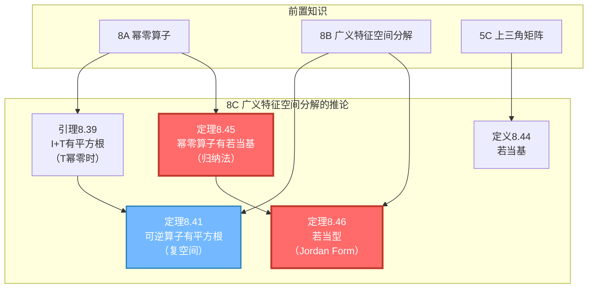
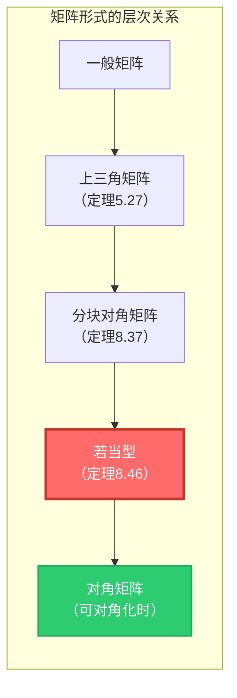

# 8C 广义特征空间分解的推论

> [!abstract] 本节概览
> 本节是第8章的**高潮收尾**，建立在 [[8B 广义特征空间分解]] 的基础上，得到两个重要成果：
>
> 1. **可逆算子的平方根**（引理8.39, 定理8.41）$\to$ 利用幂零算子的有限性，构造 $\sqrt{I+T}$ 和 $\sqrt{T}$
> 2. **若当基与若当型**（定义8.44, 定理8.45, 定理8.46）$\to$ ==本节最核心的结果==，证明每个复向量空间上的算子都有若当基，从而得到若当型——比上三角矩阵更精细的"最简标准形"
>
> **核心主线**：幂零算子的平方根 $\to$ 可逆算子的平方根 $\to$ 若当基（归纳法） $\to$ 若当型（广义特征空间分解 + 若当基）。
>
> **前置依赖**：[[8A 广义特征向量和幂零算子]]（幂零算子、广义特征向量）、[[8B 广义特征空间分解]]（广义特征空间分解、分块对角矩阵）、[[5C 上三角矩阵]]（上三角矩阵、特征值与对角元）、[[7A 自伴算子和正规算子]]（谱定理对比）。

---

## 一、可逆算子的平方根

> [!info] 视频精要 — [P98 8C(1)：特征多项式](https://www.bilibili.com/video/BV1Vg411G7cz?p=98)（19:51）
> - 注意：第四版8C节内容与视频P98-P100可能不完全对应，视频基于第三版录制
> - 视频P98主要讨论特征多项式，而第四版8C节聚焦于若当型
> - 建议参考视频 P101-P103（第三版8D，对应第四版8C的若当型内容）

### 引理8.39：$I+T$ 有平方根（$T$ 幂零时）

> [!thm] 引理 8.39：恒等算子加上幂零算子有平方根
>
> 设 $T \in \mathcal{L}(V)$ 是幂零的。那么 $I + T$ 有平方根。

> [!abstract] 证明思路
>
> **[关键步骤1：泰勒级数启发]：** 考虑 $\sqrt{1+x}$ 的泰勒级数
>
> $$\sqrt{1+x} = 1 + a_1 x + a_2 x^2 + \cdots$$
>
> 其中 $a_1 = \frac{1}{2}$。我们不需要关心各系数的确切值，只需要知道它们存在。
>
> **[关键步骤2：代入算子]：** 因为 $T$ 是幂零的，所以存在正整数 $m$ 使得 $T^m = 0$。将 $x$ 换成 $T$、$1$ 换成 $I$，无限和变为有限和：
>
> $$I + a_1 T + a_2 T^2 + \cdots + a_{m-1} T^{m-1}$$
>
> **[关键步骤3：逐次确定系数]：** 展开上述算子的平方：
>
> $$(I + a_1 T + a_2 T^2 + \cdots + a_{m-1} T^{m-1})^2 = I + 2a_1 T + (2a_2 + a_1^2) T^2 + (2a_3 + 2a_1 a_2) T^3 + \cdots$$
>
> 令其等于 $I + T$，逐次求解：
> - $2a_1 = 1$，得 $a_1 = \frac{1}{2}$
> - $2a_2 + a_1^2 = 0$，得 $a_2 = -\frac{1}{8}$
> - $2a_3 + 2a_1 a_2 = 0$，得 $a_3 = \frac{1}{16}$
> - 对每个 $k = 4, \ldots, m-1$，类似地求出 $a_k$
>
> 每一步只需要解一个关于 $a_k$ 的线性方程（前一步的系数已知），因此总能求解。$\blacksquare$

> [!tip] 关键洞察
> - **幂零性的威力**：$T^m = 0$ 将无限级数截断为有限和，这是整个证明的核心
> - 上述引理在**实向量空间和复向量空间上都成立**
> - 系数的具体值不重要，重要的是==归纳式地逐次可解==

### 定理8.41：复空间上可逆算子有平方根

> [!thm] 定理 8.41：$\mathbb{C}$ 上可逆算子具有平方根
>
> 设 $V$ 是复向量空间，$T \in \mathcal{L}(V)$ 是可逆的。那么 $T$ 有平方根。

> [!abstract] 证明思路
>
> **[关键步骤1：广义特征空间上的分解]：** 令 $\lambda_1, \ldots, \lambda_m$ 是 $T$ 的所有互异特征值。由 [[8B 广义特征空间分解#2.1 广义特征空间分解定理|定理8.22(b)]]，对每个 $k$ 存在幂零算子 $T_k \in \mathcal{L}(G(\lambda_k, T))$ 使得
>
> $$T|_{G(\lambda_k, T)} = \lambda_k I + T_k$$
>
> **[关键步骤2：提取特征值]：** 因为 $T$ 可逆，所以各 $\lambda_k \neq 0$。因此
>
> $$T|_{G(\lambda_k, T)} = \lambda_k \left(I + \frac{T_k}{\lambda_k}\right)$$
>
> 因为 $T_k / \lambda_k$ 仍是幂零的，由 **引理8.39**，$I + T_k / \lambda_k$ 有平方根。
>
> **[关键步骤3：构造平方根]：** 将复数 $\lambda_k$ 的平方根（$\sqrt{\lambda_k} \in \mathbb{C}$）与 $I + T_k / \lambda_k$ 的平方根相乘，得到 $T|_{G(\lambda_k, T)}$ 的平方根 $R_k$。
>
> **[关键步骤4：拼接]：** 由广义特征空间分解，每个 $v \in V$ 可唯一写成 $v = u_1 + \cdots + u_m$，其中 $u_k \in G(\lambda_k, T)$。定义
>
> $$Rv = R_1 u_1 + \cdots + R_m u_m$$
>
> 则 $R$ 是 $T$ 的平方根。$\blacksquare$

> [!note] 推广
> 效仿上述技巧可以证明：如果 $V$ 是复向量空间且 $T \in \mathcal{L}(V)$ 可逆，那么 $T$ 具有==任意正整数次方根==。

> [!warning] 反例：不可逆算子不一定有平方根
> $\mathbb{C}^3$ 上定义为 $T(z_1, z_2, z_3) = (z_2, z_3, 0)$ 的算子没有平方根（见习题1）。这个算子不可逆并非偶然。

> [!example] 实向量空间的限制
> 一维实向量空间 $\mathbb{R}$ 上"与 $-1$ 相乘"这个算子就没有平方根——因为 $\sqrt{-1} \notin \mathbb{R}$。这说明==定理8.41在实向量空间上不成立==。

---

## 二、若当基与若当型

> [!info] 视频精要
> - [P101 8D(1)：幂零算子的循环子空间分解](https://www.bilibili.com/video/BV1Vg411G7cz?p=101)（52:56）
> - [P102 8D(2)：定理8.55的推论](https://www.bilibili.com/video/BV1Vg411G7cz?p=102)（42:34）
> - [P103 8D(3)：Jordan标准型](https://www.bilibili.com/video/BV1Vg411G7cz?p=103)（23:42）
>
> > [!caution] 版本差异说明
> > 视频P101-P103对应的是**第三版**的8D节（Jordan标准型），而**第四版**中Jordan型被提前到了8C节。视频中的定理编号和内容组织可能与教材不完全一致，但核心思想相同。

### 例8.42：单个若当块的幂零算子

> [!example] 例 8.42：具有很好的矩阵的幂零算子
>
> 设 $T$ 是 $\mathbb{C}^4$ 上定义为
>
> $$T(z_1, z_2, z_3, z_4) = (0, z_1, z_2, z_3)$$
>
> 的算子。那么 $T^4 = 0$，从而 $T$ 是幂零的。
>
> 取 $v = (1, 0, 0, 0)$，则 $T^3 v, T^2 v, Tv, v$ 是 $\mathbb{C}^4$ 的基。$T$ 关于该基的矩阵是
>
> $$\mathcal{M}(T) = \begin{pmatrix} 0 & 1 & 0 & 0 \\ 0 & 0 & 1 & 0 \\ 0 & 0 & 0 & 1 \\ 0 & 0 & 0 & 0 \end{pmatrix}$$

> [!tip] 观察要点
> - 这就是一个 $4 \times 4$ 的**若当块**（特征值为0）
> - 对角线上全是0，紧挨对角线正上方的元素全是1，其余为0
> - 基的排列顺序是 $T^3 v, T^2 v, Tv, v$（==从高次幂到低次幂==），这保证了1出现在超对角线上

### 例8.43：多个若当块的幂零算子

> [!example] 例 8.43：具有稍复杂点的矩阵的幂零算子
>
> 设 $T$ 是 $\mathbb{C}^6$ 上定义为
>
> $$T(z_1, z_2, z_3, z_4, z_5, z_6) = (0, z_1, z_2, 0, z_4, 0)$$
>
> 的算子。那么 $T^3 = 0$，从而 $T$ 是幂零的。
>
> 与例8.42不同，这里**不存在**单个向量 $v \in \mathbb{C}^6$ 使得 $T^5 v, T^4 v, T^3 v, T^2 v, Tv, v$ 构成基。然而，取
> - $v_1 = (1, 0, 0, 0, 0, 0)$
> - $v_2 = (0, 0, 0, 1, 0, 0)$
> - $v_3 = (0, 0, 0, 0, 0, 1)$
>
> 则 $T^2 v_1, Tv_1, v_1, Tv_2, v_2, v_3$ 是 $\mathbb{C}^6$ 的一个基。$T$ 关于该基的矩阵是
>
> $$\mathcal{M}(T) = \begin{pmatrix} 0 & 1 & 0 & 0 & 0 & 0 \\ 0 & 0 & 1 & 0 & 0 & 0 \\ 0 & 0 & 0 & 0 & 0 & 0 \\ 0 & 0 & 0 & 0 & 1 & 0 \\ 0 & 0 & 0 & 0 & 0 & 0 \\ 0 & 0 & 0 & 0 & 0 & 0 \end{pmatrix}$$
>
> 这是一个**分块对角矩阵**，包含：
> - 一个 $3 \times 3$ 的若当块（对应 $v_1$ 的链）
> - 一个 $2 \times 2$ 的若当块（对应 $v_2$ 的链）
> - 一个 $1 \times 1$ 的零块（对应 $v_3$）

> [!tip] 关键观察
> - 当找不到一条足够长的链来覆盖整个空间时，需要==多条较短的链==
> - 每条链对应一个若当块，链的长度等于块的阶数
> - $v_1$ 产生长度为3的链：$T^2 v_1 \to Tv_1 \to v_1$
> - $v_2$ 产生长度为2的链：$Tv_2 \to v_2$
> - $v_3$ 产生长度为1的链：$v_3$

### 定义8.44：若当基

> [!def] 定义 8.44：若当基（Jordan basis）
>
> 设 $T \in \mathcal{L}(V)$。称 $V$ 的一个基是 $T$ 的**若当基**，如果 $T$ 关于该基具有分块对角矩阵
>
> $$\begin{pmatrix} A_1 & & 0 \\ & \ddots & \\ 0 & & A_p \end{pmatrix}$$
>
> 其中每个对角块 $A_k$ 是形如
>
> $$A_k = \begin{pmatrix} \lambda_k & 1 & & 0 \\ & \lambda_k & \ddots & \\ & & \ddots & 1 \\ 0 & & & \lambda_k \end{pmatrix}$$
>
> 的上三角矩阵。这样的矩阵 $A_k$ 称为**若当块**（Jordan block）。

> [!note] 若当块的结构
> - 对角线上全是同一个特征值 $\lambda_k$
> - 紧挨对角线正上方的元素全是 $1$
> - 其余元素全为 $0$
> - 若当块可以是 $1 \times 1$ 的（仅含 $\lambda_k$），此时退化为对角元素
> - 各 $\lambda_k$ 不一定互异

### 定理8.45：每个幂零算子都有若当基（核心定理）

> [!thm] 定理 8.45：每个幂零算子都有若当基
>
> 设 $T \in \mathcal{L}(V)$ 是幂零的。那么 $V$ 中有一个基是 $T$ 的若当基。

> [!abstract] 证明思路
>
> **[关键步骤1：归纳奠基]：** 对 $\dim V$ 用归纳法。$\dim V = 1$ 时，唯一的幂零算子是 $0$ 算子，结论显然成立。
>
> **[关键步骤2：构造最长链]：** 设 $\dim V > 1$，令 $m$ 是使得 $T^m = 0$ 的最小正整数。取 $u \in V$ 使得 $T^{m-1} u \neq 0$。令
>
> $$U = \text{span}(u, Tu, \ldots, T^{m-1}u)$$
>
> 由 [[8A 广义特征向量和幂零算子|8A节习题2]]，$u, Tu, \ldots, T^{m-1}u$ 线性无关。若 $U = V$，则将这组向量反过来排列就得到若当基，证明完成。
>
> **[关键步骤3：构造补空间 $W$]：** 设 $U \neq V$。取 $\varphi \in V'$ 使得 $\varphi(T^{m-1}u) \neq 0$。令
>
> $$W = \{v \in V : \varphi(T^k v) = 0 \text{ 对每个 } k = 0, \ldots, m-1\}$$
>
> 则 $W$ 是 $V$ 的在 $T$ 下不变的子空间（若 $v \in W$，则 $\varphi(T^k(Tv)) = 0$ 对所有 $k = 0, \ldots, m-2$ 成立；$k = m-1$ 时 $\varphi(T^m v) = \varphi(0) = 0$）。
>
> **[关键步骤4：证明 $V = U \oplus W$]：**
>
> - **$U \cap W = \{0\}$**：设 $v \in U \cap W$，$v \neq 0$。则 $v = c_0 u + c_1 Tu + \cdots + c_{m-1} T^{m-1}u$。令 $j$ 是使 $c_j \neq 0$ 的最小下标。将 $T^{m-j-1}$ 作用于两端，得 $T^{m-j-1}v = c_j T^{m-1}u$。用 $\varphi$ 作用得 $\varphi(T^{m-j-1}v) = c_j \varphi(T^{m-1}u) \neq 0$，与 $v \in W$ 矛盾。
>
> - **$U \oplus W = V$**：定义 $S: V \to \mathbb{F}^m$ 为 $Sv = (\varphi(v), \varphi(Tv), \ldots, \varphi(T^{m-1}v))$。则 $\text{null } S = W$，由 [[3B 零空间和值域|线性映射基本定理（3.21）]]，
>
> $$\dim W = \dim V - \dim \text{range } S \geq \dim V - m$$
>
> 因此 $\dim(U \oplus W) = \dim U + \dim W \geq m + (\dim V - m) = \dim V$，由 [[3D 可逆性和同构|2.39]] 得 $U \oplus W = V$。
>
> **[关键步骤5：归纳完成]：** $U$ 和 $W$ 都在 $T$ 下不变，且维数都小于 $\dim V$。由归纳假设，$U$ 有 $T|_U$ 的若当基，$W$ 有 $T|_W$ 的若当基。将两者合并即得 $T$ 的若当基。$\blacksquare$

> [!important] 证明的核心技巧
> - **对偶空间的使用**：通过 $\varphi \in V'$ 构造补空间 $W$，这是整个证明最精妙的部分
> - **线性映射 $S$ 的维度估计**：利用 $\dim \text{range } S \leq m$ 来证明 $U \oplus W = V$
> - **归纳法的结构**：找到 $T$-不变子空间 $U$ 和 $W$，分别应用归纳假设，然后合并

### 定理8.46：若当型（核心定理）

> [!thm] 定理 8.46：若当型（Jordan Form）
>
> 设 $\mathbb{F} = \mathbb{C}$ 且 $T \in \mathcal{L}(V)$。那么 $V$ 有一个基是 $T$ 的若当基。

> [!abstract] 证明思路
>
> **[关键步骤]：** 令 $\lambda_1, \ldots, \lambda_m$ 是 $T$ 的所有互异特征值。由 [[8B 广义特征空间分解#2.1 广义特征空间分解定理|广义特征空间分解（8.22）]]，
>
> $$V = G(\lambda_1, T) \oplus \cdots \oplus G(\lambda_m, T)$$
>
> 且每个 $(T - \lambda_k I)|_{G(\lambda_k, T)}$ 都是幂零的。由 **定理8.45**，每个 $G(\lambda_k, T)$ 都有 $(T - \lambda_k I)|_{G(\lambda_k, T)}$ 的若当基。将这些基合并，就得到 $V$ 的一个基，且它是 $T$ 的若当基。$\blacksquare$

> [!success] 证明的结构之美
> - 若当型定理的证明将前两节的所有工具完美串联：
>   - [[8B 广义特征空间分解]] 提供空间分解 $V = \bigoplus G(\lambda_k, T)$
>   - [[8A 广义特征向量和幂零算子]] 保证 $(T - \lambda_k I)|_{G(\lambda_k, T)}$ 是幂零的
>   - **定理8.45** 为幂零算子提供若当基
> - 整个第8章的逻辑链条：广义特征向量 $\to$ 幂零算子 $\to$ 广义特征空间分解 $\to$ 若当基 $\to$ 若当型

> [!quote] 历史注记
> 卡米耶·若当（Camille Jordan, 1838--1922）于1870年发表了定理8.46的证明。

---

## 三、知识结构总览

---

## 四、核心思想与证明技巧

### 泰勒级数截断法（引理8.39）

> [!note] 核心技巧
> 将 $\sqrt{1+x}$ 的泰勒级数中的 $x$ 替换为幂零算子 $T$。因为 $T^m = 0$，无限级数自动截断为有限和，从而避免了收敛性问题。这一技巧的精髓在于：
> - ==幂零性 $\Rightarrow$ 有限性 $\Rightarrow$ 无需讨论收敛==
> - 系数可以逐次确定，每步只需求解一个线性方程
> - 该方法可推广到构造任意多项式函数 $f(I+T)$

### 归纳法 + 对偶空间（定理8.45）

> [!note] 核心技巧
> 定理8.45的证明是本章最精妙的归纳论证之一，其关键创新在于：
>
> 1. **构造最长链 $U$**：取 $u$ 使得 $T^{m-1}u \neq 0$，生成循环子空间 $U$
> 2. **利用对偶空间构造补空间 $W$**：通过 $\varphi \in V'$ 定义 $W$，巧妙地保证 $W$ 在 $T$ 下不变
> 3. **维度估计**：构造线性映射 $S: V \to \mathbb{F}^m$，利用 $\dim \text{range } S \leq m$ 证明 $U \oplus W = V$
>
> ==对偶空间的使用是整个证明的灵魂==——它使得我们能够"正交地"切出补空间，同时保持 $T$-不变性。

### 从幂零到一般（定理8.46）

> [!note] 核心技巧
> 定理8.46的证明体现了"==化归为幂零情形=="的标准策略：
>
> 1. 利用广义特征空间分解，将 $V$ 分解为 $G(\lambda_k, T)$ 的直和
> 2. 在每个 $G(\lambda_k, T)$ 上，$T - \lambda_k I$ 是幂零的
> 3. 对幂零算子 $T - \lambda_k I$ 应用定理8.45，得到若当基
> 4. 合并各若当基，得到 $T$ 的若当基
>
> 这一策略与定理8.37（分块对角矩阵）的证明策略完全一致，只是这里用若当基替换了上三角基。

### 若当链的构造

> [!note] 核心概念
> 给定幂零算子 $T$ 和向量 $v$ 使得 $T^{m-1}v \neq 0$ 但 $T^m v = 0$，则
>
> $$v, Tv, T^2 v, \ldots, T^{m-1}v$$
>
> 构成一条**若当链**（Jordan chain），对应一个 $m \times m$ 的若当块。若当链中的每个向量都是 $T$ 的[[8A 广义特征向量和幂零算子#2.1 广义特征向量的定义|广义特征向量]]。

---

## 五、补充理解与易混淆点

### 若当块是什么？——最直观的理解

> [!note] 若当块的直观形象
> 若当块是一个"几乎对角"的上三角矩阵：**对角线上全是同一个特征值 $\lambda$，紧挨对角线正上方的元素全是 $1$，其余为 $0$**。
>
> 例如 $3 \times 3$ 若当块：
>
> $$\begin{pmatrix} \lambda & 1 & 0 \\ 0 & \lambda & 1 \\ 0 & 0 & \lambda \end{pmatrix}$$
>
> **几何直觉**：若当块描述了"链式作用"——
> - $T v_3 = v_2 + \lambda v_3$（将 $v_3$ 映射到 $v_2$ 方向，加上 $\lambda$ 倍自身）
> - $T v_2 = v_1 + \lambda v_2$
> - $T v_1 = \lambda v_1$（$v_1$ 是真正的特征向量）
>
> 可以想象成一条"降级链"：$v_3 \xrightarrow{T} v_2 \xrightarrow{T} v_1 \xrightarrow{T} 0$（减去 $\lambda$ 倍自身后）。
>
> **来源**：MIT 18.06讲义（Gilbert Strang）、University of Toronto Jordan Form讲义、Northwestern大学Jordan Form讲义、Utah大学Jordan Form讲义。

### 若当型 vs 对角矩阵 vs 分块对角矩阵

> [!note] 矩阵形式的层次关系
>
> | 形式 | 描述 | 条件 | 例子 |
> |:---:|:---:|:---:|:---:|
> | **对角矩阵** | 每个块都是 $1 \times 1$ | $T$ 可对角化 | $\text{diag}(\lambda_1, \lambda_2, \lambda_3)$ |
> | **若当型** | 每个块是若当块 | $T$ 是复空间上的算子 | 含若当块的分块对角矩阵 |
> | **分块对角矩阵** | 每个块是上三角的 | $T$ 是复空间上的算子 | [[8B 广义特征空间分解#4.1 分块对角矩阵|定理8.37]] |
> | **上三角矩阵** | 一般上三角 | $V$ 是复向量空间 | [[5C 上三角矩阵|定理5.27]] |
>
> **层次关系**：对角矩阵 $\subset$ 若当型 $\subset$ 分块对角矩阵 $\subset$ 上三角矩阵 $\subset$ 一般矩阵
>
> - **对角矩阵**：最理想的情况，$T$ 可对角化时取得
> - **若当型**：最精细的"几乎对角"形式，对**任意**复算子都存在
> - **分块对角矩阵**（[[8B 广义特征空间分解#4.1 分块对角矩阵|8.37]]）：每个块是上三角的，对角线全为 $\lambda_k$，但超对角线不一定是 $1$
> - 若当型是分块对角矩阵的==进一步精细化==：强制超对角线元素为 $1$
>
> **来源**：MIT 18.06讲义（Gilbert Strang）、University of Toronto Jordan Form讲义、Northwestern大学Jordan Form讲义、Utah大学Jordan Form讲义。

### 若当链（Jordan Chain）的构造

> [!note] 若当链的详细说明
>
> 给定幂零算子 $T$ 和向量 $v$ 使得 $T^{m-1}v \neq 0$ 但 $T^m v = 0$，则
>
> $$v, Tv, T^2 v, \ldots, T^{m-1}v$$
>
> 构成一条长度为 $m$ 的**若当链**。
>
> **性质**：
> - 这条链对应一个 $m \times m$ 的若当块
> - 链中每个向量都是 $T$ 的[[8A 广义特征向量和幂零算子#2.1 广义特征向量的定义|广义特征向量]]
> - $T^{m-1}v$ 是 $T$ 的（真正的）特征向量（属于 $\text{null } T$）
> - 链的长度 $m$ 等于 $v$ 作为广义特征向量的"级"（level）
>
> **在若当基中的排列**：若当链在基中按==从高次幂到低次幂==排列，即 $T^{m-1}v, \ldots, Tv, v$，这样 $T$ 作用后每个向量恰好变成前一个向量（加上 $\lambda$ 倍自身）。
>
> **来源**：MIT 18.06讲义（Gilbert Strang）、University of Toronto Jordan Form讲义、Northwestern大学Jordan Form讲义、Utah大学Jordan Form讲义。

### 为什么若当型重要？

> [!important] 若当型的意义
>
> 1. **最简标准形**：若当型是复向量空间上算子的"最简标准形"——比 [[7B 谱定理|谱定理]] 更一般
>    - 谱定理要求 $T$ 正规（$TT^* = T^*T$），若当型对**任意**算子都成立
>    - 谱定理给出对角矩阵，若当型给出"最接近对角"的形式
>
> 2. **揭示内部结构**：若当型直接告诉我们：
>    - $T$ 有哪些特征值
>    - 每个特征值对应多少个若当块（= 该特征值的几何重数 = $\dim \text{null}(T - \lambda I)$）
>    - 每个若当块多大（最大块的阶数 = $(T - \lambda I)$ 在 $G(\lambda, T)$ 上的幂零指数）
>
> 3. **重要应用**：
>    - **解微分方程组**：$x' = Ax$ 的通解可通过若当型直接写出
>    - **计算矩阵函数**：$e^A, \sin(A), \cos(A)$ 等可通过若当块上的函数值计算
>    - **Markov链分析**：若当型揭示马尔可夫矩阵的长期行为
>
> **来源**：MIT 18.06讲义（Gilbert Strang）、University of Toronto Jordan Form讲义、Northwestern大学Jordan Form讲义、Utah大学Jordan Form讲义。

### 常见误区

> [!danger] 常见误区纠正
>
> | 误区 | 正确理解 |
> |:---|:---|
> | ❌ "若当型要求算子可对角化" | ✅ 恰恰相反，若当型处理的是**不可对角化**的情况。可对角化时若当型退化为对角矩阵 |
> | ❌ "若当块的大小等于特征值的（代数）重数" | ✅ 若当块大小之**和**等于代数重数，但可以有多个块。例如代数重数为4的特征值可以对应一个 $3 \times 3$ 块加一个 $1 \times 1$ 块 |
> | ❌ "若当基是唯一的" | ✅ 若当基**不唯一**，但若当块的**个数和大小**是唯一确定的（不计排列顺序） |
> | ❌ "实矩阵没有若当型" | ✅ 实矩阵在复化后仍有若当型，但可能涉及复特征值。若当型定理只在复数域上成立 |
> | ❌ "若当型中的1可以换成其他数" | ✅ 超对角线上的1是**标准化的**，通过适当的基变换总可以化为1 |

> [!danger] 误区二："若当型是唯一的"
> ❌ 一个算子的若当型矩阵是唯一确定的。
> ✅ 若当型的==对角块可以任意排列==，因此矩阵形式不唯一。但每个特征值对应的若当块的大小（不计顺序）是唯一的。
>
> **来源**：MIT 18.06讲义（Gilbert Strang）、OSU Ximera线性代数教材。

> [!danger] 误区三："若当基只在复数域上存在"
> ❌ 若当基只在复向量空间上有意义。
> ✅ 幂零算子的若当基在实数域上也成立（定理8.45不依赖域）。但==完整的若当型定理（8.46）确实只在复数域上成立==，因为需要广义特征空间分解。
>
> **来源**：MIT 18.06讲义（Gilbert Strang）、Northwestern大学Jordan Form讲义。

---

## 六、习题精选

> [!todo] 本节习题
> | 习题号 | 标题 | 核心考点 | 难度 |
> |---|---|---|---|
> | 习题1 | 无平方根的算子 | 平方根不存在的证明 | 中 |
> | 习题2 | I+T的平方根计算 | 引理8.39的应用 | 中 |
> | 习题4 | -I的平方根与维数 | 实空间上的平方根 | 中 |
> | 习题5 | 若当基的构造 | 若当基的具体计算 | 高 |
> | 习题7 | 若当基与最小多项式 | 若当块大小与最小多项式 | 高 |
> | 习题10 | 颠倒若当基的矩阵 | 若当基的顺序变换 | 中 |
> | 习题14 | 不可分解的刻画 | 最小多项式与不变子空间 | 高 |

### 习题1：无平方根的算子

> [!problem] 习题1
> 设 $T \in \mathcal{L}(\mathbb{C}^3)$ 是定义为 $T(z_1, z_2, z_3) = (z_2, z_3, 0)$ 的算子。证明：$T$ 没有平方根。

> [!faq]- 查看解答
> 反证法。假设存在 $R \in \mathcal{L}(\mathbb{C}^3)$ 使得 $R^2 = T$。
>
> $T$ 是幂零的（$T^3 = 0$ 但 $T^2 \neq 0$）。因此 $R^6 = T^3 = 0$，故 $R$ 也是幂零的。
>
> 由 8.16，$\dim \text{null}\, R^3 = 3$（因为 $R^6 = 0$ 且零空间序列在 $\dim V = 3$ 步内停止增长）。
>
> 但 $R^4 = T^2 \neq 0$，故 $\text{null}\, R^4 \neq V$。由 8.3，$\text{null}\, R^3 \subsetneq \text{null}\, R^4$，故 $\dim \text{null}\, R^3 < 3$，矛盾。$\blacksquare$

### 习题2：I+T的平方根计算

> [!problem] 习题2
> 定义 $T \in \mathcal{L}(\mathbb{F}^5)$ 为 $T(x_1, x_2, x_3, x_4, x_5) = (2x_2, 3x_3, -x_4, 4x_5, 0)$。
> (a) 证明：$T$ 是幂零的。
> (b) 求出 $I + T$ 的一个平方根。

> [!faq]- 查看解答
> **(a)**：$T^5(x_1, x_2, x_3, x_4, x_5) = T^4(2x_2, 3x_3, -x_4, 4x_5, 0) = T^3(6x_3, -3x_4, 16x_5, 0, 0) = T^2(-3x_4, 48x_5, 0, 0, 0) = T(192x_5, 0, 0, 0, 0) = (0, 0, 0, 0, 0)$。故 $T^5 = 0$。
>
> **(b)**：由引理 8.39 的证明，$I + T$ 的平方根形如 $I + a_1 T + a_2 T^2 + a_3 T^3 + a_4 T^4$。
>
> 展开平方：$(I + a_1 T + a_2 T^2 + a_3 T^3 + a_4 T^4)^2 = I + 2a_1 T + (2a_2 + a_1^2)T^2 + (2a_3 + 2a_1 a_2)T^3 + (2a_4 + 2a_1 a_3 + a_2^2)T^4 + \cdots$
>
> 令各系数等于 $I + T$ 的对应系数：$2a_1 = 1 \Rightarrow a_1 = 1/2$。$2a_2 + a_1^2 = 0 \Rightarrow a_2 = -1/8$。$2a_3 + 2a_1 a_2 = 0 \Rightarrow a_3 = 1/16$。$2a_4 + 2a_1 a_3 + a_2^2 = 0 \Rightarrow a_4 = -5/128$。
>
> 因此 $R = I + \frac{1}{2}T - \frac{1}{8}T^2 + \frac{1}{16}T^3 - \frac{5}{128}T^4$。$\blacksquare$

### 习题4：-I的平方根与维数

> [!problem] 习题4
> 设 $V$ 是实向量空间。证明：当且仅当 $\dim V$ 为偶数，$V$ 上的算子 $-I$ 才有平方根。

> [!faq]- 查看解答
> **⇒**：设 $R^2 = -I$。取 $V$ 的任一基，$M(R^2) = M(-I) = -I$。故 $\det(M(R))^2 = \det(M(R^2)) = \det(-I) = (-1)^{\dim V}$。
>
> 在实数域上，$\det(M(R)) \in \mathbb{R}$，故 $(-1)^{\dim V} \geq 0$，即 $\dim V$ 为偶数。
>
> **⇐**：设 $\dim V = 2n$。将 $V$ 分解为 $n$ 个二维子空间的直和，在每个二维子空间上定义 $R_k = \begin{pmatrix} 0 & -1 \\ 1 & 0 \end{pmatrix}$（旋转90°）。$R_k^2 = -I_2$。令 $R = R_1 \oplus \cdots \oplus R_n$，则 $R^2 = -I$。$\blacksquare$

### 习题5：若当基的构造

> [!problem] 习题5
> 设 $T \in \mathcal{L}(\mathbb{C}^2)$ 是定义为 $T(w, z) = (-w - z, 9w + 5z)$ 的算子。求出 $T$ 的一个若当基。

> [!faq]- 查看解答
> $T$ 关于标准基的矩阵为 $\begin{pmatrix} -1 & -1 \\ 9 & 5 \end{pmatrix}$。
>
> 特征值：$\det(T - \lambda I) = (\lambda + 1)(\lambda - 5) + 9 = \lambda^2 - 4\lambda + 4 = (\lambda - 2)^2$。特征值 $2$，重数 $2$。
>
> $T - 2I = \begin{pmatrix} -3 & -1 \\ 9 & 3 \end{pmatrix}$。$\text{null}(T - 2I) = \text{span}\{(1, -3)\}$，几何重数为 $1$。
>
> 因为几何重数 $= 1 < 2$，所以 $T$ 不可对角化。需要广义特征向量：$(T - 2I)v = (1, -3)$，解得 $v = (0, -1)$（或其他解）。
>
> 若当基：$\{(T - 2I)v, v\} = \{(1, -3), (0, -1)\}$。
>
> $T$ 关于该基的矩阵为 $\begin{pmatrix} 2 & 1 \\ 0 & 2 \end{pmatrix}$。$\blacksquare$

### 习题7：若当基与最小多项式

> [!problem] 习题7
> 设 $T \in \mathcal{L}(V)$ 是幂零的，$v_1, \ldots, v_n$ 是 $T$ 的若当基。证明：$T$ 的最小多项式是 $z^{m+1}$，其中 $m$ 是 $T$ 关于 $v_1, \ldots, v_n$ 的矩阵中，紧挨在对角线上方的这条线上连续出现的 $1$ 的最大数目。

> [!faq]- 查看解答
> $T$ 关于若当基的矩阵是分块对角矩阵，每个对角块是 Jordan 块 $J_k = \begin{pmatrix} 0 & 1 & & \\ & \ddots & \ddots & \\ & & 0 & 1 \\ & & & 0 \end{pmatrix}$，大小为 $m_k + 1$。
>
> $T^{m_k + 1}$ 在第 $k$ 个 Jordan 块上为零，但 $T^{m_k}$ 不为零（因为 $(T^{m_k})_{1,m_k+1} = 1$）。
>
> $T$ 的最小多项式是使 $T^d$ 在所有 Jordan 块上都为零的最小 $d$，即 $d = \max(m_k) + 1 = m + 1$。$\blacksquare$

### 习题10：颠倒若当基的矩阵

> [!problem] 习题10
> 设 $T \in \mathcal{L}(V)$，$V$ 的基 $v_1, \ldots, v_n$ 是 $T$ 的若当基。描述 $T$ 关于基 $v_n, \ldots, v_1$（通过颠倒各 $v$ 的顺序得到）的矩阵。

> [!faq]- 查看解答
> 设 $T$ 关于原基的矩阵为 $J = \text{diag}(A_1, \ldots, A_p)$，其中每个 $A_k$ 是 Jordan 块。
>
> 颠倒基的顺序等价于用置换矩阵 $P$（反对角线全为1）做相似变换：$PJP^{-1}$。
>
> 对单个 Jordan 块 $A = \begin{pmatrix} \lambda & 1 & & \\ & \lambda & \ddots & \\ & & \ddots & 1 \\ & & & \lambda \end{pmatrix}$，$PAP^{-1}$ 将 $1$ 从超对角线移到==次对角线==（主对角线下方紧邻的位置），即 $\lambda$ 仍在主对角线上，但 $1$ 出现在次对角线上。
>
> 因此 $T$ 关于颠倒基的矩阵是分块对角矩阵，每个块是 Jordan 块的"转置"——$\lambda$ 在对角线上，$1$ 在次对角线上。$\blacksquare$

### 习题14：不可分解的刻画

> [!problem] 习题14
> 设 $\mathbb{F} = \mathbb{C}$ 且 $T \in \mathcal{L}(V)$。证明：$V$ 不能分解为两个在 $T$ 下不变的非零子空间的直和，当且仅当 $T$ 的最小多项式形如 $(z - \lambda)^{\dim V}$（其中 $\lambda \in \mathbb{C}$）。

> [!faq]- 查看解答
> **⇒**：假设 $V$ 不能分解为两个非零不变子空间的直和。由广义特征空间分解（8.22），$V = G(\lambda_1, T) \oplus \cdots \oplus G(\lambda_m, T)$。如果 $m \geq 2$，这就给出了一个分解，矛盾。故 $m = 1$，$T$ 只有一个特征值 $\lambda$，且 $V = G(\lambda, T)$。
>
> $T$ 的最小多项式是 $(z - \lambda)^k$，其中 $k$ 是使 $(T - \lambda I)^k = 0$ 的最小正整数。由 8.20，$G(\lambda, T) = \text{null}(T - \lambda I)^{\dim V}$，故 $k = \dim V$。
>
> **⇐**：假设最小多项式为 $(z - \lambda)^{\dim V}$。则 $T$ 只有一个特征值 $\lambda$（因为最小多项式的根就是所有特征值）。由广义特征空间分解，$V = G(\lambda, T)$。
>
> 假设 $V = U \oplus W$，其中 $U, W$ 是非零的 $T$-不变子空间。则 $T|_U$ 的特征值也是 $\lambda$，最小多项式整除 $(z - \lambda)^{\dim V}$。但 $\dim U < \dim V$ 且 $\dim W < \dim V$，所以 $(T - \lambda I)^{\dim V - 1}$ 在 $U$ 和 $W$ 上都不为零（因为各自的幂零指数等于各自维数）。矛盾。$\blacksquare$

---

## 七、视频学习指南

> [!info] 视频精要汇总
>
> | 编号 | 标题 | 时长 | 内容要点 |
> |:---:|:---|:---:|:---|
> | P98 | 8C(1)：特征多项式 | 19:51 | 第四版8C内容与视频可能不完全对应 |
> | P99 | 8C(2)：极小多项式 | 52:51 | 极小多项式的性质与应用 |
> | P100 | 8C习题 | 40:54 | 习题讲解 |
> | P101 | 8D(1)：幂零算子的循环子空间分解 | 52:56 | ==推荐==：对应第四版8C的若当基构造 |
> | P102 | 8D(2)：定理8.55的推论 | 42:34 | 若当型的推论与应用 |
> | P103 | 8D(3)：Jordan标准型 | 23:42 | ==推荐==：若当型的总结与展望 |
>
> > [!caution] 版本差异说明
> > - 视频基于**第三版**录制，第三版中 Jordan 标准型在 8D 节
> > - **第四版**中 Jordan 型被提前到 8C 节，因此视频 **P101-P103**（第三版8D）对应第四版的8C
> > - 视频中的定理编号可能与教材不一致，请以第四版教材为准
> > - 建议重点观看 P101（若当基的构造思想）和 P103（若当型总结）

> [!tip] 学习建议
> 1. 先阅读教材8C节，理解若当基和若当型的定义
> 2. 观看 P101，理解幂零算子的循环子空间分解（即若当基的构造过程）
> 3. 观看 P103，建立若当型的整体认知
> 4. 回到教材，仔细研读定理8.45的归纳证明
> 5. 完成习题5和习题7，巩固若当基的构造和最小多项式的联系

---

## 八、教材原文

> [!quote] 教材原文
---

#学习/线性代数/复向量空间上的算子/若当型
#学习/线性代数/复向量空间上的算子/幂零算子
#学习/线性代数/复向量空间上的算子/平方根
