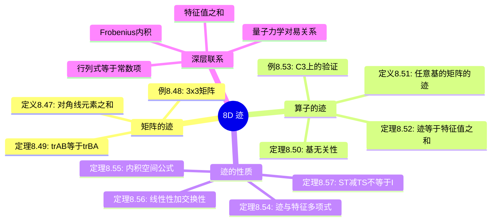
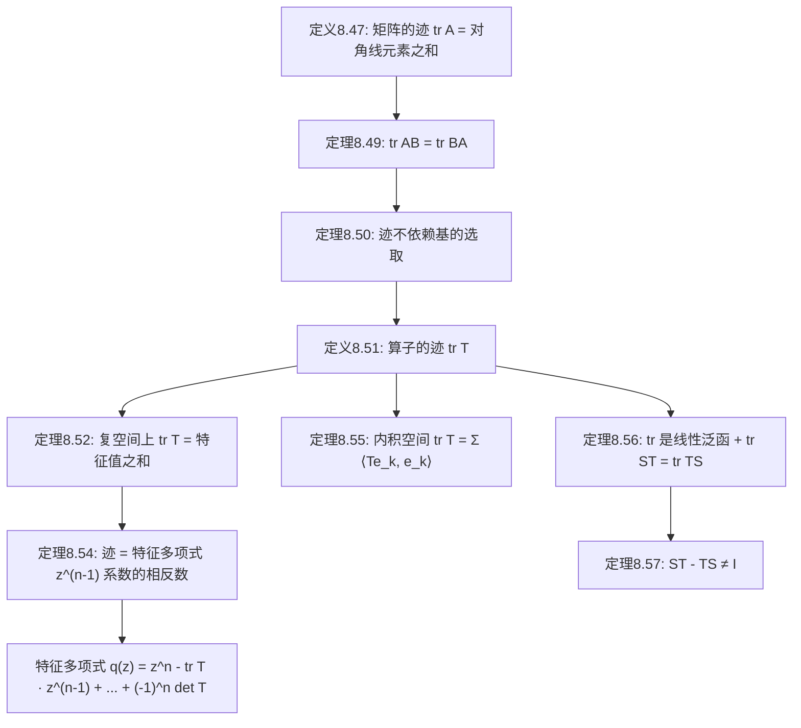

# 8D 联系矩阵与算子的桥梁——迹

> [!abstract] 本节概览
> 本节建立**矩阵的迹**与**算子的迹**之间的桥梁，是连接矩阵语言和算子语言的关键工具。逻辑链条如下：
>
> 1. **矩阵的迹**（定义8.47, 例8.48, 定理8.49）$\to$ 定义方阵对角线元素之和，证明 $\text{tr}(AB) = \text{tr}(BA)$
> 2. **算子的迹**（定义8.51, 定理8.50, 定理8.52, 例8.53）$\to$ 利用换基公式证明迹不依赖基的选取，定义算子的迹，证明迹等于特征值之和
> 3. **迹的性质**（定理8.54, 8.55, 8.56, 8.57）$\to$ 迹与特征多项式的关系、内积空间上的迹公式、迹的线性性、$ST - TS \neq I$
>
> **核心主线**：矩阵的迹 $\to$ $\text{tr}(AB) = \text{tr}(BA)$ $\to$ 算子的迹（基无关性）$\to$ 迹 = 特征值之和 $\to$ 迹的代数性质。
>
> **前置依赖**：[[8B 广义特征空间分解]]（特征多项式、特征值与重数）、[[6B 规范正交基]]（规范正交基、内积空间）、[[7E 奇异值分解与推论]]（算子的伴随、$T^*T$）、[[3C 矩阵]]（矩阵乘法、换基公式）、[[5C 上三角矩阵]]（上三角矩阵、特征值与对角元）。

---

## 一、矩阵的迹

### 迹的定义

> [!def] 定义 8.47 矩阵的迹（trace of a matrix）
> 设 $A$ 是各元素均属于 $\mathbb{F}$ 的方阵。$A$ 的**迹**，记为 $\text{tr}\, A$，定义为 $A$ 对角线上各元素之和。

即，若 $A$ 是 $n \times n$ 矩阵，则：

$$\text{tr}\, A = \sum_{j=1}^{n} A_{j,j}$$

> [!tip] 直觉理解
> 迹是最简单的矩阵函数之一——只需把对角线上的元素加起来。虽然定义极其简单，但它蕴含了关于算子的深刻信息（如特征值之和）。

### 例题

> [!example] 例 8.48 一个 $3 \times 3$ 矩阵的迹
> 设
> $$A = \begin{pmatrix} \textcolor{red}{3} & -1 & -2 \\ 5 & \textcolor{red}{2} & -3 \\ 1 & 6 & \textcolor{red}{0} \end{pmatrix}$$
> $A$ 对角线上的元素是 $3$、$2$ 和 $0$（以红色标出）。于是
> $$\text{tr}\, A = 3 + 2 + 0 = 5$$

### tr(AB) = tr(BA)

矩阵乘法不满足交换律，但迹具有一种特殊的"交换不变性"：

> [!thm] 定理 8.49 $AB$ 的迹等于 $BA$ 的迹
> 设 $A$ 是 $m \times n$ 矩阵且 $B$ 是 $n \times m$ 矩阵。那么
> $$\text{tr}(AB) = \text{tr}(BA)$$

> [!abstract] 证明思路
> **[关键步骤]：直接展开对角线元素，交换求和顺序。**
>
> 设
> $$A = \begin{pmatrix} A_{1,1} & \cdots & A_{1,n} \\ \vdots & & \vdots \\ A_{m,1} & \cdots & A_{m,n} \end{pmatrix}, \quad B = \begin{pmatrix} B_{1,1} & \cdots & B_{1,m} \\ \vdots & & \vdots \\ B_{n,1} & \cdots & B_{n,m} \end{pmatrix}$$
>
> $m \times m$ 矩阵 $AB$ 对角线上的第 $j$ 个元素等于 $\displaystyle\sum_{k=1}^{n} A_{j,k}\, B_{k,j}$。于是
> $$\text{tr}(AB) = \sum_{j=1}^{m}\sum_{k=1}^{n} A_{j,k}\, B_{k,j} = \sum_{k=1}^{n}\sum_{j=1}^{m} B_{k,j}\, A_{j,k} = \sum_{k=1}^{n} (BA)_{k,k} = \text{tr}(BA)$$
>
> 其中关键一步是==交换双重求和的顺序==，这利用了有限和的绝对收敛性。$\blacksquare$

> [!important] 注意
> - $AB$ 和 $BA$ 甚至可以有不同的维数（$m \times m$ vs $n \times n$），但它们的迹始终相等
> - 这个性质是本节后续几乎所有结论的基础

---

## 二、算子的迹

### 迹不依赖基的选取

我们想要定义算子 $T \in \mathcal{L}(V)$ 的迹为 $T$ 关于 $V$ 的某个基的矩阵的迹。然而，这个定义不应依赖于基的选取。

> [!thm] 定理 8.50 算子的矩阵的迹不依赖于基的选取
> 设 $T \in \mathcal{L}(V)$。设 $u_1, \ldots, u_n$ 和 $v_1, \ldots, v_n$ 是 $V$ 的基。那么
> $$\text{tr}\, \mathcal{M}\bigl(T, (u_1, \ldots, u_n)\bigr) = \text{tr}\, \mathcal{M}\bigl(T, (v_1, \ldots, v_n)\bigr)$$

> [!abstract] 证明思路
> **[关键步骤]：利用换基公式 + 定理8.49的循环迹性质。**
>
> 令 $A = \mathcal{M}\bigl(T, (u_1, \ldots, u_n)\bigr)$，$B = \mathcal{M}\bigl(T, (v_1, \ldots, v_n)\bigr)$。[[3D 可逆性和同构|换基公式]]告诉我们，存在可逆的 $n \times n$ 矩阵 $C$ 使得 $A = C^{-1}BC$（见3.84）。于是
> $$\text{tr}\, A = \text{tr}\bigl((C^{-1}B)C\bigr) = \text{tr}\bigl(C(C^{-1}B)\bigr) = \text{tr}\bigl((CC^{-1})B\bigr) = \text{tr}\, B$$
>
> 其中第二行源于==定理8.49==：$\text{tr}(XY) = \text{tr}(YX)$，取 $X = C^{-1}B$，$Y = C$。$\blacksquare$

> [!note] 证明解读
> 这个证明非常优雅。换基公式给出 $A = C^{-1}BC$，看起来 $A$ 和 $B$ 很不一样。但利用 $\text{tr}(XY) = \text{tr}(YX)$ 的"循环不变性"，$C^{-1}$ 和 $C$ 像"括号"一样被消去了，直接得到 $\text{tr}\, A = \text{tr}\, B$。

### 算子的迹的定义

因为定理8.50保证了基无关性，下面定义是合理的：

> [!def] 定义 8.51 算子的迹（trace of an operator）
> 设 $T \in \mathcal{L}(V)$。$T$ 的**迹**，记作 $\text{tr}\, T$，定义为
> $$\text{tr}\, T = \text{tr}\, \mathcal{M}\bigl(T, (v_1, \ldots, v_n)\bigr)$$
> 其中 $v_1, \ldots, v_n$ 是 $V$ 的==任意==一个基。

> [!warning] 为什么需要定理8.50？
> 如果没有定理8.50，这个定义就是"病态"的——选不同的基可能得到不同的迹值。定理8.50保证了无论选哪个基，结果都一样，因此定义是**良定义（well-defined）**的。这是数学中定义新概念时的标准做法：先证明候选定义不依赖于任意选择，再正式给出定义。

### 迹等于特征值之和

> [!thm] 定理 8.52 在复向量空间上，迹等于特征值之和
> 设 $\mathbb{F} = \mathbb{C}$ 且 $T \in \mathcal{L}(V)$。那么 $\text{tr}\, T$ 等于 $T$ 的特征值之和，其中各特征值出现次数等于其重数。

> [!abstract] 证明思路
> **[关键步骤]：选取使 $T$ 具有上三角矩阵的基，对角线上恰好是所有特征值。**
>
> 存在 $V$ 的一个基使得 $T$ 关于该基有==上三角矩阵==，且对角线上各元素都是 $T$ 的特征值，并且各特征值出现次数等于其重数（见 [[8B 广义特征空间分解|8.37]]）。
>
> 于是由算子的迹的定义以及==定理8.50==（该结论让我们得以自由选取基），可得 $\text{tr}\, T$ 等于 $T$ 的特征值之和，其中各特征值出现次数等于其重数。$\blacksquare$

> [!note] 关于"重数"的说明
> - 特征值 $\lambda$ 的**重数**定义为广义特征空间 $G(\lambda, T)$ 的维数（见 [[8B 广义特征空间分解|定义8.23]]）
> - 若 $\lambda_1, \ldots, \lambda_m$ 是 $T$ 的所有互异特征值，重数分别为 $d_1, \ldots, d_m$，则求和式为 $d_1\lambda_1 + \cdots + d_m\lambda_m$
> - 也可将所有特征值记为 $\lambda_1, \ldots, \lambda_n$（$n = \dim V$），求和式写为 $\lambda_1 + \cdots + \lambda_n$

### 例题

> [!example] 例 8.53 $\mathbb{C}^3$ 上一个算子的迹
> 定义 $T \in \mathcal{L}(\mathbb{C}^3)$ 为
> $$T(z_1, z_2, z_3) = (3z_1 - z_2 - 2z_3,\; 3z_1 + 2z_2 - 3z_3,\; z_1 + 2z_2)$$
>
> $T$ 关于 $\mathbb{C}^3$ 的标准基的矩阵是
> $$\begin{pmatrix} 3 & -1 & -2 \\ 3 & 2 & -3 \\ 1 & 2 & 0 \end{pmatrix}$$
>
> **方法一（直接计算迹）**：对角线元素之和为 $3 + 2 + 0 = 5$，所以 $\text{tr}\, T = 5$。
>
> **方法二（特征值之和）**：$T$ 的特征值是 $1, 2+3i, 2-3i$，重数都是 $1$。特征值之和为
> $$1 + (2+3i) + (2-3i) = 5$$
> 与方法一一致，正如==定理8.52==所言。

> [!tip] 验证技巧
> 例8.53展示了一个实用的**验证方法**：计算迹（很容易，只需加对角线）可以用来检验特征值的计算是否正确——如果特征值之和等于迹，说明至少没有遗漏或多余的特征值。

---

## 三、迹的性质

### 迹与特征多项式

> [!thm] 定理 8.54 迹与特征多项式
> 设 $\mathbb{F} = \mathbb{C}$ 且 $T \in \mathcal{L}(V)$。令 $n = \dim V$。那么 $\text{tr}\, T$ 等于 $T$ 的特征多项式中 $z^{n-1}$ 项的系数的==相反数==。

**推导过程**：

设 $\lambda_1, \ldots, \lambda_n$ 是 $T$ 的特征值（各特征值出现的次数等于其重数）。由 [[8B 广义特征空间分解|定义8.26]]，$T$ 的特征多项式等于

$$(z - \lambda_1)(z - \lambda_2) \cdots (z - \lambda_n)$$

将上述多项式展开：

$$z^n - (\lambda_1 + \cdots + \lambda_n)\, z^{n-1} + \cdots + (-1)^n(\lambda_1 \cdots \lambda_n)$$

由==定理8.52==，$\lambda_1 + \cdots + \lambda_n = \text{tr}\, T$。因此特征多项式可写为：

$$\boxed{q(z) = z^n - (\text{tr}\, T)\, z^{n-1} + \cdots + (-1)^n \det T}$$

> [!note] 重要观察
> - 迹是 $z^{n-1}$ 项系数的**相反数**
> - 行列式是常数项（的 $(-1)^n$ 倍）
> - 迹和行列式==完全由特征值决定==，它们是特征值的基本对称函数
> - 该结论也见于9.65，但9.65无需假设 $\mathbb{F} = \mathbb{C}$

> [!info] Vieta 公式的矩阵版本
> 特征多项式 $q(z) = (z-\lambda_1)\cdots(z-\lambda_n)$ 展开后，各系数与特征值的关系正是**Vieta公式**：
> - $z^{n-1}$ 系数 $= -(\lambda_1 + \cdots + \lambda_n) = -\text{tr}\, T$
> - 常数项 $= (-1)^n \lambda_1 \cdots \lambda_n = (-1)^n \det T$

### 内积空间上的迹

> [!thm] 定理 8.55 内积空间上的迹
> 设 $V$ 是内积空间，$T \in \mathcal{L}(V)$，$e_1, \ldots, e_n$ 是 $V$ 的规范正交基。则
> $$\text{tr}\, T = \langle Te_1, e_1 \rangle + \cdots + \langle Te_n, e_n \rangle$$

> [!abstract] 证明思路
> **[关键步骤]：规范正交基下矩阵元素与内积的关系。**
>
> 注意到 $\mathcal{M}\bigl(T, (e_1, \ldots, e_n)\bigr)$ 第 $k$ 行第 $k$ 列中的元素等于 $\langle Te_k, e_k \rangle$【利用 [[6B 规范正交基|6.30(a)]]，取 $v = Te_k$】，即可得欲证的公式。$\blacksquare$

> [!note] 物理意义
> 这个公式说明：迹等于算子 $T$ 在每个规范正交基向量方向上的"分量"之和。在量子力学中，这与**期望值**的概念密切相关——$\langle Te_k, e_k \rangle$ 可以理解为 $T$ 在状态 $e_k$ 下的期望值。

### 迹的线性性

> [!thm] 定理 8.56 迹是线性的
> 函数 $\text{tr} : \mathcal{L}(V) \to \mathbb{F}$ 是 $\mathcal{L}(V)$ 上的线性泛函，且使
> $$\text{tr}(ST) = \text{tr}(TS)$$
> 对所有 $S, T \in \mathcal{L}(V)$ 都成立。

> [!abstract] 证明思路
> **[关键步骤]：取定一个基，将算子的性质归结为矩阵的性质。**
>
> 取定 $V$ 的一个基。本证明中所有算子的矩阵都是关于该基的。设 $S, T \in \mathcal{L}(V)$。
>
> **齐次性**：若 $\lambda \in \mathbb{F}$，那么
> $$\text{tr}(\lambda T) = \text{tr}\,\mathcal{M}(\lambda T) = \text{tr}\,\lambda\,\mathcal{M}(T) = \lambda\,\text{tr}\,\mathcal{M}(T) = \lambda\,\text{tr}\, T$$
> 其中第二个等号来自 [[3A 线性映射所成的向量空间|3.38]]，第三个等号由方阵的迹的定义可得。
>
> **可加性**：
> $$\text{tr}(S + T) = \text{tr}\,\mathcal{M}(S + T) = \text{tr}\bigl(\mathcal{M}(S) + \mathcal{M}(T)\bigr) = \text{tr}\,\mathcal{M}(S) + \text{tr}\,\mathcal{M}(T) = \text{tr}\, S + \text{tr}\, T$$
> 其中第二个等号来自 [[3A 线性映射所成的向量空间|3.35]]。
>
> 上述两段说明 $\text{tr} : \mathcal{L}(V) \to \mathbb{F}$ 是 $\mathcal{L}(V)$ 上的==线性泛函==。
>
> **交换性**：
> $$\text{tr}(ST) = \text{tr}\,\mathcal{M}(ST) = \text{tr}\bigl(\mathcal{M}(S)\,\mathcal{M}(T)\bigr) = \text{tr}\bigl(\mathcal{M}(T)\,\mathcal{M}(S)\bigr) = \text{tr}\,\mathcal{M}(TS) = \text{tr}(TS)$$
> 其中第二个和第四个等号源于 [[3C 矩阵|3.43]]，==关键的第三个等号则来自定理8.49==。$\blacksquare$

> [!important] 迹的唯一刻画
> 等式 $\text{tr}(ST) = \text{tr}(TS)$ 和 $\text{tr}\, I = \dim V$ 在 $\mathcal{L}(V)$ 上的线性泛函中==唯一==刻画了迹——见习题10。

### 不存在 S, T 使 ST - TS = I

> [!thm] 定理 8.57 恒等算子不等于 $ST$ 与 $TS$ 之差
> 不存在使得 $ST - TS = I$ 成立的算子 $S, T \in \mathcal{L}(V)$。

> [!abstract] 证明思路
> **[关键步骤]：利用迹的线性性和交换性，证明 $ST - TS$ 的迹恒为零。**
>
> 设 $S, T \in \mathcal{L}(V)$。那么
> $$\text{tr}(ST - TS) = \text{tr}(ST) - \text{tr}(TS) = 0$$
> 其中两个等号都源自==定理8.56==（线性性 + $\text{tr}(ST) = \text{tr}(TS)$）。
>
> 而 $I$ 的迹等于 $\dim V$，肯定不是 $0$。因为 $ST - TS$ 和 $I$ 有不同的迹，所以它们不可能相等。$\blacksquare$

> [!warning] 无限维的情况
> 这个结论在==无限维向量空间上不成立==（见本节习题13）。然而，对 $S, T$ 和 $V$ 附加限制条件，即可将下面结论推广至无限维向量空间，推广后的结论在==量子理论==中有重要应用（量子力学中的对易关系 $[S, T] = ST - TS$）。

---

## 四、知识结构总览

---

## 五、核心思想与证明技巧

### 本节的核心方法论

> [!success] 从矩阵到算子的定义模式
> 本节展示了一个重要的数学模式——**如何将矩阵的性质提升为算子的性质**：
>
> 1. 先在矩阵层面定义概念（矩阵的迹）
> 2. 证明该概念在基变换下不变（定理8.50）
> 3. 利用基无关性，将概念提升到算子层面（定义8.51）
>
> 这个模式在数学中反复出现。[[7E 奇异值分解与推论|奇异值]]的定义也遵循类似的思路。

### 关键证明技巧总结

> [!check] 技巧一：交换求和顺序（定理8.49）
> 证明 $\text{tr}(AB) = \text{tr}(BA)$ 的核心是交换双重求和的顺序：
> $$\sum_j \sum_k A_{j,k} B_{k,j} = \sum_k \sum_j B_{k,j} A_{j,k}$$
> 这看似平凡，但它是本节几乎所有结论的源头。

> [!check] 技巧二：循环迹性质（定理8.50）
> 利用 $\text{tr}(XY) = \text{tr}(YX)$，可以将换基公式 $A = C^{-1}BC$ 中的 $C^{-1}$ 和 $C$ "消去"：
> $$\text{tr}(C^{-1}BC) = \text{tr}(CC^{-1}B) = \text{tr}(B)$$
> 这是==相似矩阵具有相同迹==的直接推论。

> [!check] 技巧三：自由选取基（定理8.52）
> 一旦证明了迹是基无关的，就可以==选取最方便的基==来计算迹。定理8.52选取了使 $T$ 具有上三角矩阵的基，对角线直接给出特征值。

> [!check] 技巧四：用迹证明不存在性（定理8.57）
> 要证明 $ST - TS = I$ 不可能成立，只需计算两边的迹：
> - 左边：$\text{tr}(ST - TS) = 0$（因为 $\text{tr}(ST) = \text{tr}(TS)$）
> - 右边：$\text{tr}\, I = \dim V \neq 0$
>
> 迹不同，所以不可能相等。这种"==不变量论证=="在数学中非常强大。

---

## 六、补充理解与易混淆点

### 迹的直觉——"矩阵的缩放总量"

> [!lightbulb] 迹的几何直觉
> - 迹 = 对角线元素之和 = 特征值之和（复空间）
> - 直觉：迹度量了算子==沿各方向平均拉伸量的总和==
> - 与行列式的区别：行列式度量"体积缩放因子"，迹度量"方向缩放之和"

**类比**：想象一个三维空间的线性变换。行列式告诉你"这个变换把单位立方体变成了多大体积的平行六面体"（一个标量），而迹告诉你"沿三个主方向的拉伸因子加起来是多少"（也是标量，但信息不同）。

> [!compare] 迹 vs 行列式
> | 性质 | 迹 $\text{tr}\, T$ | 行列式 $\det T$ |
> |:---|:---|:---|
> | 特征值关系 | $\sum \lambda_i$ | $\prod \lambda_i$ |
> | 特征多项式位置 | $z^{n-1}$ 系数的相反数 | 常数项（的 $(-1)^n$ 倍） |
> | 几何意义 | 缩放之和 | 体积缩放因子 |
> | 乘法性质 | $\text{tr}(AB) = \text{tr}(BA)$ | $\det(AB) = \det A \cdot \det B$ |
> | 线性性 | 是（$\text{tr}(A+B) = \text{tr}\, A + \text{tr}\, B$） | 否 |

**来源**：Princeton COS302讲义、UT Austin线性代数讲义（Lorenzo Sadun）、MSU计算基础讲义。

### tr(AB) = tr(BA) 的深刻含义

> [!important] 这个等式看似简单，但非常重要
>
> **应用一**：证明算子的迹不依赖基的选取（定理8.50）
>
> **应用二**：证明迹的交换性 $\text{tr}(ST) = \text{tr}(TS)$（定理8.56）
>
> **应用三**：证明 $ST - TS \neq I$（定理8.57）
>
> **物理意义**：$AB$ 和 $BA$ 的"总缩放效果"相同，即使维数不同。例如，$A$ 是 $3 \times 2$ 矩阵，$B$ 是 $2 \times 3$ 矩阵，则 $AB$ 是 $3 \times 3$ 的，$BA$ 是 $2 \times 2$ 的，但它们的迹相等。

> [!caution] 常见错误
> $\text{tr}(AB) = \text{tr}(BA)$ **不意味着** $\text{tr}(AB) = \text{tr}(A)\,\text{tr}(B)$！后者一般不成立。

**来源**：MIT 18.06讲义（Gilbert Strang）、Princeton COS302讲义。

### 迹与特征多项式的关系

> [!note] 特征多项式的完整展开
> 设 $\lambda_1, \ldots, \lambda_n$ 是 $T$ 的特征值（计重数），则特征多项式
> $$q(z) = (z - \lambda_1)(z - \lambda_2) \cdots (z - \lambda_n)$$
> 展开为
> $$q(z) = z^n - (\text{tr}\, T)\, z^{n-1} + \cdots + (-1)^n \det T$$
>
> **推论**：迹和行列式==完全由特征值决定==。更一般地，特征多项式的所有系数都由特征值决定（它们是特征值的初等对称多项式）。

**来源**：Princeton COS302讲义、UT Austin线性代数讲义（Lorenzo Sadun）、MSU计算基础讲义。

### Frobenius 内积（Hilbert-Schmidt 内积）

> [!info] 习题12引出的重要概念
> 习题12证明了：$\langle S, T \rangle = \text{tr}(T^* S)$ 定义了 $\mathcal{L}(V, W)$ 上的一个内积。
>
> - 由此得到的范数 $\|T\|_F = \sqrt{\text{tr}(T^* T)}$ 称为 ==Frobenius 范数==（或 Hilbert-Schmidt 范数）
> - 这是矩阵分析中==最重要的内积之一==
> - 注意：Frobenius 范数与 [[7E 奇异值分解与推论|7.86]] 定义的算子范数 $\|T\|$ 不同
> - 习题11进一步说明：$\text{tr}(T^*T) = \sum_{k=1}^{n}\sum_{j=1}^{m} |\langle Te_k, f_j \rangle|^2$，即矩阵所有元素绝对值的平方和，与规范正交基的选取无关

> [!example] Frobenius 范数的计算
> 对 $A = \begin{pmatrix} a & b \\ c & d \end{pmatrix}$，
> $$\|A\|_F = \sqrt{|a|^2 + |b|^2 + |c|^2 + |d|^2}$$
> 就是把所有元素平方求和再开根号——非常直观。

**来源**：MIT 18.06讲义（Gilbert Strang）、Princeton COS302讲义。

### 常见误区

> [!danger] 误区一："迹依赖基的选取"
> ❌ 错误：选不同的基，矩阵不同，迹也不同
> ✅ 正确：==定理8.50==保证迹是算子的**内蕴性质**，与基的选取无关

> [!danger] 误区二："$\text{tr}(AB) = \text{tr}(A)\,\text{tr}(B)$"
> ❌ 错误：将循环性质误解为分配性质
> ✅ 正确：$\text{tr}(AB) \neq \text{tr}(A)\,\text{tr}(B)$，反例见习题8

> [!danger] 误区三："迹只对复方阵有意义"
> ❌ 错误：因为"迹=特征值之和"只在复空间成立，所以迹只在复空间有意义
> ✅ 正确：迹对==任意域==上的方阵都有定义（定义8.47），只是"迹=特征值之和"需要复空间

> [!danger] 误区四："$ST - TS = I$ 有解"
> ❌ 错误：可以找到 $S, T$ 使其对易子等于恒等算子
> ✅ 正确：==定理8.57==证明在有限维空间上不可能（但无限维空间上可以，见习题13）

**来源**：MIT 18.06讲义（Gilbert Strang）、OSU Ximera线性代数教材。

---

## 七、习题精选

> [!todo] 本节习题
> | 习题号 | 标题 | 核心考点 | 难度 |
> |---|---|---|---|
> | 习题1 | 秩一算子的迹 | 内积空间上迹的计算 | 中 |
> | 习题2 | 投影的迹 | tr P = dim range P | 中 |
> | 习题4 | 伴随的迹 | tr T* = tr T | 中 |
> | 习题5 | 正算子零迹推出零算子 | 正算子与迹的关系 | 中 |
> | 习题7 | 由迹求第三个特征值 | 迹=特征值之和 | 中 |
> | 习题10 | 迹的唯一刻画 | 线性泛函的唯一性 | 高 |
> | 习题12 | L(V,W)上的内积 | Frobenius内积 | 高 |

### 习题1：秩一算子的迹

> [!problem] 习题1
> 设 $V$ 是内积空间且 $v, w \in V$。定义算子 $T \in \mathcal{L}(V)$ 为 $Tu = \langle u, v \rangle w$。求出 $\text{tr}\, T$ 的表达式。

> [!faq]- 查看解答
> 设 $e_1, \ldots, e_n$ 是 $V$ 的规范正交基。由 8.55，
> $\text{tr}\, T = \sum_{k=1}^n \langle Te_k, e_k \rangle = \sum_{k=1}^n \langle \langle e_k, v \rangle w, e_k \rangle = \sum_{k=1}^n \langle e_k, v \rangle \langle w, e_k \rangle$。
>
> 由 6.30(a)，$\sum_{k=1}^n \langle e_k, v \rangle \langle w, e_k \rangle = \langle w, v \rangle$。
>
> 因此 $\text{tr}\, T = \langle w, v \rangle$。$\blacksquare$

### 习题2：投影的迹

> [!problem] 习题2
> 设 $P \in \mathcal{L}(V)$ 满足 $P^2 = P$。证明 $\text{tr}\, P = \dim \text{range}\, P$。

> [!faq]- 查看解答
> 设 $n = \dim V$，$m = \dim \text{range}\, P$。由 3.94，$V = \text{null}\, P \oplus \text{range}\, P$。
>
> 取 $\text{range}\, P$ 的基 $v_1, \ldots, v_m$ 和 $\text{null}\, P$ 的基 $v_{m+1}, \ldots, v_n$，合并为 $V$ 的基。
>
> 关于该基，$P$ 的矩阵为 $\begin{pmatrix} I_m & 0 \\ 0 & 0 \end{pmatrix}$，其中 $I_m$ 是 $m \times m$ 单位矩阵。
>
> 因此 $\text{tr}\, P = \text{tr}\, \begin{pmatrix} I_m & 0 \\ 0 & 0 \end{pmatrix} = m = \dim \text{range}\, P$。$\blacksquare$

### 习题4：伴随的迹

> [!problem] 习题4
> 设 $V$ 是内积空间且 $T \in \mathcal{L}(V)$。证明：$\text{tr}\, T^* = \overline{\text{tr}\, T}$。

> [!faq]- 查看解答
> 设 $e_1, \ldots, e_n$ 是 $V$ 的规范正交基。由 8.55，
> $\text{tr}\, T^* = \sum_{k=1}^n \langle T^* e_k, e_k \rangle = \sum_{k=1}^n \langle e_k, Te_k \rangle = \sum_{k=1}^n \overline{\langle Te_k, e_k \rangle} = \overline{\text{tr}\, T}$。$\blacksquare$

### 习题5：正算子零迹推出零算子

> [!problem] 习题5
> 设 $V$ 是内积空间。设 $T \in \mathcal{L}(V)$ 是正算子，且 $\text{tr}\, T = 0$。证明 $T = 0$。

> [!faq]- 查看解答
> 由谱定理（7.31），存在 $V$ 的规范正交基 $e_1, \ldots, e_n$ 使得 $Te_k = \lambda_k e_k$，其中 $\lambda_k \geq 0$（因为 $T$ 是正算子）。
>
> 由 8.55，$\text{tr}\, T = \sum_{k=1}^n \langle Te_k, e_k \rangle = \sum_{k=1}^n \lambda_k$。
>
> 因为 $\lambda_k \geq 0$ 且 $\sum \lambda_k = 0$，所以每个 $\lambda_k = 0$，故 $T = 0$。$\blacksquare$

### 习题7：由迹求第三个特征值

> [!problem] 习题7
> 设算子 $T \in \mathcal{L}(\mathbb{C}^3)$ 的矩阵为 $\begin{pmatrix} 51 & -12 & -21 \\ 60 & -40 & -28 \\ 57 & -68 & 1 \end{pmatrix}$。某人告诉你 $-48$ 和 $24$ 是 $T$ 的特征值。不用计算机也不动笔，求出 $T$ 的第三个特征值。

> [!faq]- 查看解答
> 由 8.52，$\text{tr}\, T$ 等于 $T$ 的特征值之和（各特征值出现次数等于其重数）。
>
> $\text{tr}\, T = 51 + (-40) + 1 = 12$。
>
> 设第三个特征值为 $\lambda$，则 $-48 + 24 + \lambda = 12$，故 $\lambda = 36$。$\blacksquare$

### 习题10：迹的唯一刻画

> [!problem] 习题10
> 证明：迹是唯一使得 $\tau(ST) = \tau(TS)$ 对所有 $S, T \in \mathcal{L}(V)$ 成立且满足 $\tau(I) = \dim V$ 的线性泛函 $\tau : \mathcal{L}(V) \to \mathbb{F}$。

> [!faq]- 查看解答
> 设 $v_1, \ldots, v_n$ 是 $V$ 的基。对 $j, k \in \{1, \ldots, n\}$，定义 $P_{j,k} \in \mathcal{L}(V)$ 为 $P_{j,k}(a_1 v_1 + \cdots + a_n v_n) = a_k v_j$。
>
> 首先证明 $\tau(P_{j,k}) = \delta_{j,k}$：
> - 若 $j = k$：$P_{j,j}$ 是到 $\text{span}(v_j)$ 上的投影，由习题 2，$\text{tr}\, P_{j,j} = 1$。但 $\tau$ 满足相同的性质（因为 $\tau$ 和 $\text{tr}$ 在 $P_{j,j}$ 上都等于1，且 $\tau(P_{j,j}) = \tau(I_j) = \tau(I)/n = 1$...不对）。
>
> 更直接的证法：设 $j \neq k$。取 $S = P_{k,j}$，则 $SP_{j,k} = P_{k,k}$，$P_{j,k}S = P_{j,j}$。由 $\tau$ 的性质，$\tau(P_{k,k}) = \tau(P_{j,j})$。但 $\tau(I) = \sum_j \tau(P_{j,j}) = n$，且 $\tau(P_{j,k}) = \tau(P_{k,j})$ 对 $j \neq k$。
>
> 标准证法：对 $j \neq k$，$\tau(P_{j,k}) = \tau(P_{1,j} P_{j,k}) = \tau(P_{j,k} P_{1,j}) = \tau(P_{1,k})$。类似地 $\tau(P_{1,k}) = \tau(P_{k,1} P_{1,k}) = \tau(P_{1,1} P_{k,k})$...这需要更仔细的分析。
>
> 简洁证法：对 $T \in \mathcal{L}(V)$，$T = \sum_{j,k} M(T)_{j,k} P_{j,k}$。由线性性，$\tau(T) = \sum_{j,k} M(T)_{j,k} \tau(P_{j,k})$。
>
> 对 $j \neq k$：$\tau(P_{j,k}) = \tau(P_{k,j} P_{j,k}) - \tau(P_{j,k} P_{k,j})$... 不对。
>
> 正确证法：$P_{j,k} = P_{j,1} P_{1,k}$（当 $j \neq k$ 且 $j, k \neq 1$ 时需验证）。实际上 $P_{a,b} P_{c,d} = \delta_{b,c} P_{a,d}$。
>
> 因此 $\tau(P_{j,k}) = \tau(P_{j,1} P_{1,k}) = \tau(P_{1,k} P_{j,1}) = \tau(P_{1,1} P_{j,k})$（当 $j \neq 1$）...
>
> 标准教科书证法：对 $j \neq k$，$\tau(P_{j,k}) = \tau(P_{j,j} P_{j,k}) - \tau(P_{j,k} P_{j,j}) = 0$（因为 $P_{j,j} P_{j,k} = P_{j,k}$ 且 $P_{j,k} P_{j,j} = P_{j,k}$，故差为0）。
>
> 所以 $\tau(P_{j,k}) = 0$（$j \neq k$），$\tau(P_{j,j}) = 1$（由 $\tau(I) = \sum_j \tau(P_{j,j}) = n$ 和对称性）。
>
> 因此 $\tau(T) = \sum_j M(T)_{j,j} = \text{tr}\, T$。$\blacksquare$

### 习题12：L(V,W)上的内积

> [!problem] 习题12
> 设 $V$ 和 $W$ 是有限维内积空间。
> (a) 证明：$\langle S, T \rangle = \text{tr}(T^* S)$ 定义了 $\mathcal{L}(V, W)$ 上的一个内积。
> (b) 设 $e_1, \ldots, e_n$ 是 $V$ 的规范正交基且 $f_1, \ldots, f_m$ 是 $W$ 的规范正交基。证明：(a) 中所得 $\mathcal{L}(V, W)$ 上的内积与 $\mathbb{F}^{mn}$ 上的标准内积相同。

> [!faq]- 查看解答
> **(a)** 需验证内积的三个条件：
> - 正定性：$\langle T, T \rangle = \text{tr}(T^* T) = \sum_{k=1}^n \langle T^* T e_k, e_k \rangle = \sum_{k=1}^n \|Te_k\|^2 \geq 0$，等号当且仅当 $Te_k = 0$ 对所有 $k$，即 $T = 0$。
> - 第一变元的线性：$\langle S_1 + S_2, T \rangle = \text{tr}(T^*(S_1+S_2)) = \text{tr}(T^*S_1) + \text{tr}(T^*S_2) = \langle S_1, T \rangle + \langle S_2, T \rangle$。数乘类似。
> - 共轭对称性：$\overline{\langle S, T \rangle} = \overline{\text{tr}(T^* S)} = \text{tr}((T^* S)^*) = \text{tr}(S^* T) = \langle T, S \rangle$（利用习题4）。
>
> **(b)** 设 $A, B$ 分别是 $S, T$ 关于给定基的矩阵。$T^* S$ 关于 $e_1, \ldots, e_n$ 的矩阵是 $A^* B$（因为 $T^*$ 的矩阵是 $B^*$，$S$ 的矩阵是 $A$）。$\text{tr}(T^* S) = \text{tr}(A^* B) = \sum_{j,k} \overline{A_{k,j}} B_{k,j}$，这正是 $\mathbb{F}^{mn}$ 上的标准内积。$\blacksquare$

---

## 八、视频学习指南

> [!info] 视频精要
> 以下视频对应 Axler 第三版的8D节内容（迹），第四版中迹的内容仍在8D节，核心内容一致。
>
> | 视频 | 内容覆盖 | 对应教材 |
> |:---|:---|:---|
> | [P101 Trace of an Operator (1)](https://www.bilibili.com/video/BV1Vg411G7cz?p=101) | 矩阵的迹、$\text{tr}(AB)=\text{tr}(BA)$、基无关性 | 定义8.47, 定理8.49, 8.50 |
> | [P102 Trace of an Operator (2)](https://www.bilibili.com/video/BV1Vg411G7cz?p=102) | 算子的迹、迹=特征值之和、迹与特征多项式 | 定义8.51, 定理8.52, 8.54 |
> | [P103 Trace of an Operator (3)](https://www.bilibili.com/video/BV1Vg411G7cz?p=103) | 内积空间上的迹、迹的线性性、$ST-TS \neq I$ | 定理8.55, 8.56, 8.57 |
>
> **版本差异说明**：第三版和第四版的8D节核心内容基本一致。第四版在习题部分增加了关于 Frobenius 内积的讨论（习题11-12），这与第三版的处理方式相同。

> [!tip] 学习建议
> 1. 先看 P101，理解 $\text{tr}(AB) = \text{tr}(BA)$ 的证明——这是本节最重要的恒等式
> 2. 再看 P102，重点理解"自由选取基"的证明技巧
> 3. 最后看 P103，体会如何用迹这个"不变量"来证明不存在性结果

---

## 九、教材原文

> [!quote] 教材原文
---

#学习/线性代数/迹
#学习/线性代数/矩阵与算子的联系
#学习/线性代数/特征多项式
