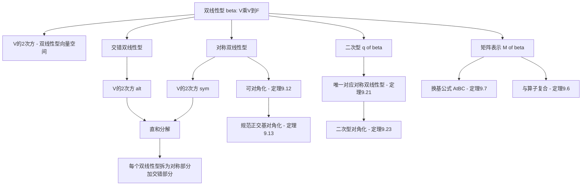

# 9A 双线性和二次型

> [!abstract] 本节概览
> 本节是第9章"多重线性代数和行列式"的开篇，引入了==双线性型==（bilinear form）和==二次型==（quadratic form）两个核心概念。逻辑链条如下：
>
> 1. **定义9.1：双线性型** $\to$ $V \times V \to \mathbb{F}$ 上两个位置分别线性的函数
> 2. **定义9.3/9.4：$V^{(2)}$ 与矩阵表示** $\to$ 双线性型构成向量空间，每个双线性型对应一个矩阵
> 3. **定理9.5/9.6/9.7：基本性质** $\to$ 维数公式、与算子复合的矩阵关系、换基公式 $A = C^t B C$
> 4. **对称双线性型** $\to$ 定义9.9、定理9.12（可对角化的4个等价条件）、定理9.13（规范正交基对角化）
> 5. **交错双线性型** $\to$ 定义9.14、定理9.16（刻画）、定理9.17（直和分解 $V^{(2)} = V^{(2)}_{\text{sym}} \oplus V^{(2)}_{\text{alt}}$）
> 6. **二次型** $\to$ 定义9.18、定理9.20（$\mathbb{F}^n$上的二次型）、定理9.21（4个等价刻画）、定理9.23（对角化）
>
> **核心主线**：双线性型的一般理论 $\to$ 对称双线性型（可对角化）$\to$ 交错双线性型（反对称）$\to$ 直和分解 $\to$ 二次型（对称双线性型的对角线）。
>
> **前置依赖**：[[6A 内积和范数]]（内积的定义与性质）、[[7A 自伴算子和正规算子]]（自伴算子、伴随）、[[7B 谱定理]]（实谱定理7.29）、[[7C 正算子]]（正算子）、[[3C 矩阵]]（矩阵的运算、换基公式3.84）、[[3F 对偶]]（对偶空间 $V'$、线性泛函）、[[8D 联系矩阵与算子的桥梁——迹]]（迹的性质）。

---

## 一、双线性型的定义与基本性质

### 1.1 双线性型的定义

> [!def] 定义9.1：双线性型（bilinear form）
> $V$ 上的一个**双线性型**是一个函数 $\beta : V \times V \to \mathbb{F}$，该函数满足：对于所有 $u \in V$，
> $$v \mapsto \beta(v, u) \quad \text{与} \quad v \mapsto \beta(u, v)$$
> 都是 $V$ 上的**线性泛函**。

**直观理解**：双线性型是"两个变量同时线性"的函数——固定任意一个位置的向量，在另一个位置上就是线性的。但要注意，==双线性型本身不是线性映射==（见下方补充理解7.1）。

**与内积的关系**：
- 若 $V$ 是实内积空间，内积 $\langle u, v \rangle$ 是一个双线性型（但还额外满足对称性和正定性）
- 若 $V$ 是复内积空间，内积==不是==双线性型，因为第二个位置上是共轭线性的（复数被提出时变为复共轭）

### 1.2 双线性型的具体例子

> [!example] 例9.2：双线性型
>
> **例1**：$\mathbb{F}^3$ 上的双线性型
> $$\beta\bigl((x_1, x_2, x_3),\, (y_1, y_2, y_3)\bigr) = x_1 y_2 - 5x_2 y_3 + 2x_3 y_1$$
>
> **例2**：矩阵定义的双线性型。设 $A$ 是 $n \times n$ 矩阵，第 $j$ 行第 $k$ 列元素为 $A_{j,k} \in \mathbb{F}$。定义 $\mathbb{F}^n$ 上的双线性型 $\beta_A$ 为
> $$\beta_A\bigl((x_1, \ldots, x_n),\, (y_1, \ldots, y_n)\bigr) = \sum_{k=1}^{n}\sum_{j=1}^{n} A_{j,k}\, x_j\, y_k$$
> 例1就是本例取 $n=3$ 和 $A = \begin{pmatrix} 0 & 1 & 0 \\ 0 & 0 & -5 \\ 2 & 0 & 0 \end{pmatrix}$ 时的特殊情况。
>
> **例3**：设 $V$ 是实内积空间且 $T \in \mathcal{L}(V)$。定义为 $\beta(u, v) = \langle u, Tv \rangle$ 的函数 $\beta : V \times V \to \mathbb{R}$ 是 $V$ 上的双线性型。
>
> **例4**：定义为 $\beta(p, q) = p(2) \cdot q'(3)$ 的函数 $\beta : P_n(\mathbb{R}) \times P_n(\mathbb{R}) \to \mathbb{R}$ 是 $P_n(\mathbb{R})$ 上的双线性型。
>
> **例5**：设 $\varphi, \tau \in V'$，则 $\beta(u, v) = \varphi(u) \cdot \tau(v)$ 是 $V$ 上的双线性型。
>
> **例6**（一般形式）：设 $\varphi_1, \ldots, \varphi_n, \tau_1, \ldots, \tau_n \in V'$，则
> $$\beta(u, v) = \varphi_1(u)\tau_1(v) + \cdots + \varphi_n(u)\tau_n(v)$$
> 是 $V$ 上的双线性型。

> [!warning] 双线性型不是线性映射
> 习题3表明：$V$ 上的双线性型 $\beta$ 是 $V \times V$ 上的线性映射，当且仅当 $\beta = 0$。这是因为 $\beta(au, aw) = a^2 \beta(u, w) \neq a \cdot \beta(u, w)$（除非 $a = 0$ 或 $a = 1$），不满足齐次性。

### 1.3 双线性型构成的向量空间 $V^{(2)}$

> [!def] 定义9.3：$V^{(2)}$
> $V$ 上的双线性型构成的集合记为 $V^{(2)}$。在通常的函数加法与标量乘法运算下，$V^{(2)}$ 是向量空间。

### 1.4 双线性型的矩阵

> [!def] 定义9.4：双线性型的矩阵 $M(\beta)$
> 设 $\beta$ 是 $V$ 上的双线性型，$e_1, \ldots, e_n$ 是 $V$ 的基。$\beta$ 关于该基的矩阵是 $n \times n$ 矩阵 $M(\beta)$，其中第 $j$ 行第 $k$ 列元素由下式给出：
> $$M(\beta)_{j,k} = \beta(e_j, e_k)$$
> 如果从上下文不能明确基的选取，就用 $M_{\beta,(e_1,\ldots,e_n)}$ 这个记号。

**直觉**：与算子的矩阵类似——算子用矩阵记录"基向量被映射到哪里"，双线性型用矩阵记录"基向量两两配对的结果"。

### 1.5 维数公式

> [!thm] 定理9.5：$\dim V^{(2)} = (\dim V)^2$
> 设 $e_1, \ldots, e_n$ 是 $V$ 的基。那么映射 $\beta \mapsto M(\beta)$ 是将 $V^{(2)}$ 映成 $\mathbb{F}^{n,n}$ 的同构。此外，$\dim V^{(2)} = (\dim V)^2$。

> [!abstract] 证明思路
> **[关键步骤]**：
> 1. 映射 $\beta \mapsto M(\beta)$ 显然是从 $V^{(2)}$ 到 $\mathbb{F}^{n,n}$ 的线性映射。
> 2. 构造逆映射：对 $A \in \mathbb{F}^{n,n}$，定义双线性型 $\beta_A$ 为
>    $$\beta_A(x_1 e_1 + \cdots + x_n e_n,\; y_1 e_1 + \cdots + y_n e_n) = \sum_{k=1}^{n}\sum_{j=1}^{n} A_{j,k}\, x_j\, y_k$$
> 3. 验证这两个映射互逆：$\beta_{M(\beta)} = \beta$ 且 $M(\beta_A) = A$。
> 4. 因此两个映射都是同构，$\dim V^{(2)} = \dim \mathbb{F}^{n,n} = n^2 = (\dim V)^2$。

### 1.6 双线性型与算子的复合

> [!thm] 定理9.6：双线性型与算子的复合
> 设 $\beta$ 是 $V$ 上的双线性型，$T \in \mathcal{L}(V)$。定义 $V$ 上的双线性型 $\alpha$ 和 $\rho$ 为
> $$\alpha(u, v) = \beta(u, Tv) \quad \text{与} \quad \rho(u, v) = \beta(Tu, v)$$
> 令 $e_1, \ldots, e_n$ 是 $V$ 的基。那么
> $$M(\alpha) = M(\beta)\, M(T) \quad \text{且} \quad M(\rho) = M(T)^t\, M(\beta)$$

> [!abstract] 证明思路
> **[关键步骤]**：对 $\alpha$ 的情形，直接计算矩阵元素：
> $$M(\alpha)_{j,k} = \alpha(e_j, e_k) = \beta(e_j, Te_k) = \beta\Bigl(e_j, \sum_{m=1}^{n} M(T)_{m,k}\, e_m\Bigr) = \sum_{m=1}^{n} \beta(e_j, e_m)\, M(T)_{m,k} = \bigl[M(\beta)\, M(T)\bigr]_{j,k}$$
> 对 $\rho$ 的情形类似可证。

**直觉**：$\alpha(u,v) = \beta(u, Tv)$ 意味着第二个输入先经过 $T$ 变换，所以矩阵在右侧乘 $M(T)$；$\rho(u,v) = \beta(Tu, v)$ 意味着第一个输入先经过 $T$ 变换，所以矩阵在左侧乘 $M(T)^t$（转置是因为第一个输入对应矩阵的行）。

### 1.7 换基公式

> [!thm] 定理9.7：换基公式（change-of-basis formula）
> 设 $\beta \in V^{(2)}$。设 $e_1, \ldots, e_n$ 和 $f_1, \ldots, f_n$ 是 $V$ 的基。令
> $$A = M_{\beta,(e_1,\ldots,e_n)}, \quad B = M_{\beta,(f_1,\ldots,f_n)}, \quad C = M_{I,(e_1,\ldots,e_n),(f_1,\ldots,f_n)}$$
> 那么
> $$A = C^t\, B\, C$$

> [!abstract] 证明思路
> **[关键步骤]**：
> 1. 由线性映射引理（3.4），存在算子 $T \in \mathcal{L}(V)$ 使得 $Tf_k = e_k$（对每个 $k$），且 $M_{T,(f_1,\ldots,f_n)} = C$。
> 2. 定义 $\alpha(u,v) = \beta(u, Tv)$ 和 $\rho(u,v) = \alpha(Tu, v) = \beta(Tu, Tv)$。
> 3. 则 $\beta(e_j, e_k) = \beta(Tf_j, Tf_k) = \rho(f_j, f_k)$，所以 $A = M_{\rho,(f_1,\ldots,f_n)}$。
> 4. 由定理9.6：$M_{\rho,(f_1,\ldots,f_n)} = C^t\, M_{\alpha,(f_1,\ldots,f_n)} = C^t\, B\, C$。

> [!important] 换基公式对比
> | | 双线性型 | 算子 |
> |---|---|---|
> | **换基公式** | $A = C^t B C$ | $A = C^{-1} B C$ |
> | **变换类型** | 合同变换（congruence） | 相似变换（similarity） |
> | **关键区别** | 用转置 $C^t$ | 用逆 $C^{-1}$ |
>
> 为什么双线性型用 $C^t$？因为双线性型涉及==两个==输入向量，换基时两个都要变换（见补充理解7.3）。

### 1.8 例题：$P_2(\mathbb{R})$ 上双线性型的矩阵

> [!example] 例9.8：$P_2(\mathbb{R})$ 上的一个双线性型的矩阵
> 定义 $P_2(\mathbb{R})$ 上的双线性型 $\beta$ 为 $\beta(p, q) = p(2) \cdot q'(3)$。令
> $$A = M_{\beta,(1,\, x-2,\, (x-3)^2)}, \quad B = M_{\beta,(1,\, x,\, x^2)}, \quad C = M_{I,(1,\, x-2,\, (x-3)^2),\, (1,\, x,\, x^2)}$$
> 那么
> $$A = \begin{pmatrix} 0 & 1 & 0 \\ 0 & 0 & 0 \\ 0 & 1 & 0 \end{pmatrix}, \quad B = \begin{pmatrix} 0 & 1 & 6 \\ 0 & 2 & 12 \\ 0 & 4 & 24 \end{pmatrix}, \quad C = \begin{pmatrix} 1 & -2 & 9 \\ 0 & 1 & -6 \\ 0 & 0 & 1 \end{pmatrix}$$
> 由换基公式 9.7 可断言 $A = C^t B C$，可通过矩阵乘法验证。

---

## 二、对称双线性型

### 2.1 对称双线性型的定义

> [!def] 定义9.9：对称双线性型（symmetric bilinear form）、$V^{(2)}_{\text{sym}}$
> 称双线性型 $\rho \in V^{(2)}$ 是**对称的**，若
> $$\rho(u, w) = \rho(w, u)$$
> 对所有 $u, w \in V$ 都成立。$V$ 上对称双线性型构成的集合记作 $V^{(2)}_{\text{sym}}$。

### 2.2 对称矩阵

> [!def] 定义9.11：对称矩阵（symmetric matrix）
> 若方阵 $A$ 与其转置相等（$A = A^t$），则称 $A$ 是**对称的**。

> [!info] 对称矩阵与基的关系
> $V$ 上的算子可能关于 $V$ 的某些基（但不是所有基）具有对称矩阵。相比之下，定理9.12表明：$V$ 上的双线性型==要么关于所有基都有对称矩阵，要么关于所有基都没有对称矩阵==。这是一个重要的区别。

### 2.3 对称双线性型的例子

> [!example] 例9.10：对称双线性型
>
> **例1**：若 $V$ 是实内积空间且 $\rho(u, w) = \langle u, w \rangle$，则 $\rho$ 是对称双线性型。
>
> **例2**：设 $V$ 是实内积空间且 $T \in \mathcal{L}(V)$，定义 $\rho(u, w) = \langle u, Tw \rangle$。那么==当且仅当 $T$ 是[[7A 自伴算子和正规算子|自伴算子]]时==，$\rho$ 是对称双线性型。
>
> **例3**：定义 $\rho : \mathcal{L}(V) \times \mathcal{L}(V) \to \mathbb{F}$ 为 $\rho(S, T) = \operatorname{tr}(ST)$。那么 $\rho$ 是 $\mathcal{L}(V)$ 上的对称双线性型，因为 $\operatorname{tr}(ST) = \operatorname{tr}(TS)$（参见[[8D 联系矩阵与算子的桥梁——迹|定理8.56]]）。

### 2.4 对称双线性型的可对角化性

> [!thm] 定理9.12：对称双线性型是可对角化的
> 设 $\rho \in V^{(2)}$。那么下面各命题等价：
>
> (a) $\rho$ 是 $V$ 上的对称双线性型。
>
> (b) $M_{\rho,(e_1,\ldots,e_n)}$ 对 $V$ 的==每个==基 $e_1, \ldots, e_n$ 都是对称矩阵。
>
> (c) $M_{\rho,(e_1,\ldots,e_n)}$ 对 $V$ 的==某个==基 $e_1, \ldots, e_n$ 是对称矩阵。
>
> (d) $M_{\rho,(e_1,\ldots,e_n)}$ 对 $V$ 的==某个==基 $e_1, \ldots, e_n$ 是==对角矩阵==。

> [!abstract] 证明思路
> **[关键步骤]**：
>
> **(a) $\Rightarrow$ (b)**：若 $\rho$ 对称，则 $\rho(e_j, e_k) = \rho(e_k, e_j)$，即 $M(\rho)_{j,k} = M(\rho)_{k,j}$，矩阵对称。
>
> **(b) $\Rightarrow$ (c)**：显然。
>
> **(c) $\Rightarrow$ (a)**：设 $M(\rho)$ 关于基 $e_1, \ldots, e_n$ 对称。对任意 $u = \sum a_j e_j$，$w = \sum b_k e_k$：
> $$\rho(u, w) = \sum_{j,k} a_j b_k \rho(e_j, e_k) = \sum_{j,k} a_j b_k \rho(e_k, e_j) = \rho(w, u)$$
> 其中第三步利用了矩阵的对称性。
>
> **(d) $\Rightarrow$ (c)**：对角矩阵都是对称的。
>
> **(a) $\Rightarrow$ (d)**（归纳法）：$n = 1$ 时显然。设 $n > 1$ 且 $\rho \neq 0$。关键观察：
> $$2\rho(u, w) = \rho(u+w, u+w) - \rho(u,u) - \rho(w,w)$$
> 因为 $\rho \neq 0$，存在 $v \in V$ 使得 $\rho(v, v) \neq 0$。令 $U = \{u \in V : \rho(u, v) = 0\}$，则 $\dim U = n - 1$。由归纳假设，$U$ 有基 $e_1, \ldots, e_{n-1}$ 使 $\rho|_{U \times U}$ 的矩阵为对角矩阵。因为 $\rho(e_k, v) = 0$（由 $U$ 的定义）且 $\rho(v, e_k) = 0$（由对称性），所以 $e_1, \ldots, e_{n-1}, v$ 就是所需的基。

> [!tip] 归纳法中的关键技巧
> 证明 (a) $\Rightarrow$ (d) 的核心是找到一个 $v$ 使得 $\rho(v, v) \neq 0$。恒等式
> $$2\rho(u, w) = \rho(u+w, u+w) - \rho(u,u) - \rho(w,w)$$
> 保证了这样的 $v$ 一定存在（如果 $\rho \neq 0$）。然后利用 $v$ 的正交补 $U$ 进行归纳。

### 2.5 用规范正交基将对称双线性型对角化

> [!thm] 定理9.13：用规范正交基将对称双线性型对角化
> 设 $V$ 是实内积空间且 $\rho$ 是 $V$ 上的对称双线性型。那么 $\rho$ 关于 $V$ 的某个==规范正交基==有对角矩阵。

> [!abstract] 证明思路
> **[关键步骤]**：
> 1. 取 $V$ 的规范正交基 $f_1, \ldots, f_n$，令 $B = M_{\rho,(f_1,\ldots,f_n)}$。由定理9.12，$B$ 是对称矩阵。
> 2. 令 $T \in \mathcal{L}(V)$ 使得 $M_{T,(f_1,\ldots,f_n)} = B$，则 $T$ 是自伴的。
> 3. 由[[7B 谱定理|实谱定理（7.29）]]，$T$ 关于某个规范正交基 $e_1, \ldots, e_n$ 有对角矩阵。
> 4. 令 $C = M_{I,(e_1,\ldots,e_n),(f_1,\ldots,f_n)}$，则 $C^{-1}BC$ 是对角矩阵。
> 5. 因为 $C$ 是实幺正矩阵，$C^{-1} = C^t$，所以
>    $$M_{\rho,(e_1,\ldots,e_n)} = C^t B C = C^{-1} B C$$
>    也是对角矩阵。

> [!note] 注意
> 此处内积与双线性型==无关==——内积只是用来提供规范正交基的概念。双线性型 $\rho$ 本身不需要与内积有任何关系。

---

## 三、交错双线性型

### 3.1 交错双线性型的定义

> [!def] 定义9.14：交错双线性型（alternating bilinear form）、$V^{(2)}_{\text{alt}}$
> 称双线性型 $\alpha \in V^{(2)}$ 是**交错的**，若对于所有 $v \in V$ 有
> $$\alpha(v, v) = 0$$
> $V$ 上交错双线性型所构成的集合记为 $V^{(2)}_{\text{alt}}$。

### 3.2 交错双线性型的例子

> [!example] 例9.15：交错双线性型
>
> **例1**：设 $n \geq 3$，$\alpha : \mathbb{F}^n \times \mathbb{F}^n \to \mathbb{F}$ 定义为
> $$\alpha\bigl((x_1, \ldots, x_n),\, (y_1, \ldots, y_n)\bigr) = x_1 y_2 - x_2 y_1 + x_1 y_3 - x_3 y_1$$
> 那么 $\alpha$ 是交错双线性型。验证：$\alpha((x_1, \ldots, x_n), (x_1, \ldots, x_n)) = x_1 x_2 - x_2 x_1 + x_1 x_3 - x_3 x_1 = 0$。
>
> **例2**：设 $\varphi, \tau \in V'$，定义为 $\alpha(u, w) = \varphi(u)\tau(w) - \varphi(w)\tau(u)$ 的双线性型是交错的。

### 3.3 交错双线性型的刻画

> [!thm] 定理9.16：交错双线性型的刻画
> $V$ 上的双线性型 $\alpha$ 是交错的，当且仅当
> $$\alpha(u, w) = -\alpha(w, u)$$
> 对所有 $u, w \in V$ 都成立。

> [!abstract] 证明思路
> **[关键步骤]**：
>
> **交错 $\Rightarrow$ 反对称**：若 $\alpha$ 交错，则
> $$0 = \alpha(u+w, u+w) = \alpha(u,u) + \alpha(u,w) + \alpha(w,u) + \alpha(w,w) = \alpha(u,w) + \alpha(w,u)$$
> 所以 $\alpha(u,w) = -\alpha(w,u)$。
>
> **反对称 $\Rightarrow$ 交错**：若 $\alpha(u,w) = -\alpha(w,u)$ 对所有 $u, w$ 成立，则 $\alpha(v,v) = -\alpha(v,v)$，即 $2\alpha(v,v) = 0$。在 $\mathbb{F} = \mathbb{R}$ 或 $\mathbb{C}$ 中，$2 \neq 0$，所以 $\alpha(v,v) = 0$。

### 3.4 直和分解

> [!thm] 定理9.17：$V^{(2)} = V^{(2)}_{\text{sym}} \oplus V^{(2)}_{\text{alt}}$
> 集合 $V^{(2)}_{\text{sym}}$ 和 $V^{(2)}_{\text{alt}}$ 都是 $V^{(2)}$ 的子空间，且有
> $$V^{(2)} = V^{(2)}_{\text{sym}} \oplus V^{(2)}_{\text{alt}}$$

> [!abstract] 证明思路
> **[关键步骤]**：
>
> **子空间验证**：对称双线性型的和与标量倍仍是对称的，所以 $V^{(2)}_{\text{sym}}$ 是子空间。类似地，$V^{(2)}_{\text{alt}}$ 也是子空间。
>
> **和等于全空间**：对任意 $\beta \in V^{(2)}$，定义
> $$\rho(u, w) = \frac{\beta(u,w) + \beta(w,u)}{2}, \quad \alpha(u, w) = \frac{\beta(u,w) - \beta(w,u)}{2}$$
> 则 $\rho \in V^{(2)}_{\text{sym}}$，$\alpha \in V^{(2)}_{\text{alt}}$，且 $\beta = \rho + \alpha$。
>
> **交集为零**：若 $\beta \in V^{(2)}_{\text{sym}} \cap V^{(2)}_{\text{alt}}$，则由定理9.16，
> $$\beta(u, w) = -\beta(w, u) = -\beta(u, w)$$
> 对所有 $u, w$ 成立，所以 $\beta = 0$。
>
> 由直和判别法（1.46），$V^{(2)} = V^{(2)}_{\text{sym}} \oplus V^{(2)}_{\text{alt}}$。

> [!tip] 对称化与反对称化
> 分解 $\beta = \rho + \alpha$ 就是==对称化==和==反对称化==：
> - $\rho(u,w) = \dfrac{\beta(u,w) + \beta(w,u)}{2}$（对称部分）
> - $\alpha(u,w) = \dfrac{\beta(u,w) - \beta(w,u)}{2}$（交错部分）
>
> 这与"任何函数 = 偶函数 + 奇函数"的分解完全类似（见补充理解7.4）。

---

## 四、二次型

### 4.1 二次型的定义

> [!def] 定义9.18：关联于双线性型的二次型（quadratic form）、$q_\beta$
> 对于 $V$ 上的双线性型 $\beta$，定义函数 $q_\beta : V \to \mathbb{F}$ 为
> $$q_\beta(v) = \beta(v, v)$$
> 称函数 $q : V \to \mathbb{F}$ 是 $V$ 上的**二次型**，如果存在 $V$ 上的双线性型 $\beta$ 使得 $q = q_\beta$。

> [!note] 注意
> 如果 $\beta$ 是交错双线性型，那么 $q_\beta = 0$（因为 $\beta(v, v) = 0$ 对所有 $v$ 成立）。反之亦然。

### 4.2 二次型的例子

> [!example] 例9.19：二次型
> 设 $\beta$ 是 $\mathbb{R}^3$ 上的双线性型，定义为
> $$\beta\bigl((x_1, x_2, x_3),\, (y_1, y_2, y_3)\bigr) = x_1 y_1 - 4x_1 y_2 + 8x_1 y_3 - 3x_3 y_3$$
> 那么 $\mathbb{R}^3$ 上的二次型 $q_\beta$ 由下式给出：
> $$q_\beta(x_1, x_2, x_3) = x_1^2 - 4x_1 x_2 + 8x_1 x_3 - 3x_3^2$$

### 4.3 $\mathbb{F}^n$ 上的二次型

> [!thm] 定理9.20：$\mathbb{F}^n$ 上的二次型
> 设 $n$ 是正整数，$q$ 是 $\mathbb{F}^n$ 到 $\mathbb{F}$ 的函数。那么 $q$ 是 $\mathbb{F}^n$ 上的二次型，当且仅当存在数 $A_{j,k} \in \mathbb{F}$（$j, k \in \{1, \ldots, n\}$）使得
> $$q(x_1, \ldots, x_n) = \sum_{k=1}^{n}\sum_{j=1}^{n} A_{j,k}\, x_j\, x_k$$
> 对所有 $(x_1, \ldots, x_n) \in \mathbb{F}^n$ 成立。

> [!abstract] 证明思路
> **[关键步骤]**：
>
> **$\Rightarrow$**：设 $q$ 是二次型，则存在双线性型 $\beta$ 使得 $q = q_\beta$。令 $A$ 是 $\beta$ 关于 $\mathbb{F}^n$ 标准基的矩阵，则
> $$q(x_1, \ldots, x_n) = \beta\bigl((x_1, \ldots, x_n), (x_1, \ldots, x_n)\bigr) = \sum_{k,j} A_{j,k}\, x_j\, x_k$$
>
> **$\Leftarrow$**：定义双线性型 $\beta\bigl((x_1, \ldots, x_n), (y_1, \ldots, y_n)\bigr) = \sum_{k,j} A_{j,k}\, x_j\, y_k$，则 $q = q_\beta$。

### 4.4 二次型的刻画

> [!thm] 定理9.21：二次型的刻画
> 设 $q : V \to \mathbb{F}$ 是一个函数。下面各命题等价：
>
> (a) $q$ 是一个二次型。
>
> (b) $V$ 上存在==唯一的==对称双线性型 $\rho$ 使得 $q = q_\rho$ 成立。
>
> (c) $q(\lambda v) = \lambda^2 q(v)$ 对所有 $\lambda \in \mathbb{F}$ 和 $v \in V$ 成立，并且函数
> $$(u, w) \mapsto q(u+w) - q(u) - q(w)$$
> 是 $V$ 上的对称双线性型。
>
> (d) $q(2v) = 4q(v)$ 对所有 $v \in V$ 成立，并且函数
> $$(u, w) \mapsto q(u+w) - q(u) - q(w)$$
> 是 $V$ 上的对称双线性型。

> [!abstract] 证明思路
> **[关键步骤]**：
>
> **(a) $\Rightarrow$ (b)**：由定理9.17，$\beta = \rho + \alpha$（对称 + 交错），则 $q = q_\beta = q_\rho + q_\alpha = q_\rho$（因为 $q_\alpha = 0$）。唯一性：若 $q_{\rho'} = q$，则 $q_{\rho' - \rho} = 0$，所以 $\rho' - \rho \in V^{(2)}_{\text{sym}} \cap V^{(2)}_{\text{alt}} = \{0\}$。
>
> **(b) $\Rightarrow$ (c)**：$q(\lambda v) = \rho(\lambda v, \lambda v) = \lambda^2 \rho(v, v) = \lambda^2 q(v)$。且
> $$q(u+w) - q(u) - q(w) = \rho(u+w, u+w) - \rho(u,u) - \rho(w,w) = 2\rho(u,w)$$
> 是对称双线性型。
>
> **(c) $\Rightarrow$ (d)**：取 $\lambda = 2$ 即可。
>
> **(d) $\Rightarrow$ (a)**：令 $\rho(u, w) = \dfrac{q(u+w) - q(u) - q(w)}{2}$，则
> $$\rho(v, v) = \frac{q(2v) - 2q(v)}{2} = \frac{4q(v) - 2q(v)}{2} = q(v)$$
> 所以 $q = q_\rho$。

> [!important] 核心结论
> ==每个二次型对应唯一的对称双线性型==。这是定理9.21最重要的推论——尽管二次型的定义中用的是任意双线性型，但交错部分对 $q_\beta$ 没有贡献，所以二次型本质上只与对称双线性型相关。

### 4.5 与二次型相关联的对称双线性型

> [!example] 例9.22：与二次型相关联的对称双线性型
> 设 $q$ 是 $\mathbb{R}^3$ 上的二次型：
> $$q(x_1, x_2, x_3) = x_1^2 - 4x_1 x_2 + 8x_1 x_3 - 3x_3^2$$
> 例9.19给出了一个满足 $q = q_\beta$ 的双线性型 $\beta$，但 $\beta$ 不是对称的。然而，定义为
> $$\rho\bigl((x_1, x_2, x_3),\, (y_1, y_2, y_3)\bigr) = x_1 y_1 - 2x_1 y_2 - 2x_2 y_1 + 4x_1 y_3 + 4x_3 y_1 - 3x_3 y_3$$
> 的双线性型 $\rho$ 是对称的，且满足 $q = q_\rho$，这与定理9.21(b) 相吻合。

> [!tip] 如何从二次型恢复对称双线性型
> 由定理9.21的证明，对称双线性型 $\rho$ 的恢复公式为：
> $$\rho(u, w) = \frac{q(u+w) - q(u) - q(w)}{2}$$
> 在例9.22中，交叉项 $-4x_1 x_2$ 被拆分为 $-2x_1 y_2 - 2x_2 y_1$，交叉项 $8x_1 x_3$ 被拆分为 $4x_1 y_3 + 4x_3 y_1$。

### 4.6 二次型的对角化

> [!thm] 定理9.23：二次型的对角化
> 设 $q$ 是 $V$ 上的二次型。
>
> (a) 存在 $V$ 的基 $e_1, \ldots, e_n$ 和 $\lambda_1, \ldots, \lambda_n \in \mathbb{F}$，使得
> $$q(x_1 e_1 + \cdots + x_n e_n) = \lambda_1 x_1^2 + \cdots + \lambda_n x_n^2$$
> 对所有 $x_1, \ldots, x_n \in \mathbb{F}$ 成立。
>
> (b) 若 $\mathbb{F} = \mathbb{R}$ 且 $V$ 是内积空间，那么 (a) 中的基可取为 $V$ 的==规范正交基==。

> [!abstract] 证明思路
> **[关键步骤]**：
>
> **(a)**：由定理9.21，存在对称双线性型 $\rho$ 使得 $q = q_\rho$。由定理9.12，存在基 $e_1, \ldots, e_n$ 使 $M(\rho)$ 为对角矩阵，对角元素为 $\lambda_1, \ldots, \lambda_n$。则
> $$q(x_1 e_1 + \cdots + x_n e_n) = \rho\Bigl(\sum x_j e_j, \sum x_k e_k\Bigr) = \sum_{j,k} x_j x_k \rho(e_j, e_k) = \lambda_1 x_1^2 + \cdots + \lambda_n x_n^2$$
>
> **(b)**：由定理9.13，基可取为规范正交基。

> [!success] 二次型对角化的意义
> 二次型对角化消除了所有交叉项 $x_j x_k$（$j \neq k$），使二次型变为各坐标平方的加权和。对角元素 $\lambda_1, \ldots, \lambda_n$ 的符号决定了二次型的几何性质（见补充理解7.2）。

---

## 五、知识结构总览

---

## 六、核心思想与证明技巧

### 6.1 双线性型的矩阵表示与同构

定理9.5建立了 $V^{(2)} \cong \mathbb{F}^{n,n}$ 的同构关系。这意味着：
- 双线性型的所有信息都编码在矩阵中
- 双线性型的线性运算对应矩阵的线性运算
- $\dim V^{(2)} = n^2$ 是后续维数计算的基础

### 6.2 换基公式 $A = C^t B C$ 的推导策略

定理9.7的证明展示了一个精巧的策略：
1. 利用线性映射引理构造一个算子 $T$，将一组基映射到另一组
2. 定义复合双线性型 $\alpha(u,v) = \beta(u, Tv)$ 和 $\rho(u,v) = \beta(Tu, Tv)$
3. 利用定理9.6的矩阵乘法关系，将换基问题转化为矩阵运算

### 6.3 对称双线性型可对角化的归纳法

定理9.12中 (a) $\Rightarrow$ (d) 的归纳法是本节最精巧的证明：
- **关键恒等式**：$2\rho(u,w) = \rho(u+w, u+w) - \rho(u,u) - \rho(w,w)$
- **核心思想**：找到非零对角元素 $\rho(v,v) \neq 0$，然后在其正交补上进行归纳
- **与谱定理的联系**：定理9.13进一步利用[[7B 谱定理|实谱定理]]，将基提升为规范正交基

### 6.4 直和分解的证明模式

定理9.17的证明遵循标准的直和证明三步法：
1. 验证子空间
2. 证明和等于全空间（构造分解 $\beta = \rho + \alpha$）
3. 证明交集为零（利用 $\beta(u,w) = -\beta(w,u) = -\beta(u,w) \Rightarrow \beta = 0$）

### 6.5 二次型与对称双线性型的对应

定理9.21建立了二次型与对称双线性型的一一对应：
- 交错部分对 $q_\beta$ 没有贡献（因为 $\alpha(v,v) = 0$）
- 恢复公式：$\rho(u,w) = \dfrac{q(u+w) - q(u) - q(w)}{2}$
- 条件 (c) 和 (d) 提供了不依赖双线性型的二次型刻画

---

## 七、补充理解与易混淆点

### 7.1 双线性型的直觉——"两个变量同时线性"

双线性型 $\beta : V \times V \to \mathbb{F}$，固定任一位置后另一位置为线性泛函。与线性映射的关键区别：

| | 线性映射 $f : V \to \mathbb{F}$ | 双线性型 $\beta : V \times V \to \mathbb{F}$ |
|---|---|---|
| **变量个数** | 一元 | 二元 |
| **齐次性** | $f(av) = a \cdot f(v)$ | $\beta(au, aw) = a^2 \cdot \beta(u, w)$ |
| **可加性** | $f(u+w) = f(u) + f(w)$ | $\beta(u_1+u_2, v) = \beta(u_1,v) + \beta(u_2,v)$ |

==关键==：双线性型不是线性的！$\beta(au, aw) = a^2 \cdot \beta(u, w) \neq a \cdot \beta(u, w)$（除非 $a = 0$ 或 $a = 1$）。这正是习题3的结论：双线性型作为 $V \times V$ 上的线性映射，仅当 $\beta = 0$ 时成立。

**来源**：Dummit讲义 "linear in more than one variable"。

### 7.2 对称双线性型与二次型的几何意义

二次型 $q(v) = \beta(v, v)$ 在 $\mathbb{R}^n$ 上定义了一个==二次曲面==。对角化后 $q(x) = \lambda_1 x_1^2 + \cdots + \lambda_n x_n^2$，对角元素 $\lambda_i$ 的符号决定了几何形状：

| 特征值符号 | 名称 | 几何形状 | 直觉 |
|---|---|---|---|
| 全部 $> 0$ | 正定 | 椭圆面/椭圆抛物面 | 严格凸，所有方向弯曲向上 |
| 全部 $\geq 0$ | 半正定 | 可能退化为柱面 | 某些方向平坦 |
| 有正有负 | 不定型 | 双曲抛物面/马鞍面 | 马鞍形状 |
| 全部 $< 0$ | 负定 | 反向椭圆面 | 严格凹 |

==直觉==：特征向量给方向，特征值给弯曲——"用几何语言把曲率写在纸面上"。

**来源**：CSDN博客、机器学习数学教程。

### 7.3 双线性型矩阵的换基公式 $A = C^t B C$

与算子换基公式 $C^{-1} A C$ 的本质区别：

| | 算子 | 双线性型 |
|---|---|---|
| **换基公式** | $A' = C^{-1} A C$ | $A' = C^t A C$ |
| **变换类型** | 相似变换 | 合同变换 |
| **保持的性质** | 特征值、迹、行列式、秩 | 对称性、秩、正/负惯性指数 |
| **不保持的性质** | — | 特征值 |

**为什么是 $C^t$ 而不是 $C^{-1}$？** 因为双线性型涉及==两个==输入向量。设 $v = C \hat{v}$（坐标变换），则
$$\beta(v, w) = \hat{v}^t (C^t B C) \hat{w}$$
两个输入向量都需要用 $C$ 变换，所以矩阵两侧分别出现 $C^t$ 和 $C$。

**重要性质**：
- ==合同变换保持对称性==：若 $B$ 对称，则 $C^t B C$ 也对称（因为 $(C^t B C)^t = C^t B^t C = C^t B C$）
- ==合同变换不保持特征值==：但保持正惯性指数和负惯性指数（Sylvester惯性定律）

### 7.4 对称化与反对称化分解

任意双线性型 $\beta$ 可唯一分解为对称部分 + 交错部分：
$$\rho(u,w) = \frac{\beta(u,w) + \beta(w,u)}{2} \quad \text{（对称化）}$$
$$\alpha(u,w) = \frac{\beta(u,w) - \beta(w,u)}{2} \quad \text{（反对称化）}$$

**类比**：这与"偶函数 + 奇函数"分解完全类似：
$$f_{\text{even}}(x) = \frac{f(x) + f(-x)}{2}, \quad f_{\text{odd}}(x) = \frac{f(x) - f(-x)}{2}$$

**维数公式**：
- $\dim V^{(2)}_{\text{sym}} = \dfrac{n(n+1)}{2}$（对称矩阵的自由度：对角线 $n$ 个 + 上三角 $\frac{n(n-1)}{2}$ 个）
- $\dim V^{(2)}_{\text{alt}} = \dfrac{n(n-1)}{2}$（交错矩阵：对角线全为0 + 上三角 $\frac{n(n-1)}{2}$ 个）
- 验证：$\frac{n(n+1)}{2} + \frac{n(n-1)}{2} = n^2 = \dim V^{(2)}$ ✓

### 7.5 常见误区

> [!danger] 误区1：双线性型就是线性映射
> ❌ "双线性型就是线性映射"
> ✅ 双线性型是两个变量的函数，不满足齐次性 $\beta(au, aw) = a \cdot \beta(u, w)$。实际上 $\beta(au, aw) = a^2 \cdot \beta(u, w)$。习题3证明了：双线性型作为 $V \times V$ 上的线性映射，仅当 $\beta = 0$ 时成立。

> [!danger] 误区2：二次型只对应一个双线性型
> ❌ "二次型只对应一个双线性型"
> ✅ 二次型对应唯一的==对称==双线性型（定理9.21）。不同的双线性型可以产生相同的二次型——只要它们的差是交错双线性型（因为交错部分对 $q_\beta$ 没有贡献）。例9.19和例9.22展示了这一点。

> [!danger] 误区3：对称双线性型的零集是子空间
> ❌ "对称双线性型的零集 $\{v \in V : \rho(v,v) = 0\}$ 是 $V$ 的子空间"
> ✅ 习题6给出反例。一般来说，$\rho(v,v) = 0$ 的集合不一定是子空间。例如，$\mathbb{R}^2$ 上的 $\rho(x,y) = x^2 - y^2$，零集是两条直线 $y = \pm x$，不是子空间。

> [!danger] 误区4：交错双线性型要求 $\text{char}\, \mathbb{F} \neq 2$
> ❌ "交错双线性型要求 $\text{char}\, \mathbb{F} \neq 2$"
> ✅ 第四版在 $\mathbb{F} = \mathbb{R}$ 或 $\mathbb{C}$ 上定义（$\text{char}\, \mathbb{F} = 0$），所以不存在这个问题。但在一般域上，当 $\text{char}\, \mathbb{F} = 2$ 时，"交错"和"反对称"不等价，且对称和交错不互补。

---

## 八、习题精选

### 习题1：一维空间上的双线性型

> [!problem] 习题1
> 证明：如果 $\beta$ 是 $\mathbb{F}$ 上的双线性型，那么存在 $c \in \mathbb{F}$ 使得
> $$\beta(x, y) = cxy$$
> 对所有 $x, y \in \mathbb{F}$ 成立。

> [!faq]- 查看解答
> $\mathbb{F}$ 是一维向量空间，取基 $\{1\}$。$\beta$ 关于该基的矩阵是 $1 \times 1$ 矩阵 $(c)$，其中 $c = \beta(1, 1)$。对任意 $x, y \in \mathbb{F}$：
> $$\beta(x, y) = \beta(x \cdot 1, y \cdot 1) = xy \cdot \beta(1, 1) = cxy$$

### 习题3：双线性型不是线性映射

> [!problem] 习题3
> 设 $\beta : V \times V \to \mathbb{F}$ 既是 $V$ 上的双线性型也是 $V \times V$ 上的线性泛函。证明：$\beta = 0$。

> [!faq]- 查看解答
> 因为 $\beta$ 是 $V \times V$ 上的线性映射，所以对任意 $a \in \mathbb{F}$ 和 $u, v \in V$：
> $$\beta(au, av) = a \cdot \beta(u, v)$$
> 但因为 $\beta$ 是双线性型：
> $$\beta(au, av) = a^2 \cdot \beta(u, v)$$
> 因此 $a \cdot \beta(u, v) = a^2 \cdot \beta(u, v)$，即 $(a - a^2)\beta(u, v) = 0$。取 $a = 2$，得 $-2\beta(u,v) = 0$，所以 $\beta(u,v) = 0$。

### 习题4：实内积空间上双线性型的表示

> [!problem] 习题4
> 设 $V$ 是实内积空间，$\beta$ 是 $V$ 上的双线性型。证明：存在唯一的算子 $T \in \mathcal{L}(V)$ 使得
> $$\beta(u, v) = \langle u, Tv \rangle$$
> 对所有 $u, v \in V$ 成立。

> [!faq]- 查看解答
> **存在性**：固定 $v \in V$，则 $u \mapsto \beta(u, v)$ 是 $V$ 上的线性泛函。由[[6A 内积和范数|里斯表示定理]]，存在唯一的 $Tv \in V$ 使得 $\beta(u, v) = \langle u, Tv \rangle$。这样定义的映射 $v \mapsto Tv$ 是线性的（因为 $\beta$ 在第二个位置上线性），所以 $T \in \mathcal{L}(V)$。
>
> **唯一性**：若 $T_1, T_2$ 都满足条件，则 $\langle u, T_1 v \rangle = \langle u, T_2 v \rangle$ 对所有 $u, v$ 成立，所以 $T_1 v = T_2 v$ 对所有 $v$ 成立，即 $T_1 = T_2$。

### 习题6：对称双线性型的零集

> [!problem] 习题6
> 证明或给出一反例：如果 $\rho$ 是 $V$ 上的对称双线性型，那么
> $$\{v \in V : \rho(v, v) = 0\}$$
> 是 $V$ 的子空间。

> [!faq]- 查看解答
> **反例**：在 $\mathbb{R}^2$ 上定义对称双线性型 $\rho\bigl((x_1, x_2), (y_1, y_2)\bigr) = x_1 y_1 - x_2 y_2$。则
> $$\rho\bigl((x_1, x_2), (x_1, x_2)\bigr) = x_1^2 - x_2^2$$
> 零集为 $\{(x_1, x_2) : x_1^2 = x_2^2\} = \{(x, x) : x \in \mathbb{R}\} \cup \{(x, -x) : x \in \mathbb{R}\}$，这是两条直线的并集，不是子空间（例如 $(1,1) + (1,-1) = (2, 0)$ 不在零集中）。

### 习题8：$V^{(2)}_{\text{sym}}$ 和 $V^{(2)}_{\text{alt}}$ 的维数

> [!problem] 习题8
> 求 $\dim V^{(2)}_{\text{sym}}$ 和 $\dim V^{(2)}_{\text{alt}}$ 的表达式（用 $\dim V$ 表示）。

> [!faq]- 查看解答
> 设 $n = \dim V$。
>
> **方法一**（利用直和分解）：由定理9.17，$V^{(2)} = V^{(2)}_{\text{sym}} \oplus V^{(2)}_{\text{alt}}$，所以 $\dim V^{(2)}_{\text{sym}} + \dim V^{(2)}_{\text{alt}} = \dim V^{(2)} = n^2$。
>
> 对称矩阵的自由度：对角线 $n$ 个元素 + 上三角 $\frac{n(n-1)}{2}$ 个元素 = $\frac{n(n+1)}{2}$。
>
> 交错矩阵的自由度：对角线全为0 + 上三角 $\frac{n(n-1)}{2}$ 个元素 = $\frac{n(n-1)}{2}$。
>
> 验证：$\frac{n(n+1)}{2} + \frac{n(n-1)}{2} = n^2$ ✓
>
> **方法二**（利用同构）：映射 $\beta \mapsto M(\beta)$ 将 $V^{(2)}_{\text{sym}}$ 同构地映为对称矩阵空间，将 $V^{(2)}_{\text{alt}}$ 同构地映为交错矩阵空间（对角线为0且 $A_{j,k} = -A_{k,j}$ 的矩阵空间）。
>
> $$\dim V^{(2)}_{\text{sym}} = \frac{n(n+1)}{2}, \quad \dim V^{(2)}_{\text{alt}} = \frac{n(n-1)}{2}$$

---

## 九、视频学习指南

暂无对应视频，建议通过阅读教材原文和本笔记学习。

**建议学习路径**：
1. 先通读本笔记的"概览"和"知识结构总览"，建立整体框架
2. 按章节顺序学习，每学完一个定义/定理后做对应的习题
3. 重点理解换基公式 $A = C^t B C$ 与算子换基公式 $A = C^{-1} B C$ 的区别
4. 通过补充理解模块加深对双线性型几何意义的认识

---

## 十、教材原文
#学习/线性代数/多重线性代数和行列式/双线性型
