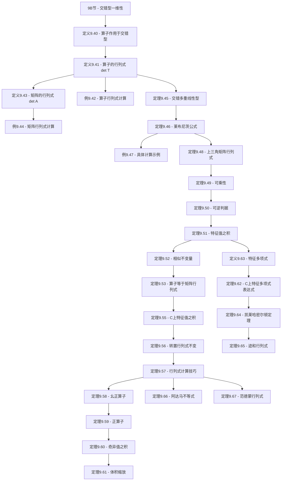

# 9C 行列式

> [!abstract] 本节概览
> 本节是第9章"多重线性代数和行列式"的第三小节，也是==行列式==理论的完整展开。基于[[9B 交错多重线性型|9B节]]建立的理论基础（$\dim V^{(n)}_{\text{alt}} = 1$），本节定义行列式并推导其全部核心性质。逻辑链条如下：
>
> 1. **定义9.40/9.41：算子的行列式** $\to$ $\alpha^T$：算子作用于交错型；$\det T$：唯一标量使得 $\alpha^T = (\det T)\alpha$
> 2. **定义9.43：矩阵的行列式** $\to$ $\det A$：算子行列式在特定基下的表示
> 3. **定理9.45-9.48：基本公式** $\to$ 行列式是交错多重线性型；莱布尼茨公式；上三角矩阵行列式
> 4. **定理9.49-9.57：核心性质** $\to$ 可乘性；可逆判据；特征值与行列式；相似不变量；计算技巧
> 5. **定理9.55-9.61：算子理论** $\to$ 特征值之积；幺正算子；正算子；奇异值；体积缩放
> 6. **定理9.62-9.65：特征多项式** $\to$ $\det(zI - T)$；[[凯莱-哈密尔顿定理]]；迹与行列式
> 7. **定理9.66-9.67：经典结果** $\to$ [[阿达马不等式]]；[[范德蒙矩阵]]的行列式
>
> **核心主线**：交错型一维性 $\to$ 算子行列式定义 $\to$ 矩阵行列式 $\to$ 基本公式 $\to$ 核心性质 $\to$ 算子理论联系 $\to$ 特征多项式 $\to$ 经典结果。
>
> **前置依赖**：[[9B 交错多重线性型]]（交错型、排列符号、一维性）、[[9A 双线性和二次型]]（双线性型）、[[5A 不变子空间、特征值和特征向量]]（特征值、特征向量）、[[5C 上三角矩阵]]（上三角矩阵）、[[8D 联系矩阵与算子的桥梁——迹]]（迹）、[[7A 自伴算子和正规算子]]（自伴算子）、[[7D 等距映射、幺正算子和矩阵分解]]（幺正算子）、[[7E 奇异值分解与推论]]（奇异值分解）。

---

## 一、行列式的定义

### 1.1 算子作用于交错型

> [!def] 定义9.40：$\alpha^T$（算子作用于交错型）
> 设 $T \in \mathcal{L}(V)$ 且 $\alpha$ 是 $V$ 上的交错 $n$ 重线性型，其中 $n = \dim V$。定义 $V$ 上的交错 $n$ 重线性型 $\alpha^T$ 为
> $$\alpha^T(v_1, \ldots, v_n) = \alpha(Tv_1, \ldots, Tv_n)$$
> 其中 $v_1, \ldots, v_n \in V$。

**验证**：
- $\alpha^T$ 是 $n$ 重线性型：因为 $\alpha$ 是 $n$ 重线性型，且 $T$ 是线性的，所以 $v_k \mapsto \alpha(Tv_1, \ldots, Tv_n)$ 在每个位置上都是线性的。
- $\alpha^T$ 是交错的：若 $v_j = v_k$（$j \neq k$），则 $Tv_j = Tv_k$，由 $\alpha$ 的交错性得 $\alpha^T(v_1, \ldots, v_n) = 0$。

**直觉**：$\alpha^T$ 就是"先用 $T$ 变换所有输入向量，再测量有向体积"。$T$ 改变了向量的位置和方向，从而改变了由这些向量张成的平行多面体的体积。

### 1.2 算子的行列式

> [!def] 定义9.41：算子的行列式 $\det T$
> 设 $T \in \mathcal{L}(V)$ 且 $\alpha$ 是 $V$ 上的非零交错 $n$ 重线性型，其中 $n = \dim V$。$T$ 的==行列式==（determinant），记作 $\det T$，定义为满足
> $$\alpha^T = (\det T)\,\alpha$$
> 的标量。即对所有 $v_1, \ldots, v_n \in V$，
> $$\alpha(Tv_1, \ldots, Tv_n) = (\det T)\,\alpha(v_1, \ldots, v_n)$$

**良定义性**：这个定义不依赖于 $\alpha$ 的选择。设 $\alpha'$ 是另一个非零交错 $n$ 重线性型，由[[9B 交错多重线性型|定理9.37]]（$\dim V^{(n)}_{\text{alt}} = 1$），存在 $c \neq 0$ 使得 $\alpha' = c\alpha$。则
$$(\alpha')^T = c\alpha^T = c(\det T)\alpha = (\det T)(c\alpha) = (\det T)\alpha'$$
所以同一个 $\det T$ 对 $\alpha'$ 也成立。

> [!success] 行列式的本质含义
> ==行列式 $\det T$ 就是线性算子 $T$ 对有向体积的缩放因子==。如果 $\alpha$ 测量"单位体积"，那么 $\alpha^T$ 测量"$T$ 变换后的体积"，两者的比值就是 $\det T$。
> - $\det T > 0$：$T$ 保持定向（右手系仍为右手系）
> - $\det T < 0$：$T$ 翻转定向（右手系变为左手系）
> - $\det T = 0$：$T$ 将空间"压扁"（不可逆）

### 1.3 矩阵的行列式

> [!def] 定义9.43：矩阵的行列式 $\det A$
> 设 $A$ 是 $\mathbb{F}$ 上的 $n \times n$ 方阵。$A$ 的==行列式==（determinant），记作 $\det A$，定义为 $\mathcal{L}(\mathbb{F}^n)$ 中关于标准基的矩阵为 $A$ 的算子的行列式。

**与算子行列式的关系**：设 $T \in \mathcal{L}(V)$ 关于某个基 $e_1, \ldots, e_n$ 的矩阵为 $A$，则 $\det T = \det A$（由定理9.53，稍后证明）。

### 1.4 算子行列式的例子

> [!example] 例9.42：算子的行列式
>
> **例1**：$\det I = 1$。因为 $\alpha^{I}(v_1, \ldots, v_n) = \alpha(Iv_1, \ldots, Iv_n) = \alpha(v_1, \ldots, v_n)$，所以 $\alpha^I = 1 \cdot \alpha$。
>
> **例2**：$\det(\lambda I) = \lambda^n$，其中 $n = \dim V$。因为 $\alpha^{\lambda I}(v_1, \ldots, v_n) = \alpha(\lambda v_1, \ldots, \lambda v_n) = \lambda^n\, \alpha(v_1, \ldots, v_n)$（$\alpha$ 在每个位置上线性，提取 $n$ 个 $\lambda$）。
>
> **例3**：$\det(\lambda T) = \lambda^n \det T$。理由同上。
>
> **例4**：若 $T$ 关于某个基的矩阵是对角矩阵 $\operatorname{diag}(\lambda_1, \ldots, \lambda_n)$，则 $\det T = \lambda_1 \lambda_2 \cdots \lambda_n$。这是因为 $T$ 在各个基向量方向上分别缩放 $\lambda_1, \ldots, \lambda_n$ 倍，体积缩放因子就是各方向缩放因子的乘积。

### 1.5 矩阵行列式的简单例子

> [!example] 例9.44：矩阵的行列式
>
> **例1**：$\det I = 1$（$n \times n$ 单位矩阵），因为单位算子的行列式为 $1$。
>
> **例2**：$\det \operatorname{diag}(\lambda_1, \ldots, \lambda_n) = \lambda_1 \lambda_2 \cdots \lambda_n$，因为对角矩阵对应的算子在各坐标方向上分别缩放 $\lambda_1, \ldots, \lambda_n$ 倍。

---

## 二、行列式的基本公式与性质

### 2.1 行列式是交错多重线性型

> [!thm] 定理9.45：行列式是交错多重线性型
> 设 $n = \dim V$。将 $\det$ 视为 $\mathcal{L}(V)$ 上的函数，则 $\det$ 是 $\mathcal{L}(V)$ 上的交错 $n$ 重线性型。

> [!abstract] 证明思路
> **[利用定义9.41和交错型的性质]**：
> 1. 固定 $T_2, \ldots, T_n \in \mathcal{L}(V)$，定义 $\beta(T) = \det(T, T_2, \ldots, T_n)$（这里将 $\det$ 视为 $n$ 个算子的函数）。
> 2. 需要验证 $\beta$ 是 $\mathcal{L}(V)$ 上的线性泛函，以及 $\det$ 关于任意两个算子交换时变号。
> 3. ==关键步骤==：利用 $\alpha^T$ 的定义和 $\alpha$ 的交错多重线性性，将 $\det$ 的性质归结为 $\alpha$ 的已知性质。$\blacksquare$

> [!note] 定理9.45的精确含义
> 定理9.45说的是：如果将 $\det$ 看作从 $\mathcal{L}(V) \times \cdots \times \mathcal{L}(V)$（$n$ 个 $\mathcal{L}(V)$）到 $\mathbb{F}$ 的函数，即
> $$\det(T_1, \ldots, T_n) = \alpha(T_1 e_1, T_2 e_2, \ldots, T_n e_n)$$
> （在某种规范化的基下），那么这个函数是交错 $n$ 重线性型。这为莱布尼茨公式提供了理论基础。

### 2.2 矩阵的行列式公式（莱布尼茨公式）

> [!thm] 定理9.46：矩阵的行列式公式（莱布尼茨公式）
> 设 $A$ 是元素为 $A_{j,k}$ 的 $n \times n$ 方阵。那么
> $$\det A = \sum_{(j_1, \ldots, j_n) \in \text{perm}_n} \operatorname{sign}(j_1, \ldots, j_n)\, A_{j_1, 1}\, A_{j_2, 2} \cdots A_{j_n, n}$$

> [!abstract] 证明思路
> **[将定义9.43与定理9.36结合]**：
> 1. 设 $T \in \mathcal{L}(\mathbb{F}^n)$ 关于标准基 $e_1, \ldots, e_n$ 的矩阵为 $A$，则 $Te_k = \sum_{j=1}^{n} A_{j,k}\, e_j$。
> 2. 由定义9.41，$\det T$ 满足 $\alpha(Te_1, \ldots, Te_n) = (\det T)\, \alpha(e_1, \ldots, e_n)$。
> 3. 将 $Te_k$ 的表达式代入，由[[9B 交错多重线性型|定理9.36]]的展开公式：
>    $$\alpha(Te_1, \ldots, Te_n) = \alpha(e_1, \ldots, e_n) \sum_{(j_1, \ldots, j_n) \in \text{perm}_n} \operatorname{sign}(j_1, \ldots, j_n)\, A_{j_1, 1} \cdots A_{j_n, n}$$
> 4. 因此 $\det T = \sum_{(j_1, \ldots, j_n) \in \text{perm}_n} \operatorname{sign}(j_1, \ldots, j_n)\, A_{j_1, 1} \cdots A_{j_n, n}$。$\blacksquare$

> [!tip] 莱布尼茨公式的结构
> - 求和遍历所有 $n!$ 个排列
> - 每一项是从矩阵中每行每列各取一个元素的乘积（排列 $(j_1, \ldots, j_n)$ 表示第 $k$ 列取第 $j_k$ 行的元素）
> - 排列的符号决定该项的正负号
> - $2 \times 2$ 情形：$\det\begin{pmatrix} a & b \\ c & d \end{pmatrix} = ad - bc$（$2! = 2$ 项）
> - $3 \times 3$ 情形：$3! = 6$ 项

### 2.3 行列式公式的具体示例

> [!example] 例9.47：行列式公式的具体示例
>
> **$2 \times 2$ 矩阵**：设 $A = \begin{pmatrix} a & b \\ c & d \end{pmatrix}$。
> - 排列 $(1, 2)$：符号 $= 1$，贡献 $A_{1,1} A_{2,2} = ad$
> - 排列 $(2, 1)$：符号 $= -1$，贡献 $-A_{2,1} A_{1,2} = -bc$
> - 因此 $\det A = ad - bc$。
>
> **$3 \times 3$ 矩阵**：设 $A = \begin{pmatrix} a_{11} & a_{12} & a_{13} \\ a_{21} & a_{22} & a_{23} \\ a_{31} & a_{32} & a_{33} \end{pmatrix}$。
>
> 六个排列及其贡献：
>
> | 排列 | 符号 | 项 |
> |---|---|---|
> | $(1,2,3)$ | $+1$ | $a_{11}a_{22}a_{33}$ |
> | $(1,3,2)$ | $-1$ | $-a_{11}a_{32}a_{23}$ |
> | $(2,1,3)$ | $-1$ | $-a_{21}a_{12}a_{33}$ |
> | $(2,3,1)$ | $+1$ | $a_{21}a_{32}a_{13}$ |
> | $(3,1,2)$ | $+1$ | $a_{31}a_{12}a_{23}$ |
> | $(3,2,1)$ | $-1$ | $-a_{31}a_{22}a_{13}$ |
>
> 因此
> $$\det A = a_{11}a_{22}a_{33} + a_{21}a_{32}a_{13} + a_{31}a_{12}a_{23} - a_{11}a_{32}a_{23} - a_{21}a_{12}a_{33} - a_{31}a_{22}a_{13}$$

> [!note] 记忆技巧
> $3 \times 3$ 行列式可以用"Sarrus 法则"记忆：将前两列复制到矩阵右侧，然后沿六条对角线求和，主对角线方向取正，副对角线方向取负。但注意 Sarrus 法则只适用于 $3 \times 3$，不适用于更高维度。

### 2.4 上三角矩阵的行列式

> [!thm] 定理9.48：上三角矩阵的行列式
> 上三角矩阵的行列式等于其对角线元素之积。即若 $A$ 是上三角矩阵，则
> $$\det A = A_{1,1}\, A_{2,2} \cdots A_{n,n}$$

> [!abstract] 证明思路
> **[分析莱布尼茨公式中的非零项]**：
> 1. 在莱布尼茨公式中，一般项为 $\operatorname{sign}(j_1, \ldots, j_n)\, A_{j_1, 1}\, A_{j_2, 2} \cdots A_{j_n, n}$。
> 2. 因为 $A$ 是上三角矩阵，当 $j_k > k$ 时 $A_{j_k, k} = 0$。
> 3. ==关键步骤==：若排列 $(j_1, \ldots, j_n) \neq (1, \ldots, n)$，则存在某个 $k$ 使得 $j_k > k$（否则排列就是恒等排列）。因此除恒等排列外的所有项都为零。
> 4. 恒等排列 $(1, \ldots, n)$ 的符号为 $1$，贡献 $A_{1,1}\, A_{2,2} \cdots A_{n,n}$。$\blacksquare$

> [!corollary] 推论
> - 下三角矩阵的行列式也等于对角线元素之积（因为 $\det A^T = \det A$，由定理9.56）
> - 对角矩阵的行列式等于对角线元素之积（与例9.44一致）

---

## 三、行列式的核心性质

### 3.1 行列式是可乘的

> [!thm] 定理9.49：行列式是可乘的
> 设 $S, T \in \mathcal{L}(V)$。那么
> $$\det(ST) = (\det S)(\det T)$$

> [!abstract] 证明思路
> **[利用 $\alpha^T$ 的定义]**：
> 1. 设 $\alpha$ 是非零交错 $n$ 重线性型。
> 2. $\alpha^{ST}(v_1, \ldots, v_n) = \alpha(STv_1, \ldots, STv_n) = \alpha^S(Tv_1, \ldots, Tv_n) = (\det S)\, \alpha(Tv_1, \ldots, Tv_n) = (\det S)(\det T)\, \alpha(v_1, \ldots, v_n)$。
> 3. ==关键步骤==：$\alpha^{ST} = (\det S)(\det T)\, \alpha$，但由定义 $\alpha^{ST} = (\det(ST))\, \alpha$。
> 4. 因为 $\alpha \neq 0$，所以 $\det(ST) = (\det S)(\det T)$。$\blacksquare$

> [!success] 乘法性的直觉
> $S$ 将体积缩放 $\det S$ 倍，$T$ 再将体积缩放 $\det T$ 倍，合起来 $ST$ 将体积缩放 $(\det S)(\det T)$ 倍。这是行列式作为"体积缩放因子"的最自然性质。

### 3.2 可逆当且仅当行列式非零

> [!thm] 定理9.50：可逆 $\Leftrightarrow$ 行列式非零
> 设 $T \in \mathcal{L}(V)$。那么 $T$ 是可逆的当且仅当 $\det T \neq 0$。

> [!abstract] 证明思路
> **[双向蕴涵]**：
>
> **$\Rightarrow$**：若 $T$ 可逆，则存在 $T^{-1}$ 使得 $TT^{-1} = I$。由定理9.49：
> $$1 = \det I = \det(TT^{-1}) = (\det T)(\det T^{-1})$$
> 因此 $\det T \neq 0$，且 $\det T^{-1} = (\det T)^{-1}$。
>
> **$\Leftarrow$**：若 $\det T \neq 0$，设 $\alpha$ 是非零交错 $n$ 重线性型。由 $\alpha^T = (\det T)\alpha \neq 0$，存在 $v_1, \ldots, v_n$ 使 $\alpha(Tv_1, \ldots, Tv_n) \neq 0$。由[[9B 交错多重线性型|定理9.39]]，$Tv_1, \ldots, Tv_n$ 线性无关，因此 $T$ 是满射，从而可逆。$\blacksquare$

> [!important] 推论
> - $\det T^{-1} = \dfrac{1}{\det T}$
> - 矩阵 $A$ 可逆 $\Leftrightarrow$ $\det A \neq 0$

> [!warning] 注意
> $\det(S + T) \neq \det S + \det T$（行列式不保持加法）。行列式是==乘性==的，但不是加性的。反例见习题1。

### 3.3 特征值和行列式

> [!thm] 定理9.51：特征值和行列式
> 设 $T \in \mathcal{L}(V)$。那么 $\det T$ 等于 $T$ 的[[5A 不变子空间、特征值和特征向量|特征值]]之积（按代数重数计算）。

> [!abstract] 证明思路
> **[利用上三角化和乘法性]**：
> 1. 由[[5C 上三角矩阵|定理5.27]]，$V$ 上存在一组基使得 $T$ 关于该基的矩阵是上三角矩阵，对角线元素恰好是 $T$ 的特征值（按代数重数）。
> 2. 由定理9.53（稍后证明），$\det T$ 等于该上三角矩阵的行列式。
> 3. 由定理9.48，上三角矩阵的行列式等于对角线元素之积，即特征值之积。$\blacksquare$

> [!tip] 定理9.51的直觉
> 在特征方向上，$T$ 将该方向缩放 $\lambda_i$ 倍。各个特征方向上的缩放因子之积就是整体的体积缩放因子。这正是例9.42中"对角化算子的行列式等于对角元素之积"的一般化。

### 3.4 行列式是相似不变量

> [!thm] 定理9.52：行列式是相似不变量
> 相似矩阵有相同的行列式。即若 $A$ 和 $B$ 是相似矩阵（$B = S^{-1}AS$），则
> $$\det A = \det B$$

> [!abstract] 证明思路
> **[利用乘法性和逆的行列式]**：
> 1. $\det B = \det(S^{-1}AS) = \det(S^{-1})\det(A)\det(S) = (\det S)^{-1}(\det A)(\det S) = \det A$。$\blacksquare$

> [!note] 与迹的类比
> [[8D 联系矩阵与算子的桥梁——迹|迹]]也是相似不变量（定理8.20）。迹和行列式是两个最基本的相似不变量——迹是特征值之和，行列式是特征值之积。

### 3.5 算子的行列式等于其矩阵的行列式

> [!thm] 定理9.53：算子的行列式等于其矩阵的行列式
> 设 $T \in \mathcal{L}(V)$ 关于某个基的矩阵为 $A$。那么
> $$\det T = \det A$$

> [!abstract] 证明思路
> **[利用相似和上三角化]**：
> 1. 由[[5C 上三角矩阵|定理5.27]]，$T$ 关于某组基的矩阵是上三角矩阵 $B$，对角线元素为特征值。
> 2. $\det T$ 等于特征值之积（定理9.51），$\det B$ 也等于对角线元素之积（定理9.48），所以 $\det T = \det B$。
> 3. $A$ 和 $B$ 相似（表示同一个算子），由定理9.52，$\det A = \det B = \det T$。$\blacksquare$

### 3.6 $\mathbb{F} = \mathbb{C}$ 时行列式等于特征值之积

> [!thm] 定理9.55：$\mathbb{F} = \mathbb{C}$ 时行列式等于特征值之积
> 设 $V$ 是复向量空间且 $T \in \mathcal{L}(V)$。那么 $\det T$ 等于 $T$ 的特征值之积（按代数重数计算）。

> [!note] 与定理9.51的关系
> 定理9.51对一般域成立（利用上三角化），而定理9.55是其在 $\mathbb{C}$ 上的特化。在 $\mathbb{C}$ 上，每个算子都有足够的特征值（[[4D 特征值的存有性|代数基本定理]]保证），所以表述更简洁。

### 3.7 转置、对偶或伴随的行列式

> [!thm] 定理9.56：转置、对偶或伴随的行列式
> 设 $T \in \mathcal{L}(V)$。那么
> $$\det T' = \det T$$
> 其中 $T'$ 是 $T$ 的[[3F 对偶|对偶映射]]。等价地，对矩阵而言，
> $$\det A^T = \det A$$

> [!abstract] 证明思路
> **[利用莱布尼茨公式的对称性]**：
> 1. 对矩阵 $A$，$\det A^T$ 的莱布尼茨公式中，一般项为 $\operatorname{sign}(j_1, \ldots, j_n)\, (A^T)_{j_1, 1} \cdots (A^T)_{j_n, n} = \operatorname{sign}(j_1, \ldots, j_n)\, A_{1, j_1} \cdots A_{n, j_n}$。
> 2. 通过重新标记排列，可以证明 $\det A^T = \det A$。
> 3. ==关键步骤==：利用排列逆元的符号等于原排列的符号这一事实。$\blacksquare$

### 3.8 有助于计算行列式的若干结论

> [!thm] 定理9.57：有助于计算行列式的若干结论
> 以下结论对计算行列式有帮助：
>
> **（a）** 交换矩阵的两行（或两列），行列式变号。
>
> **（b）** 矩阵的某一行（或列）乘以标量 $c$，行列式变为原来的 $c$ 倍。
>
> **（c）** 将矩阵的一行（或列）的倍数加到另一行（或列），行列式不变。
>
> **（d）** 若矩阵有两行（或两列）相同，则行列式为零。
>
> **（e）** 若矩阵有两行（或两列）成比例，则行列式为零。

> [!abstract] 证明思路
> **[利用行列式的交错多重线性性（定理9.45）]**：
>
> **（a）** 交换两行对应于交换两个算子的输入位置，由交错性变号。
>
> **（b）** 某行乘以 $c$ 对应于某个算子乘以 $c$，由多重线性性，行列式变为 $c$ 倍。
>
> **（c）** 设将第 $j$ 行的 $c$ 倍加到第 $k$ 行。由多重线性性：
> $$\det(\ldots, r_k + c\, r_j, \ldots) = \det(\ldots, r_k, \ldots) + c\, \det(\ldots, r_j, \ldots, r_j, \ldots)$$
> 第二项中第 $j$ 行和第 $k$ 行相同（因为 $r_j$ 出现两次），由（d）为零。
>
> **（d）** 两行相同 $\to$ 交错型在两个相同输入上为零。
>
> **（e）** 两行成比例 $\to$ 提取比例因子后两行相同，由（d）和（b）得零。$\blacksquare$

> [!success] 定理9.57的实践意义
> 结论（c）是最重要的计算工具——它告诉我们==高斯消元中的"行变换"不改变行列式==（除了行交换变号、行缩放乘以系数）。因此，将矩阵化为上三角（或阶梯形）后，行列式就是对角线元素之积（乘以行交换带来的符号变化和行缩放带来的系数）。

---

## 四、行列式与算子理论

### 4.1 幺正算子的行列式

> [!thm] 定理9.58：幺正算子行列式绝对值为1
> 设 $V$ 是内积空间且 $T$ 是 $V$ 上的[[7D 等距映射、幺正算子和矩阵分解|幺正算子]]。那么
> $$|\det T| = 1$$

> [!abstract] 证明思路
> **[利用乘法性和 $T^*T = I$]**：
> 1. $T$ 是幺正算子，所以 $T^*T = I$。
> 2. $\det(T^*T) = \det I = 1$。
> 3. 由乘法性（定理9.49）和 $\det T^* = \overline{\det T}$（共轭转置的行列式等于行列式的共轭）：
>    $$1 = \det(T^*T) = (\det T^*)(\det T) = \overline{\det T} \cdot \det T = |\det T|^2$$
> 4. 因此 $|\det T| = 1$。$\blacksquare$

> [!tip] 几何直觉
> 幺正算子是"旋转"或"反射"——它保持长度和角度，因此保持体积不变。但可能翻转定向（反射的行列式为 $-1$），所以绝对值为 $1$。

### 4.2 正算子的行列式

> [!thm] 定理9.59：正算子行列式非负
> 设 $V$ 是内积空间且 $T$ 是 $V$ 上的[[7C 正算子|正算子]]。那么
> $$\det T \geq 0$$

> [!abstract] 证明思路
> **[利用谱定理]**：
> 1. 由[[7B 谱定理|谱定理]]，$T$ 关于某组规范正交基的矩阵是对角矩阵 $\operatorname{diag}(\lambda_1, \ldots, \lambda_n)$，其中 $\lambda_k \geq 0$（正算子的特征值非负）。
> 2. $\det T = \lambda_1 \lambda_2 \cdots \lambda_n \geq 0$。$\blacksquare$

### 4.3 奇异值与行列式

> [!thm] 定理9.60：$|\det T|$ = 奇异值之积
> 设 $T \in \mathcal{L}(V)$，其中 $V$ 是内积空间。那么
> $$|\det T| = s_1 s_2 \cdots s_n$$
> 其中 $s_1, \ldots, s_n$ 是 $T$ 的[[7E 奇异值分解与推论|奇异值]]。

> [!abstract] 证明思路
> **[利用奇异值分解]**：
> 1. 由[[7E 奇异值分解与推论|奇异值分解定理]]，存在 $V$ 的规范正交基 $e_1, \ldots, e_n$ 和 $T$ 的奇异值 $s_1, \ldots, s_n$ 使得 $Te_k = s_k f_k$，其中 $f_1, \ldots, f_n$ 也是规范正交基。
> 2. $\det T = s_1 s_2 \cdots s_n$（因为 $T$ 在各奇异值方向上分别缩放 $s_k$ 倍）。
> 3. 等等，需要更仔细：利用 $T = U\Sigma$（SVD），$\det T = \det U \cdot \det \Sigma = (\pm 1) \cdot s_1 \cdots s_n$。
> 4. ==关键步骤==：$|\det T| = |\det U| \cdot s_1 \cdots s_n = 1 \cdot s_1 \cdots s_n = s_1 \cdots s_n$（因为 $U$ 是幺正算子，$|\det U| = 1$）。$\blacksquare$

> [!tip] 几何直觉
> 奇异值 $s_k$ 表示 $T$ 在各个正交方向上的"拉伸因子"。行列式的绝对值就是所有方向上拉伸因子的乘积——这正是体积缩放的完整描述。

### 4.4 行列式与体积

> [!thm] 定理9.61：$T$ 将体积变为 $|\det T|$ 倍
> 设 $V$ 是内积空间且 $T \in \mathcal{L}(V)$。那么 $T$ 将体积变为原来的 $|\det T|$ 倍。

> [!abstract] 证明思路
> **[利用奇异值分解]**：
> 1. 由 SVD，$T = U\Sigma$，其中 $U$ 是幺正算子（保持体积），$\Sigma$ 是对角矩阵（在各正交方向上缩放 $s_1, \ldots, s_n$ 倍）。
> 2. $\Sigma$ 将单位立方体的体积变为 $s_1 s_2 \cdots s_n$。
> 3. 由定理9.60，$s_1 s_2 \cdots s_n = |\det T|$。
> 4. $U$ 保持体积不变（幺正算子），所以 $T = U\Sigma$ 将体积变为 $|\det T|$ 倍。$\blacksquare$

> [!success] 行列式的几何意义——最终确认
> 定理9.61正式确认了我们从一开始就强调的直觉：==行列式的绝对值就是线性变换的体积缩放因子==。这是行列式最深刻、最直观的几何意义。

---

## 五、特征多项式与凯莱-哈密尔顿

### 5.1 特征多项式的定义

> [!def] 定义9.63：特征多项式
> 设 $T \in \mathcal{L}(V)$。$T$ 的==特征多项式==（characteristic polynomial）定义为
> $$p_T(z) = \det(zI - T)$$

**基本性质**：
- $p_T$ 是 $n$ 次多项式（$n = \dim V$），因为 $\det(zI - T)$ 是关于 $z$ 的 $n$ 次多项式
- $p_T$ 的根恰好是 $T$ 的特征值（因为 $p_T(\lambda) = \det(\lambda I - T) = 0$ 当且仅当 $\lambda I - T$ 不可逆，当且仅当 $\lambda$ 是特征值）

### 5.2 $\mathbb{F} = \mathbb{C}$ 时特征多项式的表达式

> [!thm] 定理9.62：$\mathbb{F} = \mathbb{C}$ 时特征多项式 $= \det(zI - T)$
> 设 $V$ 是复向量空间且 $T \in \mathcal{L}(V)$。那么 $T$ 的特征多项式为
> $$p_T(z) = (z - \lambda_1)(z - \lambda_2) \cdots (z - \lambda_n)$$
> 其中 $\lambda_1, \ldots, \lambda_n$ 是 $T$ 的特征值（按代数重数列出）。

> [!abstract] 证明思路
> **[上三角化 + 行列式等于特征值之积]**：
> 1. 由[[5C 上三角矩阵|定理5.27]]，$T$ 关于某组基的矩阵是上三角矩阵，对角线元素为 $\lambda_1, \ldots, \lambda_n$。
> 2. $zI - T$ 关于同一基的矩阵也是上三角矩阵，对角线元素为 $z - \lambda_1, \ldots, z - \lambda_n$。
> 3. 由定理9.48，$\det(zI - T) = (z - \lambda_1)(z - \lambda_2) \cdots (z - \lambda_n)$。$\blacksquare$

### 5.3 凯莱-哈密尔顿定理

> [!thm] 定理9.64：凯莱-哈密尔顿定理（Cayley-Hamilton Theorem）
> 设 $T \in \mathcal{L}(V)$。那么 $T$ 满足其特征多项式，即
> $$p_T(T) = 0$$
> 其中 $p_T$ 是 $T$ 的特征多项式。

> [!abstract] 证明思路
> **[利用上三角化和零化多项式]**：
> 1. 在 $\mathbb{C}$ 上：$p_T(z) = (z - \lambda_1) \cdots (z - \lambda_n)$。由[[5B 最小多项式|5.34]]，$(T - \lambda_1 I) \cdots (T - \lambda_n I) = 0$（广义特征空间分解）。
> 2. 在一般域上：利用代数闭包扩展，或直接利用[[8C 广义特征空间分解的推论|定理8.21]]（$T$ 被其特征多项式零化）。
> 3. ==关键步骤==：特征多项式是[[5B 最小多项式|最小多项式]]的倍数，而最小多项式零化 $T$，所以特征多项式也零化 $T$。$\blacksquare$

> [!success] 凯莱-哈密尔顿定理的意义
> ==每个线性算子都满足一个多项式方程==——这个方程就是它的特征多项式。这意味着：
> - $T^n$ 可以表示为 $I, T, T^2, \ldots, T^{n-1}$ 的线性组合
> - 提供了一种系统计算算子多项式的方法
> - 是[[5B 最小多项式|最小多项式]]理论的基础

### 5.4 特征多项式、迹和行列式

> [!thm] 定理9.65：特征多项式、迹和行列式
> 设 $T \in \mathcal{L}(V)$，其中 $V$ 是复向量空间。那么 $T$ 的特征多项式
> $$p_T(z) = z^n - (\operatorname{tr} T)\, z^{n-1} + \cdots + (-1)^n \det T$$
> 特别地：
> - $z^{n-1}$ 的系数是 $-\operatorname{tr} T$（[[8D 联系矩阵与算子的桥梁——迹|迹]]的负值）
> - 常数项是 $(-1)^n \det T$

> [!abstract] 证明思路
> **[展开特征多项式并比较系数]**：
> 1. $p_T(z) = (z - \lambda_1)(z - \lambda_2) \cdots (z - \lambda_n)$。
> 2. 展开这个乘积：
>    - $z^n$ 的系数为 $1$
>    - $z^{n-1}$ 的系数为 $-(\lambda_1 + \cdots + \lambda_n) = -\operatorname{tr} T$（由[[8D 联系矩阵与算子的桥梁——迹|定理8.29]]）
>    - 常数项为 $(-1)^n \lambda_1 \lambda_2 \cdots \lambda_n = (-1)^n \det T$（由定理9.55）。$\blacksquare$

> [!tip] 迹和行列式——特征值的基本对称函数
> - [[8D 联系矩阵与算子的桥梁——迹|迹]] = 特征值之和 = 第一基本对称函数
> - 行列式 = 特征值之积 = 第 $n$ 基本对称函数
> - 特征多项式的系数编码了特征值的==所有==基本对称函数

---

## 六、经典结果

### 6.1 阿达马不等式

> [!thm] 定理9.66：阿达马不等式（Hadamard's Inequality）
> 设 $A$ 是 $\mathbb{F}$ 上的 $n \times n$ 矩阵，其行向量为 $r_1, \ldots, r_n$。那么
> $$|\det A| \leq \|r_1\|\, \|r_2\| \cdots \|r_n\|$$
> 等号成立当且仅当行向量两两正交或某行向量为零向量。

> [!abstract] 证明思路
> **[利用QR分解/奇异值分解]**：
> 1. **QR分解方法**：设 $A = QR$，其中 $Q$ 的列是规范正交的（$|\det Q| = 1$），$R$ 是上三角矩阵。则 $|\det A| = |\det R| = |R_{1,1} R_{2,2} \cdots R_{n,n}|$。
> 2. 第 $k$ 行的范数 $\|r_k\|^2 = \sum_{j=1}^{k} |R_{j,k}|^2 \geq |R_{k,k}|^2$（因为 $R$ 是上三角矩阵）。
> 3. ==关键步骤==：$|\det A| = \prod_{k=1}^{n} |R_{k,k}| \leq \prod_{k=1}^{n} \|r_k\|$。
> 4. 等号成立条件：$\|r_k\|^2 = |R_{k,k}|^2$ 对所有 $k$，即 $R_{j,k} = 0$ 对所有 $j < k$，意味着各行正交。$\blacksquare$

> [!tip] 阿达马不等式的直觉
> 阿达马不等式说的是：==由行向量张成的平行多面体的体积，不超过各行向量长度之积==。等号成立当且仅当各行正交（此时平行多面体是"长方体"，体积等于各边之积）。如果行向量之间有"重叠"（不正交），体积就会缩小。

### 6.2 范德蒙矩阵的行列式

> [!thm] 定理9.67：范德蒙矩阵的行列式（Vandermonde Determinant）
> 设 $c_1, \ldots, c_n \in \mathbb{F}$。[[范德蒙矩阵]]
> $$V = \begin{pmatrix} 1 & c_1 & c_1^2 & \cdots & c_1^{n-1} \\ 1 & c_2 & c_2^2 & \cdots & c_2^{n-1} \\ \vdots & \vdots & \vdots & & \vdots \\ 1 & c_n & c_n^2 & \cdots & c_n^{n-1} \end{pmatrix}$$
> 的行列式为
> $$\det V = \prod_{1 \leq j < k \leq n} (c_k - c_j)$$

> [!abstract] 证明思路
> **[利用行列式的性质和多项式的根]**：
> 1. 将 $\det V$ 视为关于 $c_n$ 的多项式 $f(c_n)$。
> 2. 当 $c_n = c_j$（$j < n$）时，矩阵的第 $n$ 行与第 $j$ 行相同，行列式为零。因此 $c_1, c_2, \ldots, c_{n-1}$ 都是 $f$ 的根。
> 3. ==关键步骤==：$f$ 的次数为 $n - 1$（最高次项来自 $c_n^{n-1}$），且有 $n - 1$ 个不同的根，所以 $f(c_n) = C \prod_{j=1}^{n-1}(c_n - c_j)$。
> 4. 比较最高次项系数得 $C = \prod_{1 \leq j < k \leq n-1}(c_k - c_j)$（对 $n-1$ 阶范德蒙行列式的归纳假设）。
> 5. 因此 $\det V = \prod_{1 \leq j < k \leq n}(c_k - c_j)$。$\blacksquare$

> [!success] 范德蒙行列式的意义
> - $\det V \neq 0$ 当且仅当 $c_1, \ldots, c_n$ 两两不同——这正是==多项式插值问题==有唯一解的条件
> - 范德蒙行列式在插值理论、编码理论、组合数学中有广泛应用
> - 公式 $\prod_{j < k}(c_k - c_j)$ 与 Vandermonde 多项式 $\prod_{j < k}(x_k - x_j)$ 直接对应

---

## 七、知识结构总览



---

## 八、核心思想与证明技巧

### 6.1 Axler 行列式定义的独特性

传统教材通常从矩阵的行列式出发（莱布尼茨公式或展开公式），然后定义算子的行列式。Axler 的方法恰好相反：

```
传统路径：矩阵行列式 → 算子行列式 → 性质推导
Axler路径：交错型一维性 → 算子行列式 → 矩阵行列式 → 莱布尼茨公式
```

**Axler 方法的优势**：
1. **无基定义**：$\det T$ 的定义不依赖于基的选择，更本质
2. **核心性质几乎是"免费的"**：乘法性、可逆判据等直接从定义推出
3. **几何意义清晰**：行列式就是"体积缩放因子"，定义本身就体现了这一点
4. **理论统一**：行列式、迹、特征值等概念通过特征多项式自然联系

### 6.2 乘法性证明的优雅性

定理9.49的证明只有几行，但极其优雅：
$$\alpha^{ST} = (\det S)\alpha^T = (\det S)(\det T)\alpha$$
这利用了 $\alpha^T$ 定义的"链式"性质——先应用 $T$ 再应用 $S$，体积缩放因子自然相乘。

### 6.3 行列式计算的三种方法

| 方法 | 适用场景 | 复杂度 |
|---|---|---|
| 莱布尼茨公式 | 理论推导、小矩阵 | $O(n!)$ |
| 上三角化（高斯消元） | 实际计算 | $O(n^3)$ |
| 特征值之积 | 已知特征值时 | $O(n)$ |

**实际计算建议**：利用定理9.57的结论（c），通过初等行变换将矩阵化为上三角，然后对角线元素之积就是行列式（注意行交换变号、行缩放乘系数）。

### 6.4 特征多项式的中心地位

特征多项式 $p_T(z) = \det(zI - T)$ 是连接行列式理论与算子理论的桥梁：
- 它的根是特征值
- 它的系数编码了迹和行列式
- 它零化 $T$（凯莱-哈密尔顿定理）
- 它是[[5B 最小多项式|最小多项式]]的倍数

---

## 九、补充理解与易混淆点

### 7.1 行列式的无基定义——为什么Axler的方法更本质

==行列式最本质的定义不需要矩阵==。

**传统教材的方法**（以行列式的展开公式为定义）：
1. 定义方阵的行列式（通过余子式展开或莱布尼茨公式）
2. 证明行列式的各种性质（乘法性、行变换等）
3. 定义算子的行列式（取任意基下的矩阵行列式）
4. 证明良定义性（相似矩阵行列式相同）

**Axler 的方法**（本节采用）：
1. 交错 $n$ 重线性型空间是一维的（[[9B 交错多重线性型|定理9.37]]）
2. 算子 $T$ 作用在交错型上产生新的交错型 $\alpha^T$
3. 因为空间是一维的，$\alpha^T$ 必须是 $\alpha$ 的标量倍，这个标量就是 $\det T$
4. 矩阵的行列式只是算子行列式在特定基下的表示

**为什么 Axler 的方法更本质？**
- 不需要选择基——行列式是算子的内蕴性质
- 核心性质（乘法性、可逆判据）几乎是定义的直接推论
- 几何意义（体积缩放因子）从定义中自然浮现
- 与外代数的联系更直接：$\det T$ 就是 $\Lambda^n T$ 在一维空间 $\Lambda^n V$ 上的作用

**外积视角**：$T: V \to V$ 诱导 $\Lambda^n T: \Lambda^n V \to \Lambda^n V$。因为 $\dim \Lambda^n V = 1$，$\Lambda^n T$ 只能是"乘以标量"。这个标量就是 $\det T$。完全不需要矩阵。

**来源**：Sheel Ganatra (UC Berkeley) wedge products 讲义、Deane Yang (NYU Courant) Linear Algebra II 讲义。

### 7.2 行列式的几何意义——体积缩放因子

==行列式的绝对值 $|\det T|$ 就是线性变换 $T$ 的体积缩放因子==。这是行列式最深刻的几何意义。

**二维情况**：设 $T: \mathbb{R}^2 \to \mathbb{R}^2$，$T = \begin{pmatrix} a & b \\ c & d \end{pmatrix}$。单位正方形的像是由 $(a, c)$ 和 $(b, d)$ 张成的平行四边形，其面积为 $|ad - bc| = |\det T|$。

**三维情况**：设 $T: \mathbb{R}^3 \to \mathbb{R}^3$。单位立方体的像是由 $T$ 的三个列向量张成的平行六面体，其体积为 $|\det T|$。

**一般情况**：设 $T: \mathbb{R}^n \to \mathbb{R}^n$。单位 $n$ 维立方体的像是由 $T$ 的 $n$ 个列向量张成的 $n$ 维平行多面体，其 $n$ 维体积为 $|\det T|$。

**行列式的符号**：$\det T$ 的符号表示定向是否被翻转：
- $\det T > 0$：保持定向（右手系 $\to$ 右手系）
- $\det T < 0$：翻转定向（右手系 $\to$ 左手系）
- $\det T = 0$：退化（体积变为零，不可逆）

**雅可比行列式**：在多元微积分中，变量替换公式中的雅可比行列式 $J = \det(Df)$ 正是线性近似的体积缩放因子。积分变量替换 $\int_{U} f = \int_{V} f \circ \phi \cdot |\det D\phi|$ 中的 $|\det D\phi|$ 就是体积元的缩放。

**来源**：NYU Courant Deane Yang 讲义、Aaron Trowbridge 物理博客。

### 7.3 行列式的计算方法——从莱布尼茨公式到高斯消元

**方法一：莱布尼茨公式**（定理9.46）
$$\det A = \sum_{\sigma \in S_n} \operatorname{sign}(\sigma)\, A_{\sigma(1),1}\, A_{\sigma(2),2} \cdots A_{\sigma(n),n}$$
- 理论价值：揭示了行列式的对称性结构
- 实际价值：几乎为零（$n!$ 项求和，计算量爆炸）
- 适用：$n \leq 3$ 的手工计算

**方法二：余子式展开（Laplace展开）**
沿第 $i$ 行展开：
$$\det A = \sum_{j=1}^{n} (-1)^{i+j}\, A_{i,j}\, M_{i,j}$$
其中 $M_{i,j}$ 是余子式（去掉第 $i$ 行第 $j$ 列后的行列式）。
- 递归地将 $n \times n$ 行列式化为 $(n-1) \times (n-1)$ 行列式
- 复杂度仍为 $O(n!)$，但常数因子优于莱布尼茨公式
- 选择含零最多的行/列展开可以大幅减少计算量

**方法三：高斯消元（推荐）**
利用定理9.57的结论：
1. 用初等行变换将矩阵化为上三角
2. 行交换 $\to$ 行列式变号
3. 行缩放（乘以 $c$）$\to$ 行列式乘以 $c$
4. 行的倍数加到另一行 $\to$ 行列式不变
5. 上三角矩阵的行列式 $=$ 对角线元素之积
- 复杂度 $O(n^3)$，是实际计算中最优的方法
- 也是计算机代数系统中计算行列式的标准方法

**方法四：特征值分解**
若已知 $T$ 的特征值 $\lambda_1, \ldots, \lambda_n$，则 $\det T = \lambda_1 \cdots \lambda_n$。
- 当特征值已知时最简单
- 适用于理论推导而非数值计算

**来源**：UW-Madison Math 341 讲义、Wikipedia 行列式条目。

### 7.4 特征多项式与凯莱-哈密尔顿的直觉

**特征多项式的直觉**：$p_T(z) = \det(zI - T)$ 回答的问题是："$zI - T$ 何时不可逆？"答案是"当 $z$ 是 $T$ 的特征值时"。因此 $p_T$ 的根就是特征值。

**凯莱-哈密尔顿定理的直觉**：$p_T(T) = 0$ 说的是"算子代入自身的特征多项式后得到零算子"。为什么？

**从特征值角度理解**：设 $\lambda$ 是 $T$ 的特征值，$v$ 是对应的特征向量。则
$$p_T(T)v = p_T(\lambda)\, v = 0 \cdot v = 0$$
因为 $p_T(\lambda) = 0$（$\lambda$ 是 $p_T$ 的根）。所以 $p_T(T)$ 在每个特征向量上的作用都为零。

**但这不够**——还需要 $p_T(T)$ 在广义特征向量上也为零。完整的证明需要利用[[8C 广义特征空间分解的推论|广义特征空间分解]]：$V = G(\lambda_1, T) \oplus \cdots \oplus G(\lambda_m, T)$，在每个广义特征空间上 $(T - \lambda_k I)^{\dim G}$ 零化该空间，而 $p_T$ 包含因子 $(z - \lambda_k)^{\dim G}$。

**凯莱-哈密尔顿定理的应用**：
1. **计算矩阵的高次幂**：$A^n$ 可以用 $A^{n-1}, \ldots, A, I$ 表示
2. **求矩阵的逆**：若 $\det A \neq 0$，则 $A^{-1}$ 可以表示为 $A$ 的多项式
3. **最小多项式**：$m_T$ 整除 $p_T$，且 $\deg m_T \leq n$

**来源**：Dmitry Givental (UC Berkeley) 行列式讲义、Michigan 大学线性代数讲义。

### 7.5 阿达马不等式与范德蒙行列式的应用

**阿达马不等式的应用**：
1. **最大行列式问题**：给定行向量长度的约束，行列式的最大值在行向量两两正交时取得
2. **D-optimal 设计**：在实验设计中，阿达马不等式用于优化信息矩阵
3. **数值分析**：行列式接近上界意味着矩阵"条件好"

**推广**：对列向量也有 $|\det A| \leq \prod_{j=1}^{n}\|c_j\|$，其中 $c_j$ 是 $A$ 的列向量。

**范德蒙行列式的应用**：
1. **多项式插值**：给定 $n$ 个不同的点 $(c_j, y_j)$，存在唯一的次数 $\leq n-1$ 的多项式通过这些点。范德蒙矩阵的行列式非零保证了线性方程组有唯一解。
2. **拉格朗日插值公式**：利用范德蒙行列式的结构，可以推导拉格朗日基函数。
3. **编码理论**：Reed-Solomon 码的生成矩阵是范德蒙矩阵的变体。
4. **组合数学**：$\prod_{j < k}(c_k - c_j)$ 出现在许多计数问题中。

**来源**：Wikipedia Hadamard 不等式条目、Fergus Baker 数学参考。

### 7.6 常见误区

> [!danger] 误区1：行列式只对矩阵有定义
> ❌ "行列式是方阵的一个函数"
> ✅ 在 Axler 的框架中，行列式首先是==线性算子==的性质（定义9.41），矩阵的行列式只是算子行列式在特定基下的表示（定义9.43）。算子的行列式是==无基的==（basis-free），不依赖于基的选择。

> [!danger] 误区2：行列式等于对角线元素之积
> ❌ "$\det A = A_{1,1} A_{2,2} \cdots A_{n,n}$"
> ✅ 这只对==上三角矩阵==（或下三角矩阵）成立（定理9.48）。对一般矩阵，行列式的计算远比这复杂。例如 $\det\begin{pmatrix} 0 & 1 \\ 1 & 0 \end{pmatrix} = -1 \neq 0 \cdot 0 = 0$。

> [!danger] 误区3：$\det(A + B) = \det A + \det B$
> ❌ "行列式对矩阵加法是线性的"
> ✅ 行列式==不是==线性函数。反例：$\det(I + I) = \det(2I) = 2^n$，但 $\det I + \det I = 1 + 1 = 2$（$n > 1$ 时不相等）。行列式是==可乘的==（$\det(AB) = \det A \cdot \det B$），但不是可加的。

> [!danger] 误区4：行列式为零意味着所有元素为零
> ❌ "$\det A = 0$ 意味着 $A$ 是零矩阵"
> ✅ $\det A = 0$ 意味着 $A$ 不可逆（定理9.50），即 $A$ 的列向量线性相关。例如 $\begin{pmatrix} 1 & 2 \\ 2 & 4 \end{pmatrix}$ 的行列式为 $4 - 4 = 0$，但矩阵不是零矩阵。

> [!danger] 误区5：特征多项式只在复数域上有定义
> ❌ "特征多项式 $p_T(z) = \det(zI - T)$ 只在 $\mathbb{C}$ 上有意义"
> ✅ 特征多项式在==任何域==上都有定义——$\det(zI - T)$ 是关于 $z$ 的多项式，系数在 $\mathbb{F}$ 中。只是在 $\mathbb{C}$ 上，特征多项式一定可以分解为线性因子（代数基本定理），而在一般域上可能不可分解。

> [!danger] 误区6：凯莱-哈密尔顿定理说 $T$ 等于零矩阵
> ❌ "$p_T(T) = 0$ 意味着 $T = 0$"
> ✅ $p_T(T) = 0$ 说的是算子 $T$ 满足多项式方程 $p_T(T) = 0$（零算子），不是说 $T$ 本身是零算子。例如 $T = I$ 的特征多项式 $p_T(z) = (z - 1)^n$，$p_T(T) = (I - I)^n = 0^n = 0$，但 $T = I \neq 0$。

---

## 十、习题精选

### 习题1：$2 \times 2$ 矩阵的行列式

> [!problem] 习题1（LADR 9C.1）
> 设 $A = \begin{pmatrix} a & b \\ c & d \end{pmatrix}$。利用莱布尼茨公式计算 $\det A$，并验证 $\det A = ad - bc$。

> [!faq]- 查看解答
> 排列 $(1, 2)$：符号 $= 1$，贡献 $A_{1,1} A_{2,2} = ad$。
> 排列 $(2, 1)$：符号 $= -1$，贡献 $-A_{2,1} A_{1,2} = -bc$。
> 因此 $\det A = ad - bc$。

### 习题3：行列式与可逆性

> [!problem] 习题3（LADR 9C.3）
> 设 $A$ 是 $n \times n$ 矩阵。证明：$A$ 可逆当且仅当 $\det A \neq 0$。

> [!faq]- 查看解答
> 由定理9.50，$T$ 可逆 $\Leftrightarrow$ $\det T \neq 0$。$A$ 是 $T$ 关于某组基的矩阵，$A$ 可逆 $\Leftrightarrow$ $T$ 可逆。由定理9.53，$\det T = \det A$。因此 $A$ 可逆 $\Leftrightarrow$ $\det A \neq 0$。

### 习题6：特征值与行列式

> [!problem] 习题6（LADR 9C.6）
> 设 $T \in \mathcal{L}(V)$ 且 $\lambda_1, \ldots, \lambda_n$ 是 $T$ 的特征值（按代数重数列出）。证明 $\det T = \lambda_1 \cdots \lambda_n$。

> [!faq]- 查看解答
> 这是定理9.51。证明概要：
> 1. 由[[5C 上三角矩阵|定理5.27]]，$T$ 关于某组基的矩阵是上三角矩阵，对角线元素为 $\lambda_1, \ldots, \lambda_n$。
> 2. 由定理9.53，$\det T$ 等于该上三角矩阵的行列式。
> 3. 由定理9.48，上三角矩阵的行列式等于对角线元素之积 $\lambda_1 \cdots \lambda_n$。

### 习题9：凯莱-哈密尔顿定理的验证

> [!problem] 习题9（LADR 9C.9）
> 设 $T \in \mathcal{L}(\mathbb{R}^2)$ 关于标准基的矩阵为 $\begin{pmatrix} 3 & 1 \\ -1 & 5 \end{pmatrix}$。计算 $T$ 的特征多项式，并验证凯莱-哈密尔顿定理 $p_T(T) = 0$。

> [!faq]- 查看解答
> **计算特征多项式**：
> $$p_T(z) = \det(zI - T) = \det\begin{pmatrix} z - 3 & -1 \\ 1 & z - 5 \end{pmatrix} = (z-3)(z-5) + 1 = z^2 - 8z + 16 = (z - 4)^2$$
>
> **验证 $p_T(T) = 0$**：
> $$p_T(T) = T^2 - 8T + 16I$$
> $$T^2 = \begin{pmatrix} 3 & 1 \\ -1 & 5 \end{pmatrix}^2 = \begin{pmatrix} 8 & 8 \\ -8 & 24 \end{pmatrix}$$
> $$T^2 - 8T + 16I = \begin{pmatrix} 8 & 8 \\ -8 & 24 \end{pmatrix} - \begin{pmatrix} 24 & 8 \\ -8 & 40 \end{pmatrix} + \begin{pmatrix} 16 & 0 \\ 0 & 16 \end{pmatrix} = \begin{pmatrix} 0 & 0 \\ 0 & 0 \end{pmatrix}$$
> 验证完毕。

### 习题15：阿达马不等式的应用

> [!problem] 习题15（LADR 9C.15）
> 设 $A = \begin{pmatrix} 1 & 1 & 1 \\ 1 & 2 & 3 \\ 1 & 3 & 6 \end{pmatrix}$。利用阿达马不等式估计 $|\det A|$ 的上界，并计算实际值。

> [!faq]- 查看解答
> **行向量**：$r_1 = (1, 1, 1)$，$\|r_1\| = \sqrt{3}$；$r_2 = (1, 2, 3)$，$\|r_2\| = \sqrt{14}$；$r_3 = (1, 3, 6)$，$\|r_3\| = \sqrt{46}$。
>
> **阿达马上界**：$|\det A| \leq \sqrt{3} \cdot \sqrt{14} \cdot \sqrt{46} = \sqrt{3 \times 14 \times 46} = \sqrt{1932} \approx 43.95$。
>
> **实际值**：
> $$\det A = 1 \cdot (12 - 9) - 1 \cdot (6 - 3) + 1 \cdot (3 - 2) = 3 - 3 + 1 = 1$$
>
> 注意 $|\det A| = 1$ 远小于阿达马上界 $\approx 43.95$，因为行向量之间有较大的"重叠"（不正交）。

### 习题19：范德蒙行列式

> [!problem] 习题19（LADR 9C.19）
> 计算范德蒙矩阵 $V = \begin{pmatrix} 1 & 2 & 4 \\ 1 & 3 & 9 \\ 1 & 5 & 25 \end{pmatrix}$ 的行列式，并用范德蒙公式验证。

> [!faq]- 查看解答
> 这里 $c_1 = 2, c_2 = 3, c_3 = 5$。
>
> **范德蒙公式**：
> $$\det V = (c_2 - c_1)(c_3 - c_1)(c_3 - c_2) = (3 - 2)(5 - 2)(5 - 3) = 1 \times 3 \times 2 = 6$$
>
> **直接计算验证**：
> $$\det V = 1 \cdot (75 - 45) - 2 \cdot (25 - 9) + 4 \cdot (5 - 3) = 30 - 32 + 8 = 6$$
> 两者一致。

---

## 十一、视频学习指南

暂无对应视频，建议通过阅读教材原文和本笔记学习。

**建议学习路径**：
1. 先通读本笔记的"概览"和"知识结构总览"，建立整体框架
2. 按模块顺序学习，重点理解行列式的定义（为什么这样定义）和乘法性
3. 特别关注定理9.49（乘法性）和定理9.50（可逆判据）的证明——它们展示了 Axler 方法的优雅
4. 通过补充理解模块建立"体积缩放因子"的几何直觉
5. 特征多项式和凯莱-哈密尔顿定理是本节的高潮，需要反复理解
6. 做习题巩固：习题1（莱布尼茨公式）、习题6（特征值之积）、习题9（凯莱-哈密尔顿验证）、习题19（范德蒙行列式）

---

## 十二、教材原文
#学习/线性代数/多重线性代数和行列式/行列式
