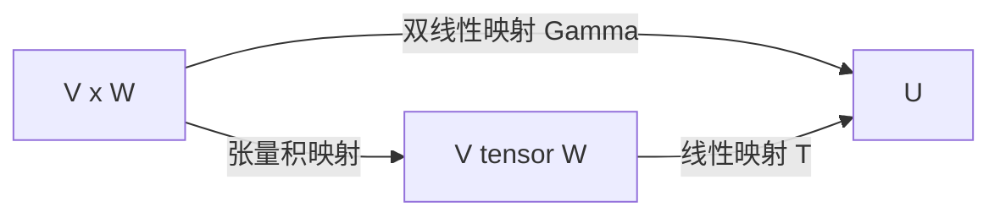
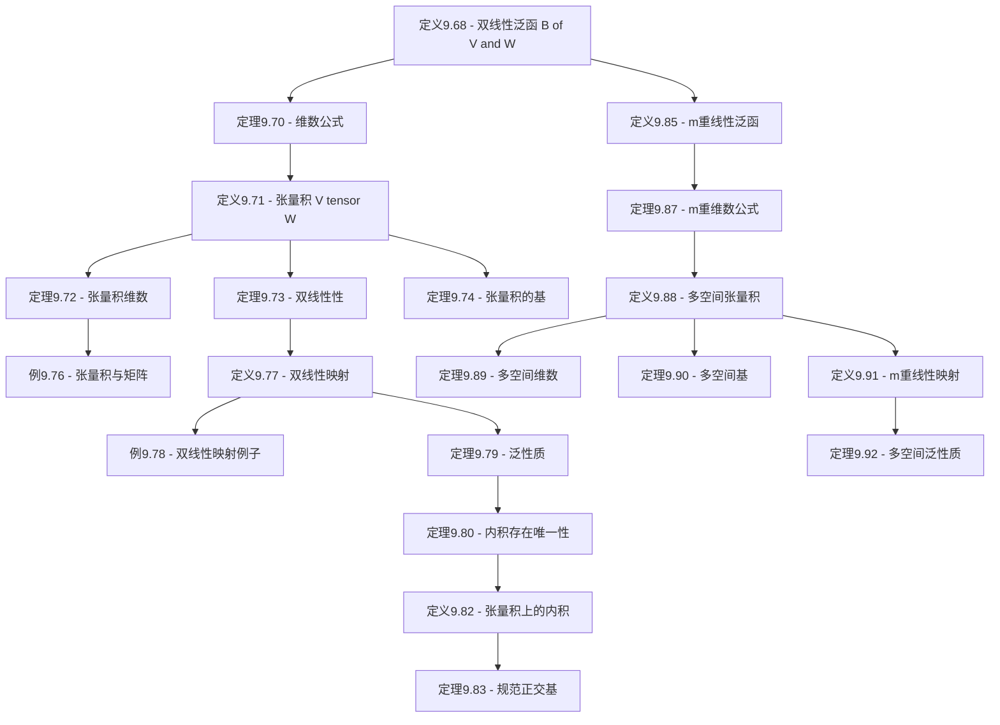

# 9D 张量积

> [!abstract] 本节概览
> 本节是第9章"多重线性代数和行列式"的第四小节，也是本章的核心高潮之一。本节引入了==张量积==（tensor product）的概念——这是将双线性映射"线性化"的通用工具，在现代数学和物理中无处不在。逻辑链条如下：
>
> 1. **定义9.68：双线性泛函** $\to$ $B(V,W)$：$V \times W \to \mathbb{F}$ 上两个位置分别线性的函数
> 2. **定理9.70：维数公式** $\to$ $\dim B(V,W) = (\dim V)(\dim W)$
> 3. **定义9.71：张量积 $V \otimes W$** $\to$ 定义为 $B(V',W')$，$v \otimes w$ 定义为 $V \times W$ 上的双线性泛函
> 4. **定理9.72-9.74：基本性质** $\to$ 维数、双线性、基
> 5. **定义9.77/定理9.79：泛性质** $\to$ 双线性映射 $\leftrightarrow$ 线性映射的万能转化
> 6. **定理9.80-9.83：内积空间** $\to$ 张量积上的内积、规范正交基
> 7. **定义9.85-9.92：多空间推广** $\to$ $m$ 重线性泛函、$V_1 \otimes \cdots \otimes V_m$、泛性质
>
> **核心主线**：双线性泛函 $\to$ 张量积的定义 $\to$ 基本性质（维数、基、双线性） $\to$ 泛性质（万能转化） $\to$ 内积空间 $\to$ 多空间推广。
>
> **前置依赖**：[[9A 双线性和二次型]]（双线性型）、[[9B 交错多重线性型]]（多重线性型）、[[9C 行列式]]（行列式）、[[3F 对偶]]（对偶空间 $V'$、线性泛函）、[[3E 向量空间的积和商]]（向量空间的积与商）。

---

## 一、两向量空间的张量积

### 1.1 双线性泛函

> [!def] 定义9.68：$V \times W$ 上的双线性泛函、$B(V,W)$
> 设 $V$ 和 $W$ 是 $\mathbb{F}$ 上的向量空间。$V \times W$ 上的一个**双线性泛函**（bilinear functional）是一个函数 $\beta : V \times W \to \mathbb{F}$，满足：对于所有 $v \in V$，函数 $w \mapsto \beta(v, w)$ 都是 $W$ 上的线性泛函；对于所有 $w \in W$，函数 $v \mapsto \beta(v, w)$ 都是 $V$ 上的线性泛函。
>
> 所有 $V \times W$ 上的双线性泛函构成的集合记为 $B(V,W)$。

**与[[9A 双线性和二次型|双线性型]]的关系**：
- 双线性型是 $\beta : V \times V \to \mathbb{F}$（同一个空间）
- 双线性泛函是 $\beta : V \times W \to \mathbb{F}$（可以是不同的空间）
- 双线性型是双线性泛函当 $V = W$ 时的特例

**双线性泛函的线性结构**：$B(V,W)$ 构成向量空间，加法和标量乘法定义为
$$(\beta_1 + \beta_2)(v, w) = \beta_1(v, w) + \beta_2(v, w), \quad (c\beta)(v, w) = c \cdot \beta(v, w)$$

### 1.2 双线性泛函的例子

> [!example] 例9.69：双线性泛函
>
> **例1**：设 $\varphi \in V'$ 且 $\tau \in W'$。定义为 $\beta(v, w) = \varphi(v)\tau(w)$ 的函数 $\beta : V \times W \to \mathbb{F}$ 是 $V \times W$ 上的双线性泛函。这是因为固定 $v$ 时，$\beta(v, w) = \varphi(v) \cdot \tau(w)$ 是 $\tau(w)$ 的标量倍，关于 $w$ 线性；固定 $w$ 时类似。
>
> **例2**：更一般地，设 $\varphi_1, \ldots, \varphi_m \in V'$ 且 $\tau_1, \ldots, \tau_m \in W'$，则
> $$\beta(v, w) = \sum_{k=1}^{m} \varphi_k(v)\,\tau_k(w)$$
> 是 $V \times W$ 上的双线性泛函。例1是 $m = 1$ 的特例。
>
> **例3**：设 $V = W = \mathbb{F}^n$，$A$ 是 $n \times n$ 矩阵。定义为
> $$\beta(x, y) = \sum_{j=1}^{n}\sum_{k=1}^{n} A_{j,k}\, x_j\, y_k$$
> 的函数 $\beta : \mathbb{F}^n \times \mathbb{F}^n \to \mathbb{F}$ 是双线性泛函。
>
> **例4**：设 $V = \mathcal{P}(\mathbb{R})$（实系数多项式空间），$W = \mathbb{R}^3$。定义为 $\beta(p, (x, y, z)) = p(1)x + p'(0)y + p''(2)z$ 的函数 $\beta$ 是双线性泛函。

### 1.3 双线性泛函空间的维数

> [!thm] 定理9.70：$\dim B(V,W) = (\dim V)(\dim W)$
> 设 $V$ 和 $W$ 是有限维向量空间。则
> $$\dim B(V,W) = (\dim V)(\dim W)$$

> [!abstract] 证明思路
> **[构造 $B(V,W)$ 的基]**：
> 1. 设 $e_1, \ldots, e_n$ 是 $V$ 的基，$f_1, \ldots, f_m$ 是 $W$ 的基。
> 2. 设 $\varepsilon_1, \ldots, \varepsilon_n$ 是 $V'$ 中对应的对偶基，$\eta_1, \ldots, \eta_m$ 是 $W'$ 中对应的对偶基（[[3F 对偶|定义3.106]]）。
> 3. 定义 $\beta_{j,k}(v, w) = \varepsilon_j(v)\,\eta_k(w)$，其中 $1 \leq j \leq n$，$1 \leq k \leq m$。
> 4. ==关键步骤==：证明 $\{\beta_{j,k}\}_{j,k}$ 是 $B(V,W)$ 的基。首先证明它们张成 $B(V,W)$：对任意 $\beta \in B(V,W)$，展开 $\beta(v, w) = \sum_{j,k} \beta(e_j, f_k)\,\varepsilon_j(v)\,\eta_k(w) = \sum_{j,k} \beta(e_j, f_k)\,\beta_{j,k}(v, w)$。然后证明线性无关性：若 $\sum_{j,k} c_{j,k}\,\beta_{j,k} = 0$，则对所有 $j, k$ 有 $c_{j,k} = \beta(e_j, f_k) = 0$。
> 5. 因此 $\dim B(V,W) = nm = (\dim V)(\dim W)$。$\blacksquare$

> [!tip] 维数公式的直觉
> $B(V,W)$ 的维数等于 $\dim V$ 和 $\dim W$ 的乘积——这与矩阵的维数一致。事实上，每个双线性泛函都对应一个矩阵（类似[[9A 双线性和二次型|9A节]]中双线性型与矩阵的对应关系），而 $n \times m$ 矩阵空间的维数正是 $nm$。

### 1.4 张量积的定义

> [!def] 定义9.71：张量积 $V \otimes W$、$v \otimes w$
> 设 $V$ 和 $W$ 是有限维向量空间。$V$ 和 $W$ 的**张量积**（tensor product），记作 $V \otimes W$，定义为 $B(V', W')$（即所有从 $V' \times W'$ 到 $\mathbb{F}$ 的双线性泛函构成的向量空间）。
>
> 对于 $v \in V$ 和 $w \in W$，定义 $v \otimes w \in V \otimes W$ 为如下双线性泛函：
> $$(v \otimes w)(\varphi, \tau) = \varphi(v)\,\tau(\varphi)$$
> 其中 $\varphi \in V'$，$\tau \in W'$。
>
> 形如 $v \otimes w$ 的元素称为**可分解张量**（decomposable tensor）或**纯张量**（pure tensor）。

**直觉理解**：$v \otimes w$ 是一个"双线性泛函"，它接收两个线性泛函 $\varphi \in V'$ 和 $\tau \in W'$，分别作用于 $v$ 和 $w$，然后把结果相乘。可以理解为"将 $v$ 和 $w$ 的信息编码到一个双线性函数中"。

> [!success] 张量积的本质含义
> ==张量积 $V \otimes W$ 是"双线性映射的通用目标空间"==。任何从 $V \times W$ 出发的双线性映射，都唯一地对应一个从 $V \otimes W$ 出发的线性映射。这就是==泛性质==（universal property），是张量积最重要的特征。

### 1.5 张量积的维数

> [!thm] 定理9.72：$\dim(V \otimes W) = (\dim V)(\dim W)$
> 设 $V$ 和 $W$ 是有限维向量空间。则
> $$\dim(V \otimes W) = (\dim V)(\dim W)$$

> [!abstract] 证明思路
> **[直接利用定义9.71和定理9.70]**：
> 1. 由定义9.71，$V \otimes W = B(V', W')$。
> 2. 由[[3F 对偶|定理3.106]]，$\dim V' = \dim V$，$\dim W' = \dim W$。
> 3. 由定理9.70，$\dim B(V', W') = (\dim V')(\dim W') = (\dim V)(\dim W)$。$\blacksquare$

---

## 二、张量积的基本性质

### 2.1 张量积的双线性

> [!thm] 定理9.73：张量积的双线性
> 设 $V$ 和 $W$ 是有限维向量空间。则映射
> $$(v, w) \mapsto v \otimes w$$
> 是从 $V \times W$ 到 $V \otimes W$ 的双线性映射。即：
> - $(v_1 + v_2) \otimes w = v_1 \otimes w + v_2 \otimes w$
> - $v \otimes (w_1 + w_2) = v \otimes w_1 + v \otimes w_2$
> - $(cv) \otimes w = v \otimes (cw) = c(v \otimes w)$

> [!abstract] 证明思路
> **[利用 $v \otimes w$ 的定义验证]**：
> 1. 对任意 $\varphi \in V'$，$\tau \in W'$：
>    $$((v_1 + v_2) \otimes w)(\varphi, \tau) = \varphi(v_1 + v_2)\,\tau(w) = (\varphi(v_1) + \varphi(v_2))\,\tau(w) = \varphi(v_1)\tau(w) + \varphi(v_2)\tau(w)$$
>    这正是 $(v_1 \otimes w + v_2 \otimes w)(\varphi, \tau)$。
> 2. 标量乘法类似：$((cv) \otimes w)(\varphi, \tau) = \varphi(cv)\,\tau(w) = c\,\varphi(v)\,\tau(w) = (c(v \otimes w))(\varphi, \tau)$。
> 3. 第二个位置的线性性同理可证。$\blacksquare$

> [!warning] 张量积不是线性映射
> 虽然张量积映射 $(v, w) \mapsto v \otimes w$ 是**双线性**的，但它==不是线性的==。例如 $(cv, cw) \mapsto c^2(v \otimes w) \neq c(v \otimes w)$（除非 $c = 0$ 或 $c = 1$）。这正是我们需要张量积的原因——双线性映射不能简单地视为线性映射。

### 2.2 张量积的基

> [!thm] 定理9.74：$V \otimes W$ 的基
> 设 $e_1, \ldots, e_n$ 是 $V$ 的基，$f_1, \ldots, f_m$ 是 $W$ 的基。则
> $$\{e_j \otimes f_k : 1 \leq j \leq n,\ 1 \leq k \leq m\}$$
> 是 $V \otimes W$ 的基。特别地，$\dim(V \otimes W) = nm$。

> [!abstract] 证明思路
> **[分两步：线性无关性 $\to$ 张成性]**：
>
> **第一部分：线性无关性**。设 $\sum_{j,k} c_{j,k}\, e_j \otimes f_k = 0$。需要证明所有 $c_{j,k} = 0$。
> 1. 设 $\varepsilon_1, \ldots, \varepsilon_n$ 是 $V'$ 中关于 $e_1, \ldots, e_n$ 的对偶基，$\eta_1, \ldots, \eta_m$ 是 $W'$ 中关于 $f_1, \ldots, f_m$ 的对偶基。
> 2. 对任意 $\varphi \in V'$，$\tau \in W'$：
>    $$0 = \sum_{j,k} c_{j,k}\, (e_j \otimes f_k)(\varphi, \tau) = \sum_{j,k} c_{j,k}\, \varphi(e_j)\,\tau(f_k)$$
> 3. ==关键步骤==：取 $\varphi = \varepsilon_p$，$\tau = \eta_q$，则 $\varepsilon_p(e_j) = \delta_{p,j}$，$\eta_q(f_k) = \delta_{q,k}$，因此 $0 = c_{p,q}$。
>
> **第二部分：张成性**。由 $\dim(V \otimes W) = nm$（定理9.72）和 $nm$ 个元素线性无关，它们构成基。$\blacksquare$

> [!tip] 基的直觉
> 张量积的基是两个空间的基的"所有配对"。如果 $V$ 有 $n$ 个基向量，$W$ 有 $m$ 个基向量，那么 $V \otimes W$ 就有 $nm$ 个基向量——每个都是 $V$ 的一个基向量与 $W$ 的一个基向量的张量积。

### 2.3 张量积与矩阵

> [!example] 例9.76：$\mathbb{F}^m$ 的元素和 $\mathbb{F}^n$ 的元素所成的张量积
>
> 设 $x = (x_1, \ldots, x_m) \in \mathbb{F}^m$，$y = (y_1, \ldots, y_n) \in \mathbb{F}^n$。则 $x \otimes y$ 可以等同于 $m \times n$ 矩阵：
> $$x \otimes y = \begin{pmatrix} x_1 y_1 & x_1 y_2 & \cdots & x_1 y_n \\ x_2 y_1 & x_2 y_2 & \cdots & x_2 y_n \\ \vdots & \vdots & & \vdots \\ x_m y_1 & x_m y_2 & \cdots & x_m y_n \end{pmatrix}$$
>
> 这是因为 $x \otimes y$ 的第 $(j, k)$ 个分量是 $x_j y_k$。
>
> **具体例子**：设 $x = (1, 2, 3) \in \mathbb{F}^3$，$y = (4, 5) \in \mathbb{F}^2$，则
> $$x \otimes y = \begin{pmatrix} 1 \cdot 4 & 1 \cdot 5 \\ 2 \cdot 4 & 2 \cdot 5 \\ 3 \cdot 4 & 3 \cdot 5 \end{pmatrix} = \begin{pmatrix} 4 & 5 \\ 8 & 10 \\ 12 & 15 \end{pmatrix}$$
>
> 注意 $x \otimes y$ 的秩为 1（所有行都是第一行的倍数）。事实上，==所有可分解张量 $v \otimes w$ 对应的矩阵秩都为 1==，而 $V \otimes W$ 中的一般元素是秩为 1 矩阵的线性组合。

> [!important] 张量积与矩阵的关系
> $\mathbb{F}^m \otimes \mathbb{F}^n$ 同构于所有 $m \times n$ 矩阵构成的向量空间。在这个同构下：
> - 可分解张量 $x \otimes y$ 对应秩为 1 的矩阵 $xy^T$
> - 一般张量 $\sum_i x_i \otimes y_i$ 对应一般矩阵 $\sum_i x_i y_i^T$
> - 张量积的基 $e_j \otimes f_k$ 对应只有第 $(j,k)$ 个位置为 1 的矩阵 $E_{j,k}$

---

## 三、双线性映射与泛性质

### 3.1 双线性映射

> [!def] 定义9.77：双线性映射
> 设 $V$、$W$、$U$ 是 $\mathbb{F}$ 上的向量空间。一个函数 $\Gamma : V \times W \to U$ 称为**双线性映射**（bilinear map），如果：
> - 对每个固定的 $w \in W$，映射 $v \mapsto \Gamma(v, w)$ 是从 $V$ 到 $U$ 的线性映射；
> - 对每个固定的 $v \in V$，映射 $w \mapsto \Gamma(v, w)$ 是从 $W$ 到 $U$ 的线性映射。

**与双线性泛函的关系**：双线性泛函 $\beta : V \times W \to \mathbb{F}$ 是双线性映射当 $U = \mathbb{F}$ 时的特例。双线性映射是双线性泛函的推广——值域从标量推广到任意向量空间。

### 3.2 双线性映射的例子

> [!example] 例9.78：双线性映射
>
> **例1**：张量积映射本身 $(v, w) \mapsto v \otimes w$ 是从 $V \times W$ 到 $V \otimes W$ 的双线性映射（定理9.73）。
>
> **例2**：矩阵乘法可以视为双线性映射。设 $V = M_{m,n}(\mathbb{F})$，$W = M_{n,p}(\mathbb{F})$，$U = M_{m,p}(\mathbb{F})$，则 $(A, B) \mapsto AB$ 是双线性映射。这是因为矩阵乘法关于每个因子都是线性的：$(A_1 + A_2)B = A_1 B + A_2 B$，$A(B_1 + B_2) = AB_1 + AB_2$。
>
> **例3**：函数的乘积。设 $V = W = U = \mathcal{P}(\mathbb{R})$（多项式空间），则 $(p, q) \mapsto pq$（多项式乘法）是双线性映射。

### 3.3 泛性质——张量积的核心定理

> [!thm] 定理9.79：化双线性映射为线性映射（泛性质）
> 设 $V$ 和 $W$ 是有限维向量空间。则：
>
> **(a)** 对于每个双线性映射 $\Gamma : V \times W \to U$，存在唯一的线性映射 $T : V \otimes W \to U$ 使得
> $$T(v \otimes w) = \Gamma(v, w) \quad \text{对所有 } v \in V, w \in W$$
>
> **(b)** 反过来，对于每个线性映射 $T : V \otimes W \to U$，定义为 $\Gamma(v, w) = T(v \otimes w)$ 的函数 $\Gamma : V \times W \to U$ 是双线性映射。
>
> 因此，双线性映射 $\Gamma : V \times W \to U$ 与线性映射 $T : V \otimes W \to U$ 之间存在**一一对应**。

> [!abstract] 证明思路
> **[构造 $T$ 并验证一一对应]**：
>
> **(a) 的证明**：设 $\Gamma : V \times W \to U$ 是双线性映射。
> 1. 设 $e_1, \ldots, e_n$ 是 $V$ 的基，$f_1, \ldots, f_m$ 是 $W$ 的基。由定理9.74，$\{e_j \otimes f_k\}$ 是 $V \otimes W$ 的基。
> 2. ==关键步骤==：定义 $T$ 在基上的值：$T(e_j \otimes f_k) = \Gamma(e_j, f_k)$，然后线性扩展到整个 $V \otimes W$。
> 3. 需要验证 $T(v \otimes w) = \Gamma(v, w)$ 对所有 $v, w$ 成立。设 $v = \sum_j a_j e_j$，$w = \sum_k b_k f_k$，则
>    $$T(v \otimes w) = T\Bigl(\sum_{j,k} a_j b_k\, e_j \otimes f_k\Bigr) = \sum_{j,k} a_j b_k\, \Gamma(e_j, f_k) = \Gamma\Bigl(\sum_j a_j e_j,\, \sum_k b_k f_k\Bigr) = \Gamma(v, w)$$
>    其中最后一步利用了 $\Gamma$ 的双线性性。
> 4. 唯一性：$T$ 由基上的值完全确定，而基上的值由 $\Gamma$ 决定，所以 $T$ 唯一。
>
> **(b) 的证明**：设 $T : V \otimes W \to U$ 是线性映射，定义 $\Gamma(v, w) = T(v \otimes w)$。
> 1. $\Gamma$ 关于 $v$ 线性：$\Gamma(v_1 + v_2, w) = T((v_1 + v_2) \otimes w) = T(v_1 \otimes w + v_2 \otimes w) = T(v_1 \otimes w) + T(v_2 \otimes w) = \Gamma(v_1, w) + \Gamma(v_2, w)$。
> 2. 类似可证 $\Gamma$ 关于 $w$ 线性。$\blacksquare$

> [!success] 泛性质的深刻含义
> ==泛性质是张量积的"灵魂"==。它说的是：
> - **任何**双线性映射 $\Gamma : V \times W \to U$ 都可以"通过"张量积 $V \otimes W$ 来实现
> - 具体来说，$\Gamma$ 可以分解为：先做张量积 $(v, w) \mapsto v \otimes w$，再做线性映射 $T$
> - 这个分解是**唯一的**
>
> 这意味着 $V \otimes W$ 是"双线性映射的通用目标空间"——要研究双线性映射，只需要研究从 $V \otimes W$ 出发的线性映射。双线性映射的问题被"线性化"了。



> [!note] 泛性质的三层理解框架
> 1. **操作层**：给定双线性映射 $\Gamma$，可以构造唯一的线性映射 $T$ 使得 $\Gamma = T \circ \otimes$
> 2. **范畴层**：张量积是 $V \times W$ 在"双线性映射"范畴下的余积（coproduct），是"线性化"的泛对象
> 3. **计算层**：在具体问题中，泛性质给出了"将双线性问题化为线性问题"的标准方法——先验证双线性性，再利用泛性质得到线性映射

---

## 四、内积空间的张量积

### 4.1 内积的存在唯一性

> [!thm] 定理9.80：两内积空间所成张量积上的内积存在唯一性
> 设 $(V, \langle \cdot, \cdot \rangle_V)$ 和 $(W, \langle \cdot, \cdot \rangle_W)$ 是有限维内积空间。则 $V \otimes W$ 上存在唯一的内积 $\langle \cdot, \cdot \rangle$ 满足
> $$\langle v_1 \otimes w_1,\, v_2 \otimes w_2 \rangle = \langle v_1, v_2 \rangle_V \cdot \langle w_1, w_2 \rangle_W$$

> [!abstract] 证明思路
> **[利用基定义内积并验证良定义性]**：
> 1. 设 $e_1, \ldots, e_n$ 是 $V$ 的规范正交基，$f_1, \ldots, f_m$ 是 $W$ 的规范正交基。
> 2. 由定理9.74，$\{e_j \otimes f_k\}$ 是 $V \otimes W$ 的基。
> 3. ==关键步骤==：定义 $\langle e_j \otimes f_k,\, e_p \otimes f_q \rangle = \delta_{j,p}\,\delta_{k,q}$（Kronecker delta），然后双线性扩展。
> 4. 验证这个内积满足要求：$\langle v_1 \otimes w_1,\, v_2 \otimes w_2 \rangle = \sum_{j,k,p,q} a_{j,k}\, \overline{b_{p,q}}\, \delta_{j,p}\,\delta_{k,q} = \sum_{j,k} a_{j,k}\, \overline{b_{j,k}} = \langle v_1, v_2 \rangle_V \cdot \langle w_1, w_2 \rangle_W$。
> 5. 唯一性：内积由基上的值完全确定，而基上的值由条件决定。$\blacksquare$

### 4.2 张量积上内积的定义

> [!def] 定义9.82：两内积空间所成张量积上的内积
> 设 $(V, \langle \cdot, \cdot \rangle_V)$ 和 $(W, \langle \cdot, \cdot \rangle_W)$ 是有限维内积空间。$V \otimes W$ 上的**内积**定义为满足
> $$\langle v_1 \otimes w_1,\, v_2 \otimes w_2 \rangle = \langle v_1, v_2 \rangle_V \cdot \langle w_1, w_2 \rangle_W$$
> 的唯一内积（存在性由定理9.80保证）。

> [!tip] 内积的直觉
> 张量积上的内积就是"分别取内积再相乘"。如果 $v_1 \otimes w_1$ 和 $v_2 \otimes w_2$ 想象成"两张照片叠加"，那么它们的"相似度"就是两张照片各自相似度的乘积。

### 4.3 张量积的规范正交基

> [!thm] 定理9.83：$V \otimes W$ 的规范正交基
> 设 $e_1, \ldots, e_n$ 是内积空间 $V$ 的规范正交基，$f_1, \ldots, f_m$ 是内积空间 $W$ 的规范正交基。则
> $$\{e_j \otimes f_k : 1 \leq j \leq n,\ 1 \leq k \leq m\}$$
> 是 $V \otimes W$ 的规范正交基。

> [!abstract] 证明思路
> **[直接利用定义9.82计算]**：
> 1. 由定理9.74，$\{e_j \otimes f_k\}$ 已经是 $V \otimes W$ 的基。
> 2. 只需验证规范正交性：$\langle e_j \otimes f_k,\, e_p \otimes f_q \rangle = \langle e_j, e_p \rangle_V \cdot \langle f_k, f_q \rangle_W = \delta_{j,p}\,\delta_{k,q}$。
> 3. 因为 $e_j$ 是 $V$ 的规范正交基，$f_k$ 是 $W$ 的规范正交基，所以 $\delta_{j,p}\,\delta_{k,q}$ 正是规范正交性的条件。$\blacksquare$

> [!note] 规范正交基的直觉
> 如果 $V$ 和 $W$ 各有一组"标准方向"（规范正交基），那么 $V \otimes W$ 的标准方向就是所有"方向对"的组合。每个方向对 $(e_j, f_k)$ 给出一个规范正交的基向量 $e_j \otimes f_k$。

---

## 五、多个向量空间的张量积

### 5.1 m 重线性泛函

> [!def] 定义9.85：$m$ 重线性泛函、$B(V_1, \ldots, V_m)$
> 设 $V_1, \ldots, V_m$ 是 $\mathbb{F}$ 上的向量空间。$V_1 \times \cdots \times V_m$ 上的一个 **$m$ 重线性泛函**（multilinear functional）是一个函数 $\beta : V_1 \times \cdots \times V_m \to \mathbb{F}$，满足：固定除第 $k$ 个位置外的所有变量后，函数在第 $k$ 个位置上是线性的（对每个 $k = 1, \ldots, m$）。
>
> 所有 $V_1 \times \cdots \times V_m$ 上的 $m$ 重线性泛函构成的集合记为 $B(V_1, \ldots, V_m)$。

> [!example] 例9.86：$m$ 重线性泛函
>
> **例1**：设 $\varphi_k \in V_k'$（$k = 1, \ldots, m$）。定义为
> $$\beta(v_1, \ldots, v_m) = \varphi_1(v_1)\,\varphi_2(v_2) \cdots \varphi_m(v_m)$$
> 的函数 $\beta$ 是 $V_1 \times \cdots \times V_m$ 上的 $m$ 重线性泛函。这是最基本也是最重要的例子。
>
> **例2**：行列式 $\det : \mathbb{F}^n \times \cdots \times \mathbb{F}^n \to \mathbb{F}$（$n$ 个 $\mathbb{F}^n$）是 $n$ 重线性泛函（参见[[9C 行列式|定理9.45]]）。
>
> **例3**：设 $V_1 = \cdots = V_m = \mathbb{F}^n$，定义为 $\beta(A_1, \ldots, A_m) = \operatorname{trace}(A_1 \cdots A_m)$ 的函数是 $m$ 重线性泛函（因为矩阵乘法和迹都是线性的）。

### 5.2 m 重线性泛函空间的维数

> [!thm] 定理9.87：$\dim B(V_1, \ldots, V_m) = (\dim V_1) \times \cdots \times (\dim V_m)$
> 设 $V_1, \ldots, V_m$ 是有限维向量空间。则
> $$\dim B(V_1, \ldots, V_m) = (\dim V_1) \times \cdots \times (\dim V_m)$$

> [!abstract] 证明思路
> **[推广定理9.70的证明方法]**：
> 1. 设 $e^{(k)}_1, \ldots, e^{(k)}_{n_k}$ 是 $V_k$ 的基（$k = 1, \ldots, m$），其中 $n_k = \dim V_k$。
> 2. 设 $\varepsilon^{(k)}_1, \ldots, \varepsilon^{(k)}_{n_k}$ 是 $V_k'$ 中对应的对偶基。
> 3. 定义 $\beta_{j_1, \ldots, j_m}(v_1, \ldots, v_m) = \varepsilon^{(1)}_{j_1}(v_1) \cdots \varepsilon^{(m)}_{j_m}(v_m)$。
> 4. ==关键步骤==：与定理9.70类似，证明 $\{\beta_{j_1, \ldots, j_m}\}$ 是 $B(V_1, \ldots, V_m)$ 的基。元素个数为 $n_1 \times n_2 \times \cdots \times n_m$。$\blacksquare$

### 5.3 多个空间的张量积

> [!def] 定义9.88：张量积 $V_1 \otimes \cdots \otimes V_m$、$v_1 \otimes \cdots \otimes v_m$
> 设 $V_1, \ldots, V_m$ 是有限维向量空间。$V_1, \ldots, V_m$ 的**张量积**，记作 $V_1 \otimes \cdots \otimes V_m$，定义为 $B(V_1', \ldots, V_m')$。
>
> 对于 $v_k \in V_k$（$k = 1, \ldots, m$），定义 $v_1 \otimes \cdots \otimes v_m \in V_1 \otimes \cdots \otimes V_m$ 为如下 $m$ 重线性泛函：
> $$(v_1 \otimes \cdots \otimes v_m)(\varphi_1, \ldots, \varphi_m) = \varphi_1(v_1) \cdots \varphi_m(v_m)$$
> 其中 $\varphi_k \in V_k'$。

### 5.4 多空间张量积的维数与基

> [!thm] 定理9.89：$\dim(V_1 \otimes \cdots \otimes V_m) = (\dim V_1) \cdots (\dim V_m)$
> 设 $V_1, \ldots, V_m$ 是有限维向量空间。则
> $$\dim(V_1 \otimes \cdots \otimes V_m) = (\dim V_1) \cdots (\dim V_m)$$

> [!abstract] 证明思路
> 与定理9.72完全类似：$V_1 \otimes \cdots \otimes V_m = B(V_1', \ldots, V_m')$，由定理9.87直接得到维数公式。$\blacksquare$

> [!thm] 定理9.90：$V_1 \otimes \cdots \otimes V_m$ 的基
> 设 $e^{(k)}_1, \ldots, e^{(k)}_{n_k}$ 是 $V_k$ 的基（$k = 1, \ldots, m$）。则
> $$\{e^{(1)}_{j_1} \otimes \cdots \otimes e^{(m)}_{j_m} : 1 \leq j_k \leq n_k,\ k = 1, \ldots, m\}$$
> 是 $V_1 \otimes \cdots \otimes V_m$ 的基。

> [!abstract] 证明思路
> 与定理9.74完全类似：利用对偶基验证线性无关性，再由维数公式得出张成性。$\blacksquare$

### 5.5 m 重线性映射与泛性质

> [!def] 定义9.91：$m$ 重线性映射
> 设 $V_1, \ldots, V_m$、$U$ 是 $\mathbb{F}$ 上的向量空间。一个函数 $\Gamma : V_1 \times \cdots \times V_m \to U$ 称为 **$m$ 重线性映射**（multilinear map），如果固定除第 $k$ 个位置外的所有变量后，函数在第 $k$ 个位置上是线性的（对每个 $k = 1, \ldots, m$）。

> [!thm] 定理9.92：化 $m$ 重线性映射为线性映射
> 设 $V_1, \ldots, V_m$ 是有限维向量空间。则：
>
> **(a)** 对于每个 $m$ 重线性映射 $\Gamma : V_1 \times \cdots \times V_m \to U$，存在唯一的线性映射 $T : V_1 \otimes \cdots \otimes V_m \to U$ 使得
> $$T(v_1 \otimes \cdots \otimes v_m) = \Gamma(v_1, \ldots, v_m) \quad \text{对所有 } v_k \in V_k$$
>
> **(b)** 反过来，对于每个线性映射 $T : V_1 \otimes \cdots \otimes V_m \to U$，定义为 $\Gamma(v_1, \ldots, v_m) = T(v_1 \otimes \cdots \otimes v_m)$ 的函数 $\Gamma : V_1 \times \cdots \times V_m \to U$ 是 $m$ 重线性映射。
>
> 因此，$m$ 重线性映射 $\Gamma : V_1 \times \cdots \times V_m \to U$ 与线性映射 $T : V_1 \otimes \cdots \otimes V_m \to U$ 之间存在**一一对应**。

> [!abstract] 证明思路
> 与定理9.79完全类似：在基上定义 $T$，利用 $m$ 重线性性验证 $T(v_1 \otimes \cdots \otimes v_m) = \Gamma(v_1, \ldots, v_m)$，再验证一一对应。$\blacksquare$

> [!note] 结合律
> 多个空间的张量积满足结合律（在同构意义下）：
> $$(V_1 \otimes V_2) \otimes V_3 \cong V_1 \otimes (V_2 \otimes V_3) \cong V_1 \otimes V_2 \otimes V_3$$
> 因此我们可以不加括号地写 $V_1 \otimes V_2 \otimes V_3$。类似地，$(v_1 \otimes v_2) \otimes v_3$ 和 $v_1 \otimes (v_2 \otimes v_3)$ 在自然同构下相同，都等于 $v_1 \otimes v_2 \otimes v_3$。

---

## 六、知识结构总览



---

## 七、核心思想与证明技巧

### 6.1 Axler 定义张量积的独特方式

Axler 的张量积定义方式非常独特——他将 $V \otimes W$ 定义为 $B(V', W')$，即"从 $V' \times W'$ 到 $\mathbb{F}$ 的双线性泛函"。

**传统教材的方法**（商空间构造）：
1. 从自由向量空间 $\text{Free}(V \times W)$ 出发
2. 对双线性关系取商：$V \otimes W = \text{Free}(V \times W) / \sim$
3. $v \otimes w$ 是 $(v, w)$ 在商空间中的等价类
4. 泛性质从构造中自然得出

**Axler 的方法**（本节采用）：
1. 直接定义 $V \otimes W = B(V', W')$
2. $v \otimes w$ 是一个具体的双线性泛函：$(v \otimes w)(\varphi, \tau) = \varphi(v)\tau(w)$
3. 维数和基从[[3F 对偶|对偶空间]]理论直接得出
4. 泛性质通过基上的构造证明

**两种方法的比较**：
- Axler 的方法更"具体"——每个元素都是一个明确的函数，不需要处理等价类
- 传统方法更"通用"——可以推广到无限维空间
- Axler 的方法更简洁——不需要引入自由向量空间和商空间的概念

### 6.2 泛性质的证明模板

定理9.79的证明提供了一个通用的模板，适用于所有"泛性质"类定理：
1. **构造**：在基上定义线性映射 $T$
2. **验证**：利用多重线性性验证 $T$ 在所有可分解张量上满足要求
3. **唯一性**：$T$ 由基上的值完全确定

这个模板在定理9.92（$m$ 重版本）中完全复用。

### 6.3 维数公式的统一模式

本节的维数公式遵循统一的模式：

| 对象 | 维数公式 |
|---|---|
| $B(V, W)$ | $(\dim V)(\dim W)$ |
| $V \otimes W$ | $(\dim V)(\dim W)$ |
| $B(V_1, \ldots, V_m)$ | $(\dim V_1) \times \cdots \times (\dim V_m)$ |
| $V_1 \otimes \cdots \otimes V_m$ | $(\dim V_1) \cdots (\dim V_m)$ |

注意：$B(V, W)$ 和 $V \otimes W$ 的维数相同（因为 $V \otimes W = B(V', W')$，而 $\dim V' = \dim V$）。

---

## 八、补充理解与易混淆点

### 7.1 张量积的动机——为什么需要张量积

==双线性函数的"源"不是向量空间，这是一个根本性的美学问题==。

考虑双线性映射 $\Gamma : V \times W \to U$。我们希望将 $\Gamma$ 转化为线性映射（因为线性映射的理论已经非常成熟），但 $V \times W$ 作为源空间行不通——$\Gamma$ 在 $V \times W$ 上不是线性的（它是双线性的）。

**问题**：是否存在一个向量空间 $Z$ 和一个双线性映射 $\otimes : V \times W \to Z$，使得**任何**双线性映射 $\Gamma : V \times W \to U$ 都可以唯一地分解为
$$\Gamma = T \circ \otimes$$
其中 $T : Z \to U$ 是线性映射？

**答案**：存在，这个 $Z$ 就是 $V \otimes W$，$\otimes$ 就是张量积映射 $(v, w) \mapsto v \otimes w$。这就是泛性质。

**类比**：就像[[3E 向量空间的积和商|商空间]]将"等价关系"转化为"线性映射的核"一样，张量积将"双线性映射"转化为"线性映射"。

**来源**：Mike Hill (UCLA) Math 110B 讲义——"The source of a bilinear function is not a vector space, and this is aesthetically unacceptable."

### 7.2 泛性质的直觉——"将双线性映射转化为线性映射"

==泛性质说的是：张量积是双线性映射的"万能线性化器"==。

**Keith Conrad (UConn) 的表述**：张量积是"generalized multiplication"——它将两个向量空间的元素"相乘"，得到一个新的向量空间中的元素，而且这种"乘法"满足双线性性。

**三层理解框架**：

1. **操作层**：给定双线性映射 $\Gamma : V \times W \to U$，可以构造唯一的线性映射 $T : V \otimes W \to U$ 使得下图交换：
   ```
   V × W ──Γ──> U
     │            ↑
     ⊗            T
     ↓            │
   V ⊗ W ────────┘
   ```

2. **范畴层**：在 forgetful functor $U \mapsto U \times U$ 的视角下，张量积是左伴随（left adjoint）。用范畴论的语言说，$\text{Hom}(V \otimes W, U) \cong \text{Bilin}(V \times W, U)$。

3. **计算层**：在实际问题中，要证明某个构造是"自然的"或"唯一的"，只需要验证它满足泛性质。例如，要证明两个构造给出相同的张量积，只需要证明它们都满足泛性质（由唯一性，它们必然同构）。

**来源**：Keith Conrad (UConn) "Tensor Products" 讲义、Hacker News 讨论帖 "What is a tensor product, intuitively?"

### 7.3 张量积的两种构造方法对比

**方法一：泛性质构造**（Axler 采用的方法）
- $V \otimes W = B(V', W')$
- 优点：具体、明确，每个元素都是一个函数
- 缺点：依赖于对偶空间，需要有限维假设

**方法二：基构造**
- 给定 $V$ 的基 $\{e_j\}$ 和 $W$ 的基 $\{f_k\}$，$V \otimes W$ 是以 $\{e_j \otimes f_k\}$ 为基的形式向量空间
- 优点：直接、计算方便
- 缺点：依赖于基的选择（虽然最终结果基无关）

**方法三：商空间构造**（传统方法）
- $V \otimes W = \text{Free}(V \times W) / \sim$，其中 $\sim$ 由双线性关系生成
- 优点：最通用，适用于无限维
- 缺点：抽象，需要处理等价类

**三种方法给出同构的结果**。泛性质保证了这一点——只要一个构造满足泛性质，它就与其他满足泛性质的构造自然同构。

**来源**：Mike Hill (UCLA) Math 110B 讲义。

### 7.4 张量积与克罗内克积、外积的关系

**外积（outer product）是张量积的特例**：
- 列向量 $u \in \mathbb{F}^m$ 和 $v \in \mathbb{F}^n$ 的外积 $uv^T$ 是一个 $m \times n$ 矩阵
- 这正是 $u \otimes v$ 在 $\mathbb{F}^m \otimes \mathbb{F}^n \cong M_{m,n}(\mathbb{F})$ 下的矩阵表示
- 外积只处理列向量的情况，张量积适用于任意向量空间

**克罗内克积（Kronecker product）是张量积的矩阵表示**：
- 设 $A$ 是 $m \times n$ 矩阵，$B$ 是 $p \times q$ 矩阵
- 克罗内克积 $A \otimes_K B$ 是 $mp \times nq$ 矩阵，定义为
  $$A \otimes_K B = \begin{pmatrix} A_{1,1}B & \cdots & A_{1,n}B \\ \vdots & & \vdots \\ A_{m,1}B & \cdots & A_{m,n}B \end{pmatrix}$$
- 这对应于算子 $S \in \mathcal{L}(V)$ 和 $T \in \mathcal{L}(W)$ 诱导的算子 $S \otimes T \in \mathcal{L}(V \otimes W)$ 在张量积基下的矩阵

**来源**：Lei Mao 博客 "Tensor Product and Outer Product"、Number Analytics "Kronecker Product vs Tensor Product"。

### 7.5 张量积上的算子 $S \otimes T$

设 $S \in \mathcal{L}(V)$，$T \in \mathcal{L}(W)$。可以定义算子 $S \otimes T \in \mathcal{L}(V \otimes W)$ 为
$$(S \otimes T)(v \otimes w) = S(v) \otimes T(w)$$
然后线性扩展到整个 $V \otimes W$。

**性质**：
- $S \otimes T$ 是良定义的线性算子
- $(S_1 \otimes T_1)(S_2 \otimes T_2) = (S_1 S_2) \otimes (T_1 T_2)$
- $(S \otimes T)^{-1} = S^{-1} \otimes T^{-1}$（当 $S, T$ 可逆时）
- $\det(S \otimes T) = (\det S)^{\dim W}(\det T)^{\dim V}$

**来源**：Keith Conrad (UConn) "Tensor Products" 讲义。

### 7.6 常见误区

> [!danger] 误区1：张量积就是各元素相乘
> ❌ "$v \otimes w$ 就是把 $v$ 和 $w$ 的分量逐个相乘"
> ✅ 在 $\mathbb{F}^m \otimes \mathbb{F}^n$ 的特殊情况下，$v \otimes w$ 确实可以表示为矩阵 $vw^T$（例9.76），其分量是 $v_j w_k$。但对于一般的向量空间，$v \otimes w$ 是一个==双线性泛函==，不是简单的分量相乘。张量积的本质是==泛性质==，不是分量运算。
>
> **来源**：Keith Conrad (UConn) "Tensor Products" 讲义。

> [!danger] 误区2：张量积与直和类似
> ❌ "$V \otimes W$ 和 $V \oplus W$ 差不多"
> ✅ 这是两个完全不同的构造：
> - $\dim(V \oplus W) = \dim V + \dim W$（加法）
> - $\dim(V \otimes W) = (\dim V)(\dim W)$（乘法）
> - 直和的元素是"有序对" $(v, w)$，张量积的元素是双线性泛函的线性组合
> - 直和对应"独立选择"，张量积对应"组合配对"
>
> **来源**：Keith Conrad (UConn) "Tensor Products" 讲义。

> [!danger] 误区3：双线性映射就是直和上的线性映射
> ❌ "双线性映射 $\Gamma : V \times W \to U$ 就是线性映射 $\tilde{\Gamma} : V \oplus W \to U$"
> ✅ 不正确。$V \times W$ 作为集合等于 $V \oplus W$，但双线性映射==不是== $V \oplus W$ 上的线性映射。反例：$\Gamma(cv, cw) = c^2 \Gamma(v, w) \neq c\,\Gamma(v, w)$。这正是需要张量积的原因——$V \otimes W$ 才是双线性映射的"正确"源空间。
>
> **来源**：Keith Conrad (UConn) "Tensor Products" 讲义、Mike Hill (UCLA) Math 110B 讲义。

> [!danger] 误区4：张量就是多维数组
> ❌ "张量就是一个多维数组，比如 $3 \times 4 \times 5$ 的数组"
> ✅ 在有基的情况下，张量确实可以用多维数组表示（分量是关于基的坐标）。但==张量本身是基无关的几何对象==。同一个张量在不同基下有不同的数组表示。说"张量就是多维数组"就像说"向量就是一列数"一样——在有基的情况下是对的，但忽略了本质。
>
> **来源**：Hacker News 讨论帖 "What is a tensor product, intuitively?"

> [!danger] 误区5：张量积依赖于基的选择
> ❌ "$V \otimes W$ 的定义依赖于 $V$ 和 $W$ 的基"
> ✅ $V \otimes W$ 的定义（定义9.71）完全不涉及基——它是 $B(V', W')$，一个纯粹由向量空间结构决定的空间。基只在我们==具体计算==时才需要（定理9.74）。可以做一个数值验证：
>
> 设 $V = W = \mathbb{R}^2$。取标准基 $e_1 = (1,0), e_2 = (0,1)$，则 $v = (1, 2) = e_1 + 2e_2$，$w = (3, 4) = 3e_1 + 4e_2$。
> $$v \otimes w = (e_1 + 2e_2) \otimes (3e_1 + 4e_2) = 3(e_1 \otimes e_1) + 4(e_1 \otimes e_2) + 6(e_2 \otimes e_1) + 8(e_2 \otimes e_2)$$
> 现在换一组基 $f_1 = (1,1), f_2 = (1,-1)$。则 $v = (1,2) = \frac{3}{2}f_1 - \frac{1}{2}f_2$，$w = (3,4) = \frac{7}{2}f_1 - \frac{1}{2}f_2$。
> $$v \otimes w = \frac{21}{4}(f_1 \otimes f_1) - \frac{3}{4}(f_1 \otimes f_2) - \frac{7}{4}(f_2 \otimes f_1) + \frac{1}{4}(f_2 \otimes f_2)$$
> 两组展开式看起来不同，但表示的是 $V \otimes W$ 中==同一个元素==。验证：将 $f_j$ 用 $e_k$ 表示后代入，会得到与第一组展开式相同的系数。
>
> **来源**：Keith Conrad (UConn) "Tensor Products" 讲义。

> [!danger] 误区6：泛性质只是抽象废话
> ❌ "泛性质只是数学家玩的抽象游戏，没有实际用处"
> ✅ 泛性质是张量积==最有用的部分==。它给出了一个强大的方法论：
> 1. **定义新对象**：要定义从 $V \times W$ 出发的某种结构，只需要定义从 $V \otimes W$ 出发的对应线性结构
> 2. **证明唯一性**：如果两个构造都满足泛性质，它们必然（自然）同构
> 3. **简化计算**：将双线性问题化为线性问题，利用线性代数的成熟工具
> 4. **统一理论**：行列式、外积、对称积等都是张量积的特殊情况
>
> Brian Conrad (Stanford) 的评论："泛性质不是'抽象废话'，而是'精确的废话'——它精确地告诉你什么性质是本质的、什么依赖于具体构造。"
>
> **来源**：Brian Conrad (Stanford) 数学讨论。

---

## 九、习题精选

### 习题1：张量积的维数

> [!problem] 习题1（LADR 9D.1）
> 设 $V$ 和 $W$ 是有限维向量空间。证明 $\dim(V \otimes W) = (\dim V)(\dim W)$，不使用定理9.72（即不通过 $B(V', W')$ 的定义），而是直接利用定理9.74。

> [!faq]- 查看解答
> 由定理9.74，$V \otimes W$ 有一组基 $\{e_j \otimes f_k\}$，其中 $e_1, \ldots, e_n$ 是 $V$ 的基，$f_1, \ldots, f_m$ 是 $W$ 的基。这组基的元素个数为 $n \times m = (\dim V)(\dim W)$。因此 $\dim(V \otimes W) = (\dim V)(\dim W)$。

### 习题2：张量积中的零元素

> [!problem] 习题2（LADR 9D.2）
> 设 $V$ 和 $W$ 是有限维向量空间，$v \in V$，$w \in W$。证明 $v \otimes w = 0$ 当且仅当 $v = 0$ 或 $w = 0$。

> [!faq]- 查看解答
> **充分性**（$v = 0$ 或 $w = 0$ $\Rightarrow$ $v \otimes w = 0$）：由张量积的双线性性（定理9.73），$0 \otimes w = 0(v \otimes w) = 0$，$v \otimes 0 = 0(v \otimes w) = 0$。
>
> **必要性**（$v \otimes w = 0$ $\Rightarrow$ $v = 0$ 或 $w = 0$）：
> 反证法。假设 $v \neq 0$ 且 $w \neq 0$。将 $v$ 扩充为 $V$ 的基 $v = e_1, e_2, \ldots, e_n$，将 $w$ 扩充为 $W$ 的基 $w = f_1, f_2, \ldots, f_m$。由定理9.74，$\{e_j \otimes f_k\}$ 是 $V \otimes W$ 的基。特别地，$e_1 \otimes f_1 = v \otimes w$ 是基向量，不等于零。矛盾。

### 习题4：张量积与线性映射

> [!problem] 习题4（LADR 9D.4）
> 设 $T \in \mathcal{L}(V)$，$S \in \mathcal{L}(W)$。证明存在唯一的线性映射 $T \otimes S \in \mathcal{L}(V \otimes W)$ 使得
> $$(T \otimes S)(v \otimes w) = T(v) \otimes S(w)$$
> 对所有 $v \in V$，$w \in W$ 成立。

> [!faq]- 查看解答
> **利用泛性质（定理9.79）**。
>
> 定义双线性映射 $\Gamma : V \times W \to V \otimes W$ 为 $\Gamma(v, w) = T(v) \otimes S(w)$。
>
> 验证 $\Gamma$ 是双线性的：
> - $\Gamma(v_1 + v_2, w) = T(v_1 + v_2) \otimes S(w) = (T(v_1) + T(v_2)) \otimes S(w) = T(v_1) \otimes S(w) + T(v_2) \otimes S(w) = \Gamma(v_1, w) + \Gamma(v_2, w)$
> - $\Gamma(cv, w) = T(cv) \otimes S(w) = cT(v) \otimes S(w) = c(T(v) \otimes S(w)) = c\,\Gamma(v, w)$
> - 第二个位置的线性性类似。
>
> 由定理9.79(a)，存在唯一的线性映射 $T \otimes S : V \otimes W \to V \otimes W$ 使得 $(T \otimes S)(v \otimes w) = \Gamma(v, w) = T(v) \otimes S(w)$。

### 习题5：张量积与对偶

> [!problem] 习题5（LADR 9D.5）
> 设 $V$ 和 $W$ 是有限维向量空间。证明 $(V \otimes W)' \cong V' \otimes W'$（在同构意义下）。

> [!faq]- 查看解答
> **构造双线性映射并利用泛性质**。
>
> 定义映射 $\Phi : V' \times W' \to (V \otimes W)'$ 为 $\Phi(\varphi, \tau)(v \otimes w) = \varphi(v)\,\tau(w)$。
>
> 1. **验证 $\Phi(\varphi, \tau)$ 是良定义的**：需要在基上定义并线性扩展。设 $\{e_j\}$ 是 $V$ 的基，$\{f_k\}$ 是 $W$ 的基，则 $\{e_j \otimes f_k\}$ 是 $V \otimes W$ 的基。定义 $\Phi(\varphi, \tau)(e_j \otimes f_k) = \varphi(e_j)\,\tau(f_k)$，然后线性扩展。这给出了 $(V \otimes W)'$ 中的一个元素。
>
> 2. **验证 $\Phi$ 是双线性的**：$\Phi(\varphi_1 + \varphi_2, \tau)(v \otimes w) = (\varphi_1 + \varphi_2)(v)\,\tau(w) = \varphi_1(v)\,\tau(w) + \varphi_2(v)\,\tau(w) = \Phi(\varphi_1, \tau)(v \otimes w) + \Phi(\varphi_2, \tau)(v \otimes w)$。标量乘法类似。
>
> 3. **由泛性质**，$\Phi$ 诱导线性映射 $\tilde{\Phi} : V' \otimes W' \to (V \otimes W)'$。
>
> 4. **验证 $\tilde{\Phi}$ 是同构**：$\dim(V' \otimes W') = (\dim V')(\dim W') = (\dim V)(\dim W) = \dim(V \otimes W) = \dim(V \otimes W)'$。只需验证单射性：若 $\tilde{\Phi}(\sum c_{j,k}\, \varepsilon_j \otimes \eta_k) = 0$，则对所有 $v, w$ 有 $\sum c_{j,k}\, \varepsilon_j(v)\,\eta_k(w) = 0$。取 $v = e_p$，$w = f_q$ 得 $c_{p,q} = 0$。

### 习题9：泛性质的应用

> [!problem] 习题9（LADR 9D.9）
> 设 $V$、$W$、$U$ 是有限维向量空间。证明：从 $V \times W$ 到 $U$ 的双线性映射构成的集合与从 $V \otimes W$ 到 $U$ 的线性映射构成的集合之间存在自然的双射。

> [!faq]- 查看解答
> 这正是定理9.79的内容。
>
> **双射的构造**：
> - **正向**：给定双线性映射 $\Gamma : V \times W \to U$，由定理9.79(a)，存在唯一的线性映射 $T : V \otimes W \to U$ 使得 $T(v \otimes w) = \Gamma(v, w)$。定义 $\Phi(\Gamma) = T$。
> - **反向**：给定线性映射 $T : V \otimes W \to U$，由定理9.79(b)，定义为 $\Gamma(v, w) = T(v \otimes w)$ 的函数 $\Gamma : V \times W \to U$ 是双线性映射。定义 $\Psi(T) = \Gamma$。
>
> **验证双射**：
> - $\Psi \circ \Phi = \text{id}$：$\Psi(\Phi(\Gamma))(v, w) = \Phi(\Gamma)(v \otimes w) = \Gamma(v, w)$
> - $\Phi \circ \Psi = \text{id}$：$\Phi(\Psi(T))(v \otimes w) = \Psi(T)(v, w) = T(v \otimes w)$，由基上的值相等得 $\Phi(\Psi(T)) = T$

### 习题10：内积空间张量积的计算

> [!problem] 习题10（LADR 9D.10）
> 设 $V = \mathbb{R}^2$，$W = \mathbb{R}^3$，各自带有标准内积。设 $v_1 = (1, 0)$，$v_2 = (0, 1)$，$w_1 = (1, 0, 0)$，$w_2 = (0, 1, 0)$，$w_3 = (0, 0, 1)$。计算 $\langle v_1 \otimes w_1 + v_2 \otimes w_2,\, v_1 \otimes w_2 + v_2 \otimes w_3 \rangle$。

> [!faq]- 查看解答
> 由定义9.82，张量积上的内积满足 $\langle v_1 \otimes w_1,\, v_2 \otimes w_2 \rangle = \langle v_1, v_2 \rangle_V \cdot \langle w_1, w_2 \rangle_W$。
>
> 展开：
> $$\langle v_1 \otimes w_1 + v_2 \otimes w_2,\, v_1 \otimes w_2 + v_2 \otimes w_3 \rangle$$
> $$= \langle v_1 \otimes w_1,\, v_1 \otimes w_2 \rangle + \langle v_1 \otimes w_1,\, v_2 \otimes w_3 \rangle + \langle v_2 \otimes w_2,\, v_1 \otimes w_2 \rangle + \langle v_2 \otimes w_2,\, v_2 \otimes w_3 \rangle$$
>
> 分别计算四项：
> - $\langle v_1 \otimes w_1,\, v_1 \otimes w_2 \rangle = \langle v_1, v_1 \rangle \cdot \langle w_1, w_2 \rangle = 1 \cdot 0 = 0$
> - $\langle v_1 \otimes w_1,\, v_2 \otimes w_3 \rangle = \langle v_1, v_2 \rangle \cdot \langle w_1, w_3 \rangle = 0 \cdot 0 = 0$
> - $\langle v_2 \otimes w_2,\, v_1 \otimes w_2 \rangle = \langle v_2, v_1 \rangle \cdot \langle w_2, w_2 \rangle = 0 \cdot 1 = 0$
> - $\langle v_2 \otimes w_2,\, v_2 \otimes w_3 \rangle = \langle v_2, v_2 \rangle \cdot \langle w_2, w_3 \rangle = 1 \cdot 0 = 0$
>
> 因此结果为 $0 + 0 + 0 + 0 = 0$。

---

## 十、视频学习指南

暂无对应视频，建议通过阅读教材原文和本笔记学习。

**建议学习路径**：
1. 先通读本笔记的"概览"和"知识结构总览"，建立整体框架
2. 按模块顺序学习，重点理解张量积的定义（为什么定义为 $B(V', W')$）和泛性质
3. 特别关注定理9.79（泛性质）的证明——它展示了张量积的核心思想
4. 通过补充理解模块建立"双线性映射线性化"的直觉
5. 多空间推广（模块五）是直接类比，理解两空间的情况后自然推广
6. 做习题巩固：习题1（维数）、习题2（零元素）、习题4（算子 $T \otimes S$）、习题5（对偶）、习题9（泛性质应用）、习题10（内积计算）

---

## 十一、教材原文
#学习/线性代数/多重线性代数和行列式/张量积
