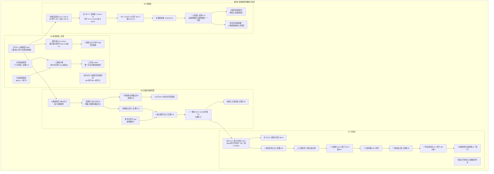
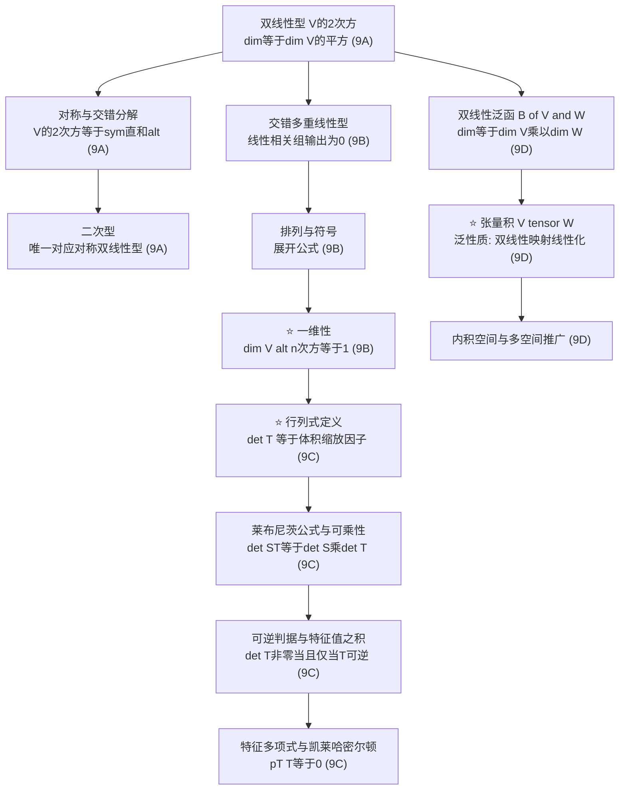

# 第 9 章 多重线性代数和行列式 — 章节汇总

> [!abstract] 全章概览
> 第 9 章是线性代数的进阶章节，围绕==多重线性型==这一核心概念展开，从双线性型出发，经过交错型，最终到达行列式和张量积两大核心理论。全章四节构成一条清晰的逻辑链：
>
> **双线性和二次型**（9A）→ **交错多重线性型**（9B）→ **行列式**（9C）→ **张量积**（9D）
>
> 全章的核心动机是：==行列式本质上是"线性算子对有向体积的缩放因子"==，而这一事实通过交错多重线性型的一维性得到最本质的定义。张量积则提供了"将双线性映射线性化"的通用工具。

---

## 一、全章知识框架思维导图

---

## 二、全章核心知识点与重点公式汇总

### 2.1 双线性和二次型（[[9A 双线性和二次型]]）

| 定理/定义 | 内容 | 编号 |
|:---|:---|:---:|
| 双线性型 | $\beta : V \times V \to \mathbb{F}$，两个位置分别线性 | 9.1 |
| $V^{(2)}$ | 双线性型构成的向量空间 | 9.3 |
| $M(\beta)$ 的构造 | $M(\beta)_{j,k} = \beta(e_j, e_k)$ | 9.4 |
| ==**$\dim V^{(2)} = (\dim V)^2$**== | $\beta \mapsto M(\beta)$ 是同构 | 9.5 |
| 与算子复合 | $M(\alpha) = M(\beta)\, M(T)$，$M(\rho) = M(T)^t\, M(\beta)$ | 9.6 |
| ==**换基公式**== | $$A = C^t\, B\, C$$（合同变换） | 9.7 |
| 对称双线性型 | $\rho(u, w) = \rho(w, u)$，关于所有基的矩阵都对称 | 9.9, 9.12 |
| ==**对称双线性型可对角化**== | 4个等价条件，存在基使矩阵为对角矩阵 | 9.12 |
| 规范正交基对角化 | 实内积空间上，对称双线性型可关于规范正交基对角化 | 9.13 |
| 交错双线性型 | $\alpha(v, v) = 0$，等价于反对称 | 9.14, 9.16 |
| ==**直和分解**== | $$V^{(2)} = V^{(2)}_{\text{sym}} \oplus V^{(2)}_{\text{alt}}$$ | 9.17 |
| 二次型 | $q_\beta(v) = \beta(v, v)$，唯一对应对称双线性型 | 9.18, 9.21 |
| 二次型对角化 | $q(x_1 e_1 + \cdots + x_n e_n) = \lambda_1 x_1^2 + \cdots + \lambda_n x_n^2$ | 9.23 |

### 2.2 交错多重线性型（[[9B 交错多重线性型]]）

| 定理/定义 | 内容 | 编号 |
|:---|:---|:---:|
| $m$ 重线性型 | $\beta : V^m \to \mathbb{F}$，每个位置线性 | 9.25 |
| 交错型 | 任意两个输入相等时输出为零 | 9.27 |
| ==**线性相关组输出为0**== | $v_1, \ldots, v_m$ 线性相关 $\Rightarrow$ $\alpha(v_1, \ldots, v_m) = 0$ | 9.28 |
| $m > \dim V$ 时无非零 | $V^{(m)}_{\text{alt}} = \{0\}$ | 9.29 |
| 交换输入变号 | 交换任意两个位置，值乘以 $-1$ | 9.30 |
| 排列符号 | $\operatorname{sign}(j_1, \ldots, j_m) = (-1)^N$，$N$ 为逆序数 | 9.32 |
| 排列与交错型 | $\alpha(v_{j_1}, \ldots) = \operatorname{sign} \cdot \alpha(v_1, \ldots)$ | 9.35 |
| ==**核心展开公式**== | $$\alpha(v_1, \ldots, v_n) = \alpha(e_1, \ldots, e_n) \sum_{\sigma \in \text{perm}_n} \operatorname{sign}(\sigma)\, b_{\sigma(1),1} \cdots b_{\sigma(n),n}$$ | 9.36 |
| ==**一维性**== | $$\dim V^{(n)}_{\text{alt}} = 1$$（$n = \dim V$） | 9.37 |
| 线性无关性刻画 | $\alpha(e_1, \ldots, e_n) \neq 0$ $\iff$ $e_1, \ldots, e_n$ 线性无关 | 9.39 |

### 2.3 行列式（[[9C 行列式]]）

| 定理/定义 | 内容 | 编号 |
|:---|:---|:---:|
| 算子行列式 $\det T$ | $\alpha^T = (\det T)\,\alpha$，体积缩放因子 | 9.41 |
| 矩阵行列式 $\det A$ | 对应算子关于标准基的行列式 | 9.43 |
| ==**莱布尼茨公式**== | $$\det A = \sum_{\sigma \in \text{perm}_n} \operatorname{sign}(\sigma)\, A_{\sigma(1),1} \cdots A_{\sigma(n),n}$$ | 9.46 |
| 上三角矩阵行列式 | $\det A = A_{1,1}\, A_{2,2} \cdots A_{n,n}$ | 9.48 |
| ==**可乘性**== | $$\det(ST) = (\det S)(\det T)$$ | 9.49 |
| ==**可逆判据**== | $T$ 可逆 $\iff$ $\det T \neq 0$；$\det T^{-1} = 1/\det T$ | 9.50 |
| ==**特征值之积**== | $\det T = \lambda_1 \lambda_2 \cdots \lambda_n$（按代数重数） | 9.51 |
| 相似不变量 | $\det A = \det B$（$A, B$ 相似） | 9.52 |
| 算子等于矩阵行列式 | $\det T = \det A$（$A$ 为 $T$ 的矩阵） | 9.53 |
| 转置不变 | $\det A^T = \det A$ | 9.56 |
| 行列式计算技巧 | 行交换变号、行缩放乘系数、行的倍数加到另一行不变 | 9.57 |
| 幺正算子 | $|\det T| = 1$ | 9.58 |
| 正算子 | $\det T \geq 0$ | 9.59 |
| ==**特征多项式**== | $$p_T(z) = \det(zI - T) = (z - \lambda_1) \cdots (z - \lambda_n)$$ | 9.62, 9.63 |
| ==**凯莱-哈密尔顿定理**== | $$p_T(T) = 0$$ | 9.64 |
| 迹和行列式 | $p_T(z) = z^n - (\operatorname{tr} T)\, z^{n-1} + \cdots + (-1)^n \det T$ | 9.65 |
| 阿达马不等式 | $|\det A| \leq \|r_1\| \cdots \|r_n\|$ | 9.66 |
| 范德蒙行列式 | $\det V = \prod_{j < k}(c_k - c_j)$ | 9.67 |

### 2.4 张量积（[[9D 张量积]]）

| 定理/定义 | 内容 | 编号 |
|:---|:---|:---:|
| 双线性泛函 $B(V,W)$ | $\beta : V \times W \to \mathbb{F}$，两个位置分别线性 | 9.68 |
| ==**$\dim B(V,W) = (\dim V)(\dim W)$**== | 对偶基构造 $\beta_{j,k} = \varepsilon_j \cdot \eta_k$ | 9.70 |
| 张量积 $V \otimes W$ | 定义为 $B(V', W')$；$v \otimes w$ 是双线性泛函 | 9.71 |
| ==**$\dim(V \otimes W) = (\dim V)(\dim W)$**== | 由定义和定理9.70直接得出 | 9.72 |
| 张量积的双线性 | $(v_1 + v_2) \otimes w = v_1 \otimes w + v_2 \otimes w$ | 9.73 |
| 张量积的基 | $\{e_j \otimes f_k\}$ 构成 $V \otimes W$ 的基 | 9.74 |
| 张量积与矩阵 | $\mathbb{F}^m \otimes \mathbb{F}^n \cong M_{m,n}(\mathbb{F})$ | 9.76 |
| ==**泛性质**== | 双线性映射 $\Gamma : V \times W \to U$ $\leftrightarrow$ 线性映射 $T : V \otimes W \to U$（一一对应） | 9.79 |
| 张量积上的内积 | $\langle v_1 \otimes w_1,\, v_2 \otimes w_2 \rangle = \langle v_1, v_2 \rangle_V \cdot \langle w_1, w_2 \rangle_W$ | 9.80, 9.82 |
| 规范正交基 | 规范正交基的配对 $\{e_j \otimes f_k\}$ 仍规范正交 | 9.83 |
| 多空间张量积 | $V_1 \otimes \cdots \otimes V_m = B(V_1', \ldots, V_m')$ | 9.88 |
| 多空间泛性质 | $m$ 重线性映射 $\leftrightarrow$ 线性映射（一一对应） | 9.92 |

---

## 三、章节学习脉络梳理

### 3.1 第一层：双线性和二次型（9A）

**核心问题**：什么是双线性型？它有哪些重要的特殊类型？

- 定义了==双线性型== $\beta : V \times V \to \mathbb{F}$，建立了矩阵表示 $M(\beta)$
- 证明了 $\dim V^{(2)} = (\dim V)^2$，$\beta \mapsto M(\beta)$ 是同构
- 导出==换基公式 $A = C^t B C$==（合同变换），与算子的换基公式 $A = C^{-1} B C$ 形成对比
- 对称双线性型：可对角化（定理9.12），且可在规范正交基下对角化（定理9.13）
- 交错双线性型：等价于反对称（定理9.16）
- ==直和分解 $V^{(2)} = V^{(2)}_{\text{sym}} \oplus V^{(2)}_{\text{alt}}$==：每个双线性型唯一分解为对称部分加交错部分
- 二次型 $q_\beta(v) = \beta(v, v)$ 唯一对应对称双线性型

**关键收获**：双线性型是"两个变量同时线性"的函数，换基时用合同变换 $C^t B C$（而非相似变换 $C^{-1} B C$），对称双线性型一定可以找到基使其矩阵为对角矩阵。

### 3.2 第二层：交错多重线性型（9B）

**核心问题**：如何将双线性型推广到多个变量？交错型有什么深刻性质？

- 将双线性型推广到 $m$ 重线性型 $V^{(m)}$
- 交错型：任意两个输入相等时输出为零，等价于交换任意两个输入变号
- ==线性相关组 $\to$ 输出0==（定理9.28）：交错型是"退化检测器"
- $m > \dim V$ 时无非零交错型（定理9.29）
- 引入排列和逆序数定义排列的符号
- 核心展开公式（定理9.36）：将 $\alpha(v_1, \ldots, v_n)$ 展开为排列和
- ==一维性 $\dim V^{(n)}_{\text{alt}} = 1$==（定理9.37）：所有非零交错 $n$ 重线性型只差标量倍数
- 线性无关性刻画（定理9.39）：非零交错 $n$ 重线性型检测线性无关性

**关键收获**：交错多重线性型本质上是"有向体积"的代数抽象，一维性是全章最核心的结论——它为行列式的定义提供了理论基础。

### 3.3 第三层：行列式（9C）

**核心问题**：如何利用交错型的一维性定义行列式？行列式有哪些核心性质？

- 算子行列式 $\det T$：$\alpha^T = (\det T)\,\alpha$，==体积缩放因子==
- 矩阵行列式 $\det A$：算子行列式在标准基下的表示
- 莱布尼茨公式：行列式的经典排列和表达式
- ==可乘性 $\det(ST) = (\det S)(\det T)$==：体积缩放的复合
- ==可逆判据 $\det T \neq 0 \iff T$ 可逆==：体积缩放为零意味着退化
- 特征值之积：$\det T = \lambda_1 \cdots \lambda_n$
- 特征多项式 $p_T(z) = \det(zI - T)$：连接行列式与算子理论
- ==凯莱-哈密尔顿定理 $p_T(T) = 0$==：每个算子满足自身的特征多项式
- 阿达马不等式与范德蒙行列式：经典应用

**关键收获**：Axler 的行列式定义从交错型一维性出发，无需矩阵即可定义算子行列式，核心性质（乘法性、可逆判据）几乎是定义的直接推论。行列式是特征多项式的常数项，迹是 $z^{n-1}$ 系数的负值。

### 3.4 第四层：张量积（9D）

**核心问题**：如何将双线性映射"线性化"？张量积是什么？

- 双线性泛函 $B(V,W)$：$\dim B(V,W) = (\dim V)(\dim W)$
- 张量积 $V \otimes W = B(V', W')$：将双线性映射的"源"变为向量空间
- 维数公式：$\dim(V \otimes W) = (\dim V)(\dim W)$
- 张量积的基：$\{e_j \otimes f_k\}$ 是基的"所有配对"
- ==泛性质==（定理9.79）：双线性映射 $\Gamma : V \times W \to U$ 与线性映射 $T : V \otimes W \to U$ 一一对应
- 内积空间张量积：规范正交基的配对仍规范正交
- 多空间推广：$V_1 \otimes \cdots \otimes V_m$，$m$ 重线性映射的泛性质

**关键收获**：张量积是"双线性映射的万能线性化器"——泛性质是其灵魂。任何双线性问题都可以通过张量积转化为线性问题，利用成熟的线性代数工具求解。

### 3.5 全章核心线索图

---

## 四、全章总复习题

> [!info] 使用说明
> 以下复习题覆盖第 9 章全部四节的核心知识点。建议在不查阅笔记的情况下独立完成，然后对照答案自评。每题标注了考查的节次和知识点。

### A. 双线性和二次型（9A）

**A1**. 设 $V = \mathbb{R}^3$，$\beta$ 关于标准基的矩阵为 $B = \begin{pmatrix} 1 & 2 & 0 \\ 2 & 3 & 1 \\ 0 & 1 & 4 \end{pmatrix}$。判断 $\beta$ 是否为对称双线性型，并说明理由。

查看解答

$B$ 是对称矩阵（$B = B^t$），因为 $B_{1,2} = B_{2,1} = 2$，$B_{2,3} = B_{3,2} = 1$，其余元素关于对角线对称。

由定理9.12(c) $\Rightarrow$ (a)：若双线性型关于某个基的矩阵是对称的，则该双线性型是对称的。因此 $\beta$ 是对称双线性型。

**A2**. 设 $\rho$ 是 $V$ 上的对称双线性型，关于基 $e_1, e_2, e_3$ 的矩阵为 $A = \begin{pmatrix} 2 & 0 & 0 \\ 0 & 3 & 0 \\ 0 & 0 & -1 \end{pmatrix}$。写出二次型 $q_\rho$ 的表达式，并求从 $\rho$ 恢复对称双线性型的公式验证。

查看解答

二次型 $q_\rho(x_1 e_1 + x_2 e_2 + x_3 e_3) = 2x_1^2 + 3x_2^2 - x_3^2$。

恢复公式验证：$\rho(u, w) = \dfrac{q_\rho(u + w) - q_\rho(u) - q_\rho(w)}{2}$。

取 $u = (a_1, a_2, a_3)$，$w = (b_1, b_2, b_3)$：
$$q_\rho(u + w) = 2(a_1 + b_1)^2 + 3(a_2 + b_2)^2 - (a_3 + b_3)^2$$
$$q_\rho(u) = 2a_1^2 + 3a_2^2 - a_3^2$$
$$q_\rho(w) = 2b_1^2 + 3b_2^2 - b_3^2$$

因此 $\rho(u, w) = 2a_1 b_1 + 3a_2 b_2 - a_3 b_3$，与矩阵 $A$ 一致。

### B. 交错多重线性型（9B）

**B1**. 设 $\dim V = 4$。证明 $V^{(5)}_{\text{alt}} = \{0\}$，并求 $\dim V^{(4)}_{\text{alt}}$。

查看解答

由定理9.29：若 $m > \dim V$，则 $V^{(m)}_{\text{alt}} = \{0\}$。因为 $5 > 4 = \dim V$，所以 $V^{(5)}_{\text{alt}} = \{0\}$。

由定理9.37：$\dim V^{(n)}_{\text{alt}} = 1$（$n = \dim V$）。因为 $4 = \dim V$，所以 $\dim V^{(4)}_{\text{alt}} = 1$。

**B2**. 设 $\alpha$ 是 $\mathbb{R}^3$ 上的非零交错 $3$ 重线性型，$v_1 = (1, 0, 1)$，$v_2 = (0, 1, 1)$，$v_3 = (1, 1, 0)$。判断 $\alpha(v_1, v_2, v_3)$ 是否为零，并说明理由。

查看解答

由定理9.39：$\alpha(e_1, \ldots, e_n) \neq 0$ 当且仅当 $e_1, \ldots, e_n$ 线性无关。

需要判断 $v_1, v_2, v_3$ 是否线性无关。计算行列式（或判断线性相关性）：

$\det\begin{pmatrix} 1 & 0 & 1 \\ 0 & 1 & 1 \\ 1 & 1 & 0 \end{pmatrix} = 1 \cdot (0 - 1) - 0 + 1 \cdot (0 - 1) = -1 - 1 = -2 \neq 0$

因此 $v_1, v_2, v_3$ 线性无关，由定理9.39，$\alpha(v_1, v_2, v_3) \neq 0$。

### C. 行列式（9C）

**C1**. 设 $T \in \mathcal{L}(\mathbb{R}^3)$ 关于标准基的矩阵为 $A = \begin{pmatrix} 2 & 1 & 0 \\ 0 & 3 & 1 \\ 0 & 0 & -1 \end{pmatrix}$。利用上三角矩阵行列式公式计算 $\det T$，并判断 $T$ 是否可逆。

查看解答

$A$ 是上三角矩阵，由定理9.48：
$$\det A = A_{1,1} \cdot A_{2,2} \cdot A_{3,3} = 2 \times 3 \times (-1) = -6$$

由定理9.53，$\det T = \det A = -6 \neq 0$，因此 $T$ 是可逆的（定理9.50）。

**C2**. 设 $T \in \mathcal{L}(\mathbb{C}^3)$ 的特征值为 $2, 2, 5$（按代数重数列出）。求 $\det T$、$\operatorname{tr} T$，并写出特征多项式 $p_T(z)$。

查看解答

由定理9.55（或9.51）：
$$\det T = 2 \times 2 \times 5 = 20$$

由[[8D 联系矩阵与算子的桥梁——迹|定理8.29]]：
$$\operatorname{tr} T = 2 + 2 + 5 = 9$$

由定理9.62：
$$p_T(z) = (z - 2)(z - 2)(z - 5) = (z - 2)^2(z - 5) = z^3 - 9z^2 + 24z - 20$$

验证定理9.65：$z^{n-1}$ 系数为 $-\operatorname{tr} T = -9$ ✓，常数项为 $(-1)^3 \det T = -20$ ✓。

### D. 张量积（9D）

**D1**. 设 $\dim V = 3$，$\dim W = 4$。求 $\dim(V \otimes W)$ 和 $\dim(V \otimes W \otimes V)$。

查看解答

由定理9.72：$\dim(V \otimes W) = (\dim V)(\dim W) = 3 \times 4 = 12$。

由定理9.89：$\dim(V \otimes W \otimes V) = (\dim V)(\dim W)(\dim V) = 3 \times 4 \times 3 = 36$。

**D2**. 设 $\Gamma : \mathbb{R}^2 \times \mathbb{R}^2 \to \mathbb{R}^3$ 定义为 $\Gamma\bigl((x_1, x_2),\, (y_1, y_2)\bigr) = (x_1 y_1,\, x_1 y_2 + x_2 y_1,\, x_2 y_2)$。验证 $\Gamma$ 是双线性映射，并利用泛性质描述对应的线性映射 $T : \mathbb{R}^2 \otimes \mathbb{R}^2 \to \mathbb{R}^3$。

查看解答

**双线性性验证**：固定 $(y_1, y_2)$，$\Gamma((x_1, x_2), (y_1, y_2)) = (x_1 y_1,\, x_1 y_2 + x_2 y_1,\, x_2 y_2)$ 关于 $(x_1, x_2)$ 是线性的（每个分量都是 $x_1, x_2$ 的线性函数）。固定 $(x_1, x_2)$ 时同理。

**利用泛性质**（定理9.79）：存在唯一的线性映射 $T : \mathbb{R}^2 \otimes \mathbb{R}^2 \to \mathbb{R}^3$ 使得 $T(v \otimes w) = \Gamma(v, w)$。

取 $\mathbb{R}^2$ 的标准基 $e_1 = (1, 0)$，$e_2 = (0, 1)$，则 $\{e_1 \otimes e_1,\, e_1 \otimes e_2,\, e_2 \otimes e_1,\, e_2 \otimes e_2\}$ 是 $\mathbb{R}^2 \otimes \mathbb{R}^2$ 的基。$T$ 在基上的值为：
- $T(e_1 \otimes e_1) = \Gamma((1,0),(1,0)) = (1, 0, 0)$
- $T(e_1 \otimes e_2) = \Gamma((1,0),(0,1)) = (0, 1, 0)$
- $T(e_2 \otimes e_1) = \Gamma((0,1),(1,0)) = (0, 1, 0)$
- $T(e_2 \otimes e_2) = \Gamma((0,1),(0,1)) = (0, 0, 1)$

因此 $T$ 的矩阵（关于上述基和 $\mathbb{R}^3$ 的标准基）为 $\begin{pmatrix} 1 & 0 & 0 & 0 \\ 0 & 1 & 1 & 0 \\ 0 & 0 & 0 & 1 \end{pmatrix}$。

### E. 综合应用题

**E1**. 设 $T \in \mathcal{L}(V)$，$\dim V = n$。利用行列式的定义（定义9.41）和交错型的一维性（定理9.37），证明 $\det(ST) = (\det S)(\det T)$。

查看解答

设 $\alpha$ 是 $V$ 上的非零交错 $n$ 重线性型。

由定义9.40和9.41：
$$\alpha^{ST}(v_1, \ldots, v_n) = \alpha(STv_1, \ldots, STv_n) = \alpha^S(Tv_1, \ldots, Tv_n)$$

由定义9.41应用于 $S$：$\alpha^S = (\det S)\,\alpha$，所以：
$$\alpha^{ST}(v_1, \ldots, v_n) = (\det S)\,\alpha(Tv_1, \ldots, Tv_n) = (\det S)\,\alpha^T(v_1, \ldots, v_n) = (\det S)(\det T)\,\alpha(v_1, \ldots, v_n)$$

但由定义9.41应用于 $ST$：$\alpha^{ST} = (\det(ST))\,\alpha$。

因此 $(\det(ST))\,\alpha = (\det S)(\det T)\,\alpha$。因为 $\alpha \neq 0$，所以 $\det(ST) = (\det S)(\det T)$。

**E2**. 设 $V$ 和 $W$ 是有限维内积空间，$e_1, \ldots, e_n$ 是 $V$ 的规范正交基，$f_1, \ldots, f_m$ 是 $W$ 的规范正交基。证明 $\{e_j \otimes f_k\}$ 是 $V \otimes W$ 的规范正交基，并利用此结论计算 $\|e_1 \otimes f_1 + e_2 \otimes f_2\|$。

查看解答

**规范正交性证明**（定理9.83）：

由定理9.74，$\{e_j \otimes f_k\}$ 已经是 $V \otimes W$ 的基。只需验证规范正交性。

由定义9.82：
$$\langle e_j \otimes f_k,\, e_p \otimes f_q \rangle = \langle e_j, e_p \rangle_V \cdot \langle f_k, f_q \rangle_W = \delta_{j,p}\,\delta_{k,q}$$

因为 $e_j$ 是 $V$ 的规范正交基，$f_k$ 是 $W$ 的规范正交基。因此 $\{e_j \otimes f_k\}$ 是 $V \otimes W$ 的规范正交基。

**范数计算**：

$$\|e_1 \otimes f_1 + e_2 \otimes f_2\|^2 = \langle e_1 \otimes f_1 + e_2 \otimes f_2,\, e_1 \otimes f_1 + e_2 \otimes f_2 \rangle$$
$$= \langle e_1 \otimes f_1,\, e_1 \otimes f_1 \rangle + \langle e_1 \otimes f_1,\, e_2 \otimes f_2 \rangle + \langle e_2 \otimes f_2,\, e_1 \otimes f_1 \rangle + \langle e_2 \otimes f_2,\, e_2 \otimes f_2 \rangle$$
$$= 1 \cdot 1 + 0 \cdot 0 + 0 \cdot 0 + 1 \cdot 1 = 2$$

因此 $\|e_1 \otimes f_1 + e_2 \otimes f_2\| = \sqrt{2}$。

---

## 五、各节笔记索引

| 节 | 笔记链接 | 核心主题 |
|:---:|:---|:---|
| 9A | [[9A 双线性和二次型]] | ==换基公式 $C^t B C$==、对称型可对角化、直和分解、二次型 |
| 9B | [[9B 交错多重线性型]] | ==一维性 $\dim V^{(n)}_{\text{alt}} = 1$==、排列符号、展开公式 |
| 9C | [[9C 行列式]] | ==行列式定义==、莱布尼茨公式、可乘性、特征多项式、凯莱-哈密尔顿 |
| 9D | [[9D 张量积]] | ==泛性质==、张量积定义、双线性映射线性化、内积空间张量积 |

---

## 六、全章核心公式

> [!success] 必须熟记的公式

1. **换基公式（合同变换）**：$A = C^t\, B\, C$
2. **直和分解**：$V^{(2)} = V^{(2)}_{\text{sym}} \oplus V^{(2)}_{\text{alt}}$
3. **一维性**：$\dim V^{(n)}_{\text{alt}} = 1$（$n = \dim V$）
4. **算子行列式定义**：$\alpha(Tv_1, \ldots, Tv_n) = (\det T)\,\alpha(v_1, \ldots, v_n)$
5. **莱布尼茨公式**：$\det A = \sum_{\sigma \in \text{perm}_n} \operatorname{sign}(\sigma)\, A_{\sigma(1),1} \cdots A_{\sigma(n),n}$
6. **可乘性**：$\det(ST) = (\det S)(\det T)$
7. **可逆判据**：$T$ 可逆 $\iff$ $\det T \neq 0$
8. **特征值之积**：$\det T = \lambda_1 \lambda_2 \cdots \lambda_n$
9. **特征多项式**：$p_T(z) = \det(zI - T) = z^n - (\operatorname{tr} T)\, z^{n-1} + \cdots + (-1)^n \det T$
10. **凯莱-哈密尔顿定理**：$p_T(T) = 0$
